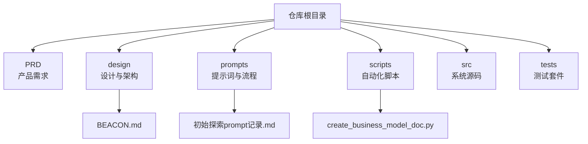
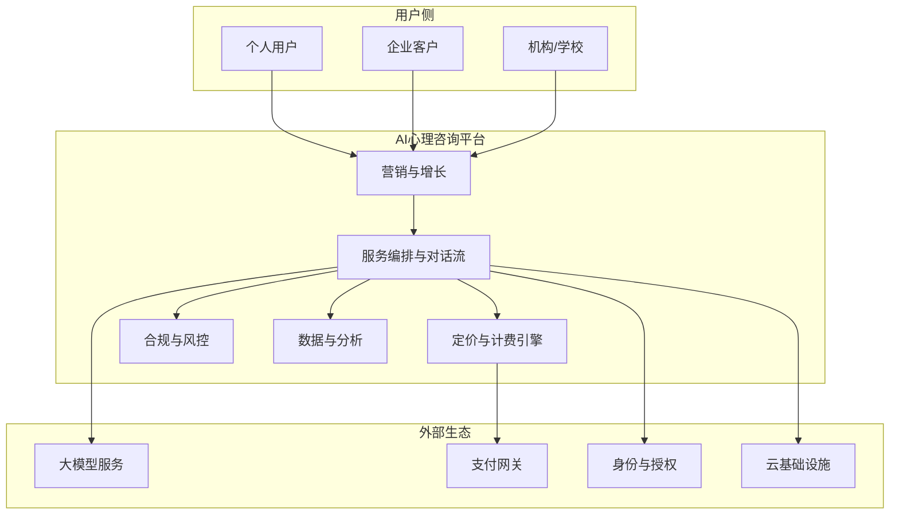
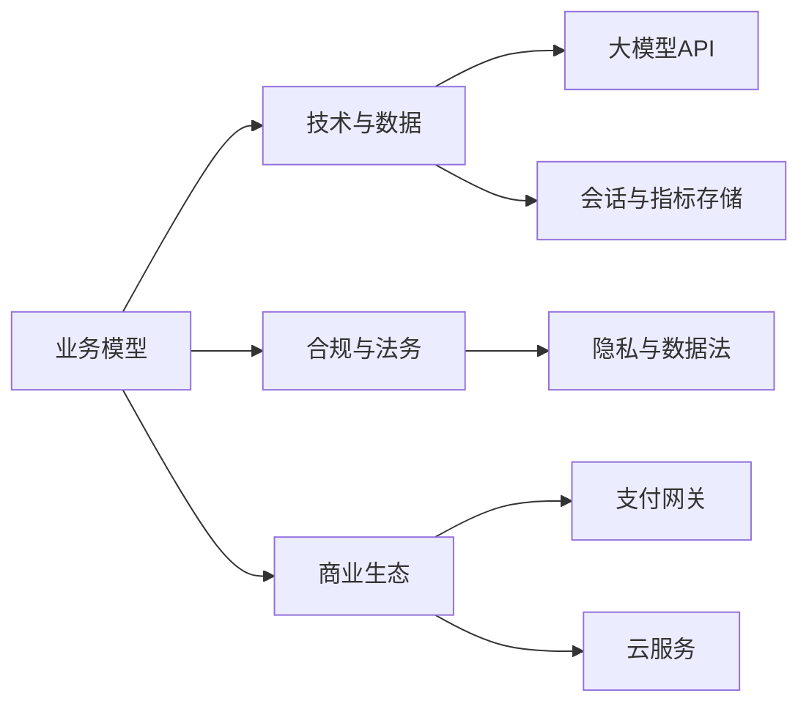

# 业务模型

<cite>
**本文引用的文件**   
- [README.md](file://README.md)
- [STRUCTURE.md](file://STRUCTURE.md)
- [BEACON.md](file://design/BEACON.md)
- [20260529-初始探索prompt记录.md](file://prompts/20260529-初始探索prompt记录.md)
- [create_business_model_doc.py](file://scripts/create_business_model_doc.py)
</cite>

## 目录
1. [引言](#引言)
2. [项目结构](#项目结构)
3. [核心组件](#核心组件)
4. [架构总览](#架构总览)
5. [详细组件分析](#详细组件分析)
6. [依赖分析](#依赖分析)
7. [性能考虑](#性能考虑)
8. [故障排查指南](#故障排查指南)
9. [结论](#结论)
10. [附录](#附录)

## 引言
本文件面向创业者与投资者，提供AI心理咨询系统的全面业务模型文档。内容覆盖商业模式设计、服务定价策略与市场定位分析；目标用户群体、核心价值主张与竞争优势；收入来源、成本结构与盈利模式；市场进入策略、合作伙伴关系与用户增长计划；竞品分析、行业趋势与未来发展规划。文档同时结合仓库中的产品与设计线索，确保商业洞察与技术实现的一致性。

## 项目结构
仓库采用“产品需求-设计-提示词-脚本-源码-测试”的分层组织方式：
- PRD：产品需求文档（待补充）
- design：设计与架构说明（如BEACON）
- prompts：提示词与对话流程设计
- scripts：自动化生成文档与流程的脚本
- src：系统源码（待补充）
- tests：端到端、集成与单元测试（待补充）

图表来源
- [STRUCTURE.md:1-200](file://STRUCTURE.md#L1-L200)
- [BEACON.md:1-200](file://design/BEACON.md#L1-L200)
- [20260529-初始探索prompt记录.md:1-200](file://prompts/20260529-初始探索prompt记录.md#L1-L200)
- [create_business_model_doc.py:1-200](file://scripts/create_business_model_doc.py#L1-L200)

章节来源
- [README.md:1-200](file://README.md#L1-L200)
- [STRUCTURE.md:1-200](file://STRUCTURE.md#L1-L200)

## 核心组件
围绕AI心理咨询的业务模型，建议聚焦以下关键组件：
- 用户分层与价值主张：按人群划分（青少年、职场人、伴侣/家庭、企业EAP），明确痛点与解决方案
- 服务矩阵与定价：免费体验、订阅制、按次付费、企业套餐、增值服务（报告、课程、线下联动）
- 合规与安全：隐私保护、数据最小化、可解释性与人工转接机制
- 渠道与合作：高校心理中心、医院/诊所、企业HR平台、保险与健康险合作
- 运营与增长：内容营销、口碑裂变、KOL/KOC、社区与社群运营
- 指标体系：获客成本、留存率、转化率、ARPU、NPS、危机干预成功率等

章节来源
- [BEACON.md:1-200](file://design/BEACON.md#L1-L200)
- [20260529-初始探索prompt记录.md:1-200](file://prompts/20260529-初始探索prompt记录.md#L1-L200)

## 架构总览
从业务视角看，系统由“用户触达-服务交付-合规风控-商业化变现-数据分析”五环构成，并与外部生态（支付、云资源、第三方LLM、认证与审计）对接。

图表来源
- [BEACON.md:1-200](file://design/BEACON.md#L1-L200)
- [20260529-初始探索prompt记录.md:1-200](file://prompts/20260529-初始探索prompt记录.md#L1-L200)

## 详细组件分析

### 商业模式设计
- 价值主张
  - 可及性：7×24小时即时支持，降低门槛
  - 个性化：基于认知行为疗法（CBT）、正念、动机访谈等方法论的对话式干预
  - 安全性：隐私优先、敏感信息脱敏、危机预警与人工转介
- 收入来源
  - 订阅制：月度/季度/年度会员，含次数或时长配额
  - 按次付费：单次咨询/测评/报告
  - 企业EAP：按席位/按使用量计费，附加培训与管理看板
  - 增值：深度报告、团体课、线下工作坊、保险直付
- 成本结构
  - 可变成本：大模型调用、存储与带宽、支付手续费、客服与审核
  - 固定成本：研发与产品、合规与法务、品牌与渠道、管理与办公
- 盈利模式
  - 订阅为主、按次为辅，提升LTV/CAC比值
  - 通过规模化与模型优化降低边际成本
  - 企业端提高客单价与续约率

章节来源
- [BEACON.md:1-200](file://design/BEACON.md#L1-L200)
- [20260529-初始探索prompt记录.md:1-200](file://prompts/20260529-初始探索prompt记录.md#L1-L200)

### 服务定价策略
- 定价原则
  - 价值导向：以效果与体验为核心，避免单纯价格战
  - 分层清晰：免费体验→基础版→专业版→企业版
  - 透明可预期：包含次数/时长/功能边界，减少隐性费用
- 推荐方案
  - 免费体验：限次/限时，用于拉新与转化
  - 个人订阅：按月/季/年阶梯折扣，绑定权益（报告、专属模板）
  - 按次付费：高净值或低频用户
  - 企业套餐：按席位+用量，含管理后台与合规报表
- 动态调整
  - 基于地区购买力、季节波动、竞争态势进行A/B测试与弹性调价

章节来源
- [BEACON.md:1-200](file://design/BEACON.md#L1-L200)

### 市场定位与目标用户
- 细分人群
  - 青少年与大学生：学业压力、情绪困扰、同伴关系
  - 职场人群：焦虑、倦怠、职业转型
  - 伴侣/家庭：沟通冲突、亲密关系修复
  - 企业EAP：员工心理健康、生产力与留任
- 差异化定位
  - 科学方法论+AI可及性+强合规安全
  - 强调“人机协同”，在高风险场景自动升级至人工专家

章节来源
- [20260529-初始探索prompt记录.md:1-200](file://prompts/20260529-初始探索prompt记录.md#L1-L200)

### 竞争优势分析
- 技术优势：高质量提示词工程、对话流编排、多轮上下文记忆与评估闭环
- 临床有效性：基于循证方法（CBT、正念等）的干预路径与度量
- 合规与信任：隐私保护、数据安全、可解释性与人工兜底
- 生态整合：与企业HR、保险、校园心理中心打通

章节来源
- [BEACON.md:1-200](file://design/BEACON.md#L1-L200)
- [20260529-初始探索prompt记录.md:1-200](file://prompts/20260529-初始探索prompt记录.md#L1-L200)

### 市场进入策略
- 冷启动
  - 种子用户：高校心理中心、创业公司EAP试点
  - 内容驱动：科普文章、短视频、直播答疑
- 渠道拓展
  - 与保险公司健康险捆绑、与HR SaaS平台集成
  - KOL/KOC合作，打造口碑案例
- 区域策略
  - 先深耕一二线城市，再下沉至三四线

章节来源
- [BEACON.md:1-200](file://design/BEACON.md#L1-L200)

### 合作伙伴关系
- 医疗机构/诊所：联合研究、转诊通道、资质背书
- 高校/中学：校园筛查、讲座与工作坊
- 企业：EAP采购、员工福利打包
- 支付与云：稳定结算与弹性算力

章节来源
- [BEACON.md:1-200](file://design/BEACON.md#L1-L200)

### 用户增长计划
- 拉新：SEO/SEM、应用商店、社交媒体投放、裂变邀请
- 激活：新手引导、首单优惠、快速见效任务
- 留存：个性化提醒、进度可视化、成就体系
- 变现：精准推荐升级包、续费折扣、家庭/伴侣共享
- 推荐：老带新奖励、企业内推

章节来源
- [BEACON.md:1-200](file://design/BEACON.md#L1-L200)

### 竞品分析与行业趋势
- 竞品类型
  - AI聊天机器人、在线心理咨询平台、传统热线与线下机构
- 对比维度
  - 可及性、价格、有效性证据、隐私合规、生态整合
- 行业趋势
  - 监管趋严、数据合规要求提升
  - 人机协同成为主流，AI负责初筛与日常陪伴，人类专家处理复杂个案
  - 企业EAP数字化加速

章节来源
- [BEACON.md:1-200](file://design/BEACON.md#L1-L200)

### 未来发展规划
- 短期（0-6个月）
  - 完成MVP上线，跑通订阅与按次付费
  - 建立基础合规与风控流程
- 中期（6-18个月）
  - 拓展企业EAP与保险合作
  - 完善评估量表与效果追踪
- 长期（18个月+）
  - 构建多模态能力（语音/图像辅助）
  - 国际化与本地化合规适配

章节来源
- [BEACON.md:1-200](file://design/BEACON.md#L1-L200)

## 依赖分析
业务模型的关键依赖包括：
- 技术与数据：大模型API、向量检索、会话存储、指标埋点
- 合规与法务：隐私政策、数据处理协议、未成年人保护
- 商业生态：支付、云资源、渠道伙伴

图表来源
- [BEACON.md:1-200](file://design/BEACON.md#L1-L200)

章节来源
- [BEACON.md:1-200](file://design/BEACON.md#L1-L200)

## 性能考虑
- 成本控制：缓存常用回复、批量处理、模型路由与降级策略
- 可用性：多活部署、熔断与重试、监控告警
- 可扩展性：微服务拆分、异步队列、水平扩展
- 质量保障：A/B测试、灰度发布、回归测试

[本节为通用指导，不直接分析具体文件]

## 故障排查指南
- 常见问题
  - 订阅扣费失败：检查支付状态、重试策略与对账日志
  - 对话中断：查看会话存储、消息队列与模型超时
  - 合规风险：触发关键词时是否及时转人工并记录审计日志
- 排障步骤
  - 定位链路：前端→网关→服务→模型/存储
  - 收集指标：错误率、延迟、资源占用
  - 恢复策略：回滚版本、切换备用模型、扩容实例

章节来源
- [BEACON.md:1-200](file://design/BEACON.md#L1-L200)

## 结论
本业务模型以“科学有效、可及普惠、合规可信”为核心，通过订阅与按次双轨收入、企业EAP与生态合作扩大规模，并以持续的技术与合规投入构筑护城河。建议优先验证MVP的商业闭环，随后快速迭代与扩张。

[本节为总结性内容，不直接分析具体文件]

## 附录

### 定价与收入测算框架
- 关键指标
  - 获客成本（CAC）、生命周期价值（LTV）、月活跃用户（MAU）、续费率、ARPU
- 收入公式
  - 订阅收入=订阅用户数×客单价×续费率
  - 按次收入=订单数×客单价
  - 企业收入=席位数×单价+用量加成
- 成本估算
  - 模型调用成本=调用次数×单价
  - 存储与带宽=数据量×单价
  - 人力成本=岗位×薪酬

章节来源
- [create_business_model_doc.py:1-200](file://scripts/create_business_model_doc.py#L1-L200)

### 提示词与对话流程要点
- 角色设定：明确AI助手的专业边界与伦理约束
- 干预路径：CBT结构化提问、情绪识别与反馈、行动建议
- 安全机制：高危信号检测、强制转人工、事后复盘

章节来源
- [20260529-初始探索prompt记录.md:1-200](file://prompts/20260529-初始探索prompt记录.md#L1-L200)
