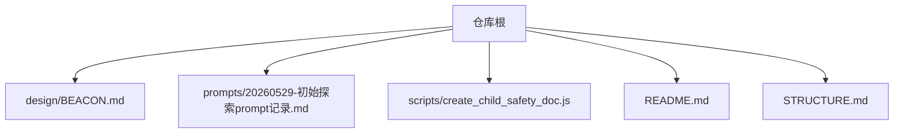
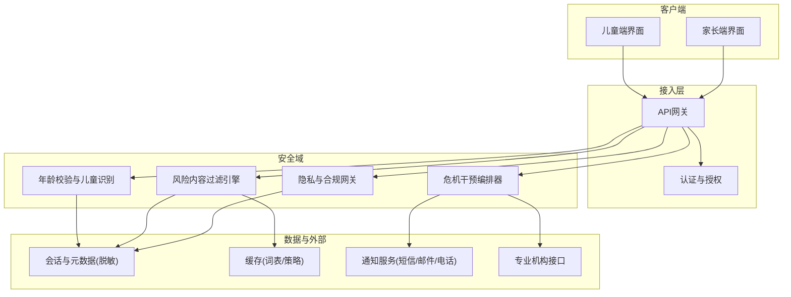
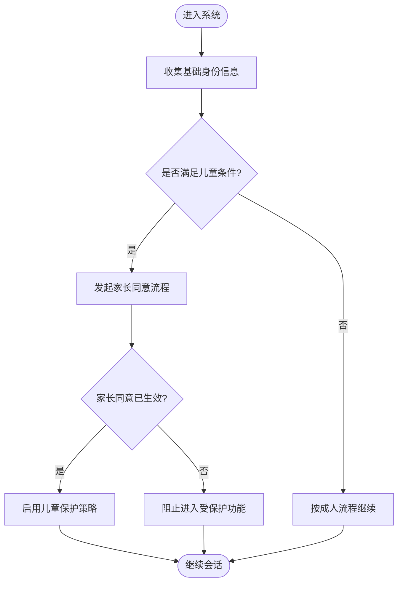
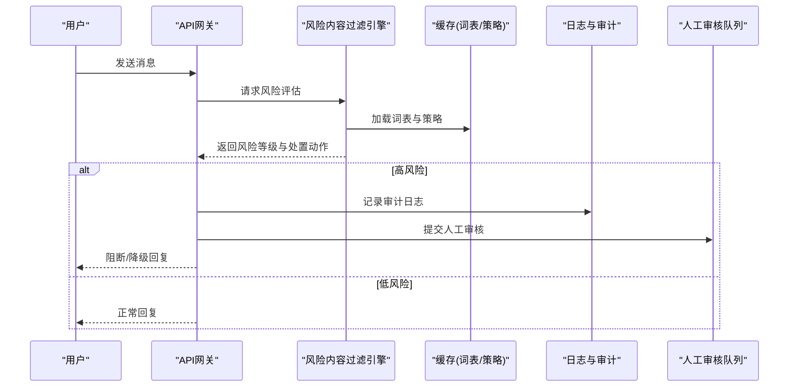
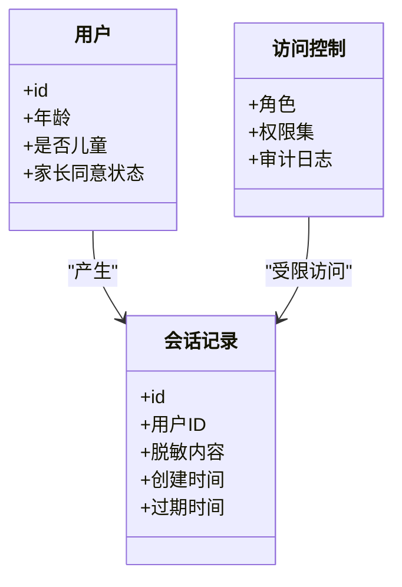
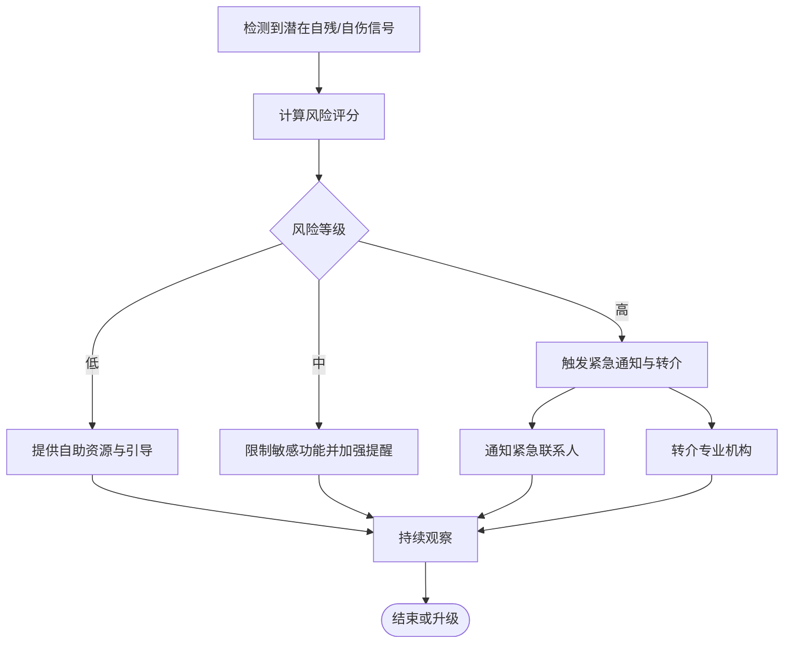
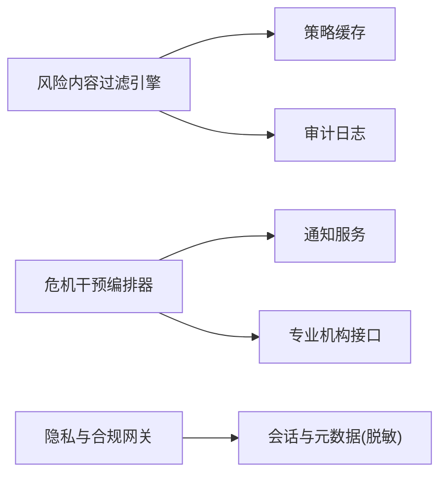

# 儿童安全保护

<cite>
**本文引用的文件**   
- [README.md](file://README.md)
- [STRUCTURE.md](file://STRUCTURE.md)
- [BEACON.md](file://design/BEACON.md)
- [20260529-初始探索prompt记录.md](file://prompts/20260529-初始探索prompt记录.md)
- [create_child_safety_doc.js](file://scripts/create_child_safety_doc.js)
</cite>

## 目录
1. [简介](#简介)
2. [项目结构](#项目结构)
3. [核心组件](#核心组件)
4. [架构总览](#架构总览)
5. [详细组件分析](#详细组件分析)
6. [依赖关系分析](#依赖关系分析)
7. [性能考虑](#性能考虑)
8. [故障排查指南](#故障排查指南)
9. [结论](#结论)
10. [附录](#附录)

## 简介
本技术文档聚焦于AI心理咨询系统中的“儿童安全保护”机制，围绕以下目标展开：
- 儿童用户识别与年龄验证
- 风险内容过滤（敏感词、不当行为识别、自动拦截）
- 儿童隐私保护（数据最小化、家长同意、访问控制）
- 危机干预协议（自残倾向识别、紧急联系人通知、专业机构转介）
- 配置示例、监控指标与故障排查

说明：当前仓库未包含可直接运行的后端或前端实现代码，但存在设计文档、提示词记录与安全脚本。本文基于现有材料进行系统化梳理，并给出可落地的工程化建议与图示，便于后续在src/tests等目录中补充实现。

## 项目结构
从仓库根目录可见，本项目采用“设计+脚本+提示词”的轻量组织方式，尚未包含完整业务代码。关键位置如下：
- design/BEACON.md：系统级设计要点
- prompts/20260529-初始探索prompt记录.md：对话策略与提示词记录
- scripts/create_child_safety_doc.js：生成儿童安全相关文档的脚本入口
- README.md、STRUCTURE.md：项目概览与结构说明

图表来源
- [BEACON.md](file://design/BEACON.md)
- [20260529-初始探索prompt记录.md](file://prompts/20260529-初始探索prompt记录.md)
- [create_child_safety_doc.js](file://scripts/create_child_safety_doc.js)
- [README.md](file://README.md)
- [STRUCTURE.md](file://STRUCTURE.md)

章节来源
- [README.md](file://README.md)
- [STRUCTURE.md](file://STRUCTURE.md)

## 核心组件
围绕儿童安全保护，建议将系统拆分为以下核心组件（概念性设计，待在src下落地实现）：
- 身份与年龄校验服务：负责儿童用户识别、年龄阈值判定、家长同意状态管理
- 风险内容过滤引擎：敏感词库、语义模型、规则引擎、拦截策略
- 隐私与合规网关：数据最小化、脱敏、留存周期、访问控制
- 危机干预编排器：自残/自伤意图识别、分级响应、紧急联系人通知、专业机构转介
- 审计与监控中心：日志、指标、告警、可观测性

章节来源
- [BEACON.md](file://design/BEACON.md)

## 架构总览
下图展示儿童安全保护在整体系统中的分层与交互关系。该图为概念性架构图，用于指导后续在src中的模块划分与接口契约。

[此图为概念性架构示意，不直接映射具体源文件，故无图表来源]

## 详细组件分析

### 儿童用户识别与年龄验证
- 识别依据
  - 注册信息中的出生日期或年龄字段
  - 设备与行为信号辅助判断（如语言风格、使用时段），作为软信号而非唯一依据
- 年龄阈值与策略
  - 小于等于某阈值为“儿童”，启用更强保护策略
  - 大于阈值为“成人”，按常规策略处理
- 家长同意机制
  - 首次登录需完成家长同意流程（电子签名/验证码/绑定监护人账号）
  - 同意状态变更触发重新评估与必要的数据再确认
- 数据最小化
  - 仅采集必要的年龄/同意信息，避免过度收集
  - 对非必要信息进行匿名化或延迟采集

[此流程图用于说明逻辑，不直接映射具体源文件，故无图表来源]

章节来源
- [BEACON.md](file://design/BEACON.md)

### 风险内容过滤系统
- 敏感词汇检测
  - 维护多语种敏感词库，支持动态更新与版本化管理
  - 结合上下文消歧，降低误报
- 不当行为识别
  - 通过规则与轻量模型识别骚扰、诱导、暴力、自伤暗示等
  - 对高风险语句进行降级输出或阻断
- 自动拦截策略
  - 分级处置：警告、限流、阻断、上报人工审核
  - 白名单与例外场景（如求助热线引导）

[此序列图为概念流程示意，不直接映射具体源文件，故无图表来源]

章节来源
- [BEACON.md](file://design/BEACON.md)

### 儿童隐私保护特别措施
- 数据最小化原则
  - 仅保留会话必需字段；删除或缩短非必需字段的留存时间
  - 默认开启匿名化/去标识化
- 家长同意机制
  - 同意范围、有效期、撤回与重新授权
  - 同意记录不可篡改且可审计
- 访问控制
  - 角色与权限分离：儿童、家长、客服、审核员、管理员
  - 最小权限原则与操作留痕

[此图为概念类图示意，不直接映射具体源文件，故无图表来源]

章节来源
- [BEACON.md](file://design/BEACON.md)

### 危机干预协议
- 自残倾向识别
  - 关键词+语义模型双通道识别
  - 置信度阈值与上下文窗口综合判定
- 分级响应
  - 低危：提供心理援助资源与自助工具
  - 中危：加强提醒与限制敏感功能
  - 高危：立即阻断危险话题，推送紧急联系方式，必要时通知紧急联系人
- 紧急联系人通知
  - 经家长同意后，向预设联系人发送标准化预警信息
- 专业机构转介
  - 对接本地心理援助热线或合作机构接口，提供一键转接

[此流程图用于说明逻辑，不直接映射具体源文件，故无图表来源]

章节来源
- [BEACON.md](file://design/BEACON.md)

### 提示词与对话策略中的儿童安全
- 在提示词中嵌入安全约束：拒绝回答有害内容、优先引导求助渠道
- 针对儿童语气与认知水平调整表达，避免复杂术语
- 对可能引发焦虑的内容进行降调处理并提供替代方案

章节来源
- [20260529-初始探索prompt记录.md](file://prompts/20260529-初始探索prompt记录.md)

## 依赖关系分析
- 内部依赖
  - 风险内容过滤引擎依赖词表与策略缓存
  - 危机干预编排器依赖通知服务与外部机构接口
  - 隐私网关依赖数据库与审计日志
- 外部依赖
  - 通知服务（短信/邮件/电话）
  - 专业机构API（热线/转介）
  - 第三方词表/模型服务（可选）

[此图为概念依赖示意，不直接映射具体源文件，故无图表来源]

## 性能考虑
- 词表与策略缓存
  - 热点词表常驻内存，增量热更新，避免全量刷新
- 异步化处理
  - 审计日志、通知发送采用异步队列，降低主链路延迟
- 模型推理优化
  - 小模型先行、大模型兜底；结果缓存命中优先
- 限流与熔断
  - 对高风险路径实施限流，异常时快速降级为规则模式

[本节为通用性能建议，不直接分析具体文件]

## 故障排查指南
- 常见问题定位
  - 词表未生效：检查缓存加载与版本号一致性
  - 拦截误报过多：审查上下文窗口与阈值配置，增加白名单
  - 通知失败：核对通知服务凭证与重试策略
  - 家长同意未生效：核查同意记录与权限同步
- 关键日志与指标
  - 拦截率、误报率、漏报率
  - 平均处理时延、P95/P99时延
  - 通知成功率、转介成功率
  - 家长同意覆盖率与过期率
- 回滚与应急
  - 词表与策略版本回滚
  - 关闭高风险模型，退回纯规则模式
  - 暂停外部转介，切换备用通道

章节来源
- [BEACON.md](file://design/BEACON.md)

## 结论
本仓库目前以设计与提示词为主，尚未包含完整的业务实现。本文基于现有材料提出了一套可落地的儿童安全保护体系，涵盖识别、过滤、隐私、危机干预与可观测性。建议在src目录下逐步补齐各组件的实现与测试，并在tests中完善端到端用例，确保合规与可用性。

[本节为总结性内容，不直接分析具体文件]

## 附录
- 配置示例（概念性）
  - 儿童年龄阈值：例如≤14岁
  - 家长同意有效期：默认12个月，到期前提醒续期
  - 风险阈值：低/中/高三档，对应不同处置动作
  - 词表更新频率：每日增量，重大事件即时更新
- 监控看板建议
  - 实时拦截趋势、风险分布热力图
  - 危机事件数量与时序
  - 家长同意状态分布
  - 外部接口健康度与错误码分布
- 脚本与自动化
  - 可使用现有脚本生成与维护安全文档，保持与实现同步

章节来源
- [create_child_safety_doc.js](file://scripts/create_child_safety_doc.js)