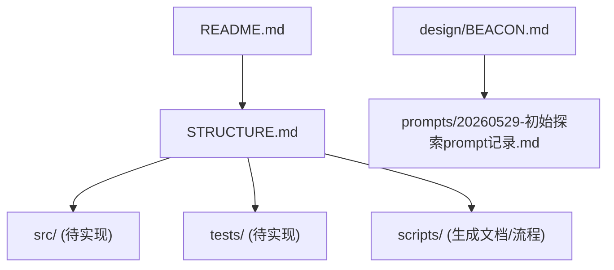
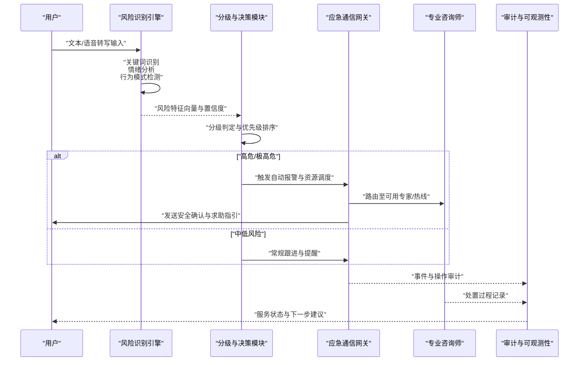
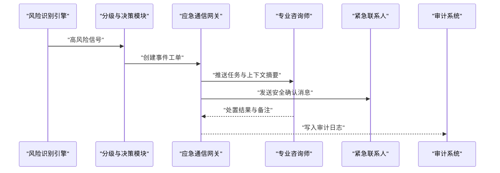
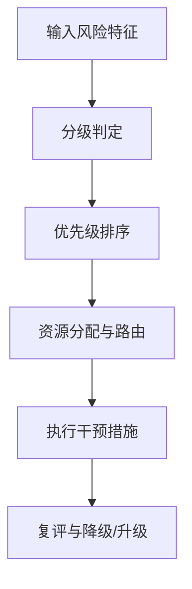
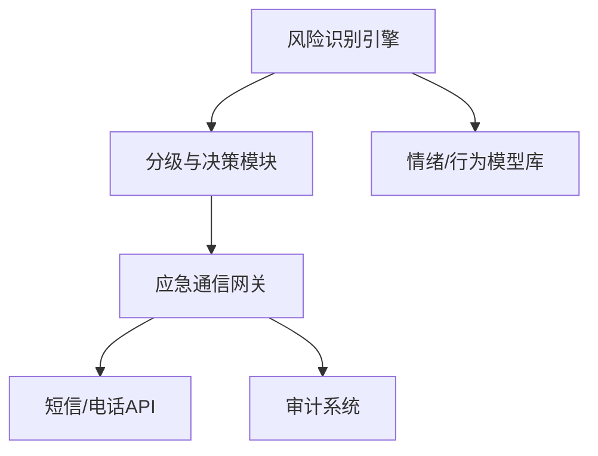

# 危机干预协议

<cite>
**本文引用的文件**   
- [README.md](file://README.md)
- [STRUCTURE.md](file://STRUCTURE.md)
- [BEACON.md](file://design/BEACON.md)
- [20260529-初始探索prompt记录.md](file://prompts/20260529-初始探索prompt记录.md)
</cite>

## 目录
1. [引言](#引言)
2. [项目结构](#项目结构)
3. [核心组件](#核心组件)
4. [架构总览](#架构总览)
5. [详细组件分析](#详细组件分析)
6. [依赖关系分析](#依赖关系分析)
7. [性能考虑](#性能考虑)
8. [故障排查指南](#故障排查指南)
9. [结论](#结论)
10. [附录](#附录)

## 引言
本文件面向AI心理咨询系统的“危机干预协议”技术实现，聚焦以下目标：
- 自杀风险评估算法：关键词识别、情绪分析模型、行为模式检测
- 紧急响应流程：自动报警机制、专业咨询师介入、紧急联系人通知
- 分级分类与优先级排序：危机等级划分、干预措施优先级、资源调配策略
- 多语言与文化敏感性：跨语种沟通模板、文化适配要点、法律合规要求
- API接口定义、错误处理机制与性能优化建议

说明：当前仓库未包含可直接运行的源代码实现。本文基于仓库中的设计文档与提示词记录进行系统化梳理，形成可落地的技术规范与实现蓝图，便于后续工程化落地与扩展。

## 项目结构
仓库采用“设计+提示词+脚本”的轻量组织方式，关键位置如下：
- design/BEACON.md：系统级设计与安全相关的设计要点（如BEACON框架）
- prompts/20260529-初始探索prompt记录.md：对话引导与Prompt设计记录，可作为风险识别与干预话术的基础素材
- README.md、STRUCTURE.md：项目概览与结构说明

图表来源
- [README.md](file://README.md)
- [STRUCTURE.md](file://STRUCTURE.md)
- [BEACON.md](file://design/BEACON.md)
- [20260529-初始探索prompt记录.md](file://prompts/20260529-初始探索prompt记录.md)

章节来源
- [README.md](file://README.md)
- [STRUCTURE.md](file://STRUCTURE.md)

## 核心组件
围绕危机干预协议，建议将系统拆分为以下核心组件（概念性设计，便于后续编码落地）：
- 风险识别引擎
  - 关键词词典与正则匹配器
  - 情绪分析模型（情感极性、强度、语义主题）
  - 行为模式检测（时间序列、频率、上下文一致性）
- 分级与决策模块
  - 危机等级判定（低/中/高/极高）
  - 干预优先级排序（即时/短时/常规）
  - 资源调度策略（热线、在线专家、线下救援）
- 应急通信网关
  - 自动报警（平台内告警、短信/电话API）
  - 专业咨询师路由与排班
  - 紧急联系人通知（隐私保护、授权校验）
- 多语言与文化适配层
  - 术语库与本地化模板
  - 文化敏感规则与禁忌词过滤
  - 合规检查清单（知情同意、最小必要原则）
- 审计与可观测性
  - 事件日志、指标采集、可追溯链路
  - 数据脱敏与访问控制

章节来源
- [BEACON.md](file://design/BEACON.md)
- [20260529-初始探索prompt记录.md](file://prompts/20260529-初始探索prompt记录.md)

## 架构总览
下图展示从用户输入到危机处置的全链路流程，涵盖识别、评估、决策、执行与反馈闭环。

图表来源
- [BEACON.md](file://design/BEACON.md)
- [20260529-初始探索prompt记录.md](file://prompts/20260529-初始探索prompt记录.md)

## 详细组件分析

### 自杀风险评估算法
- 关键词识别
  - 构建多语种关键词词典与同义词扩展；结合上下文窗口避免误报
  - 使用正则与模糊匹配提升召回率，辅以停用词与否定句处理降低误判
- 情绪分析模型
  - 采用情感极性（正/负/中性）与强度评分；结合主题抽取（绝望、无助、自责等）
  - 引入时序特征（会话历史）以捕捉情绪恶化趋势
- 行为模式检测
  - 统计高频负面表达、夜间活跃、长时间沉默后突然激烈表达等异常模式
  - 对重复提及自伤/自杀意图进行加权升级
- 输出
  - 风险分数与置信区间；风险标签集合；建议干预级别

```mermaid
flowchart TD
Start(["输入会话片段"]) --> Pre["预处理与清洗"]
Pre --> KW["关键词匹配与权重计算"]
Pre --> EM["情绪分析极性/强度/主题"]
Pre --> BE["行为模式检测频率/时序/上下文"]
KW --> Fuse["特征融合"]
EM --> Fuse
BE --> Fuse
Fuse --> Score["风险评分与置信度"]
Score --> Classify{"是否达到阈值？"}
Classify --> |是| Escalate["升级至高级别干预"]
Classify --> |否| Monitor["纳入常规监测队列"]
Escalate --> End(["输出干预建议"])
Monitor --> End
```

图表来源
- [20260529-初始探索prompt记录.md](file://prompts/20260529-初始探索prompt记录.md)

章节来源
- [20260529-初始探索prompt记录.md](file://prompts/20260529-初始探索prompt记录.md)

### 紧急响应流程
- 自动报警机制
  - 当风险等级达到预设阈值时，立即触发平台内告警并记录审计日志
  - 通过短信/电话API向指定号码发送结构化预警信息（含匿名化ID与定位摘要）
- 专业咨询师介入
  - 根据地域、语言、专长与可用性进行智能路由
  - 支持一键接入视频/语音/文字会话，提供标准化SOP与话术提示
- 紧急联系人通知
  - 在获得用户授权前提下，向紧急联系人发送安全确认请求
  - 若无法联系或用户拒绝，则继续维持平台内干预并上报上级督导

图表来源
- [BEACON.md](file://design/BEACON.md)

章节来源
- [BEACON.md](file://design/BEACON.md)

### 危机分类分级与优先级排序
- 分级标准（示例）
  - 低危：偶发负面情绪，无明确计划或行动迹象
  - 中危：存在一定消极想法，但可控且具备社会支持
  - 高危：出现具体计划或准备行为，缺乏有效支持
  - 极高危：即刻危险或已实施自伤/自杀行为
- 优先级排序
  - 依据风险等级、时间紧迫性、可及性与资源容量综合排序
  - 动态调整：随新证据更新风险评分与优先级
- 资源调配策略
  - 优先保障高危/极高危案例的快速响应
  - 建立区域化专家池与备用通道，确保峰值时段可用性

图表来源
- [BEACON.md](file://design/BEACON.md)

章节来源
- [BEACON.md](file://design/BEACON.md)

### 多语言支持与沟通模板
- 多语言术语库
  - 统一风险相关术语的多语映射，保证跨语种一致性与可比性
- 文化敏感性
  - 针对地区文化差异定制话术与禁忌词，避免二次伤害
  - 尊重宗教信仰与家庭观念，谨慎涉及敏感话题
- 合规要求
  - 遵循最小必要原则与知情同意；严格数据脱敏与访问控制
  - 保留审计轨迹以满足监管审查

章节来源
- [20260529-初始探索prompt记录.md](file://prompts/20260529-初始探索prompt记录.md)

### API接口定义（建议）
以下为建议的API契约，用于对接风险识别、分级决策与应急通信网关。实际字段与鉴权方案可在工程实现阶段细化。

- 风险识别
  - POST /api/v1/risk/analyze
    - 请求体：会话文本、元数据（语言、地区、时间戳）、历史摘要
    - 返回：风险分数、置信度、风险标签、建议级别
- 分级与决策
  - POST /api/v1/risk/classify
    - 请求体：风险特征向量、阈值配置
    - 返回：等级、优先级、推荐干预措施
- 应急通信
  - POST /api/v1/emergency/alert
    - 请求体：事件ID、风险等级、目标渠道（短信/电话/站内信）
    - 返回：发送状态、回执ID
  - POST /api/v1/emergency/contact
    - 请求体：用户匿名ID、紧急联系人列表、授权令牌
    - 返回：通知结果、重试策略
- 审计与查询
  - GET /api/v1/events/{eventId}
    - 返回：事件详情、处置记录、审计轨迹
  - POST /api/v1/events/{eventId}/update
    - 请求体：处置备注、状态变更
    - 返回：更新结果

注意：以上为接口契约草案，具体参数、错误码与鉴权需在实现中完善。

章节来源
- [BEACON.md](file://design/BEACON.md)

### 错误处理机制（建议）
- 识别失败
  - 回退至保守策略（默认中危），并标记需人工复核
- 通信失败
  - 指数退避重试；失败时切换备用通道并记录告警
- 数据不一致
  - 幂等键去重；冲突时以权威源为准并触发审计告警
- 权限不足
  - 拒绝访问并返回最小必要错误信息；记录访问尝试

章节来源
- [BEACON.md](file://design/BEACON.md)

### 性能优化建议（建议）
- 流式处理与会话滑动窗口，降低延迟
- 关键词与正则预编译，缓存热点词条
- 异步编排：识别、分级、通信并行化，减少端到端时延
- 批量上报与合并：聚合小事件，降低外部API压力
- 弹性扩容：按峰值流量设置水平扩展策略

[本节为通用性能指导，不直接分析具体文件]

## 依赖关系分析
- 内部依赖
  - 风险识别引擎依赖词典与模型库
  - 分级与决策模块依赖风险识别输出与策略配置
  - 应急通信网关依赖外部短信/电话API与内部审计系统
- 外部依赖
  - 第三方通信服务（短信/电话）
  - 可选：地理定位服务（仅在授权与合规前提下）
- 潜在循环依赖
  - 通过事件总线与解耦的消息队列避免紧耦合

图表来源
- [BEACON.md](file://design/BEACON.md)

章节来源
- [BEACON.md](file://design/BEACON.md)

## 性能考虑
- 端到端延迟目标：高危事件从识别到首次外呼/短信应在秒级完成
- 吞吐能力：支持并发高峰场景下的稳定降级与限流
- 可靠性：关键路径具备冗余与快速恢复能力
- 可观测性：全链路追踪与指标看板，便于问题定位与容量规划

[本节为通用性能指导，不直接分析具体文件]

## 故障排查指南
- 常见问题
  - 关键词误报/漏报：检查词典覆盖与上下文窗口大小
  - 情绪分析偏差：校准训练数据与领域适配
  - 通信失败：核对凭证、配额与网络连通性
  - 权限问题：确认授权令牌与最小必要原则
- 诊断步骤
  - 查看事件审计日志与链路追踪
  - 回放会话片段，验证识别与分级逻辑
  - 模拟极端用例进行回归测试

章节来源
- [BEACON.md](file://design/BEACON.md)

## 结论
本文件基于仓库现有设计文档与提示词记录，构建了AI心理咨询系统危机干预协议的技术蓝图。通过风险识别、分级决策、应急通信与多语言文化适配的协同，可实现高效、合规、可审计的危机处置闭环。建议在工程实现阶段补充具体代码、测试与部署规范，持续迭代模型与策略以提升准确性与鲁棒性。

[本节为总结性内容，不直接分析具体文件]

## 附录
- 术语表
  - 风险识别：对用户输入进行关键词、情绪与行为模式的综合分析
  - 分级判定：将风险量化为等级并决定干预优先级
  - 应急通信：通过多渠道触达用户、专家与紧急联系人
- 参考
  - 设计要点与安全框架参见BEACON文档
  - 对话引导与Prompt设计参见提示词记录

章节来源
- [BEACON.md](file://design/BEACON.md)
- [20260529-初始探索prompt记录.md](file://prompts/20260529-初始探索prompt记录.md)
