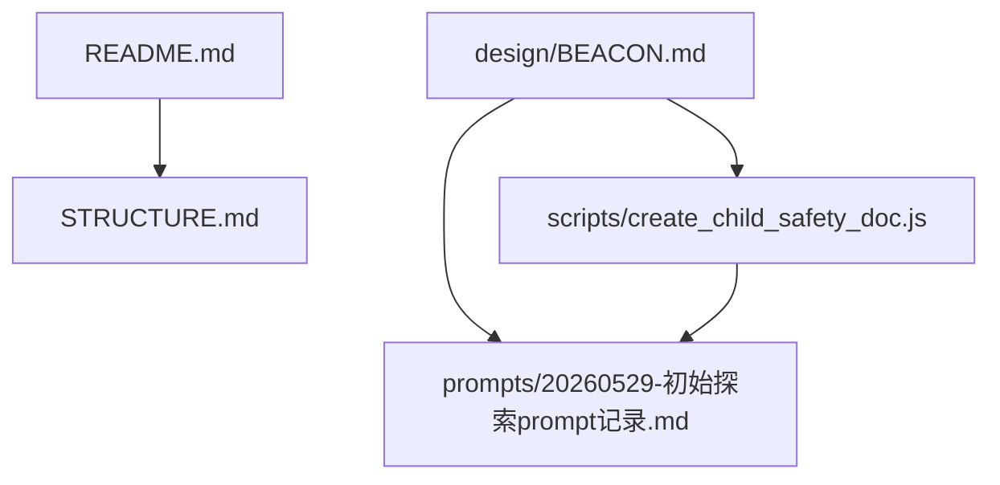
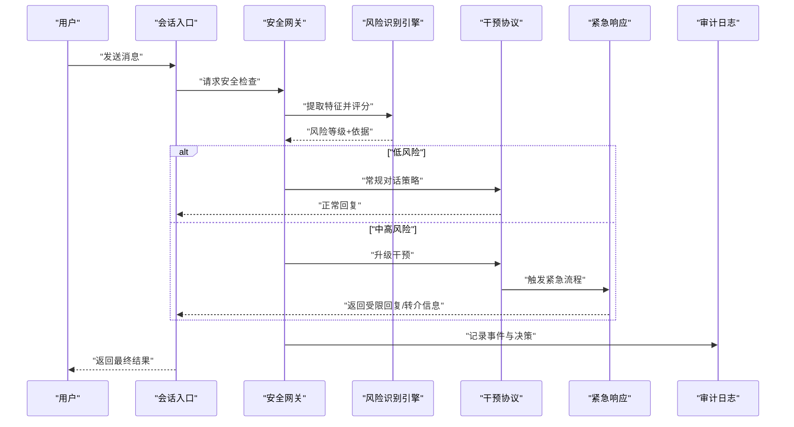
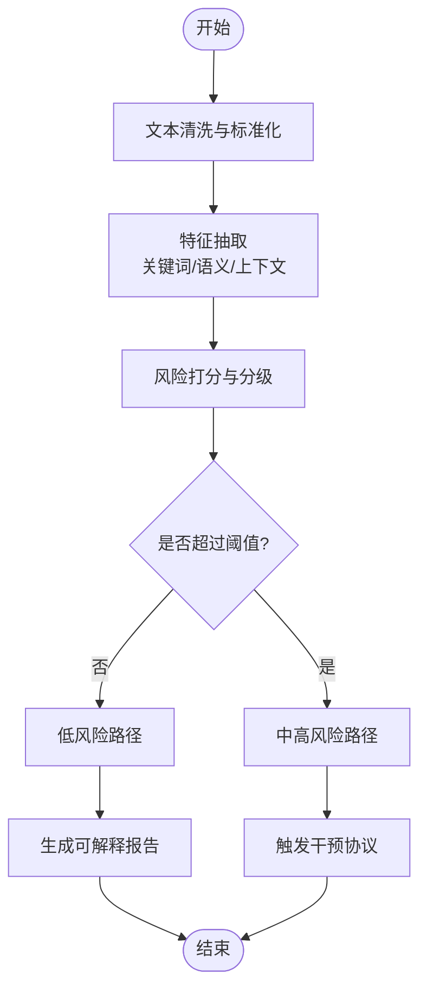
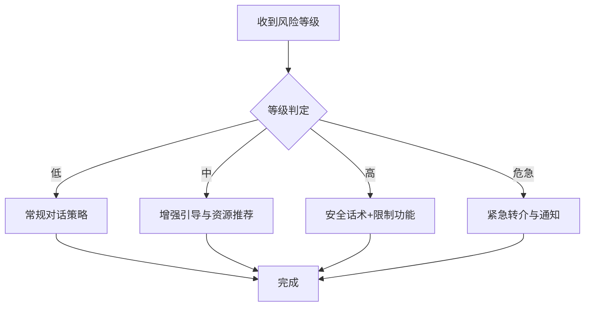
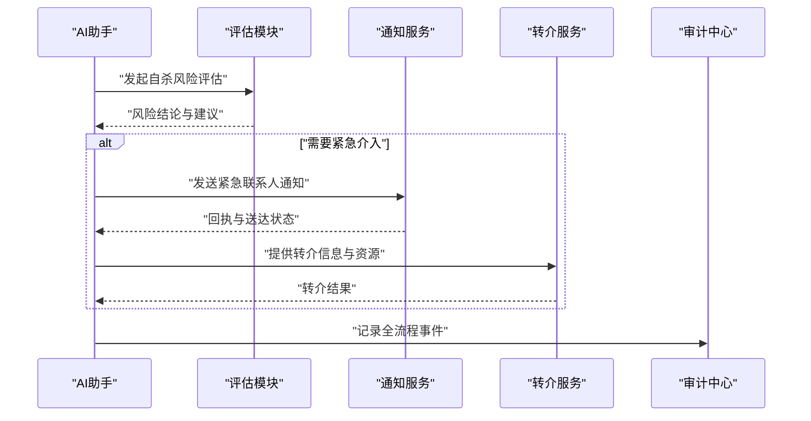
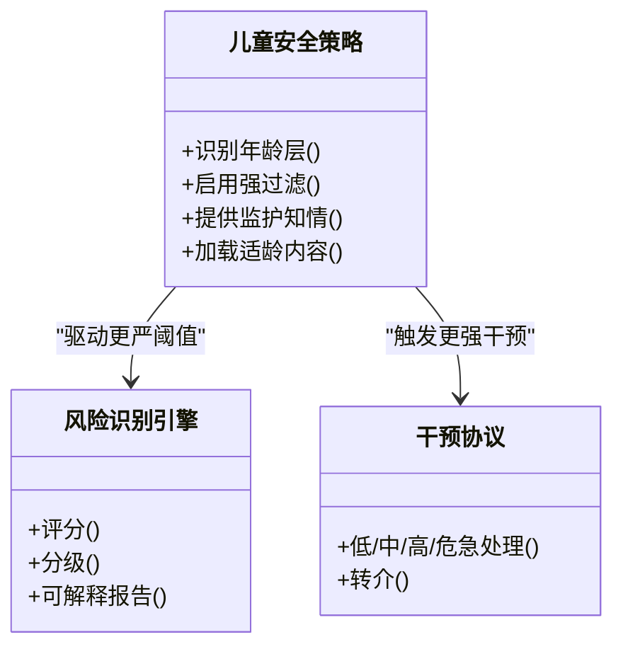
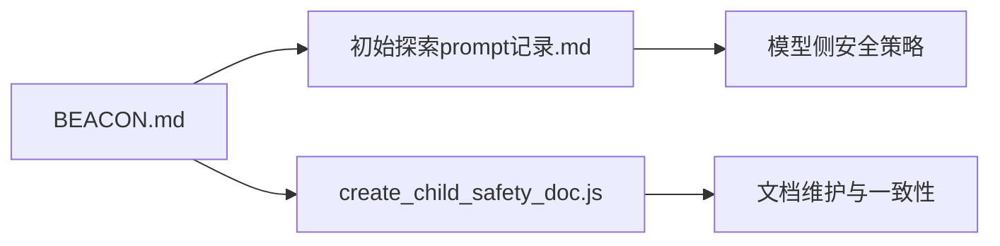

# 安全保护机制

<cite>
**本文引用的文件**   
- [README.md](file://README.md)
- [STRUCTURE.md](file://STRUCTURE.md)
- [BEACON.md](file://design/BEACON.md)
- [20260529-初始探索prompt记录.md](file://prompts/20260529-初始探索prompt记录.md)
- [create_child_safety_doc.js](file://scripts/create_child_safety_doc.js)
</cite>

## 目录
1. [简介](#简介)
2. [项目结构](#项目结构)
3. [核心组件](#核心组件)
4. [架构总览](#架构总览)
5. [详细组件分析](#详细组件分析)
6. [依赖关系分析](#依赖关系分析)
7. [性能与可用性考虑](#性能与可用性考虑)
8. [故障排查指南](#故障排查指南)
9. [结论](#结论)
10. [附录](#附录)

## 简介
本技术文档聚焦于AI心理咨询系统的安全保护机制，围绕儿童安全保护、风险识别算法、干预协议与紧急响应流程展开，同时覆盖用户隐私保护策略、数据安全措施与合规性要求。文档还给出危机干预标准操作流程（自杀风险评估、紧急联系人通知、专业转介）、安全配置指南、监控告警设置与故障排查方法，帮助工程与安全团队在研发与运维中落地可执行的安全方案。

## 项目结构
仓库采用“设计文档 + 提示词资产 + 脚本工具”的组织方式：
- design/BEACON.md：系统级安全与应急设计的总体蓝图与原则
- prompts/20260529-初始探索prompt记录.md：对话模型侧的提示词设计与行为约束
- scripts/create_child_safety_doc.js：用于生成儿童安全相关文档的自动化脚本
- README.md / STRUCTURE.md：项目概览与结构说明

图表来源
- [README.md](file://README.md)
- [STRUCTURE.md](file://STRUCTURE.md)
- [BEACON.md](file://design/BEACON.md)
- [20260529-初始探索prompt记录.md](file://prompts/20260529-初始探索prompt记录.md)
- [create_child_safety_doc.js](file://scripts/create_child_safety_doc.js)

章节来源
- [README.md](file://README.md)
- [STRUCTURE.md](file://STRUCTURE.md)

## 核心组件
- 风险识别层：基于提示词规则与后端分类器协同，对高危语义进行实时检测与分级
- 干预协议层：根据风险等级触发不同干预动作（降级对话、引导求助、强制转介）
- 紧急响应层：对接紧急联系人、热线与外部救援通道，形成闭环处置
- 隐私与合规层：最小化采集、加密存储、访问审计、数据留存与删除策略
- 监控与告警层：关键指标采集、阈值告警、事件溯源与复盘

章节来源
- [BEACON.md](file://design/BEACON.md)
- [20260529-初始探索prompt记录.md](file://prompts/20260529-初始探索prompt记录.md)
- [create_child_safety_doc.js](file://scripts/create_child_safety_doc.js)

## 架构总览
下图展示从用户输入到安全决策与响应的端到端流程，涵盖风险识别、干预与紧急响应。

图表来源
- [BEACON.md](file://design/BEACON.md)
- [20260529-初始探索prompt记录.md](file://prompts/20260529-初始探索prompt记录.md)

## 详细组件分析

### 风险识别算法
- 输入预处理：文本清洗、去标识化、语言与年龄特征抽取
- 多模态信号融合（可选）：结合上下文窗口、历史交互强度与情绪倾向
- 分类与打分：关键词/短语匹配、语义相似度、轻量分类器或大模型辅助判断
- 阈值与分级：低/中/高/危急四级，支持动态阈值与A/B灰度
- 可解释性：输出风险因子与命中规则，便于人工复核与持续优化

图表来源
- [BEACON.md](file://design/BEACON.md)
- [20260529-初始探索prompt记录.md](file://prompts/20260529-初始探索prompt记录.md)

章节来源
- [BEACON.md](file://design/BEACON.md)
- [20260529-初始探索prompt记录.md](file://prompts/20260529-初始探索prompt记录.md)

### 干预协议
- 低风险：保持自然对话，提供心理自助资源链接
- 中风险：增加共情与澄清问题，限制敏感话题，建议线下求助
- 高风险：立即切换至安全话术，停止个性化建议，优先保障人身安全
- 危急：强制转介至专业机构或紧急联系人，必要时联动外部救援

图表来源
- [BEACON.md](file://design/BEACON.md)

章节来源
- [BEACON.md](file://design/BEACON.md)

### 紧急响应流程
- 自杀风险评估：结构化提问、即时风险量化、重复确认与安抚
- 紧急联系人通知：自动推送短信/邮件/电话（按预设模板），附带定位与时间戳
- 专业转介：一键跳转权威热线与就近服务点，提供离线资源包
- 事后复盘：事件归档、责任人与SLA、改进项追踪

图表来源
- [BEACON.md](file://design/BEACON.md)

章节来源
- [BEACON.md](file://design/BEACON.md)

### 儿童安全保护设计
- 年龄识别与分层：注册时收集年龄段，运行时校验；未成年人启用更强防护
- 内容过滤：屏蔽不当词汇、暴力与自伤相关内容，提供适龄替代表达
- 家长/监护人知情：在合规前提下提供必要告知与授权机制
- 学习模式：为未成年用户提供结构化、正向引导的练习任务

图表来源
- [BEACON.md](file://design/BEACON.md)
- [create_child_safety_doc.js](file://scripts/create_child_safety_doc.js)

章节来源
- [BEACON.md](file://design/BEACON.md)
- [create_child_safety_doc.js](file://scripts/create_child_safety_doc.js)

### 隐私保护与数据安全
- 最小化采集：仅收集实现功能所必需的数据，默认关闭非必要字段
- 加密与脱敏：传输TLS、静态AES加密，敏感字段入库前脱敏
- 访问控制：RBAC/ABAC、最小权限、双人审批与操作留痕
- 数据生命周期：保留期策略、定期清理、用户撤回同意后的删除
- 合规对齐：遵循个人信息保护法、未成年人网络保护相关规定及行业最佳实践

章节来源
- [BEACON.md](file://design/BEACON.md)

### 监控告警与可观测性
- 指标采集：风险命中率、误报率、干预成功率、转介转化率、告警延迟
- 阈值与分级：P0/P1/P2告警级别，自动扩容与熔断
- 可视化看板：风险趋势、地域分布、热点话题与异常时段
- 审计与溯源：全链路TraceID、事件快照与回放能力

章节来源
- [BEACON.md](file://design/BEACON.md)

## 依赖关系分析
- 设计文档驱动：BEACON.md作为顶层安全蓝图，指导提示词与脚本的实现
- 提示词约束：通过提示词将安全策略注入模型侧，降低越界风险
- 脚本自动化：使用脚本批量生成与维护儿童安全相关文档，确保一致性

图表来源
- [BEACON.md](file://design/BEACON.md)
- [20260529-初始探索prompt记录.md](file://prompts/20260529-初始探索prompt记录.md)
- [create_child_safety_doc.js](file://scripts/create_child_safety_doc.js)

章节来源
- [BEACON.md](file://design/BEACON.md)
- [20260529-初始探索prompt记录.md](file://prompts/20260529-初始探索prompt记录.md)
- [create_child_safety_doc.js](file://scripts/create_child_safety_doc.js)

## 性能与可用性考虑
- 风险识别延迟：引入缓存与并行计算，保证P99延迟达标
- 降级策略：当外部服务不可用时，回退到本地规则与保守策略
- 容量规划：峰值并发下自动扩缩容，避免雪崩
- 可恢复性：幂等重试、断点续传与事务补偿

[本节为通用指导，不直接分析具体文件]

## 故障排查指南
- 常见问题
  - 风险漏报/误报偏高：检查特征抽取与阈值配置，核对提示词约束
  - 紧急通知未送达：核查通知渠道配额、签名证书与回执状态
  - 转介失败：验证第三方接口连通性与参数映射
- 定位步骤
  - 通过TraceID检索全链路日志，关注风险评分与决策分支
  - 对比告警时间与业务指标曲线，定位异常窗口
  - 复现实例：使用事件快照回放，验证修复效果
- 预防与演练
  - 定期红蓝对抗与混沌演练
  - 建立SOP与值班手册，明确升级路径

章节来源
- [BEACON.md](file://design/BEACON.md)

## 结论
本安全保护机制以“风险识别—干预协议—紧急响应—隐私合规—监控告警”为主线，形成闭环治理。通过提示词约束与后端引擎协同，既保障用户体验，又守住安全底线。建议在上线前完成合规评审、压力测试与应急演练，持续迭代风险库与阈值策略。

[本节为总结性内容，不直接分析具体文件]

## 附录
- 术语表
  - 风险分级：低/中/高/危急
  - 转介：将用户引导至专业机构或紧急联系人
  - 可解释性：输出风险因子与命中规则，便于人工复核
- 参考清单
  - 设计蓝图：BEACON.md
  - 提示词资产：初始探索prompt记录.md
  - 文档脚本：create_child_safety_doc.js

章节来源
- [BEACON.md](file://design/BEACON.md)
- [20260529-初始探索prompt记录.md](file://prompts/20260529-初始探索prompt记录.md)
- [create_child_safety_doc.js](file://scripts/create_child_safety_doc.js)