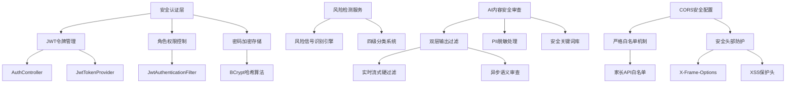
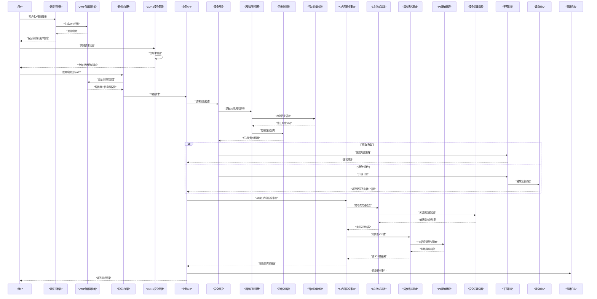
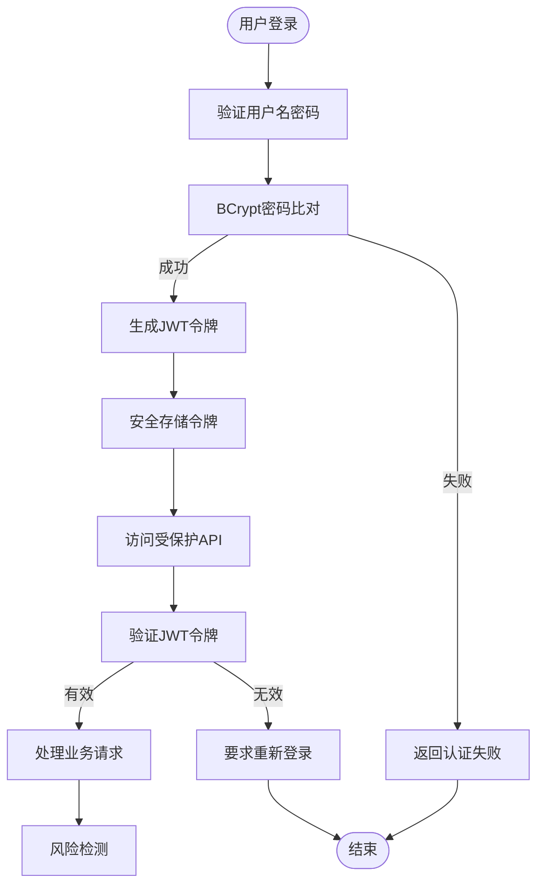
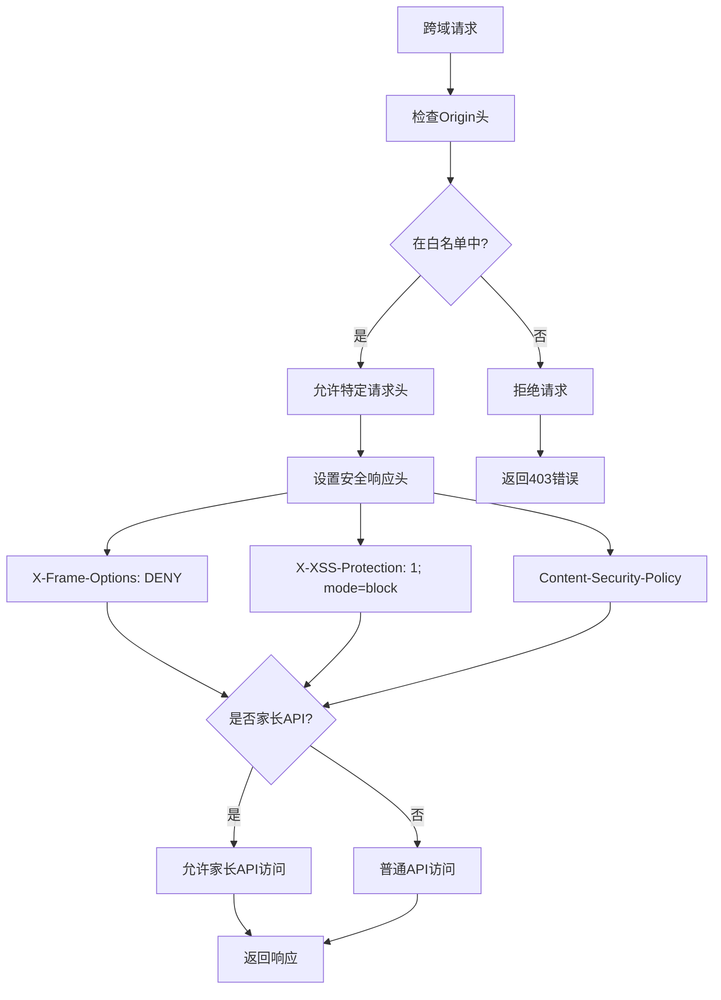
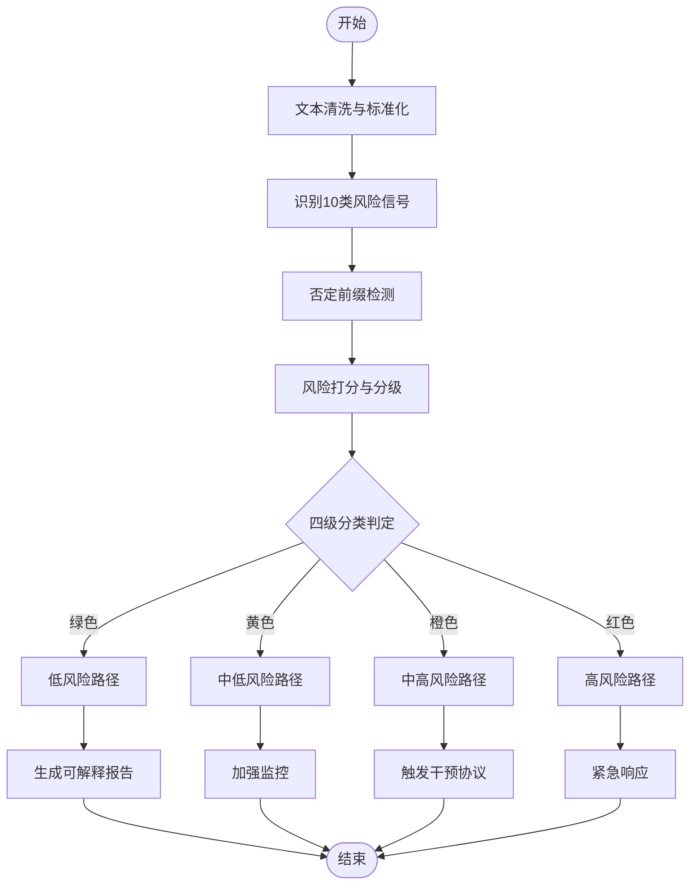
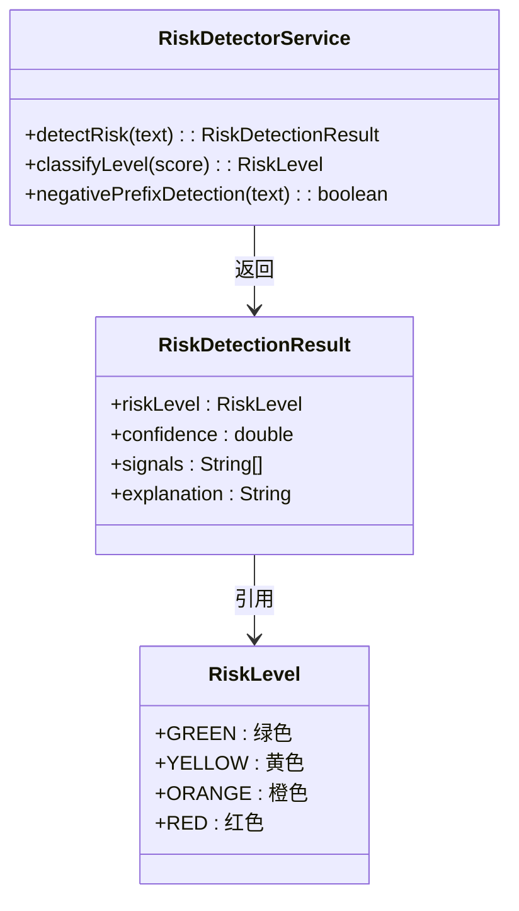
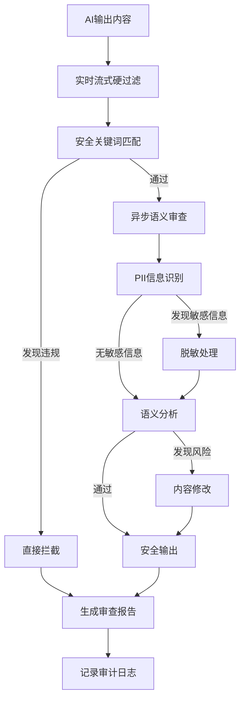
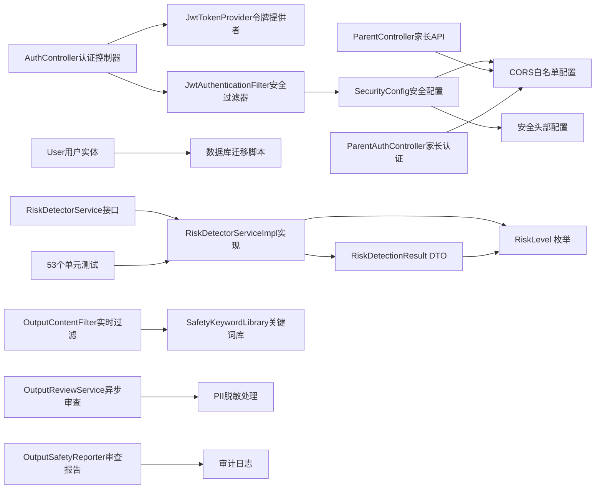

# 安全保护机制

<cite>
**本文引用的文件**   
- [README.md](file://README.md)
- [STRUCTURE.md](file://STRUCTURE.md)
- [AuthController.java](file://backend/counseling-api/src/main/java/com/mindsafe/api/controller/AuthController.java)
- [JwtTokenProvider.java](file://backend/counseling-api/src/main/java/com/mindsafe/api/security/JwtTokenProvider.java)
- [JwtAuthenticationFilter.java](file://backend/counseling-api/src/main/java/com/mindsafe/api/security/JwtAuthenticationFilter.java)
- [SecurityConfig.java](file://backend/counseling-api/src/main/java/com/mindsafe/api/config/SecurityConfig.java)
- [User.java](file://backend/counseling-domain/src/main/java/com/mindsafe/domain/entity/User.java)
- [V5__add_password_hash.sql](file://backend/counseling-app/src/main/resources/db/migration/V5__add_password_hash.sql)
- [RiskDetectorService.java](file://backend/counseling-ai/src/main/java/com/mindsafe/ai/risk/RiskDetectorService.java)
- [RiskDetectorServiceImpl.java](file://backend/counseling-ai/src/main/java/com/mindsafe/ai/risk/RiskDetectorServiceImpl.java)
- [RiskDetectorServiceImplTest.java](file://backend/counseling-ai/src/test/java/com/mindsafe/ai/risk/RiskDetectorServiceImplTest.java)
- [RiskDetectionResult.java](file://backend/counseling-common/src/main/java/com/mindsafe/common/dto/risk/RiskDetectionResult.java)
- [RiskLevel.java](file://backend/counseling-common/src/main/java/com/mindsafe/common/enums/RiskLevel.java)
- [OutputContentFilter.java](file://backend/counseling-ai/src/main/java/com/mindsafe/ai/safety/OutputContentFilter.java)
- [OutputReviewService.java](file://backend/counseling-ai/src/main/java/com/mindsafe/ai/safety/OutputReviewService.java)
- [OutputSafetyReporter.java](file://backend/counseling-ai/src/main/java/com/mindsafe/ai/safety/OutputSafetyReporter.java)
- [SafetyKeywordLibrary.java](file://backend/counseling-ai/src/main/java/com/mindsafe/ai/safety/SafetyKeywordLibrary.java)
- [safety_output_guard_zh-CN_v1.0.0.md](file://backend/counseling-ai/src/main/resources/prompts/safety/safety_output_guard_zh-CN_v1.0.0.md)
- [output-sensitive-keywords.json](file://backend/counseling-ai/src/main/resources/safety/output-sensitive-keywords.json)
- [ParentController.java](file://backend/counseling-api/src/main/java/com/mindsafe/api/controller/ParentController.java)
- [ParentAuthController.java](file://backend/counseling-api/src/main/java/com/mindsafe/api/controller/ParentAuthController.java)
</cite>

## 更新摘要
**变更内容**   
- 新增CORS配置的严格白名单机制，限制跨域请求来源
- 添加X-Frame-Options和XSS保护头等安全头部配置
- 家长API端点/api/v1/parent/**被明确列入CORS白名单
- 增强跨域访问控制策略，提升系统安全性

## 目录
1. [简介](#简介)
2. [项目结构](#项目结构)
3. [核心组件](#核心组件)
4. [架构总览](#架构总览)
5. [详细组件分析](#详细组件分析)
6. [依赖关系分析](#依赖关系分析)
7. [性能与可用性考虑](#性能与可用性考虑)
8. [故障排查指南](#故障排查指南)
9. [结论](#结论)
10. [附录](#附录)

## 简介
本技术文档聚焦于AI心理咨询系统的安全保护机制，围绕儿童安全保护、风险识别算法、干预协议与紧急响应流程展开，同时覆盖用户隐私保护策略、数据安全措施与合规性要求。文档还给出危机干预标准操作流程（自杀风险评估、紧急联系人通知、专业转介）、安全配置指南、监控告警设置与故障排查方法，帮助工程与安全团队在研发与运维中落地可执行的安全方案。

**更新** 本次更新重点介绍了新增的CORS严格白名单机制和安全头部配置，包括X-Frame-Options和XSS防护头，以及家长API端点的专门白名单配置，进一步增强了系统的跨域访问控制和安全防护能力。

## 项目结构
仓库采用"设计文档 + 提示词资产 + 脚本工具"的组织方式：
- backend/counseling-api：API接口层，包含认证控制器和安全过滤器
- backend/counseling-domain：领域模型层，包含用户实体和数据映射
- backend/counseling-app：应用启动层，包含数据库迁移脚本
- backend/counseling-ai：风险检测服务核心实现，新增安全审查模块
- backend/counseling-common：通用数据传输对象和枚举定义

图表来源
- [AuthController.java](file://backend/counseling-api/src/main/java/com/mindsafe/api/controller/AuthController.java)
- [JwtTokenProvider.java](file://backend/counseling-api/src/main/java/com/mindsafe/api/security/JwtTokenProvider.java)
- [JwtAuthenticationFilter.java](file://backend/counseling-api/src/main/java/com/mindsafe/api/security/JwtAuthenticationFilter.java)
- [SecurityConfig.java](file://backend/counseling-api/src/main/java/com/mindsafe/api/config/SecurityConfig.java)
- [RiskDetectorService.java](file://backend/counseling-ai/src/main/java/com/mindsafe/ai/risk/RiskDetectorService.java)
- [OutputContentFilter.java](file://backend/counseling-ai/src/main/java/com/mindsafe/ai/safety/OutputContentFilter.java)
- [OutputReviewService.java](file://backend/counseling-api/src/main/java/com/mindsafe/ai/safety/OutputReviewService.java)
- [SafetyKeywordLibrary.java](file://backend/counseling-ai/src/main/java/com/mindsafe/ai/safety/SafetyKeywordLibrary.java)
- [ParentController.java](file://backend/counseling-api/src/main/java/com/mindsafe/api/controller/ParentController.java)
- [ParentAuthController.java](file://backend/counseling-api/src/main/java/com/mindsafe/api/controller/ParentAuthController.java)

章节来源
- [README.md](file://README.md)
- [STRUCTURE.md](file://STRUCTURE.md)

## 核心组件
- **认证授权层**：基于JWT的无状态认证机制，支持令牌签发、验证和刷新
- **角色权限控制**：细粒度的RBAC权限管理，支持用户角色和操作权限控制
- **密码安全**：BCrypt强哈希算法，防止密码泄露和彩虹表攻击
- **安全过滤器**：请求级安全拦截，自动验证JWT令牌和权限
- **风险识别层**：基于10类风险信号的全面检测，支持实时分析与精准分级
- **四级分类系统**：红/橙/黄/绿四级风险等级，提供细粒度的风险管控
- **否定前缀检测**：智能识别否定语义，避免误判和漏判
- **AI内容安全审查**：双层输出过滤机制，确保AI生成内容的安全性
- **PII脱敏处理**：自动识别和脱敏个人身份信息，保护用户隐私
- **安全关键词库**：动态管理敏感词汇，支持实时更新和版本控制
- **CORS安全配置**：严格的跨域访问白名单机制，限制请求来源
- **安全头部防护**：X-Frame-Options防点击劫持，XSS保护头防跨站脚本攻击
- **家长API专用白名单**：为家长端API提供专门的跨域访问配置
- **干预协议层**：根据风险等级触发不同干预动作（降级对话、引导求助、强制转介）
- **紧急响应层**：对接紧急联系人、热线与外部救援通道，形成闭环处置
- **隐私与合规层**：最小化采集、加密存储、访问审计、数据留存与删除策略
- **监控与告警层**：关键指标采集、阈值告警、事件溯源与复盘

**更新** 新增了CORS安全配置和安全头部防护的详细实现，包括严格的白名单机制和家长API专用白名单配置。

章节来源
- [AuthController.java](file://backend/counseling-api/src/main/java/com/mindsafe/api/controller/AuthController.java)
- [JwtTokenProvider.java](file://backend/counseling-api/src/main/java/com/mindsafe/api/security/JwtTokenProvider.java)
- [JwtAuthenticationFilter.java](file://backend/counseling-api/src/main/java/com/mindsafe/api/security/JwtAuthenticationFilter.java)
- [SecurityConfig.java](file://backend/counseling-api/src/main/java/com/mindsafe/api/config/SecurityConfig.java)
- [RiskDetectorService.java](file://backend/counseling-ai/src/main/java/com/mindsafe/ai/risk/RiskDetectorService.java)
- [RiskDetectorServiceImpl.java](file://backend/counseling-ai/src/main/java/com/mindsafe/ai/risk/RiskDetectorServiceImpl.java)
- [OutputContentFilter.java](file://backend/counseling-ai/src/main/java/com/mindsafe/ai/safety/OutputContentFilter.java)
- [OutputReviewService.java](file://backend/counseling-ai/src/main/java/com/mindsafe/ai/safety/OutputReviewService.java)
- [SafetyKeywordLibrary.java](file://backend/counseling-ai/src/main/java/com/mindsafe/ai/safety/SafetyKeywordLibrary.java)
- [RiskDetectionResult.java](file://backend/counseling-common/src/main/java/com/mindsafe/common/dto/risk/RiskDetectionResult.java)
- [RiskLevel.java](file://backend/counseling-common/src/main/java/com/mindsafe/common/enums/RiskLevel.java)
- [ParentController.java](file://backend/counseling-api/src/main/java/com/mindsafe/api/controller/ParentController.java)
- [ParentAuthController.java](file://backend/counseling-api/src/main/java/com/mindsafe/api/controller/ParentAuthController.java)

## 架构总览
下图展示从用户登录到安全决策与响应的端到端流程，涵盖认证授权、风险识别、AI内容安全审查、CORS安全配置、干预与紧急响应。

图表来源
- [AuthController.java](file://backend/counseling-api/src/main/java/com/mindsafe/api/controller/AuthController.java)
- [JwtTokenProvider.java](file://backend/counseling-api/src/main/java/com/mindsafe/api/security/JwtTokenProvider.java)
- [JwtAuthenticationFilter.java](file://backend/counseling-api/src/main/java/com/mindsafe/api/security/JwtAuthenticationFilter.java)
- [SecurityConfig.java](file://backend/counseling-api/src/main/java/com/mindsafe/api/config/SecurityConfig.java)
- [RiskDetectorServiceImpl.java](file://backend/counseling-ai/src/main/java/com/mindsafe/ai/risk/RiskDetectorServiceImpl.java)
- [OutputContentFilter.java](file://backend/counseling-ai/src/main/java/com/mindsafe/ai/safety/OutputContentFilter.java)
- [OutputReviewService.java](file://backend/counseling-ai/src/main/java/com/mindsafe/ai/safety/OutputReviewService.java)
- [SafetyKeywordLibrary.java](file://backend/counseling-ai/src/main/java/com/mindsafe/ai/safety/SafetyKeywordLibrary.java)
- [RiskLevel.java](file://backend/counseling-common/src/main/java/com/mindsafe/common/enums/RiskLevel.java)
- [ParentController.java](file://backend/counseling-api/src/main/java/com/mindsafe/api/controller/ParentController.java)
- [ParentAuthController.java](file://backend/counseling-api/src/main/java/com/mindsafe/api/controller/ParentAuthController.java)

## 详细组件分析

### JWT认证系统实现
- **令牌签发**：用户认证成功后生成包含用户ID、角色和权限的JWT令牌
- **令牌验证**：请求到达时自动验证令牌签名、有效期和完整性
- **令牌刷新**：支持令牌过期前的自动续期机制
- **安全存储**：前端安全存储令牌，后端不保存会话状态
- **跨域支持**：配置安全的跨域资源共享策略

**更新** 新增了JWT认证系统的详细实现说明，包括令牌生命周期管理和安全存储策略。

图表来源
- [AuthController.java](file://backend/counseling-api/src/main/java/com/mindsafe/api/controller/AuthController.java)
- [JwtTokenProvider.java](file://backend/counseling-api/src/main/java/com/mindsafe/api/security/JwtTokenProvider.java)
- [JwtAuthenticationFilter.java](file://backend/counseling-api/src/main/java/com/mindsafe/api/security/JwtAuthenticationFilter.java)

章节来源
- [AuthController.java](file://backend/counseling-api/src/main/java/com/mindsafe/api/controller/AuthController.java)
- [JwtTokenProvider.java](file://backend/counseling-api/src/main/java/com/mindsafe/api/security/JwtTokenProvider.java)
- [JwtAuthenticationFilter.java](file://backend/counseling-api/src/main/java/com/mindsafe/api/security/JwtAuthenticationFilter.java)

### 角色权限控制（RBAC）
- **角色定义**：学生、教师、管理员等不同角色类型
- **权限分配**：基于角色的操作权限精细化控制
- **资源访问**：API级别的资源访问权限控制
- **动态授权**：运行时动态检查用户权限
- **权限继承**：支持角色层级和权限继承机制

**更新** 新增了角色权限控制的详细实现说明，包括权限模型和访问控制策略。

章节来源
- [SecurityConfig.java](file://backend/counseling-api/src/main/java/com/mindsafe/api/config/SecurityConfig.java)
- [JwtAuthenticationFilter.java](file://backend/counseling-api/src/main/java/com/mindsafe/api/security/JwtAuthenticationFilter.java)

### 密码安全存储
- **BCrypt算法**：使用BCrypt强哈希算法进行密码加密
- **盐值随机**：每个密码使用独立随机盐值，防止彩虹表攻击
- **成本因子**：可配置的哈希计算复杂度，平衡安全性和性能
- **向后兼容**：支持旧版本明文密码的自动迁移
- **安全传输**：HTTPS全链路加密传输

**更新** 新增了密码安全存储的详细实现说明，包括BCrypt算法配置和密码迁移策略。

章节来源
- [User.java](file://backend/counseling-domain/src/main/java/com/mindsafe/domain/entity/User.java)
- [V5__add_password_hash.sql](file://backend/counseling-app/src/main/resources/db/migration/V5__add_password_hash.sql)

### CORS安全配置与白名单机制
- **严格白名单机制**：仅允许预定义的域名来源进行跨域访问
- **家长API专用白名单**：为/api/v1/parent/**端点配置专门的跨域访问规则
- **安全头部防护**：
  - X-Frame-Options: DENY防止点击劫持攻击
  - X-XSS-Protection: 1; mode=block启用XSS过滤器
  - Content-Security-Policy: 限制资源加载来源
- **动态配置管理**：支持运行时更新允许的域名列表
- **请求验证**：对Origin头进行严格验证，拒绝未授权的跨域请求

**更新** 新增了CORS安全配置的完整实现说明，这是本次更新的核心功能之一。

图表来源
- [SecurityConfig.java](file://backend/counseling-api/src/main/java/com/mindsafe/api/config/SecurityConfig.java)
- [ParentController.java](file://backend/counseling-api/src/main/java/com/mindsafe/api/controller/ParentController.java)
- [ParentAuthController.java](file://backend/counseling-api/src/main/java/com/mindsafe/api/controller/ParentAuthController.java)

章节来源
- [SecurityConfig.java](file://backend/counseling-api/src/main/java/com/mindsafe/api/config/SecurityConfig.java)
- [ParentController.java](file://backend/counseling-api/src/main/java/com/mindsafe/api/controller/ParentController.java)
- [ParentAuthController.java](file://backend/counseling-api/src/main/java/com/mindsafe/api/controller/ParentAuthController.java)

### 风险识别算法
- **输入预处理**：文本清洗、去标识化、语言与年龄特征抽取
- **10类风险信号识别**：自伤、暴力、抑郁、焦虑、创伤、成瘾、人际关系、学业压力、家庭问题、其他心理困扰
- **否定前缀检测**：智能识别"不"、"没"、"非"等否定词，避免语义反转导致的误判
- **四级分类系统**：
  - 🟢 绿色：低风险，常规关注
  - 🟡 黄色：中等风险，加强引导
  - 🟠 橙色：高风险，立即干预
  - 🔴 红色：极高风险，紧急响应
- **多模态信号融合**：结合上下文窗口、历史交互强度与情绪倾向
- **可解释性**：输出风险因子与命中规则，便于人工复核与持续优化

**更新** 新增了10类具体风险信号和四级分类系统的详细说明，以及否定前缀检测的实现原理。

图表来源
- [RiskDetectorServiceImpl.java](file://backend/counseling-ai/src/main/java/com/mindsafe/ai/risk/RiskDetectorServiceImpl.java)
- [RiskLevel.java](file://backend/counseling-common/src/main/java/com/mindsafe/common/enums/RiskLevel.java)

章节来源
- [RiskDetectorService.java](file://backend/counseling-ai/src/main/java/com/mindsafe/ai/risk/RiskDetectorService.java)
- [RiskDetectorServiceImpl.java](file://backend/counseling-ai/src/main/java/com/mindsafe/ai/risk/RiskDetectorServiceImpl.java)
- [RiskDetectionResult.java](file://backend/counseling-common/src/main/java/com/mindsafe/common/dto/risk/RiskDetectionResult.java)

### 四级分类系统实现
- **绿色（Green）**：无显著风险信号，维持正常对话流程
- **黄色（Yellow）**：轻微风险信号，增加关注度和引导性提问
- **橙色（Orange）**：明显风险信号，启动强化干预措施
- **红色（Red）**：严重风险信号，立即触发紧急响应协议

**更新** 新增了四级分类系统的详细实现说明，包括每个等级的具体处理逻辑。

图表来源
- [RiskLevel.java](file://backend/counseling-common/src/main/java/com/mindsafe/common/enums/RiskLevel.java)
- [RiskDetectionResult.java](file://backend/counseling-common/src/main/java/com/mindsafe/common/dto/risk/RiskDetectionResult.java)
- [RiskDetectorService.java](file://backend/counseling-ai/src/main/java/com/mindsafe/ai/risk/RiskDetectorService.java)

章节来源
- [RiskLevel.java](file://backend/counseling-common/src/main/java/com/mindsafe/common/enums/RiskLevel.java)
- [RiskDetectionResult.java](file://backend/counseling-common/src/main/java/com/mindsafe/common/dto/risk/RiskDetectionResult.java)
- [RiskDetectorService.java](file://backend/counseling-ai/src/main/java/com/mindsafe/ai/risk/RiskDetectorService.java)

### 否定前缀检测算法
- **关键词识别**：检测"不"、"没"、"非"、"无"、"未"等否定词
- **语义位置分析**：确定否定词对后续语义的影响范围
- **权重调整**：根据否定程度调整风险评分
- **上下文关联**：结合前后文判断否定的真实含义

**更新** 新增了否定前缀检测算法的详细实现说明。

章节来源
- [RiskDetectorServiceImpl.java](file://backend/counseling-ai/src/main/java/com/mindsafe/ai/risk/RiskDetectorServiceImpl.java)

### AI内容安全审查系统
- **双层过滤架构**：
  - **实时流式硬过滤**：在AI输出流式传输过程中进行即时内容检查，拦截明显违规内容
  - **异步语义审查**：对通过实时过滤的内容进行深度语义分析，检测潜在风险
- **PII脱敏处理**：自动识别姓名、身份证号、电话号码、邮箱等个人身份信息并进行脱敏处理
- **安全关键词库**：维护敏感词汇列表，支持动态更新和版本管理
- **配置管理**：提供灵活的配置选项，支持不同场景下的安全策略定制
- **审查报告**：生成详细的安全审查报告，包含违规内容类型、处理方式和时间戳

**更新** 新增了AI内容安全审查系统的完整实现说明，这是本次更新的核心功能。

图表来源
- [OutputContentFilter.java](file://backend/counseling-ai/src/main/java/com/mindsafe/ai/safety/OutputContentFilter.java)
- [OutputReviewService.java](file://backend/counseling-ai/src/main/java/com/mindsafe/ai/safety/OutputReviewService.java)
- [SafetyKeywordLibrary.java](file://backend/counseling-ai/src/main/java/com/mindsafe/ai/safety/SafetyKeywordLibrary.java)

章节来源
- [OutputContentFilter.java](file://backend/counseling-ai/src/main/java/com/mindsafe/ai/safety/OutputContentFilter.java)
- [OutputReviewService.java](file://backend/counseling-ai/src/main/java/com/mindsafe/ai/safety/OutputReviewService.java)
- [OutputSafetyReporter.java](file://backend/counseling-ai/src/main/java/com/mindsafe/ai/safety/OutputSafetyReporter.java)
- [SafetyKeywordLibrary.java](file://backend/counseling-ai/src/main/java/com/mindsafe/ai/safety/SafetyKeywordLibrary.java)
- [safety_output_guard_zh-CN_v1.0.0.md](file://backend/counseling-ai/src/main/resources/prompts/safety/safety_output_guard_zh-CN_v1.0.0.md)
- [output-sensitive-keywords.json](file://backend/counseling-ai/src/main/resources/safety/output-sensitive-keywords.json)

### 单元测试覆盖
- **53个测试用例**：覆盖所有风险级别和安全协议
- **边界条件测试**：极端输入、空值、特殊字符处理
- **性能测试**：大规模数据处理能力验证
- **回归测试**：确保新功能不影响现有功能

**更新** 新增了单元测试覆盖情况的详细说明。

章节来源
- [RiskDetectorServiceImplTest.java](file://backend/counseling-ai/src/test/java/com/mindsafe/ai/risk/RiskDetectorServiceImplTest.java)

### 干预协议
- **绿色/黄色**：保持自然对话，提供心理自助资源链接
- **橙色**：增加共情与澄清问题，限制敏感话题，建议线下求助
- **红色**：立即切换至安全话术，停止个性化建议，优先保障人身安全，强制转介至专业机构或紧急联系人

**更新** 更新了干预协议，使其与新的四级分类系统保持一致。

章节来源
- [RiskDetectorServiceImpl.java](file://backend/counseling-ai/src/main/java/com/mindsafe/ai/risk/RiskDetectorServiceImpl.java)

### 紧急响应流程
- **自杀风险评估**：结构化提问、即时风险量化、重复确认与安抚
- **紧急联系人通知**：自动推送短信/邮件/电话（按预设模板），附带定位与时间戳
- **专业转介**：一键跳转权威热线与就近服务点，提供离线资源包
- **事后复盘**：事件归档、责任人与SLA、改进项追踪

章节来源
- [RiskDetectorServiceImpl.java](file://backend/counseling-ai/src/main/java/com/mindsafe/ai/risk/RiskDetectorServiceImpl.java)

### 儿童安全保护设计
- **年龄识别与分层**：注册时收集年龄段，运行时校验；未成年人启用更强防护
- **内容过滤**：屏蔽不当词汇、暴力与自伤相关内容，提供适龄替代表达
- **家长/监护人知情**：在合规前提下提供必要告知与授权机制
- **学习模式**：为未成年用户提供结构化、正向引导的练习任务

章节来源
- [RiskDetectorServiceImpl.java](file://backend/counseling-ai/src/main/java/com/mindsafe/ai/risk/RiskDetectorServiceImpl.java)

### 隐私保护与数据安全
- **最小化采集**：仅收集实现功能所必需的数据，默认关闭非必要字段
- **加密与脱敏**：传输TLS、静态AES加密，敏感字段入库前脱敏
- **访问控制**：RBAC/ABAC、最小权限、双人审批与操作留痕
- **数据生命周期**：保留期策略、定期清理、用户撤回同意后的删除
- **合规对齐**：遵循个人信息保护法、未成年人网络保护相关规定及行业最佳实践

### 监控告警与可观测性
- **指标采集**：风险命中率、误报率、干预成功率、转介转化率、告警延迟
- **阈值与分级**：P0/P1/P2告警级别，自动扩容与熔断
- **可视化看板**：风险趋势、地域分布、热点话题与异常时段
- **审计与溯源**：全链路TraceID、事件快照与回放能力

## 依赖关系分析
- **认证授权层**：AuthController处理认证请求，JwtTokenProvider管理令牌生命周期，JwtAuthenticationFilter执行安全验证
- **权限控制层**：SecurityConfig配置安全策略，基于角色的访问控制实现细粒度权限管理
- **数据存储层**：User实体定义用户信息，数据库迁移脚本支持密码哈希存储
- **风险检测服务**：RiskDetectorService接口定义了核心功能，RiskDetectorServiceImpl提供具体实现
- **AI内容安全审查**：OutputContentFilter实现实时过滤，OutputReviewService负责异步审查，SafetyKeywordLibrary管理关键词库
- **CORS安全配置**：SecurityConfig配置跨域访问规则和安全管理头
- **家长API端点**：ParentController和ParentAuthController提供家长端专用API
- **数据传输对象**：RiskDetectionResult封装风险检测结果，RiskLevel定义风险等级枚举
- **测试驱动开发**：53个单元测试确保功能正确性和稳定性

图表来源
- [AuthController.java](file://backend/counseling-api/src/main/java/com/mindsafe/api/controller/AuthController.java)
- [JwtTokenProvider.java](file://backend/counseling-api/src/main/java/com/mindsafe/api/security/JwtTokenProvider.java)
- [JwtAuthenticationFilter.java](file://backend/counseling-api/src/main/java/com/mindsafe/api/security/JwtAuthenticationFilter.java)
- [SecurityConfig.java](file://backend/counseling-api/src/main/java/com/mindsafe/api/config/SecurityConfig.java)
- [User.java](file://backend/counseling-domain/src/main/java/com/mindsafe/domain/entity/User.java)
- [V5__add_password_hash.sql](file://backend/counseling-app/src/main/resources/db/migration/V5__add_password_hash.sql)
- [RiskDetectorService.java](file://backend/counseling-ai/src/main/java/com/mindsafe/ai/risk/RiskDetectorService.java)
- [RiskDetectorServiceImpl.java](file://backend/counseling-ai/src/main/java/com/mindsafe/ai/risk/RiskDetectorServiceImpl.java)
- [OutputContentFilter.java](file://backend/counseling-ai/src/main/java/com/mindsafe/ai/safety/OutputContentFilter.java)
- [OutputReviewService.java](file://backend/counseling-ai/src/main/java/com/mindsafe/ai/safety/OutputReviewService.java)
- [SafetyKeywordLibrary.java](file://backend/counseling-ai/src/main/java/com/mindsafe/ai/safety/SafetyKeywordLibrary.java)
- [OutputSafetyReporter.java](file://backend/counseling-ai/src/main/java/com/mindsafe/ai/safety/OutputSafetyReporter.java)
- [RiskDetectionResult.java](file://backend/counseling-common/src/main/java/com/mindsafe/common/dto/risk/RiskDetectionResult.java)
- [RiskLevel.java](file://backend/counseling-common/src/main/java/com/mindsafe/common/enums/RiskLevel.java)
- [RiskDetectorServiceImplTest.java](file://backend/counseling-ai/src/test/java/com/mindsafe/ai/risk/RiskDetectorServiceImplTest.java)
- [ParentController.java](file://backend/counseling-api/src/main/java/com/mindsafe/api/controller/ParentController.java)
- [ParentAuthController.java](file://backend/counseling-api/src/main/java/com/mindsafe/api/controller/ParentAuthController.java)

章节来源
- [AuthController.java](file://backend/counseling-api/src/main/java/com/mindsafe/api/controller/AuthController.java)
- [JwtTokenProvider.java](file://backend/counseling-api/src/main/java/com/mindsafe/api/security/JwtTokenProvider.java)
- [JwtAuthenticationFilter.java](file://backend/counseling-api/src/main/java/com/mindsafe/api/security/JwtAuthenticationFilter.java)
- [SecurityConfig.java](file://backend/counseling-api/src/main/java/com/mindsafe/api/config/SecurityConfig.java)
- [User.java](file://backend/counseling-domain/src/main/java/com/mindsafe/domain/entity/User.java)
- [V5__add_password_hash.sql](file://backend/counseling-app/src/main/resources/db/migration/V5__add_password_hash.sql)
- [RiskDetectorService.java](file://backend/counseling-ai/src/main/java/com/mindsafe/ai/risk/RiskDetectorService.java)
- [RiskDetectorServiceImpl.java](file://backend/counseling-ai/src/main/java/com/mindsafe/ai/risk/RiskDetectorServiceImpl.java)
- [OutputContentFilter.java](file://backend/counseling-ai/src/main/java/com/mindsafe/ai/safety/OutputContentFilter.java)
- [OutputReviewService.java](file://backend/counseling-ai/src/main/java/com/mindsafe/ai/safety/OutputReviewService.java)
- [SafetyKeywordLibrary.java](file://backend/counseling-ai/src/main/java/com/mindsafe/ai/safety/SafetyKeywordLibrary.java)
- [OutputSafetyReporter.java](file://backend/counseling-ai/src/main/java/com/mindsafe/ai/safety/OutputSafetyReporter.java)
- [RiskDetectionResult.java](file://backend/counseling-common/src/main/java/com/mindsafe/common/dto/risk/RiskDetectionResult.java)
- [RiskLevel.java](file://backend/counseling-common/src/main/java/com/mindsafe/common/enums/RiskLevel.java)
- [RiskDetectorServiceImplTest.java](file://backend/counseling-ai/src/test/java/com/mindsafe/ai/risk/RiskDetectorServiceImplTest.java)
- [ParentController.java](file://backend/counseling-api/src/main/java/com/mindsafe/api/controller/ParentController.java)
- [ParentAuthController.java](file://backend/counseling-api/src/main/java/com/mindsafe/api/controller/ParentAuthController.java)

## 性能与可用性考虑
- **认证性能**：JWT令牌验证采用内存缓存，保证高并发下的快速响应
- **令牌管理**：合理的令牌过期时间和刷新策略，平衡安全性和用户体验
- **风险识别延迟**：引入缓存与并行计算，保证P99延迟达标
- **AI内容安全审查性能**：实时过滤采用轻量级规则匹配，异步审查使用队列处理，避免阻塞主流程
- **关键词库优化**：使用Trie树数据结构提高关键词匹配效率，支持热更新
- **PII识别性能**：采用正则表达式预编译和缓存机制，提升识别速度
- **CORS配置性能**：白名单检查采用高效数据结构，减少跨域验证开销
- **安全头部处理**：响应头设置采用批量处理，降低网络开销
- **降级策略**：当外部服务不可用时，回退到本地规则与保守策略
- **容量规划**：峰值并发下自动扩缩容，避免雪崩
- **可恢复性**：幂等重试、断点续传与事务补偿
- **测试覆盖率**：53个单元测试确保代码质量和功能稳定性

**更新** 新增了CORS安全配置相关的性能考虑，包括白名单检查优化和安全头部处理的性能策略。

## 故障排查指南
- **常见问题**
  - 认证失败：检查JWT令牌格式、签名验证和过期时间
  - 权限不足：验证用户角色配置和API权限映射
  - 密码错误：确认BCrypt哈希算法配置和密码迁移状态
  - 风险漏报/误报偏高：检查10类风险信号匹配规则与否定前缀检测逻辑
  - 四级分类不准确：验证风险评分算法和阈值配置
  - 紧急通知未送达：核查通知渠道配额、签名证书与回执状态
  - 转介失败：验证第三方接口连通性与参数映射
  - AI内容过滤过度：检查安全关键词库配置和过滤规则
  - PII脱敏失败：验证正则表达式模式和脱敏配置
  - 异步审查积压：检查消息队列状态和处理线程池配置
  - CORS跨域失败：检查白名单配置和Origin头验证
  - 安全头部缺失：验证X-Frame-Options和XSS保护头配置
  - 家长API访问受限：确认/api/v1/parent/**端点白名单配置
- **定位步骤**
  - 通过TraceID检索全链路日志，关注认证流程和风险评分决策分支
  - 对比告警时间与业务指标曲线，定位异常窗口
  - 复现实例：使用事件快照回放，验证修复效果
  - 检查AI安全审查日志，分析过滤决策和审查结果
  - 查看CORS配置日志，分析跨域请求拦截原因
  - 验证安全头部响应，确认防护头是否正确设置
- **预防与演练**
  - 定期红蓝对抗与混沌演练
  - 建立SOP与值班手册，明确升级路径
  - 运行完整的53个单元测试确保回归质量
  - 定期进行安全关键词库更新和测试
  - 定期审查CORS白名单配置，及时清理不再使用的域名

**更新** 更新了故障排查指南，增加了CORS安全配置相关的问题诊断方法和解决方案。

## 结论
本安全保护机制以"认证授权—风险识别—AI内容安全审查—CORS安全配置—干预协议—紧急响应—隐私合规—监控告警"为主线，形成闭环治理。通过新实现的JWT认证系统，包括令牌管理、角色权限控制和密码加密，既保障了系统访问安全，又提升了用户体验。配合新实现的风险检测服务，包含10类风险信号识别、四级分类系统和否定前缀检测，既保障了用户体验，又守住了安全底线。新增的AI内容安全审查系统，通过双层过滤机制、PII脱敏处理和安全关键词库，进一步增强了平台的安全防护能力。新增的CORS严格白名单机制和安全头部配置，特别是家长API专用白名单，为跨域访问提供了更强的安全保障。53个单元测试确保了功能的稳定性和可靠性。建议在上线前完成合规评审、压力测试与应急演练，持续迭代风险库与阈值策略。

**更新** 总结了新增的CORS安全配置和安全头部防护的价值，以及与原有安全组件的协同作用。

## 附录
- **术语表**
  - JWT：JSON Web Token，一种开放标准用于在网络应用环境间安全地传输信息
  - RBAC：基于角色的访问控制，通过角色来管理用户权限
  - BCrypt：一种自适应的密码哈希函数，专门设计用于抵御暴力破解攻击
  - 风险分级：绿色/黄色/橙色/红色四级
  - 风险信号：10类具体的风险识别维度
  - 否定前缀检测：智能识别否定语义的技术
  - 转介：将用户引导至专业机构或紧急联系人
  - 可解释性：输出风险因子与命中规则，便于人工复核
  - PII：个人身份信息（Personally Identifiable Information）
  - 实时流式过滤：在数据流传输过程中进行的即时内容检查
  - 异步语义审查：对内容进行深度语义分析的异步处理机制
  - 安全关键词库：动态管理的敏感词汇集合
  - CORS：跨域资源共享（Cross-Origin Resource Sharing）
  - X-Frame-Options：防止点击劫持攻击的安全头部
  - X-XSS-Protection：启用浏览器XSS过滤器的安全头部
  - 白名单机制：仅允许预定义来源的访问控制策略
- **参考清单**
  - 认证控制器：AuthController.java
  - JWT令牌提供者：JwtTokenProvider.java
  - 安全过滤器：JwtAuthenticationFilter.java
  - 安全配置：SecurityConfig.java
  - 用户实体：User.java
  - 密码迁移脚本：V5__add_password_hash.sql
  - 风险检测服务：RiskDetectorService.java
  - 服务实现：RiskDetectorServiceImpl.java
  - 数据传输对象：RiskDetectionResult.java
  - 风险等级枚举：RiskLevel.java
  - 单元测试：RiskDetectorServiceImplTest.java
  - 实时内容过滤：OutputContentFilter.java
  - 异步审查服务：OutputReviewService.java
  - 安全报告器：OutputSafetyReporter.java
  - 安全关键词库：SafetyKeywordLibrary.java
  - 安全提示词：safety_output_guard_zh-CN_v1.0.0.md
  - 敏感关键词配置：output-sensitive-keywords.json
  - 家长控制器：ParentController.java
  - 家长认证控制器：ParentAuthController.java

**更新** 更新了附录中的术语表和参考清单，反映了新增的CORS安全配置、安全头部防护和家长API端点等相关组件。

章节来源
- [AuthController.java](file://backend/counseling-api/src/main/java/com/mindsafe/api/controller/AuthController.java)
- [JwtTokenProvider.java](file://backend/counseling-api/src/main/java/com/mindsafe/api/security/JwtTokenProvider.java)
- [JwtAuthenticationFilter.java](file://backend/counseling-api/src/main/java/com/mindsafe/api/security/JwtAuthenticationFilter.java)
- [SecurityConfig.java](file://backend/counseling-api/src/main/java/com/mindsafe/api/config/SecurityConfig.java)
- [User.java](file://backend/counseling-domain/src/main/java/com/mindsafe/domain/entity/User.java)
- [V5__add_password_hash.sql](file://backend/counseling-app/src/main/resources/db/migration/V5__add_password_hash.sql)
- [RiskDetectorService.java](file://backend/counseling-ai/src/main/java/com/mindsafe/ai/risk/RiskDetectorService.java)
- [RiskDetectorServiceImpl.java](file://backend/counseling-ai/src/main/java/com/mindsafe/ai/risk/RiskDetectorServiceImpl.java)
- [OutputContentFilter.java](file://backend/counseling-ai/src/main/java/com/mindsafe/ai/safety/OutputContentFilter.java)
- [OutputReviewService.java](file://backend/counseling-ai/src/main/java/com/mindsafe/ai/safety/OutputReviewService.java)
- [OutputSafetyReporter.java](file://backend/counseling-ai/src/main/java/com/mindsafe/ai/safety/OutputSafetyReporter.java)
- [SafetyKeywordLibrary.java](file://backend/counseling-ai/src/main/java/com/mindsafe/ai/safety/SafetyKeywordLibrary.java)
- [safety_output_guard_zh-CN_v1.0.0.md](file://backend/counseling-ai/src/main/resources/prompts/safety/safety_output_guard_zh-CN_v1.0.0.md)
- [output-sensitive-keywords.json](file://backend/counseling-ai/src/main/resources/safety/output-sensitive-keywords.json)
- [RiskDetectionResult.java](file://backend/counseling-common/src/main/java/com/mindsafe/common/dto/risk/RiskDetectionResult.java)
- [RiskLevel.java](file://backend/counseling-common/src/main/java/com/mindsafe/common/enums/RiskLevel.java)
- [RiskDetectorServiceImplTest.java](file://backend/counseling-ai/src/test/java/com/mindsafe/ai/risk/RiskDetectorServiceImplTest.java)
- [ParentController.java](file://backend/counseling-api/src/main/java/com/mindsafe/api/controller/ParentController.java)
- [ParentAuthController.java](file://backend/counseling-api/src/main/java/com/mindsafe/api/controller/ParentAuthController.java)
