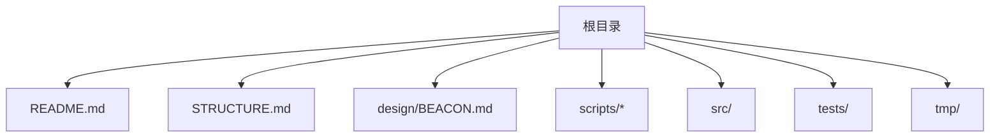
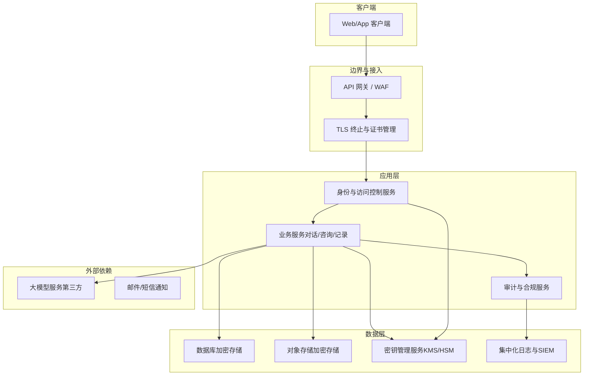
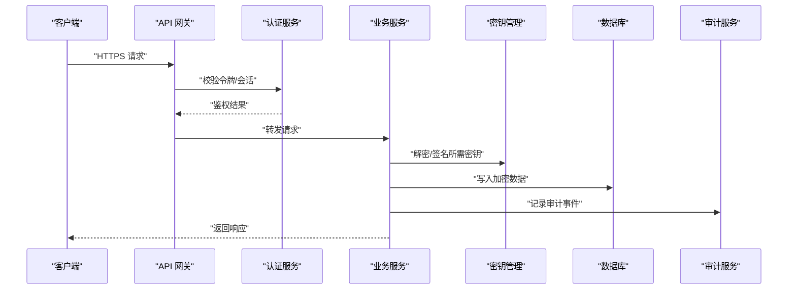
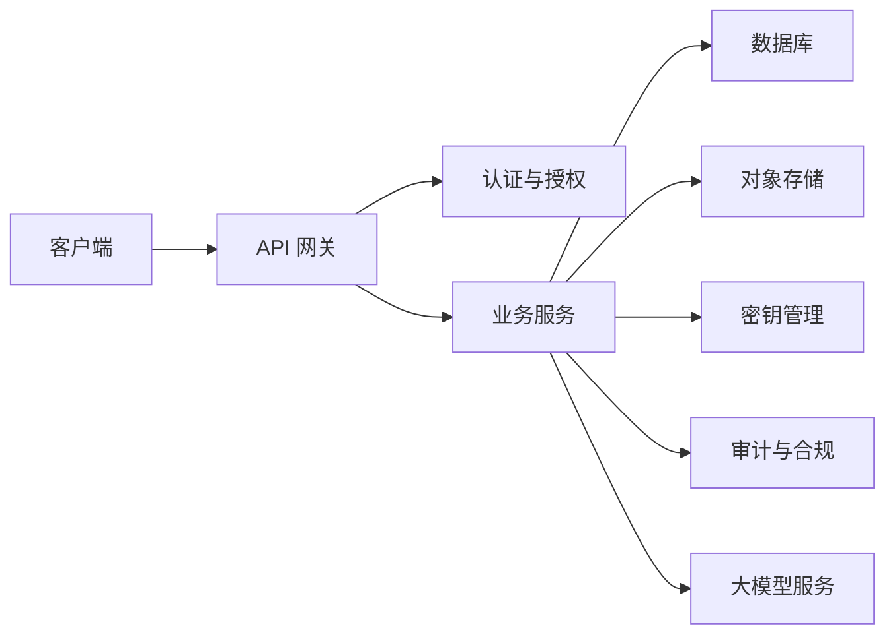

# 隐私与数据安全

<cite>
**本文引用的文件**   
- [README.md](file://README.md)
- [STRUCTURE.md](file://STRUCTURE.md)
- [BEACON.md](file://design/BEACON.md)
</cite>

## 目录
1. [引言](#引言)
2. [项目结构](#项目结构)
3. [核心组件](#核心组件)
4. [架构总览](#架构总览)
5. [详细组件分析](#详细组件分析)
6. [依赖分析](#依赖分析)
7. [性能考虑](#性能考虑)
8. [故障排查指南](#故障排查指南)
9. [结论](#结论)
10. [附录](#附录) 

## 引言
本文件面向AI心理咨询系统的隐私保护与数据安全，目标是提供一份可落地的技术文档，覆盖以下关键主题：
- 用户数据的加密存储方案（传输加密、静态加密、密钥管理）
- 数据访问控制机制（身份认证、权限管理、审计日志）
- 合规性实现（GDPR、HIPAA等），包括数据主体权利处理、数据保留与删除策略
- 数据泄露防护、安全漏洞扫描与渗透测试方法
- 安全配置示例、监控告警与安全事件响应流程

说明：当前仓库为概念与设计阶段，未包含具体后端或前端实现代码。因此，本文以“设计级”方式给出架构与规范建议，并尽量将建议映射到现有仓库中的设计与结构文档，以便后续落地实施时可直接对照执行。

## 项目结构
仓库目前处于早期阶段，主要包含需求与设计文档、脚本与占位目录。与隐私和安全相关的信息主要集中在顶层说明与设计文档中。

图表来源
- [README.md](file://README.md)
- [STRUCTURE.md](file://STRUCTURE.md)
- [BEACON.md](file://design/BEACON.md)

章节来源
- [README.md](file://README.md)
- [STRUCTURE.md](file://STRUCTURE.md)

## 核心组件
基于当前仓库内容，尚未发现具体的安全实现代码。围绕隐私与安全的“核心组件”将在后续开发阶段按如下职责划分进行建设：
- 传输安全层：负责TLS终止、证书管理、HTTP安全头、CORS与CSRF防护
- 身份与访问控制层：负责用户认证、授权、会话与令牌管理、最小权限原则
- 数据保护层：负责静态数据加密、字段级脱敏、密钥管理与轮换
- 审计与合规层：负责不可篡改的审计日志、数据主体请求处理、保留与删除策略
- 安全运营层：负责漏洞扫描、依赖治理、渗透测试、监控告警与事件响应

由于当前仓库未包含上述组件的实现，本节不附加“章节来源”。

## 架构总览
下图展示了一个符合隐私与合规要求的AI心理咨询系统的高层架构，涵盖客户端、API网关、业务服务、数据存储与外部依赖，以及贯穿各层的安全与合规能力。

图表来源
- [BEACON.md](file://design/BEACON.md)

## 详细组件分析

### 传输加密与网络安全
- 强制HTTPS与强密码套件，禁用过时协议与弱算法
- 启用HSTS、严格CORS策略、X-Frame-Options、Content-Security-Policy等安全头
- 对第三方LLM调用采用端到端加密通道，必要时在出站前对敏感字段做最小化或脱敏
- 使用受信任的CA签发证书，自动化续期与吊销检查

章节来源
- [BEACON.md](file://design/BEACON.md)

### 静态数据加密与密钥管理
- 数据库与对象存储开启透明数据加密（TDE）或字段级加密
- 密钥由KMS/HSM统一管理，支持多租户隔离、定期轮换与版本化
- 应用侧仅持有短期凭证，避免硬编码密钥；通过环境变量或机密注入获取
- 备份与归档同样纳入加密与访问控制范围

章节来源
- [BEACON.md](file://design/BEACON.md)

### 身份认证与权限管理
- 采用标准协议（如OAuth 2.0/OIDC）进行统一认证，支持多因素认证（MFA）
- 基于角色的访问控制（RBAC）或属性访问控制（ABAC），遵循最小权限原则
- 会话与会话令牌设置短生命周期，支持撤销与黑名单
- 跨域与跨服务调用需携带鉴权上下文，并进行细粒度校验

章节来源
- [BEACON.md](file://design/BEACON.md)

### 审计日志与不可篡改
- 对所有敏感操作（登录、授权变更、数据读写、导出、删除）生成审计日志
- 日志集中收集至独立存储，具备完整性校验与防篡改能力
- 审计日志与业务数据分离存储，限制访问范围与保留周期

章节来源
- [BEACON.md](file://design/BEACON.md)

### 数据主体权利与合规流程（GDPR/HIPAA）
- 数据主体权利：查询、更正、删除、可携带、撤回同意、限制处理
- 建立工单与自动化流水线，确保在规定时限内完成处理与反馈
- HIPAA场景下，对 PHI 的最小必要访问、访问审计、披露记录与告知义务
- 数据保留策略：按数据类型与法规要求设定保留期，到期自动清理或匿名化

章节来源
- [BEACON.md](file://design/BEACON.md)

### 数据泄露防护（DLP）与脱敏
- 在输入与输出路径部署DLP规则，识别并阻断敏感信息外泄
- 对UI与日志进行动态脱敏，避免PII/PHI明文出现
- 对第三方共享数据进行去标识化或聚合化处理

章节来源
- [BEACON.md](file://design/BEACON.md)

### 安全漏洞扫描与依赖治理
- 代码级静态分析（SAST）、依赖漏洞扫描（SCA）、容器镜像扫描
- 引入SBOM与供应链安全基线，禁止高危依赖入仓
- 持续集成流水线中嵌入安全检查门禁，失败即阻断发布

章节来源
- [BEACON.md](file://design/BEACON.md)

### 渗透测试与红蓝对抗
- 定期进行黑盒/灰盒渗透测试，覆盖Web/API/移动端/基础设施
- 针对AI相关风险（提示注入、越权、数据回显）开展专项测试
- 修复闭环：问题分级、SLA修复、回归验证与复测

章节来源
- [BEACON.md](file://design/BEACON.md)

### 监控告警与安全事件响应
- 指标与日志：认证失败率、异常访问模式、数据导出量、延迟与错误率
- 告警阈值与降噪：基于基线与机器学习检测异常，减少误报
- 事件响应：分级预案、处置SOP、取证与复盘、对外通报与监管上报

章节来源
- [BEACON.md](file://design/BEACON.md)

### 安全配置示例（清单式）
以下为可落地的配置要点清单（不含具体代码）：
- 传输安全
  - 强制HTTPS，启用HSTS
  - 仅允许现代TLS版本与强密码套件
  - 配置CSP、X-Frame-Options、Referrer-Policy等安全头
- 认证与授权
  - 启用MFA，限制登录尝试次数与锁定策略
  - 会话超时与令牌刷新策略
  - 接口级权限校验与参数白名单
- 数据加密
  - 数据库TDE开启，敏感字段单独加密
  - 对象存储服务端加密，桶策略最小化
  - KMS密钥轮换周期与访问审计
- 审计与合规
  - 全链路审计日志采集与集中存储
  - 数据主体请求工单流转与时效跟踪
  - 保留策略与自动清理任务
- 安全运营
  - SAST/SCA/镜像扫描集成CI
  - 渗透测试计划与修复SLA
  - SIEM告警规则与演练

章节来源
- [BEACON.md](file://design/BEACON.md)

### 数据处理流程图（概念）
下图展示了从用户发起咨询到数据落盘与审计的关键步骤，强调加密与访问控制的介入点。

图表来源
- [BEACON.md](file://design/BEACON.md)

## 依赖分析
当前仓库未包含具体实现依赖，以下依赖关系为概念性示意，用于指导后续工程化落地时的模块耦合与解耦策略。

图表来源
- [BEACON.md](file://design/BEACON.md)

## 性能考虑
- 加密开销：优先使用硬件加速与批量操作，合理选择算法与密钥长度
- 缓存策略：对非敏感或已脱敏数据使用缓存，降低数据库压力
- 连接池与限流：对数据库、KMS与第三方服务设置合理的连接池与熔断降级
- 异步审计：审计写入采用异步队列，避免阻塞主流程

[本节为通用指导，无需“章节来源”]

## 故障排查指南
- 常见问题定位
  - 认证失败：检查令牌有效期、MFA状态、会话与权限策略
  - 访问拒绝：核对RBAC/ABAC策略、资源标签与最小权限
  - 加密异常：确认KMS可用性、密钥版本与权限
  - 审计缺失：核查日志采集链路、权限与磁盘空间
- 排障工具与流程
  - 集中日志检索与关联分析
  - 指标看板与告警联动
  - 事件回放与快照留存

[本节为通用指导，无需“章节来源”]

## 结论
在当前仓库阶段，隐私与数据安全应以“设计先行、工程落地”的方式推进。建议在后续开发中，依据本文档的分层职责与清单式配置，逐步完善传输加密、静态加密、密钥管理、访问控制、审计与合规、漏洞治理与事件响应等能力，确保系统在功能演进的同时满足GDPR、HIPAA等合规要求。

[本节为总结性内容，无需“章节来源”]

## 附录
- 术语表
  - PII：个人身份信息
  - PHI：受保护的健康信息
  - TDE：透明数据加密
  - KMS：密钥管理服务
  - RBAC/ABAC：基于角色/属性的访问控制
  - SAST/SCA：静态应用安全测试/软件组成分析
  - SIEM：安全信息与事件管理

[本节为补充信息，无需“章节来源”]