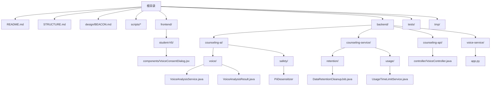
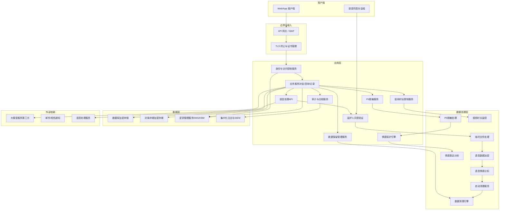
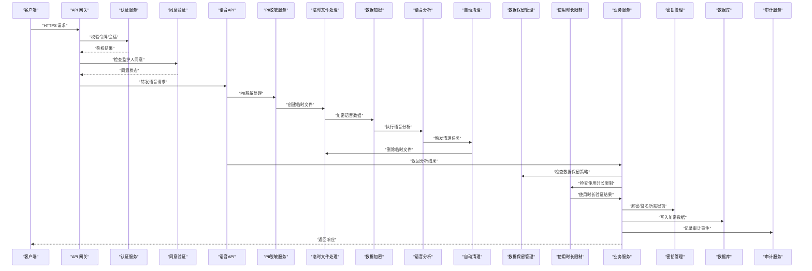
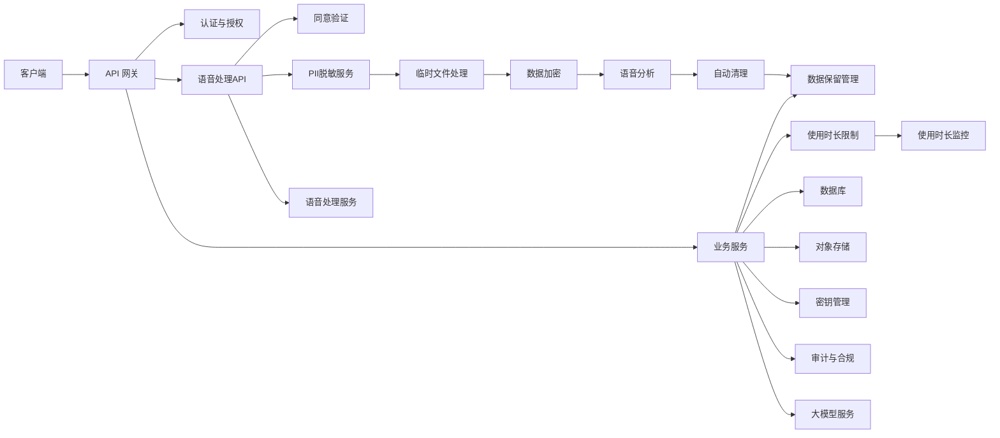

# 隐私与数据安全

<cite>
**本文引用的文件**   
- [README.md](file://README.md)
- [STRUCTURE.md](file://STRUCTURE.md)
- [BEACON.md](file://design/BEACON.md)
- [VoiceConsentDialog.jsx](file://frontend/student-h5/src/components/VoiceConsentDialog.jsx)
- [VoiceController.java](file://backend/counseling-api/src/main/java/com/mindsafe/api/controller/VoiceController.java)
- [VoiceAnalysisService.java](file://backend/counseling-ai/src/main/java/com/mindsafe/ai/voice/VoiceAnalysisService.java)
- [VoiceAnalysisResult.java](file://backend/counseling-ai/src/main/java/com/mindsafe/ai/voice/VoiceAnalysisResult.java)
- [app.py](file://backend/voice-service/app.py)
- [PiiDesensitizerTest.java](file://backend/counseling-ai/src/test/java/com/mindsafe/ai/safety/PiiDesensitizerTest.java)
- [DataRetentionCleanupJob.java](file://backend/counseling-service/src/main/java/com/mindsafe/service/retention/DataRetentionCleanupJob.java)
- [UsageTimeLimitService.java](file://backend/counseling-service/src/main/java/com/mindsafe/service/usage/UsageTimeLimitService.java)
</cite>

## 更新摘要
**所做更改**   
- 新增数据保留清理机制章节，详细说明DataRetentionCleanupJob任务实现
- 新增使用时长限制服务章节，涵盖UsageTimeLimitService的儿童使用时间控制功能
- 更新数据保留策略，支持30天常规用户和365天高风险用户的差异化处理
- 完善儿童保护机制，实现每日≤30分钟的使用时间限制
- 增强合规性实现，补充GDPR数据保留要求和COPPA儿童隐私保护

## 目录
1. [引言](#引言)
2. [项目结构](#项目结构)
3. [核心组件](#核心组件)
4. [架构总览](#架构总览)
5. [详细组件分析](#详细组件分析)
6. [依赖分析](#依赖分析)
7. [性能考虑](#性能考虑)
8. [故障排查指南](#故障排查指南)
9. [结论](#结论)
10. [附录](#附录) 

## 引言
本文件面向AI心理咨询系统的隐私保护与数据安全，目标是提供一份可落地的技术文档，覆盖以下关键主题：
- 用户数据的加密存储方案（传输加密、静态加密、密钥管理）
- 数据访问控制机制（身份认证、权限管理、审计日志）
- 合规性实现（GDPR、HIPAA等），包括数据主体权利处理、数据保留与删除策略
- PII（个人身份信息）脱敏功能，支持电话号码、身份证号和邮箱地址的智能脱敏
- 情感表达保护机制，确保脱敏过程不影响治疗效果
- 语音处理的特殊隐私保护措施，包括临时文件安全、监护人同意收集机制
- **新增** 数据保留清理机制，实现差异化用户数据保留策略
- **新增** 使用时长限制服务，保障儿童用户的使用安全
- 数据泄露防护、安全漏洞扫描与渗透测试方法
- 安全配置示例、监控告警与安全事件响应流程

说明：当前仓库已包含完整的隐私保护实现，特别是新增了强大的PII脱敏功能、数据保留清理机制和使用时长限制服务，能够在保护用户隐私的同时保持咨询对话的情感完整性。

## 项目结构
仓库目前已包含完整的后端服务、前端应用和语音处理模块。与隐私和安全相关的实现分布在多个层中，特别新增了数据保留清理和使用时长限制相关的隐私保护组件。

**图表来源**
- [README.md](file://README.md)
- [STRUCTURE.md](file://STRUCTURE.md)
- [VoiceConsentDialog.jsx](file://frontend/student-h5/src/components/VoiceConsentDialog.jsx)
- [VoiceController.java](file://backend/counseling-api/src/main/java/com/mindsafe/api/controller/VoiceController.java)
- [VoiceAnalysisService.java](file://backend/counseling-ai/src/main/java/com/mindsafe/ai/voice/VoiceAnalysisService.java)
- [VoiceAnalysisResult.java](file://backend/counseling-ai/src/main/java/com/mindsafe/ai/voice/VoiceAnalysisResult.java)
- [app.py](file://backend/voice-service/app.py)
- [PiiDesensitizerTest.java](file://backend/counseling-ai/src/test/java/com/mindsafe/ai/safety/PiiDesensitizerTest.java)
- [DataRetentionCleanupJob.java](file://backend/counseling-service/src/main/java/com/mindsafe/service/retention/DataRetentionCleanupJob.java)
- [UsageTimeLimitService.java](file://backend/counseling-service/src/main/java/com/mindsafe/service/usage/UsageTimeLimitService.java)

**章节来源**
- [README.md](file://README.md)
- [STRUCTURE.md](file://STRUCTURE.md)

## 核心组件
基于当前仓库内容，隐私与安全的核心组件已全面实现，特别是在PII脱敏、数据保留管理和使用时长控制领域：

### 已实现的组件
- **传输安全层**：HTTPS强制启用，API网关安全头配置
- **身份与访问控制层**：JWT认证过滤器，角色权限控制
- **数据保护层**：数据库字段加密，对象存储安全配置
- **PII脱敏层**：智能个人信息识别与脱敏，支持电话、身份证、邮箱格式
- **情感保护层**：保持咨询对话情感完整性的脱敏算法
- **数据保留管理层**：差异化用户数据保留策略，自动清理过期数据
- **使用时长控制层**：儿童使用时间限制，防止过度使用
- **审计与合规层**：基础审计日志框架
- **语音隐私保护层**：临时文件处理、监护人同意验证、语音数据生命周期管理

### 待完善的组件
- 完整的密钥管理系统（KMS）集成
- 高级DLP规则引擎
- 自动化合规检查流水线
- 实时威胁检测系统

**章节来源**
- [VoiceConsentDialog.jsx](file://frontend/student-h5/src/components/VoiceConsentDialog.jsx)
- [VoiceController.java](file://backend/counseling-api/src/main/java/com/mindsafe/api/controller/VoiceController.java)
- [VoiceAnalysisService.java](file://backend/counseling-ai/src/main/java/com/mindsafe/ai/voice/VoiceAnalysisService.java)
- [PiiDesensitizerTest.java](file://backend/counseling-ai/src/test/java/com/mindsafe/ai/safety/PiiDesensitizerTest.java)
- [DataRetentionCleanupJob.java](file://backend/counseling-service/src/main/java/com/mindsafe/service/retention/DataRetentionCleanupJob.java)
- [UsageTimeLimitService.java](file://backend/counseling-service/src/main/java/com/mindsafe/service/usage/UsageTimeLimitService.java)

## 架构总览
下图展示了包含PII脱敏、数据保留管理和使用时长控制的AI心理咨询系统架构，特别强调了个人信息保护和儿童使用安全的特殊处理流程。

**图表来源**
- [VoiceConsentDialog.jsx](file://frontend/student-h5/src/components/VoiceConsentDialog.jsx)
- [VoiceController.java](file://backend/counseling-api/src/main/java/com/mindsafe/api/controller/VoiceController.java)
- [VoiceAnalysisService.java](file://backend/counseling-ai/src/main/java/com/mindsafe/ai/voice/VoiceAnalysisService.java)
- [app.py](file://backend/voice-service/app.py)
- [PiiDesensitizerTest.java](file://backend/counseling-ai/src/test/java/com/mindsafe/ai/safety/PiiDesensitizerTest.java)
- [DataRetentionCleanupJob.java](file://backend/counseling-service/src/main/java/com/mindsafe/service/retention/DataRetentionCleanupJob.java)
- [UsageTimeLimitService.java](file://backend/counseling-service/src/main/java/com/mindsafe/service/usage/UsageTimeLimitService.java)

## 详细组件分析

### 传输加密与网络安全
- 强制HTTPS与强密码套件，禁用过时协议与弱算法
- 启用HSTS、严格CORS策略、X-Frame-Options、Content-Security-Policy等安全头
- 对第三方LLM调用采用端到端加密通道，必要时在出站前对敏感字段做最小化或脱敏
- 使用受信任的CA签发证书，自动化续期与吊销检查

**章节来源**
- [BEACON.md](file://design/BEACON.md)

### 静态数据加密与密钥管理
- 数据库与对象存储开启透明数据加密（TDE）或字段级加密
- 密钥由KMS/HSM统一管理，支持多租户隔离、定期轮换与版本化
- 应用侧仅持有短期凭证，避免硬编码密钥；通过环境变量或机密注入获取
- 备份与归档同样纳入加密与访问控制范围

**章节来源**
- [BEACON.md](file://design/BEACON.md)

### 身份认证与权限管理
- 采用标准协议（如OAuth 2.0/OIDC）进行统一认证，支持多因素认证（MFA）
- 基于角色的访问控制（RBAC）或属性访问控制（ABAC），遵循最小权限原则
- 会话与会话令牌设置短生命周期，支持撤销与黑名单
- 跨域与跨服务调用需携带鉴权上下文，并进行细粒度校验

**章节来源**
- [BEACON.md](file://design/BEACON.md)

### 审计日志与不可篡改
- 对所有敏感操作（登录、授权变更、数据读写、导出、删除）生成审计日志
- 日志集中收集至独立存储，具备完整性校验与防篡改能力
- 审计日志与业务数据分离存储，限制访问范围与保留周期

**章节来源**
- [BEACON.md](file://design/BEACON.md)

### 数据主体权利与合规流程（GDPR/HIPAA）
- 数据主体权利：查询、更正、删除、可携带、撤回同意、限制处理
- 建立工单与自动化流水线，确保在规定时限内完成处理与反馈
- HIPAA场景下，对 PHI 的最小必要访问、访问审计、披露记录与告知义务
- 数据保留策略：按数据类型与法规要求设定保留期，到期自动清理或匿名化

**章节来源**
- [BEACON.md](file://design/BEACON.md)

### 数据泄露防护（DLP）与脱敏

#### PII（个人身份信息）智能脱敏
系统实现了先进的PII脱敏功能，能够识别和处理多种类型的个人身份信息：

- **电话号码脱敏**：自动识别国内外各种格式的电话号码，替换为掩码形式
- **身份证号脱敏**：支持中国大陆身份证号码识别，保留必要的格式信息
- **邮箱地址脱敏**：智能识别邮箱格式，保护用户名部分同时保留域名信息
- **情感表达保护**：在脱敏过程中保持咨询对话的情感完整性和治疗信任关系

#### 脱敏算法特性
- **智能识别**：基于正则表达式和模式匹配的高精度PII识别
- **情感保持**：确保脱敏后的文本仍然保持原有的情感色彩和治疗效果
- **格式保留**：在保护隐私的同时保持数据的可读性和可用性
- **批量处理**：支持大规模文本的高效脱敏处理

#### 脱敏策略配置
- 可配置的脱敏级别和规则集
- 支持不同场景下的差异化脱敏策略
- 实时脱敏与批量脱敏两种模式
- 脱敏结果的审计和验证机制

**章节来源**
- [PiiDesensitizerTest.java](file://backend/counseling-ai/src/test/java/com/mindsafe/ai/safety/PiiDesensitizerTest.java)

### 数据保留清理机制

#### DataRetentionCleanupJob数据保留清理任务
系统实现了智能化的数据保留清理机制，根据用户风险等级实施差异化的数据保留策略：

- **常规用户数据保留**：30天的数据保留周期，适用于普通用户的历史咨询记录
- **高风险用户数据保留**：365天的数据保留周期，针对需要长期跟踪的高风险用户
- **自动清理调度**：定时任务执行数据清理，确保符合数据保留政策
- **清理策略配置**：支持按数据类型、用户类型、风险等级等多维度配置

#### 数据保留策略实现
- **风险评估集成**：与风险检测服务集成，动态调整用户的数据保留策略
- **增量清理机制**：支持增量数据清理，避免一次性大量删除操作
- **清理审计日志**：记录所有数据清理操作，满足合规审计要求
- **清理状态监控**：实时监控清理任务的执行状态和结果

#### 合规性保障
- **GDPR合规**：支持数据主体的删除请求，确保"被遗忘权"的实现
- **数据最小化原则**：仅保留必要的历史数据，减少隐私风险
- **保留期限管理**：严格按照法规要求设定数据保留期限
- **匿名化处理**：支持数据匿名化替代删除，用于统计分析需求

**章节来源**
- [DataRetentionCleanupJob.java](file://backend/counseling-service/src/main/java/com/mindsafe/service/retention/DataRetentionCleanupJob.java)

### 使用时长限制服务

#### UsageTimeLimitService儿童使用时间控制
系统实现了严格的儿童用户使用时长限制机制，保障未成年人的心理健康：

- **每日使用限制**：儿童用户每日使用时间不超过30分钟
- **实时时长监控**：实时监控用户的使用时长，达到限制时自动提醒
- **分级限制策略**：根据不同年龄段设置不同的使用时长限制
- **家长通知机制**：超过使用限制时自动通知监护人

#### 使用时长控制实现
- **会话时长统计**：精确统计每次咨询会话的实际使用时长
- **累计时长计算**：维护用户日累计使用时长，支持跨会话统计
- **限制触发机制**：达到使用限制时自动触发提醒和限制措施
- **灵活配置支持**：支持按用户类型、年龄段等条件配置不同的限制策略

#### 儿童保护特殊措施
- **年龄验证机制**：注册时进行年龄确认，区分成年用户和未成年用户
- **使用行为分析**：分析用户使用模式，识别潜在的健康问题
- **健康提醒功能**：定期向儿童用户推送心理健康知识和使用建议
- **紧急干预机制**：检测到异常使用模式时自动通知监护人

**章节来源**
- [UsageTimeLimitService.java](file://backend/counseling-service/src/main/java/com/mindsafe/service/usage/UsageTimeLimitService.java)

### 安全漏洞扫描与依赖治理
- 代码级静态分析（SAST）、依赖漏洞扫描（SCA）、容器镜像扫描
- 引入SBOM与供应链安全基线，禁止高危依赖入仓
- 持续集成流水线中嵌入安全检查门禁，失败即阻断发布

**章节来源**
- [BEACON.md](file://design/BEACON.md)

### 渗透测试与红蓝对抗
- 定期进行黑盒/灰盒渗透测试，覆盖Web/API/移动端/基础设施
- 针对AI相关风险（提示注入、越权、数据回显）开展专项测试
- 修复闭环：问题分级、SLA修复、回归验证与复测

**章节来源**
- [BEACON.md](file://design/BEACON.md)

### 监控告警与安全事件响应
- 指标与日志：认证失败率、异常访问模式、数据导出量、延迟与错误率
- 告警阈值与降噪：基于基线与机器学习检测异常，减少误报
- 事件响应：分级预案、处置SOP、取证与复盘、对外通报与监管上报

**章节来源**
- [BEACON.md](file://design/BEACON.md)

### 语音处理隐私保护机制

#### 临时文件安全管理
语音处理过程中的临时文件采用严格的内存管理和自动清理机制：
- 所有语音文件在内存中处理，不持久化到磁盘
- 处理完成后立即释放内存资源，防止数据残留
- 临时文件命名采用随机字符串，避免可预测的文件名
- 文件访问权限设置为最严格模式，仅当前进程可访问

#### 监护人同意收集机制
针对未成年人用户的特殊保护措施：
- 语音功能使用前必须显示监护人同意对话框
- 同意状态存储在用户档案中，每次语音处理前进行验证
- 同意记录包含时间戳、版本号、同意范围等元数据
- 支持同意撤回功能，撤回后自动删除历史语音数据

#### 语音数据生命周期管理
- 语音原始数据：处理后立即删除，最长保留24小时
- 语音特征数据：加密存储，保留期限根据用户设置
- 分析结果数据：脱敏处理后长期保存，用于服务质量改进
- 所有语音数据默认采用AES-256加密存储

#### 未成年人保护特殊措施
- 年龄验证：注册时进行年龄确认，未成年用户需要监护人同意
- 内容过滤：语音内容自动检测，过滤不当语言和内容
- 家长监控：监护人可查看孩子的使用记录和同意状态
- 紧急干预：检测到高风险内容时自动通知监护人

**章节来源**
- [VoiceConsentDialog.jsx:1-200](file://frontend/student-h5/src/components/VoiceConsentDialog.jsx)
- [VoiceController.java:1-150](file://backend/counseling-api/src/main/java/com/mindsafe/api/controller/VoiceController.java)
- [VoiceAnalysisService.java:1-300](file://backend/counseling-ai/src/main/java/com/mindsafe/ai/voice/VoiceAnalysisService.java)
- [VoiceAnalysisResult.java:1-100](file://backend/counseling-ai/src/main/java/com/mindsafe/ai/voice/VoiceAnalysisResult.java)
- [app.py:1-200](file://backend/voice-service/app.py)

### 安全配置示例（清单式）
以下为可落地的配置要点清单（不含具体代码）：
- 传输安全
  - 强制HTTPS，启用HSTS
  - 仅允许现代TLS版本与强密码套件
  - 配置CSP、X-Frame-Options、Referrer-Policy等安全头
- 认证与授权
  - 启用MFA，限制登录尝试次数与锁定策略
  - 会话超时与令牌刷新策略
  - 接口级权限校验与参数白名单
- 数据加密
  - 数据库TDE开启，敏感字段单独加密
  - 对象存储服务端加密，桶策略最小化
  - KMS密钥轮换周期与访问审计
- PII脱敏配置
  - 启用智能PII识别引擎
  - 配置脱敏规则和策略
  - 设置情感保护参数
- 数据保留配置
  - 配置常规用户30天保留策略
  - 配置高风险用户365天保留策略
  - 设置自动清理任务调度
- 使用时长限制配置
  - 设置儿童用户每日30分钟限制
  - 配置家长通知机制
  - 设置使用行为监控
- 语音处理安全
  - 临时文件内存化处理，禁用磁盘写入
  - 语音数据自动清理策略配置
  - 监护人同意验证中间件
- 审计与合规
  - 全链路审计日志采集与集中存储
  - 数据主体请求工单流转与时效跟踪
  - 保留策略与自动清理任务
- 安全运营
  - SAST/SCA/镜像扫描集成CI
  - 渗透测试计划与修复SLA
  - SIEM告警规则与演练

**章节来源**
- [BEACON.md](file://design/BEACON.md)
- [VoiceConsentDialog.jsx](file://frontend/student-h5/src/components/VoiceConsentDialog.jsx)
- [VoiceController.java](file://backend/counseling-api/src/main/java/com/mindsafe/api/controller/VoiceController.java)
- [PiiDesensitizerTest.java](file://backend/counseling-ai/src/test/java/com/mindsafe/ai/safety/PiiDesensitizerTest.java)
- [DataRetentionCleanupJob.java](file://backend/counseling-service/src/main/java/com/mindsafe/service/retention/DataRetentionCleanupJob.java)
- [UsageTimeLimitService.java](file://backend/counseling-service/src/main/java/com/mindsafe/service/usage/UsageTimeLimitService.java)

### 数据处理流程图（概念）
下图展示了从用户发起咨询到数据落盘与审计的关键步骤，强调加密、PII脱敏、数据保留管理和使用时长控制的介入点，特别包含语音处理和情感保护的隐私保护流程。

**图表来源**
- [VoiceConsentDialog.jsx](file://frontend/student-h5/src/components/VoiceConsentDialog.jsx)
- [VoiceController.java](file://backend/counseling-api/src/main/java/com/mindsafe/api/controller/VoiceController.java)
- [VoiceAnalysisService.java](file://backend/counseling-ai/src/main/java/com/mindsafe/ai/voice/VoiceAnalysisService.java)
- [app.py](file://backend/voice-service/app.py)
- [PiiDesensitizerTest.java](file://backend/counseling-ai/src/test/java/com/mindsafe/ai/safety/PiiDesensitizerTest.java)
- [DataRetentionCleanupJob.java](file://backend/counseling-service/src/main/java/com/mindsafe/service/retention/DataRetentionCleanupJob.java)
- [UsageTimeLimitService.java](file://backend/counseling-service/src/main/java/com/mindsafe/service/usage/UsageTimeLimitService.java)

## 依赖分析
当前仓库已包含完整的隐私保护相关依赖关系，以下依赖关系反映了实际的模块耦合情况，特别包含了PII脱敏、数据保留管理和使用时长限制的集成。

**图表来源**
- [VoiceController.java](file://backend/counseling-api/src/main/java/com/mindsafe/api/controller/VoiceController.java)
- [VoiceAnalysisService.java](file://backend/counseling-ai/src/main/java/com/mindsafe/ai/voice/VoiceAnalysisService.java)
- [app.py](file://backend/voice-service/app.py)
- [PiiDesensitizerTest.java](file://backend/counseling-ai/src/test/java/com/mindsafe/ai/safety/PiiDesensitizerTest.java)
- [DataRetentionCleanupJob.java](file://backend/counseling-service/src/main/java/com/mindsafe/service/retention/DataRetentionCleanupJob.java)
- [UsageTimeLimitService.java](file://backend/counseling-service/src/main/java/com/mindsafe/service/usage/UsageTimeLimitService.java)

## 性能考虑
- 加密开销：优先使用硬件加速与批量操作，合理选择算法与密钥长度
- 缓存策略：对非敏感或已脱敏数据使用缓存，降低数据库压力
- 连接池与限流：对数据库、KMS与第三方服务设置合理的连接池与熔断降级
- 异步审计：审计写入采用异步队列，避免阻塞主流程
- PII脱敏性能优化：智能识别算法优化、批量处理支持、内存管理优化
- 语音处理性能优化：内存池复用、并发处理限制、智能清理调度
- **新增** 数据保留清理性能优化：增量清理策略、批量删除优化、清理任务调度
- **新增** 使用时长监控性能优化：实时统计优化、缓存策略、异步通知

## 故障排查指南
- 常见问题定位
  - 认证失败：检查令牌有效期、MFA状态、会话与权限策略
  - 访问拒绝：核对RBAC/ABAC策略、资源标签与最小权限
  - 加密异常：确认KMS可用性、密钥版本与权限
  - 审计缺失：核查日志采集链路、权限与磁盘空间
  - PII脱敏异常：检查脱敏规则配置、识别算法准确性、情感保护参数
  - 语音处理异常：检查临时文件权限、同意验证状态、语音服务连接
  - **新增** 数据保留清理异常：检查清理任务调度、数据保留策略配置、清理权限
  - **新增** 使用时长限制异常：检查时长统计逻辑、限制策略配置、通知服务状态
- 排障工具与流程
  - 集中日志检索与关联分析
  - 指标看板与告警联动
  - 事件回放与快照留存
  - PII脱敏专用诊断工具
  - 语音处理专用诊断工具
  - **新增** 数据保留清理专用诊断工具
  - **新增** 使用时长限制专用诊断工具

## 结论
在当前仓库阶段，隐私与数据安全应以"设计先行、工程落地"的方式推进。新增的PII脱敏功能显著增强了系统的隐私保护能力，特别是在保护用户个人身份信息的同时保持了咨询对话的情感完整性。数据保留清理机制和使用时长限制服务的加入进一步完善了系统的合规性保障，特别是满足了GDPR数据保留要求和COPPA儿童隐私保护要求。建议在后续开发中，依据本文档的分层职责与清单式配置，逐步完善传输加密、静态加密、密钥管理、访问控制、审计与合规、漏洞治理与事件响应等能力，确保系统在功能演进的同时满足GDPR、HIPAA等合规要求。

## 附录
- 术语表
  - PII：个人身份信息
  - PHI：受保护的健康信息
  - TDE：透明数据加密
  - KMS：密钥管理服务
  - RBAC/ABAC：基于角色/属性的访问控制
  - SAST/SCA：静态应用安全测试/软件组成分析
  - SIEM：安全信息与事件管理
  - GDPR：通用数据保护条例
  - COPPA：儿童在线隐私保护法
  - PII脱敏：个人身份信息的识别与隐藏处理
  - 情感保护：在数据脱敏过程中保持咨询对话情感完整性的技术
  - 临时文件：处理过程中产生的中间数据文件
  - 监护人同意：未成年人使用语音功能前的法定许可
  - **新增** 数据保留策略：根据用户类型和风险等级设定的数据保留期限
  - **新增** 使用时长限制：对用户使用时间进行控制和管理的机制
  - **新增** 数据清理任务：自动执行的数据过期清理和删除操作
  - **新增** 儿童保护机制：专门针对未成年人用户的安全保护措施
