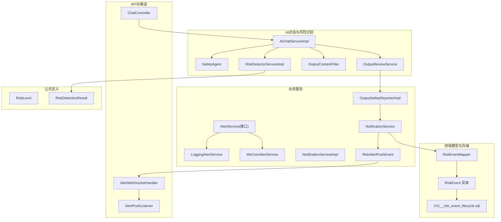
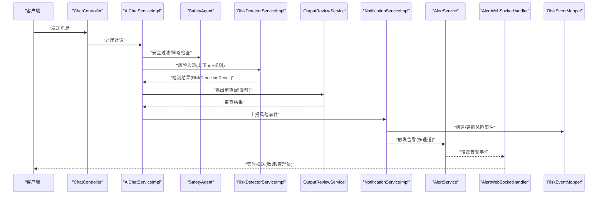
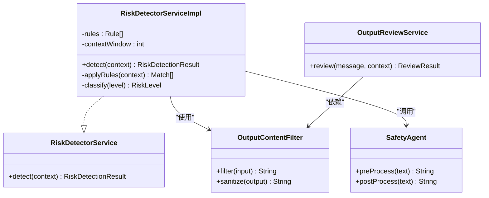
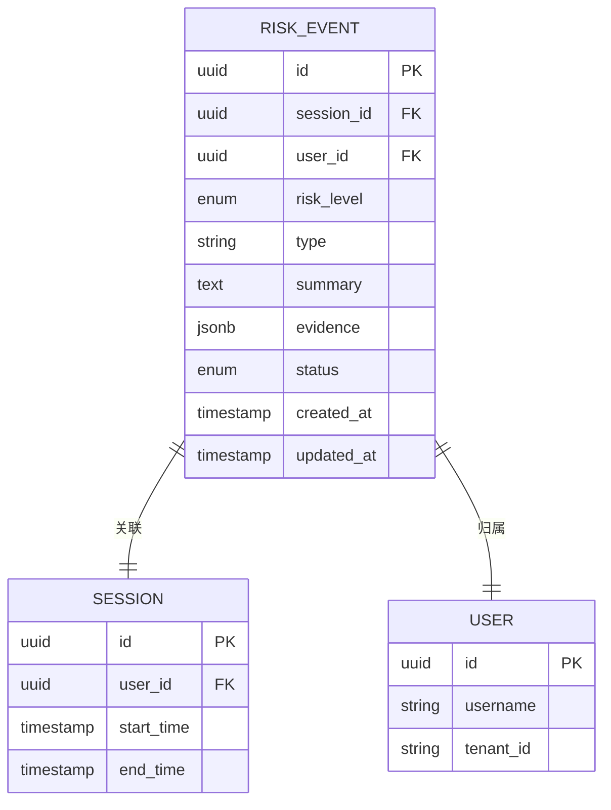
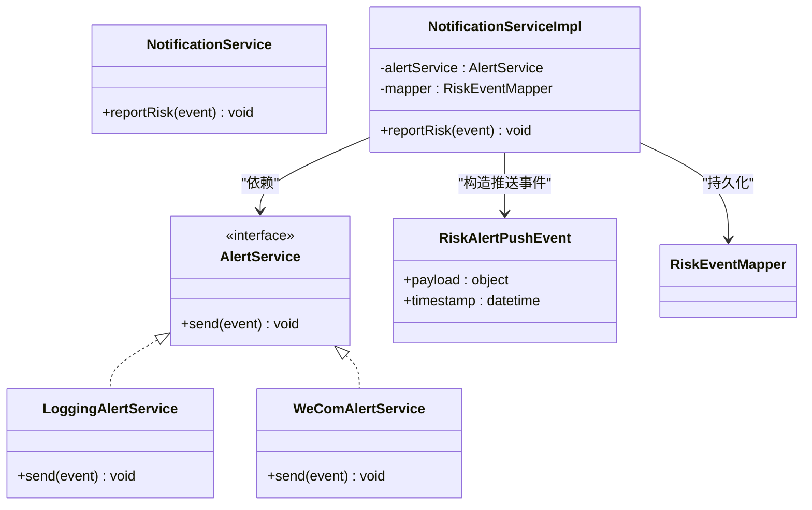
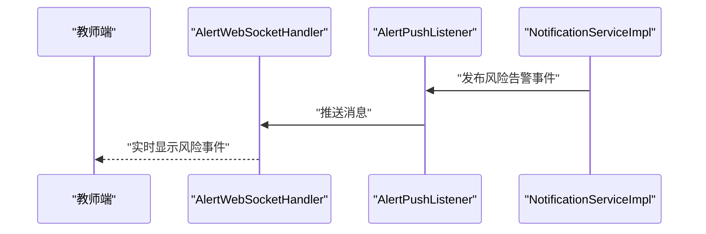
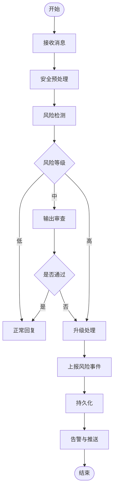
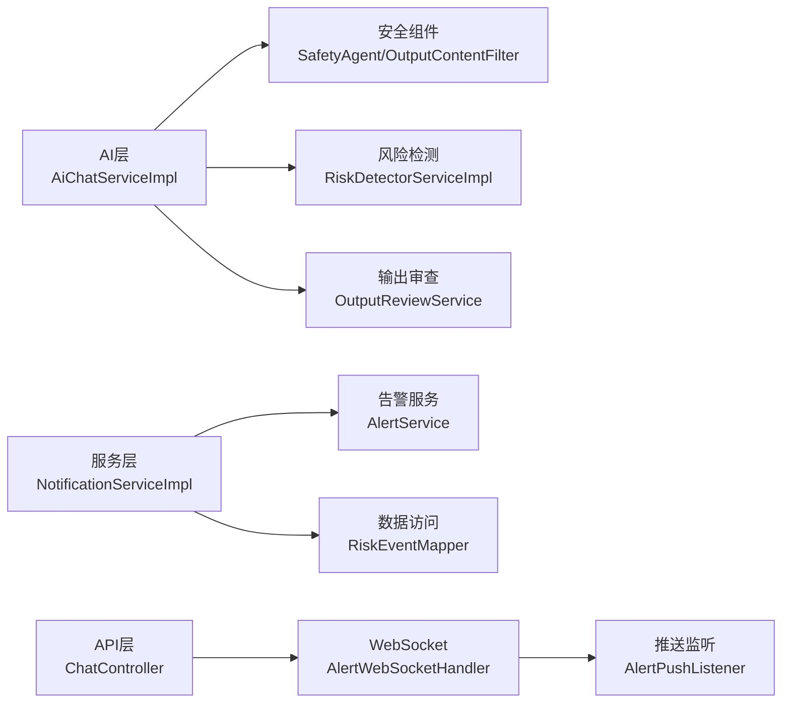

# 风险事件生命周期管理系统

<cite>
**本文引用的文件**   
- [RiskEvent.java](file://backend/counseling-domain/src/main/java/com/mindsafe/domain/entity/RiskEvent.java)
- [RiskEventMapper.java](file://backend/counseling-domain/src/main/java/com/mindsafe/domain/mapper/RiskEventMapper.java)
- [V21__risk_event_lifecycle.sql](file://backend/counseling-app/src/main/resources/db/migration/V21__risk_event_lifecycle.sql)
- [RiskDetectorService.java](file://backend/counseling-ai/src/main/java/com/mindsafe/ai/risk/RiskDetectorService.java)
- [RiskDetectorServiceImpl.java](file://backend/counseling-ai/src/main/java/com/mindsafe/ai/risk/RiskDetectorServiceImpl.java)
- [AlertService.java](file://backend/counseling-service/src/main/java/com/mindsafe/service/alert/AlertService.java)
- [LoggingAlertService.java](file://backend/counseling-service/src/main/java/com/mindsafe/service/alert/LoggingAlertService.java)
- [WeComAlertService.java](file://backend/counseling-service/src/main/java/com/mindsafe/service/alert/WeComAlertService.java)
- [NotificationService.java](file://backend/counseling-service/src/main/java/com/mindsafe/service/notification/NotificationService.java)
- [NotificationServiceImpl.java](file://backend/counseling-service/src/main/java/com/mindsafe/service/notification/NotificationServiceImpl.java)
- [RiskAlertPushEvent.java](file://backend/counseling-service/src/main/java/com/mindsafe/service/notification/RiskAlertPushEvent.java)
- [AlertWebSocketHandler.java](file://backend/counseling-api/src/main/java/com/mindsafe/api/websocket/AlertWebSocketHandler.java)
- [AlertPushListener.java](file://backend/counseling-api/src/main/java/com/mindsafe/api/websocket/AlertPushListener.java)
- [ChatController.java](file://backend/counseling-api/src/main/java/com/mindsafe/api/controller/ChatController.java)
- [ConversationServiceImpl.java](file://backend/counseling-service/src/main/java/com/mindsafe/service/conversation/ConversationServiceImpl.java)
- [AiChatServiceImpl.java](file://backend/counseling-ai/src/main/java/com/mindsafe/ai/chat/AiChatServiceImpl.java)
- [SafetyAgent.java](file://backend/counseling-ai/src/main/java/com/mindsafe/ai/agent/SafetyAgent.java)
- [OutputContentFilter.java](file://backend/counseling-ai/src/main/java/com/mindsafe/ai/safety/OutputContentFilter.java)
- [OutputReviewService.java](file://backend/counseling-ai/src/main/java/com/mindsafe/ai/safety/OutputReviewService.java)
- [OutputSafetyReporterImpl.java](file://backend/counseling-service/src/main/java/com/mindsafe/service/safety/OutputSafetyReporterImpl.java)
- [RiskLevel.java](file://backend/counseling-common/src/main/java/com/mindsafe/common/enums/RiskLevel.java)
- [RiskDetectionResult.java](file://backend/counseling-common/src/main/java/com/mindsafe/common/dto/risk/RiskDetectionResult.java)
</cite>

## 目录
1. [引言](#引言)
2. [项目结构](#项目结构)
3. [核心组件](#核心组件)
4. [架构总览](#架构总览)
5. [详细组件分析](#详细组件分析)
6. [依赖关系分析](#依赖关系分析)
7. [性能考量](#性能考量)
8. [故障排查指南](#故障排查指南)
9. [结论](#结论)
10. [附录](#附录)

## 引言
本文件围绕“风险事件生命周期管理”展开，系统性梳理从对话内容进入、风险识别、事件建模与持久化、告警推送、到处置闭环的全链路实现。该能力贯穿AI对话层、服务层、API层与前端推送通道，确保高风险场景可被及时识别、记录与干预，同时保障数据安全与合规输出。

## 项目结构
与风险事件生命周期相关的代码分布在以下模块：
- AI对话与风险识别：counseling-ai（风险检测、安全过滤、输出审查）
- 领域模型与数据访问：counseling-domain（实体、映射器、数据库迁移脚本）
- 业务服务：counseling-service（告警、通知、事件上报）
- API网关与推送：counseling-api（控制器、WebSocket推送）
- 公共DTO与枚举：counseling-common（风险等级、检测结果）

图表来源 
- [AiChatServiceImpl.java](file://backend/counseling-ai/src/main/java/com/mindsafe/ai/chat/AiChatServiceImpl.java)
- [SafetyAgent.java](file://backend/counseling-ai/src/main/java/com/mindsafe/ai/agent/SafetyAgent.java)
- [RiskDetectorServiceImpl.java](file://backend/counseling-ai/src/main/java/com/mindsafe/ai/risk/RiskDetectorServiceImpl.java)
- [OutputContentFilter.java](file://backend/counseling-ai/src/main/java/com/mindsafe/ai/safety/OutputContentFilter.java)
- [OutputReviewService.java](file://backend/counseling-ai/src/main/java/com/mindsafe/ai/safety/OutputReviewService.java)
- [OutputSafetyReporterImpl.java](file://backend/counseling-service/src/main/java/com/mindsafe/service/safety/OutputSafetyReporterImpl.java)
- [AlertService.java](file://backend/counseling-service/src/main/java/com/mindsafe/service/alert/AlertService.java)
- [LoggingAlertService.java](file://backend/counseling-service/src/main/java/com/mindsafe/service/alert/LoggingAlertService.java)
- [WeComAlertService.java](file://backend/counseling-service/src/main/java/com/mindsafe/service/alert/WeComAlertService.java)
- [NotificationService.java](file://backend/counseling-service/src/main/java/com/mindsafe/service/notification/NotificationService.java)
- [NotificationServiceImpl.java](file://backend/counseling-service/src/main/java/com/mindsafe/service/notification/NotificationServiceImpl.java)
- [RiskAlertPushEvent.java](file://backend/counseling-service/src/main/java/com/mindsafe/service/notification/RiskAlertPushEvent.java)
- [AlertWebSocketHandler.java](file://backend/counseling-api/src/main/java/com/mindsafe/api/websocket/AlertWebSocketHandler.java)
- [AlertPushListener.java](file://backend/counseling-api/src/main/java/com/mindsafe/api/websocket/AlertPushListener.java)
- [ChatController.java](file://backend/counseling-api/src/main/java/com/mindsafe/api/controller/ChatController.java)
- [RiskEvent.java](file://backend/counseling-domain/src/main/java/com/mindsafe/domain/entity/RiskEvent.java)
- [RiskEventMapper.java](file://backend/counseling-domain/src/main/java/com/mindsafe/domain/mapper/RiskEventMapper.java)
- [V21__risk_event_lifecycle.sql](file://backend/counseling-app/src/main/resources/db/migration/V21__risk_event_lifecycle.sql)
- [RiskLevel.java](file://backend/counseling-common/src/main/java/com/mindsafe/common/enums/RiskLevel.java)
- [RiskDetectionResult.java](file://backend/counseling-common/src/main/java/com/mindsafe/common/dto/risk/RiskDetectionResult.java)

章节来源
- [V21__risk_event_lifecycle.sql](file://backend/counseling-app/src/main/resources/db/migration/V21__risk_event_lifecycle.sql)
- [RiskEvent.java](file://backend/counseling-domain/src/main/java/com/mindsafe/domain/entity/RiskEvent.java)
- [RiskEventMapper.java](file://backend/counseling-domain/src/main/java/com/mindsafe/domain/mapper/RiskEventMapper.java)

## 核心组件
- 风险检测与判定
  - 风险检测服务负责基于对话上下文进行风险识别，输出标准化的检测结果与风险等级。
  - 安全代理与安全过滤器对输入/输出进行内容治理，降低误报与敏感信息泄露风险。
- 风险事件建模与持久化
  - 领域实体描述风险事件的属性、状态与时间线；映射器提供CRUD操作；迁移脚本定义表结构与索引。
- 告警与通知
  - 告警服务抽象了多种告警渠道（日志、企业微信等），通知服务负责统一的事件编排与推送。
- API与实时推送
  - 控制器接收对话请求并触发后续流程；WebSocket处理器与监听器将风险告警实时推送到教师端或管理端。

章节来源
- [RiskDetectorService.java](file://backend/counseling-ai/src/main/java/com/mindsafe/ai/risk/RiskDetectorService.java)
- [RiskDetectorServiceImpl.java](file://backend/counseling-ai/src/main/java/com/mindsafe/ai/risk/RiskDetectorServiceImpl.java)
- [SafetyAgent.java](file://backend/counseling-ai/src/main/java/com/mindsafe/ai/agent/SafetyAgent.java)
- [OutputContentFilter.java](file://backend/counseling-ai/src/main/java/com/mindsafe/ai/safety/OutputContentFilter.java)
- [OutputReviewService.java](file://backend/counseling-ai/src/main/java/com/mindsafe/ai/safety/OutputReviewService.java)
- [RiskEvent.java](file://backend/counseling-domain/src/main/java/com/mindsafe/domain/entity/RiskEvent.java)
- [RiskEventMapper.java](file://backend/counseling-domain/src/main/java/com/mindsafe/domain/mapper/RiskEventMapper.java)
- [AlertService.java](file://backend/counseling-service/src/main/java/com/mindsafe/service/alert/AlertService.java)
- [LoggingAlertService.java](file://backend/counseling-service/src/main/java/com/mindsafe/service/alert/LoggingAlertService.java)
- [WeComAlertService.java](file://backend/counseling-service/src/main/java/com/mindsafe/service/alert/WeComAlertService.java)
- [NotificationService.java](file://backend/counseling-service/src/main/java/com/mindsafe/service/notification/NotificationService.java)
- [NotificationServiceImpl.java](file://backend/counseling-service/src/main/java/com/mindsafe/service/notification/NotificationServiceImpl.java)
- [RiskAlertPushEvent.java](file://backend/counseling-service/src/main/java/com/mindsafe/service/notification/RiskAlertPushEvent.java)
- [AlertWebSocketHandler.java](file://backend/counseling-api/src/main/java/com/mindsafe/api/websocket/AlertWebSocketHandler.java)
- [AlertPushListener.java](file://backend/counseling-api/src/main/java/com/mindsafe/api/websocket/AlertPushListener.java)
- [ChatController.java](file://backend/counseling-api/src/main/java/com/mindsafe/api/controller/ChatController.java)

## 架构总览
下图展示了风险事件从对话入口到持久化与推送的端到端流程，以及关键的安全控制点。

图表来源 
- [ChatController.java](file://backend/counseling-api/src/main/java/com/mindsafe/api/controller/ChatController.java)
- [AiChatServiceImpl.java](file://backend/counseling-ai/src/main/java/com/mindsafe/ai/chat/AiChatServiceImpl.java)
- [SafetyAgent.java](file://backend/counseling-ai/src/main/java/com/mindsafe/ai/agent/SafetyAgent.java)
- [RiskDetectorServiceImpl.java](file://backend/counseling-ai/src/main/java/com/mindsafe/ai/risk/RiskDetectorServiceImpl.java)
- [OutputReviewService.java](file://backend/counseling-ai/src/main/java/com/mindsafe/ai/safety/OutputReviewService.java)
- [NotificationServiceImpl.java](file://backend/counseling-service/src/main/java/com/mindsafe/service/notification/NotificationServiceImpl.java)
- [AlertService.java](file://backend/counseling-service/src/main/java/com/mindsafe/service/alert/AlertService.java)
- [AlertWebSocketHandler.java](file://backend/counseling-api/src/main/java/com/mindsafe/api/websocket/AlertWebSocketHandler.java)
- [RiskEventMapper.java](file://backend/counseling-domain/src/main/java/com/mindsafe/domain/mapper/RiskEventMapper.java)

## 详细组件分析

### 风险检测与输出审查
- 风险检测服务
  - 职责：基于对话上下文与规则库进行风险识别，返回标准化检测结果与风险等级。
  - 关键点：支持分级阈值、上下文窗口、规则扩展点。
- 安全代理与内容过滤
  - 职责：对输入输出进行敏感词、违规内容过滤与脱敏，降低误报与合规风险。
- 输出审查服务
  - 职责：在高风险场景下对生成内容进行二次审查，必要时拦截或降级响应。

图表来源 
- [RiskDetectorService.java](file://backend/counseling-ai/src/main/java/com/mindsafe/ai/risk/RiskDetectorService.java)
- [RiskDetectorServiceImpl.java](file://backend/counseling-ai/src/main/java/com/mindsafe/ai/risk/RiskDetectorServiceImpl.java)
- [SafetyAgent.java](file://backend/counseling-ai/src/main/java/com/mindsafe/ai/agent/SafetyAgent.java)
- [OutputContentFilter.java](file://backend/counseling-ai/src/main/java/com/mindsafe/ai/safety/OutputContentFilter.java)
- [OutputReviewService.java](file://backend/counseling-ai/src/main/java/com/mindsafe/ai/safety/OutputReviewService.java)

章节来源
- [RiskDetectorServiceImpl.java](file://backend/counseling-ai/src/main/java/com/mindsafe/ai/risk/RiskDetectorServiceImpl.java)
- [OutputContentFilter.java](file://backend/counseling-ai/src/main/java/com/mindsafe/ai/safety/OutputContentFilter.java)
- [OutputReviewService.java](file://backend/counseling-ai/src/main/java/com/mindsafe/ai/safety/OutputReviewService.java)

### 风险事件建模与持久化
- 实体设计
  - 字段涵盖：关联会话、用户标识、风险等级、类型、摘要、证据片段、处置状态、时间戳等。
- 数据访问
  - 映射器提供增删改查与按条件查询方法，支撑统计与审计。
- 数据库迁移
  - 迁移脚本定义表结构、索引与约束，确保查询性能与一致性。

图表来源 
- [RiskEvent.java](file://backend/counseling-domain/src/main/java/com/mindsafe/domain/entity/RiskEvent.java)
- [RiskEventMapper.java](file://backend/counseling-domain/src/main/java/com/mindsafe/domain/mapper/RiskEventMapper.java)
- [V21__risk_event_lifecycle.sql](file://backend/counseling-app/src/main/resources/db/migration/V21__risk_event_lifecycle.sql)

章节来源
- [RiskEvent.java](file://backend/counseling-domain/src/main/java/com/mindsafe/domain/entity/RiskEvent.java)
- [RiskEventMapper.java](file://backend/counseling-domain/src/main/java/com/mindsafe/domain/mapper/RiskEventMapper.java)
- [V21__risk_event_lifecycle.sql](file://backend/counseling-app/src/main/resources/db/migration/V21__risk_event_lifecycle.sql)

### 告警与通知
- 告警服务
  - 通过接口抽象不同渠道（日志、企业微信等），便于扩展与替换。
- 通知服务
  - 统一编排风险事件上报、持久化与多渠道告警，保证幂等与重试。
- 推送事件
  - 以事件形式驱动WebSocket推送，面向教师/管理员实时展示。

图表来源 
- [AlertService.java](file://backend/counseling-service/src/main/java/com/mindsafe/service/alert/AlertService.java)
- [LoggingAlertService.java](file://backend/counseling-service/src/main/java/com/mindsafe/service/alert/LoggingAlertService.java)
- [WeComAlertService.java](file://backend/counseling-service/src/main/java/com/mindsafe/service/alert/WeComAlertService.java)
- [NotificationService.java](file://backend/counseling-service/src/main/java/com/mindsafe/service/notification/NotificationService.java)
- [NotificationServiceImpl.java](file://backend/counseling-service/src/main/java/com/mindsafe/service/notification/NotificationServiceImpl.java)
- [RiskAlertPushEvent.java](file://backend/counseling-service/src/main/java/com/mindsafe/service/notification/RiskAlertPushEvent.java)

章节来源
- [AlertService.java](file://backend/counseling-service/src/main/java/com/mindsafe/service/alert/AlertService.java)
- [LoggingAlertService.java](file://backend/counseling-service/src/main/java/com/mindsafe/service/alert/LoggingAlertService.java)
- [WeComAlertService.java](file://backend/counseling-service/src/main/java/com/mindsafe/service/alert/WeComAlertService.java)
- [NotificationServiceImpl.java](file://backend/counseling-service/src/main/java/com/mindsafe/service/notification/NotificationServiceImpl.java)
- [RiskAlertPushEvent.java](file://backend/counseling-service/src/main/java/com/mindsafe/service/notification/RiskAlertPushEvent.java)

### API与实时推送
- 控制器
  - 接收学生对话请求，触发AI处理与风险检测流程。
- WebSocket处理器与监听器
  - 处理器维护连接与会话映射，监听器消费风险告警事件并转发至前端。

图表来源 
- [ChatController.java](file://backend/counseling-api/src/main/java/com/mindsafe/api/controller/ChatController.java)
- [AlertWebSocketHandler.java](file://backend/counseling-api/src/main/java/com/mindsafe/api/websocket/AlertWebSocketHandler.java)
- [AlertPushListener.java](file://backend/counseling-api/src/main/java/com/mindsafe/api/websocket/AlertPushListener.java)
- [NotificationServiceImpl.java](file://backend/counseling-service/src/main/java/com/mindsafe/service/notification/NotificationServiceImpl.java)

章节来源
- [ChatController.java](file://backend/counseling-api/src/main/java/com/mindsafe/api/controller/ChatController.java)
- [AlertWebSocketHandler.java](file://backend/counseling-api/src/main/java/com/mindsafe/api/websocket/AlertWebSocketHandler.java)
- [AlertPushListener.java](file://backend/counseling-api/src/main/java/com/mindsafe/api/websocket/AlertPushListener.java)

### 对话入口与编排
- 对话服务实现
  - 协调安全代理、风险检测、输出审查与通知上报，形成完整的风险事件生命周期。
- 对话服务（业务层）
  - 封装会话管理与上下文构建，为风险检测提供稳定输入。

图表来源 
- [AiChatServiceImpl.java](file://backend/counseling-ai/src/main/java/com/mindsafe/ai/chat/AiChatServiceImpl.java)
- [ConversationServiceImpl.java](file://backend/counseling-service/src/main/java/com/mindsafe/service/conversation/ConversationServiceImpl.java)
- [SafetyAgent.java](file://backend/counseling-ai/src/main/java/com/mindsafe/ai/agent/SafetyAgent.java)
- [RiskDetectorServiceImpl.java](file://backend/counseling-ai/src/main/java/com/mindsafe/ai/risk/RiskDetectorServiceImpl.java)
- [OutputReviewService.java](file://backend/counseling-ai/src/main/java/com/mindsafe/ai/safety/OutputReviewService.java)
- [NotificationServiceImpl.java](file://backend/counseling-service/src/main/java/com/mindsafe/service/notification/NotificationServiceImpl.java)

章节来源
- [AiChatServiceImpl.java](file://backend/counseling-ai/src/main/java/com/mindsafe/ai/chat/AiChatServiceImpl.java)
- [ConversationServiceImpl.java](file://backend/counseling-service/src/main/java/com/mindsafe/service/conversation/ConversationServiceImpl.java)

## 依赖关系分析
- 模块耦合
  - AI层依赖安全与风险检测组件；服务层依赖告警与通知；API层依赖WebSocket推送。
- 外部集成
  - 企业微信告警、数据库持久化、WebSocket通道。
- 潜在循环依赖
  - 通过接口抽象与事件解耦避免循环依赖。

图表来源 
- [AiChatServiceImpl.java](file://backend/counseling-ai/src/main/java/com/mindsafe/ai/chat/AiChatServiceImpl.java)
- [SafetyAgent.java](file://backend/counseling-ai/src/main/java/com/mindsafe/ai/agent/SafetyAgent.java)
- [OutputContentFilter.java](file://backend/counseling-ai/src/main/java/com/mindsafe/ai/safety/OutputContentFilter.java)
- [RiskDetectorServiceImpl.java](file://backend/counseling-ai/src/main/java/com/mindsafe/ai/risk/RiskDetectorServiceImpl.java)
- [OutputReviewService.java](file://backend/counseling-ai/src/main/java/com/mindsafe/ai/safety/OutputReviewService.java)
- [NotificationServiceImpl.java](file://backend/counseling-service/src/main/java/com/mindsafe/service/notification/NotificationServiceImpl.java)
- [AlertService.java](file://backend/counseling-service/src/main/java/com/mindsafe/service/alert/AlertService.java)
- [RiskEventMapper.java](file://backend/counseling-domain/src/main/java/com/mindsafe/domain/mapper/RiskEventMapper.java)
- [ChatController.java](file://backend/counseling-api/src/main/java/com/mindsafe/api/controller/ChatController.java)
- [AlertWebSocketHandler.java](file://backend/counseling-api/src/main/java/com/mindsafe/api/websocket/AlertWebSocketHandler.java)
- [AlertPushListener.java](file://backend/counseling-api/src/main/java/com/mindsafe/api/websocket/AlertPushListener.java)

章节来源
- [AiChatServiceImpl.java](file://backend/counseling-ai/src/main/java/com/mindsafe/ai/chat/AiChatServiceImpl.java)
- [NotificationServiceImpl.java](file://backend/counseling-service/src/main/java/com/mindsafe/service/notification/NotificationServiceImpl.java)
- [ChatController.java](file://backend/counseling-api/src/main/java/com/mindsafe/api/controller/ChatController.java)

## 性能考量
- 风险检测
  - 采用规则缓存与上下文滑动窗口，减少重复计算；对高频规则进行预编译与索引。
- 输出审查
  - 异步审查与批处理，避免阻塞主对话流；对低风险路径短路优化。
- 告警与推送
  - 使用事件驱动与背压机制，防止突发流量导致积压；告警合并与去重。
- 数据持久化
  - 合理索引（会话ID、用户ID、风险等级、时间范围）提升查询效率；批量写入与事务边界控制。

[本节为通用指导，不直接分析具体文件]

## 故障排查指南
- 风险未识别
  - 检查规则库覆盖度与阈值配置；查看上下文窗口长度与输入清洗逻辑。
- 告警未推送
  - 确认告警服务实现已启用；检查WebSocket连接与权限；查看事件发布与监听日志。
- 持久化失败
  - 核对迁移脚本执行状态；检查数据库连接与权限；验证必填字段与约束。
- 输出被误拦截
  - 调整内容过滤策略与白名单；审查输出审查服务的判定规则。

章节来源
- [RiskDetectorServiceImpl.java](file://backend/counseling-ai/src/main/java/com/mindsafe/ai/risk/RiskDetectorServiceImpl.java)
- [OutputContentFilter.java](file://backend/counseling-ai/src/main/java/com/mindsafe/ai/safety/OutputContentFilter.java)
- [OutputReviewService.java](file://backend/counseling-ai/src/main/java/com/mindsafe/ai/safety/OutputReviewService.java)
- [LoggingAlertService.java](file://backend/counseling-service/src/main/java/com/mindsafe/service/alert/LoggingAlertService.java)
- [WeComAlertService.java](file://backend/counseling-service/src/main/java/com/mindsafe/service/alert/WeComAlertService.java)
- [AlertWebSocketHandler.java](file://backend/counseling-api/src/main/java/com/mindsafe/api/websocket/AlertWebSocketHandler.java)
- [V21__risk_event_lifecycle.sql](file://backend/counseling-app/src/main/resources/db/migration/V21__risk_event_lifecycle.sql)

## 结论
风险事件生命周期管理通过“检测—审查—上报—持久化—告警—推送”的闭环，实现了从对话入口到处置落地的全链路可控。系统以模块化与事件驱动为核心，兼顾安全性、可扩展性与实时性，满足心理咨询场景的高标准合规要求。

[本节为总结性内容，不直接分析具体文件]

## 附录
- 风险等级与检测结果
  - 风险等级枚举用于统一分级；检测结果DTO承载上下文、匹配规则与置信度等信息。

章节来源
- [RiskLevel.java](file://backend/counseling-common/src/main/java/com/mindsafe/common/enums/RiskLevel.java)
- [RiskDetectionResult.java](file://backend/counseling-common/src/main/java/com/mindsafe/common/dto/risk/RiskDetectionResult.java)