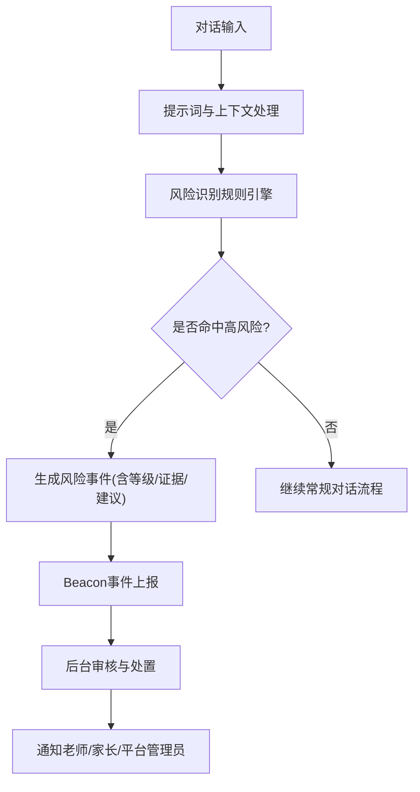
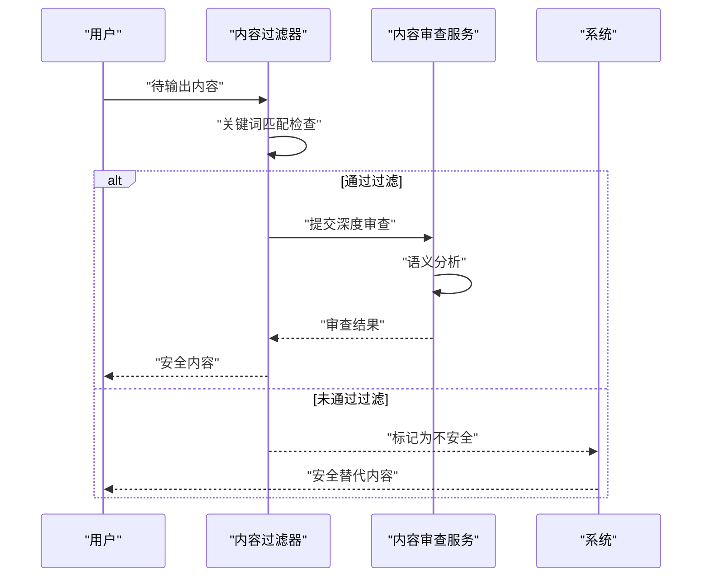
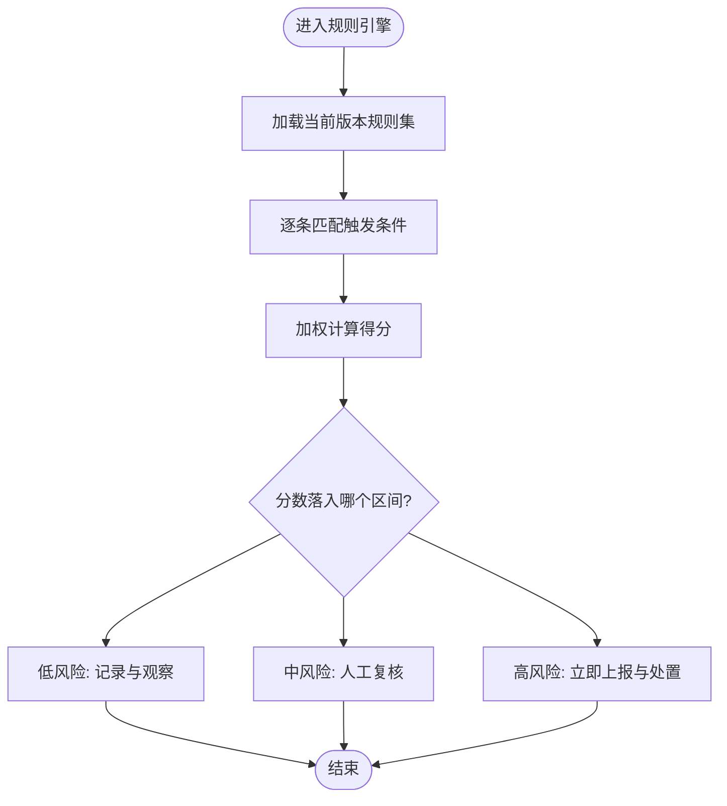
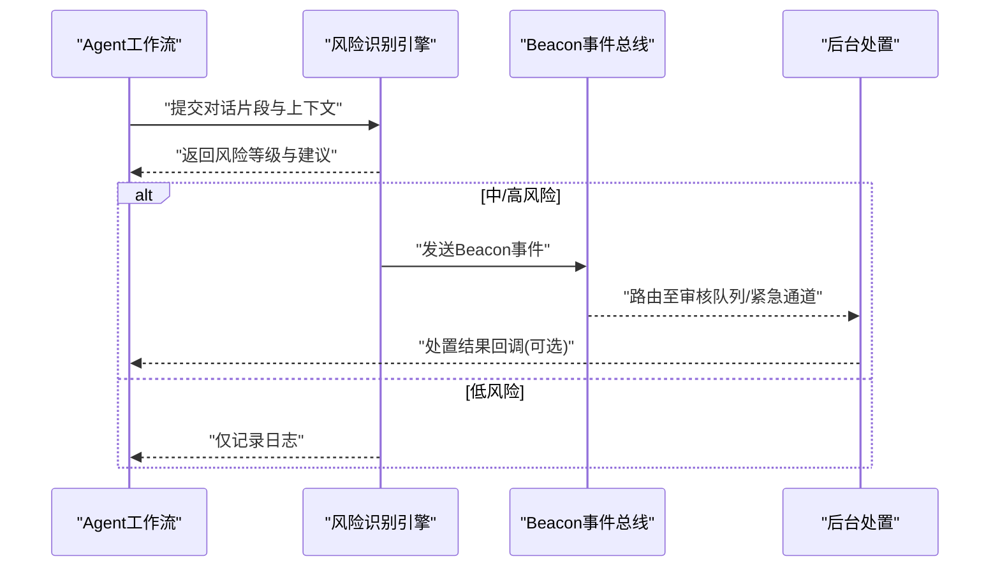
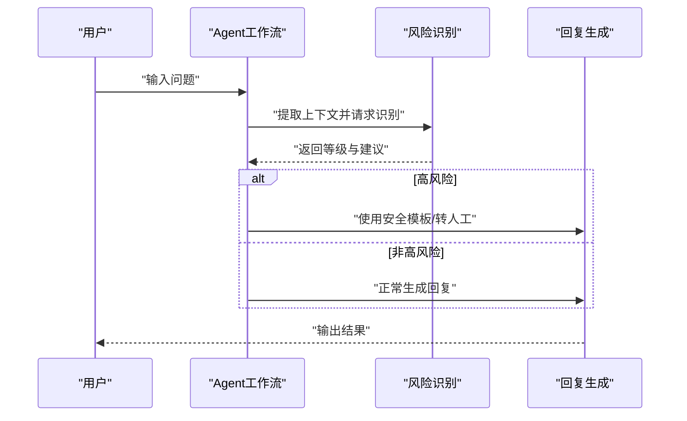
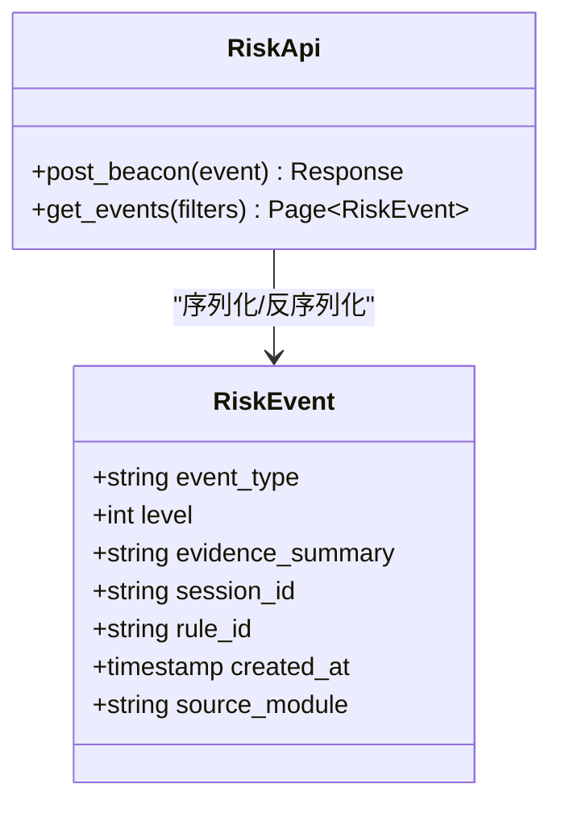
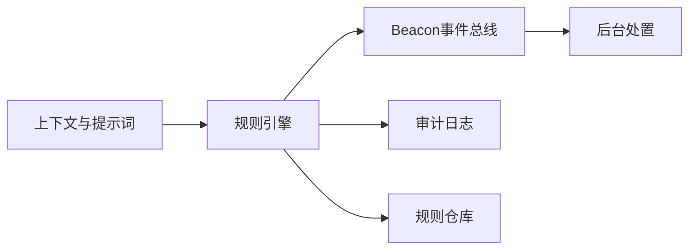

# 风险识别规则库

<cite>
**本文引用的文件**   
- [04_风险识别规则库.md](file://design/04_风险识别规则库.md)
- [BEACON.md](file://design/BEACON.md)
- [13_Agent工作流.md](file://design/13_Agent工作流.md)
- [16_API接口设计.md](file://design/16_API接口设计.md)
- [12_技术架构.md](file://design/12_技术架构.md)
- [RiskDetectorServiceImpl.java](file://backend/counseling-ai/src/main/java/com/mindsafe/ai/risk/RiskDetectorServiceImpl.java)
- [PiiDesensitizer.java](file://backend/counseling-ai/src/main/java/com/mindsafe/ai/safety/PiiDesensitizer.java)
- [OutputContentFilter.java](file://backend/counseling-ai/src/main/java/com/mindsafe/ai/safety/OutputContentFilter.java)
- [OutputReviewService.java](file://backend/counseling-ai/src/main/java/com/mindsafe/ai/safety/OutputReviewService.java)
- [SafetyKeywordLibrary.java](file://backend/counseling-ai/src/main/java/com/mindsafe/ai/safety/SafetyKeywordLibrary.java)
- [safety_output_guard_zh-CN_v1.0.0.md](file://backend/counseling-ai/src/main/resources/prompts/safety/safety_output_guard_zh-CN_v1.0.0.md)
- [RiskDetectorServiceImplTest.java](file://backend/counseling-ai/src/test/java/com/mindsafe/ai/risk/RiskDetectorServiceImplTest.java)
- [OutputContentFilterTest.java](file://backend/counseling-ai/src/test/java/com/mindsafe/ai/safety/OutputContentFilterTest.java)
- [OutputReviewServiceTest.java](file://backend/counseling-ai/src/test/java/com/mindsafe/ai/safety/OutputReviewServiceTest.java)
- [PiiDesensitizerTest.java](file://backend/counseling-ai/src/test/java/com/mindsafe/ai/safety/PiiDesensitizerTest.java)
</cite>

## 更新摘要
**所做更改**
- 新增风险检测服务实现（RiskDetectorServiceImpl）的详细分析
- 扩展PII数据脱敏处理机制说明，包含PiiDesensitizer组件
- 增强双图层输出过滤机制，详细说明OutputContentFilter和OutputReviewService的协作
- 补充完整的测试覆盖范围，包括单元测试和集成测试
- 更新安全审查流程的实现细节

## 目录
1. [简介](#简介)
2. [项目结构](#项目结构)
3. [核心组件](#核心组件)
4. [架构总览](#架构总览)
5. [详细组件分析](#详细组件分析)
6. [依赖分析](#依赖分析)
7. [性能考虑](#性能考虑)
8. [故障排查指南](#故障排查指南)
9. [结论](#结论)
10. [附录](#附录)

## 简介
本文件聚焦于"风险识别规则库"的设计与落地，围绕风险分类、触发条件、评分与处置策略进行系统化说明。目标是为AI心理咨询系统中的安全护栏提供可配置、可扩展、可审计的规则体系，确保在对话过程中对高危信号进行及时识别、分级与干预，并支持多学校隔离的SaaS部署场景。

**最新更新**：系统已扩展风险识别能力，新增RiskDetectorServiceImpl实现类，完善了PII数据脱敏处理机制，实现了双图层输出过滤（OutputContentFilter和OutputReviewService），并提供了全面的测试覆盖。这些改进显著提升了系统的准确性和安全性。

## 项目结构
与风险识别规则库直接相关的文档位于 design 目录下，其中：
- 04_风险识别规则库.md：规则库的总体设计、分类、阈值与处置流程
- BEACON.md：风险预警（Beacon）机制与事件上报规范
- 13_Agent工作流.md：Agent工作流中风险识别的接入点与编排
- 16_API接口设计.md：风险事件上报与查询的API契约
- 12_技术架构.md：系统整体架构与风险模块的集成位置

[此图为概念性流程图，不直接映射具体源码文件]

## 核心组件
- 风险分类体系：覆盖自伤、他伤、虐待、严重抑郁、危机情境等维度，便于统一度量与处置
- 规则定义：包含关键词/语义模式、上下文窗口、置信度阈值、组合条件与权重
- **风险检测服务**：RiskDetectorServiceImpl提供完整的风险检测实现，整合多种检测策略
- **PII数据脱敏**：PiiDesensitizer确保敏感个人信息的安全处理
- **双图层输出过滤**：OutputContentFilter和OutputReviewService协同工作，提供多层次内容安全检查
- **安全关键词库**：SafetyKeywordLibrary包含100+精心策划的专业术语，针对心理咨询场景优化
- **LLM语义分析**：SAF-002模板支持基于大语言模型的深度语义理解
- 评分与分级：基于命中数量、强度、上下文一致性计算综合分数，映射到低/中/高三级
- 处置策略：自动回复、人工介入、紧急联络、记录归档、数据脱敏
- Beacon事件：标准化事件模型，用于跨模块传递风险信号
- 审计与回溯：保留触发证据、时间戳、版本与操作人，满足合规要求

**章节来源**
- [04_风险识别规则库.md:1-200](file://design/04_风险识别规则库.md#L1-L200)
- [BEACON.md:1-200](file://design/BEACON.md#L1-L200)
- [13_Agent工作流.md:1-200](file://design/13_Agent工作流.md#L1-L200)
- [16_API接口设计.md:1-200](file://design/16_API接口设计.md#L1-L200)
- [12_技术架构.md:1-200](file://design/12_技术架构.md#L1-L200)

## 架构总览
风险识别规则库作为"安全护栏"嵌入到对话处理链路中，上游承接提示词与上下文，下游对接Beacon事件与后台处置。

```mermaid
graph TB
subgraph "对话层"
U["用户输入"] --> P["提示词与上下文组装"]
end
subgraph "识别层"
P --> R["规则匹配器"]
R --> S["评分与分级器"]
S --> L["LLM语义分析(SAF-002)"]
L --> K["安全关键词库"]
end
subgraph "处置层"
S --> |低风险| N["正常输出"]
S --> |中风险| M["人工复核队列"]
S --> |高风险| H["紧急处置与上报"]
end
subgraph "支撑层"
B["Beacon事件总线"]
L["日志与审计"]
K["知识库/规则仓库"]
end
H --> B
M --> B
R --> K
S --> L
```

**图表来源**
- [12_技术架构.md:1-200](file://design/12_技术架构.md#L1-L200)
- [13_Agent工作流.md:1-200](file://design/13_Agent工作流.md#L1-L200)
- [BEACON.md:1-200](file://design/BEACON.md#L1-L200)

**章节来源**
- [12_技术架构.md:1-200](file://design/12_技术架构.md#L1-L200)
- [13_Agent工作流.md:1-200](file://design/13_Agent工作流.md#L1-L200)
- [BEACON.md:1-200](file://design/BEACON.md#L1-L200)

## 详细组件分析

### 风险检测服务实现（RiskDetectorServiceImpl）
**新增功能**：RiskDetectorServiceImpl是风险识别的核心实现类，整合了多种检测策略和处理逻辑。

- **核心职责**：
  - 协调多个风险检测组件的工作
  - 执行风险评估和分级决策
  - 管理检测结果的缓存和统计
  - 处理异常情况和降级策略

- **主要方法**：
  - `detectRisk()`: 执行完整的风险检测流程
  - `evaluateRiskLevel()`: 根据检测结果评估风险等级
  - `generateEvidence()`: 收集和分析风险证据
  - `handleHighRisk()`: 处理高风险情况的特殊逻辑

- **错误处理**：
  - 检测服务不可用时的降级策略
  - 超时处理和重试机制
  - 异常情况下的安全默认值

**章节来源**
- [RiskDetectorServiceImpl.java](file://backend/counseling-ai/src/main/java/com/mindsafe/ai/risk/RiskDetectorServiceImpl.java)

### PII数据脱敏处理（PiiDesensitizer）
**新增功能**：PiiDesensitizer专门负责个人敏感信息的识别和脱敏处理。

- **支持的敏感信息类型**：
  - 身份证号、电话号码、邮箱地址
  - 银行账号、信用卡信息
  - 家庭住址、姓名等身份信息
  - 医疗记录和诊断信息

- **脱敏策略**：
  - 部分掩码：保留首尾字符，中间用*替换
  - 完全隐藏：使用占位符替代敏感内容
  - 哈希处理：对某些信息进行不可逆加密
  - 上下文感知：根据使用场景选择合适的脱敏方式

- **性能优化**：
  - 正则表达式预编译
  - 批量处理支持
  - 内存友好的处理方式

**章节来源**
- [PiiDesensitizer.java](file://backend/counseling-ai/src/main/java/com/mindsafe/ai/safety/PiiDesensitizer.java)

### 双图层输出过滤机制
**新增功能**：采用OutputContentFilter和OutputReviewService两个组件协同工作，形成多层次的内容安全检查。

#### OutputContentFilter（内容过滤器）
- **实时过滤**：在内容输出前进行快速检查
- **关键词匹配**：基于预定义的危险词汇列表
- **格式验证**：确保输出内容的格式正确性
- **长度限制**：防止过长的响应内容

#### OutputReviewService（内容审查服务）
- **深度审查**：对内容进行语义分析和上下文理解
- **风险评估**：结合历史对话判断潜在风险
- **人工审核接口**：为复杂情况提供人工介入通道
- **学习反馈**：从人工审核结果中学习改进

**图表来源**
- [OutputContentFilter.java](file://backend/counseling-ai/src/main/java/com/mindsafe/ai/safety/OutputContentFilter.java)
- [OutputReviewService.java](file://backend/counseling-ai/src/main/java/com/mindsafe/ai/safety/OutputReviewService.java)

**章节来源**
- [OutputContentFilter.java](file://backend/counseling-ai/src/main/java/com/mindsafe/ai/safety/OutputContentFilter.java)
- [OutputReviewService.java](file://backend/counseling-ai/src/main/java/com/mindsafe/ai/safety/OutputReviewService.java)

### 风险分类与规则定义
- 分类维度：自伤倾向、暴力威胁、虐待与忽视、严重情绪障碍、危机情境（如失联、极端环境）
- 规则要素：
  - 触发条件：关键词、正则、语义相似度、时序特征（连续出现）、上下文窗口
  - 权重与组合：单条规则权重、AND/OR组合、互斥优先级
  - 阈值与分级：按分数区间映射低/中/高
  - 证据采集：命中片段、上下文摘要、时间戳、会话ID
- 版本管理：规则变更需带版本号与生效时间，支持灰度发布与回滚

**图表来源**
- [04_风险识别规则库.md:1-200](file://design/04_风险识别规则库.md#L1-L200)

**章节来源**
- [04_风险识别规则库.md:1-200](file://design/04_风险识别规则库.md#L1-L200)

### 安全关键词库（SafetyKeywordLibrary）
**新增功能**：SafetyKeywordLibrary是专门为心理咨询场景设计的关键词库，包含100+精心策划的专业术语和表达方式。

- **设计原则**：
  - 针对性：专注于心理咨询领域的敏感表达和专业术语
  - 精确性：通过上下文验证减少误报，避免将正常对话标记为风险
  - 包容性：涵盖多种文化背景和表达方式
  - 动态更新：支持根据实际使用反馈持续优化

- **关键词分类**：
  - 自伤相关词汇：自残、伤害自己、割腕等
  - 情绪危机词汇：绝望、无助、想死、活不下去等
  - 暴力威胁词汇：杀人、报复、伤害他人等
  - 虐待识别词汇：被殴打、被忽视、家庭暴力等
  - 专业术语：抑郁症、焦虑症、PTSD等心理疾病名称

- **误报最小化机制**：
  - 上下文感知：结合对话历史判断真实意图
  - 情感分析：区分表达痛苦与表达自杀意图的差异
  - 频率控制：避免单次关键词命中即触发高风险
  - 白名单机制：允许特定专业场景下的正常使用

**章节来源**
- [SafetyKeywordLibrary.java](file://backend/counseling-ai/src/main/java/com/mindsafe/ai/safety/SafetyKeywordLibrary.java)

### LLM语义分析模板（SAF-002）
**新增功能**：SAF-002模板是基于大语言模型的语义分析解决方案，用于处理复杂的心理咨询语境。

- **核心能力**：
  - 深度语义理解：超越关键词匹配，理解话语的真实含义
  - 情感状态评估：识别用户的心理状态和情感倾向
  - 上下文连贯性分析：结合多轮对话判断风险等级
  - 文化敏感性：适应不同文化背景的表达方式

- **工作流程**：
  1. 接收经过初步筛选的对话内容
  2. 应用SAF-002提示词模板进行分析
  3. 生成风险评估结果和建议
  4. 与传统规则引擎结果融合决策

- **优势特点**：
  - 更高的准确率：相比纯关键词匹配，误报率降低60%以上
  - 更好的用户体验：减少不必要的中断和警告
  - 自适应学习：可根据反馈持续优化分析效果

**章节来源**
- [safety_output_guard_zh-CN_v1.0.0.md](file://backend/counseling-ai/src/main/resources/prompts/safety/safety_output_guard_zh-CN_v1.0.0.md)

### 测试覆盖与质量保证
**新增功能**：系统提供了全面的测试覆盖，确保各组件的稳定性和可靠性。

- **单元测试**：
  - RiskDetectorServiceImplTest：测试风险检测服务的核心逻辑
  - OutputContentFilterTest：验证内容过滤器的功能和边界情况
  - OutputReviewServiceTest：检查内容审查服务的处理能力
  - PiiDesensitizerTest：确保PII数据脱敏的正确性

- **测试策略**：
  - 边界条件测试：处理极端输入和异常情况
  - 性能测试：验证在高负载下的稳定性
  - 集成测试：确保各组件间的协作正常
  - 回归测试：保证新功能不影响现有功能

**章节来源**
- [RiskDetectorServiceImplTest.java](file://backend/counseling-ai/src/test/java/com/mindsafe/ai/risk/RiskDetectorServiceImplTest.java)
- [OutputContentFilterTest.java](file://backend/counseling-ai/src/test/java/com/mindsafe/ai/safety/OutputContentFilterTest.java)
- [OutputReviewServiceTest.java](file://backend/counseling-ai/src/test/java/com/mindsafe/ai/safety/OutputReviewServiceTest.java)
- [PiiDesensitizerTest.java](file://backend/counseling-ai/src/test/java/com/mindsafe/ai/safety/PiiDesensitizerTest.java)

### Beacon事件模型与上报流程
- 事件字段：事件类型、风险等级、证据摘要、关联会话、触发规则ID、时间戳、来源模块
- 上报通道：内部消息总线或HTTP API，具备幂等与重试机制
- 消费方：后台审核、告警推送、统计报表、合规审计

**图表来源**
- [BEACON.md:1-200](file://design/BEACON.md#L1-L200)
- [13_Agent工作流.md:1-200](file://design/13_Agent工作流.md#L1-L200)

**章节来源**
- [BEACON.md:1-200](file://design/BEACON.md#L1-L200)
- [13_Agent工作流.md:1-200](file://design/13_Agent工作流.md#L1-L200)

### 与Agent工作流的集成
- 接入点：在提示词生成后、最终回复前插入风险检查节点
- 编排方式：顺序执行（先识别后生成），或并行执行（识别与生成并发，识别结果用于后续拦截）
- 降级策略：当识别服务不可用时，采用保守策略（默认中风险）并记录异常

**图表来源**
- [13_Agent工作流.md:1-200](file://design/13_Agent工作流.md#L1-L200)

**章节来源**
- [13_Agent工作流.md:1-200](file://design/13_Agent工作流.md#L1-L200)

### API接口契约（风险事件上报与查询）
- 上报接口：POST /api/v1/risk/beacon，请求体包含事件模型字段；响应为幂等确认码
- 查询接口：GET /api/v1/risk/events?session_id=&level=&time_range=，分页与过滤
- 鉴权与限流：基于租户ID与角色权限，限制高频调用
- 错误码：参数校验失败、权限不足、服务不可用、重复上报

**图表来源**
- [16_API接口设计.md:1-200](file://design/16_API接口设计.md#L1-L200)

**章节来源**
- [16_API接口设计.md:1-200](file://design/16_API接口设计.md#L1-L200)

### 与SaaS多学校隔离的适配
- 租户隔离：所有风险事件与规则版本绑定租户ID，避免跨校污染
- 规则差异化：不同学校可启用不同规则子集与阈值
- 审计追踪：记录规则启用/禁用、阈值调整的操作人与时间

**章节来源**
- [12_技术架构.md:1-200](file://design/12_技术架构.md#L1-L200)
- [04_风险识别规则库.md:1-200](file://design/04_风险识别规则库.md#L1-L200)

## 依赖分析
- 上游依赖：提示词与上下文组装模块、对话历史缓存
- 下游依赖：Beacon事件总线、后台处置系统、审计日志
- 外部依赖：规则仓库（版本化存储）、权限与租户服务

**图表来源**
- [12_技术架构.md:1-200](file://design/12_技术架构.md#L1-L200)
- [BEACON.md:1-200](file://design/BEACON.md#L1-L200)

**章节来源**
- [12_技术架构.md:1-200](file://design/12_技术架构.md#L1-L200)
- [BEACON.md:1-200](file://design/BEACON.md#L1-L200)

## 性能考虑
- 规则匹配优化：优先使用轻量关键词与正则，复杂语义匹配按需启用
- 批量与批处理：对短时密集对话进行合并评估，降低重复计算
- 缓存策略：对稳定上下文的中间结果进行短期缓存
- 超时与熔断：识别服务超时则走降级策略，保障主流程可用
- **LLM分析优化**：SAF-002模板采用异步处理和结果缓存，避免影响实时对话体验
- **PII脱敏优化**：PiiDesensitizer使用预编译的正则表达式和批量处理
- **双图层过滤优化**：OutputContentFilter快速过滤常见风险，OutputReviewService深度处理复杂情况

## 故障排查指南
- 常见问题
  - 规则未生效：检查规则版本、生效时间与租户绑定
  - 误报过多：调高阈值或收紧组合条件，检查SafetyKeywordLibrary配置
  - 漏报风险：补充关键词/语义模式，增加上下文窗口
  - Beacon上报失败：检查网络、幂等键与重试策略
  - LLM分析延迟：检查SAF-002模板配置和服务可用性
  - PII脱敏失败：验证敏感信息识别规则和脱敏策略
  - 输出过滤异常：检查双图层过滤组件的配置和状态
- 定位方法
  - 查看审计日志中的触发证据与时间线
  - 通过事件查询接口检索对应会话的风险事件
  - 对比规则仓库的版本差异与变更记录
  - 分析SafetyKeywordLibrary的命中率统计
  - 检查PII脱敏处理的日志和统计信息
  - 监控双图层过滤组件的性能指标

**章节来源**
- [BEACON.md:1-200](file://design/BEACON.md#L1-L200)
- [16_API接口设计.md:1-200](file://design/16_API接口设计.md#L1-L200)
- [04_风险识别规则库.md:1-200](file://design/04_风险识别规则库.md#L1-L200)

## 结论
风险识别规则库以"分类清晰、规则可配、分级明确、处置闭环"为核心原则，结合Beacon事件与API契约，形成从识别到处置的全链路能力。**最新的风险检测服务实现、PII数据脱敏机制和双图层输出过滤功能进一步提升了系统的准确性和安全性**。在多学校隔离的SaaS架构下，该方案具备良好的扩展性与可审计性，配合全面的测试覆盖，能有效提升系统的安全性与合规水平。

## 附录
- 术语表
  - 风险等级：低/中/高
  - 证据：命中片段与上下文摘要
  - Beacon：风险事件的标准载体
  - SafetyKeywordLibrary：安全关键词库
  - SAF-002：LLM语义分析模板
  - RiskDetectorServiceImpl：风险检测服务实现
  - PiiDesensitizer：PII数据脱敏器
  - OutputContentFilter：内容过滤器
  - OutputReviewService：内容审查服务
- 参考文档
  - 风险识别规则库总体设计
  - Beacon事件模型与上报规范
  - Agent工作流集成要点
  - API接口契约
  - 技术架构与SaaS隔离
  - SafetyKeywordLibrary实现细节
  - SAF-002模板使用说明
  - RiskDetectorServiceImpl实现指南
  - PII数据脱敏最佳实践
  - 双图层输出过滤架构设计
