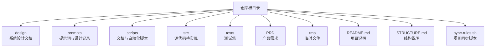
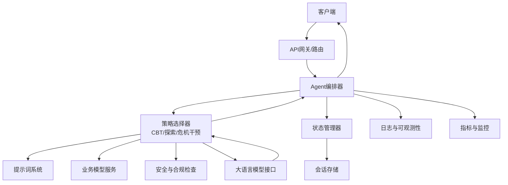
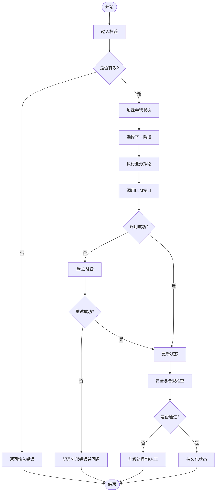
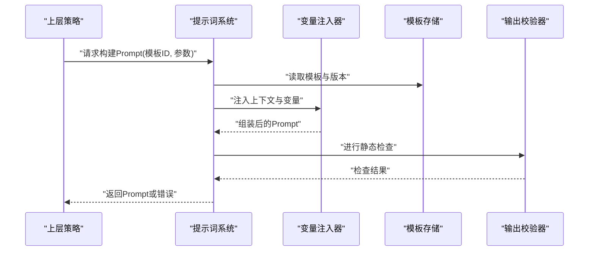
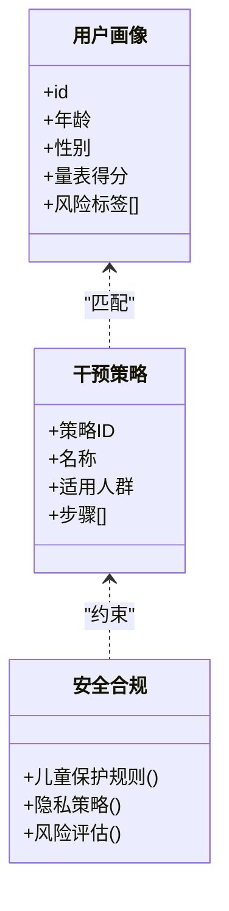
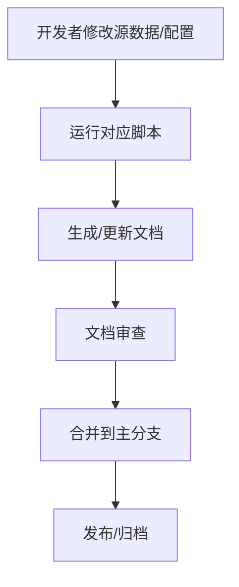
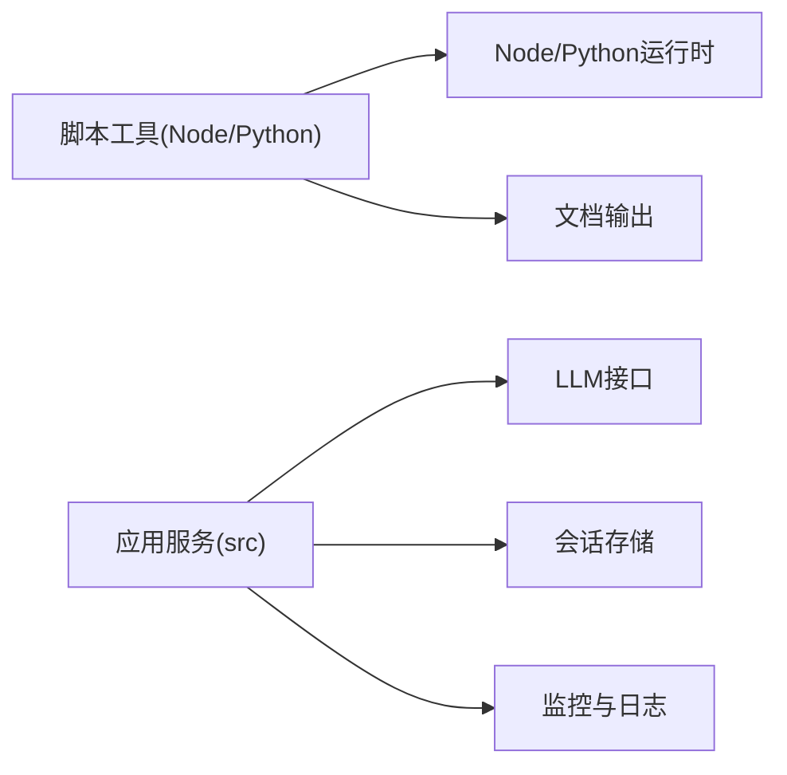

# 开发指南

<cite>
**本文引用的文件**   
- [README.md](file://README.md)
- [STRUCTURE.md](file://STRUCTURE.md)
- [sync-rules.sh](file://sync-rules.sh)
- [design/BEACON.md](file://design/BEACON.md)
- [prompts/20260529-初始探索prompt记录.md](file://prompts/20260529-初始探索prompt记录.md)
- [scripts/create_agent_workflow_doc.js](file://scripts/create_agent_workflow_doc.js)
- [scripts/create_business_model_doc.py](file://scripts/create_business_model_doc.py)
- [scripts/create_cbt_flow_tree_doc.js](file://scripts/create_cbt_flow_tree_doc.js)
- [scripts/create_child_safety_doc.js](file://scripts/create_child_safety_doc.js)
- [scripts/create_prompt_design_doc.js](file://scripts/create_prompt_design_doc.js)
- [scripts/create_prompt_doc_v2.js](file://scripts/create_prompt_doc_v2.js)
- [scripts/create_prompt_system_doc.js](file://scripts/create_prompt_system_doc.js)
</cite>

## 目录
1. [简介](#简介)
2. [项目结构](#项目结构)
3. [核心组件](#核心组件)
4. [架构总览](#架构总览)
5. [详细组件分析](#详细组件分析)
6. [依赖分析](#依赖分析)
7. [性能考虑](#性能考虑)
8. [故障排查指南](#故障排查指南)
9. [结论](#结论)
10. [附录](#附录)

## 简介
本指南面向AI心理咨询系统的开发者，提供从环境搭建、依赖安装与配置，到Agent工作流设计与实现（任务调度、状态管理、错误处理）、代码规范、开发流程与测试策略的完整说明。同时涵盖常用脚本工具的使用、版本控制与发布流程，以及新成员快速上手建议与最佳实践。

## 项目结构
仓库采用“文档驱动 + 脚本辅助”的组织方式：
- design：系统设计与原则文档
- prompts：提示词与对话设计相关记录
- scripts：用于生成文档与自动化流程的工具脚本
- src：源代码目录（当前为空，后续将承载后端/前端/Agent等实现）
- tests：单元测试、集成测试与端到端测试
- PRD：产品需求文档
- tmp：临时文件
- 根级配置文件与说明：README.md、STRUCTURE.md、sync-rules.sh

**图表来源**
- [README.md](file://README.md)
- [STRUCTURE.md](file://STRUCTURE.md)
- [sync-rules.sh](file://sync-rules.sh)

**章节来源**
- [README.md](file://README.md)
- [STRUCTURE.md](file://STRUCTURE.md)

## 核心组件
- Agent工作流：负责咨询会话的任务编排、状态流转与异常恢复。
- 提示词系统：管理多轮对话中的Prompt模板、上下文注入与版本化。
- 业务模型：定义用户画像、风险等级、干预策略等业务实体与关系。
- 安全与合规：儿童保护、隐私保护、风险评估与上报机制。
- 文档与规范：通过脚本自动生成与维护文档，确保一致性。

本节为概念性概述，不直接分析具体文件。

## 架构总览
下图展示系统的高层组件交互：客户端发起咨询请求，路由至Agent编排器；编排器根据阶段选择相应策略（如CBT流程），调用提示词系统与业务模型服务；必要时触发安全与合规检查；结果返回客户端并持久化会话状态。

[此图为概念性架构图，未映射到具体源文件，故不提供图表来源]

## 详细组件分析

### Agent工作流设计与实现
- 任务调度
  - 基于阶段的状态机驱动，支持并行子任务与重试策略。
  - 事件总线用于解耦各阶段之间的通信。
- 状态管理
  - 会话级状态包含：阶段、上下文摘要、风险评分、已执行动作、审计轨迹。
  - 状态变更需幂等且可回放，便于调试与回溯。
- 错误处理
  - 分级错误分类：输入校验失败、外部依赖不可用、LLM响应异常、业务规则冲突。
  - 统一错误码与可观测字段，结合重试、降级与熔断策略。
- 可观测性与审计
  - 关键路径埋点：进入/退出阶段、决策分支、外部调用耗时与错误率。
  - 审计日志保留必要脱敏信息，满足合规要求。

**章节来源**
- [design/BEACON.md](file://design/BEACON.md)
- [prompts/20260529-初始探索prompt记录.md](file://prompts/20260529-初始探索prompt记录.md)

### 提示词系统
- 职责
  - 管理Prompt模板、变量注入、版本控制与A/B实验开关。
  - 提供上下文组装器，将用户画像、历史摘要、策略参数合并为最终Prompt。
- 版本与回滚
  - 每个Prompt具备唯一标识与版本号，支持灰度发布与快速回滚。
- 质量保障
  - 静态检查：长度、敏感词过滤、必填变量校验。
  - 回归测试：使用固定用例集评估输出稳定性与安全性。

**章节来源**
- [prompts/20260529-初始探索prompt记录.md](file://prompts/20260529-初始探索prompt记录.md)

### 业务模型与安全合规
- 业务模型
  - 用户画像：人口学特征、心理量表得分、风险标签。
  - 干预策略：CBT流程、情绪调节、危机干预路径。
- 安全与合规
  - 儿童保护：未成年人识别、监护人通知、强制上报。
  - 隐私保护：数据最小化、加密存储、访问审计。
  - 风险评估：实时风险评分与阈值告警。

**章节来源**
- [design/BEACON.md](file://design/BEACON.md)

### 文档与自动化脚本
- 目标
  - 通过脚本自动维护Agent工作流、CBT流程图、儿童安全、Prompt设计与系统等文档，减少手工维护成本。
- 主要脚本
  - create_agent_workflow_doc.js：生成Agent工作流文档
  - create_cbt_flow_tree_doc.js：生成CBT流程图文档
  - create_child_safety_doc.js：生成儿童安全文档
  - create_prompt_design_doc.js / create_prompt_doc_v2.js / create_prompt_system_doc.js：Prompt相关文档生成
  - create_business_model_doc.py：业务模型文档生成
- 使用方式
  - Node.js脚本：node scripts/<script>.js
  - Python脚本：python scripts/<script>.py
  - 建议在CI中定期运行以保持一致性

**章节来源**
- [scripts/create_agent_workflow_doc.js](file://scripts/create_agent_workflow_doc.js)
- [scripts/create_cbt_flow_tree_doc.js](file://scripts/create_cbt_flow_tree_doc.js)
- [scripts/create_child_safety_doc.js](file://scripts/create_child_safety_doc.js)
- [scripts/create_prompt_design_doc.js](file://scripts/create_prompt_design_doc.js)
- [scripts/create_prompt_doc_v2.js](file://scripts/create_prompt_doc_v2.js)
- [scripts/create_prompt_system_doc.js](file://scripts/create_prompt_system_doc.js)
- [scripts/create_business_model_doc.py](file://scripts/create_business_model_doc.py)

## 依赖分析
- 运行时依赖
  - Node.js与Python环境（用于脚本工具）
  - 大语言模型SDK/HTTP客户端（在src中实现时引入）
- 开发与测试依赖
  - 单元测试框架、集成测试套件、端到端测试工具
- 外部服务
  - 会话存储、对象存储、消息队列、监控与日志平台

[此图为概念性依赖图，未映射到具体源文件，故不提供图表来源]

**章节来源**
- [README.md](file://README.md)
- [STRUCTURE.md](file://STRUCTURE.md)

## 性能考虑
- 提示词构建缓存：对高频模板与稳定上下文进行缓存，降低重复计算。
- 并发与限流：对外部LLM调用实施并发限制与超时控制，避免雪崩。
- 状态压缩：会话状态增量更新与定期压缩，减少存储与传输开销。
- 异步编排：非阻塞I/O与事件驱动，提升吞吐与响应速度。
- 可观测性：关键指标采集（延迟、错误率、资源占用）与告警。

[本节为通用指导，不涉及具体文件]

## 故障排查指南
- 常见问题定位
  - 输入校验失败：检查必填字段、格式与范围。
  - LLM调用异常：查看网络连通性、鉴权、配额与超时设置。
  - 状态不一致：核对幂等键与事务边界，回放最近状态变更。
  - 安全拦截：确认风险阈值与规则配置是否正确。
- 诊断手段
  - 启用详细日志与Trace ID，关联上下游调用链。
  - 使用脚本工具重新生成文档，验证配置与模板一致性。
  - 运行回归测试集，对比基线输出差异。

**章节来源**
- [sync-rules.sh](file://sync-rules.sh)

## 结论
本指南提供了AI心理咨询系统的整体开发视角，涵盖架构、组件、流程与工具。建议团队遵循文档驱动与脚本自动化，强化状态管理与错误处理，完善可观测性与测试体系，以确保系统的安全、稳定与可扩展。

## 附录

### 环境搭建与依赖安装
- 前置条件
  - 操作系统：Linux/macOS/Windows（推荐Linux）
  - Node.js与Python环境（版本见各自脚本注释或包管理文件）
- 安装步骤
  - 克隆仓库并进入根目录
  - 安装Node与Python依赖（按各自包管理器指引）
  - 配置环境变量（LLM密钥、存储连接、监控接入等）
- 本地启动
  - 运行脚本工具生成文档，验证环境正确性
  - 启动应用服务（在src实现后）

**章节来源**
- [README.md](file://README.md)
- [STRUCTURE.md](file://STRUCTURE.md)

### 代码规范与开发流程
- 代码风格
  - 命名约定、模块划分、注释与文档字符串
  - 错误类型与错误码规范
- 提交规范
  - 语义化提交信息、变更清单与影响范围说明
- 分支策略
  - 主干保护、功能分支与热修复分支
- 代码审查
  - 至少一名Reviewer，关注安全、性能与可维护性
- 持续集成
  - 自动化构建、测试与文档生成

**章节来源**
- [sync-rules.sh](file://sync-rules.sh)

### 测试策略
- 单元测试：覆盖核心逻辑与边界条件
- 集成测试：验证组件间交互与外部依赖模拟
- 端到端测试：模拟真实用户旅程与关键场景
- 回归测试：Prompt与策略输出的稳定性验证

**章节来源**
- [README.md](file://README.md)
- [STRUCTURE.md](file://STRUCTURE.md)

### 版本控制与发布流程
- 版本策略
  - 语义化版本（主.次.修订）
  - 变更日志与里程碑
- 发布流程
  - 预发布环境验证、灰度发布与回滚预案
  - 文档与资产同步发布

**章节来源**
- [README.md](file://README.md)

### 常用工具使用方法
- 文档生成脚本
  - Node脚本：node scripts/create_agent_workflow_doc.js
  - Python脚本：python scripts/create_business_model_doc.py
- 规则同步
  - 执行根目录脚本以同步规则与配置

**章节来源**
- [scripts/create_agent_workflow_doc.js](file://scripts/create_agent_workflow_doc.js)
- [scripts/create_business_model_doc.py](file://scripts/create_business_model_doc.py)
- [sync-rules.sh](file://sync-rules.sh)

### 新成员快速上手与最佳实践
- 快速上手
  - 阅读README与结构说明，了解目录与职责
  - 运行脚本生成文档，熟悉Agent工作流与Prompt系统
- 最佳实践
  - 优先编写测试与文档，再实现功能
  - 小步快跑，频繁提交与评审
  - 重视安全与合规，尽早纳入设计

**章节来源**
- [README.md](file://README.md)
- [STRUCTURE.md](file://STRUCTURE.md)
- [design/BEACON.md](file://design/BEACON.md)
- [prompts/20260529-初始探索prompt记录.md](file://prompts/20260529-初始探索prompt记录.md)