# CI/CD流水线

<cite>
**本文引用的文件**   
- [ci.yml](file://.github/workflows/ci.yml)
- [Dockerfile](file://backend/Dockerfile)
- [docker-compose.yml](file://deploy/docker-compose.yml)
- [docker-compose.test.yml](file://deploy/docker-compose.test.yml)
- [docker-compose.prod.yml](file://deploy/docker-compose.prod.yml)
- [docker-compose.monitoring.yml](file://deploy/docker-compose.monitoring.yml)
- [setup-server.sh](file://deploy/setup-server.sh)
- [default.conf](file://deploy/nginx/default.conf)
- [.env.example](file://.env.example)
- [pom.xml](file://backend/pom.xml)
- [application.yml](file://backend/counseling-app/src/main/resources/application.yml)
- [app.py](file://backend/tts-service/app.py)
- [requirements.txt](file://backend/tts-service/requirements.txt)
- [app.py](file://backend/voice-service/app.py)
- [requirements.txt](file://backend/voice-service/requirements.txt)
- [Dockerfile](file://frontend/Dockerfile)
- [package.json](file://frontend/student-h5/package.json)
- [package.json](file://frontend/teacher-web/package.json)
- [smoke-test.sh](file://tests/e2e/smoke-test.sh)
</cite>

## 更新摘要
**所做更改**
- 新增了完整的GitHub Actions CI工作流，包含基于Testcontainers的集成测试和端到端冒烟测试
- 移除了Oracle Cloud部署自动化（deploy.yml），因持续失败且缺少密钥配置
- 更新了CI流程以支持PostgreSQL与pgvector、Redis服务的集成测试
- 增强了端到端验证能力，确保完整应用功能正常

## 目录
1. [简介](#简介)
2. [项目结构](#项目结构)
3. [核心组件](#核心组件)
4. [架构总览](#架构总览)
5. [详细组件分析](#详细组件分析)
6. [依赖关系分析](#依赖关系分析)
7. [性能考量](#性能考量)
8. [故障排查指南](#故障排查指南)
9. [结论](#结论)
10. [附录](#附录)

## 简介
本文件面向AI心理咨询系统的CI/CD流水线，系统化梳理从代码提交到构建、测试、镜像打包的全流程。文档覆盖GitHub Actions工作流、后端多模块Maven工程、前后端容器化、服务编排与监控集成，并提供常见问题排查与优化建议，帮助团队快速定位问题并提升交付效率。

**更新** 本次更新重点引入了基于Testcontainers的集成测试框架，增强了端到端冒烟测试能力，同时移除了不稳定的Oracle Cloud部署自动化流程。

## 项目结构
仓库采用前后端分离与多服务架构：
- 后端：Spring Boot多模块（API、应用入口、领域模型、通用组件、业务服务、Agent与语音/TTS子服务），使用Maven管理依赖与构建。
- 前端：学生H5、教师Web与家长端H5三端应用，基于Vite构建，独立Docker镜像。
- 部署：Docker Compose编排生产、测试与监控环境；提供服务器初始化脚本。
- CI/CD：GitHub Actions定义持续集成工作流，包含单元测试、集成测试和端到端冒烟测试。

```mermaid
graph TB
subgraph "代码仓库"
A[".github/workflows"]
B["backend/"]
C["frontend/"]
D["deploy/"]
E["tests/"]
end
subgraph "CI/CD"
W1["ci.yml"]
end
subgraph "后端服务"
S1["counseling-api"]
S2["counseling-app"]
S3["counseling-domain"]
S4["counseling-common"]
S5["counseling-service"]
S6["tts-service"]
S7["voice-service"]
end
subgraph "前端应用"
F1["student-h5"]
F2["teacher-web"]
F3["parent-h5"]
end
subgraph "部署编排"
DC1["docker-compose.yml"]
DC2["docker-compose.test.yml"]
DC3["docker-compose.prod.yml"]
DC4["docker-compose.monitoring.yml"]
SH["setup-server.sh"]
NGINX["nginx/default.conf"]
end
A --> W1
B --> S1
B --> S2
B --> S3
B --> S4
B --> S5
B --> S6
B --> S7
C --> F1
C --> F2
C --> F3
D --> DC1
D --> DC2
D --> DC3
D --> DC4
D --> SH
D --> NGINX
E --> |"E2E冒烟测试"| W1
```

**图表来源**
- [ci.yml](file://.github/workflows/ci.yml)
- [docker-compose.yml](file://deploy/docker-compose.yml)
- [docker-compose.test.yml](file://deploy/docker-compose.test.yml)
- [docker-compose.prod.yml](file://deploy/docker-compose.prod.yml)
- [docker-compose.monitoring.yml](file://deploy/docker-compose.monitoring.yml)
- [setup-server.sh](file://deploy/setup-server.sh)
- [default.conf](file://deploy/nginx/default.conf)

**章节来源**
- [ci.yml](file://.github/workflows/ci.yml)
- [docker-compose.yml](file://deploy/docker-compose.yml)
- [docker-compose.test.yml](file://deploy/docker-compose.test.yml)
- [docker-compose.prod.yml](file://deploy/docker-compose.prod.yml)
- [docker-compose.monitoring.yml](file://deploy/docker-compose.monitoring.yml)
- [setup-server.sh](file://deploy/setup-server.sh)
- [default.conf](file://deploy/nginx/default.conf)

## 核心组件
- 持续集成（CI）工作流：负责拉取代码、缓存Maven依赖、编译后端多模块、运行单元测试与集成测试、构建前端静态资源、执行端到端冒烟测试、生成制品归档。
- 后端构建：Maven聚合构建，按模块顺序编译、测试与打包；通过Dockerfile生成运行时镜像。
- 前端构建：Node环境安装依赖、构建静态资源，并通过独立Dockerfile生成Nginx镜像。
- 服务编排：Compose定义数据库、Redis、后端主服务、TTS与语音服务、Nginx反向代理与监控栈（Prometheus/Grafana）。
- 服务器初始化：一键脚本完成系统依赖、Docker、网络、证书与端口等基础环境准备。

**更新** 移除了Oracle Cloud部署自动化流程，专注于本地和测试环境的CI/CD能力。

**章节来源**
- [ci.yml](file://.github/workflows/ci.yml)
- [pom.xml](file://backend/pom.xml)
- [Dockerfile](file://backend/Dockerfile)
- [Dockerfile](file://frontend/Dockerfile)
- [docker-compose.yml](file://deploy/docker-compose.yml)
- [setup-server.sh](file://deploy/setup-server.sh)
- [default.conf](file://deploy/nginx/default.conf)

## 架构总览
下图展示从代码提交到测试验证的关键路径：CI阶段进行构建与测试，包括单元测试、集成测试和端到端冒烟测试。

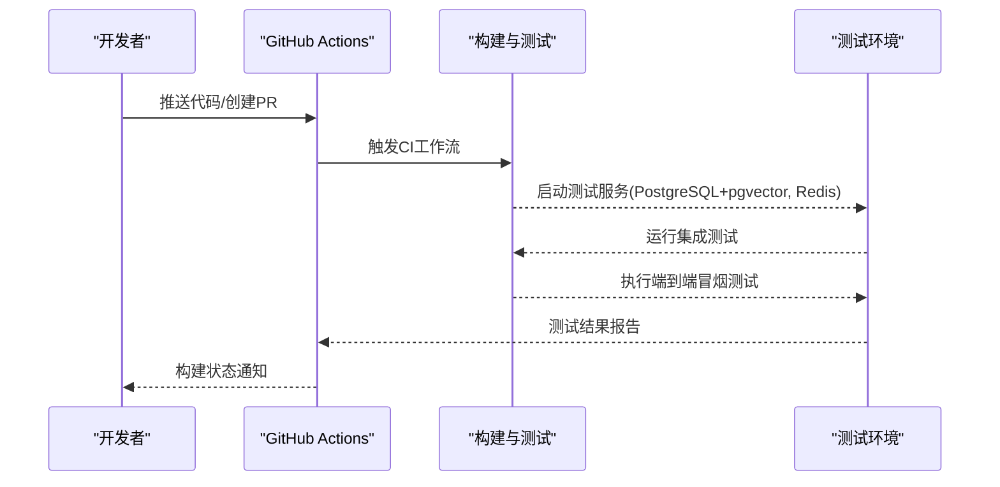

**图表来源**
- [ci.yml](file://.github/workflows/ci.yml)
- [docker-compose.test.yml](file://deploy/docker-compose.test.yml)

## 详细组件分析

### 持续集成（CI）工作流
- 触发条件：默认分支推送、Pull Request、手动触发。
- 主要步骤：
  - 设置Java与Node环境，缓存Maven与npm依赖以提升速度。
  - 后端构建：按模块编译、运行单元测试，生成JAR包。
  - 集成测试：使用Testcontainers启动PostgreSQL（含pgvector扩展）和Redis服务，运行数据库相关测试。
  - 前端构建：安装依赖、构建静态资源（包括student-h5、teacher-web和parent-h5）。
  - 端到端冒烟测试：启动测试环境，执行冒烟脚本验证关键路径。
  - 制品归档：保存构建产物以便后续调试或回滚。

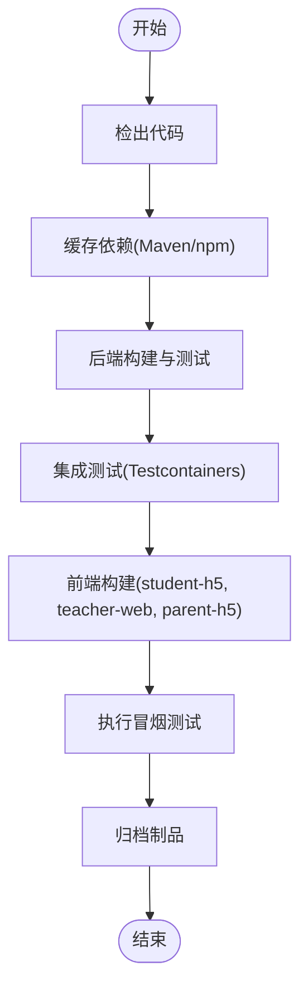

**图表来源**
- [ci.yml](file://.github/workflows/ci.yml)

**章节来源**
- [ci.yml](file://.github/workflows/ci.yml)

### Nginx配置增强
**新增** 针对/parent路由问题的修复，增强了Nginx配置以支持家长端H5的正确路由。

- 路由配置：新增/parent路径的重写规则，确保家长端应用正确访问。
- 静态资源：为parent-h5应用配置独立的静态资源映射。
- 代理规则：保持与现有学生端和教师端一致的代理逻辑。

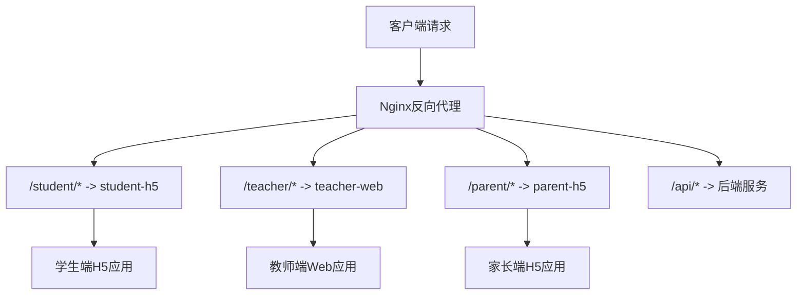

**图表来源**
- [default.conf](file://deploy/nginx/default.conf)

**章节来源**
- [default.conf](file://deploy/nginx/default.conf)

### Docker Compose生产配置更新
**更新** 增强了Docker Compose生产配置，支持三端挂载和环境变量对齐。

- 三端挂载：为student-h5、teacher-web和parent-h5分别配置独立的卷挂载。
- 环境变量：统一环境变量命名规范，确保各端应用配置一致性。
- 健康检查：为新增的parent-h5服务添加健康检查配置。
- 网络隔离：优化网络配置，确保三端应用间的通信安全。

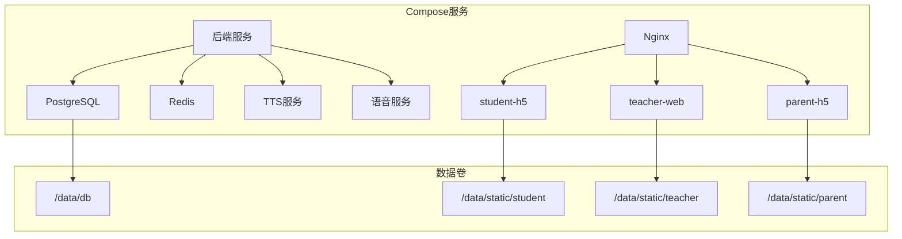

**图表来源**
- [docker-compose.prod.yml](file://deploy/docker-compose.prod.yml)

**章节来源**
- [docker-compose.prod.yml](file://deploy/docker-compose.prod.yml)

### 环境变量配置更新
**更新** .env.example配置文件得到完善，提供了更详细的环境变量说明。

- 新增parent-h5相关环境变量：包括应用名称、端口、API地址等。
- 统一命名规范：确保所有前端应用的环境变量命名一致。
- 安全建议：添加了敏感信息的安全配置指导。
- 默认值：为可选配置提供合理的默认值。

**章节来源**
- [.env.example](file://.env.example)

### 后端构建与打包（Maven + Docker）
- Maven聚合工程：包含API层、应用入口、领域模型、通用组件、业务服务与Agent实现。
- 构建流程：按依赖顺序编译、运行单元测试、打包为可执行JAR。
- Docker镜像：基于轻量JRE镜像，复制JAR与配置文件，暴露端口，设置健康检查探针。

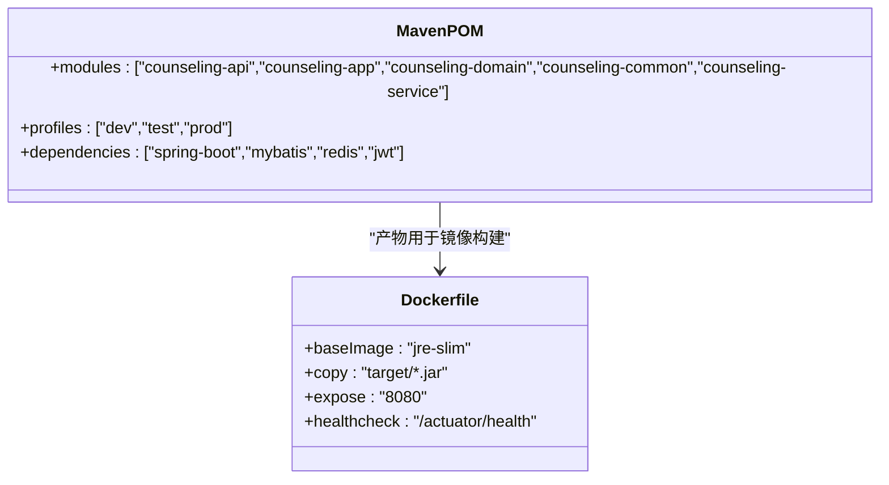

**图表来源**
- [pom.xml](file://backend/pom.xml)
- [Dockerfile](file://backend/Dockerfile)

**章节来源**
- [pom.xml](file://backend/pom.xml)
- [Dockerfile](file://backend/Dockerfile)

### 前端构建与镜像
- Node环境：安装依赖、构建静态资源（React/Vite）。
- Nginx镜像：将静态资源复制到Nginx根目录，配置反向代理与Gzip压缩。

**更新** 现在支持三个前端应用的构建：student-h5、teacher-web和parent-h5。

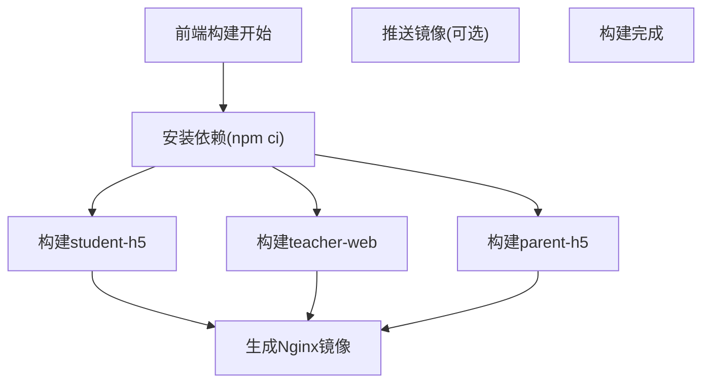

**图表来源**
- [Dockerfile](file://frontend/Dockerfile)
- [package.json](file://frontend/student-h5/package.json)
- [package.json](file://frontend/teacher-web/package.json)

**章节来源**
- [Dockerfile](file://frontend/Dockerfile)
- [package.json](file://frontend/student-h5/package.json)
- [package.json](file://frontend/teacher-web/package.json)

### 服务编排与监控
- 核心服务：数据库、Redis、后端主服务、TTS服务、语音服务、Nginx。
- 监控栈：Prometheus抓取指标，Grafana可视化面板。
- 环境区分：测试与生产Compose文件隔离配置，便于不同环境部署。

**更新** 新增了parent-h5服务的编排配置，确保三端应用的完整部署。

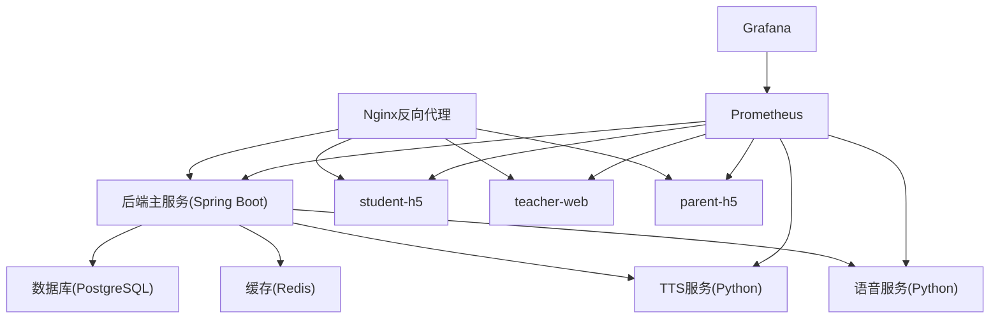

**图表来源**
- [docker-compose.yml](file://deploy/docker-compose.yml)
- [docker-compose.test.yml](file://deploy/docker-compose.test.yml)
- [docker-compose.prod.yml](file://deploy/docker-compose.prod.yml)
- [docker-compose.monitoring.yml](file://deploy/docker-compose.monitoring.yml)

**章节来源**
- [docker-compose.yml](file://deploy/docker-compose.yml)
- [docker-compose.test.yml](file://deploy/docker-compose.test.yml)
- [docker-compose.prod.yml](file://deploy/docker-compose.prod.yml)
- [docker-compose.monitoring.yml](file://deploy/docker-compose.monitoring.yml)

### 服务器初始化脚本
- 功能：安装系统依赖、配置Docker、创建网络与卷、设置防火墙规则、部署证书与端口映射。
- 适用场景：新服务器首次部署或重建环境。

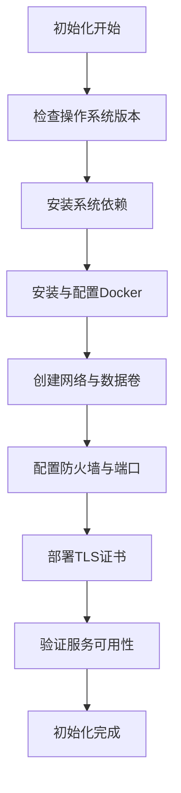

**图表来源**
- [setup-server.sh](file://deploy/setup-server.sh)

**章节来源**
- [setup-server.sh](file://deploy/setup-server.sh)

### 端到端冒烟测试
- 目的：验证关键用户路径（登录、聊天、语音交互）是否可用。
- 方式：在CI中启动最小化服务集，执行脚本断言HTTP/WebSocket响应码与关键字段。

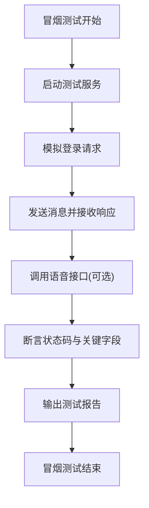

**图表来源**
- [smoke-test.sh](file://tests/e2e/smoke-test.sh)

**章节来源**
- [smoke-test.sh](file://tests/e2e/smoke-test.sh)

### 应用配置与环境变量
- 后端配置：数据库连接、Redis地址、JWT密钥、第三方服务URL等。
- 前端配置：API基础路径、WebSocket地址、主题与语言包。
- 安全建议：敏感信息通过环境变量注入，避免硬编码。

**更新** 环境变量配置现在包含parent-h5相关的配置项，确保三端应用的一致性。

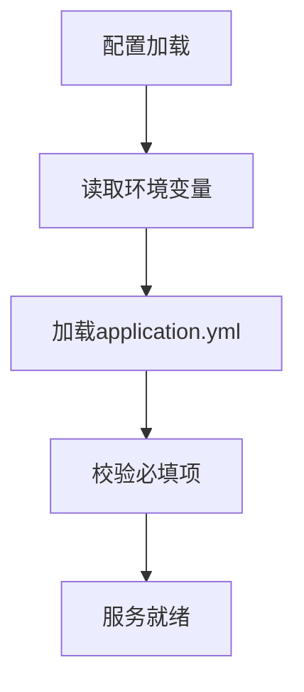

**图表来源**
- [application.yml](file://backend/counseling-app/src/main/resources/application.yml)

**章节来源**
- [application.yml](file://backend/counseling-app/src/main/resources/application.yml)

### Python子服务（TTS与语音）
- 依赖管理：requirements.txt声明Python库版本，确保构建一致性。
- 运行方式：独立Docker镜像，暴露HTTP接口供后端调用。

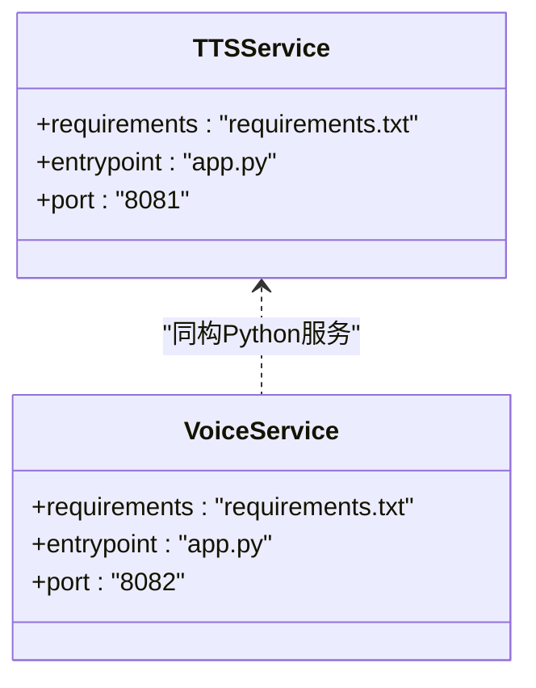

**图表来源**
- [app.py](file://backend/tts-service/app.py)
- [requirements.txt](file://backend/tts-service/requirements.txt)
- [app.py](file://backend/voice-service/app.py)
- [requirements.txt](file://backend/voice-service/requirements.txt)

**章节来源**
- [app.py](file://backend/tts-service/app.py)
- [requirements.txt](file://backend/tts-service/requirements.txt)
- [app.py](file://backend/voice-service/app.py)
- [requirements.txt](file://backend/voice-service/requirements.txt)

## 依赖关系分析
- 构建依赖：Maven聚合模块间存在强依赖，需按顺序编译；前端依赖Node与包管理器。
- 运行时依赖：后端依赖数据库、Redis与外部LLM/TTS服务；前端依赖Nginx与API网关。
- 部署依赖：Compose编排依赖镜像仓库、证书与端口规划；监控依赖Prometheus与Grafana。

**更新** 新增了parent-h5的构建和部署依赖，确保三端应用的完整依赖链。

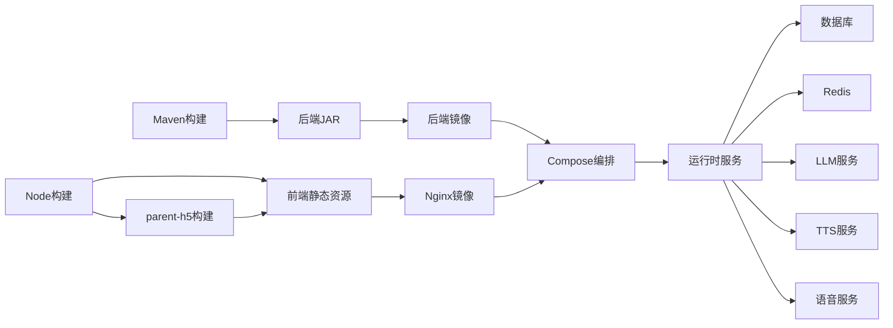

**图表来源**
- [pom.xml](file://backend/pom.xml)
- [Dockerfile](file://backend/Dockerfile)
- [Dockerfile](file://frontend/Dockerfile)
- [docker-compose.yml](file://deploy/docker-compose.yml)

**章节来源**
- [pom.xml](file://backend/pom.xml)
- [Dockerfile](file://backend/Dockerfile)
- [Dockerfile](file://frontend/Dockerfile)
- [docker-compose.yml](file://deploy/docker-compose.yml)

## 性能考量
- 依赖缓存：充分利用Maven与npm缓存，减少重复下载时间。
- 并行构建：拆分前后端与多模块构建任务，缩短整体耗时。
- 镜像优化：使用多阶段构建与精简基础镜像，降低镜像体积与启动时间。
- 健康检查：合理设置探针超时与重试次数，避免误判导致频繁重启。
- 资源限制：为各容器设置CPU与内存上限，防止资源争用影响稳定性。

**更新** 针对三端应用的构建进行了并行优化，提升了整体构建效率。

## 故障排查指南
- 构建失败
  - 检查Java/Node版本与缓存键是否正确。
  - 查看Maven编译日志与单元测试失败用例。
  - 确认parent-h5依赖安装是否正常。
- 集成测试失败
  - 检查Testcontainers是否能正常启动PostgreSQL和Redis服务。
  - 验证pgvector扩展是否正确安装。
  - 确认数据库连接参数和网络配置。
- 冒烟测试失败
  - 检查测试环境服务是否成功启动。
  - 验证API端点和WebSocket连接。
  - 确认/parent路由配置是否正确。
- 服务不可用
  - 检查端口占用、防火墙与证书有效性。
  - 验证数据库与Redis连接参数。
  - 确认/parent路由是否能正常访问。

**更新** 新增了集成测试和冒烟测试相关的故障排查指导。

**章节来源**
- [ci.yml](file://.github/workflows/ci.yml)
- [docker-compose.yml](file://deploy/docker-compose.yml)
- [setup-server.sh](file://deploy/setup-server.sh)
- [default.conf](file://deploy/nginx/default.conf)

## 结论
本CI/CD流水线围绕"构建可靠、测试充分、部署稳定"的目标设计，结合Maven与Docker标准化后端构建，Node与Nginx标准化前端构建，Compose统一编排与监控集成，形成闭环交付能力。

**更新** 本次更新显著增强了测试能力，引入了基于Testcontainers的集成测试框架和端到端冒烟测试，同时移除了不稳定的Oracle Cloud部署自动化流程。建议持续优化缓存策略、并行度与镜像大小，完善健康检查与回滚机制，进一步提升交付效率与系统稳定性。

## 附录
- 术语说明
  - CI：持续集成，自动化构建与测试。
  - CD：持续部署，自动化镜像构建与部署。
  - Compose：容器编排工具，统一管理多服务生命周期。
  - Testcontainers：用于在CI环境中启动和管理容器化依赖的服务。
- 最佳实践
  - 使用语义化版本标签，便于回滚与审计。
  - 将敏感配置放入环境变量或密钥管理服务。
  - 为关键路径编写端到端测试，保障用户体验。
  - 为多端应用建立统一的构建和部署流程。
  - 使用Testcontainers进行可靠的集成测试。

**更新** 新增了Testcontainers和多端应用的最佳实践指导。
