# 开发指南

<cite>
**本文引用的文件**   
- [README.md](file://README.md)
- [STRUCTURE.md](file://STRUCTURE.md)
- [sync-rules.sh](file://sync-rules.sh)
- [deploy/docker-compose.yml](file://deploy/docker-compose.yml)
- [backend/counseling-app/src/main/resources/application.yml](file://backend/counseling-app/src/main/resources/application.yml)
- [backend/pom.xml](file://backend/pom.xml)
- [deploy/init/pg-init.sql](file://deploy/init/pg-init.sql)
- [frontend/student-h5/vite.config.js](file://frontend/student-h5/vite.config.js)
- [frontend/teacher-web/vite.config.js](file://frontend/teacher-web/vite.config.js)
- [deploy/init-school.sh](file://deploy/init-school.sh)
</cite>

## 更新摘要
**所做更改**   
- 新增Vite开发服务器HTTPS支持配置，通过VITE_HTTPS环境变量启用安全连接
- 增强allowedHosts白名单功能，支持公共隧道域名访问
- 完善前端开发环境配置，提升本地开发和调试体验
- 优化开发服务器安全设置，支持HTTPS和跨域访问
- **新增** 学校初始化脚本deploy/init-school.sh，自动化新学校租户、默认管理员账户和邀请码的设置

## 目录
1. [简介](#简介)
2. [项目结构](#项目结构)
3. [核心组件](#核心组件)
4. [架构总览](#架构总览)
5. [详细组件分析](#详细组件分析)
6. [依赖分析](#依赖分析)
7. [性能考虑](#性能考虑)
8. [故障排查指南](#故障排查指南)
9. [结论](#结论)
10. [附录](#附录)

## 简介
本指南面向AI心理咨询系统的开发者，提供从环境搭建、依赖安装与配置，到Agent工作流设计与实现（任务调度、状态管理、错误处理）、代码规范、开发流程与测试策略的完整说明。同时涵盖常用脚本工具的使用、版本控制与发布流程，以及新成员快速上手建议与最佳实践。

**重大更新** 后端技术栈已从Python完全迁移到Java，采用Maven多模块构建系统，显著提升系统性能和可维护性。新增Docker Compose开发环境、Flyway数据库迁移管理、Testcontainers测试基础设施，以及完整的容器化部署方案。**最新更新** Vite开发服务器增强了HTTPS支持和allowedHosts白名单功能，提供更好的本地开发体验和安全性。**新增** 学校初始化脚本deploy/init-school.sh，自动化新学校租户、默认管理员账户和邀请码的设置，显著减少了为新机构配置咨询系统的时间。

## 项目结构
仓库采用"文档驱动 + 脚本辅助 + Java后端"的组织方式：
- backend：Java后端服务（Spring Boot多模块）
- frontend：前端应用（Vue 3 + Vite）
- deploy：Docker容器化部署配置
- design：系统设计与原则文档
- prompts：提示词与对话设计相关记录
- scripts：用于生成文档与自动化流程的工具脚本
- tests：单元测试、集成测试与端到端测试
- PRD：产品需求文档
- tmp：临时文件
- 根级配置文件与说明：README.md、STRUCTURE.md、sync-rules.sh

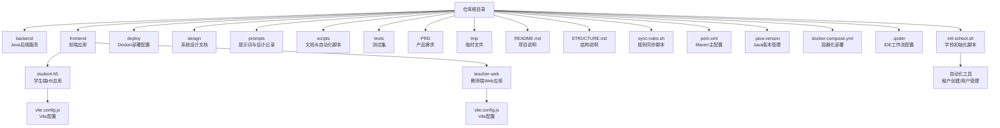

**图表来源**
- [README.md](file://README.md)
- [STRUCTURE.md](file://STRUCTURE.md)
- [sync-rules.sh](file://sync-rules.sh)
- [deploy/docker-compose.yml](file://deploy/docker-compose.yml)
- [deploy/init-school.sh](file://deploy/init-school.sh)
- [frontend/student-h5/vite.config.js](file://frontend/student-h5/vite.config.js)
- [frontend/teacher-web/vite.config.js](file://frontend/teacher-web/vite.config.js)

**章节来源**
- [README.md](file://README.md)
- [STRUCTURE.md](file://STRUCTURE.md)

## 核心组件
- Agent工作流：负责咨询会话的任务编排、状态流转与异常恢复。
- 提示词系统：管理多轮对话中的Prompt模板、上下文注入与版本化。
- 业务模型：定义用户画像、风险等级、干预策略等业务实体与关系。
- 安全与合规：儿童保护、隐私保护、风险评估与上报机制。
- 文档与规范：通过脚本自动生成与维护文档，确保一致性。
- **新增** Docker Compose开发环境：一键启动完整的开发环境，包括数据库、缓存等依赖服务。
- **新增** Flyway数据库迁移：版本化的数据库结构管理，支持自动迁移和回滚。
- **新增** Testcontainers测试基础设施：容器化测试环境，提供真实的数据库和中间件测试。
- **新增** Maven多模块构建：模块化项目结构，支持独立编译和部署。
- **新增** Vite开发服务器：现代化的前端开发工具，支持热重载和快速构建。
- **新增** HTTPS支持：通过环境变量配置HTTPS，提升本地开发安全性。
- **新增** allowedHosts白名单：支持公共隧道域名访问，便于远程调试和协作。
- **新增** 学校初始化脚本：自动化新学校租户、默认管理员账户和邀请码的设置。

本节为概念性概述，不直接分析具体文件。

## 架构总览
下图展示系统的高层组件交互：客户端发起咨询请求，路由至Agent编排器；编排器根据阶段选择相应策略（如CBT流程），调用提示词系统与业务模型服务；必要时触发安全与合规检查；结果返回客户端并持久化会话状态。

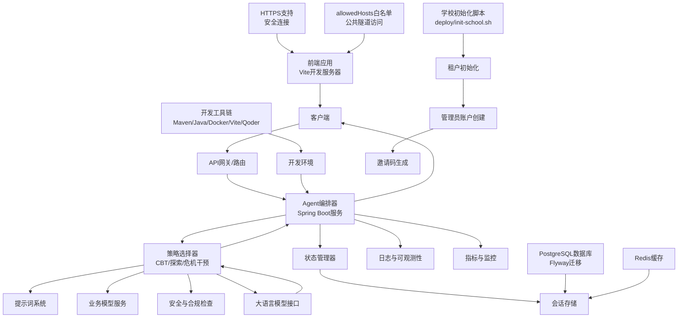

[此图为概念性架构图，未映射到具体源文件，故不提供图表来源]

## 详细组件分析

### Agent工作流设计与实现
- 任务调度
  - 基于阶段的状态机驱动，支持并行子任务与重试策略。
  - 事件总线用于解耦各阶段之间的通信。
- 状态管理
  - 会话级状态包含：阶段、上下文摘要、风险评分、已执行动作、审计轨迹。
  - 状态变更需幂等且可回放，便于调试与回溯。
- 错误处理
  - 分级错误分类：输入校验失败、外部依赖不可用、LLM响应异常、业务规则冲突。
  - 统一错误码与可观测字段，结合重试、降级与熔断策略。
- 可观测性与审计
  - 关键路径埋点：进入/退出阶段、决策分支、外部调用耗时与错误率。
  - 审计日志保留必要脱敏信息，满足合规要求。

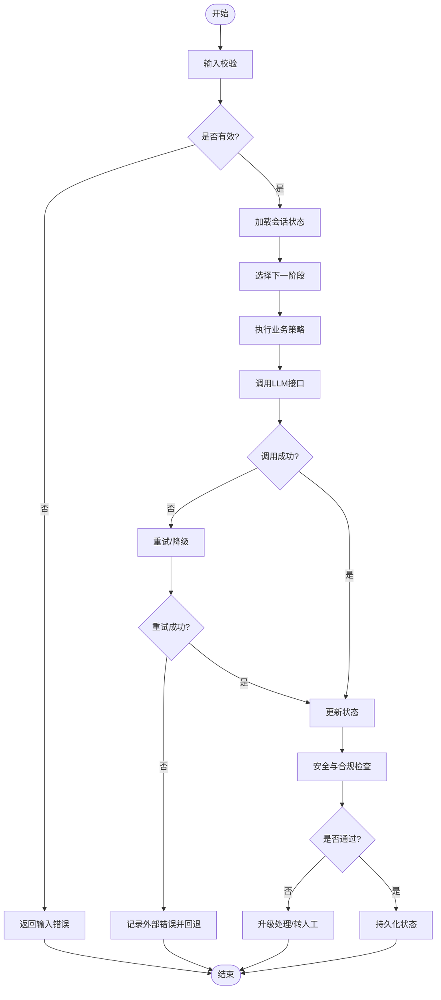

**章节来源**
- [design/BEACON.md](file://design/BEACON.md)
- [prompts/20260529-初始探索prompt记录.md](file://prompts/20260529-初始探索prompt记录.md)

### 提示词系统
- 职责
  - 管理Prompt模板、变量注入、版本控制与A/B实验开关。
  - 提供上下文组装器，将用户画像、历史摘要、策略参数合并为最终Prompt。
- 版本与回滚
  - 每个Prompt具备唯一标识与版本号，支持灰度发布与快速回滚。
- 质量保障
  - 静态检查：长度、敏感词过滤、必填变量校验。
  - 回归测试：使用固定用例集评估输出稳定性与安全性。

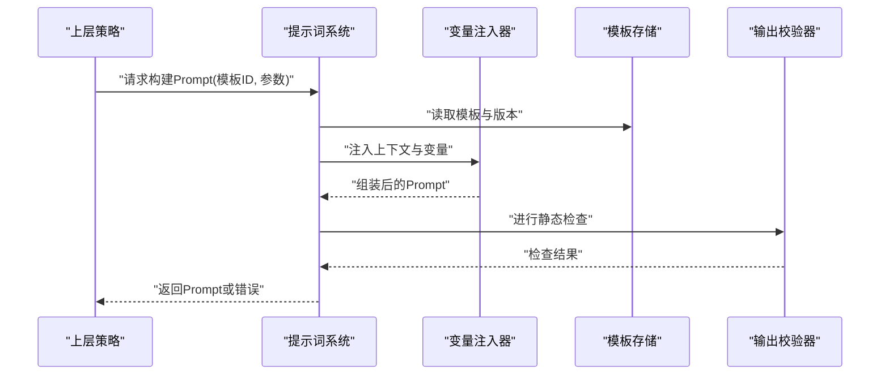

**章节来源**
- [prompts/20260529-初始探索prompt记录.md](file://prompts/20260529-初始探索prompt记录.md)

### 业务模型与安全合规
- 业务模型
  - 用户画像：人口学特征、心理量表得分、风险标签。
  - 干预策略：CBT流程、情绪调节、危机干预路径。
- 安全与合规
  - 儿童保护：未成年人识别、监护人通知、强制上报。
  - 隐私保护：数据最小化、加密存储、访问审计。
  - 风险评估：实时风险评分与阈值告警。

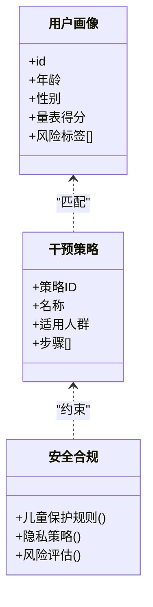

**章节来源**
- [design/BEACON.md](file://design/BEACON.md)

### 文档与自动化脚本
- 目标
  - 通过脚本自动维护Agent工作流、CBT流程图、儿童安全、Prompt设计与系统等文档，减少手工维护成本。
- 现状（2026-08 deadcode 清理）
  - 一次性 docx 生成脚本（create_agent_workflow_doc.js / create_cbt_flow_tree_doc.js / create_child_safety_doc.js / create_prompt_design_doc.js / create_prompt_doc_v2.js / create_prompt_system_doc.js / create_business_model_doc.py）已全部归档并删除（doc/ 下 docx 产物已入库，无需再生成）
  - 保留 scripts/subset-font.sh（字体子集化工具）

### Docker Compose开发环境设置
**新增** 完整的Docker Compose开发环境，支持一键启动所有依赖服务。

#### 环境架构
- PostgreSQL数据库：主数据存储，支持Flyway自动迁移
- Redis缓存：会话缓存和热点数据缓存
- Spring Boot应用：主应用服务
- 初始化脚本：数据库初始化和种子数据

#### 服务配置
- 端口映射：应用服务8080端口，数据库5432端口，Redis6379端口
- 数据持久化：数据库和缓存数据卷挂载
- 环境变量：数据库连接配置、应用配置
- 健康检查：服务启动完成检测

```mermaid
graph TB
Subgraph["Docker Compose环境"]
APP["Spring Boot应用<br/>:8080"]
DB["PostgreSQL数据库<br/>:5432"]
CACHE["Redis缓存<br/>:6379"]
INIT["初始化脚本<br/>pg-init.sql"]
end
Subgraph["数据持久化"]
DB_VOL["数据库数据卷"]
CACHE_VOL["缓存数据卷"]
end
APP --> DB
APP --> CACHE
INIT --> DB
DB --> DB_VOL
CACHE --> CACHE_VOL
```

**图表来源**
- [deploy/docker-compose.yml](file://deploy/docker-compose.yml)
- [deploy/init/pg-init.sql](file://deploy/init/pg-init.sql)

**章节来源**
- [deploy/docker-compose.yml](file://deploy/docker-compose.yml)
- [deploy/init/pg-init.sql](file://deploy/init/pg-init.sql)

### Vite开发服务器HTTPS支持
**新增** Vite开发服务器增强了HTTPS支持，通过环境变量配置安全连接和白名单访问。

#### HTTPS配置
- 环境变量：通过VITE_HTTPS=true启用HTTPS支持
- 证书管理：自动生成本地开发证书
- 协议切换：支持HTTP和HTTPS自动切换

#### allowedHosts白名单
- 域名配置：通过allowedHosts数组配置允许的域名
- 公共隧道：支持ngrok、localtunnel等公共隧道域名
- 安全验证：防止恶意域名访问开发服务器

#### 开发环境优化
- 热重载：代码修改自动刷新浏览器
- 代理配置：前后端分离开发时的API代理
- 调试工具：内置浏览器开发者工具支持

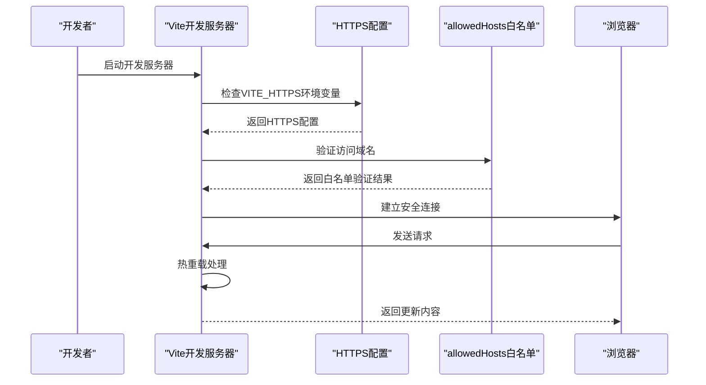

**图表来源**
- [frontend/student-h5/vite.config.js](file://frontend/student-h5/vite.config.js)
- [frontend/teacher-web/vite.config.js](file://frontend/teacher-web/vite.config.js)

**章节来源**
- [frontend/student-h5/vite.config.js](file://frontend/student-h5/vite.config.js)
- [frontend/teacher-web/vite.config.js](file://frontend/teacher-web/vite.config.js)

### 学校初始化脚本
**新增** 完整的学校初始化脚本deploy/init-school.sh，自动化新学校租户、默认管理员账户和邀请码的设置。

#### 脚本功能
- 租户创建：为新学校创建独立的租户环境
- 管理员账户：自动生成默认管理员账户和权限
- 邀请码生成：为学校创建专用的邀请码系统
- 配置初始化：设置学校特定的业务配置

#### 使用方式
- 执行脚本：`bash deploy/init-school.sh`
- 参数配置：支持自定义学校名称、管理员信息等参数
- 批量部署：支持多个学校的批量初始化

#### 自动化流程
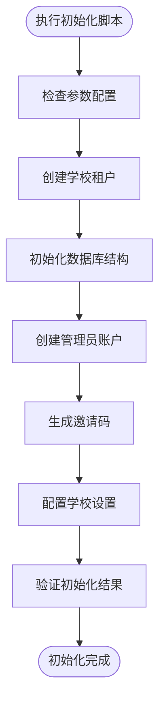

**图表来源**
- [deploy/init-school.sh](file://deploy/init-school.sh)

**章节来源**
- [deploy/init-school.sh](file://deploy/init-school.sh)

### Flyway数据库迁移管理
**新增** 基于Flyway的版本化数据库迁移管理。

#### 迁移策略
- 版本命名：V{version}__{description}.sql格式
- 单向迁移：只支持向前迁移，不支持自动回滚
- 幂等性：迁移脚本应支持重复执行
- 事务性：单个迁移脚本内的事务保证

#### 迁移文件结构
- V1__init_public_schema.sql：公共表结构初始化
- V2__init_tenant_template.sql：租户模板数据
- V3__seed_data.sql：种子数据和初始配置

#### 配置管理
- 自动迁移：应用启动时自动执行未应用的迁移
- 迁移验证：迁移前后数据库结构验证
- 迁移日志：详细的迁移执行日志

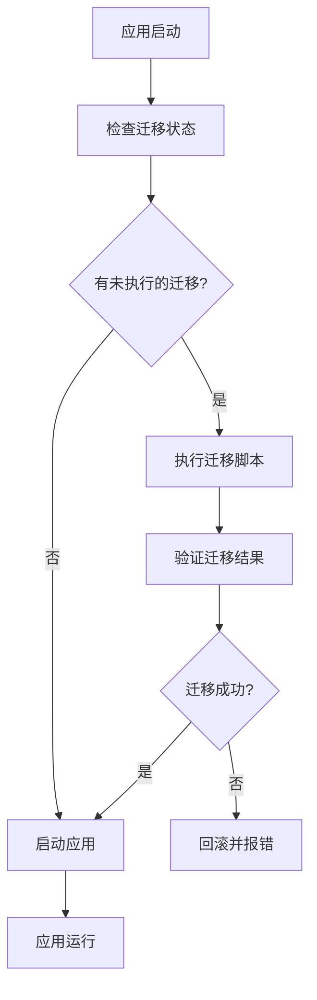

**图表来源**
- [backend/counseling-app/src/main/resources/application.yml](file://backend/counseling-app/src/main/resources/application.yml)

**章节来源**
- [backend/counseling-app/src/main/resources/application.yml](file://backend/counseling-app/src/main/resources/application.yml)

### Testcontainers测试基础设施
**新增** 基于Testcontainers的容器化测试环境。

#### 测试架构
- 真实依赖：使用真实的PostgreSQL和Redis容器进行测试
- 隔离性：每个测试类独立的数据库实例
- 生命周期：测试结束后自动清理容器资源
- 配置管理：测试专用的配置文件

#### 测试类型
- 单元测试：纯逻辑测试，无需容器
- 集成测试：需要数据库连接的测试
- 端到端测试：完整业务流程测试

#### 配置示例
- 数据库容器：PostgreSQL 15镜像
- 缓存容器：Redis 7镜像
- 网络隔离：测试专用网络
- 数据准备：测试数据初始化脚本

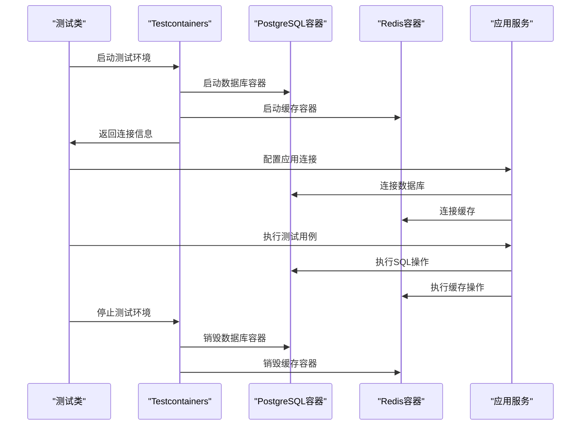

**图表来源**
- [backend/pom.xml](file://backend/pom.xml)

**章节来源**
- [backend/pom.xml](file://backend/pom.xml)

### Java后端服务架构
**更新** 基于Spring Boot的企业级后端服务架构，提供高性能的RESTful API接口，集成Docker容器化和数据库迁移管理。

#### 技术栈概览
- Spring Boot 3.x：现代化Java应用框架
- Maven多模块：模块化项目结构和依赖管理
- Spring Data JPA：数据访问层抽象
- Spring Security：安全认证和授权
- Flyway：数据库迁移管理
- Testcontainers：容器化测试基础设施
- Docker容器化：标准化部署环境

#### 模块结构
- core：核心业务逻辑和领域模型
- api：RESTful API接口定义
- service：业务服务层实现
- repository：数据访问层
- common：公共工具和配置

```mermaid
graph TB
Subgraph["Java后端服务"]
CORE["core模块<br/>核心业务逻辑"]
API["api模块<br/>REST接口"]
SERVICE["service模块<br/>业务服务"]
REPO["repository模块<br/>数据访问"]
COMMON["common模块<br/>公共工具"]
FLYWAY["Flyway<br/>数据库迁移"]
TESTCONTAINERS["Testcontainers<br/>测试基础设施"]
end
Subgraph["基础设施"]
DB["数据库<br/>PostgreSQL"]
CACHE["缓存<br/>Redis"]
MQ["消息队列<br/>RabbitMQ/Kafka"]
DOCKER["Docker容器<br/>容器化部署"]
end
API --> SERVICE
SERVICE --> CORE
SERVICE --> REPO
REPO --> DB
SERVICE --> CACHE
SERVICE --> MQ
COMMON --> CORE
FLYWAY --> DB
TESTCONTAINERS --> DB
TESTCONTAINERS --> CACHE
DOCKER --> FLyway
DOCKER --> TESTCONTAINERS
```

**图表来源**
- [backend/pom.xml](file://backend/pom.xml)
- [deploy/docker-compose.yml](file://deploy/docker-compose.yml)

**章节来源**
- [backend/pom.xml](file://backend/pom.xml)

### 开发工具链配置
**更新** 现代化的Java开发工具链配置，提升开发效率与团队协作体验，集成Docker容器化开发环境和Vite前端开发工具。

#### Java环境管理 (SDKMAN!)
- SDKMAN!作为Java版本管理工具，支持多版本切换
- 支持Spring Boot、Maven、Gradle等构建工具管理
- 配置文件：.sdkmanrc、.java-version

#### Maven多模块构建
- Maven作为Java项目构建和依赖管理工具
- 支持多模块项目结构、依赖解析和生命周期管理
- 配置文件：pom.xml、settings.xml

#### Vite前端开发工具
- Vite作为现代前端构建工具，提供极速的开发体验
- 支持热重载、代码分割和按需加载
- 配置文件：vite.config.js、package.json

#### Docker Compose容器化部署
- 标准化开发、测试、生产环境
- 一键启动Java应用和依赖服务（数据库、缓存、消息队列）
- 配置文件：docker-compose.yml、Dockerfile

#### Qoder IDE工作流优化
- 预配置Java开发环境设置
- 集成Spring Boot插件、代码格式化、linting规则
- 自动化构建任务和调试配置

```mermaid
graph TB
Subgraph["开发工具链"]
SDKMAN["SDKMAN!<br/>Java版本管理"]
MAVEN["Maven<br/>构建和依赖管理"]
VITE["Vite<br/>前端开发工具"]
DOCKER["Docker Compose<br/>容器化部署"]
QODER["Qoder IDE<br/>Java工作流优化"]
FLYWAY["Flyway<br/>数据库迁移"]
TESTCONTAINERS["Testcontainers<br/>测试基础设施"]
INITSCRIPT["学校初始化脚本<br/>deploy/init-school.sh"]
end
Subgraph["开发环境"]
JDK["JDK环境<br/>多版本隔离"]
MODULES["Maven模块<br/>依赖解析"]
FRONTEND["前端应用<br/>Vite开发服务器"]
CONTAINERS["容器服务<br/>数据库/缓存/队列"]
DB_MIGRATION["数据库迁移<br/>自动执行"]
TEST_ENV["测试环境<br/>容器化测试"]
HTTPS["HTTPS支持<br/>安全连接"]
ALLOWED_HOSTS["allowedHosts<br/>白名单访问"]
TENANT_SETUP["租户初始化<br/>学校配置"]
end
SDKMAN --> JDK
MAVEN --> MODULES
VITE --> FRONTEND
DOCKER --> CONTAINERS
QODER --> SDKMAN
QODER --> MAVEN
QODER --> VITE
QODER --> DOCKER
FLYWAY --> DB_MIGRATION
TESTCONTAINERS --> TEST_ENV
INITSCRIPT --> TENANT_SETUP
HTTPS --> FRONTEND
ALLOWED_HOSTS --> FRONTEND
```

**图表来源**
- [README.md](file://README.md)
- [STRUCTURE.md](file://STRUCTURE.md)
- [deploy/docker-compose.yml](file://deploy/docker-compose.yml)
- [deploy/init-school.sh](file://deploy/init-school.sh)
- [frontend/student-h5/vite.config.js](file://frontend/student-h5/vite.config.js)
- [frontend/teacher-web/vite.config.js](file://frontend/teacher-web/vite.config.js)

**章节来源**
- [README.md](file://README.md)
- [STRUCTURE.md](file://STRUCTURE.md)

## 依赖分析
- 运行时依赖
  - Java 17+运行时环境
  - Maven 3.8+构建工具
  - Node.js 18+前端开发环境
  - 大语言模型SDK/HTTP客户端（在backend中实现时引入）
- 开发与测试依赖
  - JUnit 5单元测试框架
  - Mockito模拟框架
  - Spring Boot Test集成测试套件
  - Testcontainers容器化测试
  - Vite前端构建工具
- 外部服务
  - 会话存储、对象存储、消息队列、监控与日志平台
- **更新** Java生态系统依赖
  - Spring Boot 3.x微服务框架
  - Spring Data JPA数据访问层
  - Spring Security安全框架
  - Lombok代码简化工具
  - Swagger API文档生成
  - Flyway数据库迁移
  - Testcontainers测试基础设施
- **新增** 前端依赖
  - Vue 3前端框架
  - Vite构建工具
  - TypeScript类型支持
  - ESLint代码检查

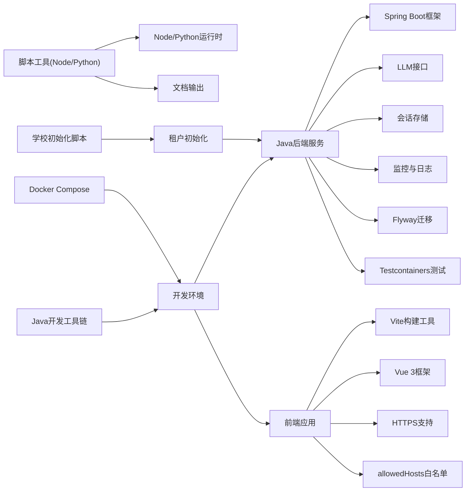

[此图为概念性依赖图，未映射到具体源文件，故不提供图表来源]

**章节来源**
- [README.md](file://README.md)
- [STRUCTURE.md](file://STRUCTURE.md)
- [backend/pom.xml](file://backend/pom.xml)
- [frontend/student-h5/package.json](file://frontend/student-h5/package.json)
- [frontend/teacher-web/package.json](file://frontend/teacher-web/package.json)

## 性能考虑
- 提示词构建缓存：对高频模板与稳定上下文进行缓存，降低重复计算。
- 并发与限流：对外部LLM调用实施并发限制与超时控制，避免雪崩。
- 状态压缩：会话状态增量更新与定期压缩，减少存储与传输开销。
- 异步编排：非阻塞I/O与事件驱动，提升吞吐与响应速度。
- 可观测性：关键指标采集（延迟、错误率、资源占用）与告警。
- **更新** Java应用性能优化
  - JVM调优：堆内存配置、垃圾回收器选择、线程池优化
  - Spring Boot优化：连接池配置、缓存策略、异步处理
  - 数据库优化：查询优化、索引设计、连接池管理
  - 容器化优化：镜像分层、资源限制、健康检查
  - **新增** 数据库迁移优化：Flyway迁移脚本性能优化，批量操作优化
  - **新增** 测试性能优化：Testcontainers容器复用，测试数据预热
- **新增** 前端性能优化
  - Vite构建优化：代码分割、懒加载、Tree Shaking
  - HTTPS性能：TLS握手优化、证书缓存
  - 开发服务器性能：热重载优化、增量编译
- **新增** 初始化脚本优化
  - 批量操作优化：减少数据库往返次数
  - 错误处理优化：部分失败不影响整体流程
  - 日志记录优化：详细的初始化过程跟踪

[本节为通用指导，不涉及具体文件]

## 故障排查指南
- 常见问题定位
  - 输入校验失败：检查必填字段、格式与范围。
  - LLM调用异常：查看网络连通性、鉴权、配额与超时设置。
  - 状态不一致：核对幂等键与事务边界，回放最近状态变更。
  - 安全拦截：确认风险阈值与规则配置是否正确。
- 诊断手段
  - 启用详细日志与Trace ID，关联上下游调用链。
  - 使用脚本工具重新生成文档，验证配置与模板一致性。
  - 运行回归测试集，对比基线输出差异。
- **更新** Java应用问题排查
  - JVM内存问题：分析heap dump和GC日志
  - 数据库连接问题：检查连接池配置和SQL性能
  - Spring Bean问题：查看依赖注入和循环依赖错误
  - 容器化问题：检查Docker日志和资源限制
  - Maven构建问题：清理本地仓库和依赖冲突
  - **新增** Docker Compose问题：检查容器网络、端口冲突、数据卷权限
  - **新增** Flyway迁移问题：检查迁移脚本语法、数据库连接、迁移状态
  - **新增** Testcontainers问题：检查容器镜像下载、网络配置、资源限制
- **新增** Vite开发服务器问题排查
  - HTTPS证书问题：检查VITE_HTTPS环境变量和证书生成
  - allowedHosts白名单问题：验证域名配置和网络访问
  - 热重载失效：检查文件监听和浏览器缓存
  - 代理配置问题：验证前后端API代理设置
- **新增** 学校初始化脚本问题排查
  - 参数验证问题：检查脚本参数格式和完整性
  - 数据库连接问题：验证数据库连接配置
  - 权限问题：检查数据库用户权限
  - 网络问题：验证API服务可达性

**章节来源**
- [sync-rules.sh](file://sync-rules.sh)
- [frontend/student-h5/vite.config.js](file://frontend/student-h5/vite.config.js)
- [frontend/teacher-web/vite.config.js](file://frontend/teacher-web/vite.config.js)
- [deploy/init-school.sh](file://deploy/init-school.sh)

## 结论
本指南提供了AI心理咨询系统的整体开发视角，涵盖架构、组件、流程与工具。建议团队遵循文档驱动与脚本自动化，强化状态管理与错误处理，完善可观测性与测试体系，以确保系统的安全、稳定与可扩展。

**重大更新** 通过后端技术栈从Python迁移到Java，采用Spring Boot微服务架构和Maven多模块构建系统，显著提升了系统性能、可维护性和企业级特性。新增的Docker Compose开发环境、Flyway数据库迁移管理和Testcontainers测试基础设施进一步改善了开发体验和部署效率。**最新更新** Vite开发服务器的HTTPS支持和allowedHosts白名单功能，为前端开发提供了更安全、更灵活的本地开发环境。**新增** 学校初始化脚本deploy/init-school.sh，自动化了新学校租户、默认管理员账户和邀请码的设置，显著减少了为新机构配置咨询系统的时间。

## 附录

### 环境搭建与依赖安装
- 前置条件
  - 操作系统：Linux/macOS/Windows（推荐Linux）
  - Java 17+运行时环境
  - Maven 3.8+构建工具
  - Node.js 18+前端开发环境
  - Docker和Docker Compose
- **更新** 安装Java开发工具链
  - 安装SDKMAN!：`curl -s "https://get.sdkman.io" | bash`
  - 安装Java 17：`sdk install java 17.0.8-open`
  - 安装Maven：`sdk install maven 3.9.4`
  - 安装Node.js：参考官方文档安装Node.js 18+
  - 安装Docker Compose：参考官方文档
  - 配置Qoder IDE：导入Java项目预设配置
- 安装步骤
  - 克隆仓库并进入根目录
  - **更新** 初始化Java环境：`sdk use java 17.0.8-open`
  - **更新** 构建Java项目：`mvn clean install`
  - **更新** 运行后端服务：`cd backend && mvn spring-boot:run`
  - 安装Node与Python依赖（用于脚本工具）
  - 配置环境变量（LLM密钥、存储连接、监控接入等）
- 本地启动
  - **新增** 使用Docker启动完整开发环境：`docker-compose up -d`
  - **新增** 检查服务状态：`docker-compose ps`
  - **新增** 查看应用日志：`docker-compose logs app`
  - **新增** 停止开发环境：`docker-compose down`
  - **新增** 启动前端开发服务器：`cd frontend/student-h5 && npm run dev`
  - **新增** 启用HTTPS开发模式：`export VITE_HTTPS=true && npm run dev`
  - **新增** 配置allowedHosts白名单：在vite.config.js中添加域名列表
  - **新增** 执行学校初始化脚本：`bash deploy/init-school.sh`
  - 运行脚本工具生成文档，验证环境正确性
  - 启动Java后端服务：`mvn spring-boot:run`

**章节来源**
- [README.md](file://README.md)
- [STRUCTURE.md](file://STRUCTURE.md)
- [deploy/docker-compose.yml](file://deploy/docker-compose.yml)
- [deploy/init-school.sh](file://deploy/init-school.sh)
- [frontend/student-h5/vite.config.js](file://frontend/student-h5/vite.config.js)
- [frontend/teacher-web/vite.config.js](file://frontend/teacher-web/vite.config.js)

### 数据库迁移管理
**新增** 基于Flyway的数据库版本化管理。

#### 迁移文件创建
- 命名规范：V{版本号}__{描述}.sql
- 版本递增：每次修改数据库结构时增加版本号
- 描述清晰：文件名应清楚描述迁移内容

#### 迁移脚本编写
- 幂等性：脚本应支持重复执行
- 事务性：单个脚本内的操作应在事务中执行
- 注释说明：添加必要的注释说明迁移目的

#### 迁移执行
- 自动执行：应用启动时自动执行未应用的迁移
- 手动执行：可通过Maven命令手动执行迁移
- 状态查看：查看当前数据库迁移状态

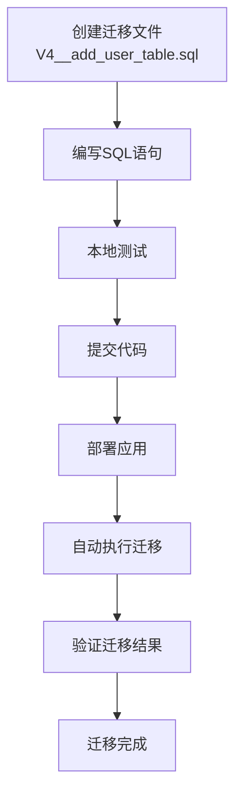

**图表来源**
- [backend/counseling-app/src/main/resources/db/migration/V1__init_public_schema.sql](file://backend/counseling-app/src/main/resources/db/migration/V1__init_public_schema.sql)

**章节来源**
- [backend/counseling-app/src/main/resources/db/migration/V1__init_public_schema.sql](file://backend/counseling-app/src/main/resources/db/migration/V1__init_public_schema.sql)
- [backend/counseling-app/src/main/resources/db/migration/V2__init_tenant_template.sql](file://backend/counseling-app/src/main/resources/db/migration/V2__init_tenant_template.sql)
- [backend/counseling-app/src/main/resources/db/migration/V3__seed_data.sql](file://backend/counseling-app/src/main/resources/db/migration/V3__seed_data.sql)

### 测试环境与基础设施
**新增** 基于Testcontainers的容器化测试环境。

#### 测试环境配置
- 数据库测试：使用PostgreSQL容器进行数据库测试
- 缓存测试：使用Redis容器进行缓存测试
- 网络配置：测试专用网络隔离
- 数据准备：测试数据初始化脚本

#### 测试执行
- 单元测试：无需容器，直接执行
- 集成测试：自动启动容器，执行测试后清理
- 端到端测试：完整的服务间通信测试

#### 测试最佳实践
- 测试数据隔离：每个测试类独立的数据空间
- 资源清理：测试结束后自动清理容器资源
- 性能考虑：合理设置容器资源限制


**图表来源**
- [backend/pom.xml](file://backend/pom.xml)

**章节来源**
- [backend/pom.xml](file://backend/pom.xml)

### Vite开发服务器配置
**新增** Vite开发服务器的HTTPS支持和allowedHosts白名单配置。

#### HTTPS配置
- 环境变量：通过VITE_HTTPS=true启用HTTPS
- 证书管理：自动生成本地开发证书
- 协议切换：支持HTTP和HTTPS自动切换

#### allowedHosts白名单配置
- 域名数组：在vite.config.js中配置allowedHosts数组
- 公共隧道：支持ngrok、localtunnel等公共隧道域名
- 安全验证：防止恶意域名访问

#### 开发服务器优化
- 热重载：代码修改自动刷新浏览器
- 代理配置：前后端分离开发时的API代理
- 调试工具：内置浏览器开发者工具支持

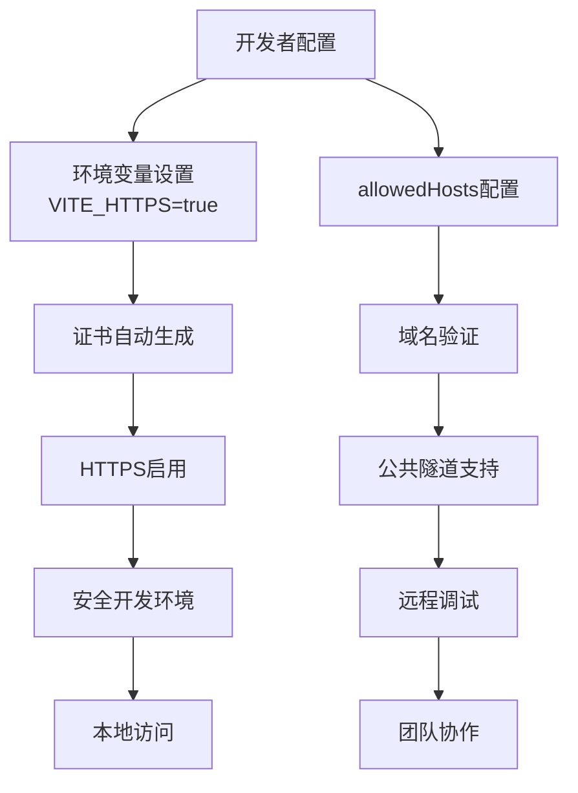

**图表来源**
- [frontend/student-h5/vite.config.js](file://frontend/student-h5/vite.config.js)
- [frontend/teacher-web/vite.config.js](file://frontend/teacher-web/vite.config.js)

**章节来源**
- [frontend/student-h5/vite.config.js](file://frontend/student-h5/vite.config.js)
- [frontend/teacher-web/vite.config.js](file://frontend/teacher-web/vite.config.js)

### 学校初始化脚本使用指南
**新增** 学校初始化脚本的详细使用说明。

#### 脚本功能
- 自动化新学校租户创建
- 默认管理员账户设置
- 邀请码系统初始化
- 学校特定配置设置

#### 使用方法
- 基本用法：`bash deploy/init-school.sh`
- 参数配置：支持自定义学校名称、管理员邮箱等参数
- 批量部署：支持多个学校的连续初始化

#### 配置选项
- 学校基本信息：名称、地址、联系方式
- 管理员账户：用户名、密码、权限设置
- 邀请码配置：有效期、使用次数限制
- 业务配置：咨询时长、预约规则等

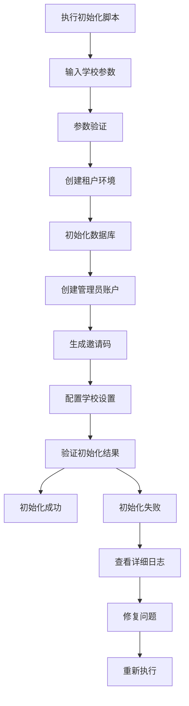

**图表来源**
- [deploy/init-school.sh](file://deploy/init-school.sh)

**章节来源**
- [deploy/init-school.sh](file://deploy/init-school.sh)

### 代码规范与开发流程
- 代码风格
  - 命名约定、模块划分、注释与文档字符串
  - 错误类型与错误码规范
- 提交规范
  - 语义化提交信息、变更清单与影响范围说明
- 分支策略
  - 主干保护、功能分支与热修复分支
- 代码审查
  - 至少一名Reviewer，关注安全、性能与可维护性
- 持续集成
  - 自动化构建、测试与文档生成
- **更新** Java开发规范
  - 遵循阿里巴巴Java开发手册
  - 使用SpotBugs和SonarQube进行代码质量检查
  - 统一的日志规范和异常处理模式
  - RESTful API设计规范
  - 单元测试覆盖率要求（≥80%）
  - **新增** Docker容器化规范：镜像优化、安全扫描
  - **新增** 数据库迁移规范：Flyway脚本编写标准
  - **新增** 测试规范：Testcontainers使用指南
  - **新增** 前端开发规范：Vite配置、ESLint规则、TypeScript使用
  - **新增** 脚本开发规范：Shell脚本编写标准、错误处理、日志记录

**章节来源**
- [sync-rules.sh](file://sync-rules.sh)

### 测试策略
- 单元测试：覆盖核心逻辑与边界条件
- 集成测试：验证组件间交互与外部依赖模拟
- 端到端测试：模拟真实用户旅程与关键场景
- 回归测试：Prompt与策略输出的稳定性验证
- **更新** Java测试框架
  - JUnit 5单元测试框架
  - Mockito模拟框架
  - Spring Boot Test集成测试
  - Testcontainers容器化测试
  - 性能测试和压力测试
  - **新增** 数据库迁移测试：验证迁移脚本的正确性
  - **新增** 容器化测试：验证Docker配置和服务发现
  - **新增** 前端测试：Vite测试配置、组件测试、E2E测试
  - **新增** 脚本测试：Shell脚本功能测试和边界情况测试

**章节来源**
- [README.md](file://README.md)
- [STRUCTURE.md](file://STRUCTURE.md)
- [backend/pom.xml](file://backend/pom.xml)

### 版本控制与发布流程
- 版本策略
  - 语义化版本（主.次.修订）
  - 变更日志与里程碑
- 发布流程
  - 预发布环境验证、灰度发布与回滚预案
  - 文档与资产同步发布
- **更新** Java应用发布流程
  - Maven多模块构建和打包
  - Docker镜像构建和推送
  - Kubernetes部署配置
  - 滚动更新和健康检查
  - 版本回滚和蓝绿部署
  - **新增** 数据库迁移管理：Flyway迁移脚本的版本控制
  - **新增** 容器化发布：Docker Compose和Kubernetes配置管理
  - **新增** 前端构建优化：Vite构建产物优化、CDN部署
  - **新增** 脚本版本管理：初始化脚本的版本控制和兼容性保证

**章节来源**
- [README.md](file://README.md)

### 常用工具使用方法
- 文档生成脚本
  - Node脚本：node scripts/create_agent_workflow_doc.js
  - Python脚本：python scripts/create_business_model_doc.py
- 规则同步
  - 执行根目录脚本以同步规则与配置
- **更新** Java开发工具使用
  - Maven命令：`mvn clean install`, `mvn test`, `mvn package`
  - Spring Boot运行：`mvn spring-boot:run`
  - Docker部署：`docker-compose up`, `docker-compose down`
  - SDKMAN!管理：`sdk list java`, `sdk use java 17.0.8-open`
  - Qoder工作流：导入Java项目配置，使用自动化任务
  - **新增** Flyway命令：`mvn flyway:migrate`, `mvn flyway:info`
  - **新增** Testcontainers使用：运行测试时自动启动容器
  - **新增** Docker管理：`docker ps`, `docker logs`, `docker exec`
  - **新增** Vite命令：`npm run dev`, `npm run build`, `npm run preview`
  - **新增** HTTPS开发：`export VITE_HTTPS=true && npm run dev`
  - **新增** 前端调试：浏览器开发者工具、网络面板、控制台
  - **新增** 学校初始化：`bash deploy/init-school.sh`，支持参数配置

**章节来源**
- [scripts/create_agent_workflow_doc.js](file://scripts/create_agent_workflow_doc.js)
- [scripts/create_business_model_doc.py](file://scripts/create_business_model_doc.py)
- [sync-rules.sh](file://sync-rules.sh)
- [backend/pom.xml](file://backend/pom.xml)
- [deploy/docker-compose.yml](file://deploy/docker-compose.yml)
- [deploy/init-school.sh](file://deploy/init-school.sh)
- [frontend/student-h5/vite.config.js](file://frontend/student-h5/vite.config.js)
- [frontend/teacher-web/vite.config.js](file://frontend/teacher-web/vite.config.js)

### 新成员快速上手与最佳实践
- 快速上手
  - 阅读README与结构说明，了解目录与职责
  - 运行脚本生成文档，熟悉Agent工作流与Prompt系统
  - **更新** 配置Java开发环境：安装SDKMAN!、Maven、Docker，导入Qoder Java配置
  - **新增** 启动开发环境：`docker-compose up -d`，等待服务就绪
  - **新增** 验证环境：访问http://localhost:8080/api/health检查服务状态
  - **新增** 启动前端开发：`cd frontend/student-h5 && npm run dev`
  - **新增** 启用HTTPS开发：`export VITE_HTTPS=true && npm run dev`
  - **新增** 配置allowedHosts：在vite.config.js中添加公共隧道域名
  - **新增** 执行学校初始化：`bash deploy/init-school.sh`，设置新学校环境
- 最佳实践
  - 优先编写测试与文档，再实现功能
  - 小步快跑，频繁提交与评审
  - 重视安全与合规，尽早纳入设计
  - **更新** 遵循Java开发规范和Spring Boot最佳实践
  - **更新** 使用Maven多模块结构组织代码
  - **更新** 充分利用容器化部署，简化依赖管理
  - **更新** 利用IDE自动化功能和Spring Boot特性，提升开发效率
  - **新增** 使用Flyway管理数据库变更，保持版本一致性
  - **新增** 使用Testcontainers进行集成测试，提高测试可靠性
  - **新增** 遵循Docker最佳实践，优化镜像大小和启动速度
  - **新增** 使用Vite开发工具，享受快速热重载体验
  - **新增** 启用HTTPS开发，提升本地开发安全性
  - **新增** 合理使用allowedHosts白名单，支持团队协作
  - **新增** 使用学校初始化脚本，简化新机构部署流程
  - **新增** 编写可复用的Shell脚本，提高运维效率

**章节来源**
- [README.md](file://README.md)
- [STRUCTURE.md](file://STRUCTURE.md)
- [design/BEACON.md](file://design/BEACON.md)
- [prompts/20260529-初始探索prompt记录.md](file://prompts/20260529-初始探索prompt记录.md)
- [deploy/docker-compose.yml](file://deploy/docker-compose.yml)
- [deploy/init-school.sh](file://deploy/init-school.sh)
- [backend/pom.xml](file://backend/pom.xml)
- [frontend/student-h5/vite.config.js](file://frontend/student-h5/vite.config.js)
- [frontend/teacher-web/vite.config.js](file://frontend/teacher-web/vite.config.js)
