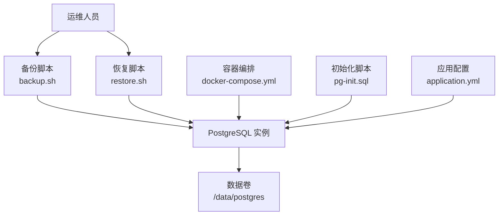
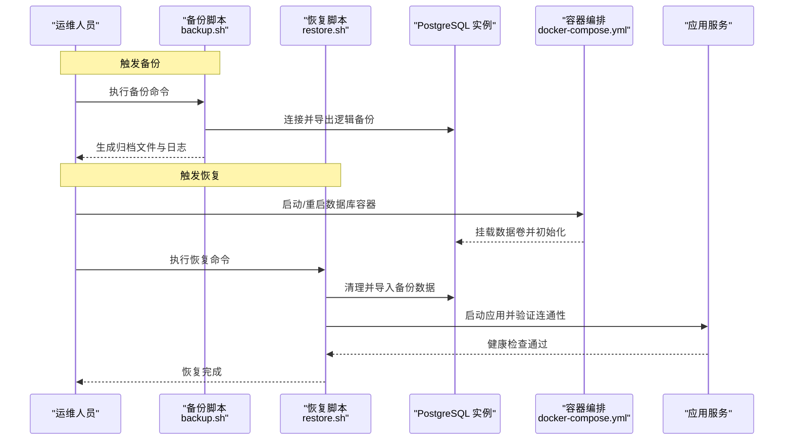
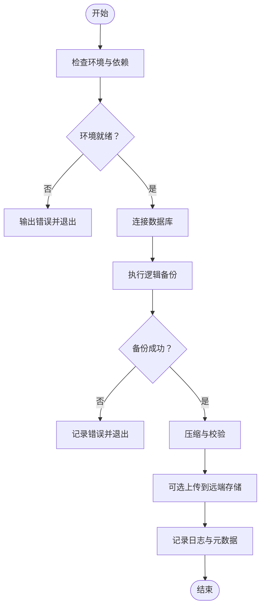
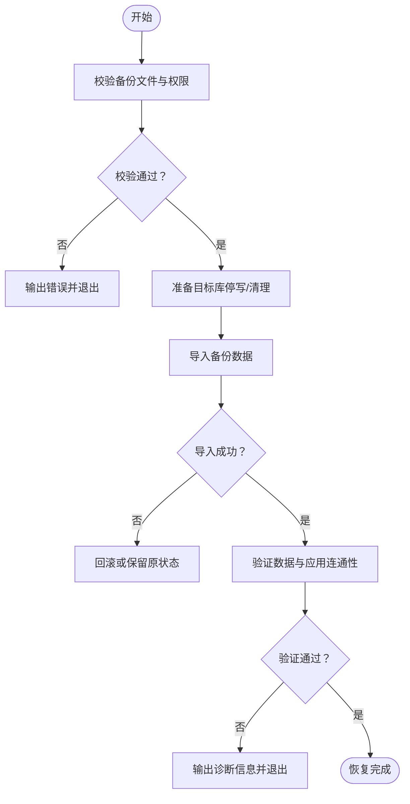
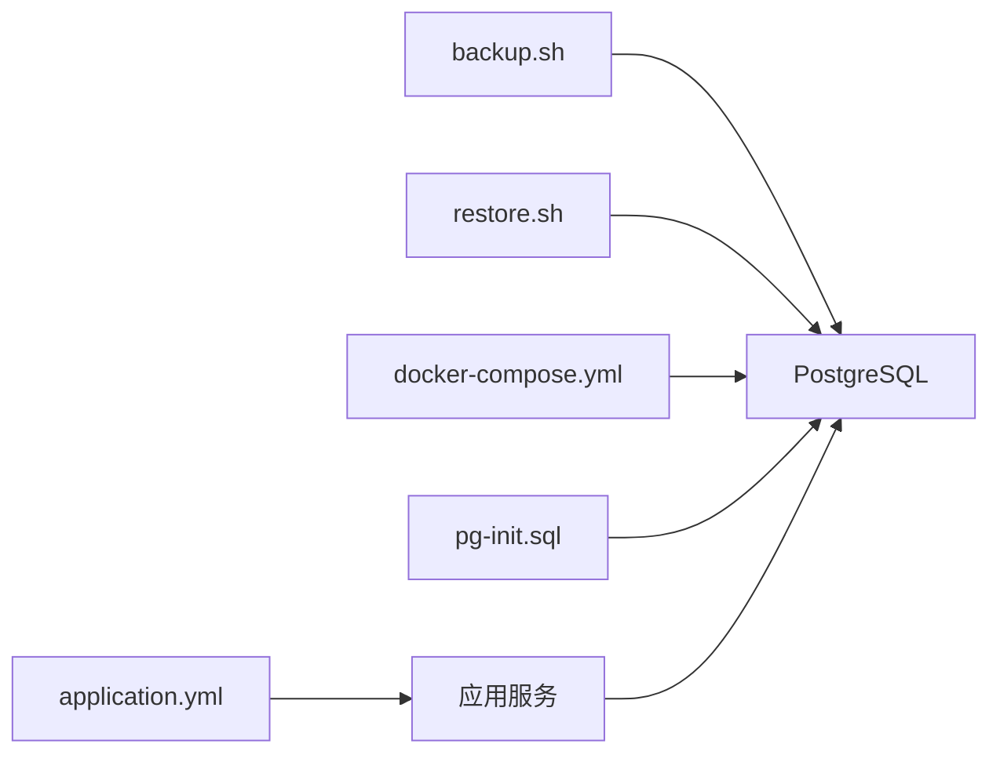

# 数据库备份恢复系统

<cite>
**本文引用的文件**   
- [backup.sh](file://deploy/backup.sh)
- [restore.sh](file://deploy/restore.sh)
- [docker-compose.yml](file://deploy/docker-compose.yml)
- [pg-init.sql](file://deploy/init/pg-init.sql)
- [application.yml](file://backend/counseling-app/src/main/resources/application.yml)
</cite>

## 目录
1. [简介](#简介)
2. [项目结构](#项目结构)
3. [核心组件](#核心组件)
4. [架构总览](#架构总览)
5. [详细组件分析](#详细组件分析)
6. [依赖关系分析](#依赖关系分析)
7. [性能与可靠性考虑](#性能与可靠性考虑)
8. [故障排查指南](#故障排查指南)
9. [结论](#结论)
10. [附录](#附录)

## 简介
本文件面向“心理咨询系统”的数据库备份与恢复能力，聚焦于部署脚本与容器编排配置，说明如何对 PostgreSQL 数据库进行一致性备份、增量归档与灾难恢复。文档同时给出最佳实践、常见问题定位方法以及运维建议，帮助非专业读者也能快速上手并安全落地。

## 项目结构
与数据库备份恢复相关的核心文件位于 deploy 目录：
- backup.sh：执行数据库全量或增量备份，生成带时间戳的归档文件
- restore.sh：从指定备份文件恢复到目标数据库实例
- docker-compose.yml：定义数据库服务及数据卷挂载，确保数据持久化
- pg-init.sql：数据库初始化脚本（建库、用户、扩展等）
- application.yml：应用侧数据库连接配置（用于验证恢复后连通性）

图表来源
- [backup.sh](file://deploy/backup.sh)
- [restore.sh](file://deploy/restore.sh)
- [docker-compose.yml](file://deploy/docker-compose.yml)
- [pg-init.sql](file://deploy/init/pg-init.sql)
- [application.yml](file://backend/counseling-app/src/main/resources/application.yml)

章节来源
- [backup.sh](file://deploy/backup.sh)
- [restore.sh](file://deploy/restore.sh)
- [docker-compose.yml](file://deploy/docker-compose.yml)
- [pg-init.sql](file://deploy/init/pg-init.sql)
- [application.yml](file://backend/counseling-app/src/main/resources/application.yml)

## 核心组件
- 备份脚本（backup.sh）
  - 功能要点：校验参数与环境、连接 PostgreSQL、执行逻辑备份（如 pg_dump）、压缩归档、记录日志、可选上传至远端存储
  - 关键行为：失败时返回非零退出码；支持按日期命名输出文件；可配置保留策略
- 恢复脚本（restore.sh）
  - 功能要点：校验备份文件存在性与完整性、停止应用写入、清理目标库、导入数据、重建索引与统计信息、启动应用并验证连通性
  - 关键行为：幂等性检查（避免重复恢复）、回滚机制（失败时尽量保持原状态）
- 容器编排（docker-compose.yml）
  - 功能要点：定义 PostgreSQL 服务、环境变量、端口映射、数据卷挂载（/data/postgres），保证数据持久化与跨重启可用
- 初始化脚本（pg-init.sql）
  - 功能要点：创建数据库与用户、启用必要扩展（如 pgcrypto）、设置默认权限
- 应用配置（application.yml）
  - 功能要点：数据库 URL、用户名、密码、连接池大小、超时与重试策略

章节来源
- [backup.sh](file://deploy/backup.sh)
- [restore.sh](file://deploy/restore.sh)
- [docker-compose.yml](file://deploy/docker-compose.yml)
- [pg-init.sql](file://deploy/init/pg-init.sql)
- [application.yml](file://backend/counseling-app/src/main/resources/application.yml)

## 架构总览
下图展示了备份与恢复在系统中的位置与交互关系：

图表来源
- [backup.sh](file://deploy/backup.sh)
- [restore.sh](file://deploy/restore.sh)
- [docker-compose.yml](file://deploy/docker-compose.yml)
- [pg-init.sql](file://deploy/init/pg-init.sql)
- [application.yml](file://backend/counseling-app/src/main/resources/application.yml)

## 详细组件分析

### 备份流程（backup.sh）
- 输入参数
  - 目标数据库连接信息（主机、端口、数据库名、用户、密码）
  - 备份路径与文件名前缀
  - 是否启用压缩与远程上传
- 处理逻辑
  - 环境校验：检查 pg_dump 可用性、网络连通性、磁盘空间
  - 备份执行：调用 pg_dump 进行逻辑备份，支持并发与分片（视实现而定）
  - 归档与校验：生成校验和（如 sha256sum），记录元数据（时间、版本、大小）
  - 日志与告警：输出结构化日志，失败时发送告警（可选）
- 错误处理
  - 捕获外部命令失败、网络异常、权限不足等
  - 提供明确的退出码与错误消息，便于自动化编排

图表来源
- [backup.sh](file://deploy/backup.sh)

章节来源
- [backup.sh](file://deploy/backup.sh)

### 恢复流程（restore.sh）
- 输入参数
  - 备份文件路径或名称
  - 目标数据库连接信息
  - 是否强制覆盖现有数据
- 处理逻辑
  - 前置检查：备份文件存在性、完整性校验、目标库权限
  - 准备阶段：停止应用写入、清理目标库（可选）、创建空库与用户
  - 导入阶段：调用 psql 或恢复工具导入数据，重建索引与统计信息
  - 验证阶段：运行基础查询与健康检查，确认数据一致性与应用连通性
- 错误处理
  - 导入失败时尝试回滚或保留原状态
  - 提供详细的错误上下文与修复建议

图表来源
- [restore.sh](file://deploy/restore.sh)

章节来源
- [restore.sh](file://deploy/restore.sh)

### 容器编排与数据持久化（docker-compose.yml）
- 服务定义
  - PostgreSQL 服务：暴露端口、设置环境变量（数据库名、用户、密码）
  - 数据卷：将 /data/postgres 映射到宿主机，确保数据持久化
- 生命周期管理
  - 启动顺序：先启动数据库，再启动应用服务
  - 健康检查：基于 psql 或内置健康端点判断数据库就绪
- 注意事项
  - 避免在生产环境使用默认密码
  - 合理设置资源限制（CPU、内存）
  - 定期快照数据卷以增强容灾能力

章节来源
- [docker-compose.yml](file://deploy/docker-compose.yml)

### 数据库初始化（pg-init.sql）
- 主要职责
  - 创建数据库与用户
  - 启用必要的扩展（如加密、全文检索等）
  - 设置默认权限与角色
- 使用方式
  - 首次启动时由容器自动执行
  - 升级时可作为迁移脚本的一部分

章节来源
- [pg-init.sql](file://deploy/init/pg-init.sql)

### 应用连接配置（application.yml）
- 关键项
  - 数据库 URL、用户名、密码
  - 连接池大小、最大空闲连接数
  - 超时与重试策略
- 恢复后验证
  - 修改配置指向新库
  - 启动应用并观察日志与指标

章节来源
- [application.yml](file://backend/counseling-app/src/main/resources/application.yml)

## 依赖关系分析
- 脚本依赖
  - backup.sh 依赖 pg_dump、gzip、sha256sum 等工具
  - restore.sh 依赖 psql、tar、curl/wget（若需下载备份）
- 运行时依赖
  - docker-compose 负责编排数据库与应用
  - 应用依赖数据库连通性与正确的配置
- 数据依赖
  - 备份文件必须与目标数据库版本兼容
  - 初始化脚本需在恢复后按需执行

图表来源
- [backup.sh](file://deploy/backup.sh)
- [restore.sh](file://deploy/restore.sh)
- [docker-compose.yml](file://deploy/docker-compose.yml)
- [pg-init.sql](file://deploy/init/pg-init.sql)
- [application.yml](file://backend/counseling-app/src/main/resources/application.yml)

章节来源
- [backup.sh](file://deploy/backup.sh)
- [restore.sh](file://deploy/restore.sh)
- [docker-compose.yml](file://deploy/docker-compose.yml)
- [pg-init.sql](file://deploy/init/pg-init.sql)
- [application.yml](file://backend/counseling-app/src/main/resources/application.yml)

## 性能与可靠性考虑
- 备份性能
  - 使用并行导出（如 pg_dump 的 -j 选项）提升速度
  - 选择合适的时间窗口（低峰期）执行备份
  - 监控磁盘 I/O 与 CPU 占用，避免影响业务
- 恢复性能
  - 关闭不必要的索引与约束后再导入，导入完成后重建
  - 调整数据库参数（如 wal_level、checkpoint）以提升导入吞吐
- 可靠性保障
  - 备份文件完整性校验（哈希校验）
  - 定期演练恢复流程，验证 RTO/RPO 目标
  - 多副本与异地备份，防范单点故障

[本节为通用指导，不直接分析具体文件]

## 故障排查指南
- 常见错误
  - 权限不足：检查数据库用户权限与文件系统权限
  - 连接失败：核对主机、端口、用户名、密码与防火墙规则
  - 版本不兼容：确保备份与目标数据库主版本一致
  - 磁盘空间不足：清理旧备份或扩容磁盘
- 诊断步骤
  - 查看脚本日志与数据库日志
  - 手动执行 pg_dump/psql 命令定位问题
  - 使用 psql 连接测试与基础查询验证
- 回滚策略
  - 恢复前备份当前数据
  - 失败时尽量保留原状态，避免二次破坏

章节来源
- [backup.sh](file://deploy/backup.sh)
- [restore.sh](file://deploy/restore.sh)

## 结论
通过 backup.sh 与 restore.sh 的配合，结合 docker-compose 的数据持久化与 pg-init.sql 的初始化能力，本系统实现了可靠的数据库备份与恢复闭环。建议在生产环境中严格执行备份策略、定期演练恢复流程，并结合监控与告警体系，确保数据安全与服务高可用。

[本节为总结性内容，不直接分析具体文件]

## 附录
- 常用命令参考
  - 备份：执行 backup.sh 并传入必要参数
  - 恢复：执行 restore.sh 并指定备份文件路径
  - 验证：使用 psql 连接数据库并执行基础查询
- 最佳实践
  - 最小权限原则：为备份与恢复任务创建专用数据库用户
  - 自动化：通过定时任务（cron）执行备份，结合对象存储做异地留存
  - 文档化：维护操作手册与应急预案，确保团队协同

[本节为补充信息，不直接分析具体文件]
