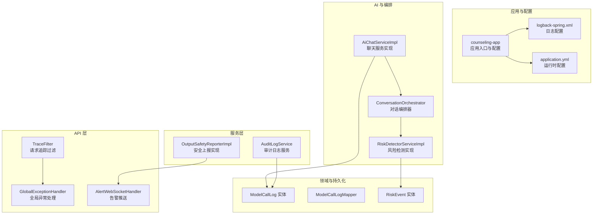
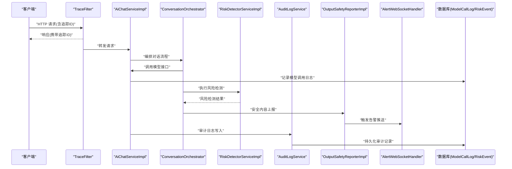
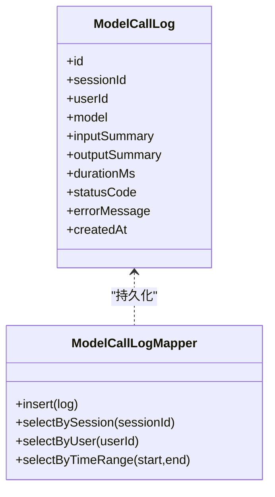
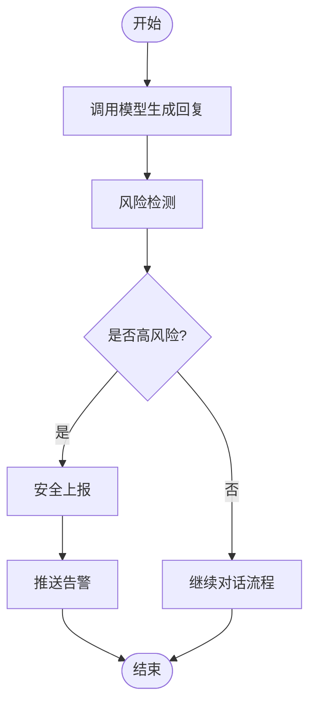
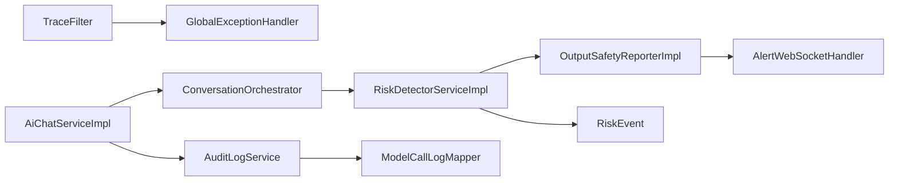

# 结构化日志与追踪系统

<cite>
**本文引用的文件**   
- [logback-spring.xml](file://backend/counseling-app/src/main/resources/logback-spring.xml)
- [application.yml](file://backend/counseling-app/src/main/resources/application.yml)
- [TraceFilter.java](file://backend/counseling-api/src/main/java/com/mindsafe/api/filter/TraceFilter.java)
- [GlobalExceptionHandler.java](file://backend/counseling-api/src/main/java/com/mindsafe/api/config/GlobalExceptionHandler.java)
- [ModelCallLog.java](file://backend/counseling-domain/src/main/java/com/mindsafe/domain/entity/ModelCallLog.java)
- [ModelCallLogMapper.java](file://backend/counseling-domain/src/main/java/com/mindsafe/domain/mapper/ModelCallLogMapper.java)
- [AiChatServiceImpl.java](file://backend/counseling-ai/src/main/java/com/mindsafe/ai/chat/AiChatServiceImpl.java)
- [ConversationOrchestrator.java](file://backend/counseling-ai/src/main/java/com/mindsafe/ai/orchestrator/ConversationOrchestrator.java)
- [OutputSafetyReporterImpl.java](file://backend/counseling-service/src/main/java/com/mindsafe/service/safety/OutputSafetyReporterImpl.java)
- [AuditLogService.java](file://backend/counseling-service/src/main/java/com/mindsafe/service/audit/AuditLogService.java)
- [RiskEvent.java](file://backend/counseling-domain/src/main/java/com/mindsafe/domain/entity/RiskEvent.java)
- [RiskDetectorServiceImpl.java](file://backend/counseling-ai/src/main/java/com/mindsafe/risk/RiskDetectorServiceImpl.java)
- [AlertWebSocketHandler.java](file://backend/counseling-api/src/main/java/com/mindsafe/api/websocket/AlertWebSocketHandler.java)
- [Dockerfile](file://backend/Dockerfile)
</cite>

## 目录
1. [简介](#简介)
2. [项目结构](#项目结构)
3. [核心组件](#核心组件)
4. [架构总览](#架构总览)
5. [详细组件分析](#详细组件分析)
6. [依赖关系分析](#依赖关系分析)
7. [性能考量](#性能考量)
8. [故障排查指南](#故障排查指南)
9. [结论](#结论)
10. [附录](#附录)

## 简介
本文件聚焦于“结构化日志与追踪系统”的设计与实现，覆盖请求级链路追踪、模型调用审计、安全事件上报、告警推送以及日志输出配置等关键能力。目标是帮助读者快速理解系统在可观测性方面的整体方案，包括数据流、处理逻辑、集成点与错误处理策略，并提供排障建议与优化方向。

## 项目结构
本项目采用多模块后端架构，日志与追踪相关能力分布在以下位置：
- 应用启动与日志配置：counseling-app 模块的资源文件中定义日志框架与输出格式
- HTTP 层追踪：counseling-api 模块的过滤器与全局异常处理器负责链路 ID 注入与统一错误记录
- AI 与对话编排：counseling-ai 模块在对话流程中埋点并记录模型调用与风险识别结果
- 领域实体与持久化：counseling-domain 模块提供模型调用日志、风险事件等实体及映射
- 服务层审计与上报：counseling-service 模块提供审计与安全上报服务，对接外部告警通道
- 部署与环境：Dockerfile 用于容器化运行环境，便于集中式日志采集

图表来源
- [logback-spring.xml](file://backend/counseling-app/src/main/resources/logback-spring.xml)
- [application.yml](file://backend/counseling-app/src/main/resources/application.yml)
- [TraceFilter.java](file://backend/counseling-api/src/main/java/com/mindsafe/api/filter/TraceFilter.java)
- [GlobalExceptionHandler.java](file://backend/counseling-api/src/main/java/com/mindsafe/api/config/GlobalExceptionHandler.java)
- [AiChatServiceImpl.java](file://backend/counseling-ai/src/main/java/com/mindsafe/ai/chat/AiChatServiceImpl.java)
- [ConversationOrchestrator.java](file://backend/counseling-ai/src/main/java/com/mindsafe/ai/orchestrator/ConversationOrchestrator.java)
- [RiskDetectorServiceImpl.java](file://backend/counseling-ai/src/main/java/com/mindsafe/risk/RiskDetectorServiceImpl.java)
- [ModelCallLog.java](file://backend/counseling-domain/src/main/java/com/mindsafe/domain/entity/ModelCallLog.java)
- [ModelCallLogMapper.java](file://backend/counseling-domain/src/main/java/com/mindsafe/domain/mapper/ModelCallLogMapper.java)
- [RiskEvent.java](file://backend/counseling-domain/src/main/java/com/mindsafe/domain/entity/RiskEvent.java)
- [AuditLogService.java](file://backend/counseling-service/src/main/java/com/mindsafe/service/audit/AuditLogService.java)
- [OutputSafetyReporterImpl.java](file://backend/counseling-service/src/main/java/com/mindsafe/service/safety/OutputSafetyReporterImpl.java)
- [AlertWebSocketHandler.java](file://backend/counseling-api/src/main/java/com/mindsafe/api/websocket/AlertWebSocketHandler.java)

章节来源
- [logback-spring.xml](file://backend/counseling-app/src/main/resources/logback-spring.xml)
- [application.yml](file://backend/counseling-app/src/main/resources/application.yml)
- [TraceFilter.java](file://backend/counseling-api/src/main/java/com/mindsafe/api/filter/TraceFilter.java)
- [GlobalExceptionHandler.java](file://backend/counseling-api/src/main/java/com/mindsafe/api/config/GlobalExceptionHandler.java)
- [AiChatServiceImpl.java](file://backend/counseling-ai/src/main/java/com/mindsafe/ai/chat/AiChatServiceImpl.java)
- [ConversationOrchestrator.java](file://backend/counseling-ai/src/main/java/com/mindsafe/ai/orchestrator/ConversationOrchestrator.java)
- [RiskDetectorServiceImpl.java](file://backend/counseling-ai/src/main/java/com/mindsafe/risk/RiskDetectorServiceImpl.java)
- [ModelCallLog.java](file://backend/counseling-domain/src/main/java/com/mindsafe/domain/entity/ModelCallLog.java)
- [ModelCallLogMapper.java](file://backend/counseling-domain/src/main/java/com/mindsafe/domain/mapper/ModelCallLogMapper.java)
- [RiskEvent.java](file://backend/counseling-domain/src/main/java/com/mindsafe/domain/entity/RiskEvent.java)
- [AuditLogService.java](file://backend/counseling-service/src/main/java/com/mindsafe/service/audit/AuditLogService.java)
- [OutputSafetyReporterImpl.java](file://backend/counseling-service/src/main/java/com/mindsafe/service/safety/OutputSafetyReporterImpl.java)
- [AlertWebSocketHandler.java](file://backend/counseling-api/src/main/java/com/mindsafe/api/websocket/AlertWebSocketHandler.java)

## 核心组件
- 请求级链路追踪：通过 HTTP 过滤器为每个请求生成唯一追踪 ID，并在后续各层透传，确保跨模块调用可关联
- 模型调用审计：在服务层或编排层对大模型调用进行结构化记录（输入、输出、耗时、状态码等），便于回溯与分析
- 安全事件上报：对敏感内容、风险关键词等进行检测与上报，必要时触发实时告警
- 审计日志服务：统一封装审计写入逻辑，保证审计数据的完整性与一致性
- 日志输出配置：基于日志框架配置结构化输出格式、级别与目标（控制台、文件、外部采集）

章节来源
- [TraceFilter.java](file://backend/counseling-api/src/main/java/com/mindsafe/api/filter/TraceFilter.java)
- [GlobalExceptionHandler.java](file://backend/counseling-api/src/main/java/com/mindsafe/api/config/GlobalExceptionHandler.java)
- [AiChatServiceImpl.java](file://backend/counseling-ai/src/main/java/com/mindsafe/ai/chat/AiChatServiceImpl.java)
- [ConversationOrchestrator.java](file://backend/counseling-ai/src/main/java/com/mindsafe/ai/orchestrator/ConversationOrchestrator.java)
- [RiskDetectorServiceImpl.java](file://backend/counseling-ai/src/main/java/com/mindsafe/risk/RiskDetectorServiceImpl.java)
- [ModelCallLog.java](file://backend/counseling-domain/src/main/java/com/mindsafe/domain/entity/ModelCallLog.java)
- [ModelCallLogMapper.java](file://backend/counseling-domain/src/main/java/com/mindsafe/domain/mapper/ModelCallLogMapper.java)
- [RiskEvent.java](file://backend/counseling-domain/src/main/java/com/mindsafe/domain/entity/RiskEvent.java)
- [AuditLogService.java](file://backend/counseling-service/src/main/java/com/mindsafe/service/audit/AuditLogService.java)
- [OutputSafetyReporterImpl.java](file://backend/counseling-service/src/main/java/com/mindsafe/service/safety/OutputSafetyReporterImpl.java)
- [logback-spring.xml](file://backend/counseling-app/src/main/resources/logback-spring.xml)
- [application.yml](file://backend/counseling-app/src/main/resources/application.yml)

## 架构总览
下图展示了从 HTTP 请求进入，到对话编排、模型调用、风险检测、审计与告警的全链路追踪与日志记录路径。

图表来源
- [TraceFilter.java](file://backend/counseling-api/src/main/java/com/mindsafe/api/filter/TraceFilter.java)
- [AiChatServiceImpl.java](file://backend/counseling-ai/src/main/java/com/mindsafe/ai/chat/AiChatServiceImpl.java)
- [ConversationOrchestrator.java](file://backend/counseling-ai/src/main/java/com/mindsafe/ai/orchestrator/ConversationOrchestrator.java)
- [RiskDetectorServiceImpl.java](file://backend/counseling-ai/src/main/java/com/mindsafe/risk/RiskDetectorServiceImpl.java)
- [AuditLogService.java](file://backend/counseling-service/src/main/java/com/mindsafe/service/audit/AuditLogService.java)
- [OutputSafetyReporterImpl.java](file://backend/counseling-service/src/main/java/com/mindsafe/service/safety/OutputSafetyReporterImpl.java)
- [AlertWebSocketHandler.java](file://backend/counseling-api/src/main/java/com/mindsafe/api/websocket/AlertWebSocketHandler.java)
- [ModelCallLog.java](file://backend/counseling-domain/src/main/java/com/mindsafe/domain/entity/ModelCallLog.java)
- [ModelCallLogMapper.java](file://backend/counseling-domain/src/main/java/com/mindsafe/domain/mapper/ModelCallLogMapper.java)
- [RiskEvent.java](file://backend/counseling-domain/src/main/java/com/mindsafe/domain/entity/RiskEvent.java)

## 详细组件分析

### 请求级链路追踪（TraceFilter）
- 职责：为每个 HTTP 请求生成并注入追踪 ID，贯穿后续各层；在异常时统一记录错误上下文
- 关键点：
  - 在请求进入时创建追踪 ID 并放入线程上下文
  - 在响应返回前清理上下文，避免内存泄漏
  - 与全局异常处理器协作，确保异常信息包含追踪 ID
- 适用场景：跨模块调用、分布式链路追踪、问题定位

章节来源
- [TraceFilter.java](file://backend/counseling-api/src/main/java/com/mindsafe/api/filter/TraceFilter.java)
- [GlobalExceptionHandler.java](file://backend/counseling-api/src/main/java/com/mindsafe/api/config/GlobalExceptionHandler.java)

### 全局异常处理（GlobalExceptionHandler）
- 职责：统一捕获业务与系统异常，记录结构化错误日志，返回标准化错误响应
- 关键点：
  - 区分业务异常与系统异常，分别记录不同级别日志
  - 将追踪 ID 与请求上下文一并记录，便于溯源
  - 避免泄露敏感信息，仅记录必要字段

章节来源
- [GlobalExceptionHandler.java](file://backend/counseling-api/src/main/java/com/mindsafe/api/config/GlobalExceptionHandler.java)

### 模型调用审计（ModelCallLog 与 Mapper）
- 职责：记录每次大模型调用的结构化信息，包括输入、输出摘要、耗时、状态码、错误信息等
- 关键点：
  - 使用领域实体 ModelCallLog 描述调用记录
  - 通过 Mapper 进行持久化，支持按会话、用户、时间范围检索
  - 建议在异步或批处理方式写入，降低对主流程的影响

图表来源
- [ModelCallLog.java](file://backend/counseling-domain/src/main/java/com/mindsafe/domain/entity/ModelCallLog.java)
- [ModelCallLogMapper.java](file://backend/counseling-domain/src/main/java/com/mindsafe/domain/mapper/ModelCallLogMapper.java)

章节来源
- [ModelCallLog.java](file://backend/counseling-domain/src/main/java/com/mindsafe/domain/entity/ModelCallLog.java)
- [ModelCallLogMapper.java](file://backend/counseling-domain/src/main/java/com/mindsafe/domain/mapper/ModelCallLogMapper.java)

### 对话编排与风险检测（ConversationOrchestrator 与 RiskDetectorServiceImpl）
- 职责：编排对话流程，串联模型调用与风险检测；在检测到高风险内容时触发上报与告警
- 关键点：
  - 编排器协调多个 Agent 与服务，形成稳定的对话工作流
  - 风险检测服务根据规则库与模型判断风险等级
  - 高风险事件需及时上报并推送告警

图表来源
- [ConversationOrchestrator.java](file://backend/counseling-ai/src/main/java/com/mindsafe/ai/orchestrator/ConversationOrchestrator.java)
- [RiskDetectorServiceImpl.java](file://backend/counseling-ai/src/main/java/com/mindsafe/risk/RiskDetectorServiceImpl.java)
- [OutputSafetyReporterImpl.java](file://backend/counseling-service/src/main/java/com/mindsafe/service/safety/OutputSafetyReporterImpl.java)
- [AlertWebSocketHandler.java](file://backend/counseling-api/src/main/java/com/mindsafe/api/websocket/AlertWebSocketHandler.java)

章节来源
- [ConversationOrchestrator.java](file://backend/counseling-ai/src/main/java/com/mindsafe/ai/orchestrator/ConversationOrchestrator.java)
- [RiskDetectorServiceImpl.java](file://backend/counseling-ai/src/main/java/com/mindsafe/risk/RiskDetectorServiceImpl.java)
- [OutputSafetyReporterImpl.java](file://backend/counseling-service/src/main/java/com/mindsafe/service/safety/OutputSafetyReporterImpl.java)
- [AlertWebSocketHandler.java](file://backend/counseling-api/src/main/java/com/mindsafe/api/websocket/AlertWebSocketHandler.java)

### 审计日志服务（AuditLogService）
- 职责：统一封装审计日志的写入逻辑，确保审计数据的完整性与一致性
- 关键点：
  - 提供统一的审计接口，供各业务模块调用
  - 支持批量写入与异步落盘，提升性能
  - 与模型调用审计、安全事件上报协同，形成完整的审计闭环

章节来源
- [AuditLogService.java](file://backend/counseling-service/src/main/java/com/mindsafe/service/audit/AuditLogService.java)

### 安全上报与告警推送（OutputSafetyReporterImpl 与 AlertWebSocketHandler）
- 职责：对敏感内容与风险事件进行上报，并通过 WebSocket 实时推送告警
- 关键点：
  - 上报服务负责格式化事件、选择上报渠道
  - WebSocket 处理器负责建立连接与消息分发
  - 支持重试与失败降级，确保告警可达性

章节来源
- [OutputSafetyReporterImpl.java](file://backend/counseling-service/src/main/java/com/mindsafe/service/safety/OutputSafetyReporterImpl.java)
- [AlertWebSocketHandler.java](file://backend/counseling-api/src/main/java/com/mindsafe/api/websocket/AlertWebSocketHandler.java)

### 日志输出配置（logback-spring.xml 与 application.yml）
- 职责：定义日志框架的输出格式、级别与目标，支持结构化日志与集中采集
- 关键点：
  - 配置 JSON 结构化输出，便于日志平台解析
  - 设置不同包的日志级别，控制输出粒度
  - 结合环境变量与配置文件，灵活调整生产与测试行为

章节来源
- [logback-spring.xml](file://backend/counseling-app/src/main/resources/logback-spring.xml)
- [application.yml](file://backend/counseling-app/src/main/resources/application.yml)

## 依赖关系分析
- 耦合度：
  - TraceFilter 与 GlobalExceptionHandler 紧密耦合，共同完成请求级追踪与异常记录
  - AiChatServiceImpl 与 ConversationOrchestrator 协作完成对话流程，后者再调用风险检测服务
  - AuditLogService 作为审计中心，被多个模块依赖，保持高内聚低耦合
- 外部依赖：
  - 数据库持久化（ModelCallLog、RiskEvent）
  - WebSocket 推送（告警）
  - 日志框架（logback）与配置管理（application.yml）

图表来源
- [TraceFilter.java](file://backend/counseling-api/src/main/java/com/mindsafe/api/filter/TraceFilter.java)
- [GlobalExceptionHandler.java](file://backend/counseling-api/src/main/java/com/mindsafe/api/config/GlobalExceptionHandler.java)
- [AiChatServiceImpl.java](file://backend/counseling-ai/src/main/java/com/mindsafe/ai/chat/AiChatServiceImpl.java)
- [ConversationOrchestrator.java](file://backend/counseling-ai/src/main/java/com/mindsafe/ai/orchestrator/ConversationOrchestrator.java)
- [RiskDetectorServiceImpl.java](file://backend/counseling-ai/src/main/java/com/mindsafe/risk/RiskDetectorServiceImpl.java)
- [AuditLogService.java](file://backend/counseling-service/src/main/java/com/mindsafe/service/audit/AuditLogService.java)
- [OutputSafetyReporterImpl.java](file://backend/counseling-service/src/main/java/com/mindsafe/service/safety/OutputSafetyReporterImpl.java)
- [AlertWebSocketHandler.java](file://backend/counseling-api/src/main/java/com/mindsafe/api/websocket/AlertWebSocketHandler.java)
- [ModelCallLogMapper.java](file://backend/counseling-domain/src/main/java/com/mindsafe/domain/mapper/ModelCallLogMapper.java)
- [RiskEvent.java](file://backend/counseling-domain/src/main/java/com/mindsafe/domain/entity/RiskEvent.java)

章节来源
- [TraceFilter.java](file://backend/counseling-api/src/main/java/com/mindsafe/api/filter/TraceFilter.java)
- [GlobalExceptionHandler.java](file://backend/counseling-api/src/main/java/com/mindsafe/api/config/GlobalExceptionHandler.java)
- [AiChatServiceImpl.java](file://backend/counseling-ai/src/main/java/com/mindsafe/ai/chat/AiChatServiceImpl.java)
- [ConversationOrchestrator.java](file://backend/counseling-ai/src/main/java/com/mindsafe/ai/orchestrator/ConversationOrchestrator.java)
- [RiskDetectorServiceImpl.java](file://backend/counseling-ai/src/main/java/com/mindsafe/risk/RiskDetectorServiceImpl.java)
- [AuditLogService.java](file://backend/counseling-service/src/main/java/com/mindsafe/service/audit/AuditLogService.java)
- [OutputSafetyReporterImpl.java](file://backend/counseling-service/src/main/java/com/mindsafe/service/safety/OutputSafetyReporterImpl.java)
- [AlertWebSocketHandler.java](file://backend/counseling-api/src/main/java/com/mindsafe/api/websocket/AlertWebSocketHandler.java)
- [ModelCallLogMapper.java](file://backend/counseling-domain/src/main/java/com/mindsafe/domain/mapper/ModelCallLogMapper.java)
- [RiskEvent.java](file://backend/counseling-domain/src/main/java/com/mindsafe/domain/entity/RiskEvent.java)

## 性能考量
- 异步写入：模型调用审计与安全上报建议采用异步队列或批处理，避免阻塞主流程
- 日志级别控制：生产环境按需调整包级别，减少无关日志输出
- 存储优化：对高频写入的审计表进行分区与索引优化，提高查询效率
- 资源隔离：日志输出与业务逻辑解耦，避免 I/O 抖动影响响应时间

[本节为通用指导，不直接分析具体文件]

## 故障排查指南
- 常见问题：
  - 追踪 ID 丢失：检查过滤器是否正确注入与清理上下文
  - 审计记录缺失：确认审计服务是否成功调用，数据库连接是否正常
  - 告警未推送：验证 WebSocket 连接状态与消息路由配置
- 排查步骤：
  - 通过追踪 ID 聚合日志，定位异常发生点
  - 查看模型调用日志，核对输入输出与耗时
  - 检查风险检测规则与上报渠道配置
  - 审查全局异常处理器记录的错误上下文

章节来源
- [TraceFilter.java](file://backend/counseling-api/src/main/java/com/mindsafe/api/filter/TraceFilter.java)
- [GlobalExceptionHandler.java](file://backend/counseling-api/src/main/java/com/mindsafe/api/config/GlobalExceptionHandler.java)
- [AuditLogService.java](file://backend/counseling-service/src/main/java/com/mindsafe/service/audit/AuditLogService.java)
- [OutputSafetyReporterImpl.java](file://backend/counseling-service/src/main/java/com/mindsafe/service/safety/OutputSafetyReporterImpl.java)
- [AlertWebSocketHandler.java](file://backend/counseling-api/src/main/java/com/mindsafe/api/websocket/AlertWebSocketHandler.java)

## 结论
本项目的结构化日志与追踪体系以请求级追踪为核心，结合模型调用审计、安全事件上报与实时告警推送，形成了完整的可观测性闭环。通过合理的日志配置与异步化处理，既保证了系统的稳定性，也为问题定位与性能优化提供了有力支撑。

[本节为总结性内容，不直接分析具体文件]

## 附录
- 部署与环境：Dockerfile 定义了运行环境与依赖，便于在容器中启用集中式日志采集

章节来源
- [Dockerfile](file://backend/Dockerfile)
