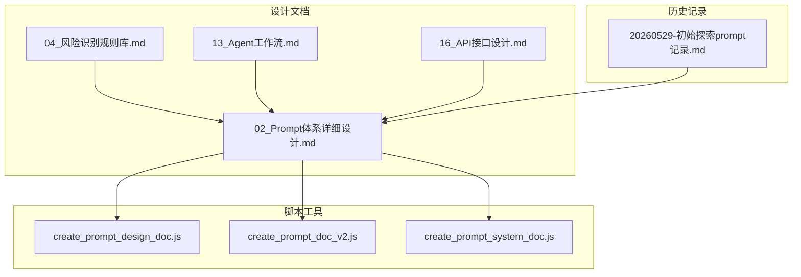
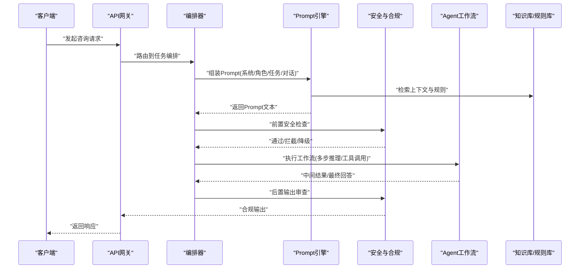
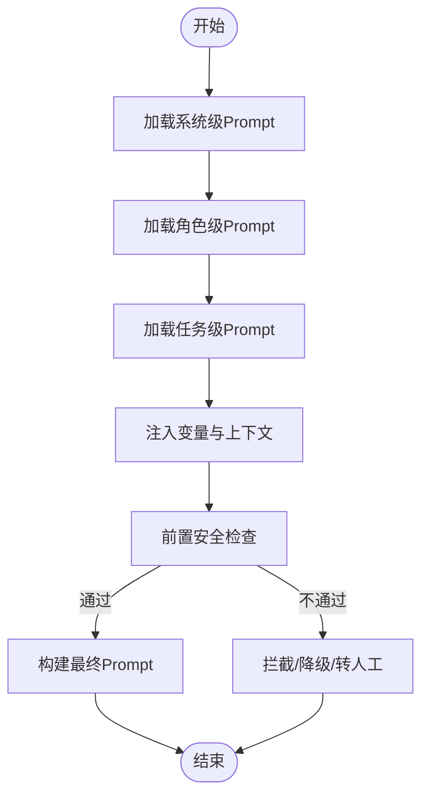
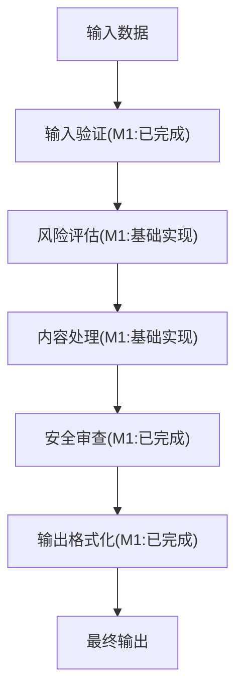
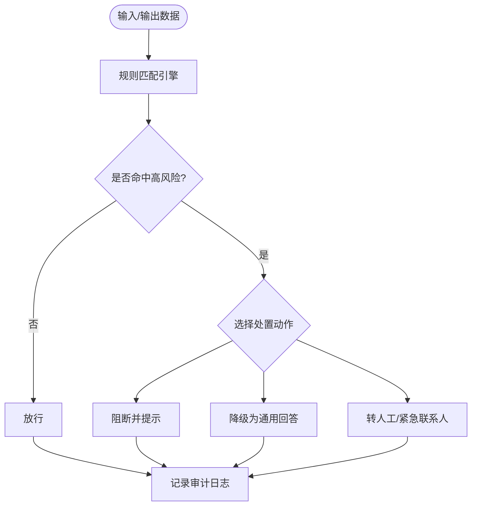
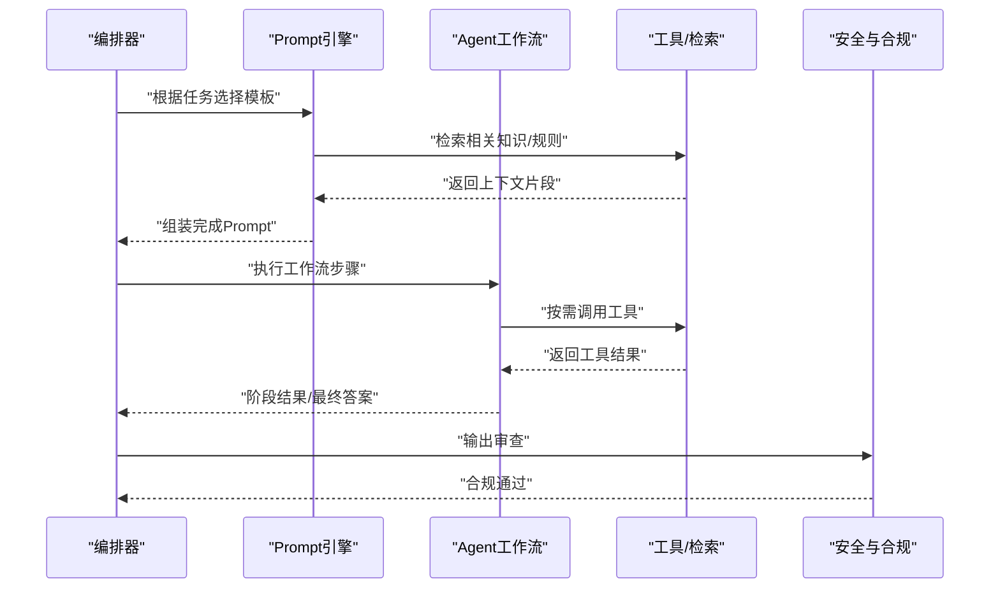
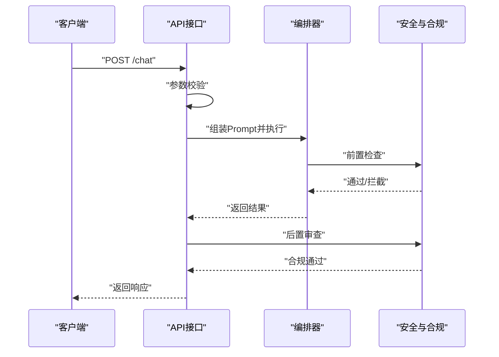
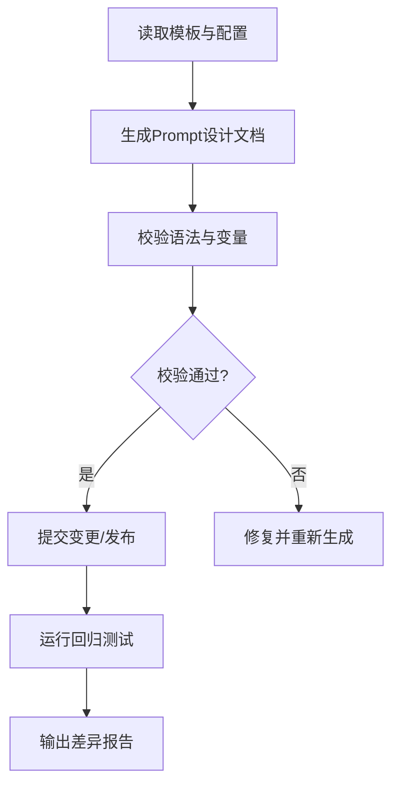
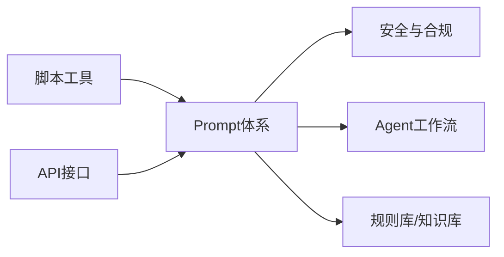

# Prompt体系详细设计

<cite>
**本文引用的文件**   
- [02_Prompt体系详细设计.md](file://design/02_Prompt体系详细设计.md)
- [04_风险识别规则库.md](file://design/04_风险识别规则库.md)
- [13_Agent工作流.md](file://design/13_Agent工作流.md)
- [16_API接口设计.md](file://design/16_API接口设计.md)
- [create_prompt_design_doc.js](file://scripts/create_prompt_design_doc.js)
- [create_prompt_doc_v2.js](file://scripts/create_prompt_doc_v2.js)
- [create_prompt_system_doc.js](file://scripts/create_prompt_system_doc.js)
- [20260529-初始探索prompt记录.md](file://doc/his/20260529-初始探索prompt记录.md)
</cite>

## 更新摘要
**所做更改**
- 增强了Advisor链描述，添加了"目标设计 vs M1实际"状态标注
- 增加了与风险识别规则的交叉引用
- 更新了Prompt体系与风险评估的集成说明
- 完善了版本控制和灰度发布策略

## 目录
1. [引言](#引言)
2. [项目结构](#项目结构)
3. [核心组件](#核心组件)
4. [架构总览](#架构总览)
5. [详细组件分析](#详细组件分析)
6. [依赖分析](#依赖分析)
7. [性能考虑](#性能考虑)
8. [故障排查指南](#故障排查指南)
9. [结论](#结论)
10. [附录](#附录)

## 引言
本文件聚焦于"Prompt体系"的设计与实现，目标是为AI心理咨询系统提供一套可维护、可扩展、可观测的提示词工程方案。内容覆盖：
- Prompt分层与职责划分（系统级、角色级、任务级、对话级）
- Advisor链设计与状态管理（包含目标设计与M1实际实现的对比）
- Prompt模板与变量注入机制
- 安全与合规约束（含风险识别规则联动）
- 与Agent工作流和API接口的集成方式
- 版本化、灰度发布与回滚策略
- 质量保障（测试、评测、回归）与监控指标

## 项目结构
本项目中与Prompt体系直接相关的资产主要分布在以下位置：
- design/：体系设计与规范文档
- scripts/：用于生成、校验、迁移Prompt相关文档与配置的脚本
- doc/his/：历史探索与沉淀记录

**图示来源**
- [02_Prompt体系详细设计.md](file://design/02_Prompt体系详细设计.md)
- [04_风险识别规则库.md](file://design/04_风险识别规则库.md)
- [13_Agent工作流.md](file://design/13_Agent工作流.md)
- [16_API接口设计.md](file://design/16_API接口设计.md)
- [create_prompt_design_doc.js](file://scripts/create_prompt_design_doc.js)
- [create_prompt_doc_v2.js](file://scripts/create_prompt_doc_v2.js)
- [create_prompt_system_doc.js](file://scripts/create_prompt_system_doc.js)
- [20260529-初始探索prompt记录.md](file://doc/his/20260529-初始探索prompt记录.md)

**章节来源**
- [02_Prompt体系详细设计.md](file://design/02_Prompt体系详细设计.md)
- [04_风险识别规则库.md](file://design/04_风险识别规则库.md)
- [13_Agent工作流.md](file://design/13_Agent工作流.md)
- [16_API接口设计.md](file://design/16_API接口设计.md)
- [create_prompt_design_doc.js](file://scripts/create_prompt_design_doc.js)
- [create_prompt_doc_v2.js](file://scripts/create_prompt_doc_v2.js)
- [create_prompt_system_doc.js](file://scripts/create_prompt_system_doc.js)
- [20260529-初始探索prompt记录.md](file://doc/his/20260529-初始探索prompt记录.md)

## 核心组件
- Prompt分层模型
  - 系统级：定义全局行为边界、安全红线、输出格式与语言风格
  - 角色级：为不同咨询场景设定专家角色与能力范围
  - 任务级：针对具体任务（如情绪评估、危机干预、CBT练习）的任务指令
  - 对话级：会话上下文、用户画像、历史摘要与当前意图
- **新增** Advisor链设计与状态管理
  - 目标设计：完整的顾问链式处理流程
  - M1实际：简化版实现，支持基础链式调用
  - 状态标注：清晰标识各组件的实现状态
- Prompt模板与变量注入
  - 模板语法：占位符、条件分支、列表渲染
  - 变量来源：用户输入、知识库检索结果、风险评估信号、业务配置
- 安全与合规层
  - 风险识别规则库联动：触发高危策略、降级或转人工
  - 敏感信息过滤与脱敏
  - 输出审查与拦截
- 版本管理与发布
  - 版本标识、变更日志、灰度策略、快速回滚
- 质量保障
  - 单元测试、回归测试、对抗样本集
  - 评测指标：安全性、相关性、一致性、可读性、合规性
- 监控与可观测性
  - 关键指标：调用量、延迟、错误率、拦截率、用户满意度
  - 日志与追踪：TraceID、Prompt版本、变量快照、决策路径

**章节来源**
- [02_Prompt体系详细设计.md](file://design/02_Prompt体系详细设计.md)
- [04_风险识别规则库.md](file://design/04_风险识别规则库.md)
- [13_Agent工作流.md](file://design/13_Agent工作流.md)
- [16_API接口设计.md](file://design/16_API接口设计.md)

## 架构总览
Prompt体系在系统中的位置与交互关系如下：

**图示来源**
- [13_Agent工作流.md](file://design/13_Agent工作流.md)
- [16_API接口设计.md](file://design/16_API接口设计.md)
- [02_Prompt体系详细设计.md](file://design/02_Prompt体系详细设计.md)
- [04_风险识别规则库.md](file://design/04_风险识别规则库.md)

## 详细组件分析

### Prompt分层与模板管理
- 分层职责
  - 系统级：统一约束（语言、风格、拒绝策略、输出结构）
  - 角色级：专家人设（心理咨询师、CBT教练、危机干预员等）
  - 任务级：具体流程（评估、引导、总结、布置作业）
  - 对话级：动态上下文（用户画像、历史摘要、实时意图）
- 模板与变量
  - 模板类型：纯文本、结构化JSON、带条件的片段
  - 变量来源：表单字段、检索增强、外部服务、运行时配置
- 版本控制
  - 语义化版本、变更说明、兼容性矩阵
  - 灰度发布：按学校/角色/渠道分流
  - 回滚策略：一键切换至上一稳定版

**图示来源**
- [02_Prompt体系详细设计.md](file://design/02_Prompt体系详细设计.md)
- [04_风险识别规则库.md](file://design/04_风险识别规则库.md)

**章节来源**
- [02_Prompt体系详细设计.md](file://design/02_Prompt体系详细设计.md)

### Advisor链设计与状态管理
- **新增** Advisor链架构
  - 目标设计：完整的多阶段顾问处理链，支持复杂决策逻辑
  - M1实际：简化的链式调用实现，满足基础需求
  - 状态标注：清晰标识每个组件的实现进度和状态
- 链式处理流程
  - 输入验证 -> 风险评估 -> 内容处理 -> 安全审查 -> 输出格式化
  - 每个环节都可独立配置和替换
- 状态管理机制
  - 上下文传递：链间共享状态数据
  - 错误处理：异常捕获和降级策略
  - 性能监控：各环节耗时统计

**图示来源**
- [02_Prompt体系详细设计.md](file://design/02_Prompt体系详细设计.md)
- [04_风险识别规则库.md](file://design/04_风险识别规则库.md)

**章节来源**
- [02_Prompt体系详细设计.md](file://design/02_Prompt体系详细设计.md)

### 安全与合规（风险识别规则库联动）
- 规则库结构
  - 规则分类：自伤/他伤、暴力、违法、隐私泄露、不当建议等
  - 匹配策略：关键词、正则、语义相似度、组合条件
  - 动作策略：阻断、降权、替换、转人工、附加免责声明
- 触发时机
  - 输入侧：用户消息预处理
  - 输出侧：模型回复后处理
  - 过程侧：Agent中间态检查
- 审计与追溯
  - 记录触发规则、命中证据、处置动作
  - 支持事后复盘与规则优化
- **新增** 与风险识别规则的交叉引用
  - 明确各Prompt组件与风险规则的对应关系
  - 建立规则触发的上下文关联

**图示来源**
- [04_风险识别规则库.md](file://design/04_风险识别规则库.md)
- [02_Prompt体系详细设计.md](file://design/02_Prompt体系详细设计.md)

**章节来源**
- [04_风险识别规则库.md](file://design/04_风险识别规则库.md)
- [02_Prompt体系详细设计.md](file://design/02_Prompt体系详细设计.md)

### 与Agent工作流的集成
- 编排模式
  - 单轮问答：直接组装Prompt并调用模型
  - 多轮对话：维护会话状态与记忆摘要
  - 多Agent协作：评估、干预、转介分工
- 工具与检索
  - 知识库检索：心理知识、量表、案例参考
  - 工具调用：预约、提醒、报告生成
- 状态与容错
  - 超时重试、熔断降级、兜底话术
  - 断点续跑与幂等保证

**图示来源**
- [13_Agent工作流.md](file://design/13_Agent工作流.md)
- [02_Prompt体系详细设计.md](file://design/02_Prompt体系详细设计.md)

**章节来源**
- [13_Agent工作流.md](file://design/13_Agent工作流.md)
- [02_Prompt体系详细设计.md](file://design/02_Prompt体系详细设计.md)

### API接口与Prompt装配
- 接口职责
  - 接收业务请求，解析参数与上下文
  - 选择Prompt模板与变量源
  - 调用编排器与安全模块
- 典型流程
  - 参数校验 -> 模板选择 -> 变量注入 -> 安全检查 -> 调用Agent -> 输出审查 -> 返回响应
- 错误与重试
  - 明确错误码与可恢复策略
  - 限流与熔断保护

**图示来源**
- [16_API接口设计.md](file://design/16_API接口设计.md)
- [02_Prompt体系详细设计.md](file://design/02_Prompt体系详细设计.md)

**章节来源**
- [16_API接口设计.md](file://design/16_API接口设计.md)
- [02_Prompt体系详细设计.md](file://design/02_Prompt体系详细设计.md)

### 脚本与自动化
- 设计文档生成
  - 从模板与配置自动生成Prompt设计文档，确保一致性与可追溯
- 版本迁移与校验
  - 批量更新模板、校验语法与变量完整性
- 测试与回归
  - 基于用例集自动运行Prompt回归，输出差异报告

**图示来源**
- [create_prompt_design_doc.js](file://scripts/create_prompt_design_doc.js)
- [create_prompt_doc_v2.js](file://scripts/create_prompt_doc_v2.js)
- [create_prompt_system_doc.js](file://scripts/create_prompt_system_doc.js)

**章节来源**
- [create_prompt_design_doc.js](file://scripts/create_prompt_design_doc.js)
- [create_prompt_doc_v2.js](file://scripts/create_prompt_doc_v2.js)
- [create_prompt_system_doc.js](file://scripts/create_prompt_system_doc.js)

### 历史探索与经验沉淀
- 初始探索记录
  - 早期Prompt思路、失败教训、迭代方向
- 最佳实践提炼
  - 从历史中总结有效策略与反模式

**章节来源**
- [20260529-初始探索prompt记录.md](file://doc/his/20260529-初始探索prompt记录.md)

## 依赖分析
- 内部依赖
  - Prompt体系依赖安全与合规模块、Agent工作流、知识库/规则库
  - 脚本工具依赖模板与配置源，产出文档与校验报告
- 外部依赖
  - LLM服务、检索服务、风控服务
- 耦合与内聚
  - 通过接口契约解耦Prompt组装与执行
  - 将安全策略抽象为可插拔规则引擎

**图示来源**
- [02_Prompt体系详细设计.md](file://design/02_Prompt体系详细设计.md)
- [13_Agent工作流.md](file://design/13_Agent工作流.md)
- [04_风险识别规则库.md](file://design/04_风险识别规则库.md)
- [16_API接口设计.md](file://design/16_API接口设计.md)

**章节来源**
- [02_Prompt体系详细设计.md](file://design/02_Prompt体系详细设计.md)
- [13_Agent工作流.md](file://design/13_Agent工作流.md)
- [04_风险识别规则库.md](file://design/04_风险识别规则库.md)
- [16_API接口设计.md](file://design/16_API接口设计.md)

## 性能考虑
- 模板缓存与预编译：减少重复组装开销
- 变量注入批量化：合并检索与注入，降低RTT
- 安全规则索引化：提升匹配效率
- 异步与并行：非阻塞调用工具与检索
- 降级策略：在高负载时启用轻量Prompt与简化流程
- **新增** Advisor链性能优化
  - 链式调用的并行化处理
  - 热点数据的本地缓存
  - 超时控制和资源回收

## 故障排查指南
- 常见问题定位
  - 模板缺失或变量未注入：检查模板版本与变量映射
  - 安全拦截误报：查看规则命中证据与阈值
  - 输出不一致：对比Prompt版本与上下文快照
  - **新增** Advisor链问题：检查各组件状态和依赖关系
- 日志与追踪
  - 记录TraceID、Prompt版本、变量快照、规则命中详情
  - 提供一键导出与回放能力
- 回滚与应急
  - 快速切换到上一稳定版本
  - 临时关闭复杂任务，启用通用兜底Prompt

**章节来源**
- [02_Prompt体系详细设计.md](file://design/02_Prompt体系详细设计.md)
- [04_风险识别规则库.md](file://design/04_风险识别规则库.md)

## 结论
Prompt体系通过分层设计、模板化管理、安全合规联动以及与Agent工作流的深度集成，实现了高可用、可演进、可观测的提示词工程方案。**新增的Advisor链设计**进一步增强了系统的灵活性和扩展性，通过清晰的状态标注和与风险识别规则的交叉引用，确保了系统的稳定性和专业性。配合脚本自动化与历史沉淀，持续优化质量与效率，为AI心理咨询系统的稳定性与专业性提供坚实支撑。

## 附录
- 术语表
  - Prompt：提示词，包含系统、角色、任务、对话等多层指令
  - 编排器：负责选择模板、组装上下文、调度Agent与安全模块
  - 安全与合规：输入输出审查、风险识别、处置策略
  - 规则库：风险识别规则集合，支持多种匹配与处置策略
  - **新增** Advisor链：顾问式的链式处理流程，支持多阶段决策
- 参考文档
  - [02_Prompt体系详细设计.md](file://design/02_Prompt体系详细设计.md)
  - [04_风险识别规则库.md](file://design/04_风险识别规则库.md)
  - [13_Agent工作流.md](file://design/13_Agent工作流.md)
  - [16_API接口设计.md](file://design/16_API接口设计.md)
  - [20260529-初始探索prompt记录.md](file://doc/his/20260529-初始探索prompt记录.md)
