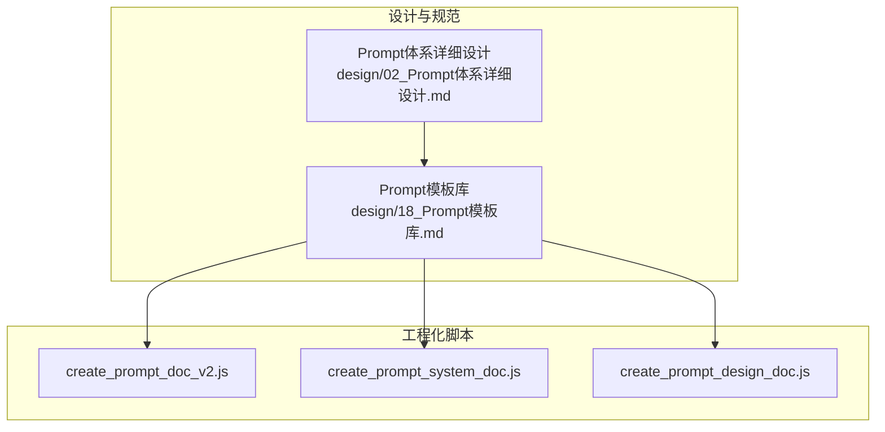
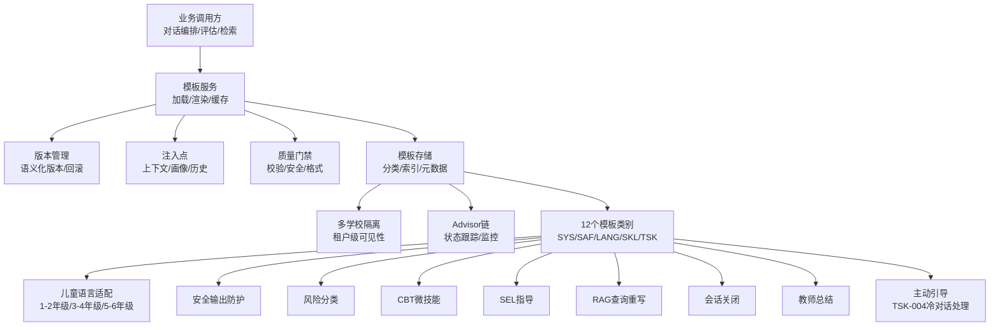
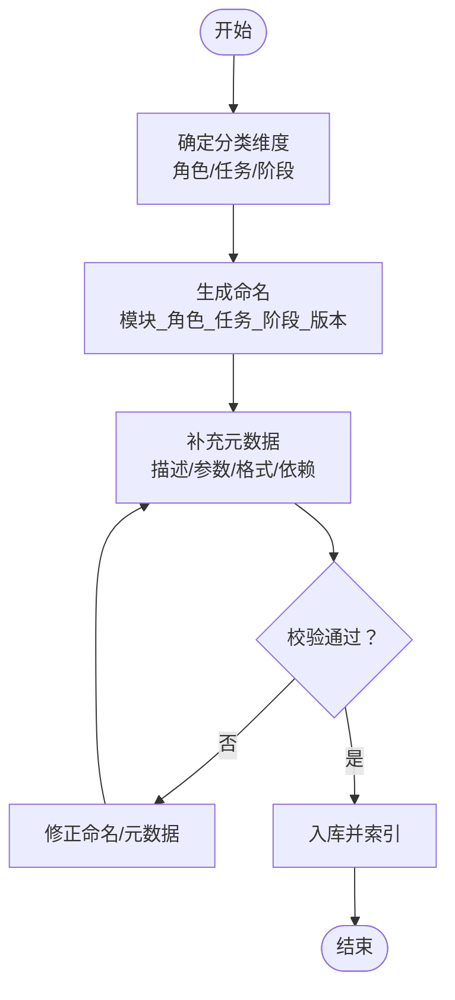
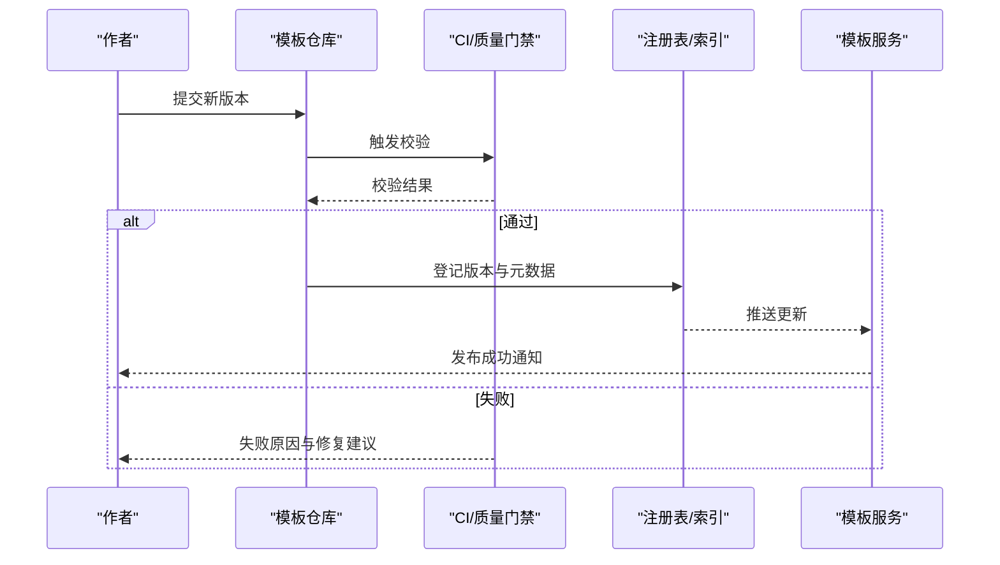
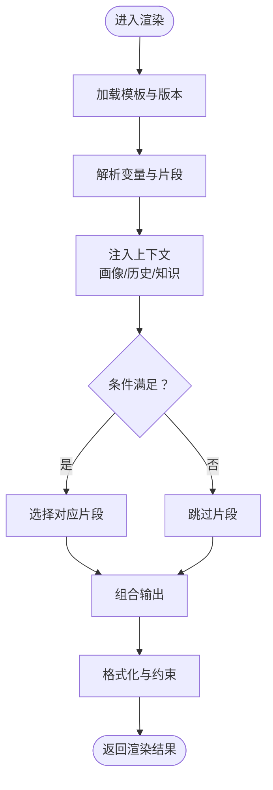
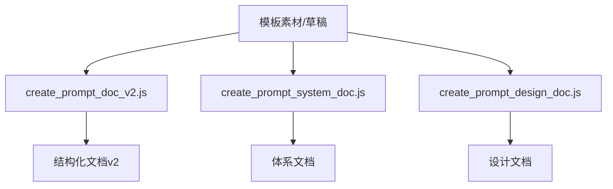
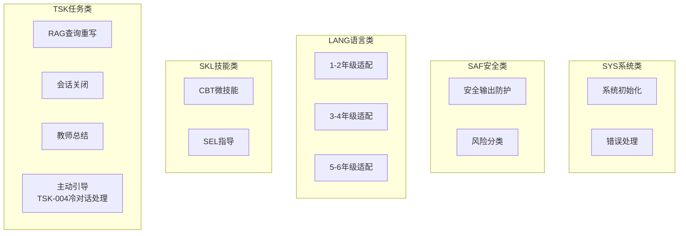
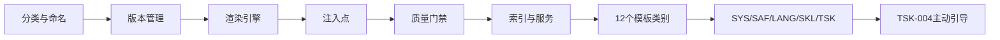
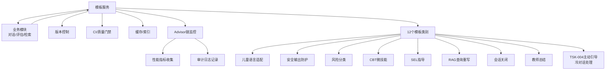

# Prompt模板库

<cite>
**本文引用的文件**   
- [design/18_Prompt模板库.md](file://design/18_Prompt模板库.md)
- [design/02_Prompt体系详细设计.md](file://design/02_Prompt体系详细设计.md)
- [scripts/create_prompt_doc_v2.js](file://scripts/create_prompt_doc_v2.js)
- [scripts/create_prompt_system_doc.js](file://scripts/create_prompt_system_doc.js)
- [scripts/create_prompt_design_doc.js](file://scripts/create_prompt_design_doc.js)
</cite>

## 更新摘要
**变更内容**   
- 新增了proactive_nudge_zh-CN_v1.0.0.md提示词模板，专门针对中文语言咨询场景的TSK-004主动引导提示
- 该模板专注于冷对话处理场景，提供主动引导和破冰策略
- 更新了TSK（任务类）模板类别，新增主动引导功能模块
- 完善了中文语言环境下的对话启动和维持机制

## 目录
1. [简介](#简介)
2. [项目结构](#项目结构)
3. [核心组件](#核心组件)
4. [架构总览](#架构总览)
5. [详细组件分析](#详细组件分析)
6. [依赖分析](#依赖分析)
7. [性能考虑](#性能考虑)
8. [故障排查指南](#故障排查指南)
9. [结论](#结论)
10. [附录](#附录)

## 简介
本文件聚焦于"Prompt模板库"的设计与实现，围绕提示词的组织、版本化、渲染与注入机制展开。目标是为AI心理咨询系统提供稳定、可复用、可审计的提示词基础设施，支撑多Agent工作流、多学校SaaS隔离以及风险识别等关键能力。文档从体系设计到落地脚本进行系统化梳理，帮助读者快速理解并扩展模板库。

**更新** 本次更新重点反映了新增的proactive_nudge_zh-CN_v1.0.0.md提示词模板，该模板专门为中文语言咨询场景设计，包含TSK-004主动引导提示，用于处理冷对话场景，提升对话启动和维持的效果。

## 项目结构
与Prompt模板库直接相关的资产主要位于设计文档与生成脚本中：
- 设计文档：定义模板体系、命名规范、版本策略、渲染流程与注入点
- 生成脚本：用于将模板素材转换为结构化文档或配置，便于工程集成与自动化维护

图表来源
- [design/02_Prompt体系详细设计.md](file://design/02_Prompt体系详细设计.md)
- [design/18_Prompt模板库.md](file://design/18_Prompt模板库.md)
- [scripts/create_prompt_doc_v2.js](file://scripts/create_prompt_doc_v2.js)
- [scripts/create_prompt_system_doc.js](file://scripts/create_prompt_system_doc.js)
- [scripts/create_prompt_design_doc.js](file://scripts/create_prompt_design_doc.js)

章节来源
- [design/18_Prompt模板库.md](file://design/18_Prompt模板库.md)
- [design/02_Prompt体系详细设计.md](file://design/02_Prompt体系详细设计.md)

## 核心组件
- 模板分类与命名规范：按角色、任务、阶段划分，统一前缀与后缀约定，确保可读性与检索效率
- 版本管理：语义化版本控制，变更日志与回滚策略，保障线上稳定性
- 渲染引擎：变量替换、条件分支、片段组合、上下文注入（用户画像、会话历史、知识库引用）
- 注入点：在对话编排、风险评估、知识检索等环节按需加载模板
- 质量门禁：语法校验、敏感词检测、长度限制、输出格式约束

**更新** 新增了TSK-004主动引导模板，专门处理中文语言环境下的冷对话场景，提供破冰和对话启动策略。

章节来源
- [design/18_Prompt模板库.md](file://design/18_Prompt模板库.md)
- [design/02_Prompt体系详细设计.md](file://design/02_Prompt体系详细设计.md)

## 架构总览
下图展示模板库在系统中的位置与交互关系：上层业务通过模板服务获取模板，渲染后注入至各Agent工作流节点；同时受版本与权限控制，支持多学校隔离。

**更新** 新增了TSK-004主动引导模板的相关架构图，展示了冷对话处理功能在整体架构中的位置。

图表来源
- [design/18_Prompt模板库.md](file://design/18_Prompt模板库.md)
- [design/02_Prompt体系详细设计.md](file://design/02_Prompt体系详细设计.md)

## 详细组件分析

### 模板分类与命名规范
- 分类维度：角色（如咨询师、督导）、任务（如共情回应、认知重构）、阶段（初访、干预、结案）
- 命名约定：模块_角色_任务_阶段_版本，便于检索与灰度发布
- 元数据：描述、适用场景、输入参数、输出格式、依赖模板、变更记录

图表来源
- [design/18_Prompt模板库.md](file://design/18_Prompt模板库.md)

章节来源
- [design/18_Prompt模板库.md](file://design/18_Prompt模板库.md)

### 版本管理与发布流程
- 语义化版本：主版本（不兼容变更）、次版本（新增功能）、修订（修复问题）
- 发布策略：灰度、A/B、回滚预案
- 审计追踪：变更原因、影响范围、审批记录

图表来源
- [design/18_Prompt模板库.md](file://design/18_Prompt模板库.md)

章节来源
- [design/18_Prompt模板库.md](file://design/18_Prompt模板库.md)

### 渲染引擎与注入点
- 变量替换：支持基础类型、对象、数组与函数式表达式
- 条件分支：基于上下文状态选择不同片段
- 片段组合：模板间引用与拼装，避免重复内容
- 注入点：会话历史、用户画像、外部知识检索结果、风险评估信号

图表来源
- [design/18_Prompt模板库.md](file://design/18_Prompt模板库.md)

章节来源
- [design/18_Prompt模板库.md](file://design/18_Prompt模板库.md)

### 工程化脚本与自动化
- create_prompt_doc_v2.js：将模板素材转换为结构化文档，统一字段与示例
- create_prompt_system_doc.js：聚合体系文档，生成跨模块参考
- create_prompt_design_doc.js：辅助设计文档生成，提升一致性

图表来源
- [scripts/create_prompt_doc_v2.js](file://scripts/create_prompt_doc_v2.js)
- [scripts/create_prompt_system_doc.js](file://scripts/create_prompt_system_doc.js)
- [scripts/create_prompt_design_doc.js](file://scripts/create_prompt_design_doc.js)

章节来源
- [scripts/create_prompt_doc_v2.js](file://scripts/create_prompt_doc_v2.js)
- [scripts/create_prompt_system_doc.js](file://scripts/create_prompt_system_doc.js)
- [scripts/create_prompt_design_doc.js](file://scripts/create_prompt_design_doc.js)

### 12个模板类别详解
**更新** 新增了TSK-004主动引导模板，专门处理中文语言环境下的冷对话场景：

#### SYS（系统类模板）
- 系统初始化模板：系统初始化配置，包含角色设定、行为准则和沟通风格
- 系统错误处理模板：统一的错误处理和异常恢复机制

#### SAF（安全类模板）
- 安全输出防护模板：安全防护规则，确保输出内容符合安全标准
- 风险分类模板：自动识别和分类潜在风险内容

#### LANG（语言类模板）
- 儿童语言适配模板（1-2年级）：适合低年级儿童的简单语言风格
- 儿童语言适配模板（3-4年级）：适合中年级儿童的表达方式
- 儿童语言适配模板（5-6年级）：接近高年级学生的沟通风格

#### SKL（技能类模板）
- CBT微技能模板：认知行为治疗技巧，保持专业性和亲和力
- SEL指导模板：社会情感学习的相关指导和练习

#### TSK（任务类模板）
- RAG查询重写模板：优化检索增强生成的查询语句
- 会话关闭模板：标准化的会话结束流程和总结
- 教师总结模板：自动生成教学反馈和观察报告
- **主动引导模板（TSK-004）**：专门针对中文语言咨询场景的冷对话处理，提供破冰策略和对话启动技巧

**图表来源**
- [design/18_Prompt模板库.md](file://design/18_Prompt模板库.md)

章节来源
- [design/18_Prompt模板库.md](file://design/18_Prompt模板库.md)

### 概念总览
以下概念图用于帮助非技术读者理解模板库的整体思路：以"分类—版本—渲染—注入—治理"为主线，贯穿模板全生命周期。

[本图为概念示意，无需图表来源]

## 依赖分析
- 内部依赖：与对话编排、风险评估、知识检索等模块存在接口契约
- 外部依赖：版本控制、CI流水线、缓存与索引服务
- 耦合与内聚：模板服务高内聚，对外暴露稳定API；通过注入点降低与具体业务的耦合

**更新** 新增了TSK-004主动引导模板的依赖关系，确保冷对话处理功能的正确集成。

图表来源
- [design/18_Prompt模板库.md](file://design/18_Prompt模板库.md)
- [design/02_Prompt体系详细设计.md](file://design/02_Prompt体系详细设计.md)

章节来源
- [design/18_Prompt模板库.md](file://design/18_Prompt模板库.md)
- [design/02_Prompt体系详细设计.md](file://design/02_Prompt体系详细设计.md)

## 性能考虑
- 缓存策略：热点模板与渲染结果缓存，结合TTL与失效键
- 预编译：对静态片段进行预编译，减少运行时开销
- 批量渲染：合并多次请求的上下文，减少重复计算
- 降级方案：渲染失败时回退到默认模板或上一稳定版本
- 监控优化：Advisor链监控采用异步处理，避免影响主流程性能

**更新** 针对TSK-004主动引导模板的性能优化，包括冷对话场景的响应速度和资源消耗优化。

## 故障排查指南
- 常见问题
  - 变量未定义：检查注入上下文与必填参数
  - 条件分支异常：核对上下文状态与布尔表达式
  - 片段缺失：确认依赖模板是否已入库且版本匹配
  - 格式错误：查看质量门禁日志与约束规则
  - Advisor链执行失败：检查状态跟踪日志和错误信息
  - 冷对话处理异常：检查TSK-004模板的引导策略和响应逻辑
- 定位步骤
  - 根据模板ID与版本定位源文件
  - 查看渲染中间产物与注入快照
  - 对比相邻版本的差异与变更记录
  - 使用最小复现用例验证修复效果
  - 通过Advisor链监控定位执行异常点

**更新** 新增了TSK-004主动引导模板相关的故障排查指导，包括冷对话处理异常、引导策略失效等专门的处理方法。

章节来源
- [design/18_Prompt模板库.md](file://design/18_Prompt模板库.md)

## 结论
Prompt模板库通过清晰的分类与命名、严格的版本管理、灵活的渲染与注入机制，以及完善的质量门禁与工程化脚本，为AI心理咨询系统提供了稳定可扩展的提示词基础设施。本次更新重点反映了新增的proactive_nudge_zh-CN_v1.0.0.md提示词模板，该模板专门为中文语言咨询场景设计，包含TSK-004主动引导提示，用于处理冷对话场景，提升对话启动和维持的效果。建议在后续迭代中持续完善监控指标、回归测试与灰度策略，进一步提升可用性与安全性。

## 附录
- 术语说明
  - 模板：可复用的提示词片段或完整指令
  - 渲染：将模板与上下文结合生成最终提示词的过程
  - 注入：将业务上下文插入模板指定位置
  - 质量门禁：在发布前对模板进行的自动化校验与安全审查
  - Advisor链：模板执行过程中的监控和状态跟踪机制
  - 占位符：模板中的动态变量标记
  - 模板类别：SYS（系统）、SAF（安全）、LANG（语言）、SKL（技能）、TSK（任务）五大核心分类
  - TSK-004主动引导：专门处理中文语言环境下冷对话场景的提示词模板
  - 冷对话处理：指对话初始阶段的破冰和引导策略
- 相关文档
  - Prompt体系详细设计：[design/02_Prompt体系详细设计.md](file://design/02_Prompt体系详细设计.md)
  - Prompt模板库：[design/18_Prompt模板库.md](file://design/18_Prompt模板库.md)
