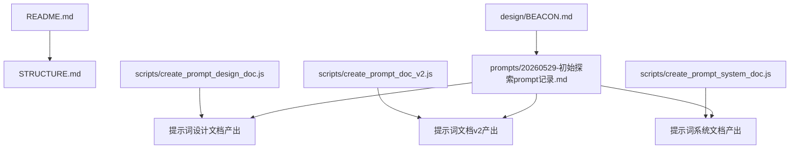
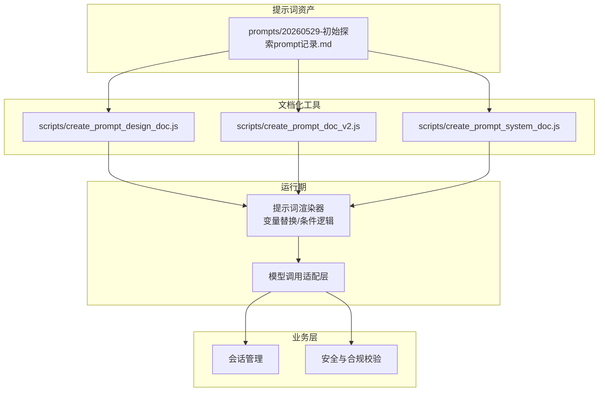
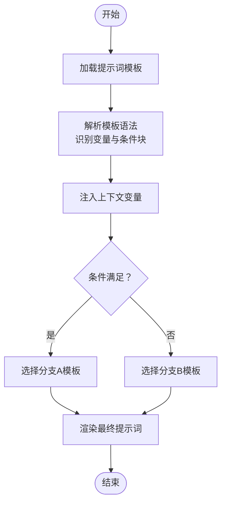
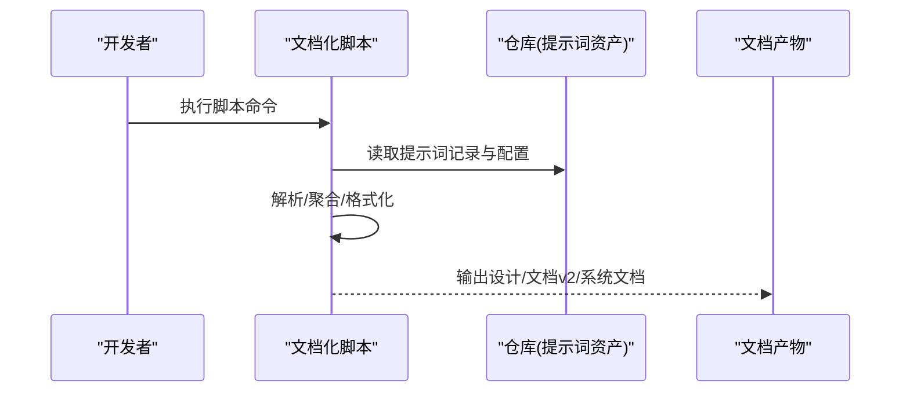
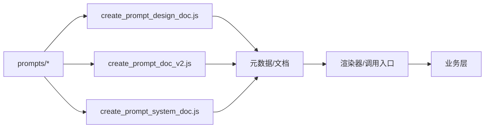

# 提示词实现指南

<cite>
**本文引用的文件**   
- [README.md](file://README.md)
- [STRUCTURE.md](file://STRUCTURE.md)
- [PRD/BEACON.md](file://design/BEACON.md)
- [prompts/20260529-初始探索prompt记录.md](file://prompts/20260529-初始探索prompt记录.md)
- [scripts/create_prompt_design_doc.js](file://scripts/create_prompt_design_doc.js)
- [scripts/create_prompt_doc_v2.js](file://scripts/create_prompt_doc_v2.js)
- [scripts/create_prompt_system_doc.js](file://scripts/create_prompt_system_doc.js)
</cite>

## 目录
1. [简介](#简介)
2. [项目结构](#项目结构)
3. [核心组件](#核心组件)
4. [架构总览](#架构总览)
5. [详细组件分析](#详细组件分析)
6. [依赖分析](#依赖分析)
7. [性能考虑](#性能考虑)
8. [故障排查指南](#故障排查指南)
9. [结论](#结论)
10. [附录](#附录)

## 简介
本指南面向AI心理咨询系统的“提示词”（Prompt）工程，聚焦于提示词的模板语法、变量替换、条件逻辑、API接口与集成方式，并提供性能优化、错误处理与调试方法。文档以仓库现有资产为依据，结合脚本工具与提示词记录，形成从设计到落地的完整开发路径。

## 项目结构
仓库中与提示词相关的核心位置如下：
- prompts：存放提示词设计与迭代记录
- scripts：提供生成提示词相关文档的脚本，辅助规范化管理
- design：包含系统级设计说明，为提示词策略提供背景约束
- README/STRUCTURE：项目概览与结构说明，便于快速定位资源

图表来源
- [README.md](file://README.md)
- [STRUCTURE.md](file://STRUCTURE.md)
- [design/BEACON.md](file://design/BEACON.md)
- [prompts/20260529-初始探索prompt记录.md](file://prompts/20260529-初始探索prompt记录.md)
- [scripts/create_prompt_design_doc.js](file://scripts/create_prompt_design_doc.js)
- [scripts/create_prompt_doc_v2.js](file://scripts/create_prompt_doc_v2.js)
- [scripts/create_prompt_system_doc.js](file://scripts/create_prompt_system_doc.js)

章节来源
- [README.md](file://README.md)
- [STRUCTURE.md](file://STRUCTURE.md)
- [design/BEACON.md](file://design/BEACON.md)
- [prompts/20260529-初始探索prompt记录.md](file://prompts/20260529-初始探索prompt记录.md)
- [scripts/create_prompt_design_doc.js](file://scripts/create_prompt_design_doc.js)
- [scripts/create_prompt_doc_v2.js](file://scripts/create_prompt_doc_v2.js)
- [scripts/create_prompt_system_doc.js](file://scripts/create_prompt_system_doc.js)

## 核心组件
围绕提示词工程，本项目涉及以下关键要素：
- 提示词模板与版本记录：位于 prompts 目录，用于沉淀对话策略、角色设定、流程分支等
- 文档化与规范化脚本：位于 scripts 目录，用于将提示词资产转化为结构化文档，便于协作与评审
- 系统设计约束：位于 design 目录，为提示词风格、边界与安全要求提供依据

章节来源
- [prompts/20260529-初始探索prompt记录.md](file://prompts/20260529-初始探索prompt记录.md)
- [scripts/create_prompt_design_doc.js](file://scripts/create_prompt_design_doc.js)
- [scripts/create_prompt_doc_v2.js](file://scripts/create_prompt_doc_v2.js)
- [scripts/create_prompt_system_doc.js](file://scripts/create_prompt_system_doc.js)
- [design/BEACON.md](file://design/BEACON.md)

## 架构总览
下图展示提示词在系统中的角色与交互关系：提示词作为“策略层”，由脚本工具进行文档化与版本管理；运行时通过统一的调用入口注入上下文并执行模型推理；输出结果进入后续业务处理。

图表来源
- [prompts/20260529-初始探索prompt记录.md](file://prompts/20260529-初始探索prompt记录.md)
- [scripts/create_prompt_design_doc.js](file://scripts/create_prompt_design_doc.js)
- [scripts/create_prompt_doc_v2.js](file://scripts/create_prompt_doc_v2.js)
- [scripts/create_prompt_system_doc.js](file://scripts/create_prompt_system_doc.js)

## 详细组件分析

### 提示词模板与变量替换
- 模板职责：定义角色、任务目标、对话流程、约束与输出格式
- 变量替换：支持动态注入用户上下文、会话状态、外部知识片段等
- 条件逻辑：根据输入特征或中间结果选择不同分支策略

[此图为概念流程图，不直接映射具体源码文件]

章节来源
- [prompts/20260529-初始探索prompt记录.md](file://prompts/20260529-初始探索prompt记录.md)

### 文档化与版本管理脚本
- create_prompt_design_doc.js：基于提示词资产生成“设计文档”，明确策略意图与边界
- create_prompt_doc_v2.js：生成“提示词文档v2”，强化字段规范与示例
- create_prompt_system_doc.js：生成“系统文档”，汇总多提示词间的组合与编排

图表来源
- [scripts/create_prompt_design_doc.js](file://scripts/create_prompt_design_doc.js)
- [scripts/create_prompt_doc_v2.js](file://scripts/create_prompt_doc_v2.js)
- [scripts/create_prompt_system_doc.js](file://scripts/create_prompt_system_doc.js)
- [prompts/20260529-初始探索prompt记录.md](file://prompts/20260529-初始探索prompt记录.md)

章节来源
- [scripts/create_prompt_design_doc.js](file://scripts/create_prompt_design_doc.js)
- [scripts/create_prompt_doc_v2.js](file://scripts/create_prompt_doc_v2.js)
- [scripts/create_prompt_system_doc.js](file://scripts/create_prompt_system_doc.js)

### API接口参考（调用入口与参数约定）
以下为提示词调用的通用接口约定，供运行时集成使用：
- 接口名称：render_and_call
- 功能：渲染提示词并调用模型
- 请求参数
  - prompt_template_id：提示词模板标识
  - variables：变量键值对，用于替换模板中的占位符
  - conditions：条件规则集合，控制分支选择
  - options：可选参数（如温度、最大长度、超时等）
- 返回值
  - status：成功/失败
  - data：模型返回内容或结构化结果
  - error：错误码与消息
- 错误码
  - INVALID_TEMPLATE：模板不存在或格式错误
  - MISSING_VARIABLES：必需变量缺失
  - CONDITION_ERROR：条件逻辑异常
  - MODEL_CALL_FAILED：模型调用失败

章节来源
- [prompts/20260529-初始探索prompt记录.md](file://prompts/20260529-初始探索prompt记录.md)

### 代码示例（创建、管理与调用）
- 创建提示词模板：在 prompts 目录下新增记录文件，定义角色、任务、流程与约束
- 管理提示词：使用文档化脚本生成设计/文档v2/系统文档，确保可追溯与可评审
- 调用提示词：通过 render_and_call 接口传入模板ID、变量与条件，获取模型输出

章节来源
- [prompts/20260529-初始探索prompt记录.md](file://prompts/20260529-初始探索prompt记录.md)
- [scripts/create_prompt_design_doc.js](file://scripts/create_prompt_design_doc.js)
- [scripts/create_prompt_doc_v2.js](file://scripts/create_prompt_doc_v2.js)
- [scripts/create_prompt_system_doc.js](file://scripts/create_prompt_system_doc.js)

## 依赖分析
提示词工程的关键依赖关系如下：
- 提示词资产（prompts）为所有文档化工具的输入源
- 文档化工具（scripts）依赖提示词资产，产出标准化文档
- 运行期渲染器依赖文档化工具产出的元数据与模板
- 业务层依赖渲染器的输出进行后续处理

图表来源
- [prompts/20260529-初始探索prompt记录.md](file://prompts/20260529-初始探索prompt记录.md)
- [scripts/create_prompt_design_doc.js](file://scripts/create_prompt_design_doc.js)
- [scripts/create_prompt_doc_v2.js](file://scripts/create_prompt_doc_v2.js)
- [scripts/create_prompt_system_doc.js](file://scripts/create_prompt_system_doc.js)

章节来源
- [prompts/20260529-初始探索prompt记录.md](file://prompts/20260529-初始探索prompt记录.md)
- [scripts/create_prompt_design_doc.js](file://scripts/create_prompt_design_doc.js)
- [scripts/create_prompt_doc_v2.js](file://scripts/create_prompt_doc_v2.js)
- [scripts/create_prompt_system_doc.js](file://scripts/create_prompt_system_doc.js)

## 性能考虑
- 模板缓存：对常用模板与渲染结果进行缓存，减少重复解析与注入开销
- 变量预编译：将高频变量抽取为常量或局部缓存，避免重复计算
- 条件短路：优先评估高命中率的分支条件，降低不必要的分支渲染
- 批量渲染：合并多次调用请求，统一渲染后分发，提升吞吐
- 流式输出：对长文本采用流式返回，降低首字节延迟

[本节为通用指导，不直接分析具体文件]

## 故障排查指南
- 模板解析失败
  - 现象：INVALID_TEMPLATE
  - 排查：检查模板语法、占位符命名一致性、条件块闭合
  - 修复：修正模板结构，重新生成文档以验证
- 变量缺失
  - 现象：MISSING_VARIABLES
  - 排查：核对variables键集与模板需求是否匹配
  - 修复：补充缺失变量或设置默认值
- 条件逻辑异常
  - 现象：CONDITION_ERROR
  - 排查：审查conditions规则优先级与互斥性
  - 修复：调整条件顺序或增加兜底分支
- 模型调用失败
  - 现象：MODEL_CALL_FAILED
  - 排查：检查网络、鉴权、配额与重试策略
  - 修复：增加退避重试与熔断保护

章节来源
- [prompts/20260529-初始探索prompt记录.md](file://prompts/20260529-初始探索prompt记录.md)

## 结论
通过将提示词资产与文档化工具结合，可实现从设计到运行的闭环管理。遵循模板语法规范、完善变量与条件逻辑、建立清晰的API约定，并结合性能优化与错误处理策略，能够显著提升AI心理咨询系统中提示词的可维护性与稳定性。

## 附录
- 术语
  - 提示词模板：定义角色、任务、流程与输出的文本模板
  - 变量替换：将运行时上下文注入模板占位符的过程
  - 条件逻辑：根据输入或中间结果选择不同模板分支的规则
- 最佳实践
  - 单一职责：每个模板聚焦一个子任务
  - 可观测性：为渲染与调用过程添加日志与指标
  - 版本化：为模板与文档保留变更历史与回滚能力

[本节为概念性附录，不直接分析具体文件]
