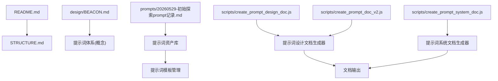
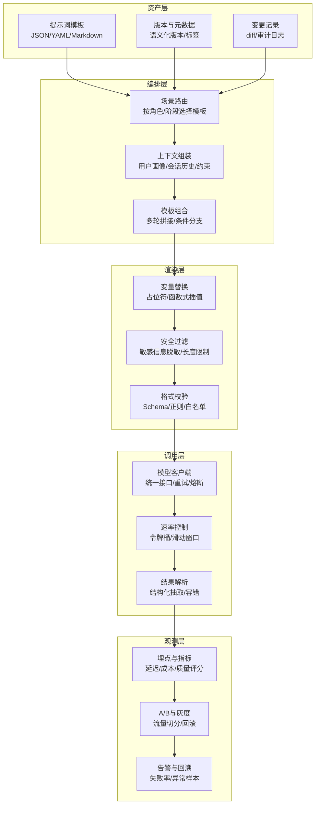
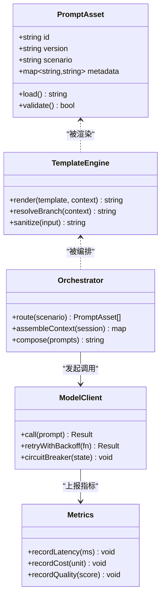
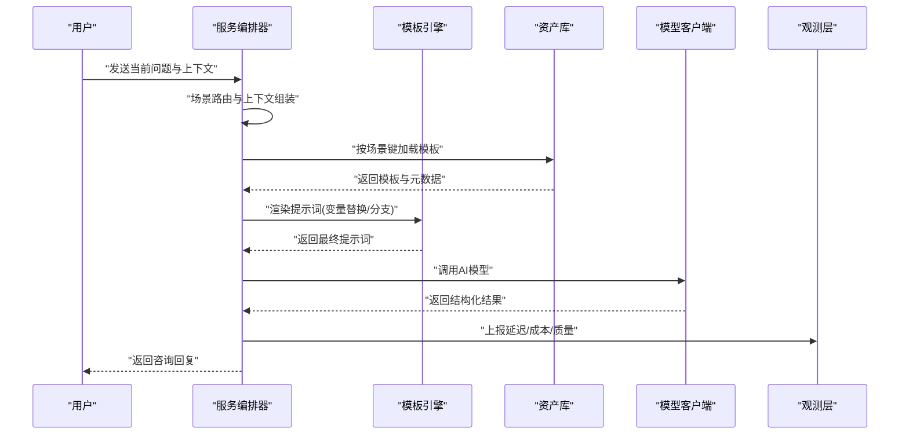
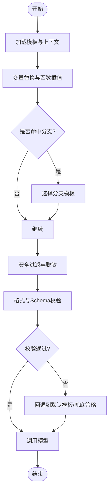

# 提示词工程

<cite>
**本文引用的文件**   
- [README.md](file://README.md)
- [STRUCTURE.md](file://STRUCTURE.md)
- [PRD/BEACON.md](file://design/BEACON.md)
- [prompts/20260529-初始探索prompt记录.md](file://prompts/20260529-初始探索prompt记录.md)
- [scripts/create_prompt_design_doc.js](file://scripts/create_prompt_design_doc.js)
- [scripts/create_prompt_doc_v2.js](file://scripts/create_prompt_doc_v2.js)
- [scripts/create_prompt_system_doc.js](file://scripts/create_prompt_system_doc.js)
</cite>

## 目录
1. [简介](#简介)
2. [项目结构](#项目结构)
3. [核心组件](#核心组件)
4. [架构总览](#架构总览)
5. [详细组件分析](#详细组件分析)
6. [依赖分析](#依赖分析)
7. [性能考虑](#性能考虑)
8. [故障排查指南](#故障排查指南)
9. [结论](#结论)
10. [附录](#附录)

## 简介
本技术文档面向AI心理咨询系统的“提示词工程”方向，聚焦于提示词系统的设计理念、架构模式与最佳实践。内容涵盖：
- 提示词模板的管理机制、版本控制与动态加载策略
- 提示词设计原则、优化技巧与调试方法
- 不同场景下的提示词设计模式与示例路径
- 提示词与AI模型的交互机制、性能优化与错误处理方案

目标读者包括产品经理、提示词工程师、后端与前端开发者以及测试与运维人员。

## 项目结构
仓库中与提示词工程直接相关的资源主要分布在以下位置：
- prompts：存放提示词资产与变更记录
- scripts：生成与整理提示词相关文档的脚本
- design：产品与设计说明（含BEACON）
- README.md、STRUCTURE.md：项目概览与结构说明

图表来源
- [README.md](file://README.md)
- [STRUCTURE.md](file://STRUCTURE.md)
- [design/BEACON.md](file://design/BEACON.md)
- [prompts/20260529-初始探索prompt记录.md](file://prompts/20260529-初始探索prompt记录.md)
- [scripts/create_prompt_design_doc.js](file://scripts/create_prompt_design_doc.js)
- [scripts/create_prompt_doc_v2.js](file://scripts/create_prompt_doc_v2.js)
- [scripts/create_prompt_system_doc.js](file://scripts/create_prompt_system_doc.js)

章节来源
- [README.md](file://README.md)
- [STRUCTURE.md](file://STRUCTURE.md)

## 核心组件
围绕提示词工程的核心组件包括：
- 提示词资产库：集中存储与管理提示词模板、版本与元数据
- 提示词模板引擎：负责变量替换、条件分支、上下文注入与渲染
- 提示词编排器：按业务场景组合多个模板，形成对话流程或工作流
- 模型交互层：封装与AI模型的调用、重试、限流与结果解析
- 文档与工具链：自动化生成提示词文档、变更追踪与回归检查

上述组件在现有仓库中以“资产+脚本+文档”的形式体现，后续可在src中落地为可执行模块。

章节来源
- [prompts/20260529-初始探索prompt记录.md](file://prompts/20260529-初始探索prompt记录.md)
- [scripts/create_prompt_design_doc.js](file://scripts/create_prompt_design_doc.js)
- [scripts/create_prompt_doc_v2.js](file://scripts/create_prompt_doc_v2.js)
- [scripts/create_prompt_system_doc.js](file://scripts/create_prompt_system_doc.js)

## 架构总览
提示词工程的总体架构由“资产—编排—渲染—调用—观测”五层构成，强调解耦与可演进性。

图表来源
- [prompts/20260529-初始探索prompt记录.md](file://prompts/20260529-初始探索prompt记录.md)
- [scripts/create_prompt_design_doc.js](file://scripts/create_prompt_design_doc.js)
- [scripts/create_prompt_doc_v2.js](file://scripts/create_prompt_doc_v2.js)
- [scripts/create_prompt_system_doc.js](file://scripts/create_prompt_system_doc.js)

## 详细组件分析

### 提示词资产库与版本控制
- 资产形态：建议以结构化格式（如JSON/YAML）承载模板主体，辅以Markdown进行说明与示例；变更记录使用独立文件便于diff与审计。
- 版本策略：采用语义化版本（主版本=破坏性变更，次版本=新增能力，修订=修复与优化），并在元数据中标注适用场景、风险等级与依赖关系。
- 命名规范：按“领域_角色_阶段_版本号”组织，确保可读性与检索效率。
- 变更流程：提交前自动运行文档生成与一致性检查，合并后触发回归用例集。

章节来源
- [prompts/20260529-初始探索prompt记录.md](file://prompts/20260529-初始探索prompt记录.md)

### 模板引擎与动态加载
- 变量替换：支持占位符与函数式插值，提供内置函数（时间、格式化、脱敏等）。
- 条件分支：基于上下文特征（用户画像、情绪状态、风险等级）选择分支模板。
- 动态加载：按场景键从资产库拉取模板，结合缓存策略减少I/O开销。
- 安全边界：对输入做长度与字符集校验，对输出做结构化抽取与兜底。

章节来源
- [scripts/create_prompt_design_doc.js](file://scripts/create_prompt_design_doc.js)
- [scripts/create_prompt_doc_v2.js](file://scripts/create_prompt_doc_v2.js)

### 编排器与工作流
- 场景路由：根据任务类型（初访评估、CBT练习、危机干预等）选择对应模板集合。
- 上下文组装：聚合会话历史、用户画像、外部知识片段，并注入到模板上下文中。
- 多轮拼接：将上一轮回复摘要、关键事实与当前问题组合为新提示词。
- 编排校验：在渲染前后进行Schema校验与规则检查，避免非法上下文进入模型。

章节来源
- [scripts/create_prompt_system_doc.js](file://scripts/create_prompt_system_doc.js)

### 模型交互层
- 统一接口：抽象模型调用细节，屏蔽不同厂商差异。
- 可靠性：指数退避重试、熔断降级、超时与取消。
- 成本控制：请求压缩、缓存命中、批量与并行控制。
- 结果解析：结构化抽取、容错与回退策略，保证下游可用性。

章节来源
- [scripts/create_prompt_design_doc.js](file://scripts/create_prompt_design_doc.js)
- [scripts/create_prompt_doc_v2.js](file://scripts/create_prompt_doc_v2.js)

### 文档与工具链
- 自动生成：从模板与元数据生成API风格文档、变更日志与示例。
- 一致性检查：模板字段完整性、引用有效性、敏感词扫描。
- 回归测试：基于典型对话轨迹的端到端验证与质量打分。

章节来源
- [scripts/create_prompt_design_doc.js](file://scripts/create_prompt_design_doc.js)
- [scripts/create_prompt_doc_v2.js](file://scripts/create_prompt_doc_v2.js)
- [scripts/create_prompt_system_doc.js](file://scripts/create_prompt_system_doc.js)

#### 类图：提示词工程核心对象

图表来源
- [scripts/create_prompt_design_doc.js](file://scripts/create_prompt_design_doc.js)
- [scripts/create_prompt_doc_v2.js](file://scripts/create_prompt_doc_v2.js)
- [scripts/create_prompt_system_doc.js](file://scripts/create_prompt_system_doc.js)

#### 序列图：一次咨询对话的提示词渲染与调用

图表来源
- [scripts/create_prompt_design_doc.js](file://scripts/create_prompt_design_doc.js)
- [scripts/create_prompt_doc_v2.js](file://scripts/create_prompt_doc_v2.js)
- [scripts/create_prompt_system_doc.js](file://scripts/create_prompt_system_doc.js)

#### 流程图：提示词渲染与安全校验

图表来源
- [scripts/create_prompt_design_doc.js](file://scripts/create_prompt_design_doc.js)
- [scripts/create_prompt_doc_v2.js](file://scripts/create_prompt_doc_v2.js)

## 依赖分析
- 内部依赖
  - 资产库为模板引擎与编排器的基础依赖
  - 模板引擎为编排器的运行时依赖
  - 编排器驱动模型客户端完成推理
  - 观测层贯穿全流程采集指标
- 外部依赖
  - AI模型提供方（统一接口抽象）
  - 配置中心（用于开关、阈值与灰度策略）
  - 日志与监控系统（集中采集与告警）

图表来源
- [scripts/create_prompt_design_doc.js](file://scripts/create_prompt_design_doc.js)
- [scripts/create_prompt_doc_v2.js](file://scripts/create_prompt_doc_v2.js)
- [scripts/create_prompt_system_doc.js](file://scripts/create_prompt_system_doc.js)

章节来源
- [scripts/create_prompt_design_doc.js](file://scripts/create_prompt_design_doc.js)
- [scripts/create_prompt_doc_v2.js](file://scripts/create_prompt_doc_v2.js)
- [scripts/create_prompt_system_doc.js](file://scripts/create_prompt_system_doc.js)

## 性能考虑
- 缓存策略：对高频模板与稳定上下文结果进行缓存，设置合理TTL与失效键。
- 请求压缩：合并无关信息、去除冗余描述，降低token消耗。
- 并发与限流：按租户或场景维度进行令牌桶/滑动窗口限流，避免雪崩。
- 结果复用：对相似问题的中间结果进行复用，减少重复计算。
- 监控与调优：关注P95/P99延迟、成本与质量指标，持续迭代提示词。

[本节为通用指导，不直接分析具体文件]

## 故障排查指南
- 常见问题定位
  - 模板缺失或版本不匹配：核对资产库索引与版本标签
  - 变量未填充或越界：检查上下文组装与必填字段
  - 安全过滤误伤：调整白名单与脱敏规则
  - 模型调用失败：查看重试次数、熔断状态与上游健康度
- 快速恢复手段
  - 切换至回退模板或降级策略
  - 关闭非关键增强功能（如复杂分支）
  - 临时放宽校验阈值并记录样本
- 观测与回溯
  - 关联请求ID追踪全链路日志
  - 导出失败样本进行离线分析与回归

章节来源
- [scripts/create_prompt_design_doc.js](file://scripts/create_prompt_design_doc.js)
- [scripts/create_prompt_doc_v2.js](file://scripts/create_prompt_doc_v2.js)
- [scripts/create_prompt_system_doc.js](file://scripts/create_prompt_system_doc.js)

## 结论
本方案以“资产—编排—渲染—调用—观测”的分层架构为核心，结合严格的版本管理与工具链，构建可演进、可观测、可回滚的提示词工程体系。通过标准化模板、系统化编排与稳健的模型交互，能够在心理咨询场景中实现高质量、高可用的AI辅助对话。

[本节为总结性内容，不直接分析具体文件]

## 附录

### 提示词设计原则
- 明确角色与目标：清晰定义AI角色、任务边界与期望输出格式
- 结构化表达：使用分层段落、编号与约束条款，提升稳定性
- 渐进披露：先给框架再补充细节，避免一次性信息过载
- 安全优先：内置伦理与合规约束，拒绝不当引导
- 可测试性：为每个模板准备正负样本与验收标准

[本节为通用指导，不直接分析具体文件]

### 优化技巧
- 精简上下文：仅保留必要事实与关键线索
- 指令优先级：将关键约束置于开头与结尾
- 少即是多：用更少的token达成更强的约束效果
- 模板复用：抽象通用片段，减少重复与维护成本
- 灰度发布：小流量验证后再全量推广

[本节为通用指导，不直接分析具体文件]

### 调试方法
- 单测驱动：为模板编写单元测试，覆盖边界与异常
- 沙箱渲染：在不调用模型的情况下验证渲染结果
- 对比评测：建立基线提示词，量化改进收益
- 可视化审查：将渲染后的提示词输出到日志以便人工复核

[本节为通用指导，不直接分析具体文件]

### 示例代码与配置模板路径
- 提示词资产与变更记录
  - [prompts/20260529-初始探索prompt记录.md](file://prompts/20260529-初始探索prompt记录.md)
- 文档生成与系统说明脚本
  - [scripts/create_prompt_design_doc.js](file://scripts/create_prompt_design_doc.js)
  - [scripts/create_prompt_doc_v2.js](file://scripts/create_prompt_doc_v2.js)
  - [scripts/create_prompt_system_doc.js](file://scripts/create_prompt_system_doc.js)
- 项目结构与设计参考
  - [README.md](file://README.md)
  - [STRUCTURE.md](file://STRUCTURE.md)
  - [design/BEACON.md](file://design/BEACON.md)

[本节为路径指引，不直接分析具体文件]