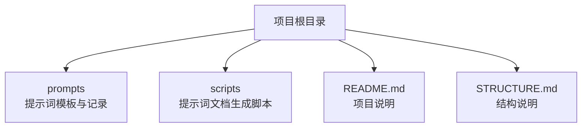
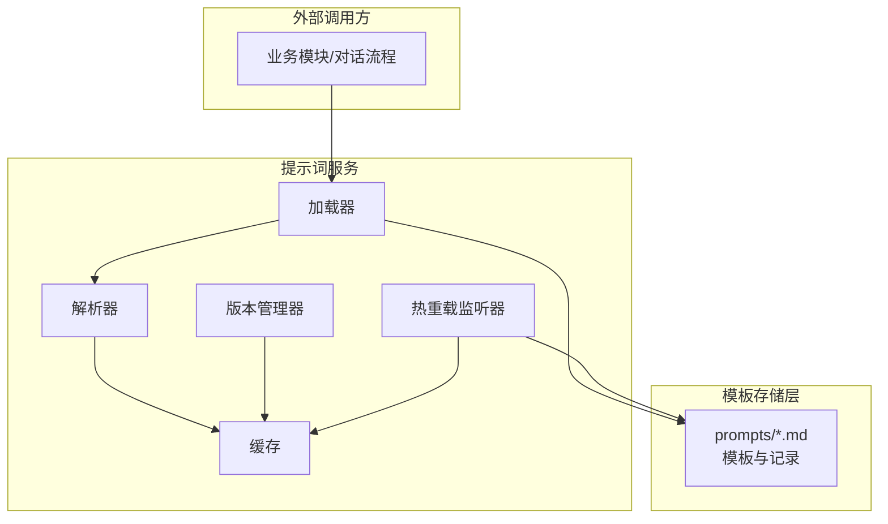
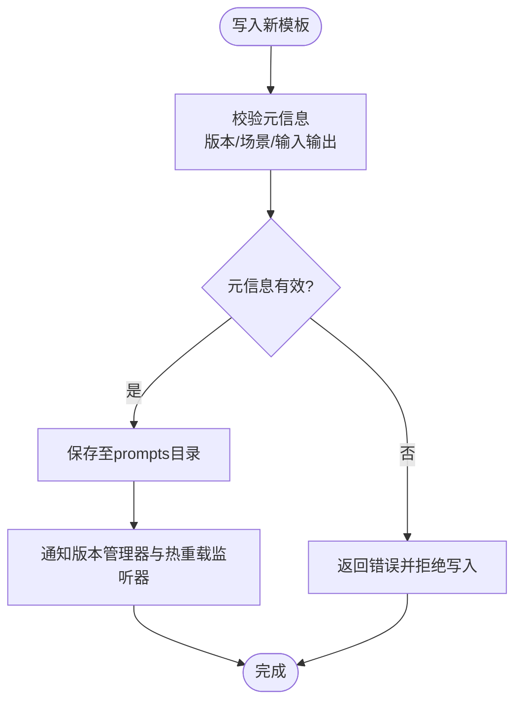
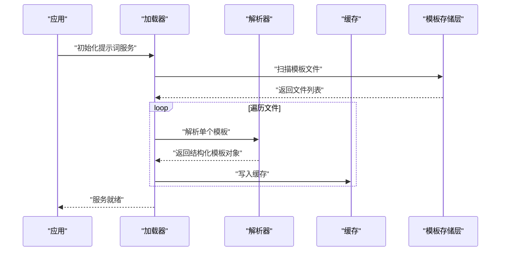
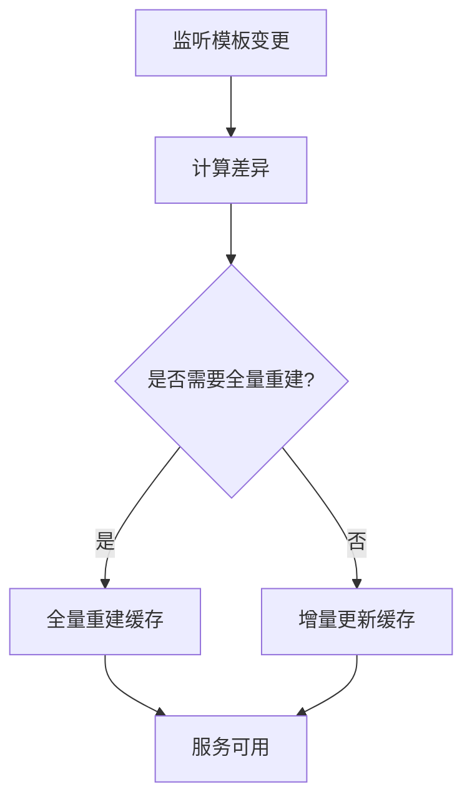
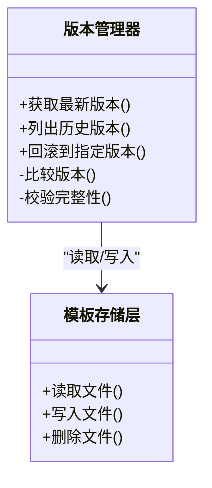
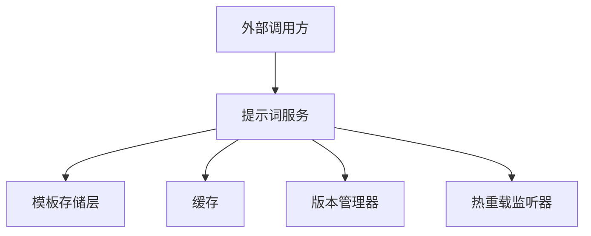

# 提示词系统设计

<cite>
**本文引用的文件**   
- [README.md](file://README.md)
- [STRUCTURE.md](file://STRUCTURE.md)
- [prompts/20260529-初始探索prompt记录.md](file://prompts/20260529-初始探索prompt记录.md)
- [scripts/create_prompt_system_doc.js](file://scripts/create_prompt_system_doc.js)
- [scripts/create_prompt_design_doc.js](file://scripts/create_prompt_design_doc.js)
- [scripts/create_prompt_doc_v2.js](file://scripts/create_prompt_doc_v2.js)
</cite>

## 目录
1. [引言](#引言)
2. [项目结构](#项目结构)
3. [核心组件](#核心组件)
4. [架构总览](#架构总览)
5. [详细组件分析](#详细组件分析)
6. [依赖分析](#依赖分析)
7. [性能考虑](#性能考虑)
8. [故障排查指南](#故障排查指南)
9. [结论](#结论)
10. [附录](#附录)

## 引言
本设计文档面向AI心理咨询系统的“提示词系统”，目标是提供一套可维护、可扩展、可热更新的提示词管理与使用机制。文档覆盖整体架构、核心组件与数据流、模板存储结构与加载缓存策略、版本管理与动态更新（含热重载）、配置示例与集成指南，并给出不同场景下的使用方法。

## 项目结构
仓库中与提示词系统直接相关的资源主要分布在以下位置：
- prompts：存放提示词模板与相关记录
- scripts：包含生成或辅助管理提示词文档的脚本
- README.md、STRUCTURE.md：项目概览与结构说明

图表来源
- [README.md](file://README.md)
- [STRUCTURE.md](file://STRUCTURE.md)
- [prompts/20260529-初始探索prompt记录.md](file://prompts/20260529-初始探索prompt记录.md)
- [scripts/create_prompt_system_doc.js](file://scripts/create_prompt_system_doc.js)
- [scripts/create_prompt_design_doc.js](file://scripts/create_prompt_design_doc.js)
- [scripts/create_prompt_doc_v2.js](file://scripts/create_prompt_doc_v2.js)

章节来源
- [README.md](file://README.md)
- [STRUCTURE.md](file://STRUCTURE.md)

## 核心组件
基于仓库现有资源，提示词系统由以下核心组件构成：
- 模板存储层：以Markdown为主的提示词模板与变更记录，位于prompts目录
- 文档与规范生成器：通过脚本将提示词内容整理为结构化文档，便于查阅与演进
- 运行时加载器（概念性）：在应用启动时读取模板、解析元信息、构建缓存
- 版本与变更管理：以时间戳命名与变更记录的方式实现版本追踪
- 热重载机制（概念性）：监听模板变更事件，触发增量更新与缓存刷新

章节来源
- [prompts/20260529-初始探索prompt记录.md](file://prompts/20260529-初始探索prompt记录.md)
- [scripts/create_prompt_system_doc.js](file://scripts/create_prompt_system_doc.js)
- [scripts/create_prompt_design_doc.js](file://scripts/create_prompt_design_doc.js)
- [scripts/create_prompt_doc_v2.js](file://scripts/create_prompt_doc_v2.js)

## 架构总览
下图展示了提示词系统在运行时的总体交互关系：外部使用者调用提示词服务；服务从模板存储层加载模板，经解析后进入缓存；当模板发生变更时，热重载机制触发增量更新，保证运行时一致性。

图表来源
- [prompts/20260529-初始探索prompt记录.md](file://prompts/20260529-初始探索prompt记录.md)
- [scripts/create_prompt_system_doc.js](file://scripts/create_prompt_system_doc.js)
- [scripts/create_prompt_design_doc.js](file://scripts/create_prompt_design_doc.js)
- [scripts/create_prompt_doc_v2.js](file://scripts/create_prompt_doc_v2.js)

## 详细组件分析

### 模板存储层
- 存储格式：以Markdown为主，便于人类阅读与协作编辑
- 命名约定：采用时间戳前缀（如YYYYMMDD-主题），利于版本识别与排序
- 内容组织：每个模板文件聚焦单一角色或任务，并在头部包含必要元信息（如版本、适用场景、输入输出约定等）
- 变更记录：通过独立记录文件或文件内变更记录段落，描述变更原因与影响范围

图表来源
- [prompts/20260529-初始探索prompt记录.md](file://prompts/20260529-初始探索prompt记录.md)

章节来源
- [prompts/20260529-初始探索prompt记录.md](file://prompts/20260529-初始探索prompt记录.md)

### 加载器与解析器
- 加载器职责：扫描prompts目录，按约定规则收集模板文件，建立索引
- 解析器职责：提取模板元信息、主体内容与占位符，转换为内部数据结构
- 错误处理：对缺失字段、非法格式进行告警与回退策略（例如使用默认模板）

图表来源
- [scripts/create_prompt_system_doc.js](file://scripts/create_prompt_system_doc.js)
- [scripts/create_prompt_design_doc.js](file://scripts/create_prompt_design_doc.js)
- [scripts/create_prompt_doc_v2.js](file://scripts/create_prompt_doc_v2.js)

章节来源
- [scripts/create_prompt_system_doc.js](file://scripts/create_prompt_system_doc.js)
- [scripts/create_prompt_design_doc.js](file://scripts/create_prompt_design_doc.js)
- [scripts/create_prompt_doc_v2.js](file://scripts/create_prompt_doc_v2.js)

### 缓存与热重载
- 缓存策略：内存缓存优先，支持持久化快照（可选）；键空间按模板ID划分，附带版本号与更新时间戳
- 热重载机制：监听模板文件变更事件，仅对受影响模板执行增量解析与缓存更新；必要时触发全量重建
- 一致性保障：读写锁保护缓存并发访问；版本冲突时采用“最后写入优先”或“合并策略”（依业务需求）

图表来源
- [scripts/create_prompt_system_doc.js](file://scripts/create_prompt_system_doc.js)
- [scripts/create_prompt_design_doc.js](file://scripts/create_prompt_design_doc.js)
- [scripts/create_prompt_doc_v2.js](file://scripts/create_prompt_doc_v2.js)

章节来源
- [scripts/create_prompt_system_doc.js](file://scripts/create_prompt_system_doc.js)
- [scripts/create_prompt_design_doc.js](file://scripts/create_prompt_design_doc.js)
- [scripts/create_prompt_doc_v2.js](file://scripts/create_prompt_doc_v2.js)

### 版本管理
- 版本标识：文件名时间戳+内部版本号双标识，确保可读性与机器友好
- 变更记录：每次变更需记录原因、影响范围与验证结果
- 回滚策略：支持按版本快速切换，保留最近N个历史版本用于紧急回滚

图表来源
- [prompts/20260529-初始探索prompt记录.md](file://prompts/20260529-初始探索prompt记录.md)

章节来源
- [prompts/20260529-初始探索prompt记录.md](file://prompts/20260529-初始探索prompt记录.md)

### 扩展点设计
- 模板类型扩展：新增特定领域模板（如CBT、动机访谈）只需遵循元信息约定与解析器契约
- 解析器插件：支持自定义解析逻辑（如引入JSON-LD片段、变量注入）
- 缓存后端替换：可插拔地接入Redis、本地文件等后端
- 热重载策略：可按业务需要选择增量或全量更新策略

章节来源
- [scripts/create_prompt_system_doc.js](file://scripts/create_prompt_system_doc.js)
- [scripts/create_prompt_design_doc.js](file://scripts/create_prompt_design_doc.js)
- [scripts/create_prompt_doc_v2.js](file://scripts/create_prompt_doc_v2.js)

## 依赖分析
提示词系统与周边组件的依赖关系如下：
- 外部调用方依赖提示词服务提供的接口（加载、查询、更新）
- 提示词服务依赖模板存储层（文件系统）与缓存（内存/外部存储）
- 版本管理与热重载作为横切关注点，贯穿加载与更新流程

图表来源
- [scripts/create_prompt_system_doc.js](file://scripts/create_prompt_system_doc.js)
- [scripts/create_prompt_design_doc.js](file://scripts/create_prompt_design_doc.js)
- [scripts/create_prompt_doc_v2.js](file://scripts/create_prompt_doc_v2.js)

章节来源
- [scripts/create_prompt_system_doc.js](file://scripts/create_prompt_system_doc.js)
- [scripts/create_prompt_design_doc.js](file://scripts/create_prompt_design_doc.js)
- [scripts/create_prompt_doc_v2.js](file://scripts/create_prompt_doc_v2.js)

## 性能考虑
- 冷启动优化：预加载常用模板至缓存，减少首次请求延迟
- 增量更新：热重载仅更新受影响模板，避免全量重建
- 缓存命中率：合理设置过期时间与淘汰策略，平衡一致性与性能
- I/O优化：批量扫描与并行解析，降低磁盘I/O压力

[本节为通用指导，不直接分析具体文件]

## 故障排查指南
- 模板解析失败：检查元信息是否完整、占位符是否匹配、语法是否符合约定
- 热重载未生效：确认监听器是否启动、文件权限是否正确、差异计算是否准确
- 缓存不一致：核对版本号与更新时间戳，必要时触发全量重建
- 回滚异常：验证目标版本存在且完整，检查回滚后的缓存状态

章节来源
- [prompts/20260529-初始探索prompt记录.md](file://prompts/20260529-初始探索prompt记录.md)
- [scripts/create_prompt_system_doc.js](file://scripts/create_prompt_system_doc.js)
- [scripts/create_prompt_design_doc.js](file://scripts/create_prompt_design_doc.js)
- [scripts/create_prompt_doc_v2.js](file://scripts/create_prompt_doc_v2.js)

## 结论
本设计围绕“可维护、可扩展、可热更新”的目标，构建了清晰的提示词系统架构与组件边界。通过标准化的模板存储、稳健的加载与缓存机制、完善的版本管理与热重载能力，系统能够在多场景下稳定运行并提供良好的扩展性。建议在实际落地中结合业务特性细化解析器与缓存策略，并完善监控与告警体系。

[本节为总结性内容，不直接分析具体文件]

## 附录

### 配置示例与集成指南
- 模板目录：将提示词模板统一放置在prompts目录，遵循时间戳命名与元信息约定
- 初始化流程：应用启动时调用提示词服务初始化，完成模板扫描、解析与缓存预热
- 运行时使用：通过服务接口按模板ID获取模板，传入上下文参数渲染最终提示词
- 变更流程：修改模板后，热重载自动检测并更新缓存；如需强制刷新，可调用重建接口

章节来源
- [prompts/20260529-初始探索prompt记录.md](file://prompts/20260529-初始探索prompt记录.md)
- [scripts/create_prompt_system_doc.js](file://scripts/create_prompt_system_doc.js)
- [scripts/create_prompt_design_doc.js](file://scripts/create_prompt_design_doc.js)
- [scripts/create_prompt_doc_v2.js](file://scripts/create_prompt_doc_v2.js)