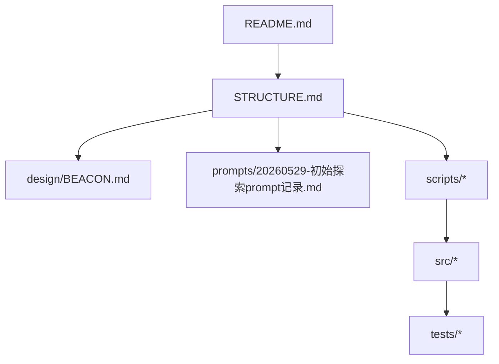
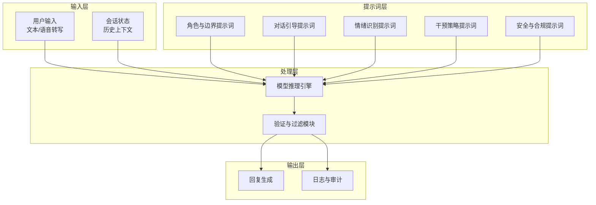
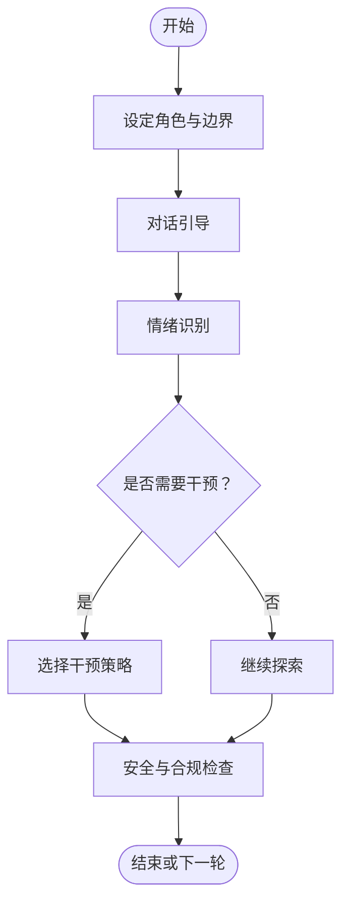
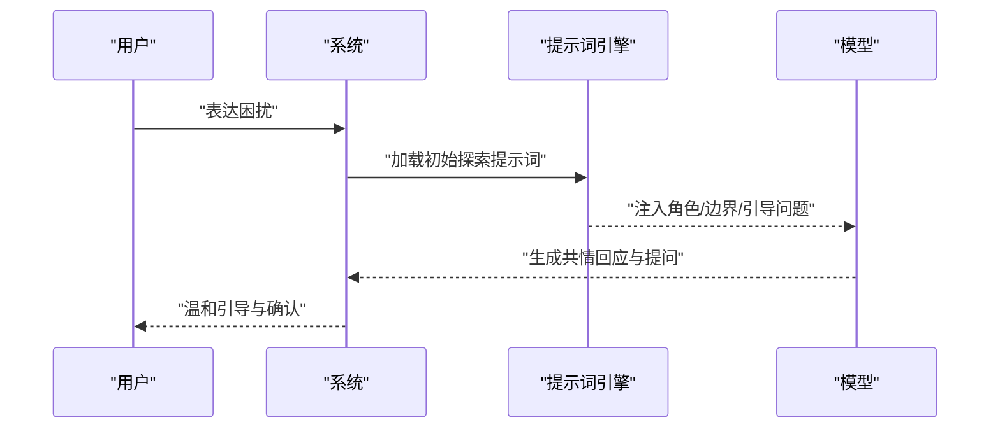
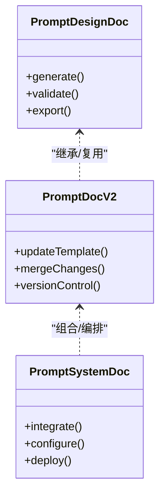
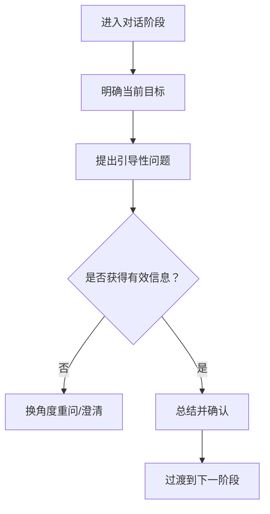
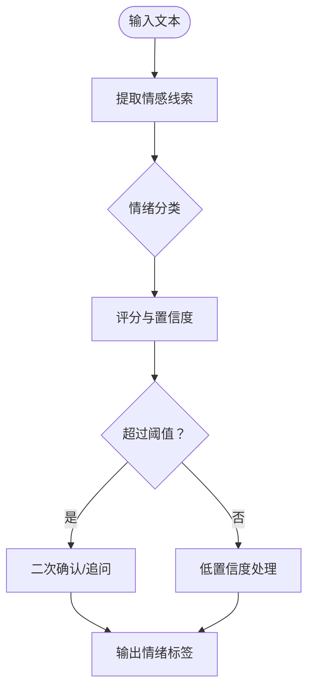
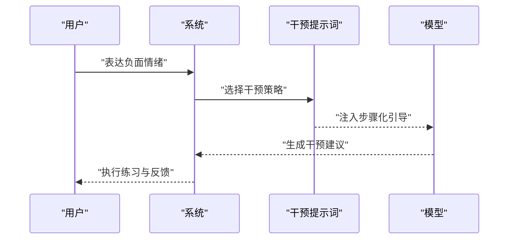
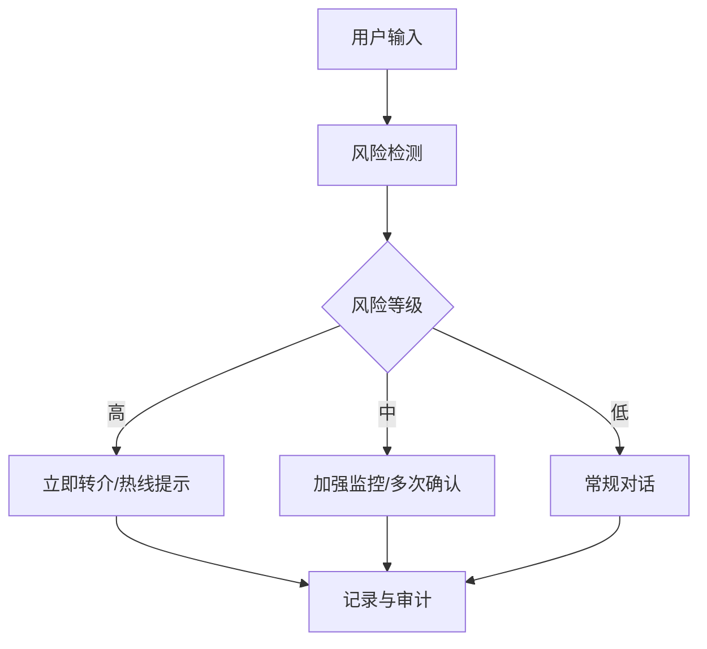
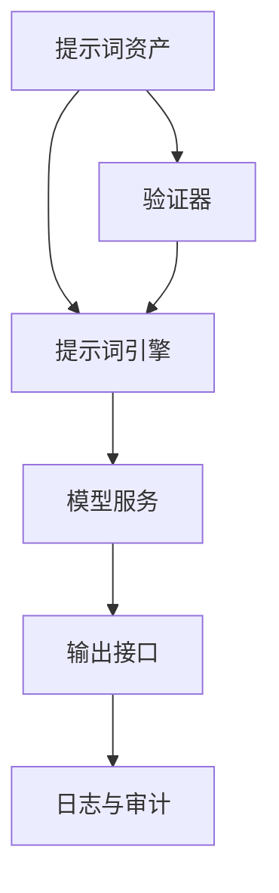

# 提示词设计原则

<cite>
**本文档引用的文件**   
- [README.md](file://README.md)
- [STRUCTURE.md](file://STRUCTURE.md)
- [BEACON.md](file://design/BEACON.md)
- [20260529-初始探索prompt记录.md](file://prompts/20260529-初始探索prompt记录.md)
- [create_prompt_design_doc.js](file://scripts/create_prompt_design_doc.js)
- [create_prompt_doc_v2.js](file://scripts/create_prompt_doc_v2.js)
- [create_prompt_system_doc.js](file://scripts/create_prompt_system_doc.js)
</cite>

## 目录
1. [简介](#简介)
2. [项目结构](#项目结构)
3. [核心组件](#核心组件)
4. [架构总览](#架构总览)
5. [详细组件分析](#详细组件分析)
6. [依赖分析](#依赖分析)
7. [性能考虑](#性能考虑)
8. [故障排查指南](#故障排查指南)
9. [结论](#结论)
10. [附录](#附录)

## 简介
本指导文档面向AI心理咨询系统的提示词设计与优化，聚焦以下目标：
- 建立提示词设计的核心原则与最佳实践
- 提供对话引导、情绪识别与干预策略的提示词设计方法
- 明确不同类型提示词的编写规范、结构化方法与优化技巧
- 结合真实场景案例，展示设计思路与实现效果
- 解释提示词与用户心理状态的匹配机制与个性化定制方法

本指南适用于产品经理、提示词工程师、心理咨询师与技术实现人员，帮助团队在安全、有效、可维护的前提下构建高质量的心理咨询对话系统。

## 项目结构
仓库围绕“设计—提示词—脚本—源码—测试”组织，关键目录与职责如下：
- design：系统设计与设计理念（如BEACON框架）
- prompts：提示词资产与版本化记录
- scripts：提示词体系生成与维护脚本
- src：业务逻辑与集成代码（不在本次范围）
- tests：端到端、集成与单元测试
- PRD：产品需求文档
- 根级说明：README与STRUCTURE用于整体导航

图表来源
- [README.md](file://README.md)
- [STRUCTURE.md](file://STRUCTURE.md)
- [BEACON.md](file://design/BEACON.md)
- [20260529-初始探索prompt记录.md](file://prompts/20260529-初始探索prompt记录.md)
- [create_prompt_design_doc.js](file://scripts/create_prompt_design_doc.js)
- [create_prompt_doc_v2.js](file://scripts/create_prompt_doc_v2.js)
- [create_prompt_system_doc.js](file://scripts/create_prompt_system_doc.js)

章节来源
- [README.md](file://README.md)
- [STRUCTURE.md](file://STRUCTURE.md)

## 核心组件
- 设计理念与框架：以BEACON为核心设计思想，定义咨询流程、角色边界与安全护栏
- 提示词资产库：按主题与阶段组织，包含初始探索、情绪识别、认知重构、危机干预等
- 提示词工程脚本：自动化生成、校验、版本化管理提示词文档与模板
- 运行与集成：将提示词注入到对话系统中，结合用户状态进行动态适配

章节来源
- [BEACON.md](file://design/BEACON.md)
- [20260529-初始探索prompt记录.md](file://prompts/20260529-初始探索prompt记录.md)
- [create_prompt_design_doc.js](file://scripts/create_prompt_design_doc.js)
- [create_prompt_doc_v2.js](file://scripts/create_prompt_doc_v2.js)
- [create_prompt_system_doc.js](file://scripts/create_prompt_system_doc.js)

## 架构总览
提示词系统在系统中的位置与交互关系如下：

图表来源
- [BEACON.md](file://design/BEACON.md)
- [20260529-初始探索prompt记录.md](file://prompts/20260529-初始探索prompt记录.md)
- [create_prompt_design_doc.js](file://scripts/create_prompt_design_doc.js)
- [create_prompt_doc_v2.js](file://scripts/create_prompt_doc_v2.js)
- [create_prompt_system_doc.js](file://scripts/create_prompt_system_doc.js)

## 详细组件分析

### 设计理念与框架（BEACON）
- 角色与边界：明确AI咨询师身份、能力边界、伦理约束与转介规则
- 对话引导：基于阶段性目标的结构化提问与反馈循环
- 情绪识别：通过语义线索与情感标签进行情绪分类与强度评估
- 干预策略：依据情绪与认知模式选择CBT、正念、问题解决等技术
- 安全与合规：危机识别、风险评估、紧急转介与隐私保护

图表来源
- [BEACON.md](file://design/BEACON.md)

章节来源
- [BEACON.md](file://design/BEACON.md)

### 提示词资产库（初始探索示例）
- 目标：建立信任、收集背景信息、明确求助动机
- 结构：开场问候—共情确认—开放式提问—总结复述—下一步引导
- 注意事项：避免诊断性语言、保持中立与尊重、关注用户节奏

图表来源
- [20260529-初始探索prompt记录.md](file://prompts/20260529-初始探索prompt记录.md)

章节来源
- [20260529-初始探索prompt记录.md](file://prompts/20260529-初始探索prompt记录.md)

### 提示词工程脚本（生成与维护）
- create_prompt_design_doc.js：从设计文档生成提示词设计指南
- create_prompt_doc_v2.js：迭代更新提示词文档结构与模板
- create_prompt_system_doc.js：系统化整合提示词与运行配置

图表来源
- [create_prompt_design_doc.js](file://scripts/create_prompt_design_doc.js)
- [create_prompt_doc_v2.js](file://scripts/create_prompt_doc_v2.js)
- [create_prompt_system_doc.js](file://scripts/create_prompt_system_doc.js)

章节来源
- [create_prompt_design_doc.js](file://scripts/create_prompt_design_doc.js)
- [create_prompt_doc_v2.js](file://scripts/create_prompt_doc_v2.js)
- [create_prompt_system_doc.js](file://scripts/create_prompt_system_doc.js)

### 对话引导提示词设计
- 目标：维持对话流畅、推进目标达成、避免偏离主题
- 方法：分阶段任务清单、开放式与封闭式问题交替、总结与确认
- 优化：减少歧义、限制长度、强调行动项

章节来源
- [BEACON.md](file://design/BEACON.md)
- [20260529-初始探索prompt记录.md](file://prompts/20260529-初始探索prompt记录.md)

### 情绪识别提示词设计
- 目标：准确识别情绪类型与强度，避免误判与过度推断
- 方法：关键词与语义模式匹配、情感标签体系、置信度阈值
- 优化：多轮交叉验证、上下文一致性检查、避免标签固化

章节来源
- [BEACON.md](file://design/BEACON.md)
- [20260529-初始探索prompt记录.md](file://prompts/20260529-初始探索prompt记录.md)

### 干预策略提示词设计
- 目标：根据情绪与认知模式选择合适的干预技术
- 方法：CBT、正念、问题解决、行为激活等策略映射
- 优化：步骤化引导、可量化目标、反馈闭环

章节来源
- [BEACON.md](file://design/BEACON.md)
- [20260529-初始探索prompt记录.md](file://prompts/20260529-初始探索prompt记录.md)

### 安全与合规提示词设计
- 目标：确保危机识别、风险评估与转介流程
- 方法：敏感词检测、风险等级划分、紧急联系人/热线提示
- 优化：最小化暴露、最大安全保障、合规审计留痕

章节来源
- [BEACON.md](file://design/BEACON.md)
- [20260529-初始探索prompt记录.md](file://prompts/20260529-初始探索prompt记录.md)

## 依赖分析
提示词系统与外部依赖的关系如下：

图表来源
- [create_prompt_design_doc.js](file://scripts/create_prompt_design_doc.js)
- [create_prompt_doc_v2.js](file://scripts/create_prompt_doc_v2.js)
- [create_prompt_system_doc.js](file://scripts/create_prompt_system_doc.js)

章节来源
- [create_prompt_design_doc.js](file://scripts/create_prompt_design_doc.js)
- [create_prompt_doc_v2.js](file://scripts/create_prompt_doc_v2.js)
- [create_prompt_system_doc.js](file://scripts/create_prompt_system_doc.js)

## 性能考虑
- 提示词长度控制：避免过长导致解析延迟与注意力分散
- 模块化拆分：将复杂提示词拆分为子模块，按需加载
- 缓存与复用：对常用模板与响应片段进行缓存
- 并发与限流：在高负载下合理分配资源，保证响应时效
- 监控与回滚：实时监测提示词效果，支持快速回滚与A/B测试

## 故障排查指南
- 症状：回复偏离主题或语气不当
  - 排查：检查角色与边界提示词是否清晰
  - 修复：强化约束条件与风格指引
- 症状：情绪识别不准确
  - 排查：检查情感标签体系与阈值设置
  - 修复：增加多轮确认与上下文一致性检查
- 症状：干预策略不匹配
  - 排查：检查策略映射规则与用户状态
  - 修复：细化分支逻辑与反馈闭环
- 症状：安全风险未触发
  - 排查：检查敏感词与风险等级规则
  - 修复：提升检测灵敏度与转介优先级

章节来源
- [BEACON.md](file://design/BEACON.md)
- [20260529-初始探索prompt记录.md](file://prompts/20260529-初始探索prompt记录.md)

## 结论
通过系统化的提示词设计原则、结构化方法与工程化脚本，AI心理咨询系统能够在安全、有效、可维护的前提下提供高质量的对话体验。持续优化提示词与用户心理状态的匹配机制，是实现个性化与精准干预的关键。

## 附录
- 术语表：提示词、情绪识别、干预策略、CBT、正念、转介
- 参考模板：初始探索、情绪识别、认知重构、危机干预
- 最佳实践清单：角色清晰、边界明确、结构有序、反馈闭环、安全优先
