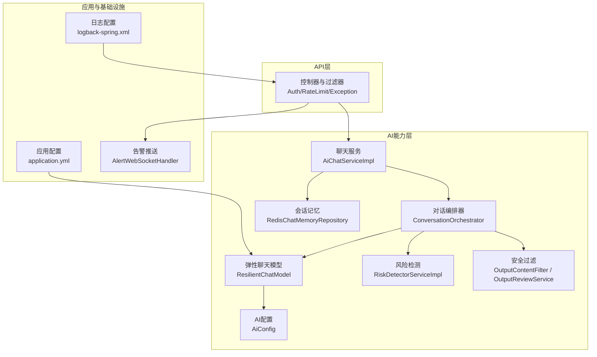
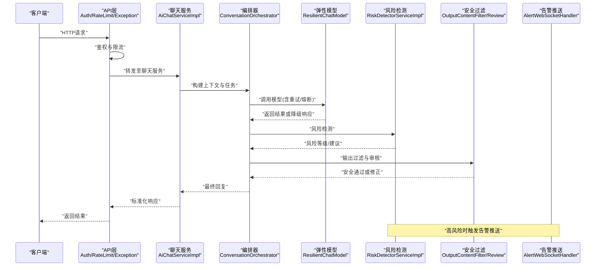
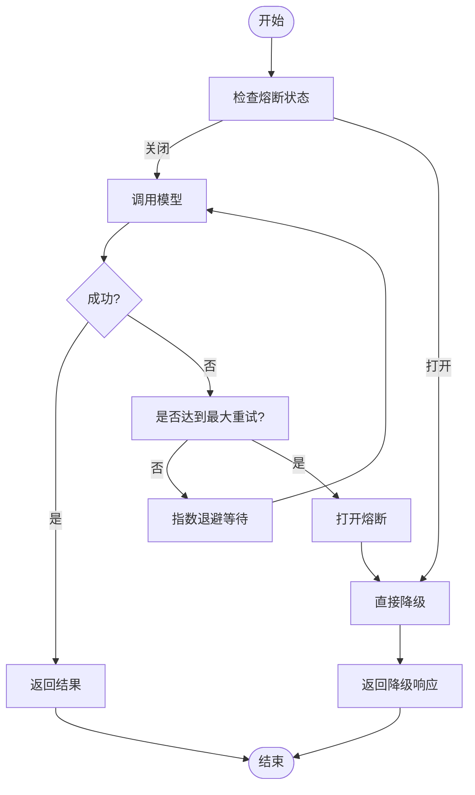
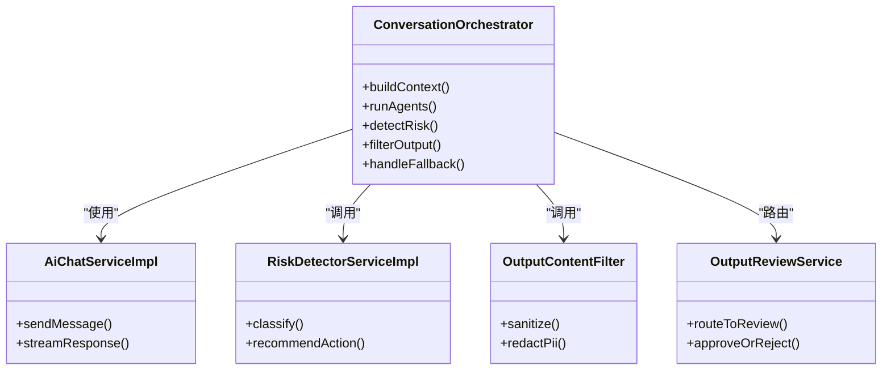
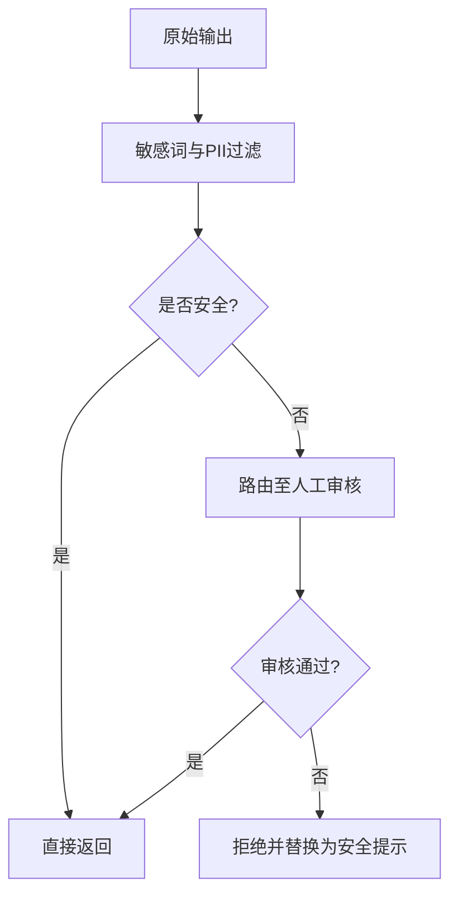
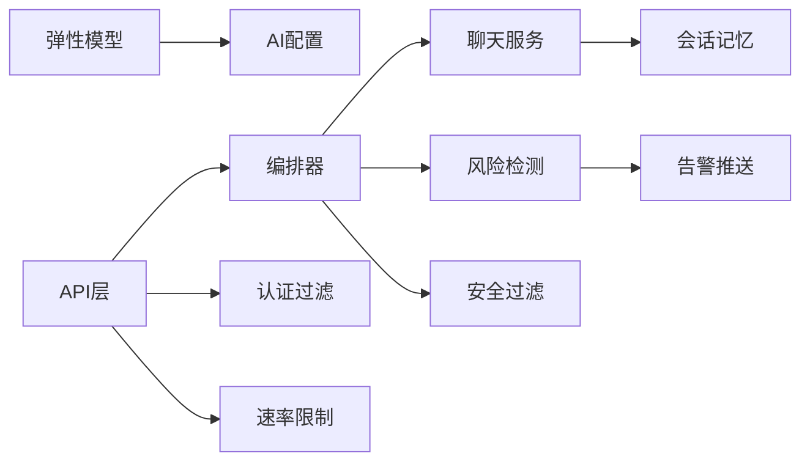

# AI模型降级与容错系统

<cite>
**本文档引用的文件**   
- [ResilientChatModel.java](file://backend/counseling-ai/src/main/java/com/mindsafe/ai/config/ResilientChatModel.java)
- [AiConfig.java](file://backend/counseling-ai/src/main/java/com/mindsafe/ai/config/AiConfig.java)
- [AiChatServiceImpl.java](file://backend/counseling-ai/src/main/java/com/mindsafe/ai/chat/AiChatServiceImpl.java)
- [ConversationOrchestrator.java](file://backend/counseling-ai/src/main/java/com/mindsafe/ai/orchestrator/ConversationOrchestrator.java)
- [RiskDetectorServiceImpl.java](file://backend/counseling-ai/src/main/java/com/mindsafe/ai/risk/RiskDetectorServiceImpl.java)
- [OutputContentFilter.java](file://backend/counseling-ai/src/main/java/com/mindsafe/ai/safety/OutputContentFilter.java)
- [OutputReviewService.java](file://backend/counseling-ai/src/main/java/com/mindsafe/ai/safety/OutputReviewService.java)
- [RedisChatMemoryRepository.java](file://backend/counseling-ai/src/main/java/com/mindsafe/ai/memory/RedisChatMemoryRepository.java)
- [GlobalExceptionHandler.java](file://backend/counseling-api/src/main/java/com/mindsafe/api/config/GlobalExceptionHandler.java)
- [RateLimitInterceptor.java](file://backend/counseling-api/src/main/java/com/mindsafe/api/ratelimit/RateLimitInterceptor.java)
- [JwtAuthenticationFilter.java](file://backend/counseling-api/src/main/java/com/mindsafe/api/security/JwtAuthenticationFilter.java)
- [AlertWebSocketHandler.java](file://backend/counseling-api/src/main/java/com/mindsafe/api/websocket/AlertWebSocketHandler.java)
- [Application.yml](file://backend/counseling-app/src/main/resources/application.yml)
- [logback-spring.xml](file://backend/counseling-app/src/main/resources/logback-spring.xml)
</cite>

## 目录
1. [简介](#简介)
2. [项目结构](#项目结构)
3. [核心组件](#核心组件)
4. [架构总览](#架构总览)
5. [详细组件分析](#详细组件分析)
6. [依赖关系分析](#依赖关系分析)
7. [性能考量](#性能考量)
8. [故障排查指南](#故障排查指南)
9. [结论](#结论)
10. [附录](#附录)

## 简介
本文件聚焦于“AI模型降级与容错系统”的设计与实现，围绕大模型调用失败、超时、限流、安全合规等异常场景，提供多层次的降级策略与恢复机制。通过可插拔的聊天模型包装器、统一异常处理、速率限制、安全过滤与审计日志，系统在保障用户体验的同时，确保服务可用性与安全性。

## 项目结构
后端采用分层模块化设计：API层暴露接口并负责鉴权、限流与全局异常；AI能力集中在counseling-ai模块，包含聊天服务、编排器、风险检测、安全过滤、记忆存储等；应用配置与日志在counseling-app中集中管理。

图表来源
- [AiChatServiceImpl.java](file://backend/counseling-ai/src/main/java/com/mindsafe/ai/chat/AiChatServiceImpl.java)
- [ConversationOrchestrator.java](file://backend/counseling-ai/src/main/java/com/mindsafe/ai/orchestrator/ConversationOrchestrator.java)
- [ResilientChatModel.java](file://backend/counseling-ai/src/main/java/com/mindsafe/ai/config/ResilientChatModel.java)
- [AiConfig.java](file://backend/counseling-ai/src/main/java/com/mindsafe/ai/config/AiConfig.java)
- [RiskDetectorServiceImpl.java](file://backend/counseling-ai/src/main/java/com/mindsafe/ai/risk/RiskDetectorServiceImpl.java)
- [OutputContentFilter.java](file://backend/counseling-ai/src/main/java/com/mindsafe/ai/safety/OutputContentFilter.java)
- [OutputReviewService.java](file://backend/counseling-ai/src/main/java/com/mindsafe/ai/safety/OutputReviewService.java)
- [RedisChatMemoryRepository.java](file://backend/counseling-ai/src/main/java/com/mindsafe/ai/memory/RedisChatMemoryRepository.java)
- [GlobalExceptionHandler.java](file://backend/counseling-api/src/main/java/com/mindsafe/api/config/GlobalExceptionHandler.java)
- [RateLimitInterceptor.java](file://backend/counseling-api/src/main/java/com/mindsafe/api/ratelimit/RateLimitInterceptor.java)
- [JwtAuthenticationFilter.java](file://backend/counseling-api/src/main/java/com/mindsafe/api/security/JwtAuthenticationFilter.java)
- [AlertWebSocketHandler.java](file://backend/counseling-api/src/main/java/com/mindsafe/api/websocket/AlertWebSocketHandler.java)
- [Application.yml](file://backend/counseling-app/src/main/resources/application.yml)
- [logback-spring.xml](file://backend/counseling-app/src/main/resources/logback-spring.xml)

章节来源
- [Application.yml](file://backend/counseling-app/src/main/resources/application.yml)
- [logback-spring.xml](file://backend/counseling-app/src/main/resources/logback-spring.xml)

## 核心组件
- 弹性聊天模型（ResilientChatModel）：封装底层LLM调用，提供重试、熔断、降级与回退策略，支持按错误类型选择不同降级路径。
- AI配置（AiConfig）：集中管理模型端点、超时、重试次数、熔断阈值、降级开关等参数。
- 聊天服务（AiChatServiceImpl）：对外提供聊天能力，串联上下文、记忆与安全过滤。
- 对话编排器（ConversationOrchestrator）：协调Agent、风险检测、安全审查与输出过滤，保证流程健壮性。
- 风险检测（RiskDetectorServiceImpl）：识别高风险内容并触发告警或阻断。
- 安全过滤（OutputContentFilter / OutputReviewService）：对输出进行敏感词过滤、PII脱敏与人工复核路由。
- 会话记忆（RedisChatMemoryRepository）：基于Redis的会话状态持久化，支撑跨请求上下文与快速恢复。
- 全局异常处理（GlobalExceptionHandler）：统一捕获并转换异常为标准化响应，避免泄露内部细节。
- 速率限制（RateLimitInterceptor）：防止突发流量导致下游模型过载。
- 认证过滤（JwtAuthenticationFilter）：确保请求合法性，减少非法调用带来的资源浪费。
- 告警推送（AlertWebSocketHandler）：将高风险事件实时推送给管理员或相关角色。

章节来源
- [ResilientChatModel.java](file://backend/counseling-ai/src/main/java/com/mindsafe/ai/config/ResilientChatModel.java)
- [AiConfig.java](file://backend/counseling-ai/src/main/java/com/mindsafe/ai/config/AiConfig.java)
- [AiChatServiceImpl.java](file://backend/counseling-ai/src/main/java/com/mindsafe/ai/chat/AiChatServiceImpl.java)
- [ConversationOrchestrator.java](file://backend/counseling-ai/src/main/java/com/mindsafe/ai/orchestrator/ConversationOrchestrator.java)
- [RiskDetectorServiceImpl.java](file://backend/counseling-ai/src/main/java/com/mindsafe/ai/risk/RiskDetectorServiceImpl.java)
- [OutputContentFilter.java](file://backend/counseling-ai/src/main/java/com/mindsafe/ai/safety/OutputContentFilter.java)
- [OutputReviewService.java](file://backend/counseling-ai/src/main/java/com/mindsafe/ai/safety/OutputReviewService.java)
- [RedisChatMemoryRepository.java](file://backend/counseling-ai/src/main/java/com/mindsafe/ai/memory/RedisChatMemoryRepository.java)
- [GlobalExceptionHandler.java](file://backend/counseling-api/src/main/java/com/mindsafe/api/config/GlobalExceptionHandler.java)
- [RateLimitInterceptor.java](file://backend/counseling-api/src/main/java/com/mindsafe/api/ratelimit/RateLimitInterceptor.java)
- [JwtAuthenticationFilter.java](file://backend/counseling-api/src/main/java/com/mindsafe/api/security/JwtAuthenticationFilter.java)
- [AlertWebSocketHandler.java](file://backend/counseling-api/src/main/java/com/mindsafe/api/websocket/AlertWebSocketHandler.java)

## 架构总览
下图展示从请求进入API层到AI能力层的关键路径，以及降级与容错的介入点。

图表来源
- [AiChatServiceImpl.java](file://backend/counseling-ai/src/main/java/com/mindsafe/ai/chat/AiChatServiceImpl.java)
- [ConversationOrchestrator.java](file://backend/counseling-ai/src/main/java/com/mindsafe/ai/orchestrator/ConversationOrchestrator.java)
- [ResilientChatModel.java](file://backend/counseling-ai/src/main/java/com/mindsafe/ai/config/ResilientChatModel.java)
- [RiskDetectorServiceImpl.java](file://backend/counseling-ai/src/main/java/com/mindsafe/ai/risk/RiskDetectorServiceImpl.java)
- [OutputContentFilter.java](file://backend/counseling-ai/src/main/java/com/mindsafe/ai/safety/OutputContentFilter.java)
- [OutputReviewService.java](file://backend/counseling-ai/src/main/java/com/mindsafe/ai/safety/OutputReviewService.java)
- [AlertWebSocketHandler.java](file://backend/counseling-api/src/main/java/com/mindsafe/api/websocket/AlertWebSocketHandler.java)
- [GlobalExceptionHandler.java](file://backend/counseling-api/src/main/java/com/mindsafe/api/config/GlobalExceptionHandler.java)
- [RateLimitInterceptor.java](file://backend/counseling-api/src/main/java/com/mindsafe/api/ratelimit/RateLimitInterceptor.java)
- [JwtAuthenticationFilter.java](file://backend/counseling-api/src/main/java/com/mindsafe/api/security/JwtAuthenticationFilter.java)

## 详细组件分析

### 弹性聊天模型（ResilientChatModel）
- 功能要点
  - 重试策略：针对瞬时错误（网络抖动、临时不可用）进行指数退避重试。
  - 熔断机制：当连续失败超过阈值，快速失败以避免雪崩。
  - 降级路径：根据错误类型选择本地模板、缓存历史或友好提示作为回退。
  - 指标采集：记录调用成功率、延迟、熔断状态，便于监控与调优。
- 数据流与复杂度
  - 时间复杂度：单次调用O(1)，重试k次则O(k)。
  - 空间复杂度：缓存降级响应O(n)，n为最近N条消息。
- 优化建议
  - 动态调整熔断阈值与重试次数，结合业务QPS与SLA。
  - 引入半开状态探测，逐步恢复流量。

图表来源
- [ResilientChatModel.java](file://backend/counseling-ai/src/main/java/com/mindsafe/ai/config/ResilientChatModel.java)

章节来源
- [ResilientChatModel.java](file://backend/counseling-ai/src/main/java/com/mindsafe/ai/config/ResilientChatModel.java)
- [AiConfig.java](file://backend/counseling-ai/src/main/java/com/mindsafe/ai/config/AiConfig.java)

### 对话编排器（ConversationOrchestrator）
- 职责
  - 组装上下文、调用Agent、执行风险检测、安全过滤与输出审核。
  - 在任一环节失败时，触发降级或回退策略，保证整体可用性。
- 关键流程
  - 输入校验与上下文构建。
  - Agent推理与结果整合。
  - 风险分级与处置（阻断、警告、继续）。
  - 输出过滤与必要的人工审核路由。
- 容错设计
  - 各子步骤具备独立异常捕获与降级逻辑。
  - 使用会话记忆快速恢复上下文，避免重复计算。

图表来源
- [ConversationOrchestrator.java](file://backend/counseling-ai/src/main/java/com/mindsafe/ai/orchestrator/ConversationOrchestrator.java)
- [AiChatServiceImpl.java](file://backend/counseling-ai/src/main/java/com/mindsafe/ai/chat/AiChatServiceImpl.java)
- [RiskDetectorServiceImpl.java](file://backend/counseling-ai/src/main/java/com/mindsafe/ai/risk/RiskDetectorServiceImpl.java)
- [OutputContentFilter.java](file://backend/counseling-ai/src/main/java/com/mindsafe/ai/safety/OutputContentFilter.java)
- [OutputReviewService.java](file://backend/counseling-ai/src/main/java/com/mindsafe/ai/safety/OutputReviewService.java)

章节来源
- [ConversationOrchestrator.java](file://backend/counseling-ai/src/main/java/com/mindsafe/ai/orchestrator/ConversationOrchestrator.java)
- [AiChatServiceImpl.java](file://backend/counseling-ai/src/main/java/com/mindsafe/ai/chat/AiChatServiceImpl.java)
- [RiskDetectorServiceImpl.java](file://backend/counseling-ai/src/main/java/com/mindsafe/ai/risk/RiskDetectorServiceImpl.java)
- [OutputContentFilter.java](file://backend/counseling-ai/src/main/java/com/mindsafe/ai/safety/OutputContentFilter.java)
- [OutputReviewService.java](file://backend/counseling-ai/src/main/java/com/mindsafe/ai/safety/OutputReviewService.java)

### 安全过滤与审核（OutputContentFilter / OutputReviewService）
- 功能要点
  - 敏感词过滤、PII脱敏、违规内容拦截。
  - 高风险输出自动路由至人工审核队列。
- 容错设计
  - 过滤规则更新热加载，避免重启影响。
  - 审核队列具备幂等与重试机制，防止丢失。

图表来源
- [OutputContentFilter.java](file://backend/counseling-ai/src/main/java/com/mindsafe/ai/safety/OutputContentFilter.java)
- [OutputReviewService.java](file://backend/counseling-ai/src/main/java/com/mindsafe/ai/safety/OutputReviewService.java)

章节来源
- [OutputContentFilter.java](file://backend/counseling-ai/src/main/java/com/mindsafe/ai/safety/OutputContentFilter.java)
- [OutputReviewService.java](file://backend/counseling-ai/src/main/java/com/mindsafe/ai/safety/OutputReviewService.java)

### 会话记忆（RedisChatMemoryRepository）
- 作用
  - 持久化会话上下文，支持快速恢复与跨节点共享。
  - 在模型不可用时，提供历史摘要与模板回复。
- 容错设计
  - Redis连接失败时回退到内存缓存或禁用记忆模式。
  - 读写操作具备超时与重试保护。

章节来源
- [RedisChatMemoryRepository.java](file://backend/counseling-ai/src/main/java/com/mindsafe/ai/memory/RedisChatMemoryRepository.java)

### API层容错（GlobalExceptionHandler / RateLimitInterceptor / JwtAuthenticationFilter）
- 全局异常处理
  - 统一捕获运行时异常、业务异常与第三方调用异常，转换为标准响应码与消息。
- 速率限制
  - 基于令牌桶或滑动窗口限制请求频率，保护下游模型与服务。
- 认证过滤
  - 校验JWT有效性，拒绝非法请求，降低无效负载。

章节来源
- [GlobalExceptionHandler.java](file://backend/counseling-api/src/main/java/com/mindsafe/api/config/GlobalExceptionHandler.java)
- [RateLimitInterceptor.java](file://backend/counseling-api/src/main/java/com/mindsafe/api/ratelimit/RateLimitInterceptor.java)
- [JwtAuthenticationFilter.java](file://backend/counseling-api/src/main/java/com/mindsafe/api/security/JwtAuthenticationFilter.java)

### 告警推送（AlertWebSocketHandler）
- 作用
  - 将高风险事件实时推送给管理员或相关人员，支持重连与断线恢复。
- 容错设计
  - 心跳检测与自动重连，消息持久化与去重。

章节来源
- [AlertWebSocketHandler.java](file://backend/counseling-api/src/main/java/com/mindsafe/api/websocket/AlertWebSocketHandler.java)

## 依赖关系分析
- 组件耦合
  - 编排器依赖聊天服务、风险检测、安全过滤与记忆存储，形成高内聚的业务流程。
  - 弹性模型依赖配置中心，解耦具体LLM实现。
- 外部依赖
  - Redis用于会话记忆与限流计数。
  - WebSocket用于实时告警。
- 潜在循环依赖
  - 通过接口抽象与事件驱动避免循环引用。

图表来源
- [ConversationOrchestrator.java](file://backend/counseling-ai/src/main/java/com/mindsafe/ai/orchestrator/ConversationOrchestrator.java)
- [AiChatServiceImpl.java](file://backend/counseling-ai/src/main/java/com/mindsafe/ai/chat/AiChatServiceImpl.java)
- [ResilientChatModel.java](file://backend/counseling-ai/src/main/java/com/mindsafe/ai/config/ResilientChatModel.java)
- [AiConfig.java](file://backend/counseling-ai/src/main/java/com/mindsafe/ai/config/AiConfig.java)
- [RiskDetectorServiceImpl.java](file://backend/counseling-ai/src/main/java/com/mindsafe/ai/risk/RiskDetectorServiceImpl.java)
- [OutputContentFilter.java](file://backend/counseling-ai/src/main/java/com/mindsafe/ai/safety/OutputContentFilter.java)
- [OutputReviewService.java](file://backend/counseling-ai/src/main/java/com/mindsafe/ai/safety/OutputReviewService.java)
- [RedisChatMemoryRepository.java](file://backend/counseling-ai/src/main/java/com/mindsafe/ai/memory/RedisChatMemoryRepository.java)
- [GlobalExceptionHandler.java](file://backend/counseling-api/src/main/java/com/mindsafe/api/config/GlobalExceptionHandler.java)
- [RateLimitInterceptor.java](file://backend/counseling-api/src/main/java/com/mindsafe/api/ratelimit/RateLimitInterceptor.java)
- [JwtAuthenticationFilter.java](file://backend/counseling-api/src/main/java/com/mindsafe/api/security/JwtAuthenticationFilter.java)
- [AlertWebSocketHandler.java](file://backend/counseling-api/src/main/java/com/mindsafe/api/websocket/AlertWebSocketHandler.java)

章节来源
- [ConversationOrchestrator.java](file://backend/counseling-ai/src/main/java/com/mindsafe/ai/orchestrator/ConversationOrchestrator.java)
- [AiChatServiceImpl.java](file://backend/counseling-ai/src/main/java/com/mindsafe/ai/chat/AiChatServiceImpl.java)
- [ResilientChatModel.java](file://backend/counseling-ai/src/main/java/com/mindsafe/ai/config/ResilientChatModel.java)
- [AiConfig.java](file://backend/counseling-ai/src/main/java/com/mindsafe/ai/config/AiConfig.java)
- [RiskDetectorServiceImpl.java](file://backend/counseling-ai/src/main/java/com/mindsafe/ai/risk/RiskDetectorServiceImpl.java)
- [OutputContentFilter.java](file://backend/counseling-ai/src/main/java/com/mindsafe/ai/safety/OutputContentFilter.java)
- [OutputReviewService.java](file://backend/counseling-ai/src/main/java/com/mindsafe/ai/safety/OutputReviewService.java)
- [RedisChatMemoryRepository.java](file://backend/counseling-ai/src/main/java/com/mindsafe/ai/memory/RedisChatMemoryRepository.java)
- [GlobalExceptionHandler.java](file://backend/counseling-api/src/main/java/com/mindsafe/api/config/GlobalExceptionHandler.java)
- [RateLimitInterceptor.java](file://backend/counseling-api/src/main/java/com/mindsafe/api/ratelimit/RateLimitInterceptor.java)
- [JwtAuthenticationFilter.java](file://backend/counseling-api/src/main/java/com/mindsafe/api/security/JwtAuthenticationFilter.java)
- [AlertWebSocketHandler.java](file://backend/counseling-api/src/main/java/com/mindsafe/api/websocket/AlertWebSocketHandler.java)

## 性能考量
- 重试与熔断
  - 合理设置重试次数与退避策略，避免放大下游压力。
  - 熔断阈值依据错误率与延迟分位数动态调整。
- 限流与背压
  - 在API层实施细粒度限流，保护模型与数据库。
  - 对长耗时任务采用异步与批处理。
- 缓存与记忆
  - 利用Redis缓存热点上下文与模板回复，降低模型调用成本。
- 监控与观测
  - 采集关键指标（成功率、延迟、熔断状态、限流命中），配合告警与看板。

## 故障排查指南
- 常见问题定位
  - 模型调用失败：查看弹性模型的熔断状态与重试日志，确认网络与配额。
  - 安全风险拦截：检查安全过滤规则与审核队列，确认是否误判。
  - 会话丢失：验证Redis连通性与键过期策略。
  - 请求被限流：检查限流计数器与阈值配置。
- 日志与追踪
  - 使用统一日志格式与链路ID，便于跨组件追踪。
  - 关键路径打印入参、出参与异常堆栈（脱敏后）。
- 恢复策略
  - 临时关闭非关键功能（如记忆、审核）以恢复主流程。
  - 切换备用模型或降级模板，优先保障可用性。

章节来源
- [GlobalExceptionHandler.java](file://backend/counseling-api/src/main/java/com/mindsafe/api/config/GlobalExceptionHandler.java)
- [logback-spring.xml](file://backend/counseling-app/src/main/resources/logback-spring.xml)
- [ResilientChatModel.java](file://backend/counseling-ai/src/main/java/com/mindsafe/ai/config/ResilientChatModel.java)
- [OutputContentFilter.java](file://backend/counseling-ai/src/main/java/com/mindsafe/ai/safety/OutputContentFilter.java)
- [OutputReviewService.java](file://backend/counseling-ai/src/main/java/com/mindsafe/ai/safety/OutputReviewService.java)
- [RedisChatMemoryRepository.java](file://backend/counseling-ai/src/main/java/com/mindsafe/ai/memory/RedisChatMemoryRepository.java)
- [RateLimitInterceptor.java](file://backend/counseling-api/src/main/java/com/mindsafe/api/ratelimit/RateLimitInterceptor.java)

## 结论
本系统通过弹性模型包装、统一异常处理、速率限制、安全过滤与会话记忆等多层次机制，构建了稳健的AI模型降级与容错体系。建议在运行期持续采集指标并动态调优参数，结合灰度发布与演练，进一步提升系统的韧性与用户体验。

## 附录
- 配置项建议
  - 模型超时、重试次数、熔断阈值、降级开关、限流阈值、Redis超时与重试。
- 最佳实践
  - 最小权限原则与数据脱敏。
  - 关键路径单元测试与集成测试覆盖。
  - 定期演练故障注入与恢复流程。
