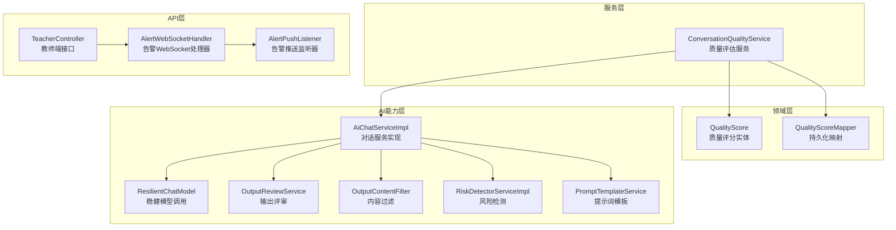
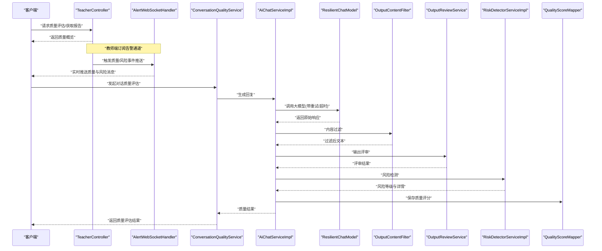
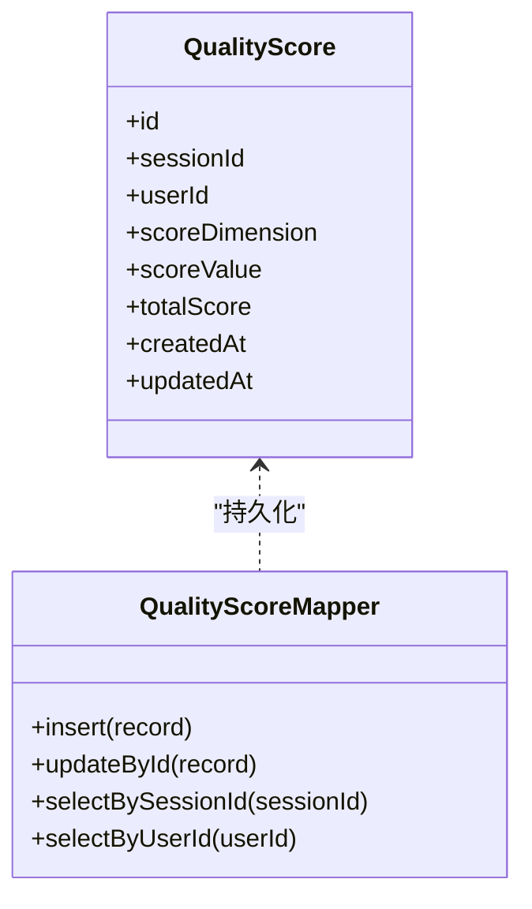
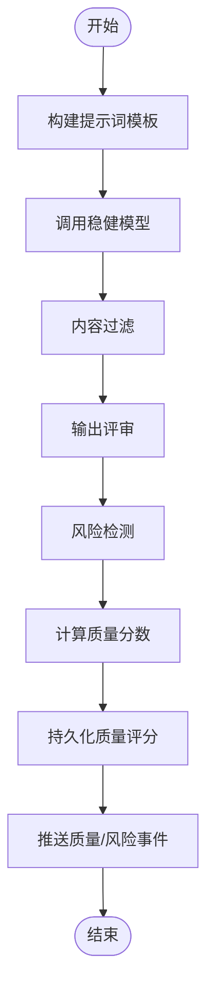
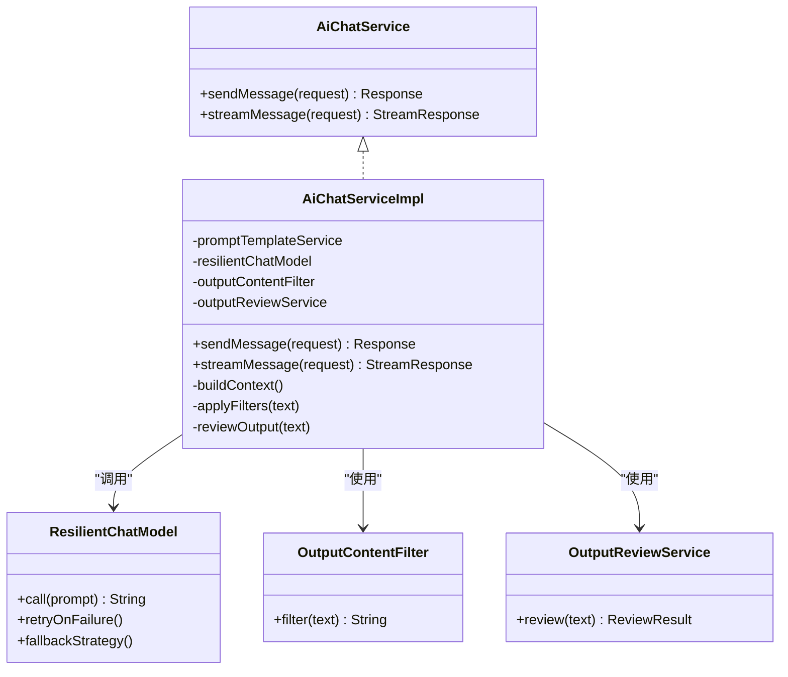
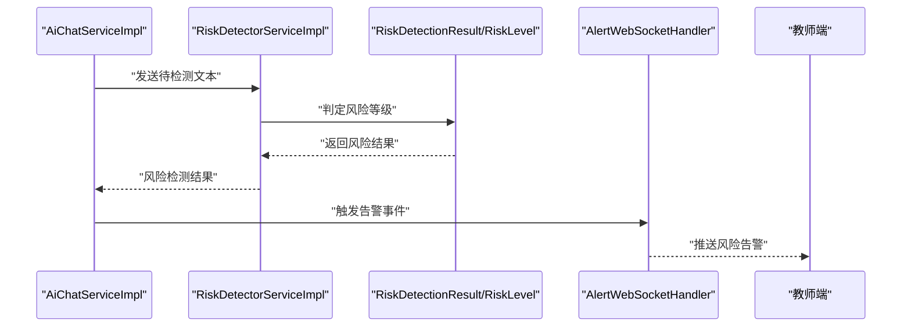
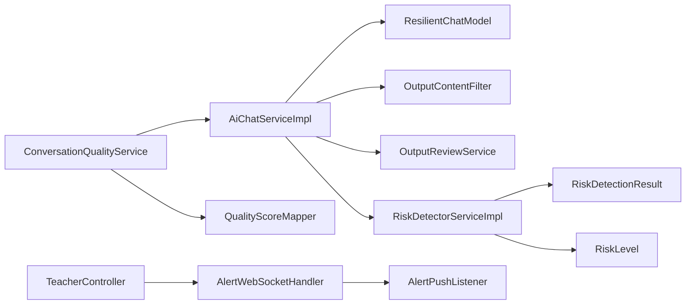

# AI质量评估框架

<cite>
**本文引用的文件**   
- [QualityScore.java](file://backend/counseling-domain/src/main/java/com/mindsafe/domain/entity/QualityScore.java)
- [QualityScoreMapper.java](file://backend/counseling-domain/src/main/java/com/mindsafe/domain/mapper/QualityScoreMapper.java)
- [V19__quality_scores.sql](file://backend/counseling-app/src/main/resources/db/migration/V19__quality_scores.sql)
- [ConversationQualityService.java](file://backend/counseling-service/src/main/java/com/mindsafe/service/quality/ConversationQualityService.java)
- [AiChatServiceImpl.java](file://backend/counseling-ai/src/main/java/com/mindsafe/ai/chat/AiChatServiceImpl.java)
- [AiChatService.java](file://backend/counseling-ai/src/main/java/com/mindsafe/ai/chat/AiChatService.java)
- [ResilientChatModel.java](file://backend/counseling-ai/src/main/java/com/mindsafe/ai/config/ResilientChatModel.java)
- [OutputReviewService.java](file://backend/counseling-ai/src/main/java/com/mindsafe/ai/safety/OutputReviewService.java)
- [OutputContentFilter.java](file://backend/counseling-ai/src/main/java/com/mindsafe/ai/safety/OutputContentFilter.java)
- [RiskDetectorServiceImpl.java](file://backend/counseling-ai/src/main/java/com/mindsafe/ai/risk/RiskDetectorServiceImpl.java)
- [RiskDetectionResult.java](file://backend/counseling-common/src/main/java/com/mindsafe/common/dto/risk/RiskDetectionResult.java)
- [RiskLevel.java](file://backend/counseling-common/src/main/java/com/mindsafe/common/enums/RiskLevel.java)
- [AlertWebSocketHandler.java](file://backend/counseling-api/src/main/java/com/mindsafe/api/websocket/AlertWebSocketHandler.java)
- [AlertPushListener.java](file://backend/counseling-api/src/main/java/com/mindsafe/api/websocket/AlertPushListener.java)
- [TeacherController.java](file://backend/counseling-api/src/main/java/com/mindsafe/api/controller/TeacherController.java)
- [PromptTemplateService.java](file://backend/counseling-ai/src/main/java/com/mindsafe/ai/prompt/PromptTemplateService.java)
</cite>

## 目录
1. [引言](#引言)
2. [项目结构](#项目结构)
3. [核心组件](#核心组件)
4. [架构总览](#架构总览)
5. [详细组件分析](#详细组件分析)
6. [依赖关系分析](#依赖关系分析)
7. [性能考量](#性能考量)
8. [故障排查指南](#故障排查指南)
9. [结论](#结论)
10. [附录](#附录)

## 引言
本文件聚焦“AI质量评估框架”，围绕心理咨询对话的质量度量、风险识别与输出安全审查，形成从数据模型、服务层到前端展示与告警推送的闭环。该框架通过统一的质量评分实体、可插拔的提示词模板、稳健的模型调用封装以及实时告警通道，保障对话质量的可观测、可度量与可控。

## 项目结构
质量评估相关代码分布在领域模型、服务实现、AI能力模块与API网关层：
- 领域层：定义质量评分实体与持久化映射
- 服务层：提供质量评估编排与聚合能力
- AI层：负责对话生成、内容过滤、输出评审与风险检测
- API层：暴露接口并推送实时告警给教师端

图表来源
- [QualityScore.java](file://backend/counseling-domain/src/main/java/com/mindsafe/domain/entity/QualityScore.java)
- [QualityScoreMapper.java](file://backend/counseling-domain/src/main/java/com/mindsafe/domain/mapper/QualityScoreMapper.java)
- [ConversationQualityService.java](file://backend/counseling-service/src/main/java/com/mindsafe/service/quality/ConversationQualityService.java)
- [AiChatServiceImpl.java](file://backend/counseling-ai/src/main/java/com/mindsafe/ai/chat/AiChatServiceImpl.java)
- [ResilientChatModel.java](file://backend/counseling-ai/src/main/java/com/mindsafe/ai/config/ResilientChatModel.java)
- [OutputReviewService.java](file://backend/counseling-ai/src/main/java/com/mindsafe/ai/safety/OutputReviewService.java)
- [OutputContentFilter.java](file://backend/counseling-ai/src/main/java/com/mindsafe/ai/safety/OutputContentFilter.java)
- [RiskDetectorServiceImpl.java](file://backend/counseling-ai/src/main/java/com/mindsafe/ai/risk/RiskDetectorServiceImpl.java)
- [PromptTemplateService.java](file://backend/counseling-ai/src/main/java/com/mindsafe/ai/prompt/PromptTemplateService.java)
- [TeacherController.java](file://backend/counseling-api/src/main/java/com/mindsafe/api/controller/TeacherController.java)
- [AlertWebSocketHandler.java](file://backend/counseling-api/src/main/java/com/mindsafe/api/websocket/AlertWebSocketHandler.java)
- [AlertPushListener.java](file://backend/counseling-api/src/main/java/com/mindsafe/api/websocket/AlertPushListener.java)

章节来源
- [V19__quality_scores.sql](file://backend/counseling-app/src/main/resources/db/migration/V19__quality_scores.sql)

## 核心组件
- 质量评分实体与持久化：用于记录会话维度的质量指标，支撑统计与回溯
- 质量评估服务：编排对话生成、内容过滤、输出评审与风险检测，最终产出质量分数
- 稳健模型调用：对底层大模型调用进行重试、超时与降级处理，提升稳定性
- 输出评审与内容过滤：基于规则与模板对输出进行安全与合规校验
- 风险检测：识别高风险内容并联动告警通道
- 教师端接口与WebSocket：向教师端推送质量与风险事件，支持实时监控

章节来源
- [QualityScore.java](file://backend/counseling-domain/src/main/java/com/mindsafe/domain/entity/QualityScore.java)
- [QualityScoreMapper.java](file://backend/counseling-domain/src/main/java/com/mindsafe/domain/mapper/QualityScoreMapper.java)
- [ConversationQualityService.java](file://backend/counseling-service/src/main/java/com/mindsafe/service/quality/ConversationQualityService.java)
- [AiChatServiceImpl.java](file://backend/counseling-ai/src/main/java/com/mindsafe/ai/chat/AiChatServiceImpl.java)
- [ResilientChatModel.java](file://backend/counseling-ai/src/main/java/com/mindsafe/ai/config/ResilientChatModel.java)
- [OutputReviewService.java](file://backend/counseling-ai/src/main/java/com/mindsafe/ai/safety/OutputReviewService.java)
- [OutputContentFilter.java](file://backend/counseling-ai/src/main/java/com/mindsafe/ai/safety/OutputContentFilter.java)
- [RiskDetectorServiceImpl.java](file://backend/counseling-ai/src/main/java/com/mindsafe/ai/risk/RiskDetectorServiceImpl.java)
- [RiskDetectionResult.java](file://backend/counseling-common/src/main/java/com/mindsafe/common/dto/risk/RiskDetectionResult.java)
- [RiskLevel.java](file://backend/counseling-common/src/main/java/com/mindsafe/common/enums/RiskLevel.java)
- [AlertWebSocketHandler.java](file://backend/counseling-api/src/main/java/com/mindsafe/api/websocket/AlertWebSocketHandler.java)
- [AlertPushListener.java](file://backend/counseling-api/src/main/java/com/mindsafe/api/websocket/AlertPushListener.java)
- [TeacherController.java](file://backend/counseling-api/src/main/java/com/mindsafe/api/controller/TeacherController.java)

## 架构总览
质量评估流程以对话服务为核心，串联提示词模板、内容过滤、输出评审与风险检测，最终将质量结果持久化并通过WebSocket推送至教师端。

图表来源
- [AiChatServiceImpl.java](file://backend/counseling-ai/src/main/java/com/mindsafe/ai/chat/AiChatServiceImpl.java)
- [ResilientChatModel.java](file://backend/counseling-ai/src/main/java/com/mindsafe/ai/config/ResilientChatModel.java)
- [OutputContentFilter.java](file://backend/counseling-ai/src/main/java/com/mindsafe/ai/safety/OutputContentFilter.java)
- [OutputReviewService.java](file://backend/counseling-ai/src/main/java/com/mindsafe/ai/safety/OutputReviewService.java)
- [RiskDetectorServiceImpl.java](file://backend/counseling-ai/src/main/java/com/mindsafe/ai/risk/RiskDetectorServiceImpl.java)
- [QualityScoreMapper.java](file://backend/counseling-domain/src/main/java/com/mindsafe/domain/mapper/QualityScoreMapper.java)
- [TeacherController.java](file://backend/counseling-api/src/main/java/com/mindsafe/api/controller/TeacherController.java)
- [AlertWebSocketHandler.java](file://backend/counseling-api/src/main/java/com/mindsafe/api/websocket/AlertWebSocketHandler.java)

## 详细组件分析

### 质量评分实体与持久化
- 实体字段涵盖会话ID、用户维度、评分项、总分、时间戳等，便于多维度统计
- Mapper提供CRUD操作，配合Flyway迁移脚本完成表结构初始化与演进

图表来源
- [QualityScore.java](file://backend/counseling-domain/src/main/java/com/mindsafe/domain/entity/QualityScore.java)
- [QualityScoreMapper.java](file://backend/counseling-domain/src/main/java/com/mindsafe/domain/mapper/QualityScoreMapper.java)
- [V19__quality_scores.sql](file://backend/counseling-app/src/main/resources/db/migration/V19__quality_scores.sql)

章节来源
- [QualityScore.java](file://backend/counseling-domain/src/main/java/com/mindsafe/domain/entity/QualityScore.java)
- [QualityScoreMapper.java](file://backend/counseling-domain/src/main/java/com/mindsafe/domain/mapper/QualityScoreMapper.java)
- [V19__quality_scores.sql](file://backend/counseling-app/src/main/resources/db/migration/V19__quality_scores.sql)

### 质量评估服务（ConversationQualityService）
- 编排对话生成、内容过滤、输出评审与风险检测
- 汇总各阶段结果计算质量分数，并持久化存储
- 对外暴露质量查询与报告生成接口

图表来源
- [ConversationQualityService.java](file://backend/counseling-service/src/main/java/com/mindsafe/service/quality/ConversationQualityService.java)
- [PromptTemplateService.java](file://backend/counseling-ai/src/main/java/com/mindsafe/ai/prompt/PromptTemplateService.java)
- [AiChatServiceImpl.java](file://backend/counseling-ai/src/main/java/com/mindsafe/ai/chat/AiChatServiceImpl.java)
- [OutputContentFilter.java](file://backend/counseling-ai/src/main/java/com/mindsafe/ai/safety/OutputContentFilter.java)
- [OutputReviewService.java](file://backend/counseling-ai/src/main/java/com/mindsafe/ai/safety/OutputReviewService.java)
- [RiskDetectorServiceImpl.java](file://backend/counseling-ai/src/main/java/com/mindsafe/ai/risk/RiskDetectorServiceImpl.java)
- [QualityScoreMapper.java](file://backend/counseling-domain/src/main/java/com/mindsafe/domain/mapper/QualityScoreMapper.java)
- [AlertWebSocketHandler.java](file://backend/counseling-api/src/main/java/com/mindsafe/api/websocket/AlertWebSocketHandler.java)

章节来源
- [ConversationQualityService.java](file://backend/counseling-service/src/main/java/com/mindsafe/service/quality/ConversationQualityService.java)

### 对话服务实现（AiChatServiceImpl）
- 负责与模型交互、上下文管理、流式响应处理
- 集成内容过滤与输出评审，确保输出安全与合规
- 在异常场景下回退到默认策略或缓存结果

图表来源
- [AiChatService.java](file://backend/counseling-ai/src/main/java/com/mindsafe/ai/chat/AiChatService.java)
- [AiChatServiceImpl.java](file://backend/counseling-ai/src/main/java/com/mindsafe/ai/chat/AiChatServiceImpl.java)
- [ResilientChatModel.java](file://backend/counseling-ai/src/main/java/com/mindsafe/ai/config/ResilientChatModel.java)
- [OutputContentFilter.java](file://backend/counseling-ai/src/main/java/com/mindsafe/ai/safety/OutputContentFilter.java)
- [OutputReviewService.java](file://backend/counseling-ai/src/main/java/com/mindsafe/ai/safety/OutputReviewService.java)

章节来源
- [AiChatService.java](file://backend/counseling-ai/src/main/java/com/mindsafe/ai/chat/AiChatService.java)
- [AiChatServiceImpl.java](file://backend/counseling-ai/src/main/java/com/mindsafe/ai/chat/AiChatServiceImpl.java)
- [ResilientChatModel.java](file://backend/counseling-ai/src/main/java/com/mindsafe/ai/config/ResilientChatModel.java)
- [OutputContentFilter.java](file://backend/counseling-ai/src/main/java/com/mindsafe/ai/safety/OutputContentFilter.java)
- [OutputReviewService.java](file://backend/counseling-ai/src/main/java/com/mindsafe/ai/safety/OutputReviewService.java)

### 风险检测与告警推送
- 风险检测服务根据规则与模型判断风险等级
- 通过WebSocket将风险事件实时推送至教师端，支持即时干预

图表来源
- [RiskDetectorServiceImpl.java](file://backend/counseling-ai/src/main/java/com/mindsafe/ai/risk/RiskDetectorServiceImpl.java)
- [RiskDetectionResult.java](file://backend/counseling-common/src/main/java/com/mindsafe/common/dto/risk/RiskDetectionResult.java)
- [RiskLevel.java](file://backend/counseling-common/src/main/java/com/mindsafe/common/enums/RiskLevel.java)
- [AlertWebSocketHandler.java](file://backend/counseling-api/src/main/java/com/mindsafe/api/websocket/AlertWebSocketHandler.java)
- [AlertPushListener.java](file://backend/counseling-api/src/main/java/com/mindsafe/api/websocket/AlertPushListener.java)

章节来源
- [RiskDetectorServiceImpl.java](file://backend/counseling-ai/src/main/java/com/mindsafe/ai/risk/RiskDetectorServiceImpl.java)
- [RiskDetectionResult.java](file://backend/counseling-common/src/main/java/com/mindsafe/common/dto/risk/RiskDetectionResult.java)
- [RiskLevel.java](file://backend/counseling-common/src/main/java/com/mindsafe/common/enums/RiskLevel.java)
- [AlertWebSocketHandler.java](file://backend/counseling-api/src/main/java/com/mindsafe/api/websocket/AlertWebSocketHandler.java)
- [AlertPushListener.java](file://backend/counseling-api/src/main/java/com/mindsafe/api/websocket/AlertPushListener.java)

### 教师端接口与监控面板
- 提供质量报告查询、风险事件列表、实时告警订阅等接口
- 结合WebSocket实现低延迟的监控与干预

章节来源
- [TeacherController.java](file://backend/counseling-api/src/main/java/com/mindsafe/api/controller/TeacherController.java)
- [AlertWebSocketHandler.java](file://backend/counseling-api/src/main/java/com/mindsafe/api/websocket/AlertWebSocketHandler.java)
- [AlertPushListener.java](file://backend/counseling-api/src/main/java/com/mindsafe/api/websocket/AlertPushListener.java)

## 依赖关系分析
- 服务层依赖AI能力层进行对话生成与安全控制
- AI能力层依赖提示词模板与稳健模型调用
- 风险检测与告警推送贯穿服务层与API层
- 领域层提供统一的数据模型与持久化能力

图表来源
- [ConversationQualityService.java](file://backend/counseling-service/src/main/java/com/mindsafe/service/quality/ConversationQualityService.java)
- [AiChatServiceImpl.java](file://backend/counseling-ai/src/main/java/com/mindsafe/ai/chat/AiChatServiceImpl.java)
- [ResilientChatModel.java](file://backend/counseling-ai/src/main/java/com/mindsafe/ai/config/ResilientChatModel.java)
- [OutputContentFilter.java](file://backend/counseling-ai/src/main/java/com/mindsafe/ai/safety/OutputContentFilter.java)
- [OutputReviewService.java](file://backend/counseling-ai/src/main/java/com/mindsafe/ai/safety/OutputReviewService.java)
- [RiskDetectorServiceImpl.java](file://backend/counseling-ai/src/main/java/com/mindsafe/ai/risk/RiskDetectorServiceImpl.java)
- [RiskDetectionResult.java](file://backend/counseling-common/src/main/java/com/mindsafe/common/dto/risk/RiskDetectionResult.java)
- [RiskLevel.java](file://backend/counseling-common/src/main/java/com/mindsafe/common/enums/RiskLevel.java)
- [TeacherController.java](file://backend/counseling-api/src/main/java/com/mindsafe/api/controller/TeacherController.java)
- [AlertWebSocketHandler.java](file://backend/counseling-api/src/main/java/com/mindsafe/api/websocket/AlertWebSocketHandler.java)
- [AlertPushListener.java](file://backend/counseling-api/src/main/java/com/mindsafe/api/websocket/AlertPushListener.java)

章节来源
- [ConversationQualityService.java](file://backend/counseling-service/src/main/java/com/mindsafe/service/quality/ConversationQualityService.java)
- [AiChatServiceImpl.java](file://backend/counseling-ai/src/main/java/com/mindsafe/ai/chat/AiChatServiceImpl.java)
- [RiskDetectorServiceImpl.java](file://backend/counseling-ai/src/main/java/com/mindsafe/ai/risk/RiskDetectorServiceImpl.java)
- [TeacherController.java](file://backend/counseling-api/src/main/java/com/mindsafe/api/controller/TeacherController.java)

## 性能考量
- 稳健模型调用：通过重试、超时与降级策略降低外部依赖抖动影响
- 流式响应：减少首字节延迟，提升用户体验
- 异步告警：WebSocket推送避免同步阻塞主流程
- 缓存与批处理：对频繁查询的质量结果进行缓存，批量写入降低数据库压力

[本节为通用指导，不直接分析具体文件]

## 故障排查指南
- 模型调用失败：检查重试配置、超时设置与降级策略是否生效
- 内容过滤误伤：调整过滤规则阈值，增加白名单机制
- 输出评审偏差：优化评审模板与权重，引入人工复核
- 风险检测漏报：更新风险规则库，补充样本训练
- WebSocket连接中断：检查网络与心跳机制，重连策略是否完善

章节来源
- [ResilientChatModel.java](file://backend/counseling-ai/src/main/java/com/mindsafe/ai/config/ResilientChatModel.java)
- [OutputContentFilter.java](file://backend/counseling-ai/src/main/java/com/mindsafe/ai/safety/OutputContentFilter.java)
- [OutputReviewService.java](file://backend/counseling-ai/src/main/java/com/mindsafe/ai/safety/OutputReviewService.java)
- [RiskDetectorServiceImpl.java](file://backend/counseling-ai/src/main/java/com/mindsafe/ai/risk/RiskDetectorServiceImpl.java)
- [AlertWebSocketHandler.java](file://backend/counseling-api/src/main/java/com/mindsafe/api/websocket/AlertWebSocketHandler.java)

## 结论
AI质量评估框架通过统一的数据模型、可配置的提示词模板、稳健的模型调用与严格的安全审查，构建了端到端的对话质量保障体系。结合实时告警与教师端监控，实现了质量可度量、风险可预警、问题可追溯的目标。未来可进一步引入多模态评估与更细粒度的指标体系，持续提升系统质量与安全性。

## 附录
- 质量评分维度建议：情感支持度、专业准确性、语言适配性、安全风险指数
- 提示词模板版本管理：通过PromptVersionService进行版本控制与灰度发布
- 监控与审计：记录模型调用日志与质量评分变更，支持事后审计

章节来源
- [PromptTemplateService.java](file://backend/counseling-ai/src/main/java/com/mindsafe/ai/prompt/PromptTemplateService.java)