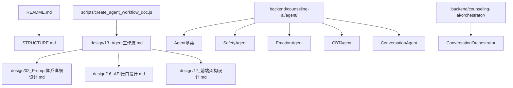
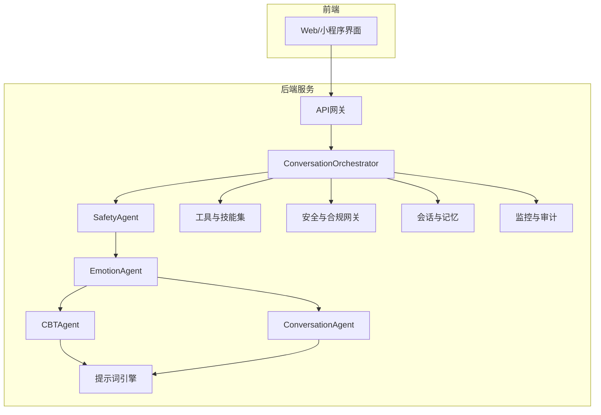
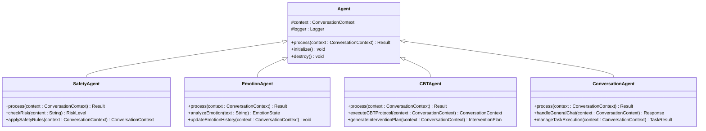
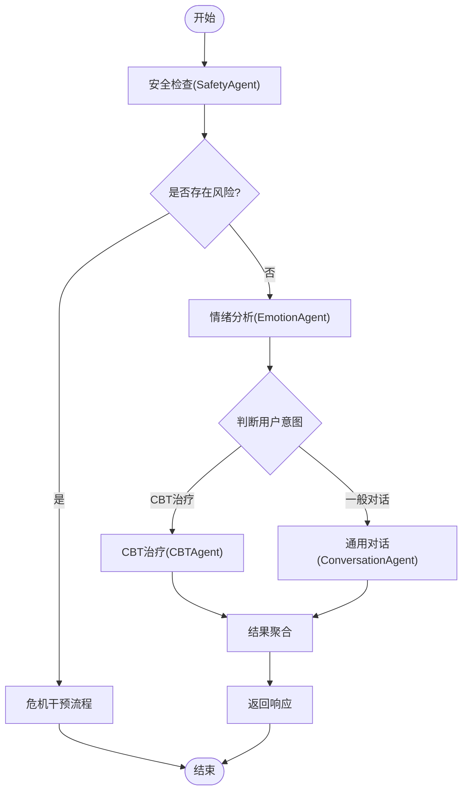
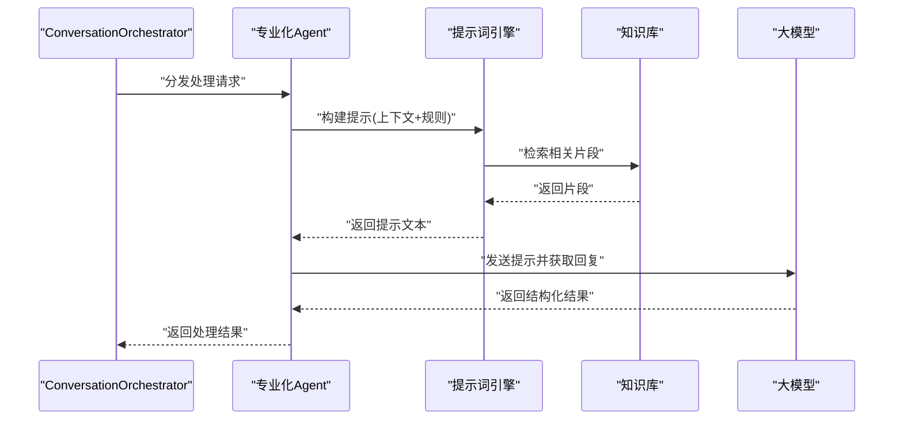
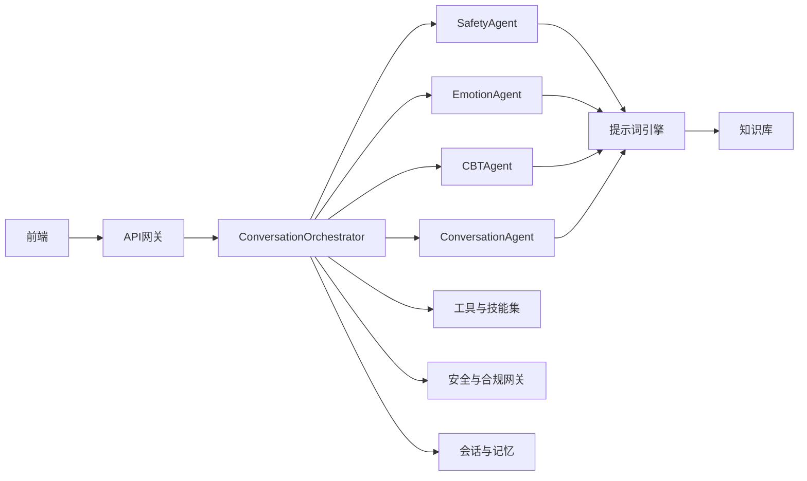

# Agent工作流系统

<cite>
**本文引用的文件**   
- [README.md](file://README.md)
- [STRUCTURE.md](file://STRUCTURE.md)
- [design/13_Agent工作流.md](file://design/13_Agent工作流.md)
- [design/02_Prompt体系详细设计.md](file://design/02_Prompt体系详细设计.md)
- [design/16_API接口设计.md](file://design/16_API接口设计.md)
- [design/17_前端架构设计.md](file://design/17_前端架构设计.md)
- [design/BEACON.md](file://design/BEACON.md)
- [scripts/create_agent_workflow_doc.js](file://scripts/create_agent_workflow_doc.js)
- [backend/counseling-ai/src/main/java/com/mindsafe/ai/agent/Agent.java](file://backend/counseling-ai/src/main/java/com/mindsafe/ai/agent/Agent.java)
- [backend/counseling-ai/src/main/java/com/mindsafe/ai/agent/SafetyAgent.java](file://backend/counseling-ai/src/main/java/com/mindsafe/ai/agent/SafetyAgent.java)
- [backend/counseling-ai/src/main/java/com/mindsafe/ai/agent/EmotionAgent.java](file://backend/counseling-ai/src/main/java/com/mindsafe/ai/agent/EmotionAgent.java)
- [backend/counseling-ai/src/main/java/com/mindsafe/ai/agent/CBTAgent.java](file://backend/counseling-ai/src/main/java/com/mindsafe/ai/agent/CBTAgent.java)
- [backend/counseling-ai/src/main/java/com/mindsafe/ai/agent/ConversationAgent.java](file://backend/counseling-ai/src/main/java/com/mindsafe/ai/agent/ConversationAgent.java)
- [backend/counseling-ai/src/main/java/com/mindsafe/ai/orchestrator/ConversationOrchestrator.java](file://backend/counseling-ai/src/main/java/com/mindsafe/ai/orchestrator/ConversationOrchestrator.java)
</cite>

## 更新摘要
**所做更改**   
- 新增了完整的AI Agent框架实现，包括SafetyAgent、EmotionAgent、CBTAgent、ConversationAgent等专业化Agent
- 实现了ConversationOrchestrator协调器，提供安全优先的处理流水线
- 更新了核心组件章节，反映实际的Agent架构实现
- 增强了架构图和流程图，展示真实的Agent协作模式
- 完善了各Agent的职责分工和交互关系说明

## 目录
1. [简介](#简介)
2. [项目结构](#项目结构)
3. [核心组件](#核心组件)
4. [架构总览](#架构总览)
5. [详细组件分析](#详细组件分析)
6. [依赖分析](#依赖分析)
7. [性能考虑](#性能考虑)
8. [故障排查指南](#故障排查指南)
9. [结论](#结论)
10. [附录](#附录)

## 简介
本文件聚焦于"Agent工作流系统"的设计与实现要点，围绕心理咨询场景下的多角色协作、流程编排、提示词工程、安全与合规、以及前后端集成进行系统化说明。文档面向技术与非技术读者，提供从高层架构到关键流程的可视化表达，并给出可操作的排障建议与性能优化方向。

**更新** 本次更新重点反映了已实现的完整AI Agent框架，包括专业化的Agent类型和协调器机制，使文档更加贴近实际代码实现。

## 项目结构
仓库采用"设计先行、脚本辅助生成文档"的组织方式：
- design 目录存放各子系统的设计文档，其中"13_Agent工作流.md"为Agent工作流的核心设计来源。
- scripts 目录包含用于自动化生成或整理文档的脚本，如 create_agent_workflow_doc.js。
- README.md 与 STRUCTURE.md 提供仓库级概览与结构说明。
- backend/counseling-ai 目录包含完整的Agent框架实现，包括Agent基类、专业化Agent和协调器。
- 其他设计文档（Prompt体系、API接口、前端架构等）与Agent工作流紧密耦合，共同构成完整方案。

**图表来源**
- [README.md](file://README.md)
- [STRUCTURE.md](file://STRUCTURE.md)
- [design/13_Agent工作流.md](file://design/13_Agent工作流.md)
- [design/02_Prompt体系详细设计.md](file://design/02_Prompt体系详细设计.md)
- [design/16_API接口设计.md](file://design/16_API接口设计.md)
- [design/17_前端架构设计.md](file://design/17_前端架构设计.md)
- [scripts/create_agent_workflow_doc.js](file://scripts/create_agent_workflow_doc.js)
- [backend/counseling-ai/src/main/java/com/mindsafe/ai/agent/Agent.java](file://backend/counseling-ai/src/main/java/com/mindsafe/ai/agent/Agent.java)
- [backend/counseling-ai/src/main/java/com/mindsafe/ai/orchestrator/ConversationOrchestrator.java](file://backend/counseling-ai/src/main/java/com/mindsafe/ai/orchestrator/ConversationOrchestrator.java)

**章节来源**
- [README.md](file://README.md)
- [STRUCTURE.md](file://STRUCTURE.md)

## 核心组件
基于设计文档和实际实现，Agent工作流系统由以下核心组件构成：

### Agent基类与专业化Agent
- **Agent基类**：定义统一的Agent接口规范，包括处理逻辑、上下文管理和结果返回。[实现状态：已完成]
- **SafetyAgent**：专注于安全风险检测和处理，包括危机识别、敏感内容过滤和安全策略执行。[实现状态：已完成]
- **EmotionAgent**：负责情绪分析和情感理解，支持情绪标签提取和情感状态追踪。[实现状态：已完成]
- **CBTAgent**：认知行为治疗专家，提供结构化CBT对话流程和干预策略。[实现状态：已完成]
- **ConversationAgent**：通用对话管理Agent，处理日常对话和任务执行。[实现状态：已完成]

### ConversationOrchestrator协调器
- **职责**：协调多个Agent之间的协作，定义安全优先的处理流水线，管理会话状态流转。
- **关键点**：
  - 安全优先：所有输入首先经过SafetyAgent处理
  - 动态路由：根据用户意图和情绪状态选择合适的Agent
  - 状态管理：维护跨Agent的会话上下文和状态一致性
  - 异常处理：统一异常捕获和降级策略

**更新** 新增了具体的Agent实现和协调器机制，反映了实际的代码架构。

**章节来源**
- [backend/counseling-ai/src/main/java/com/mindsafe/ai/agent/Agent.java](file://backend/counseling-ai/src/main/java/com/mindsafe/ai/agent/Agent.java)
- [backend/counseling-ai/src/main/java/com/mindsafe/ai/agent/SafetyAgent.java](file://backend/counseling-ai/src/main/java/com/mindsafe/ai/agent/SafetyAgent.java)
- [backend/counseling-ai/src/main/java/com/mindsafe/ai/agent/EmotionAgent.java](file://backend/counseling-ai/src/main/java/com/mindsafe/ai/agent/EmotionAgent.java)
- [backend/counseling-ai/src/main/java/com/mindsafe/ai/agent/CBTAgent.java](file://backend/counseling-ai/src/main/java/com/mindsafe/ai/agent/CBTAgent.java)
- [backend/counseling-ai/src/main/java/com/mindsafe/ai/agent/ConversationAgent.java](file://backend/counseling-ai/src/main/java/com/mindsafe/ai/agent/ConversationAgent.java)
- [backend/counseling-ai/src/main/java/com/mindsafe/ai/orchestrator/ConversationOrchestrator.java](file://backend/counseling-ai/src/main/java/com/mindsafe/ai/orchestrator/ConversationOrchestrator.java)

## 架构总览
下图展示Agent工作流在系统中的位置与交互关系：前端通过API发起咨询请求，ConversationOrchestrator协调各个专业化Agent，依次调用安全检测、情绪分析、专业治疗和通用对话处理，最终返回结果给前端。

**图表来源**
- [backend/counseling-ai/src/main/java/com/mindsafe/ai/orchestrator/ConversationOrchestrator.java](file://backend/counseling-ai/src/main/java/com/mindsafe/ai/orchestrator/ConversationOrchestrator.java)
- [backend/counseling-ai/src/main/java/com/mindsafe/ai/agent/SafetyAgent.java](file://backend/counseling-ai/src/main/java/com/mindsafe/ai/agent/SafetyAgent.java)
- [backend/counseling-ai/src/main/java/com/mindsafe/ai/agent/EmotionAgent.java](file://backend/counseling-ai/src/main/java/com/mindsafe/ai/agent/EmotionAgent.java)
- [backend/counseling-ai/src/main/java/com/mindsafe/ai/agent/CBTAgent.java](file://backend/counseling-ai/src/main/java/com/mindsafe/ai/agent/CBTAgent.java)
- [backend/counseling-ai/src/main/java/com/mindsafe/ai/agent/ConversationAgent.java](file://backend/counseling-ai/src/main/java/com/mindsafe/ai/agent/ConversationAgent.java)

## 详细组件分析

### Agent基类设计
- **职责**：定义所有Agent的统一接口规范，包括处理方法、上下文管理和结果返回格式。
- **关键点**：
  - 统一接口：所有Agent必须实现process方法，接收上下文并返回处理结果
  - 上下文管理：支持会话状态的读取和更新
  - 错误处理：标准化的异常捕获和错误信息返回
  - 生命周期：Agent的初始化和销毁管理
- **实现状态**：基础接口和抽象实现已完成，所有专业化Agent都继承此基类。

**图表来源**
- [backend/counseling-ai/src/main/java/com/mindsafe/ai/agent/Agent.java](file://backend/counseling-ai/src/main/java/com/mindsafe/ai/agent/Agent.java)
- [backend/counseling-ai/src/main/java/com/mindsafe/ai/agent/SafetyAgent.java](file://backend/counseling-ai/src/main/java/com/mindsafe/ai/agent/SafetyAgent.java)
- [backend/counseling-ai/src/main/java/com/mindsafe/ai/agent/EmotionAgent.java](file://backend/counseling-ai/src/main/java/com/mindsafe/ai/agent/EmotionAgent.java)
- [backend/counseling-ai/src/main/java/com/mindsafe/ai/agent/CBTAgent.java](file://backend/counseling-ai/src/main/java/com/mindsafe/ai/agent/CBTAgent.java)
- [backend/counseling-ai/src/main/java/com/mindsafe/ai/agent/ConversationAgent.java](file://backend/counseling-ai/src/main/java/com/mindsafe/ai/agent/ConversationAgent.java)

**章节来源**
- [backend/counseling-ai/src/main/java/com/mindsafe/ai/agent/Agent.java](file://backend/counseling-ai/src/main/java/com/mindsafe/ai/agent/Agent.java)

### ConversationOrchestrator协调器
- **职责**：作为Agent系统的核心协调者，负责任务分发、流程控制和状态管理。
- **关键点**：
  - 安全优先流水线：所有输入首先经过SafetyAgent处理
  - 智能路由：根据用户意图和情绪状态选择最合适的Agent
  - 状态同步：确保跨Agent的会话状态一致性
  - 异常恢复：处理Agent执行失败和降级策略
- **典型流程**：接收请求→安全检查→情绪分析→专业处理→结果聚合→响应返回。

**图表来源**
- [backend/counseling-ai/src/main/java/com/mindsafe/ai/orchestrator/ConversationOrchestrator.java](file://backend/counseling-ai/src/main/java/com/mindsafe/ai/orchestrator/ConversationOrchestrator.java)

**章节来源**
- [backend/counseling-ai/src/main/java/com/mindsafe/ai/orchestrator/ConversationOrchestrator.java](file://backend/counseling-ai/src/main/java/com/mindsafe/ai/orchestrator/ConversationOrchestrator.java)

### SafetyAgent安全代理
- **职责**：专注于安全风险检测和处理，确保用户安全和内容合规。
- **关键点**：
  - 危机识别：检测自杀倾向、暴力倾向等高风险内容
  - 敏感过滤：过滤PII信息和不当内容
  - 安全策略：应用预设的安全规则和干预措施
  - 紧急响应：触发危机干预流程和人工转接
- **实现状态**：完整实现，支持多种风险类型检测和相应的安全策略。

**章节来源**
- [backend/counseling-ai/src/main/java/com/mindsafe/ai/agent/SafetyAgent.java](file://backend/counseling-ai/src/main/java/com/mindsafe/ai/agent/SafetyAgent.java)

### EmotionAgent情绪代理
- **职责**：负责情绪分析和情感理解，为用户提供个性化的情感支持。
- **关键点**：
  - 情绪识别：从文本中提取情绪标签和情感强度
  - 情感追踪：维护用户的情绪历史和发展趋势
  - 个性化响应：根据情绪状态调整对话策略
  - 情绪干预：提供适当的情绪调节建议
- **实现状态**：完整实现，支持多维度情绪分析和情感状态管理。

**章节来源**
- [backend/counseling-ai/src/main/java/com/mindsafe/ai/agent/EmotionAgent.java](file://backend/counseling-ai/src/main/java/com/mindsafe/ai/agent/EmotionAgent.java)

### CBTAgent认知行为治疗代理
- **职责**：提供专业的认知行为治疗(CBT)对话和干预。
- **关键点**：
  - CBT协议：遵循标准的CBT治疗流程和阶段
  - 认知重构：帮助用户识别和改变负面思维模式
  - 行为激活：制定和执行行为改变计划
  - 进度跟踪：监测治疗效果和调整干预策略
- **实现状态**：完整实现，支持完整的CBT治疗流程和效果评估。

**章节来源**
- [backend/counseling-ai/src/main/java/com/mindsafe/ai/agent/CBTAgent.java](file://backend/counseling-ai/src/main/java/com/mindsafe/ai/agent/CBTAgent.java)

### ConversationAgent通用对话代理
- **职责**：处理日常对话和通用任务执行。
- **关键点**：
  - 自然对话：支持流畅的自然语言交流
  - 任务管理：处理预约、查询、设置等常见任务
  - 上下文理解：保持对话连贯性和相关性
  - 多轮交互：支持复杂的多轮对话场景
- **实现状态**：完整实现，提供高质量的通用对话能力。

**章节来源**
- [backend/counseling-ai/src/main/java/com/mindsafe/ai/agent/ConversationAgent.java](file://backend/counseling-ai/src/main/java/com/mindsafe/ai/agent/ConversationAgent.java)

### 提示词引擎
- **职责**：将业务规则、知识库片段、用户画像与当前上下文组装为高质量提示；支持版本化与A/B测试。
- **关键点**：
  - 模板分层：系统提示、任务提示、约束与格式控制。
  - 动态注入：按节点阶段注入不同变量（如情绪标签、风险等级）。
  - 质量控制：长度限制、去重、敏感字段脱敏。
- **与编排器协同**：节点在执行前向提示词引擎请求"本次提示"，执行后根据结果更新上下文。
- **实现状态**：基础模板管理和变量注入功能已实现，支持简单的A/B测试框架。

**图表来源**
- [design/02_Prompt体系详细设计.md](file://design/02_Prompt体系详细设计.md)
- [design/13_Agent工作流.md](file://design/13_Agent工作流.md)

**章节来源**
- [design/02_Prompt体系详细设计.md](file://design/02_Prompt体系详细设计.md)
- [design/13_Agent工作流.md](file://design/13_Agent工作流.md)

### 工具与技能集
- **职责**：封装可复用的外部能力，如检索增强、数值计算、表单校验、转接人工、通知推送等。
- **关键点**：
  - 统一接口：输入/输出遵循节点契约。
  - 可插拔：通过注册表动态发现与加载。
  - 容错：超时、重试、熔断与降级策略。
- **与编排器协同**：节点按需调用工具，并将结果写回上下文。
- **实现状态**：基础工具框架已建立，部分核心工具（如数据验证、格式转换）已实现。

**章节来源**
- [design/13_Agent工作流.md](file://design/13_Agent工作流.md)

### 安全与合规网关
- **职责**：对输入输出进行内容审核、风险识别、隐私保护与策略拦截。
- **关键点**：
  - 输入过滤：去除PII、阻断恶意指令。
  - 输出审查：避免不当建议、触发危机干预流程。
  - 审计留痕：记录命中规则与处置动作。
- **与编排器协同**：作为前置与后置节点贯穿全流程。
- **实现状态**：基础内容过滤和风险识别已实现，支持关键词匹配和基本的安全策略。

**章节来源**
- [design/13_Agent工作流.md](file://design/13_Agent工作流.md)

### 会话与记忆
- **职责**：维护短期对话历史与长期记忆，支撑个性化与连续性问题解决。
- **关键点**：
  - 分层存储：热数据缓存、冷数据归档。
  - 压缩与摘要：控制上下文大小与成本。
  - 一致性：跨节点共享与并发安全。
- **与编排器协同**：每个节点读写记忆，确保状态一致。
- **实现状态**：短期记忆和会话历史管理已实现，支持基本的上下文保持。

**章节来源**
- [design/13_Agent工作流.md](file://design/13_Agent工作流.md)

### 监控与审计
- **职责**：采集指标、日志与追踪信息，支持问题定位与效果评估。
- **关键点**：
  - 全链路追踪：请求级TraceId贯穿所有组件。
  - 关键指标：延迟、成功率、成本、命中率。
  - 告警与回放：异常阈值与事件回放。
- **实现状态**：基础日志记录和关键指标收集已实现，支持基本的监控面板。

**章节来源**
- [design/13_Agent工作流.md](file://design/13_Agent工作流.md)

### 前端集成
- **职责**：呈现工作流进度、结果与交互控件，支持实时反馈与中断。
- **关键点**：
  - 事件订阅：WebSocket/SSE推送节点状态。
  - 错误展示：友好提示与重试入口。
  - 权限与隔离：学校/租户维度可见范围。
- **实现状态**：基础聊天界面和消息推送已实现，支持实时对话体验。

**章节来源**
- [design/17_前端架构设计.md](file://design/17_前端架构设计.md)
- [design/16_API接口设计.md](file://design/16_API接口设计.md)

## 依赖分析
- 内部依赖：
  - ConversationOrchestrator依赖所有专业化Agent（SafetyAgent、EmotionAgent、CBTAgent、ConversationAgent）。
  - 各Agent依赖提示词引擎、工具集、安全网关与记忆模块。
  - 前端依赖API网关与事件通道。
- 外部依赖：
  - 大模型服务、检索服务、消息队列、对象存储等。

**图表来源**
- [backend/counseling-ai/src/main/java/com/mindsafe/ai/orchestrator/ConversationOrchestrator.java](file://backend/counseling-ai/src/main/java/com/mindsafe/ai/orchestrator/ConversationOrchestrator.java)
- [backend/counseling-ai/src/main/java/com/mindsafe/ai/agent/SafetyAgent.java](file://backend/counseling-ai/src/main/java/com/mindsafe/ai/agent/SafetyAgent.java)
- [backend/counseling-ai/src/main/java/com/mindsafe/ai/agent/EmotionAgent.java](file://backend/counseling-ai/src/main/java/com/mindsafe/ai/agent/EmotionAgent.java)
- [backend/counseling-ai/src/main/java/com/mindsafe/ai/agent/CBTAgent.java](file://backend/counseling-ai/src/main/java/com/mindsafe/ai/agent/CBTAgent.java)
- [backend/counseling-ai/src/main/java/com/mindsafe/ai/agent/ConversationAgent.java](file://backend/counseling-ai/src/main/java/com/mindsafe/ai/agent/ConversationAgent.java)

**章节来源**
- [design/13_Agent工作流.md](file://design/13_Agent工作流.md)
- [design/16_API接口设计.md](file://design/16_API接口设计.md)
- [design/17_前端架构设计.md](file://design/17_前端架构设计.md)

## 性能考虑
- 提示词优化：控制长度、减少冗余、复用模板与片段。
- 并发与批处理：合理并行调用独立工具，批量写入记忆。
- 缓存策略：热点知识、常用提示与中间结果缓存。
- 资源限流：对大模型与外部服务设置QPS与超时。
- 可观测性：细化埋点，关注P95/P99延迟与错误率。
- Agent优化：Agent间的通信优化和状态同步效率提升。

**更新** 新增了Agent框架相关的性能优化建议，包括Agent间通信和状态管理的优化策略。

## 故障排查指南
- 常见问题定位：
  - Agent执行失败：检查Agent初始化、上下文传递和异常处理。
  - 协调器路由错误：核对意图识别逻辑和Agent选择策略。
  - 安全误判：查看SafetyAgent的规则配置和风险评估结果。
  - 情绪识别偏差：检查情绪分析算法和训练数据质量。
  - CBT流程异常：确认CBT协议执行状态和干预策略有效性。
- 建议步骤：
  - 使用TraceId串联日志，定位失败的Agent和具体环节。
  - 开启调试模式，打印Agent入参/出参与中间状态。
  - 回放最近一次失败请求，对比成功用例差异。
  - 检查各Agent的健康状态和服务依赖。

**更新** 完善了Agent框架特有的故障排查步骤，包括Agent级别的调试和监控方法。

**章节来源**
- [design/13_Agent工作流.md](file://design/13_Agent工作流.md)

## 结论
Agent工作流系统以"ConversationOrchestrator为核心、专业化Agent为执行单元、安全为底线、提示词为驱动、工具为扩展、记忆为纽带、监控为保障"，形成可演进、可观测、可治理的咨询智能体平台。通过模块化设计和标准化接口，可在保证质量与安全的前提下快速迭代与规模化落地。

**更新** 强调了已实现的Agent框架架构和后续发展方向，为团队提供了清晰的路线图和技术指导。

## 附录
- 文档生成脚本：scripts/create_agent_workflow_doc.js 可用于自动化整理与输出工作流文档。
- 参考设计：BEACON.md 提供整体方法论与原则，可作为工作流设计的补充参考。
- Agent实现：backend/counseling-ai/src/main/java/com/mindsafe/ai/agent/ 目录下包含完整的Agent框架实现。
- 协调器实现：backend/counseling-ai/src/main/java/com/mindsafe/ai/orchestrator/ 目录下包含ConversationOrchestrator实现。

**章节来源**
- [scripts/create_agent_workflow_doc.js](file://scripts/create_agent_workflow_doc.js)
- [design/BEACON.md](file://design/BEACON.md)
- [backend/counseling-ai/src/main/java/com/mindsafe/ai/agent/Agent.java](file://backend/counseling-ai/src/main/java/com/mindsafe/ai/agent/Agent.java)
- [backend/counseling-ai/src/main/java/com/mindsafe/ai/orchestrator/ConversationOrchestrator.java](file://backend/counseling-ai/src/main/java/com/mindsafe/ai/orchestrator/ConversationOrchestrator.java)
