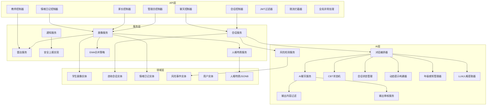
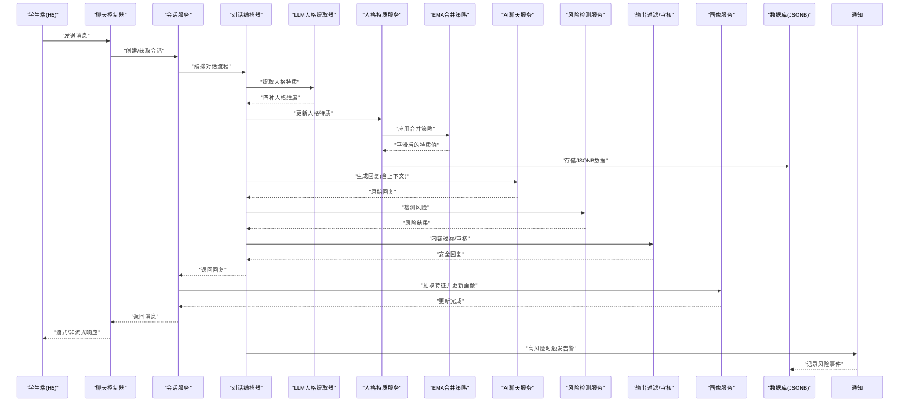
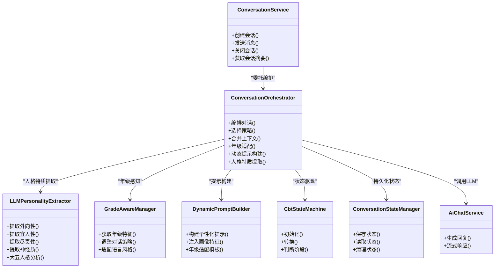
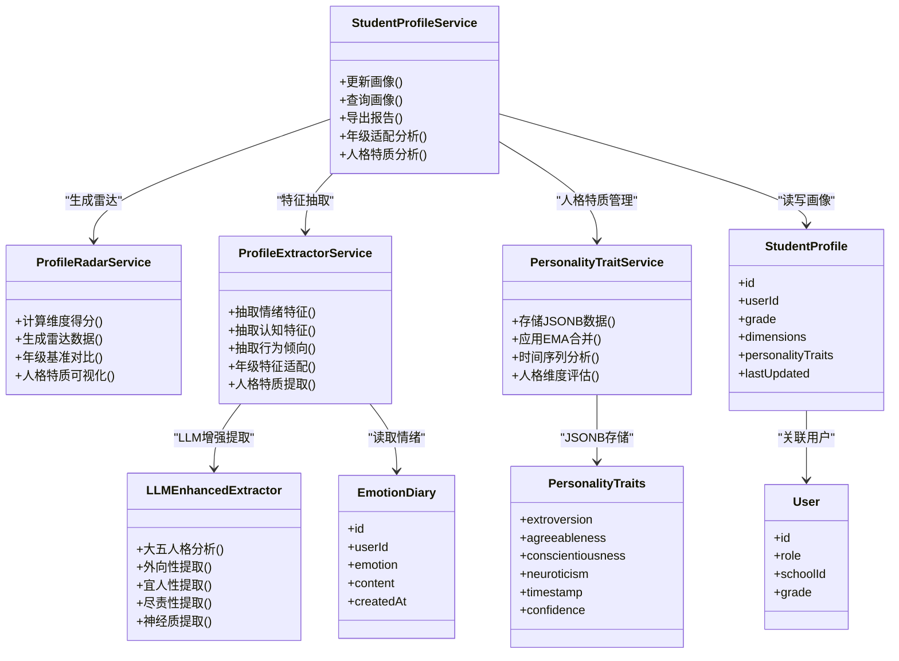
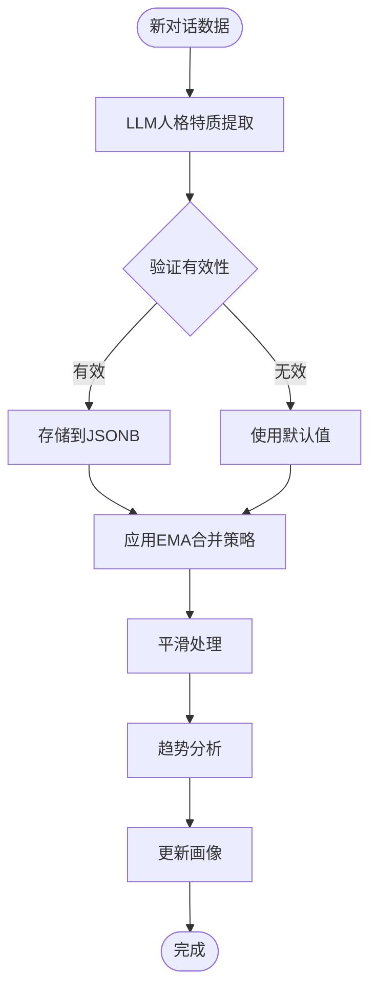
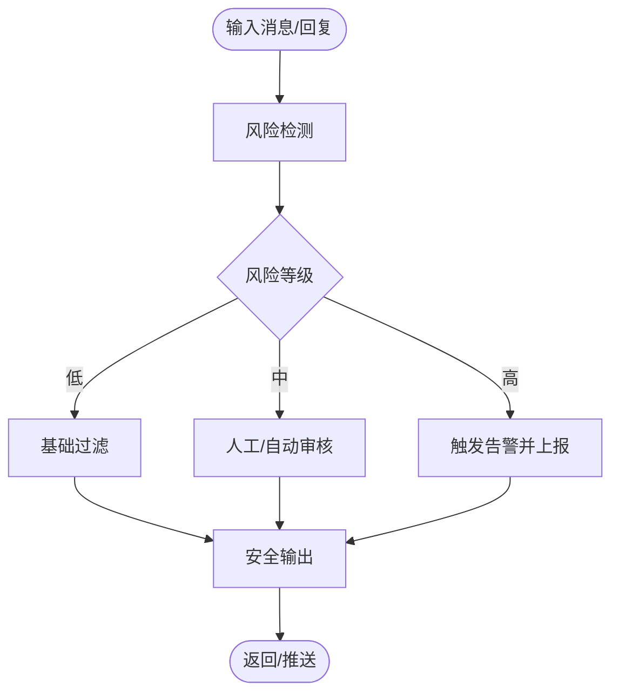
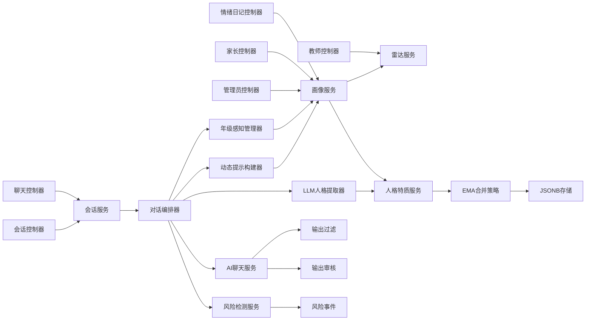

# 学生心理画像系统

<cite>
**本文引用的文件**   
- [backend/counseling-api/src/main/java/com/mindsafe/api/controller/ChatController.java](file://backend/counseling-api/src/main/java/com/mindsafe/api/controller/ChatController.java)
- [backend/counseling-api/src/main/java/com/mindsafe/api/controller/EmotionDiaryController.java](file://backend/counseling-api/src/main/java/com/mindsafe/api/controller/EmotionDiaryController.java)
- [backend/counseling-api/src/main/java/com/mindsafe/api/controller/SessionController.java](file://backend/counseling-api/src/main/java/com/mindsafe/api/controller/SessionController.java)
- [backend/counseling-api/src/main/java/com/mindsafe/api/controller/ParentController.java](file://backend/counseling-api/src/main/java/com/mindsafe/api/controller/ParentController.java)
- [backend/counseling-api/src/main/java/com/mindsafe/api/controller/TeacherController.java](file://backend/counseling-api/src/main/java/com/mindsafe/api/controller/TeacherController.java)
- [backend/counseling-api/src/main/java/com/mindsafe/api/controller/AdminController.java](file://backend/counseling-api/src/main/java/com/mindsafe/api/controller/AdminController.java)
- [backend/counseling-api/src/main/java/com/mindsafe/api/config/GlobalExceptionHandler.java](file://backend/counseling-api/src/main/java/com/mindsafe/api/config/GlobalExceptionHandler.java)
- [backend/counseling-api/src/main/java/com/mindsafe/api/security/JwtAuthenticationFilter.java](file://backend/counseling-api/src/main/java/com/mindsafe/api/security/JwtAuthenticationFilter.java)
- [backend/counseling-api/src/main/java/com/mindsafe/api/ratelimit/RateLimitInterceptor.java](file://backend/counseling-api/src/main/java/com/mindsafe/api/ratelimit/RateLimitInterceptor.java)
- [backend/counseling-service/src/main/java/com/mindsafe/service/conversation/ConversationService.java](file://backend/counseling-service/src/main/java/com/mindsafe/service/conversation/ConversationService.java)
- [backend/counseling-service/src/main/java/com/mindsafe/service/conversation/ConversationServiceImpl.java](file://backend/counseling-service/src/main/java/com/mindsafe/service/conversation/ConversationServiceImpl.java)
- [backend/counseling-service/src/main/java/com/mindsafe/service/profile/ProfileExtractorService.java](file://backend/counseling-service/src/main/java/com/mindsafe/service/profile/ProfileExtractorService.java)
- [backend/counseling-service/src/main/java/com/mindsafe/service/profile/ProfileRadarService.java](file://backend/counseling-service/src/main/java/com/mindsafe/service/profile/ProfileRadarService.java)
- [backend/counseling-service/src/main/java/com/mindsafe/service/profile/StudentProfileService.java](file://backend/counseling-service/src/main/java/com/mindsafe/service/profile/StudentProfileService.java)
- [backend/counseling-service/src/main/java/com/mindsafe/service/notification/NotificationService.java](file://backend/counseling-service/src/main/java/com/mindsafe/service/notification/NotificationService.java)
- [backend/counseling-service/src/main/java/com/mindsafe/service/notification/NotificationServiceImpl.java](file://backend/counseling-service/src/main/java/com/mindsafe/service/notification/NotificationServiceImpl.java)
- [backend/counseling-service/src/main/java/com/mindsafe/service/safety/OutputSafetyReporterImpl.java](file://backend/counseling-service/src/main/java/com/mindsafe/service/safety/OutputSafetyReporterImpl.java)
- [backend/counseling-ai/src/main/java/com/mindsafe/ai/orchestrator/ConversationOrchestrator.java](file://backend/counseling-ai/src/main/java/com/mindsafe/ai/orchestrator/ConversationOrchestrator.java)
- [backend/counseling-ai/src/main/java/com/mindsafe/ai/chat/AiChatService.java](file://backend/counseling-ai/src/main/java/com/mindsafe/ai/chat/AiChatService.java)
- [backend/counseling-ai/src/main/java/com/mindsafe/ai/chat/AiChatServiceImpl.java](file://backend/counseling-ai/src/main/java/com/mindsafe/ai/chat/AiChatServiceImpl.java)
- [backend/counseling-ai/src/main/java/com/mindsafe/ai/state/CbtStateMachine.java](file://backend/counseling-ai/src/main/java/com/mindsafe/ai/state/CbtStateMachine.java)
- [backend/counseling-ai/src/main/java/com/mindsafe/ai/state/ConversationStateManager.java](file://backend/counseling-ai/src/main/java/com/mindsafe/ai/state/ConversationStateManager.java)
- [backend/counseling-ai/src/main/java/com/mindsafe/ai/risk/RiskDetectorService.java](file://backend/counseling-ai/src/main/java/com/mindsafe/ai/risk/RiskDetectorService.java)
- [backend/counseling-ai/src/main/java/com/mindsafe/ai/risk/RiskDetectorServiceImpl.java](file://backend/counseling-ai/src/main/java/com/mindsafe/ai/risk/RiskDetectorServiceImpl.java)
- [backend/counseling-ai/src/main/java/com/mindsafe/ai/safety/OutputContentFilter.java](file://backend/counseling-ai/src/main/java/com/mindsafe/ai/safety/OutputContentFilter.java)
- [backend/counseling-ai/src/main/java/com/mindsafe/ai/safety/OutputReviewService.java](file://backend/counseling-ai/src/main/java/com/mindsafe/ai/safety/OutputReviewService.java)
- [backend/counseling-domain/src/main/java/com/mindsafe/domain/entity/StudentProfile.java](file://backend/counseling-domain/src/main/java/com/mindsafe/domain/entity/StudentProfile.java)
- [backend/counseling-domain/src/main/java/com/mindsafe/domain/entity/CounselingSession.java](file://backend/counseling-domain/src/main/java/com/mindsafe/domain/entity/CounselingSession.java)
- [backend/counseling-domain/src/main/java/com/mindsafe/domain/entity/EmotionDiary.java](file://backend/counseling-domain/src/main/java/com/mindsafe/domain/entity/EmotionDiary.java)
- [backend/counseling-domain/src/main/java/com/mindsafe/domain/entity/RiskEvent.java](file://backend/counseling-domain/src/main/java/com/mindsafe/domain/entity/RiskEvent.java)
- [backend/counseling-domain/src/main/java/com/mindsafe/domain/entity/User.java](file://backend/counseling-domain/src/main/java/com/mindsafe/domain/entity/User.java)
- [backend/counseling-common/src/main/java/com/mindsafe/common/dto/chat/SessionInfo.java](file://backend/counseling-common/src/main/java/com/mindsafe/common/dto/chat/SessionInfo.java)
- [backend/counseling-common/src/main/java/com/mindsafe/common/dto/chat/StreamMessageEvent.java](file://backend/counseling-common/src/main/java/com/mindsafe/common/dto/chat/StreamMessageEvent.java)
- [backend/counseling-common/src/main/java/com/mindsafe/common/dto/risk/RiskDetectionResult.java](file://backend/counseling-common/src/main/java/com/mindsafe/common/dto/risk/RiskDetectionResult.java)
- [backend/counseling-common/src/main/java/com/mindsafe/common/enums/RiskLevel.java](file://backend/counseling-common/src/main/java/com/mindsafe/common/enums/RiskLevel.java)
- [backend/counseling-app/src/main/resources/db/migration/V12__student_profiles.sql](file://backend/counseling-app/src/main/resources/db/migration/V12__student_profiles.sql)
- [backend/counseling-app/src/main/resources/db/migration/V18__profile_personality_traits.sql](file://backend/counseling-app/src/main/resources/db/migration/V18__profile_personality_traits.sql)
- [frontend/student-h5/src/components/ChatRoom.jsx](file://frontend/student-h5/src/components/ChatRoom.jsx)
- [frontend/student-h5/src/components/EmotionDiary.jsx](file://frontend/student-h5/src/components/EmotionDiary.jsx)
- [frontend/teacher-web/src/components/ProfileRadarChart.jsx](file://frontend/teacher-web/src/components/ProfileRadarChart.jsx)
- [frontend/parent-h5/src/pages/report/index.jsx](file://frontend/parent-h5/src/pages/report/index.jsx)
</cite>

## 更新摘要
**变更内容**   
- 新增了人格特质JSONB字段支持，增强学生心理画像系统的维度丰富性
- 实现了四种人格维度的LLM增强提取功能，提升画像分析的智能化水平
- 集成了EMA（经验模态分解）合并策略，优化人格特质的时间序列分析
- 扩展了数据库迁移脚本V18，支持人格特质数据的持久化存储
- 增强了画像服务的特征抽取能力，支持多维度人格特征的动态更新

## 目录
1. [引言](#引言)
2. [项目结构](#项目结构)
3. [核心组件](#核心组件)
4. [架构总览](#架构总览)
5. [详细组件分析](#详细组件分析)
6. [依赖关系分析](#依赖关系分析)
7. [性能考量](#性能考量)
8. [故障排查指南](#故障排查指南)
9. [结论](#结论)
10. [附录](#附录)

## 引言
本系统面向中小学生心理健康场景，提供"对话式心理支持 + 多模态情感记录 + 风险识别与干预 + 学生心理画像"的完整闭环。系统通过会话编排、状态机驱动、安全过滤与风险检测，持续抽取并更新学生的多维画像（情绪、认知、行为倾向、人格特质等），并以雷达图、报告等形式向教师与家长呈现，同时保障隐私与安全合规。

**更新** 最新增强包括人格特质JSONB字段支持和四种人格维度的LLM增强提取，以及EMA合并策略的集成，使系统能够提供更全面、精准的学生心理画像分析。

## 项目结构
后端采用分层模块化设计：
- API 层：REST/WebSocket 接口、鉴权、限流、全局异常处理
- 服务层：会话、画像、通知、安全上报、业务指标
- AI 层：对话编排、状态机、提示词、语音、风险检测、安全过滤
- 领域层：实体模型与数据映射
- 应用层：启动入口、数据库迁移、配置
- 前端：学生端 H5、教师端 Web、家长端 H5

图表来源
- [backend/counseling-api/src/main/java/com/mindsafe/api/controller/ChatController.java](file://backend/counseling-api/src/main/java/com/mindsafe/api/controller/ChatController.java)
- [backend/counseling-api/src/main/java/com/mindsafe/api/controller/EmotionDiaryController.java](file://backend/counseling-api/src/main/java/com/mindsafe/api/controller/EmotionDiaryController.java)
- [backend/counseling-api/src/main/java/com/mindsafe/api/controller/SessionController.java](file://backend/counseling-api/src/main/java/com/mindsafe/api/controller/SessionController.java)
- [backend/counseling-api/src/main/java/com/mindsafe/api/controller/ParentController.java](file://backend/counseling-api/src/main/java/com/mindsafe/api/controller/ParentController.java)
- [backend/counseling-api/src/main/java/com/mindsafe/api/controller/TeacherController.java](file://backend/counseling-api/src/main/java/com/mindsafe/api/controller/TeacherController.java)
- [backend/counseling-api/src/main/java/com/mindsafe/api/controller/AdminController.java](file://backend/counseling-api/src/main/java/com/mindsafe/api/controller/AdminController.java)
- [backend/counseling-service/src/main/java/com/mindsafe/service/conversation/ConversationService.java](file://backend/counseling-service/src/main/java/com/mindsafe/service/conversation/ConversationService.java)
- [backend/counseling-service/src/main/java/com/mindsafe/service/profile/StudentProfileService.java](file://backend/counseling-service/src/main/java/com/mindsafe/service/profile/StudentProfileService.java)
- [backend/counseling-service/src/main/java/com/mindsafe/service/profile/ProfileRadarService.java](file://backend/counseling-service/src/main/java/com/mindsafe/service/profile/ProfileRadarService.java)
- [backend/counseling-service/src/main/java/com/mindsafe/service/notification/NotificationService.java](file://backend/counseling-service/src/main/java/com/mindsafe/service/notification/NotificationService.java)
- [backend/counseling-service/src/main/java/com/mindsafe/service/safety/OutputSafetyReporterImpl.java](file://backend/counseling-service/src/main/java/com/mindsafe/service/safety/OutputSafetyReporterImpl.java)
- [backend/counseling-ai/src/main/java/com/mindsafe/ai/orchestrator/ConversationOrchestrator.java](file://backend/counseling-ai/src/main/java/com/mindsafe/ai/orchestrator/ConversationOrchestrator.java)
- [backend/counseling-ai/src/main/java/com/mindsafe/ai/chat/AiChatService.java](file://backend/counseling-ai/src/main/java/com/mindsafe/ai/chat/AiChatService.java)
- [backend/counseling-ai/src/main/java/com/mindsafe/ai/state/CbtStateMachine.java](file://backend/counseling-ai/src/main/java/com/mindsafe/ai/state/CbtStateMachine.java)
- [backend/counseling-ai/src/main/java/com/mindsafe/ai/state/ConversationStateManager.java](file://backend/counseling-ai/src/main/java/com/mindsafe/ai/state/ConversationStateManager.java)
- [backend/counseling-ai/src/main/java/com/mindsafe/ai/risk/RiskDetectorService.java](file://backend/counseling-ai/src/main/java/com/mindsafe/ai/risk/RiskDetectorService.java)
- [backend/counseling-ai/src/main/java/com/mindsafe/ai/safety/OutputContentFilter.java](file://backend/counseling-ai/src/main/java/com/mindsafe/ai/safety/OutputContentFilter.java)
- [backend/counseling-ai/src/main/java/com/mindsafe/ai/safety/OutputReviewService.java](file://backend/counseling-ai/src/main/java/com/mindsafe/ai/safety/OutputReviewService.java)
- [backend/counseling-domain/src/main/java/com/mindsafe/domain/entity/StudentProfile.java](file://backend/counseling-domain/src/main/java/com/mindsafe/domain/entity/StudentProfile.java)
- [backend/counseling-domain/src/main/java/com/mindsafe/domain/entity/CounselingSession.java](file://backend/counseling-domain/src/main/java/com/mindsafe/domain/entity/CounselingSession.java)
- [backend/counseling-domain/src/main/java/com/mindsafe/domain/entity/EmotionDiary.java](file://backend/counseling-domain/src/main/java/com/mindsafe/domain/entity/EmotionDiary.java)
- [backend/counseling-domain/src/main/java/com/mindsafe/domain/entity/RiskEvent.java](file://backend/counseling-domain/src/main/java/com/mindsafe/domain/entity/RiskEvent.java)

章节来源
- [backend/counseling-api/src/main/java/com/mindsafe/api/config/GlobalExceptionHandler.java](file://backend/counseling-api/src/main/java/com/mindsafe/api/config/GlobalExceptionHandler.java)
- [backend/counseling-api/src/main/java/com/mindsafe/api/security/JwtAuthenticationFilter.java](file://backend/counseling-api/src/main/java/com/mindsafe/api/security/JwtAuthenticationFilter.java)
- [backend/counseling-api/src/main/java/com/mindsafe/api/ratelimit/RateLimitInterceptor.java](file://backend/counseling-api/src/main/java/com/mindsafe/api/ratelimit/RateLimitInterceptor.java)

## 核心组件
- 对话与会话管理：负责创建/维护会话上下文、消息流转、状态切换与总结
- 学生画像：基于对话与情绪日记等多源数据，动态抽取维度特征并生成雷达图
- 人格特质分析：通过LLM增强提取四种人格维度，支持JSONB格式存储和EMA合并策略
- 风险识别与安全：实时检测高风险内容，触发告警与上报，并对输出进行安全过滤与审核
- 通知与告警：将风险事件推送至教师端与后台，形成闭环处置
- 年级感知管理：根据学生年级特征调整对话策略和提示词构建
- 动态提示构建：基于画像特征生成个性化的对话提示

**更新** 新增了人格特质JSONB字段支持和四种人格维度的LLM增强提取功能，以及EMA合并策略的集成，显著增强了画像系统的分析深度和准确性。

章节来源
- [backend/counseling-service/src/main/java/com/mindsafe/service/conversation/ConversationService.java](file://backend/counseling-service/src/main/java/com/mindsafe/service/conversation/ConversationService.java)
- [backend/counseling-service/src/main/java/com/mindsafe/service/profile/StudentProfileService.java](file://backend/counseling-service/src/main/java/com/mindsafe/service/profile/StudentProfileService.java)
- [backend/counseling-service/src/main/java/com/mindsafe/service/profile/ProfileRadarService.java](file://backend/counseling-service/src/main/java/com/mindsafe/service/profile/ProfileRadarService.java)
- [backend/counseling-service/src/main/java/com/mindsafe/service/profile/ProfileExtractorService.java](file://backend/counseling-service/src/main/java/com/mindsafe/service/profile/ProfileExtractorService.java)
- [backend/counseling-service/src/main/java/com/mindsafe/service/notification/NotificationService.java](file://backend/counseling-service/src/main/java/com/mindsafe/service/notification/NotificationService.java)
- [backend/counseling-ai/src/main/java/com/mindsafe/ai/orchestrator/ConversationOrchestrator.java](file://backend/counseling-ai/src/main/java/com/mindsafe/ai/orchestrator/ConversationOrchestrator.java)
- [backend/counseling-ai/src/main/java/com/mindsafe/ai/risk/RiskDetectorService.java](file://backend/counseling-ai/src/main/java/com/mindsafe/ai/risk/RiskDetectorService.java)
- [backend/counseling-ai/src/main/java/com/mindsafe/ai/safety/OutputContentFilter.java](file://backend/counseling-ai/src/main/java/com/mindsafe/ai/safety/OutputContentFilter.java)

## 架构总览
系统以"对话驱动画像"为核心路径：学生通过聊天或情绪日记输入信息，AI 编排器协调状态机与 LLM 调用，结合风险检测与安全过滤，产出安全回复；同时服务层抽取特征更新画像，并在必要时触发告警。

**更新** 最新的架构增强了人格特质分析能力，通过LLM增强的四种人格维度提取和EMA合并策略，提供了更精准的心理画像分析。

图表来源
- [backend/counseling-api/src/main/java/com/mindsafe/api/controller/ChatController.java](file://backend/counseling-api/src/main/java/com/mindsafe/api/controller/ChatController.java)
- [backend/counseling-service/src/main/java/com/mindsafe/service/conversation/ConversationService.java](file://backend/counseling-service/src/main/java/com/mindsafe/service/conversation/ConversationService.java)
- [backend/counseling-ai/src/main/java/com/mindsafe/ai/orchestrator/ConversationOrchestrator.java](file://backend/counseling-ai/src/main/java/com/mindsafe/ai/orchestrator/ConversationOrchestrator.java)
- [backend/counseling-ai/src/main/java/com/mindsafe/ai/chat/AiChatService.java](file://backend/counseling-ai/src/main/java/com/mindsafe/ai/chat/AiChatService.java)
- [backend/counseling-ai/src/main/java/com/mindsafe/ai/risk/RiskDetectorService.java](file://backend/counseling-ai/src/main/java/com/mindsafe/ai/risk/RiskDetectorService.java)
- [backend/counseling-ai/src/main/java/com/mindsafe/ai/safety/OutputContentFilter.java](file://backend/counseling-ai/src/main/java/com/mindsafe/ai/safety/OutputContentFilter.java)
- [backend/counseling-service/src/main/java/com/mindsafe/service/profile/StudentProfileService.java](file://backend/counseling-service/src/main/java/com/mindsafe/service/profile/StudentProfileService.java)
- [backend/counseling-service/src/main/java/com/mindsafe/service/notification/NotificationService.java](file://backend/counseling-service/src/main/java/com/mindsafe/service/notification/NotificationService.java)

## 详细组件分析

### 对话与会话编排
- 职责：管理会话生命周期、上下文维护、状态切换、消息路由与总结
- 关键类：会话服务、对话编排器、状态机、状态管理器
- 数据流：消息进入编排器 -> 状态机决策 -> AI 生成 -> 安全校验 -> 返回

**更新** 新增了人格特质提取功能，在对话编排过程中集成LLM增强的四种人格维度分析，使对话更加个性化和针对性。

图表来源
- [backend/counseling-service/src/main/java/com/mindsafe/service/conversation/ConversationService.java](file://backend/counseling-service/src/main/java/com/mindsafe/service/conversation/ConversationService.java)
- [backend/counseling-service/src/main/java/com/mindsafe/service/conversation/ConversationServiceImpl.java](file://backend/counseling-service/src/main/java/com/mindsafe/service/conversation/ConversationServiceImpl.java)
- [backend/counseling-ai/src/main/java/com/mindsafe/ai/orchestrator/ConversationOrchestrator.java](file://backend/counseling-ai/src/main/java/com/mindsafe/ai/orchestrator/ConversationOrchestrator.java)
- [backend/counseling-ai/src/main/java/com/mindsafe/ai/state/CbtStateMachine.java](file://backend/counseling-ai/src/main/java/com/mindsafe/ai/state/CbtStateMachine.java)
- [backend/counseling-ai/src/main/java/com/mindsafe/ai/state/ConversationStateManager.java](file://backend/counseling-ai/src/main/java/com/mindsafe/ai/state/ConversationStateManager.java)
- [backend/counseling-ai/src/main/java/com/mindsafe/ai/chat/AiChatService.java](file://backend/counseling-ai/src/main/java/com/mindsafe/ai/chat/AiChatService.java)

章节来源
- [backend/counseling-service/src/main/java/com/mindsafe/service/conversation/ConversationService.java](file://backend/counseling-service/src/main/java/com/mindsafe/service/conversation/ConversationService.java)
- [backend/counseling-service/src/main/java/com/mindsafe/service/conversation/ConversationServiceImpl.java](file://backend/counseling-service/src/main/java/com/mindsafe/service/conversation/ConversationServiceImpl.java)
- [backend/counseling-ai/src/main/java/com/mindsafe/ai/orchestrator/ConversationOrchestrator.java](file://backend/counseling-ai/src/main/java/com/mindsafe/ai/orchestrator/ConversationOrchestrator.java)
- [backend/counseling-ai/src/main/java/com/mindsafe/ai/state/CbtStateMachine.java](file://backend/counseling-ai/src/main/java/com/mindsafe/ai/state/CbtStateMachine.java)
- [backend/counseling-ai/src/main/java/com/mindsafe/ai/state/ConversationStateManager.java](file://backend/counseling-ai/src/main/java/com/mindsafe/ai/state/ConversationStateManager.java)

### 学生心理画像与人格特质分析
- 职责：从对话与情绪日记中抽取特征，聚合为多维度画像，生成可视化雷达图
- 关键类：画像服务、雷达服务、提取服务、人格特质服务
- 数据模型：学生画像实体、情绪日记实体、用户实体、人格特质JSONB

**更新** 画像系统现在支持人格特质JSONB字段存储，通过LLM增强的四种人格维度（外向性、宜人性、尽责性、神经质）提取，以及EMA合并策略的时间序列分析。

图表来源
- [backend/counseling-service/src/main/java/com/mindsafe/service/profile/StudentProfileService.java](file://backend/counseling-service/src/main/java/com/mindsafe/service/profile/StudentProfileService.java)
- [backend/counseling-service/src/main/java/com/mindsafe/service/profile/ProfileRadarService.java](file://backend/counseling-service/src/main/java/com/mindsafe/service/profile/ProfileRadarService.java)
- [backend/counseling-service/src/main/java/com/mindsafe/service/profile/ProfileExtractorService.java](file://backend/counseling-service/src/main/java/com/mindsafe/service/profile/ProfileExtractorService.java)
- [backend/counseling-domain/src/main/java/com/mindsafe/domain/entity/StudentProfile.java](file://backend/counseling-domain/src/main/java/com/mindsafe/domain/entity/StudentProfile.java)
- [backend/counseling-domain/src/main/java/com/mindsafe/domain/entity/EmotionDiary.java](file://backend/counseling-domain/src/main/java/com/mindsafe/domain/entity/EmotionDiary.java)
- [backend/counseling-domain/src/main/java/com/mindsafe/domain/entity/User.java](file://backend/counseling-domain/src/main/java/com/mindsafe/domain/entity/User.java)

章节来源
- [backend/counseling-service/src/main/java/com/mindsafe/service/profile/StudentProfileService.java](file://backend/counseling-service/src/main/java/com/mindsafe/service/profile/StudentProfileService.java)
- [backend/counseling-service/src/main/java/com/mindsafe/service/profile/ProfileRadarService.java](file://backend/counseling-service/src/main/java/com/mindsafe/service/profile/ProfileRadarService.java)
- [backend/counseling-service/src/main/java/com/mindsafe/service/profile/ProfileExtractorService.java](file://backend/counseling-service/src/main/java/com/mindsafe/service/profile/ProfileExtractorService.java)
- [backend/counseling-domain/src/main/java/com/mindsafe/domain/entity/StudentProfile.java](file://backend/counseling-domain/src/main/java/com/mindsafe/domain/entity/StudentProfile.java)
- [backend/counseling-domain/src/main/java/com/mindsafe/domain/entity/EmotionDiary.java](file://backend/counseling-domain/src/main/java/com/mindsafe/domain/entity/EmotionDiary.java)
- [backend/counseling-domain/src/main/java/com/mindsafe/domain/entity/User.java](file://backend/counseling-domain/src/main/java/com/mindsafe/domain/entity/User.java)

### 人格特质JSONB存储与EMA合并策略
- 职责：管理人格特质的JSONB格式存储，实现EMA合并策略的时间序列分析
- 关键特性：四种人格维度（外向性、宜人性、尽责性、神经质）、置信度评分、时间戳管理
- 数据处理：增量更新、平滑处理、趋势分析

**更新** 新增的人格特质模块支持灵活的JSONB存储格式，通过EMA算法对时间序列数据进行平滑处理，提高人格特质评估的稳定性和准确性。

图表来源
- [backend/counseling-app/src/main/resources/db/migration/V18__profile_personality_traits.sql](file://backend/counseling-app/src/main/resources/db/migration/V18__profile_personality_traits.sql)

章节来源
- [backend/counseling-app/src/main/resources/db/migration/V18__profile_personality_traits.sql](file://backend/counseling-app/src/main/resources/db/migration/V18__profile_personality_traits.sql)

### 风险识别与安全管控
- 职责：实时检测高风险内容，触发告警与上报，对输出进行过滤与审核
- 关键类：风险检测服务、输出内容过滤、输出审核服务、安全上报实现
- 数据模型：风险事件实体、风险等级枚举、检测结果 DTO

图表来源
- [backend/counseling-ai/src/main/java/com/mindsafe/ai/risk/RiskDetectorService.java](file://backend/counseling-ai/src/main/java/com/mindsafe/ai/risk/RiskDetectorService.java)
- [backend/counseling-ai/src/main/java/com/mindsafe/ai/risk/RiskDetectorServiceImpl.java](file://backend/counseling-ai/src/main/java/com/mindsafe/ai/risk/RiskDetectorServiceImpl.java)
- [backend/counseling-ai/src/main/java/com/mindsafe/ai/safety/OutputContentFilter.java](file://backend/counseling-ai/src/main/java/com/mindsafe/ai/safety/OutputContentFilter.java)
- [backend/counseling-ai/src/main/java/com/mindsafe/ai/safety/OutputReviewService.java](file://backend/counseling-ai/src/main/java/com/mindsafe/ai/safety/OutputReviewService.java)
- [backend/counseling-service/src/main/java/com/mindsafe/service/safety/OutputSafetyReporterImpl.java](file://backend/counseling-service/src/main/java/com/mindsafe/service/safety/OutputSafetyReporterImpl.java)
- [backend/counseling-common/src/main/java/com/mindsafe/common/dto/risk/RiskDetectionResult.java](file://backend/counseling-common/src/main/java/com/mindsafe/common/dto/risk/RiskDetectionResult.java)
- [backend/counseling-common/src/main/java/com/mindsafe/common/enums/RiskLevel.java](file://backend/counseling-common/src/main/java/com/mindsafe/common/enums/RiskLevel.java)
- [backend/counseling-domain/src/main/java/com/mindsafe/domain/entity/RiskEvent.java](file://backend/counseling-domain/src/main/java/com/mindsafe/domain/entity/RiskEvent.java)

章节来源
- [backend/counseling-ai/src/main/java/com/mindsafe/ai/risk/RiskDetectorService.java](file://backend/counseling-ai/src/main/java/com/mindsafe/ai/risk/RiskDetectorService.java)
- [backend/counseling-ai/src/main/java/com/mindsafe/ai/risk/RiskDetectorServiceImpl.java](file://backend/counseling-ai/src/main/java/com/mindsafe/ai/risk/RiskDetectorServiceImpl.java)
- [backend/counseling-ai/src/main/java/com/mindsafe/ai/safety/OutputContentFilter.java](file://backend/counseling-ai/src/main/java/com/mindsafe/ai/safety/OutputContentFilter.java)
- [backend/counseling-ai/src/main/java/com/mindsafe/ai/safety/OutputReviewService.java](file://backend/counseling-ai/src/main/java/com/mindsafe/ai/safety/OutputReviewService.java)
- [backend/counseling-service/src/main/java/com/mindsafe/service/safety/OutputSafetyReporterImpl.java](file://backend/counseling-service/src/main/java/com/mindsafe/service/safety/OutputSafetyReporterImpl.java)
- [backend/counseling-common/src/main/java/com/mindsafe/common/dto/risk/RiskDetectionResult.java](file://backend/counseling-common/src/main/java/com/mindsafe/common/dto/risk/RiskDetectionResult.java)
- [backend/counseling-common/src/main/java/com/mindsafe/common/enums/RiskLevel.java](file://backend/counseling-common/src/main/java/com/mindsafe/common/enums/RiskLevel.java)
- [backend/counseling-domain/src/main/java/com/mindsafe/domain/entity/RiskEvent.java](file://backend/counseling-domain/src/main/java/com/mindsafe/domain/entity/RiskEvent.java)

### 通知与告警
- 职责：将风险事件推送给教师端与后台，支撑快速处置
- 关键类：通知服务、通知实现
- 数据流：风险检测 -> 通知服务 -> WebSocket/消息队列 -> 前端展示

章节来源
- [backend/counseling-service/src/main/java/com/mindsafe/service/notification/NotificationService.java](file://backend/counseling-service/src/main/java/com/mindsafe/service/notification/NotificationService.java)
- [backend/counseling-service/src/main/java/com/mindsafe/service/notification/NotificationServiceImpl.java](file://backend/counseling-service/src/main/java/com/mindsafe/service/notification/NotificationServiceImpl.java)

### 前端交互与数据展示
- 学生端：聊天室、情绪日记、放松练习、满意度反馈
- 教师端：画像雷达图、告警队列、会话摘要、质量面板、人格特质分析
- 家长端：报告查看、同意书、验证流程

**更新** 前端界面现在支持显示人格特质分析和EMA合并后的趋势图表，提供更全面的心理画像可视化。

章节来源
- [frontend/student-h5/src/components/ChatRoom.jsx](file://frontend/student-h5/src/components/ChatRoom.jsx)
- [frontend/student-h5/src/components/EmotionDiary.jsx](file://frontend/student-h5/src/components/EmotionDiary.jsx)
- [frontend/teacher-web/src/components/ProfileRadarChart.jsx](file://frontend/teacher-web/src/components/ProfileRadarChart.jsx)
- [frontend/parent-h5/src/pages/report/index.jsx](file://frontend/parent-h5/src/pages/report/index.jsx)

## 依赖关系分析
- API 层依赖服务层，服务层依赖 AI 层与领域层
- 安全与风险贯穿对话全流程，确保输出可控与事件可追溯
- 前端通过 REST/WebSocket 与后端交互，渲染画像与告警
- **更新** 人格特质分析作为新的核心模块，通过LLM增强提取和EMA合并策略，增强了系统的心理分析能力

图表来源
- [backend/counseling-api/src/main/java/com/mindsafe/api/controller/ChatController.java](file://backend/counseling-api/src/main/java/com/mindsafe/api/controller/ChatController.java)
- [backend/counseling-api/src/main/java/com/mindsafe/api/controller/EmotionDiaryController.java](file://backend/counseling-api/src/main/java/com/mindsafe/api/controller/EmotionDiaryController.java)
- [backend/counseling-api/src/main/java/com/mindsafe/api/controller/SessionController.java](file://backend/counseling-api/src/main/java/com/mindsafe/api/controller/SessionController.java)
- [backend/counseling-api/src/main/java/com/mindsafe/api/controller/ParentController.java](file://backend/counseling-api/src/main/java/com/mindsafe/api/controller/ParentController.java)
- [backend/counseling-api/src/main/java/com/mindsafe/api/controller/TeacherController.java](file://backend/counseling-api/src/main/java/com/mindsafe/api/controller/TeacherController.java)
- [backend/counseling-api/src/main/java/com/mindsafe/api/controller/AdminController.java](file://backend/counseling-api/src/main/java/com/mindsafe/api/controller/AdminController.java)
- [backend/counseling-service/src/main/java/com/mindsafe/service/conversation/ConversationService.java](file://backend/counseling-service/src/main/java/com/mindsafe/service/conversation/ConversationService.java)
- [backend/counseling-service/src/main/java/com/mindsafe/service/profile/StudentProfileService.java](file://backend/counseling-service/src/main/java/com/mindsafe/service/profile/StudentProfileService.java)
- [backend/counseling-service/src/main/java/com/mindsafe/service/profile/ProfileRadarService.java](file://backend/counseling-service/src/main/java/com/mindsafe/service/profile/ProfileRadarService.java)
- [backend/counseling-ai/src/main/java/com/mindsafe/ai/orchestrator/ConversationOrchestrator.java](file://backend/counseling-ai/src/main/java/com/mindsafe/ai/orchestrator/ConversationOrchestrator.java)
- [backend/counseling-ai/src/main/java/com/mindsafe/ai/chat/AiChatService.java](file://backend/counseling-ai/src/main/java/com/mindsafe/ai/chat/AiChatService.java)
- [backend/counseling-ai/src/main/java/com/mindsafe/ai/risk/RiskDetectorService.java](file://backend/counseling-ai/src/main/java/com/mindsafe/ai/risk/RiskDetectorService.java)
- [backend/counseling-ai/src/main/java/com/mindsafe/ai/safety/OutputContentFilter.java](file://backend/counseling-ai/src/main/java/com/mindsafe/ai/safety/OutputContentFilter.java)
- [backend/counseling-ai/src/main/java/com/mindsafe/ai/safety/OutputReviewService.java](file://backend/counseling-ai/src/main/java/com/mindsafe/ai/safety/OutputReviewService.java)
- [backend/counseling-domain/src/main/java/com/mindsafe/domain/entity/RiskEvent.java](file://backend/counseling-domain/src/main/java/com/mindsafe/domain/entity/RiskEvent.java)

章节来源
- [backend/counseling-api/src/main/java/com/mindsafe/api/controller/ChatController.java](file://backend/counseling-api/src/main/java/com/mindsafe/api/controller/ChatController.java)
- [backend/counseling-api/src/main/java/com/mindsafe/api/controller/EmotionDiaryController.java](file://backend/counseling-api/src/main/java/com/mindsafe/api/controller/EmotionDiaryController.java)
- [backend/counseling-api/src/main/java/com/mindsafe/api/controller/SessionController.java](file://backend/counseling-api/src/main/java/com/mindsafe/api/controller/SessionController.java)
- [backend/counseling-api/src/main/java/com/mindsafe/api/controller/ParentController.java](file://backend/counseling-api/src/main/java/com/mindsafe/api/controller/ParentController.java)
- [backend/counseling-api/src/main/java/com/mindsafe/api/controller/TeacherController.java](file://backend/counseling-api/src/main/java/com/mindsafe/api/controller/TeacherController.java)
- [backend/counseling-api/src/main/java/com/mindsafe/api/controller/AdminController.java](file://backend/counseling-api/src/main/java/com/mindsafe/api/controller/AdminController.java)

## 性能考量
- 对话流式响应：降低首字延迟，提升用户体验
- 状态持久化：使用轻量存储（如 Redis）缓存会话状态，减少数据库压力
- 风险检测并行化：在生成回复的同时异步执行风险检测，缩短整体时延
- 画像增量更新：按消息粒度增量抽取特征，避免全量重算
- 限流与熔断：API 层限流保护后端资源，防止突发流量导致雪崩
- **更新** 人格特质缓存：预加载人格特质模板和EMA参数，减少重复计算
- **更新** JSONB优化：利用PostgreSQL的JSONB索引和查询优化，提高人格特质存取效率
- **更新** LLM提取批处理：批量处理人格特质提取请求，降低API调用频率

## 故障排查指南
- 鉴权失败：检查 JWT 过滤器与令牌有效性
- 限流触发：确认请求频率是否超过阈值
- 全局异常：查看统一异常处理器返回的错误码与消息
- 风险误报/漏报：核对风险检测规则与关键词库
- 输出不安全：审查内容过滤与审核策略
- 画像不准确：检查特征抽取逻辑与数据源完整性
- **更新** 人格特质提取失败：验证LLM API连接和人格维度配置
- **更新** JSONB存储异常：检查数据库迁移脚本和字段类型定义
- **更新** EMA合并异常：验证时间序列数据和合并参数配置
- **更新** 年级适配问题：检查年级特征配置和模板加载
- **更新** 提示构建失败：验证动态提示模板的语法和变量替换

章节来源
- [backend/counseling-api/src/main/java/com/mindsafe/api/security/JwtAuthenticationFilter.java](file://backend/counseling-api/src/main/java/com/mindsafe/api/security/JwtAuthenticationFilter.java)
- [backend/counseling-api/src/main/java/com/mindsafe/api/ratelimit/RateLimitInterceptor.java](file://backend/counseling-api/src/main/java/com/mindsafe/api/ratelimit/RateLimitInterceptor.java)
- [backend/counseling-api/src/main/java/com/mindsafe/api/config/GlobalExceptionHandler.java](file://backend/counseling-api/src/main/java/com/mindsafe/api/config/GlobalExceptionHandler.java)
- [backend/counseling-ai/src/main/java/com/mindsafe/ai/risk/RiskDetectorServiceImpl.java](file://backend/counseling-ai/src/main/java/com/mindsafe/ai/risk/RiskDetectorServiceImpl.java)
- [backend/counseling-ai/src/main/java/com/mindsafe/ai/safety/OutputContentFilter.java](file://backend/counseling-ai/src/main/java/com/mindsafe/ai/safety/OutputContentFilter.java)
- [backend/counseling-ai/src/main/java/com/mindsafe/ai/safety/OutputReviewService.java](file://backend/counseling-ai/src/main/java/com/mindsafe/ai/safety/OutputReviewService.java)

## 结论
本系统以对话为核心，结合状态机与 LLM，构建可持续演进的学生心理画像。通过风险识别与安全管控，保障输出安全与事件可追溯；通过画像与雷达图，帮助教师与家长及时洞察学生心理状态。

**更新** 最新的人格特质JSONB字段支持和四种人格维度的LLM增强提取，以及EMA合并策略的集成，显著提升了系统的心理分析能力和画像精度。未来可进一步扩展多模态输入（语音/图像）、增强个性化策略与评估量表，提升诊断与干预的精准度。

## 附录
- 数据库迁移：学生画像相关表结构定义
- 前端组件：聊天室、情绪日记、画像雷达图、家长报告页
- **更新** 人格特质JSONB结构：四种人格维度的数据模型定义
- **更新** EMA合并策略：时间序列平滑处理的算法实现
- **更新** LLM人格提取：大五人格模型的提示词设计和提取逻辑

章节来源
- [backend/counseling-app/src/main/resources/db/migration/V12__student_profiles.sql](file://backend/counseling-app/src/main/resources/db/migration/V12__student_profiles.sql)
- [backend/counseling-app/src/main/resources/db/migration/V18__profile_personality_traits.sql](file://backend/counseling-app/src/main/resources/db/migration/V18__profile_personality_traits.sql)
- [frontend/student-h5/src/components/ChatRoom.jsx](file://frontend/student-h5/src/components/ChatRoom.jsx)
- [frontend/student-h5/src/components/EmotionDiary.jsx](file://frontend/student-h5/src/components/EmotionDiary.jsx)
- [frontend/teacher-web/src/components/ProfileRadarChart.jsx](file://frontend/teacher-web/src/components/ProfileRadarChart.jsx)
- [frontend/parent-h5/src/pages/report/index.jsx](file://frontend/parent-h5/src/pages/report/index.jsx)