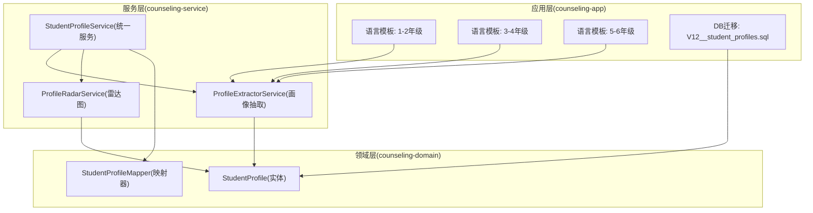
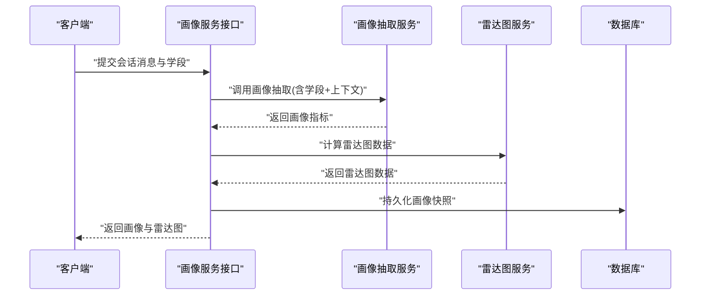
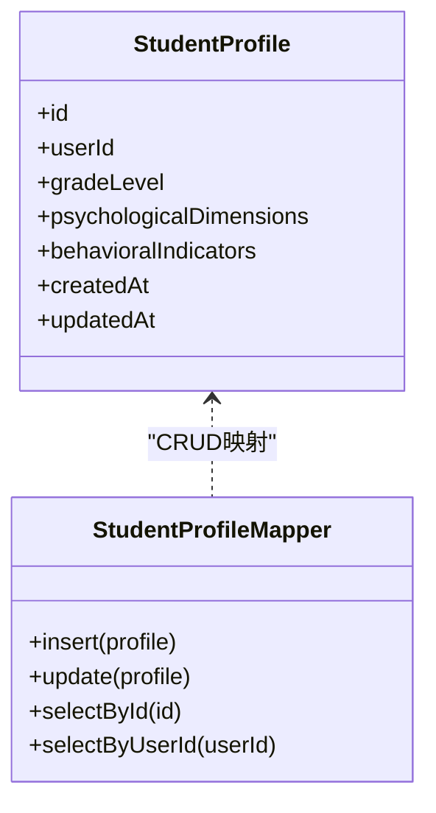
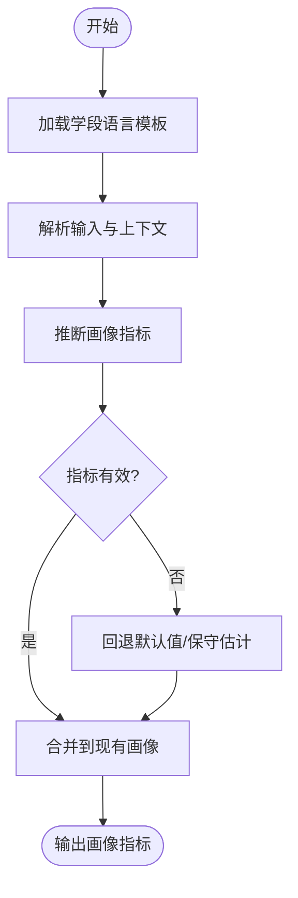
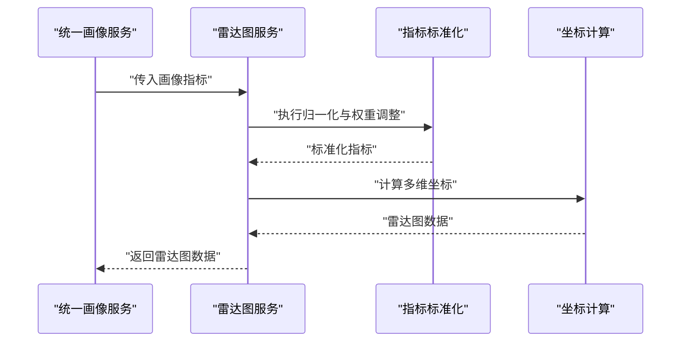
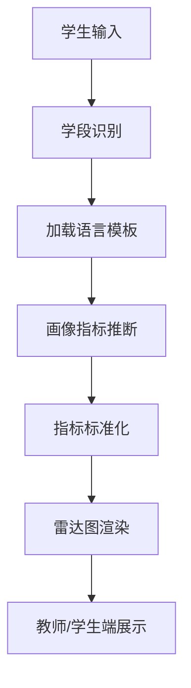
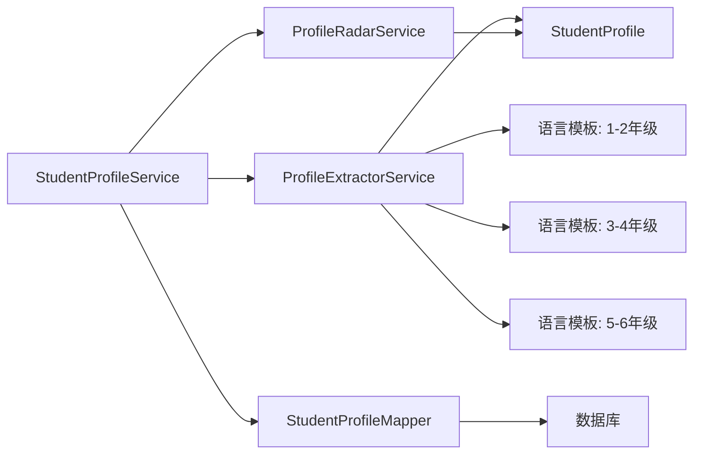

# 年龄自适应画像系统

<cite>
**本文引用的文件**   
- [29_学生画像与年龄适配设计.md](file://design/29_学生画像与年龄适配设计.md)
- [StudentProfile.java](file://backend/counseling-domain/src/main/java/com/mindsafe/domain/entity/StudentProfile.java)
- [StudentProfileMapper.java](file://backend/counseling-domain/src/main/java/com/mindsafe/domain/mapper/StudentProfileMapper.java)
- [V12__student_profiles.sql](file://backend/counseling-app/src/main/resources/db/migration/V12__student_profiles.sql)
- [ProfileExtractorService.java](file://backend/counseling-service/src/main/java/com/mindsafe/service/profile/ProfileExtractorService.java)
- [ProfileRadarService.java](file://backend/counseling-service/src/main/java/com/mindsafe/service/profile/ProfileRadarService.java)
- [StudentProfileService.java](file://backend/counseling-service/src/main/java/com/mindsafe/service/profile/StudentProfileService.java)
- [child_language_grade_1_2_zh-CN_v1.0.0.md](file://backend/counseling-app/src/main/resources/prompts/language/child_language_grade_1_2_zh-CN_v1.0.0.md)
- [child_language_grade_3_4_zh-CN_v1.0.0.md](file://backend/counseling-app/src/main/resources/prompts/language/child_language_grade_3_4_zh-CN_v1.0.0.md)
- [child_language_grade_5_6_zh-CN_v1.0.0.md](file://backend/counseling-app/src/main/resources/prompts/language/child_language_grade_5_6_zh-CN_v1.0.0.md)
</cite>

## 目录
1. [引言](#引言)
2. [项目结构](#项目结构)
3. [核心组件](#核心组件)
4. [架构总览](#架构总览)
5. [详细组件分析](#详细组件分析)
6. [依赖关系分析](#依赖关系分析)
7. [性能考量](#性能考量)
8. [故障排查指南](#故障排查指南)
9. [结论](#结论)
10. [附录](#附录)

## 引言
本文件围绕“年龄自适应画像系统”展开，聚焦于学生画像的建模、抽取、可视化与基于年龄段的语言适配策略。该能力贯穿后端领域模型、服务层、提示词模板以及数据库迁移脚本，为不同年龄段的学生提供差异化的对话风格与内容呈现，同时沉淀可复用的画像指标与雷达图展示能力。

## 项目结构
年龄自适应画像相关代码分布在以下模块：
- 领域模型与数据访问：counseling-domain（实体、映射器）
- 业务服务：counseling-service（画像抽取、雷达图计算、统一服务）
- 应用配置与提示词：counseling-app（按年龄段划分的语言提示词模板）
- 数据库迁移：counseling-app（学生画像表结构与字段演进）

图表来源
- [StudentProfile.java](file://backend/counseling-domain/src/main/java/com/mindsafe/domain/entity/StudentProfile.java)
- [StudentProfileMapper.java](file://backend/counseling-domain/src/main/java/com/mindsafe/domain/mapper/StudentProfileMapper.java)
- [ProfileExtractorService.java](file://backend/counseling-service/src/main/java/com/mindsafe/service/profile/ProfileExtractorService.java)
- [ProfileRadarService.java](file://backend/counseling-service/src/main/java/com/mindsafe/service/profile/ProfileRadarService.java)
- [StudentProfileService.java](file://backend/counseling-service/src/main/java/com/mindsafe/service/profile/StudentProfileService.java)
- [child_language_grade_1_2_zh-CN_v1.0.0.md](file://backend/counseling-app/src/main/resources/prompts/language/child_language_grade_1_2_zh-CN_v1.0.0.md)
- [child_language_grade_3_4_zh-CN_v1.0.0.md](file://backend/counseling-app/src/main/resources/prompts/language/child_language_grade_3_4_zh-CN_v1.0.0.md)
- [child_language_grade_5_6_zh-CN_v1.0.0.md](file://backend/counseling-app/src/main/resources/prompts/language/child_language_grade_5_6_zh-CN_v1.0.0.md)
- [V12__student_profiles.sql](file://backend/counseling-app/src/main/resources/db/migration/V12__student_profiles.sql)

章节来源
- [29_学生画像与年龄适配设计.md](file://design/29_学生画像与年龄适配设计.md)

## 核心组件
- 学生画像实体：承载学生的基础属性与画像维度，作为跨服务的统一数据载体。
- 画像抽取服务：依据会话上下文与用户输入，结合年龄段提示词，生成或更新画像指标。
- 雷达图服务：将画像指标标准化并绘制多维雷达图，用于教师端与学生端的可视化。
- 统一画像服务：对外暴露画像查询、更新、合并与版本管理等能力，协调抽取与可视化。
- 年龄段语言模板：针对不同学段（如1-2、3-4、5-6年级）提供差异化语言风格与表达约束，确保对话内容与认知水平匹配。
- 数据库迁移：定义学生画像表结构与字段演进，保障数据一致性。

章节来源
- [StudentProfile.java](file://backend/counseling-domain/src/main/java/com/mindsafe/domain/entity/StudentProfile.java)
- [ProfileExtractorService.java](file://backend/counseling-service/src/main/java/com/mindsafe/service/profile/ProfileExtractorService.java)
- [ProfileRadarService.java](file://backend/counseling-service/src/main/java/com/mindsafe/service/profile/ProfileRadarService.java)
- [StudentProfileService.java](file://backend/counseling-service/src/main/java/com/mindsafe/service/profile/StudentProfileService.java)
- [child_language_grade_1_2_zh-CN_v1.0.0.md](file://backend/counseling-app/src/main/resources/prompts/language/child_language_grade_1_2_zh-CN_v1.0.0.md)
- [child_language_grade_3_4_zh-CN_v1.0.0.md](file://backend/counseling-app/src/main/resources/prompts/language/child_language_grade_3_4_zh-CN_v1.0.0.md)
- [child_language_grade_5_6_zh-CN_v1.0.0.md](file://backend/counseling-app/src/main/resources/prompts/language/child_language_grade_5_6_zh-CN_v1.0.0.md)
- [V12__student_profiles.sql](file://backend/counseling-app/src/main/resources/db/migration/V12__student_profiles.sql)

## 架构总览
年龄自适应画像系统的整体流程如下：
- 输入：学生会话消息、历史上下文、用户基础信息（含学段）。
- 处理：根据学段选择对应语言模板，驱动画像抽取服务生成指标；由雷达图服务进行标准化与可视化。
- 输出：画像快照、雷达图数据、教师端/学生端展示结果。

图表来源
- [ProfileExtractorService.java](file://backend/counseling-service/src/main/java/com/mindsafe/service/profile/ProfileExtractorService.java)
- [ProfileRadarService.java](file://backend/counseling-service/src/main/java/com/mindsafe/service/profile/ProfileRadarService.java)
- [StudentProfileService.java](file://backend/counseling-service/src/main/java/com/mindsafe/service/profile/StudentProfileService.java)
- [StudentProfileMapper.java](file://backend/counseling-domain/src/main/java/com/mindsafe/domain/mapper/StudentProfileMapper.java)

## 详细组件分析

### 学生画像实体与数据模型
- 实体职责：封装学生画像的核心字段（如基础属性、心理维度、行为指标等），并提供序列化与校验支持。
- 数据访问：通过映射器完成与数据库表的读写操作，保证字段映射一致性与类型安全。
- 数据演进：通过迁移脚本逐步扩展字段，确保向后兼容与平滑升级。

图表来源
- [StudentProfile.java](file://backend/counseling-domain/src/main/java/com/mindsafe/domain/entity/StudentProfile.java)
- [StudentProfileMapper.java](file://backend/counseling-domain/src/main/java/com/mindsafe/domain/mapper/StudentProfileMapper.java)
- [V12__student_profiles.sql](file://backend/counseling-app/src/main/resources/db/migration/V12__student_profiles.sql)

章节来源
- [StudentProfile.java](file://backend/counseling-domain/src/main/java/com/mindsafe/domain/entity/StudentProfile.java)
- [StudentProfileMapper.java](file://backend/counseling-domain/src/main/java/com/mindsafe/domain/mapper/StudentProfileMapper.java)
- [V12__student_profiles.sql](file://backend/counseling-app/src/main/resources/db/migration/V12__student_profiles.sql)

### 画像抽取服务（按年龄段适配）
- 输入：会话消息、历史上下文、学段标识。
- 处理：加载对应学段的语言模板，结合上下文进行语义理解与指标推断，输出结构化画像指标。
- 输出：画像指标集合，供雷达图服务与统一服务使用。

图表来源
- [ProfileExtractorService.java](file://backend/counseling-service/src/main/java/com/mindsafe/service/profile/ProfileExtractorService.java)
- [child_language_grade_1_2_zh-CN_v1.0.0.md](file://backend/counseling-app/src/main/resources/prompts/language/child_language_grade_1_2_zh-CN_v1.0.0.md)
- [child_language_grade_3_4_zh-CN_v1.0.0.md](file://backend/counseling-app/src/main/resources/prompts/language/child_language_grade_3_4_zh-CN_v1.0.0.md)
- [child_language_grade_5_6_zh-CN_v1.0.0.md](file://backend/counseling-app/src/main/resources/prompts/language/child_language_grade_5_6_zh-CN_v1.0.0.md)

章节来源
- [ProfileExtractorService.java](file://backend/counseling-service/src/main/java/com/mindsafe/service/profile/ProfileExtractorService.java)
- [child_language_grade_1_2_zh-CN_v1.0.0.md](file://backend/counseling-app/src/main/resources/prompts/language/child_language_grade_1_2_zh-CN_v1.0.0.md)
- [child_language_grade_3_4_zh-CN_v1.0.0.md](file://backend/counseling-app/src/main/resources/prompts/language/child_language_grade_3_4_zh-CN_v1.0.0.md)
- [child_language_grade_5_6_zh-CN_v1.0.0.md](file://backend/counseling-app/src/main/resources/prompts/language/child_language_grade_5_6_zh-CN_v1.0.0.md)

### 雷达图服务（指标标准化与可视化）
- 输入：画像指标集合。
- 处理：对各项指标进行归一化与权重计算，生成雷达图所需的多维坐标。
- 输出：雷达图数据对象，便于前端渲染。

图表来源
- [ProfileRadarService.java](file://backend/counseling-service/src/main/java/com/mindsafe/service/profile/ProfileRadarService.java)
- [StudentProfileService.java](file://backend/counseling-service/src/main/java/com/mindsafe/service/profile/StudentProfileService.java)

章节来源
- [ProfileRadarService.java](file://backend/counseling-service/src/main/java/com/mindsafe/service/profile/ProfileRadarService.java)
- [StudentProfileService.java](file://backend/counseling-service/src/main/java/com/mindsafe/service/profile/StudentProfileService.java)

### 统一画像服务（对外接口与编排）
- 职责：聚合画像抽取与雷达图能力，提供查询、更新、合并、版本管理等功能。
- 编排：协调各子服务，确保数据一致性与事务边界清晰。
- 扩展：预留接口以接入新的画像维度或评估模型。

章节来源
- [StudentProfileService.java](file://backend/counseling-service/src/main/java/com/mindsafe/service/profile/StudentProfileService.java)

### 年龄段语言模板（差异化对话风格）
- 目标：为不同学段提供符合认知水平的语言风格与表达约束。
- 内容：包含语气、词汇复杂度、句式长度、情感引导方式等。
- 使用：在画像抽取阶段动态加载，确保输入解析与指标推断贴合学段特征。

章节来源
- [child_language_grade_1_2_zh-CN_v1.0.0.md](file://backend/counseling-app/src/main/resources/prompts/language/child_language_grade_1_2_zh-CN_v1.0.0.md)
- [child_language_grade_3_4_zh-CN_v1.0.0.md](file://backend/counseling-app/src/main/resources/prompts/language/child_language_grade_3_4_zh-CN_v1.0.0.md)
- [child_language_grade_5_6_zh-CN_v1.0.0.md](file://backend/counseling-app/src/main/resources/prompts/language/child_language_grade_5_6_zh-CN_v1.0.0.md)

### 概念总览（非代码映射）

[本图为概念性流程图，不直接映射具体源码文件]

## 依赖关系分析
- 领域层与服务层解耦：实体与映射器仅关注数据模型与持久化，服务层负责业务编排。
- 提示词模板与抽取服务耦合：抽取服务依赖语言模板进行语义理解与指标推断。
- 雷达图服务与画像实体耦合：雷达图服务读取画像指标并计算可视化数据。
- 数据库迁移与实体演进：迁移脚本驱动字段扩展，实体随之演进，保持数据结构一致性。

图表来源
- [ProfileExtractorService.java](file://backend/counseling-service/src/main/java/com/mindsafe/service/profile/ProfileExtractorService.java)
- [ProfileRadarService.java](file://backend/counseling-service/src/main/java/com/mindsafe/service/profile/ProfileRadarService.java)
- [StudentProfileService.java](file://backend/counseling-service/src/main/java/com/mindsafe/service/profile/StudentProfileService.java)
- [StudentProfileMapper.java](file://backend/counseling-domain/src/main/java/com/mindsafe/domain/mapper/StudentProfileMapper.java)
- [StudentProfile.java](file://backend/counseling-domain/src/main/java/com/mindsafe/domain/entity/StudentProfile.java)
- [child_language_grade_1_2_zh-CN_v1.0.0.md](file://backend/counseling-app/src/main/resources/prompts/language/child_language_grade_1_2_zh-CN_v1.0.0.md)
- [child_language_grade_3_4_zh-CN_v1.0.0.md](file://backend/counseling-app/src/main/resources/prompts/language/child_language_grade_3_4_zh-CN_v1.0.0.md)
- [child_language_grade_5_6_zh-CN_v1.0.0.md](file://backend/counseling-app/src/main/resources/prompts/language/child_language_grade_5_6_zh-CN_v1.0.0.md)

章节来源
- [StudentProfile.java](file://backend/counseling-domain/src/main/java/com/mindsafe/domain/entity/StudentProfile.java)
- [StudentProfileMapper.java](file://backend/counseling-domain/src/main/java/com/mindsafe/domain/mapper/StudentProfileMapper.java)
- [ProfileExtractorService.java](file://backend/counseling-service/src/main/java/com/mindsafe/service/profile/ProfileExtractorService.java)
- [ProfileRadarService.java](file://backend/counseling-service/src/main/java/com/mindsafe/service/profile/ProfileRadarService.java)
- [StudentProfileService.java](file://backend/counseling-service/src/main/java/com/mindsafe/service/profile/StudentProfileService.java)

## 性能考量
- 画像抽取缓存：对常用学段与输入模式的结果进行缓存，减少重复计算。
- 指标标准化批处理：批量处理多指标以降低CPU开销。
- 数据库读写分离：读多写少场景下，采用只读副本提升查询性能。
- 模板热加载：语言模板变更无需重启服务，降低部署成本。

[本节为通用指导，不直接分析具体文件]

## 故障排查指南
- 指标推断异常：检查学段识别是否正确、语言模板是否加载成功、输入上下文是否完整。
- 雷达图数据为空：确认指标标准化逻辑是否生效、权重配置是否合理。
- 数据不一致：核对迁移脚本版本与实体字段映射，确保数据库与模型同步。
- 日志定位：在服务层增加关键路径日志，追踪抽取与雷达图计算过程。

章节来源
- [ProfileExtractorService.java](file://backend/counseling-service/src/main/java/com/mindsafe/service/profile/ProfileExtractorService.java)
- [ProfileRadarService.java](file://backend/counseling-service/src/main/java/com/mindsafe/service/profile/ProfileRadarService.java)
- [StudentProfileService.java](file://backend/counseling-service/src/main/java/com/mindsafe/service/profile/StudentProfileService.java)
- [V12__student_profiles.sql](file://backend/counseling-app/src/main/resources/db/migration/V12__student_profiles.sql)

## 结论
年龄自适应画像系统通过领域模型、服务编排与语言模板的协同，实现了面向不同学段的学生画像构建与可视化。系统在可扩展性、一致性与用户体验方面具备良好基础，后续可进一步引入更多评估维度与更精细的学段划分，以提升画像精度与个性化服务能力。

[本节为总结性内容，不直接分析具体文件]

## 附录
- 设计参考：详见“学生画像与年龄适配设计”文档，了解整体思路与演进路线。
- 数据模型：学生画像表结构与字段说明见迁移脚本。
- 语言模板：按学段划分的提示词模板用于对话风格与内容适配。

章节来源
- [29_学生画像与年龄适配设计.md](file://design/29_学生画像与年龄适配设计.md)
- [V12__student_profiles.sql](file://backend/counseling-app/src/main/resources/db/migration/V12__student_profiles.sql)
- [child_language_grade_1_2_zh-CN_v1.0.0.md](file://backend/counseling-app/src/main/resources/prompts/language/child_language_grade_1_2_zh-CN_v1.0.0.md)
- [child_language_grade_3_4_zh-CN_v1.0.0.md](file://backend/counseling-app/src/main/resources/prompts/language/child_language_grade_3_4_zh-CN_v1.0.0.md)
- [child_language_grade_5_6_zh-CN_v1.0.0.md](file://backend/counseling-app/src/main/resources/prompts/language/child_language_grade_5_6_zh-CN_v1.0.0.md)
