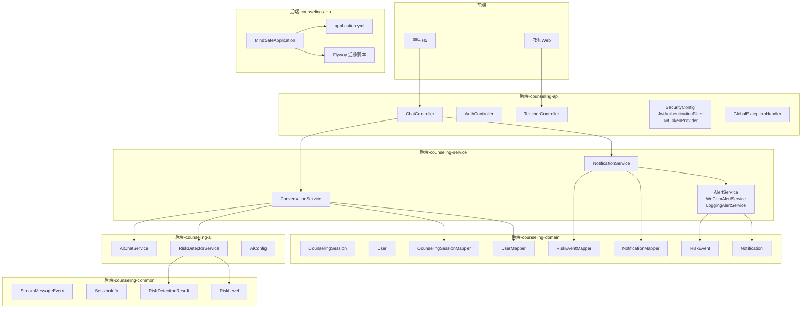
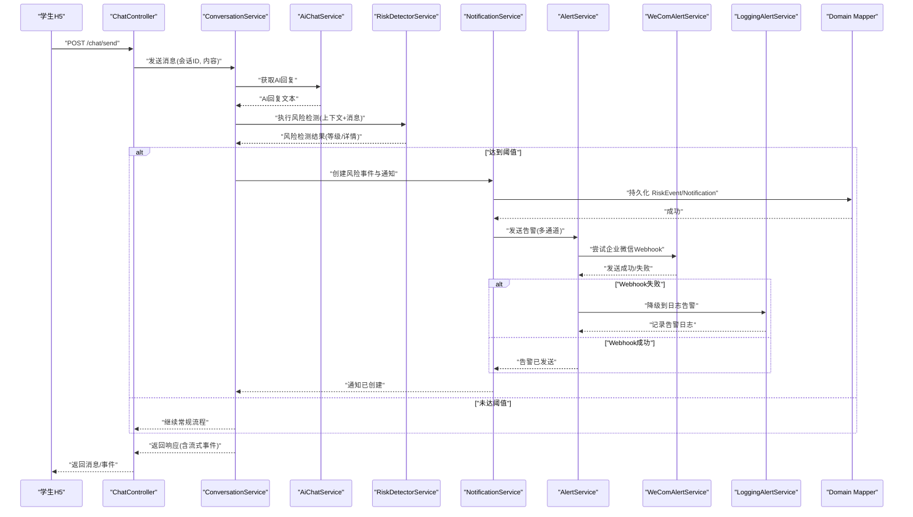
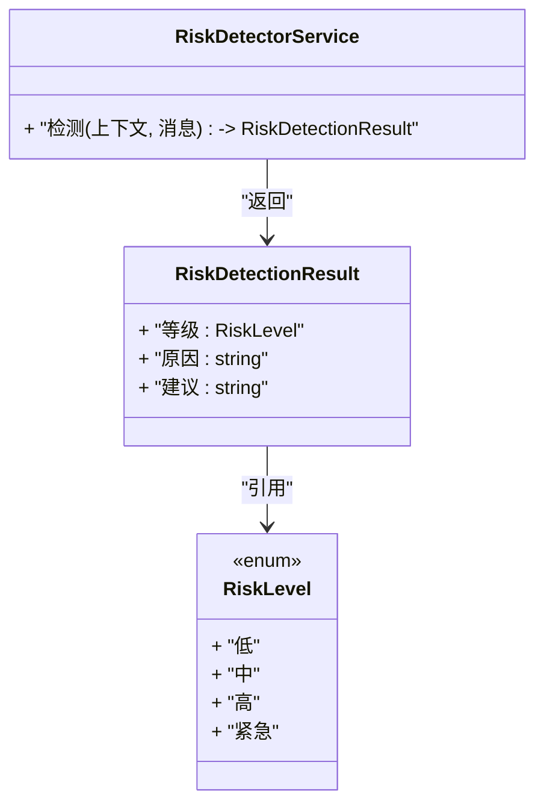
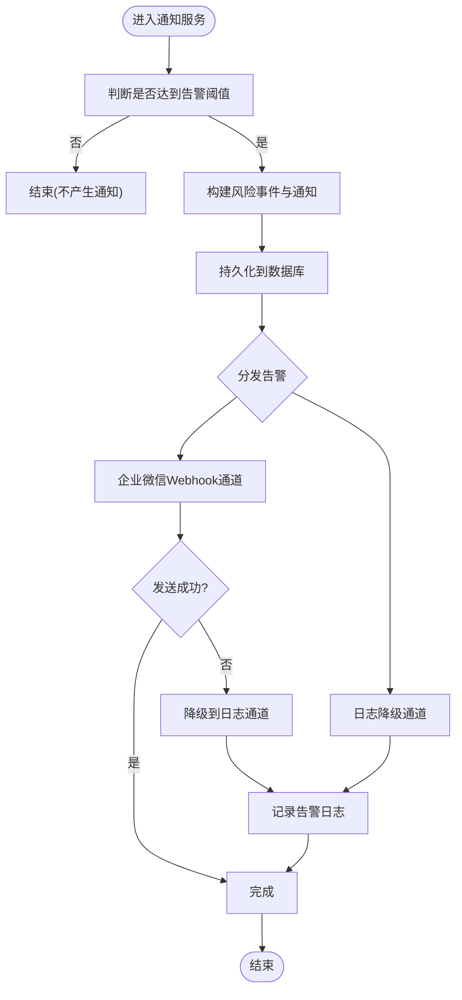
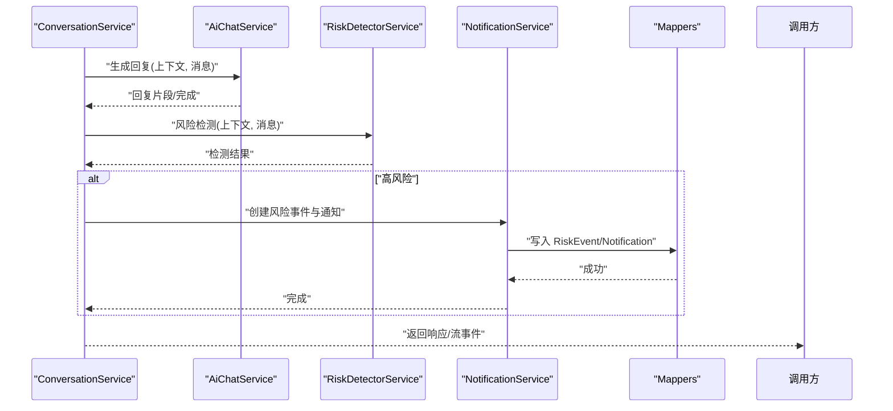
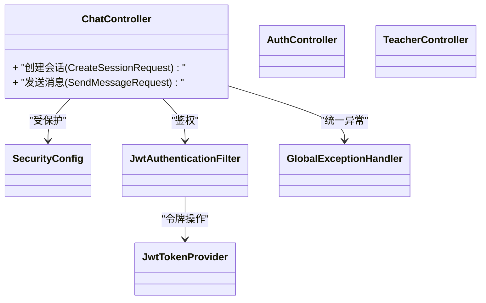
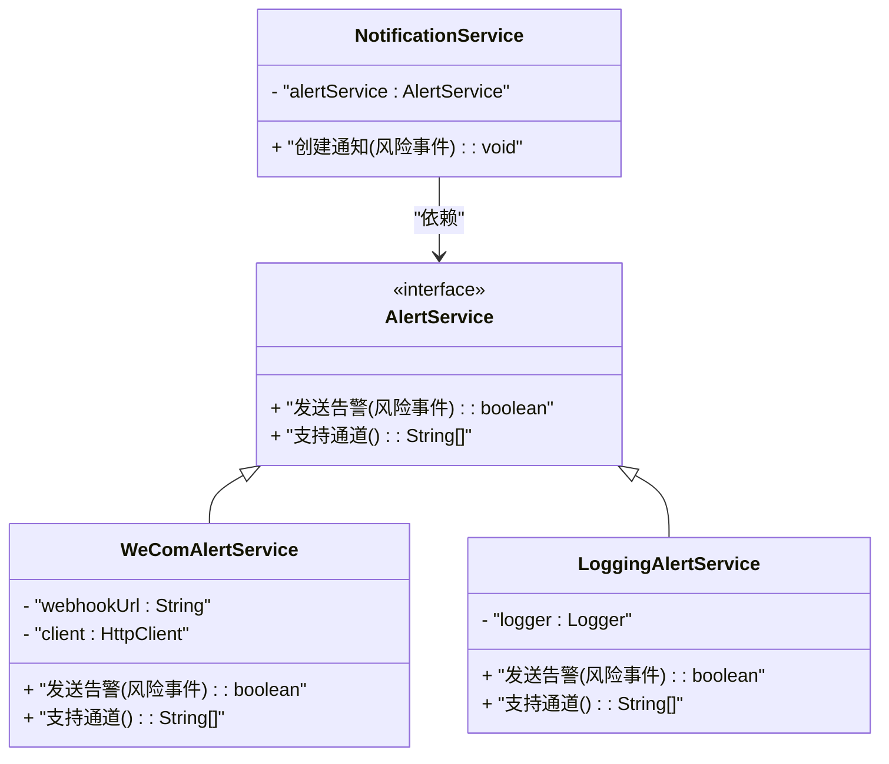
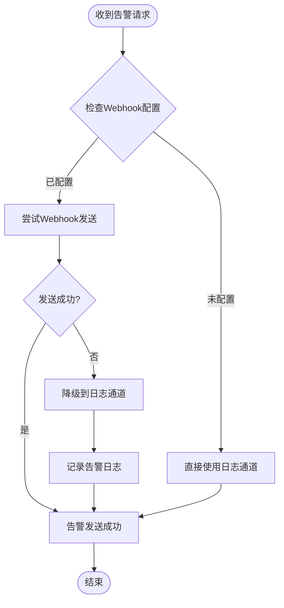
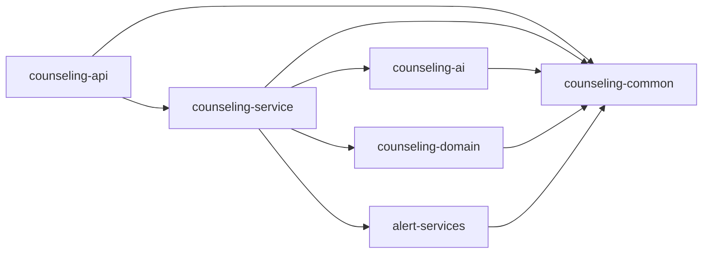

# 实时风险通知系统

<cite>
**本文引用的文件**   
- [RiskDetectorService.java](file://backend/counseling-ai/src/main/java/com/mindsafe/ai/risk/RiskDetectorService.java)
- [RiskDetectorServiceImpl.java](file://backend/counseling-ai/src/main/java/com/mindsafe/ai/risk/RiskDetectorServiceImpl.java)
- [AiChatService.java](file://backend/counseling-ai/src/main/java/com/mindsafe/ai/chat/AiChatService.java)
- [AiChatServiceImpl.java](file://backend/counseling-ai/src/main/java/com/mindsafe/ai/chat/AiChatServiceImpl.java)
- [AiConfig.java](file://backend/counseling-ai/src/main/java/com/mindsafe/ai/config/AiConfig.java)
- [AlertService.java](file://backend/counseling-service/src/main/java/com/mindsafe/service/alert/AlertService.java)
- [WeComAlertService.java](file://backend/counseling-service/src/main/java/com/mindsafe/service/alert/WeComAlertService.java)
- [LoggingAlertService.java](file://backend/counseling-service/src/main/java/com/mindsafe/service/alert/LoggingAlertService.java)
- [NotificationService.java](file://backend/counseling-service/src/main/java/com/mindsafe/service/notification/NotificationService.java)
- [NotificationServiceImpl.java](file://backend/counseling-service/src/main/java/com/mindsafe/service/notification/NotificationServiceImpl.java)
- [ConversationService.java](file://backend/counseling-service/src/main/java/com/mindsafe/service/conversation/ConversationService.java)
- [ConversationServiceImpl.java](file://backend/counseling-service/src/main/java/com/mindsafe/service/conversation/ConversationServiceImpl.java)
- [RiskDetectionResult.java](file://backend/counseling-common/src/main/java/com/mindsafe/common/dto/risk/RiskDetectionResult.java)
- [StreamMessageEvent.java](file://backend/counseling-common/src/main/java/com/mindsafe/common/dto/chat/StreamMessageEvent.java)
- [SessionInfo.java](file://backend/counseling-common/src/main/java/com/mindsafe/common/dto/chat/SessionInfo.java)
- [RiskLevel.java](file://backend/counseling-common/src/main/java/com/mindsafe/common/enums/RiskLevel.java)
- [RiskEvent.java](file://backend/counseling-domain/src/main/java/com/mindsafe/domain/entity/RiskEvent.java)
- [Notification.java](file://backend/counseling-domain/src/main/java/com/mindsafe/domain/entity/Notification.java)
- [CounselingSession.java](file://backend/counseling-domain/src/main/java/com/mindsafe/domain/entity/CounselingSession.java)
- [User.java](file://backend/counseling-domain/src/main/java/com/mindsafe/domain/entity/User.java)
- [RiskEventMapper.java](file://backend/counseling-domain/src/main/java/com/mindsafe/domain/mapper/RiskEventMapper.java)
- [NotificationMapper.java](file://backend/counseling-domain/src/main/java/com/mindsafe/domain/mapper/NotificationMapper.java)
- [CounselingSessionMapper.java](file://backend/counseling-domain/src/main/java/com/mindsafe/domain/mapper/CounselingSessionMapper.java)
- [UserMapper.java](file://backend/counseling-domain/src/main/java/com/mindsafe/domain/mapper/UserMapper.java)
- [SendMessageRequest.java](file://backend/counseling-api/src/main/java/com/mindsafe/api/dto/chat/SendMessageRequest.java)
- [CreateSessionRequest.java](file://backend/counseling-api/src/main/java/com/mindsafe/api/dto/chat/CreateSessionRequest.java)
- [ChatController.java](file://backend/counseling-api/src/main/java/com/mindsafe/api/controller/ChatController.java)
- [AuthController.java](file://backend/counseling-api/src/main/java/com/mindsafe/api/controller/AuthController.java)
- [TeacherController.java](file://backend/counseling-api/src/main/java/com/mindsafe/api/controller/TeacherController.java)
- [JwtAuthenticationFilter.java](file://backend/counseling-api/src/main/java/com/mindsafe/api/security/JwtAuthenticationFilter.java)
- [JwtTokenProvider.java](file://backend/counseling-api/src/main/java/com/mindsafe/api/security/JwtTokenProvider.java)
- [SecurityConfig.java](file://backend/counseling-api/src/main/java/com/mindsafe/api/config/SecurityConfig.java)
- [GlobalExceptionHandler.java](file://backend/counseling-api/src/main/java/com/mindsafe/api/config/GlobalExceptionHandler.java)
- [application.yml](file://backend/counseling-app/src/main/resources/application.yml)
- [V1__init_public_schema.sql](file://backend/counseling-app/src/main/resources/db/migration/V1__init_public_schema.sql)
- [V2__init_tenant_template.sql](file://backend/counseling-app/src/main/resources/db/migration/V2__init_tenant_template.sql)
- [V3__seed_data.sql](file://backend/counseling-app/src/main/resources/db/migration/V3__seed_data.sql)
- [V4__seed_test_users.sql](file://backend/counseling-app/src/main/resources/db/migration/V4__seed_test_users.sql)
- [V5__add_password_hash.sql](file://backend/counseling-app/src/main/resources/db/migration/V5__add_password_hash.sql)
- [MindSafeApplication.java](file://backend/counseling-app/src/main/java/com/mindsafe/app/MindSafeApplication.java)
- [04_风险识别规则库.md](file://design/04_风险识别规则库.md)
- [16_API接口设计.md](file://design/16_API接口设计.md)
- [20_端到端流程设计.md](file://design/20_端到端流程设计.md)
</cite>

## 更新摘要
**变更内容**   
- 新增多通道告警服务架构，支持企业微信Webhook集成
- 实现基于日志的告警降级机制，确保失败条件下的可靠推送
- 增强通知服务的容错性和可扩展性
- 完善告警通道的统一抽象和配置管理

## 目录
1. [简介](#简介)
2. [项目结构](#项目结构)
3. [核心组件](#核心组件)
4. [架构总览](#架构总览)
5. [详细组件分析](#详细组件分析)
6. [多通道告警系统](#多通道告警系统)
7. [依赖关系分析](#依赖关系分析)
8. [性能与可扩展性](#性能与可扩展性)
9. [故障排查指南](#故障排查指南)
10. [结论](#结论)
11. [附录](#附录)

## 简介
本文件面向"实时风险通知系统"的技术文档，聚焦于从学生对话中实时识别心理风险、生成告警事件并推送给老师或管理端的完整链路。系统采用分层微服务式模块划分：API 层暴露 HTTP 接口；AI 能力层负责风险检测与对话处理；领域模型与持久化位于 domain 层；通用 DTO 与枚举在 common 层；业务编排在 service 层；应用启动与配置在 app 层。前端包含学生 H5 与教师 Web 控制台，用于会话交互与风险看板展示。

**更新** 系统现已增强为多通道告警架构，支持企业微信Webhook集成和基于日志的降级机制，确保在各种失败条件下仍能可靠推送告警信息。

## 项目结构
后端采用多模块 Maven 工程，职责清晰、边界明确：
- counseling-api：HTTP 控制器、安全与异常处理、请求 DTO
- counseling-ai：AI 对话与风险检测能力（含提示词资源）
- counseling-service：业务编排（会话、通知、告警等）
- counseling-domain：实体、映射器与数据库迁移脚本
- counseling-common：通用 DTO、枚举、异常
- counseling-app：应用入口、全局配置、数据库初始化
- frontend：学生端 H5 与教师端 Web
- design：产品与技术设计文档

**图表来源**
- [ChatController.java](file://backend/counseling-api/src/main/java/com/mindsafe/api/controller/ChatController.java)
- [ConversationService.java](file://backend/counseling-service/src/main/java/com/mindsafe/service/conversation/ConversationService.java)
- [NotificationService.java](file://backend/counseling-service/src/main/java/com/mindsafe/service/notification/NotificationService.java)
- [AlertService.java](file://backend/counseling-service/src/main/java/com/mindsafe/service/alert/AlertService.java)
- [WeComAlertService.java](file://backend/counseling-service/src/main/java/com/mindsafe/service/alert/WeComAlertService.java)
- [LoggingAlertService.java](file://backend/counseling-service/src/main/java/com/mindsafe/service/alert/LoggingAlertService.java)
- [AiChatService.java](file://backend/counseling-ai/src/main/java/com/mindsafe/ai/chat/AiChatService.java)
- [RiskDetectorService.java](file://backend/counseling-ai/src/main/java/com/mindsafe/ai/risk/RiskDetectorService.java)
- [RiskEvent.java](file://backend/counseling-domain/src/main/java/com/mindsafe/domain/entity/RiskEvent.java)
- [Notification.java](file://backend/counseling-domain/src/main/java/com/mindsafe/domain/entity/Notification.java)
- [StreamMessageEvent.java](file://backend/counseling-common/src/main/java/com/mindsafe/common/dto/chat/StreamMessageEvent.java)
- [RiskDetectionResult.java](file://backend/counseling-common/src/main/java/com/mindsafe/common/dto/risk/RiskDetectionResult.java)
- [RiskLevel.java](file://backend/counseling-common/src/main/java/com/mindsafe/common/enums/RiskLevel.java)
- [application.yml](file://backend/counseling-app/src/main/resources/application.yml)
- [V1__init_public_schema.sql](file://backend/counseling-app/src/main/resources/db/migration/V1__init_public_schema.sql)

章节来源
- [MindSafeApplication.java](file://backend/counseling-app/src/main/java/com/mindsafe/app/MindSafeApplication.java)
- [application.yml](file://backend/counseling-app/src/main/resources/application.yml)
- [V1__init_public_schema.sql](file://backend/counseling-app/src/main/resources/db/migration/V1__init_public_schema.sql)
- [V2__init_tenant_template.sql](file://backend/counseling-app/src/main/resources/db/migration/V2__init_tenant_template.sql)
- [V3__seed_data.sql](file://backend/counseling-app/src/main/resources/db/migration/V3__seed_data.sql)
- [V4__seed_test_users.sql](file://backend/counseling-app/src/main/resources/db/migration/V4__seed_test_users.sql)
- [V5__add_password_hash.sql](file://backend/counseling-app/src/main/resources/db/migration/V5__add_password_hash.sql)

## 核心组件
- 风险检测服务：提供风险识别能力，输出结构化结果与风险等级，供上层编排使用。
- 通知服务：将风险事件落库并生成通知消息，驱动后续推送与看板更新。
- **新增** 告警服务：统一抽象多种告警通道，支持企业微信Webhook和日志降级机制。
- 会话服务：串联对话上下文、调用 AI 能力、触发风险检测与通知。
- API 控制器：对外暴露创建会话、发送消息、教师查询等接口，承载鉴权与异常处理。
- 领域模型与映射器：定义会话、用户、风险事件、通知等实体及持久化访问。
- 通用 DTO 与枚举：统一跨层数据契约与风险等级语义。

**更新** 新增告警服务层，实现了多通道告警的统一抽象，支持灵活的通道扩展和降级策略。

章节来源
- [RiskDetectorService.java](file://backend/counseling-ai/src/main/java/com/mindsafe/ai/risk/RiskDetectorService.java)
- [NotificationService.java](file://backend/counseling-service/src/main/java/com/mindsafe/service/notification/NotificationService.java)
- [AlertService.java](file://backend/counseling-service/src/main/java/com/mindsafe/service/alert/AlertService.java)
- [WeComAlertService.java](file://backend/counseling-service/src/main/java/com/mindsafe/service/alert/WeComAlertService.java)
- [LoggingAlertService.java](file://backend/counseling-service/src/main/java/com/mindsafe/service/alert/LoggingAlertService.java)
- [ConversationService.java](file://backend/counseling-service/src/main/java/com/mindsafe/service/conversation/ConversationService.java)
- [ChatController.java](file://backend/counseling-api/src/main/java/com/mindsafe/api/controller/ChatController.java)
- [RiskEvent.java](file://backend/counseling-domain/src/main/java/com/mindsafe/domain/entity/RiskEvent.java)
- [Notification.java](file://backend/counseling-domain/src/main/java/com/mindsafe/domain/entity/Notification.java)
- [RiskDetectionResult.java](file://backend/counseling-common/src/main/java/com/mindsafe/common/dto/risk/RiskDetectionResult.java)
- [RiskLevel.java](file://backend/counseling-common/src/main/java/com/mindsafe/common/enums/RiskLevel.java)

## 架构总览
系统以"对话即信号"的实时流为核心：学生通过 H5 发送消息，API 层校验与路由至会话服务，会话服务调用 AI 聊天与风险检测，若命中高风险则写入风险事件并生成通知，最终由教师端查看与处置。**更新** 现在通过告警服务层支持多渠道推送，包括企业微信Webhook和日志降级，确保告警的可靠送达。

**图表来源**
- [ChatController.java](file://backend/counseling-api/src/main/java/com/mindsafe/api/controller/ChatController.java)
- [ConversationService.java](file://backend/counseling-service/src/main/java/com/mindsafe/service/conversation/ConversationService.java)
- [AiChatService.java](file://backend/counseling-ai/src/main/java/com/mindsafe/ai/chat/AiChatService.java)
- [RiskDetectorService.java](file://backend/counseling-ai/src/main/java/com/mindsafe/ai/risk/RiskDetectorService.java)
- [NotificationService.java](file://backend/counseling-service/src/main/java/com/mindsafe/service/notification/NotificationService.java)
- [AlertService.java](file://backend/counseling-service/src/main/java/com/mindsafe/service/alert/AlertService.java)
- [WeComAlertService.java](file://backend/counseling-service/src/main/java/com/mindsafe/service/alert/WeComAlertService.java)
- [LoggingAlertService.java](file://backend/counseling-service/src/main/java/com/mindsafe/service/alert/LoggingAlertService.java)
- [RiskEventMapper.java](file://backend/counseling-domain/src/main/java/com/mindsafe/domain/mapper/RiskEventMapper.java)
- [NotificationMapper.java](file://backend/counseling-domain/src/main/java/com/mindsafe/domain/mapper/NotificationMapper.java)

## 详细组件分析

### 风险检测服务（RiskDetectorService）
- 职责：基于对话上下文与当前消息进行风险识别，返回结构化结果与风险等级。
- 输入：会话上下文、最新消息、必要策略参数。
- 输出：风险检测结果对象，包含等级、原因、建议等字段。
- 关键实现要点：
  - 与提示词/规则库协同（参考设计文档），支持可配置阈值与策略。
  - 与 AI 聊天服务解耦，便于替换不同检测算法或外部模型。
  - 对异常与超时具备容错，避免阻塞主流程。

**图表来源**
- [RiskDetectorService.java](file://backend/counseling-ai/src/main/java/com/mindsafe/ai/risk/RiskDetectorService.java)
- [RiskDetectionResult.java](file://backend/counseling-common/src/main/java/com/mindsafe/common/dto/risk/RiskDetectionResult.java)
- [RiskLevel.java](file://backend/counseling-common/src/main/java/com/mindsafe/common/enums/RiskLevel.java)

章节来源
- [RiskDetectorService.java](file://backend/counseling-ai/src/main/java/com/mindsafe/ai/risk/RiskDetectorService.java)
- [RiskDetectionResult.java](file://backend/counseling-common/src/main/java/com/mindsafe/common/dto/risk/RiskDetectionResult.java)
- [RiskLevel.java](file://backend/counseling-common/src/main/java/com/mindsafe/common/enums/RiskLevel.java)
- [04_风险识别规则库.md](file://design/04_风险识别规则库.md)

### 通知服务（NotificationService）
- 职责：当风险检测结果达到阈值时，创建风险事件与通知记录，支撑教师端看板与后续处置。
- 输入：风险检测结果、会话信息、用户标识。
- 输出：持久化的风险事件与通知记录 ID。
- 关键实现要点：
  - 幂等与去重：同一会话短时间内的重复告警需合并或抑制。
  - 异步化：通知写入与后续推送可异步执行，降低主路径延迟。
  - 审计追踪：保留触发源、时间戳、处置状态等元数据。
  - **更新** 集成告警服务，支持多渠道推送和降级机制。

**图表来源**
- [NotificationService.java](file://backend/counseling-service/src/main/java/com/mindsafe/service/notification/NotificationService.java)
- [NotificationServiceImpl.java](file://backend/counseling-service/src/main/java/com/mindsafe/service/notification/NotificationServiceImpl.java)
- [AlertService.java](file://backend/counseling-service/src/main/java/com/mindsafe/service/alert/AlertService.java)
- [WeComAlertService.java](file://backend/counseling-service/src/main/java/com/mindsafe/service/alert/WeComAlertService.java)
- [LoggingAlertService.java](file://backend/counseling-service/src/main/java/com/mindsafe/service/alert/LoggingAlertService.java)
- [RiskEvent.java](file://backend/counseling-domain/src/main/java/com/mindsafe/domain/entity/RiskEvent.java)
- [Notification.java](file://backend/counseling-domain/src/main/java/com/mindsafe/domain/entity/Notification.java)
- [RiskEventMapper.java](file://backend/counseling-domain/src/main/java/com/mindsafe/domain/mapper/RiskEventMapper.java)
- [NotificationMapper.java](file://backend/counseling-domain/src/main/java/com/mindsafe/domain/mapper/NotificationMapper.java)

章节来源
- [NotificationService.java](file://backend/counseling-service/src/main/java/com/mindsafe/service/notification/NotificationService.java)
- [NotificationServiceImpl.java](file://backend/counseling-service/src/main/java/com/mindsafe/service/notification/NotificationServiceImpl.java)
- [AlertService.java](file://backend/counseling-service/src/main/java/com/mindsafe/service/alert/AlertService.java)
- [WeComAlertService.java](file://backend/counseling-service/src/main/java/com/mindsafe/service/alert/WeComAlertService.java)
- [LoggingAlertService.java](file://backend/counseling-service/src/main/java/com/mindsafe/service/alert/LoggingAlertService.java)
- [RiskEvent.java](file://backend/counseling-domain/src/main/java/com/mindsafe/domain/entity/RiskEvent.java)
- [Notification.java](file://backend/counseling-domain/src/main/java/com/mindsafe/domain/entity/Notification.java)
- [RiskEventMapper.java](file://backend/counseling-domain/src/main/java/com/mindsafe/domain/mapper/RiskEventMapper.java)
- [NotificationMapper.java](file://backend/counseling-domain/src/main/java/com/mindsafe/domain/mapper/NotificationMapper.java)

### 会话服务（ConversationService）
- 职责：编排对话流程，协调 AI 聊天与风险检测，并在需要时触发通知。
- 输入：会话 ID、消息内容、用户上下文。
- 输出：AI 回复、流式事件、风险相关副作用（如通知）。
- 关键实现要点：
  - 流式响应：结合 StreamMessageEvent 逐步返回片段，提升用户体验。
  - 上下文维护：缓存最近 N 条消息作为检测窗口，控制内存占用。
  - 错误隔离：AI 或风险检测失败不影响基础对话可用性。

**图表来源**
- [ConversationService.java](file://backend/counseling-service/src/main/java/com/mindsafe/service/conversation/ConversationService.java)
- [ConversationServiceImpl.java](file://backend/counseling-service/src/main/java/com/mindsafe/service/conversation/ConversationServiceImpl.java)
- [AiChatService.java](file://backend/counseling-ai/src/main/java/com/mindsafe/ai/chat/AiChatService.java)
- [RiskDetectorService.java](file://backend/counseling-ai/src/main/java/com/mindsafe/ai/risk/RiskDetectorService.java)
- [NotificationService.java](file://backend/counseling-service/src/main/java/com/mindsafe/service/notification/NotificationService.java)
- [StreamMessageEvent.java](file://backend/counseling-common/src/main/java/com/mindsafe/common/dto/chat/StreamMessageEvent.java)

章节来源
- [ConversationService.java](file://backend/counseling-service/src/main/java/com/mindsafe/service/conversation/ConversationService.java)
- [ConversationServiceImpl.java](file://backend/counseling-service/src/main/java/com/mindsafe/service/conversation/ConversationServiceImpl.java)
- [AiChatService.java](file://backend/counseling-ai/src/main/java/com/mindsafe/ai/chat/AiChatService.java)
- [StreamMessageEvent.java](file://backend/counseling-common/src/main/java/com/mindsafe/common/dto/chat/StreamMessageEvent.java)

### API 控制器与安全
- ChatController：提供创建会话、发送消息等接口，接收 SendMessageRequest/CreateSessionRequest。
- AuthController：认证相关接口。
- TeacherController：教师端查询风险事件、通知等。
- 安全：SecurityConfig 配置白名单与拦截器，JwtAuthenticationFilter 解析令牌，JwtTokenProvider 生成/校验令牌。
- 异常：GlobalExceptionHandler 统一错误码与响应体。

**图表来源**
- [ChatController.java](file://backend/counseling-api/src/main/java/com/mindsafe/api/controller/ChatController.java)
- [AuthController.java](file://backend/counseling-api/src/main/java/com/mindsafe/api/controller/AuthController.java)
- [TeacherController.java](file://backend/counseling-api/src/main/java/com/mindsafe/api/controller/TeacherController.java)
- [SecurityConfig.java](file://backend/counseling-api/src/main/java/com/mindsafe/api/config/SecurityConfig.java)
- [JwtAuthenticationFilter.java](file://backend/counseling-api/src/main/java/com/mindsafe/api/security/JwtAuthenticationFilter.java)
- [JwtTokenProvider.java](file://backend/counseling-api/src/main/java/com/mindsafe/api/security/JwtTokenProvider.java)
- [GlobalExceptionHandler.java](file://backend/counseling-api/src/main/java/com/mindsafe/api/config/GlobalExceptionHandler.java)
- [SendMessageRequest.java](file://backend/counseling-api/src/main/java/com/mindsafe/api/dto/chat/SendMessageRequest.java)
- [CreateSessionRequest.java](file://backend/counseling-api/src/main/java/com/mindsafe/api/dto/chat/CreateSessionRequest.java)

章节来源
- [ChatController.java](file://backend/counseling-api/src/main/java/com/mindsafe/api/controller/ChatController.java)
- [AuthController.java](file://backend/counseling-api/src/main/java/com/mindsafe/api/controller/AuthController.java)
- [TeacherController.java](file://backend/counseling-api/src/main/java/com/mindsafe/api/controller/TeacherController.java)
- [SecurityConfig.java](file://backend/counseling-api/src/main/java/com/mindsafe/api/config/SecurityConfig.java)
- [JwtAuthenticationFilter.java](file://backend/counseling-api/src/main/java/com/mindsafe/api/security/JwtAuthenticationFilter.java)
- [JwtTokenProvider.java](file://backend/counseling-api/src/main/java/com/mindsafe/api/security/JwtTokenProvider.java)
- [GlobalExceptionHandler.java](file://backend/counseling-api/src/main/java/com/mindsafe/api/config/GlobalExceptionHandler.java)
- [SendMessageRequest.java](file://backend/counseling-api/src/main/java/com/mindsafe/api/dto/chat/SendMessageRequest.java)
- [CreateSessionRequest.java](file://backend/counseling-api/src/main/java/com/mindsafe/api/dto/chat/CreateSessionRequest.java)

### AI 配置与提示词
- AiConfig：集中管理 AI 相关配置（如模型、超时、重试、温度等）。
- prompts：按语言、安全、技能、系统、任务分类存放提示词模板，支撑风险检测与对话生成。

章节来源
- [AiConfig.java](file://backend/counseling-ai/src/main/java/com/mindsafe/ai/config/AiConfig.java)
- [04_风险识别规则库.md](file://design/04_风险识别规则库.md)

## 多通道告警系统

### 告警服务架构
**新增** 系统引入了统一的告警服务层，通过接口抽象支持多种告警通道，实现了灵活的可插拔架构。

**图表来源**
- [AlertService.java](file://backend/counseling-service/src/main/java/com/mindsafe/service/alert/AlertService.java)
- [WeComAlertService.java](file://backend/counseling-service/src/main/java/com/mindsafe/service/alert/WeComAlertService.java)
- [LoggingAlertService.java](file://backend/counseling-service/src/main/java/com/mindsafe/service/alert/LoggingAlertService.java)
- [NotificationService.java](file://backend/counseling-service/src/main/java/com/mindsafe/service/notification/NotificationService.java)

### 企业微信Webhook集成
**新增** 企业微信Webhook通道提供了实时的团队通知能力，支持富文本消息和@提醒功能。

- 配置项：webhook URL、消息模板、@成员配置
- 特性：支持HTML格式、图片、按钮等富媒体内容
- 容错：网络超时自动重试，失败自动降级到日志通道
- 监控：详细的发送状态记录和错误统计

### 日志降级机制
**新增** 基于日志的告警降级机制确保在主通道失败时仍能记录告警信息。

- 降级触发：Webhook发送失败、网络异常、超时等情况
- 日志格式：结构化JSON格式，包含完整的风险事件信息
- 存储策略：按日期分文件，支持日志轮转和清理
- 检索能力：支持关键字搜索和时间范围过滤

### 告警通道选择策略
系统采用智能通道选择策略，优先使用企业微信Webhook，失败时自动降级到日志通道。

**图表来源**
- [AlertService.java](file://backend/counseling-service/src/main/java/com/mindsafe/service/alert/AlertService.java)
- [WeComAlertService.java](file://backend/counseling-service/src/main/java/com/mindsafe/service/alert/WeComAlertService.java)
- [LoggingAlertService.java](file://backend/counseling-service/src/main/java/com/mindsafe/service/alert/LoggingAlertService.java)

章节来源
- [AlertService.java](file://backend/counseling-service/src/main/java/com/mindsafe/service/alert/AlertService.java)
- [WeComAlertService.java](file://backend/counseling-service/src/main/java/com/mindsafe/service/alert/WeComAlertService.java)
- [LoggingAlertService.java](file://backend/counseling-service/src/main/java/com/mindsafe/service/alert/LoggingAlertService.java)

## 依赖关系分析
- 模块耦合：
  - api 依赖 service、common；service 依赖 ai、domain、common；ai 依赖 common；domain 仅依赖 common。
  - **更新** service 层新增 alert 子模块，notification 依赖 alert 服务。
- 外部依赖：
  - 数据库迁移脚本由 Flyway 驱动，应用启动时自动执行。
  - JWT 鉴权贯穿所有受保护接口。
  - **新增** HTTP客户端依赖用于企业微信Webhook通信。
- 潜在循环依赖：
  - 通过 DTO 与接口抽象避免直接循环；确保 service 与 ai 之间通过接口通信。

**图表来源**
- [ChatController.java](file://backend/counseling-api/src/main/java/com/mindsafe/api/controller/ChatController.java)
- [ConversationService.java](file://backend/counseling-service/src/main/java/com/mindsafe/service/conversation/ConversationService.java)
- [RiskDetectorService.java](file://backend/counseling-ai/src/main/java/com/mindsafe/ai/risk/RiskDetectorService.java)
- [AlertService.java](file://backend/counseling-service/src/main/java/com/mindsafe/service/alert/AlertService.java)
- [RiskEvent.java](file://backend/counseling-domain/src/main/java/com/mindsafe/domain/entity/RiskEvent.java)
- [RiskDetectionResult.java](file://backend/counseling-common/src/main/java/com/mindsafe/common/dto/risk/RiskDetectionResult.java)

章节来源
- [ChatController.java](file://backend/counseling-api/src/main/java/com/mindsafe/api/controller/ChatController.java)
- [ConversationService.java](file://backend/counseling-service/src/main/java/com/mindsafe/service/conversation/ConversationService.java)
- [RiskDetectorService.java](file://backend/counseling-ai/src/main/java/com/mindsafe/ai/risk/RiskDetectorService.java)
- [AlertService.java](file://backend/counseling-service/src/main/java/com/mindsafe/service/alert/AlertService.java)
- [RiskEvent.java](file://backend/counseling-domain/src/main/java/com/mindsafe/domain/entity/RiskEvent.java)
- [RiskDetectionResult.java](file://backend/counseling-common/src/main/java/com/mindsafe/common/dto/risk/RiskDetectionResult.java)

## 性能与可扩展性
- 流式响应：使用 StreamMessageEvent 分片返回，降低首包延迟，提升交互体验。
- 风险检测批量化：对高频消息可采用滑动窗口与批量检测，减少模型调用次数。
- 异步通知：将风险事件与通知写入、推送任务放入队列，削峰填谷。
- 上下文裁剪：限制会话历史长度，控制内存与推理成本。
- 可观测性：为关键路径埋点（耗时、错误率、告警量），配合日志与指标采集。
- **更新** 多通道告警：支持并行发送和快速失败，提高告警送达率。
- **更新** 降级机制：自动故障转移，确保告警系统的可靠性。

[本节为通用指导，无需源码引用]

## 故障排查指南
- 鉴权失败：检查 JwtTokenProvider 与过滤器链配置，确认 Token 签发与校验逻辑一致。
- 风险检测超时：调整 AiConfig 中的超时与重试策略，必要时降级为本地规则。
- 通知未生成：核对阈值策略与幂等逻辑，检查数据库写入与事务回滚情况。
- 流式中断：检查网络与 SSE/WS 通道稳定性，增加断线重连与心跳机制。
- 数据不一致：对比 RiskEvent 与 Notification 的关联键，确保会话与用户标识正确传递。
- **新增** Webhook发送失败：检查企业微信Webhook URL配置和网络连通性，查看降级日志。
- **新增** 告警通道异常：检查各通道配置和服务状态，确认降级机制正常工作。

章节来源
- [JwtTokenProvider.java](file://backend/counseling-api/src/main/java/com/mindsafe/api/security/JwtTokenProvider.java)
- [JwtAuthenticationFilter.java](file://backend/counseling-api/src/main/java/com/mindsafe/api/security/JwtAuthenticationFilter.java)
- [SecurityConfig.java](file://backend/counseling-api/src/main/java/com/mindsafe/api/config/SecurityConfig.java)
- [AiConfig.java](file://backend/counseling-ai/src/main/java/com/mindsafe/ai/config/AiConfig.java)
- [NotificationService.java](file://backend/counseling-service/src/main/java/com/mindsafe/service/notification/NotificationService.java)
- [AlertService.java](file://backend/counseling-service/src/main/java/com/mindsafe/service/alert/AlertService.java)
- [WeComAlertService.java](file://backend/counseling-service/src/main/java/com/mindsafe/service/alert/WeComAlertService.java)
- [LoggingAlertService.java](file://backend/counseling-service/src/main/java/com/mindsafe/service/alert/LoggingAlertService.java)
- [RiskEventMapper.java](file://backend/counseling-domain/src/main/java/com/mindsafe/domain/mapper/RiskEventMapper.java)
- [NotificationMapper.java](file://backend/counseling-domain/src/main/java/com/mindsafe/domain/mapper/NotificationMapper.java)

## 结论
本系统围绕"对话即信号"的理念，将风险检测嵌入到会话主流程中，通过清晰的模块边界与统一的 DTO/枚举契约，实现了从消息到告警的端到端闭环。**更新** 新增的多通道告警系统进一步增强了系统的可靠性，通过企业微信Webhook集成和日志降级机制，确保在各种失败条件下仍能可靠推送告警信息。建议在后续迭代中完善异步化、可观测性与策略可配置能力，进一步提升系统的稳定性与扩展性。

[本节为总结性内容，无需源码引用]

## 附录
- API 接口设计参考：[16_API接口设计.md](file://design/16_API接口设计.md)
- 端到端流程设计参考：[20_端到端流程设计.md](file://design/20_端到端流程设计.md)
- 风险识别规则库参考：[04_风险识别规则库.md](file://design/04_风险识别规则库.md)

章节来源
- [16_API接口设计.md](file://design/16_API接口设计.md)
- [20_端到端流程设计.md](file://design/20_端到端流程设计.md)
- [04_风险识别规则库.md](file://design/04_风险识别规则库.md)