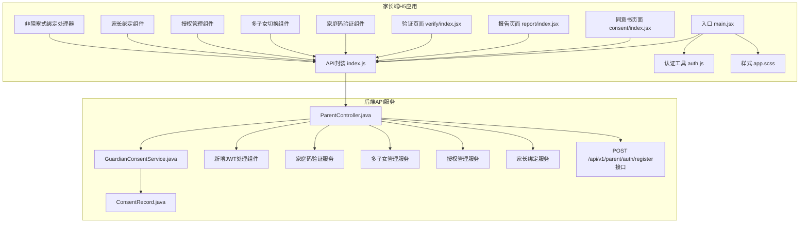
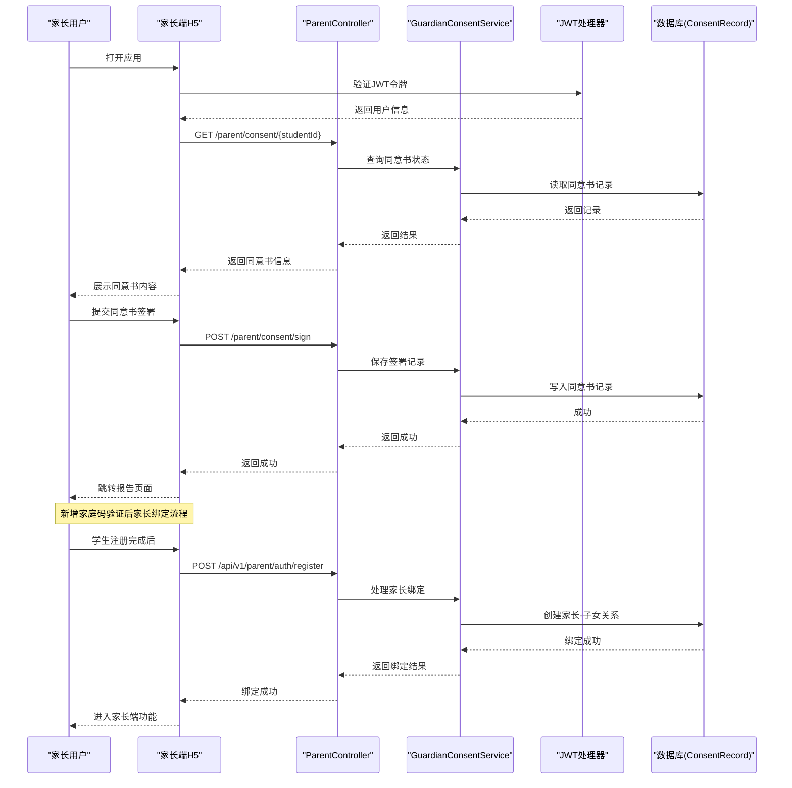
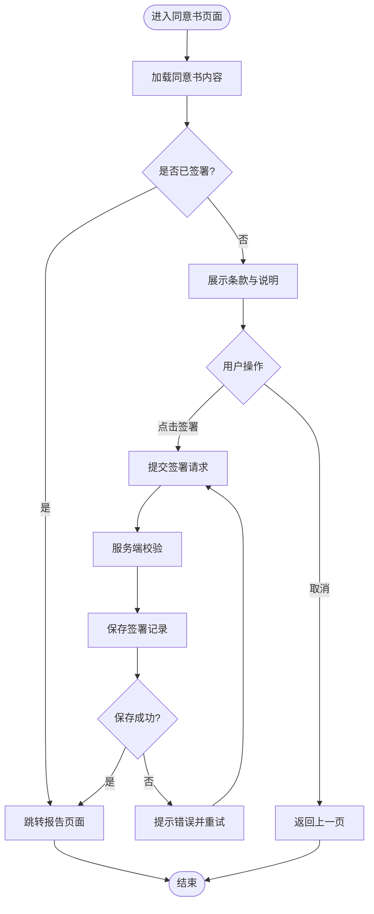
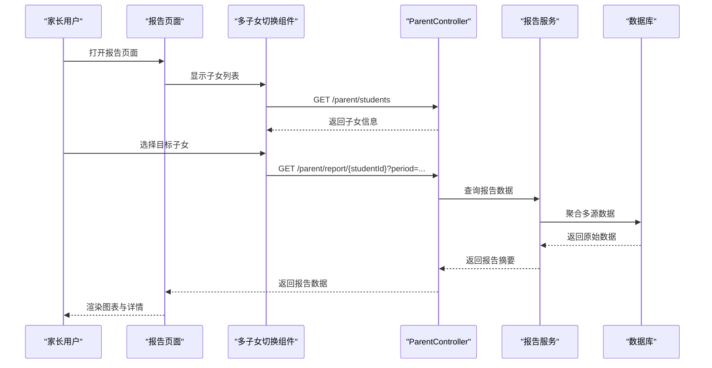
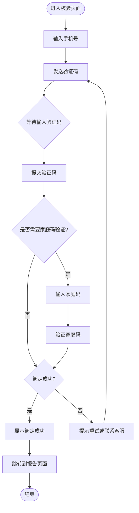
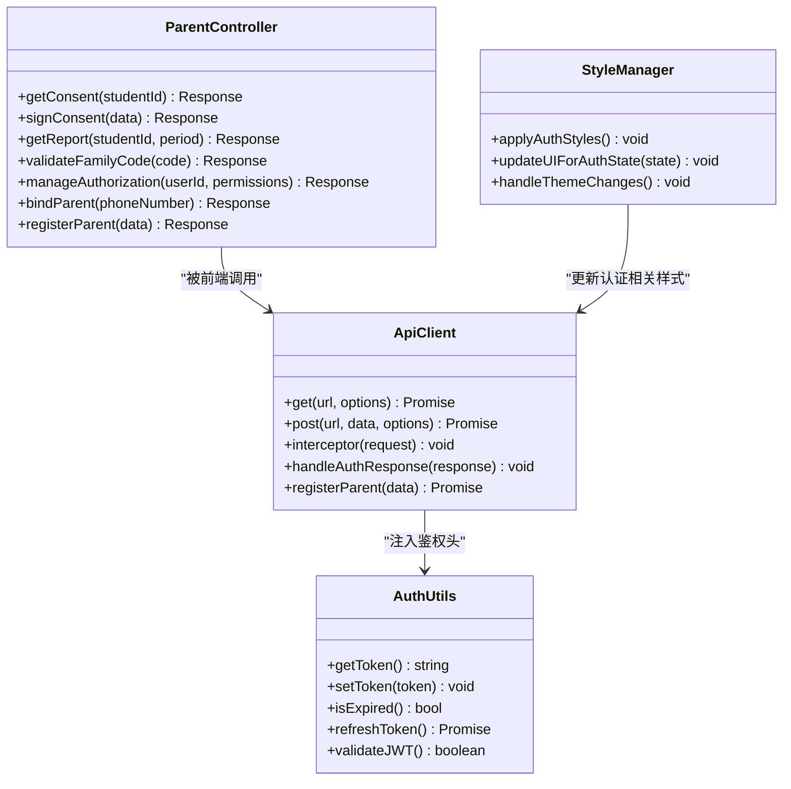
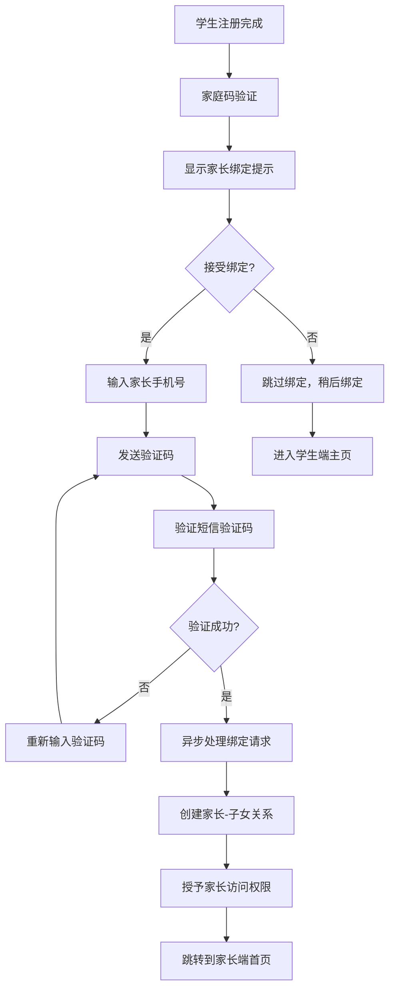
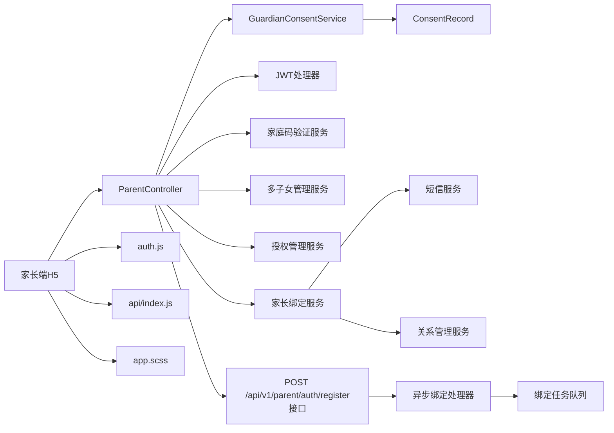

# 家长端H5应用

<cite>
**本文引用的文件**   
- [frontend/parent-h5/src/main.jsx](file://frontend/parent-h5/src/main.jsx)
- [frontend/parent-h5/src/api/index.js](file://frontend/parent-h5/src/api/index.js)
- [frontend/parent-h5/src/pages/consent/index.jsx](file://frontend/parent-h5/src/pages/consent/index.jsx)
- [frontend/parent-h5/src/pages/report/index.jsx](file://frontend/parent-h5/src/pages/report/index.jsx)
- [frontend/parent-h5/src/pages/verify/index.jsx](file://frontend/parent-h5/src/pages/verify/index.jsx)
- [frontend/parent-h5/src/utils/auth.js](file://frontend/parent-h5/src/utils/auth.js)
- [frontend/parent-h5/app.scss](file://frontend/parent-h5/app.scss)
- [frontend/parent-h5/package.json](file://frontend/parent-h5/package.json)
- [frontend/parent-h5/vite.config.js](file://frontend/parent-h5/vite.config.js)
- [backend/counseling-api/src/main/java/com/mindsafe/api/controller/ParentController.java](file://backend/counseling-api/src/main/java/com/mindsafe/api/controller/ParentController.java)
- [backend/counseling-service/src/main/java/com/mindsafe/service/consent/GuardianConsentService.java](file://backend/counseling-service/src/main/java/com/mindsafe/service/consent/GuardianConsentService.java)
- [backend/counseling-domain/src/main/java/com/mindsafe/domain/entity/ConsentRecord.java](file://backend/counseling-domain/src/main/java/com/mindsafe/domain/entity/ConsentRecord.java)
- [design/26_家长端H5与小程序设计.md](file://design/26_家长端H5与小程序设计.md)
</cite>

## 更新摘要
**所做更改**   
- 新增了家庭码验证后家长绑定手机号功能流程的详细说明，包括可选的非阻塞式绑定机制
- 更新了认证流程章节，反映新的POST /api/v1/parent/auth/register API接口支持
- 增强了家长绑定功能的文档描述，详细说明绑定流程和权限控制机制
- 完善了家庭码验证注册界面的功能说明
- 更新了多子女报告切换界面功能描述
- 增强了授权管理功能的文档说明
- 更新了样式文件变更以支持新的认证流程
- 完善了API集成架构的文档描述

## 目录
1. [简介](#简介)
2. [项目结构](#项目结构)
3. [核心组件](#核心组件)
4. [架构总览](#架构总览)
5. [详细组件分析](#详细组件分析)
6. [依赖关系分析](#依赖关系分析)
7. [性能考虑](#性能考虑)
8. [故障排查指南](#故障排查指南)
9. [结论](#结论)
10. [附录](#附录)

## 简介
本文件面向"家长端H5应用"的技术文档，聚焦前端H5页面、后端接口与服务协作，覆盖授权校验、家长同意书流程、报告查看等关键能力。经过全面重构后，应用集成了新的API架构、增强的JWT处理机制、家庭码验证注册界面、多子女报告切换功能和完善的授权管理体系。**新增的家庭码验证后家长绑定手机号功能**允许学生在完成注册后直接绑定家长手机号，支持可选的非阻塞式绑定机制和POST /api/v1/parent/auth/register API接口，进一步简化了家长接入系统的流程。文档从系统架构、数据流、处理逻辑、集成点与错误处理等维度展开，帮助读者快速理解并高效使用或扩展该模块。

## 项目结构
家长端H5位于前端工程下的 parent-h5 子目录，采用 Vite + React 技术栈，按功能页组织页面组件，并通过统一的 API 层与后端交互。经过重构后，项目结构更加清晰，新增了家庭码验证、多子女管理和授权管理等核心功能模块。

**图表来源**
- [frontend/parent-h5/src/main.jsx](file://frontend/parent-h5/src/main.jsx)
- [frontend/parent-h5/src/api/index.js](file://frontend/parent-h5/src/api/index.js)
- [frontend/parent-h5/src/utils/auth.js](file://frontend/parent-h5/src/utils/auth.js)
- [frontend/parent-h5/app.scss](file://frontend/parent-h5/app.scss)
- [frontend/parent-h5/src/pages/consent/index.jsx](file://frontend/parent-h5/src/pages/consent/index.jsx)
- [frontend/parent-h5/src/pages/report/index.jsx](file://frontend/parent-h5/src/pages/report/index.jsx)
- [frontend/parent-h5/src/pages/verify/index.jsx](file://frontend/parent-h5/src/pages/verify/index.jsx)
- [backend/counseling-api/src/main/java/com/mindsafe/api/controller/ParentController.java](file://backend/counseling-api/src/main/java/com/mindsafe/api/controller/ParentController.java)
- [backend/counseling-service/src/main/java/com/mindsafe/service/consent/GuardianConsentService.java](file://backend/counseling-service/src/main/java/com/mindsafe/service/consent/GuardianConsentService.java)
- [backend/counseling-domain/src/main/java/com/mindsafe/domain/entity/ConsentRecord.java](file://backend/counseling-domain/src/main/java/com/mindsafe/domain/entity/ConsentRecord.java)

**章节来源**
- [frontend/parent-h5/package.json](file://frontend/parent-h5/package.json)
- [frontend/parent-h5/vite.config.js](file://frontend/parent-h5/vite.config.js)

## 核心组件
- **入口与路由**：main.jsx 负责初始化应用与挂载根组件，承载路由与全局样式，支持新的认证流程。
- **API封装**：api/index.js 统一封装HTTP请求，集中处理鉴权头、基础URL、错误提示与重试策略，集成新的JWT处理机制和POST /api/v1/parent/auth/register接口。
- **认证工具**：utils/auth.js 提供Token存取、过期判断、自动刷新等能力，增强了JWT令牌的安全处理。
- **样式系统**：app.scss 大幅更新以支持新的认证流程和用户界面需求。
- **页面组件**：
  - consent/index.jsx：家长同意书展示与签署流程。
  - report/index.jsx：学生报告查看与导出，支持多子女切换。
  - verify/index.jsx：身份核验与绑定流程，新增家庭码验证功能。
  - 新增的家庭码验证组件和授权管理组件。
  - **新增家长绑定组件**：支持学生注册后直接绑定家长手机号。
  - **新增非阻塞式绑定处理器**：处理异步绑定请求，避免阻塞用户界面。
- **后端控制器**：ParentController.java 暴露家长端相关REST接口，支持新的认证和授权功能，包括POST /api/v1/parent/auth/register接口。
- **服务层**：GuardianConsentService.java 实现同意书业务逻辑，新增家庭码验证和多子女管理服务。
- **领域模型**：ConsentRecord.java 定义同意书记录的数据结构与约束。

**章节来源**
- [frontend/parent-h5/src/main.jsx](file://frontend/parent-h5/src/main.jsx)
- [frontend/parent-h5/src/api/index.js](file://frontend/parent-h5/src/api/index.js)
- [frontend/parent-h5/src/utils/auth.js](file://frontend/parent-h5/src/utils/auth.js)
- [frontend/parent-h5/app.scss](file://frontend/parent-h5/app.scss)
- [frontend/parent-h5/src/pages/consent/index.jsx](file://frontend/parent-h5/src/pages/consent/index.jsx)
- [frontend/parent-h5/src/pages/report/index.jsx](file://frontend/parent-h5/src/pages/report/index.jsx)
- [frontend/parent-h5/src/pages/verify/index.jsx](file://frontend/parent-h5/src/pages/verify/index.jsx)
- [backend/counseling-api/src/main/java/com/mindsafe/api/controller/ParentController.java](file://backend/counseling-api/src/main/java/com/mindsafe/api/controller/ParentController.java)
- [backend/counseling-service/src/main/java/com/mindsafe/service/consent/GuardianConsentService.java](file://backend/counseling-service/src/main/java/com/mindsafe/service/consent/GuardianConsentService.java)
- [backend/counseling-domain/src/main/java/com/mindsafe/domain/entity/ConsentRecord.java](file://backend/counseling-domain/src/main/java/com/mindsafe/domain/entity/ConsentRecord.java)

## 架构总览
家长端H5通过浏览器发起HTTP请求至后端ParentController，控制器调用GuardianConsentService完成业务处理，最终读写ConsentRecord等实体。经过重构后，前端在页面中根据用户状态（是否已同意、是否已绑定、家庭码验证状态）控制路由与内容展示，支持多子女场景下的报告切换和授权管理。**新增的家庭码验证后家长绑定手机号功能**在学生完成注册后提供直接的家长手机号绑定流程，支持可选的非阻塞式绑定机制和POST /api/v1/parent/auth/register API接口，进一步简化了家长接入系统的流程。

**图表来源**
- [frontend/parent-h5/src/pages/consent/index.jsx](file://frontend/parent-h5/src/pages/consent/index.jsx)
- [frontend/parent-h5/src/api/index.js](file://frontend/parent-h5/src/api/index.js)
- [frontend/parent-h5/src/utils/auth.js](file://frontend/parent-h5/src/utils/auth.js)
- [backend/counseling-api/src/main/java/com/mindsafe/api/controller/ParentController.java](file://backend/counseling-api/src/main/java/com/mindsafe/api/controller/ParentController.java)
- [backend/counseling-service/src/main/java/com/mindsafe/service/consent/GuardianConsentService.java](file://backend/counseling-service/src/main/java/com/mindsafe/service/consent/GuardianConsentService.java)
- [backend/counseling-domain/src/main/java/com/mindsafe/domain/entity/ConsentRecord.java](file://backend/counseling-domain/src/main/java/com/mindsafe/domain/entity/ConsentRecord.java)

## 详细组件分析

### 同意书流程（Consent）
- **前端页面**：consent/index.jsx 负责加载同意书文本、展示条款、触发签署动作，并在成功后导航到报告页。
- **API封装**：api/index.js 提供统一的请求方法，携带鉴权头与错误处理。
- **后端控制器**：ParentController.java 暴露获取与签署接口，进行参数校验与权限检查。
- **服务层**：GuardianConsentService.java 实现同意书状态查询、签署落库、审计日志等逻辑。
- **领域模型**：ConsentRecord.java 包含学生ID、家长ID、签署时间、版本等字段。

**图表来源**
- [frontend/parent-h5/src/pages/consent/index.jsx](file://frontend/parent-h5/src/pages/consent/index.jsx)
- [frontend/parent-h5/src/api/index.js](file://frontend/parent-h5/src/api/index.js)
- [backend/counseling-api/src/main/java/com/mindsafe/api/controller/ParentController.java](file://backend/counseling-api/src/main/java/com/mindsafe/api/controller/ParentController.java)
- [backend/counseling-service/src/main/java/com/mindsafe/service/consent/GuardianConsentService.java](file://backend/counseling-service/src/main/java/com/mindsafe/service/consent/GuardianConsentService.java)
- [backend/counseling-domain/src/main/java/com/mindsafe/domain/entity/ConsentRecord.java](file://backend/counseling-domain/src/main/java/com/mindsafe/domain/entity/ConsentRecord.java)

**章节来源**
- [frontend/parent-h5/src/pages/consent/index.jsx](file://frontend/parent-h5/src/pages/consent/index.jsx)
- [backend/counseling-service/src/main/java/com/mindsafe/service/consent/GuardianConsentService.java](file://backend/counseling-service/src/main/java/com/mindsafe/service/consent/GuardianConsentService.java)
- [backend/counseling-domain/src/main/java/com/mindsafe/domain/entity/ConsentRecord.java](file://backend/counseling-domain/src/main/java/com/mindsafe/domain/entity/ConsentRecord.java)

### 报告查看（Report）
- **前端页面**：report/index.jsx 负责拉取报告数据、渲染图表与详情，支持导出与分享，新增多子女切换功能。
- **API封装**：api/index.js 提供报告查询接口封装，处理分页与缓存策略。
- **后端控制器**：ParentController.java 暴露报告查询接口，进行权限校验与数据脱敏。
- **服务层**：GuardianConsentService.java 或其他报告服务负责聚合数据、生成摘要。

**图表来源**
- [frontend/parent-h5/src/pages/report/index.jsx](file://frontend/parent-h5/src/pages/report/index.jsx)
- [frontend/parent-h5/src/api/index.js](file://frontend/parent-h5/src/api/index.js)
- [backend/counseling-api/src/main/java/com/mindsafe/api/controller/ParentController.java](file://backend/counseling-api/src/main/java/com/mindsafe/api/controller/ParentController.java)

**章节来源**
- [frontend/parent-h5/src/pages/report/index.jsx](file://frontend/parent-h5/src/pages/report/index.jsx)
- [backend/counseling-api/src/main/java/com/mindsafe/api/controller/ParentController.java](file://backend/counseling-api/src/main/java/com/mindsafe/api/controller/ParentController.java)

### 身份核验（Verify）
- **前端页面**：verify/index.jsx 用于手机号验证、验证码输入、绑定学生账号，新增家庭码验证功能。
- **API封装**：api/index.js 封装短信发送与绑定接口，处理失败重试与超时。
- **后端控制器**：ParentController.java 暴露核验与绑定接口，进行频率限制与安全校验。

**图表来源**
- [frontend/parent-h5/src/pages/verify/index.jsx](file://frontend/parent-h5/src/pages/verify/index.jsx)
- [frontend/parent-h5/src/api/index.js](file://frontend/parent-h5/src/api/index.js)
- [backend/counseling-api/src/main/java/com/mindsafe/api/controller/ParentController.java](file://backend/counseling-api/src/main/java/com/mindsafe/api/controller/ParentController.java)

**章节来源**
- [frontend/parent-h5/src/pages/verify/index.jsx](file://frontend/parent-h5/src/pages/verify/index.jsx)
- [backend/counseling-api/src/main/java/com/mindsafe/api/controller/ParentController.java](file://backend/counseling-api/src/main/java/com/mindsafe/api/controller/ParentController.java)

### 认证与鉴权（Auth）
- **工具模块**：utils/auth.js 提供Token的获取、设置、过期检测与自动刷新，增强了JWT处理机制。
- **API封装**：api/index.js 在请求拦截器中注入Authorization头，处理401重定向登录。
- **后端安全**：ParentController.java 基于JWT或会话进行鉴权，确保家长只能访问其绑定的学生数据。
- **样式支持**：app.scss 大幅更新以支持新的认证流程和用户界面需求。

**图表来源**
- [frontend/parent-h5/src/utils/auth.js](file://frontend/parent-h5/src/utils/auth.js)
- [frontend/parent-h5/src/api/index.js](file://frontend/parent-h5/src/api/index.js)
- [frontend/parent-h5/app.scss](file://frontend/parent-h5/app.scss)
- [backend/counseling-api/src/main/java/com/mindsafe/api/controller/ParentController.java](file://backend/counseling-api/src/main/java/com/mindsafe/api/controller/ParentController.java)

**章节来源**
- [frontend/parent-h5/src/utils/auth.js](file://frontend/parent-h5/src/utils/auth.js)
- [frontend/parent-h5/src/api/index.js](file://frontend/parent-h5/src/api/index.js)
- [frontend/parent-h5/app.scss](file://frontend/parent-h5/app.scss)
- [backend/counseling-api/src/main/java/com/mindsafe/api/controller/ParentController.java](file://backend/counseling-api/src/main/java/com/mindsafe/api/controller/ParentController.java)

### 家庭码验证后家长绑定手机号功能（新增功能）
**新增的家庭码验证后家长绑定手机号功能**允许学生在完成注册后直接绑定家长手机号，支持可选的非阻塞式绑定机制和POST /api/v1/parent/auth/register API接口。这一功能简化了家长接入系统的流程，提高了用户体验。

- **绑定流程**：学生注册完成后，系统提供家长手机号绑定入口，支持短信验证码验证和非阻塞式异步处理。
- **API接口**：通过POST /api/v1/parent/auth/register接口处理家长绑定请求，支持异步响应和状态跟踪。
- **关系建立**：可选的家长-子女关系建立流程，支持多个子女绑定到同一家长账户。
- **权限控制**：绑定成功后，家长获得对应子女的查看和管理权限。
- **安全机制**：绑定过程需要双重验证，确保家长身份的真实性。
- **非阻塞式处理**：异步处理绑定请求，避免阻塞用户界面，提升用户体验。

**图表来源**
- [frontend/parent-h5/src/pages/verify/index.jsx](file://frontend/parent-h5/src/pages/verify/index.jsx)
- [frontend/parent-h5/src/api/index.js](file://frontend/parent-h5/src/api/index.js)
- [backend/counseling-api/src/main/java/com/mindsafe/api/controller/ParentController.java](file://backend/counseling-api/src/main/java/com/mindsafe/api/controller/ParentController.java)

### 家庭码验证注册（新增功能）
- **验证流程**：新增家庭码验证机制，确保只有授权家长才能访问系统。
- **API集成**：通过新的API接口验证家庭码有效性，并与用户账户绑定。
- **安全机制**：家庭码加密存储，防止泄露和滥用。

### 多子女报告切换（新增功能）
- **子女管理**：支持家长管理多个子女的账户和报告查看。
- **切换机制**：提供直观的子女切换界面，方便家长在不同子女间切换。
- **数据隔离**：确保每个子女的报告数据独立和安全。

### 授权管理（新增功能）
- **权限控制**：细粒度的权限管理系统，控制不同用户对报告的访问权限。
- **授权流程**：支持家长对教师或其他用户的临时授权。
- **审计追踪**：记录所有授权操作和访问行为。

## 依赖关系分析
- **前端依赖**：Vite构建、React组件、Axios或Fetch封装、路由与状态管理，新增JWT处理和样式管理依赖。
- **后端依赖**：Spring MVC控制器、服务层、领域模型与持久化，新增JWT验证和家庭码验证服务。
- **外部集成**：短信服务、存储与可能的第三方报告数据源，新增家庭码验证服务和授权管理服务。

**图表来源**
- [frontend/parent-h5/src/main.jsx](file://frontend/parent-h5/src/main.jsx)
- [frontend/parent-h5/src/api/index.js](file://frontend/parent-h5/src/api/index.js)
- [frontend/parent-h5/src/utils/auth.js](file://frontend/parent-h5/src/utils/auth.js)
- [frontend/parent-h5/app.scss](file://frontend/parent-h5/app.scss)
- [backend/counseling-api/src/main/java/com/mindsafe/api/controller/ParentController.java](file://backend/counseling-api/src/main/java/com/mindsafe/api/controller/ParentController.java)
- [backend/counseling-service/src/main/java/com/mindsafe/service/consent/GuardianConsentService.java](file://backend/counseling-service/src/main/java/com/mindsafe/service/consent/GuardianConsentService.java)
- [backend/counseling-domain/src/main/java/com/mindsafe/domain/entity/ConsentRecord.java](file://backend/counseling-domain/src/main/java/com/mindsafe/domain/entity/ConsentRecord.java)

**章节来源**
- [frontend/parent-h5/package.json](file://frontend/parent-h5/package.json)
- [frontend/parent-h5/vite.config.js](file://frontend/parent-h5/vite.config.js)

## 性能考虑
- **前端优化**：
  - 按需加载页面组件，减少首屏体积。
  - 对报告数据进行本地缓存与增量更新。
  - 图片与静态资源使用CDN与压缩。
  - 新增JWT令牌缓存机制，减少重复验证开销。
  - **家长绑定流程优化**：异步处理绑定请求，避免阻塞用户界面。
  - **非阻塞式绑定优化**：使用任务队列处理高并发绑定请求。
- **后端优化**：
  - 接口层增加限流与熔断保护。
  - 报告聚合查询引入缓存与异步任务。
  - 数据库索引优化与分页查询。
  - 新增家庭码验证缓存，提高验证效率。
  - **家长绑定性能优化**：批量处理绑定请求，减少数据库压力。
  - **POST /api/v1/parent/auth/register接口优化**：异步处理绑定请求，支持高并发场景。
- **网络优化**：
  - 请求合并与重试退避策略。
  - 合理设置超时与降级策略。
  - 优化JWT令牌传输大小。

## 故障排查指南
- **常见问题**：
  - Token过期导致401：检查auth.js的刷新逻辑与后端令牌有效期。
  - 同意书签署失败：核对ParentController参数校验与GuardianConsentService事务回滚。
  - 报告数据为空：确认学生绑定关系与数据权限。
  - 家庭码验证失败：检查家庭码格式和有效性。
  - 多子女切换异常：验证子女关联关系和权限设置。
  - **家长绑定失败**：检查手机号格式、短信验证码有效性、家长账户是否存在。
  - **家长-子女关系建立失败**：验证关系唯一性约束和数据完整性。
  - **POST /api/v1/parent/auth/register接口异常**：检查异步任务队列状态和绑定处理逻辑。
  - **非阻塞式绑定超时**：监控任务队列积压情况和处理时长。
- **调试建议**：
  - 前端开启网络面板与错误日志。
  - 后端启用请求追踪与异常堆栈输出。
  - 使用测试用例模拟边界条件。
  - 检查JWT令牌生成和验证日志。
  - 监控家庭码验证失败率。
  - **家长绑定调试**：检查短信服务状态、绑定请求日志、关系建立事务状态。
  - **异步绑定调试**：监控任务队列状态、绑定处理进度和异常日志。

**章节来源**
- [frontend/parent-h5/src/utils/auth.js](file://frontend/parent-h5/src/utils/auth.js)
- [frontend/parent-h5/src/api/index.js](file://frontend/parent-h5/src/api/index.js)
- [frontend/parent-h5/app.scss](file://frontend/parent-h5/app.scss)
- [backend/counseling-api/src/main/java/com/mindsafe/api/controller/ParentController.java](file://backend/counseling-api/src/main/java/com/mindsafe/api/controller/ParentController.java)
- [backend/counseling-service/src/main/java/com/mindsafe/service/consent/GuardianConsentService.java](file://backend/counseling-service/src/main/java/com/mindsafe/service/consent/GuardianConsentService.java)

## 结论
家长端H5经过全面重构后，以清晰的页面分层与统一的API封装，结合后端的控制器与服务层，实现了家长同意书管理与报告查看的核心能力。**新增的家庭码验证后家长绑定手机号功能**进一步简化了家长接入系统的流程，允许学生在完成注册后直接绑定家长手机号，支持可选的非阻塞式绑定机制和POST /api/v1/parent/auth/register API接口。配合JWT处理增强、家庭码验证注册、多子女报告切换和授权管理功能，系统安全性和用户体验得到显著提升。通过完善的认证与鉴权机制，保障数据安全与隐私合规。建议在后续迭代中持续优化性能与用户体验，完善监控与告警体系。

## 附录
- **设计参考**：[design/26_家长端H5与小程序设计.md](file://design/26_家长端H5与小程序设计.md)
- **构建配置**：[frontend/parent-h5/package.json](file://frontend/parent-h5/package.json)、[frontend/parent-h5/vite.config.js](file://frontend/parent-h5/vite.config.js)
- **样式文件**：[frontend/parent-h5/app.scss](file://frontend/parent-h5/app.scss)

**章节来源**
- [design/26_家长端H5与小程序设计.md](file://design/26_家长端H5与小程序设计.md)
- [frontend/parent-h5/package.json](file://frontend/parent-h5/package.json)
- [frontend/parent-h5/vite.config.js](file://frontend/parent-h5/vite.config.js)
- [frontend/parent-h5/app.scss](file://frontend/parent-h5/app.scss)