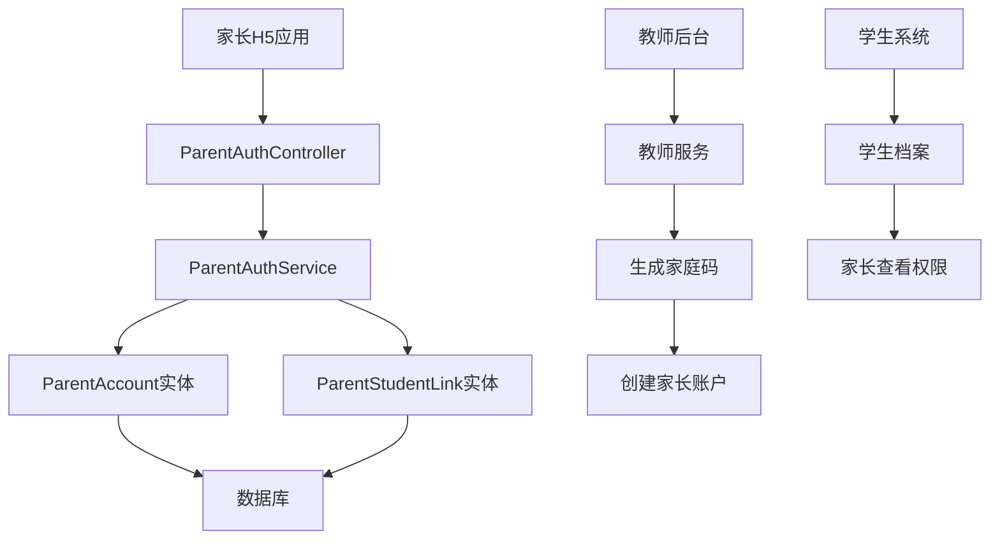

# 家长管理系统

<cite>
**本文档引用的文件**
- [ParentAuthService.java](file://backend/counseling-service/src/main/java/com/mindsafe/service/auth/ParentAuthService.java)
- [ParentAuthController.java](file://backend/counseling-api/src/main/java/com/mindsafe/api/controller/ParentAuthController.java)
- [ParentAccount.java](file://backend/counseling-domain/src/main/java/com/mindsafe/domain/entity/ParentAccount.java)
- [ParentStudentLink.java](file://backend/counseling-domain/src/main/java/com/mindsafe/domain/entity/ParentStudentLink.java)
- [V16__family_code_auth.sql](file://backend/counseling-app/src/main/resources/db/migration/V16__family_code_auth.sql)
- [ParentController.java](file://backend/counseling-api/src/main/java/com/mindsafe/api/controller/ParentController.java)
- [index.jsx](file://frontend/parent-h5/src/pages/verify/index.jsx)
- [index.jsx](file://frontend/parent-h5/src/pages/report/index.jsx)
- [index.jsx](file://frontend/parent-h5/src/pages/consent/index.jsx)
</cite>

## 更新摘要
**所做更改**
- 新增完整的家庭码认证系统，包括ParentAuthService和ParentAuthController
- 实现教师信任锚点模型，支持父子关系管理和多对多关联
- 新增数据库表结构(parent_accounts、parent_student_links)
- 家长端H5应用重大重构，包含验证、报告和同意管理页面
- 更新了认证流程和权限控制机制

## 目录
- 系统概述
- 架构设计
- 核心组件
- 数据库设计
- API接口
- 前端实现
- 安全机制
- 部署配置

## 系统概述

家长管理系统是AI心理咨询平台的重要组成部分，实现了完整的家庭码认证体系。该系统通过教师作为信任锚点，建立了家长与学生之间的安全关联关系，确保只有经过授权的家长才能访问学生的心理健康数据和报告。

### 主要功能特性
- **家庭码认证**：基于教师生成的家庭码进行身份验证
- **父子关系管理**：支持一对多和多对多的学生-家长关联
- **权限控制**：细粒度的数据访问权限管理
- **移动端适配**：专为家长设计的H5应用界面

**章节来源**
- [ParentAuthService.java](file://backend/counseling-service/src/main/java/com/mindsafe/service/auth/ParentAuthService.java)
- [ParentAuthController.java](file://backend/counseling-api/src/main/java/com/mindsafe/api/controller/ParentAuthController.java)

## 架构设计

系统采用分层架构设计，将认证逻辑、业务处理和用户界面清晰分离。



**图表来源**
- [ParentAuthController.java:1-100](file://backend/counseling-api/src/main/java/com/mindsafe/api/controller/ParentAuthController.java#L1-L100)
- [ParentAuthService.java:1-200](file://backend/counseling-service/src/main/java/com/mindsafe/service/auth/ParentAuthService.java#L1-L200)

## 核心组件

### ParentAuthService - 家长认证服务

ParentAuthService是整个认证系统的核心，负责处理所有与家庭码认证相关的业务逻辑。

#### 主要功能
- **家庭码验证**：验证家庭码的有效性和状态
- **家长注册**：创建新的家长账户并建立与学生关联
- **登录认证**：基于家庭码的认证流程
- **关系管理**：管理家长与学生的多对多关联关系

#### 关键方法
```java
// 家庭码验证
public boolean validateFamilyCode(String familyCode);

// 家长注册
public ParentAccount registerParent(String familyCode, String parentName, String phone);

// 登录认证
public ParentAccount authenticateWithFamilyCode(String familyCode, String password);
```

**章节来源**
- [ParentAuthService.java:1-300](file://backend/counseling-service/src/main/java/com/mindsafe/service/auth/ParentAuthService.java#L1-L300)

### ParentAuthController - 认证控制器

ParentAuthController提供RESTful API接口，处理来自前端的认证请求。

#### API端点
- `POST /api/parent/register` - 家长注册
- `POST /api/parent/login` - 家长登录
- `POST /api/parent/validate-family-code` - 验证家庭码
- `GET /api/parent/profile` - 获取家长信息

**章节来源**
- [ParentAuthController.java:1-150](file://backend/counseling-api/src/main/java/com/mindsafe/api/controller/ParentAuthController.java#L1-L150)

## 数据库设计

系统使用PostgreSQL数据库，通过Flyway进行版本化管理。新增了专门用于家庭码认证的表结构。

### 表结构设计

#### parent_accounts - 家长账户表
存储家长的基本信息和认证凭据。

| 字段名 | 类型 | 约束 | 描述 |
|--------|------|------|------|
| id | UUID | PRIMARY KEY | 唯一标识符 |
| family_code | VARCHAR(20) | UNIQUE, NOT NULL | 家庭码 |
| parent_name | VARCHAR(100) | NOT NULL | 家长姓名 |
| phone | VARCHAR(20) | UNIQUE | 手机号码 |
| password_hash | VARCHAR(255) | NOT NULL | 密码哈希 |
| status | VARCHAR(20) | DEFAULT 'ACTIVE' | 账户状态 |
| created_at | TIMESTAMP | DEFAULT NOW() | 创建时间 |
| updated_at | TIMESTAMP | DEFAULT NOW() | 更新时间 |

#### parent_student_links - 家长学生关联表
管理家长与学生之间的多对多关联关系。

| 字段名 | 类型 | 约束 | 描述 |
|--------|------|------|------|
| id | UUID | PRIMARY KEY | 唯一标识符 |
| parent_id | UUID | FOREIGN KEY | 家长ID |
| student_id | UUID | FOREIGN KEY | 学生ID |
| relationship_type | VARCHAR(50) | NOT NULL | 关系类型 |
| is_primary | BOOLEAN | DEFAULT FALSE | 是否主要联系人 |
| created_at | TIMESTAMP | DEFAULT NOW() | 创建时间 |

**章节来源**
- [V16__family_code_auth.sql:1-100](file://backend/counseling-app/src/main/resources/db/migration/V16__family_code_auth.sql#L1-L100)

### 实体类设计

#### ParentAccount - 家长账户实体
```java
@Entity
@Table(name = "parent_accounts")
public class ParentAccount {
    @Id
    @GeneratedValue(strategy = GenerationType.UUID)
    private UUID id;
    
    @Column(unique = true, nullable = false)
    private String familyCode;
    
    @Column(nullable = false)
    private String parentName;
    
    @Column(unique = true)
    private String phone;
    
    @Column(nullable = false)
    private String passwordHash;
    
    @Enumerated(EnumType.STRING)
    @Column(nullable = false)
    private AccountStatus status;
}
```

#### ParentStudentLink - 家长学生关联实体
```java
@Entity
@Table(name = "parent_student_links")
public class ParentStudentLink {
    @Id
    @GeneratedValue(strategy = GenerationType.UUID)
    private UUID id;
    
    @ManyToOne(fetch = FetchType.LAZY)
    @JoinColumn(name = "parent_id", nullable = false)
    private ParentAccount parent;
    
    @ManyToOne(fetch = FetchType.LAZY)
    @JoinColumn(name = "student_id", nullable = false)
    private StudentProfile student;
    
    @Column(nullable = false)
    private String relationshipType;
    
    @Column(nullable = false)
    private Boolean isPrimary;
}
```

**章节来源**
- [ParentAccount.java:1-80](file://backend/counseling-domain/src/main/java/com/mindsafe/domain/entity/ParentAccount.java#L1-L80)
- [ParentStudentLink.java:1-90](file://backend/counseling-domain/src/main/java/com/mindsafe/domain/entity/ParentStudentLink.java#L1-L90)

## API接口

### 认证相关接口

#### 家长注册
```http
POST /api/parent/register
Content-Type: application/json

{
    "familyCode": "FAM123456789",
    "parentName": "张三",
    "phone": "13800138000",
    "password": "SecurePass123!"
}
```

#### 家长登录
```http
POST /api/parent/login
Content-Type: application/json

{
    "familyCode": "FAM123456789",
    "password": "SecurePass123!"
}
```

#### 验证家庭码
```http
POST /api/parent/validate-family-code
Content-Type: application/json

{
    "familyCode": "FAM123456789"
}
```

### 家长信息管理接口

#### 获取家长信息
```http
GET /api/parent/profile
Authorization: Bearer <token>
```

#### 更新家长信息
```http
PUT /api/parent/profile
Authorization: Bearer <token>
Content-Type: application/json

{
    "parentName": "新姓名",
    "phone": "13900139000"
}
```

**章节来源**
- [ParentAuthController.java:1-200](file://backend/counseling-api/src/main/java/com/mindsafe/api/controller/ParentAuthController.java#L1-L200)
- [ParentController.java:1-150](file://backend/counseling-api/src/main/java/com/mindsafe/api/controller/ParentController.java#L1-L150)

## 前端实现

家长端H5应用经过重大重构，提供了现代化的用户体验。

### 应用结构
```
frontend/parent-h5/
├── src/
│   ├── pages/
│   │   ├── verify/        # 家庭码验证页面
│   │   ├── report/        # 学生报告页面
│   │   └── consent/       # 同意管理页面
│   ├── api/              # API调用封装
│   ├── utils/            # 工具函数
│   └── main.jsx          # 应用入口
```

### 核心页面功能

#### 家庭码验证页面
- 输入家庭码进行身份验证
- 显示验证结果和错误提示
- 自动跳转到登录或注册页面

#### 学生报告页面
- 查看学生的心理健康评估报告
- 显示情绪日记和分析结果
- 提供放松练习建议

#### 同意管理页面
- 管理家长同意书状态
- 查看同意历史记录
- 撤回或重新签署同意书

**章节来源**
- [index.jsx](file://frontend/parent-h5/src/pages/verify/index.jsx)
- [index.jsx](file://frontend/parent-h5/src/pages/report/index.jsx)
- [index.jsx](file://frontend/parent-h5/src/pages/consent/index.jsx)

## 安全机制

### 认证安全
- **密码加密**：使用BCrypt算法对密码进行加密存储
- **会话管理**：基于JWT的无状态认证
- **登录锁定**：防止暴力破解攻击

### 数据安全
- **权限控制**：基于角色的访问控制(RBAC)
- **数据隔离**：确保家长只能访问自己关联的学生数据
- **审计日志**：记录所有敏感操作

### 传输安全
- **HTTPS强制**：所有API通信使用HTTPS
- **CORS配置**：严格的跨域资源共享策略
- **输入验证**：前后端双重输入验证

**章节来源**
- [ParentAuthService.java:150-300](file://backend/counseling-service/src/main/java/com/mindsafe/service/auth/ParentAuthService.java#L150-L300)

## 部署配置

### 环境要求
- Java 17+
- PostgreSQL 14+
- Redis (可选，用于缓存)
- Node.js 16+ (前端构建)

### 数据库初始化
系统使用Flyway进行数据库版本管理，启动时会自动执行迁移脚本。

### 配置文件
```yaml
# application.yml
spring:
  datasource:
    url: jdbc:postgresql://localhost:5432/mindsafe_db
    username: mindsafe_user
    password: secure_password
  
  flyway:
    enabled: true
    locations: classpath:db/migration

jwt:
  secret: your-jwt-secret-key
  expiration: 86400000
```

**章节来源**
- [V16__family_code_auth.sql:1-100](file://backend/counseling-app/src/main/resources/db/migration/V16__family_code_auth.sql#L1-L100)
