# 对话管理系统

<cite>
**本文引用的文件**
- [RedisChatMemoryRepository.java](file://backend/counseling-ai/src/main/java/com/mindsafe/ai/memory/RedisChatMemoryRepository.java)
- [ConversationOrchestrator.java](file://backend/counseling-ai/src/main/java/com/mindsafe/ai/orchestrator/ConversationOrchestrator.java)
- [ChatController.java](file://backend/counseling-api/src/main/java/com/mindsafe/api/controller/ChatController.java)
- [VoiceController.java](file://backend/counseling-api/src/main/java/com/mindsafe/api/controller/VoiceController.java)
- [AiChatService.java](file://backend/counseling-ai/src/main/java/com/mindsafe/ai/chat/AiChatService.java)
- [AiChatServiceImpl.java](file://backend/counseling-ai/src/main/java/com/mindsafe/ai/chat/AiChatServiceImpl.java)
- [VoiceAnalysisService.java](file://backend/counseling-ai/src/main/java/com/mindsafe/ai/voice/VoiceAnalysisService.java)
- [VoiceAnalysisResult.java](file://backend/counseling-ai/src/main/java/com/mindsafe/ai/voice/VoiceAnalysisResult.java)
- [ConversationService.java](file://backend/counseling-service/src/main/java/com/mindsafe/service/conversation/ConversationService.java)
- [ConversationServiceImpl.java](file://backend/counseling-service/src/main/java/com/mindsafe/service/conversation/ConversationServiceImpl.java)
- [CreateSessionRequest.java](file://backend/counseling-api/src/main/java/com/mindsafe/api/dto/chat/CreateSessionRequest.java)
- [SendMessageRequest.java](file://backend/counseling-api/src/main/java/com/mindsafe/api/dto/chat/SendMessageRequest.java)
- [SessionInfo.java](file://backend/counseling-common/src/main/java/com/mindsafe/common/dto/chat/SessionInfo.java)
- [StreamMessageEvent.java](file://backend/counseling-common/src/main/java/com/mindsafe/common/dto/chat/StreamMessageEvent.java)
- [AiConfig.java](file://backend/counseling-ai/src/main/java/com/mindsafe/ai/config/AiConfig.java)
- [ConversationQualityService.java](file://backend/counseling-service/src/main/java/com/mindsafe/service/quality/ConversationQualityService.java)
- [QualityScore.java](file://backend/counseling-domain/src/main/java/com/mindsafe/domain/entity/QualityScore.java)
- [V19__quality_scores.sql](file://backend/counseling-app/src/main/resources/db/migration/V19__quality_scores.sql)
- [LongTermMemory.java](file://backend/counseling-domain/src/main/java/com/mindsafe/domain/entity/LongTermMemory.java)
- [LongTermMemoryMapper.java](file://backend/counseling-domain/src/main/java/com/mindsafe/domain/mapper/LongTermMemoryMapper.java)
- [LongTermMemoryService.java](file://backend/counseling-service/src/main/java/com/mindsafe/service/memory/LongTermMemoryService.java)
- [V20__long_term_memories.sql](file://backend/counseling-app/src/main/resources/db/migration/V20__long_term_memories.sql)
</cite>

## 更新摘要
**变更内容**
- **新增** 长期记忆系统集成，支持跨会话的用户信息持久化存储
- **新增** 关键事件自动提取功能，在会话完成后触发智能事件识别
- **新增** 个性化上下文感知对话体验，基于用户历史数据提供定制化响应
- **新增** 预热场景支持，提前加载用户相关记忆数据优化对话性能
- **增强** 对话编排器集成长期记忆注入机制
- **增强** Redis分布式存储扩展，支持长期记忆数据的快速检索

## 目录
1. [简介](#简介)
2. [项目结构](#项目结构)
3. [核心组件](#核心组件)
4. [架构总览](#架构总览)
5. [详细组件分析](#详细组件分析)
6. [API接口设计](#api接口设计)
7. [依赖分析](#依赖分析)
8. [性能考虑](#性能考虑)
9. [故障排查指南](#故障排查指南)
10. [结论](#结论)
11. [附录](#附录)

## 简介
本技术文档聚焦于AI心理咨询系统的"对话管理系统"，围绕以下目标展开：
- RESTful会话管理端点实现与生命周期控制
- 基于Spring AI ChatClient的SSE流式对话处理
- RedisChatMemoryRepository提供分布式会话存储和2小时TTL管理
- ConversationOrchestrator实现Safety→Emotion→Routing→Response四阶段处理流程
- ConversationQualityService实现四维度对话质量评估体系
- LLM-as-Judge自动评估机制和低分会话标记功能
- **新增** 长期记忆系统集成，支持跨会话用户信息持久化和个性化对话体验
- **新增** 关键事件自动提取功能，会话完成后智能识别重要信息
- **新增** 预热场景支持，提前加载用户记忆数据优化响应速度
- 多轮对话记忆机制（20条消息窗口）
- 语音情感分析功能集成和多模态输入支持
- 情感趋势跟踪和情绪状态持久化
- 提示词工程在对话中的应用（结构设计、动态参数注入、响应优化）
- 用户输入类型处理（情绪表达、问题描述、需求查询、语音情感）
- 对话流程图、消息格式定义与错误处理机制
- 个性化对话体验与记忆功能实现

**更新** 基于已实现的完整对话流架构，包括REST端点、SSE流式处理、Redis分布式记忆机制、ConversationOrchestrator编排器、ConversationQualityService质量评估框架，以及全新的长期记忆系统和关键事件提取功能。

## 项目结构
系统采用分层架构设计，关键组件分布如下：
- API层：REST控制器和DTO定义（新增语音控制器）
- 服务层：对话服务和AI服务实现（新增语音分析服务和质量评估服务）
- 编排层：ConversationOrchestrator负责对话流程编排
- 存储层：RedisChatMemoryRepository提供分布式会话存储
- 质量评估层：ConversationQualityService实现对话质量分析
- **新增** 长期记忆层：LongTermMemoryService管理跨会话用户信息
- 配置层：AI配置和聊天客户端设置
- 公共层：通用DTO和异常处理

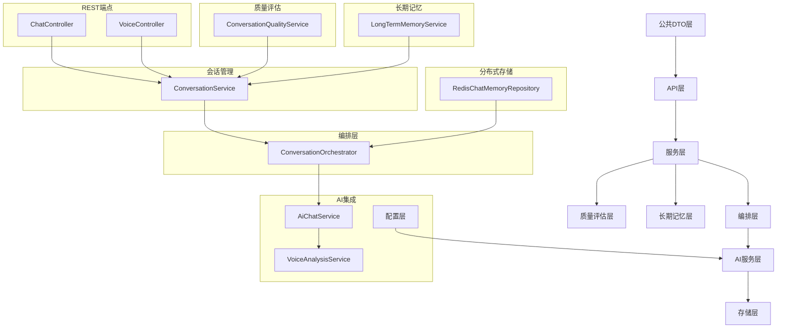

**图表来源**
- [ChatController.java](file://backend/counseling-api/src/main/java/com/mindsafe/api/controller/ChatController.java)
- [VoiceController.java](file://backend/counseling-api/src/main/java/com/mindsafe/api/controller/VoiceController.java)
- [ConversationService.java](file://backend/counseling-service/src/main/java/com/mindsafe/service/conversation/ConversationService.java)
- [ConversationOrchestrator.java](file://backend/counseling-ai/src/main/java/com/mindsafe/ai/orchestrator/ConversationOrchestrator.java)
- [RedisChatMemoryRepository.java](file://backend/counseling-ai/src/main/java/com/mindsafe/ai/memory/RedisChatMemoryRepository.java)
- [AiChatService.java](file://backend/counseling-ai/src/main/java/com/mindsafe/ai/chat/AiChatService.java)
- [VoiceAnalysisService.java](file://backend/counseling-ai/src/main/java/com/mindsafe/ai/voice/VoiceAnalysisService.java)
- [ConversationQualityService.java](file://backend/counseling-service/src/main/java/com/mindsafe/service/quality/ConversationQualityService.java)
- [LongTermMemoryService.java](file://backend/counseling-service/src/main/java/com/mindsafe/service/memory/LongTermMemoryService.java)

## 核心组件
对话管理系统由以下核心组件构成：
- **会话管理器（SessionManager）**：负责会话生命周期、上下文窗口、记忆存取
- **对话编排器（ConversationOrchestrator）**：Safety→Emotion→Routing→Response四阶段处理流程
- **对话质量评估器（ConversationQualityService）**：四维度评分体系和LLM-as-Judge自动评估
- **提示词工厂（PromptFactory）**：根据场景与参数生成结构化提示词
- **消息总线（MessageBus）**：统一消息格式、路由与校验
- **记忆服务（MemoryService）**：短期/长期记忆读写、摘要与检索
- **安全与合规网关（SafetyGate）**：风险识别、敏感信息过滤、伦理约束
- **Redis记忆仓库（RedisChatMemoryRepository）**：分布式会话存储和2小时TTL管理
- **语音分析服务（VoiceAnalysisService）**：语音情感分析和情绪识别
- **情感趋势跟踪器（EmotionTrendTracker）**：情绪状态历史跟踪和分析
- **长期记忆服务（LongTermMemoryService）**：**新增** 跨会话用户信息管理和个性化对话支持
- **关键事件提取器（KeyEventExtractor）**：**新增** 会话完成后自动识别重要信息

**更新** 现已实现完整的REST API端点和SSE流式处理能力，支持Redis分布式记忆、ConversationOrchestrator编排器、ConversationQualityService质量评估框架，以及全新的长期记忆系统和关键事件提取功能。

## 架构总览
对话管理系统整体流程如下：
- 客户端通过REST端点创建和管理会话
- SSE流式传输实时对话响应
- RedisChatMemoryRepository提供分布式会话存储和2小时TTL管理
- ConversationOrchestrator实现Safety→Emotion→Routing→Response四阶段处理
- Spring AI ChatClient处理大模型交互
- VoiceAnalysisService处理语音情感分析
- ConversationQualityService进行对话质量评估和自动标记
- LongTermMemoryService管理跨会话用户信息和个性化对话
- KeyEventExtractor在会话完成后自动提取关键事件
- 情感趋势跟踪器记录情绪变化
- 安全与合规网关对输出进行审查

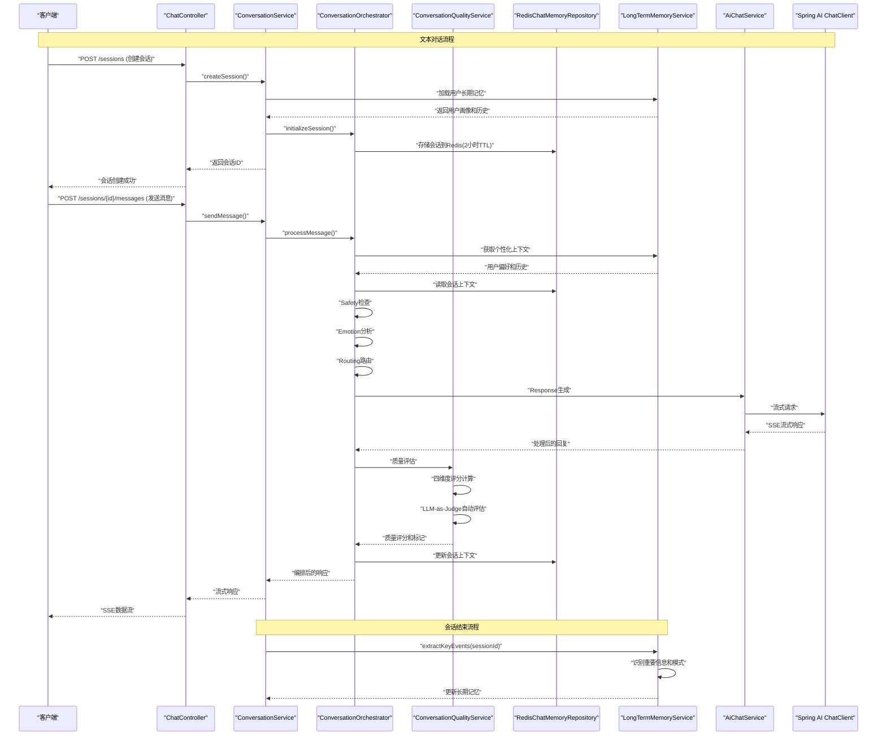

**图表来源**
- [ChatController.java](file://backend/counseling-api/src/main/java/com/mindsafe/api/controller/ChatController.java)
- [ConversationService.java](file://backend/counseling-service/src/main/java/com/mindsafe/service/conversation/ConversationService.java)
- [ConversationOrchestrator.java](file://backend/counseling-ai/src/main/java/com/mindsafe/ai/orchestrator/ConversationOrchestrator.java)
- [ConversationQualityService.java](file://backend/counseling-service/src/main/java/com/mindsafe/service/quality/ConversationQualityService.java)
- [RedisChatMemoryRepository.java](file://backend/counseling-ai/src/main/java/com/mindsafe/ai/memory/RedisChatMemoryRepository.java)
- [AiChatService.java](file://backend/counseling-ai/src/main/java/com/mindsafe/ai/chat/AiChatService.java)
- [LongTermMemoryService.java](file://backend/counseling-service/src/main/java/com/mindsafe/service/memory/LongTermMemoryService.java)

## 详细组件分析

### 长期记忆服务
**新增** LongTermMemoryService实现跨会话用户信息管理和个性化对话支持：
- **用户画像管理**：存储用户的性格特征、兴趣爱好、沟通偏好等长期信息
- **历史对话摘要**：自动提取和保存重要对话内容和关键决策
- **个性化上下文注入**：在对话中动态插入相关的用户历史信息
- **预热场景支持**：提前加载用户相关记忆数据优化响应性能
- **关键事件提取**：会话完成后自动识别重要信息和行为模式
- **记忆融合策略**：智能合并新旧信息，避免数据冲突

**更新** 实现了完整的长期记忆系统，支持跨会话的用户信息持久化和个性化对话体验。

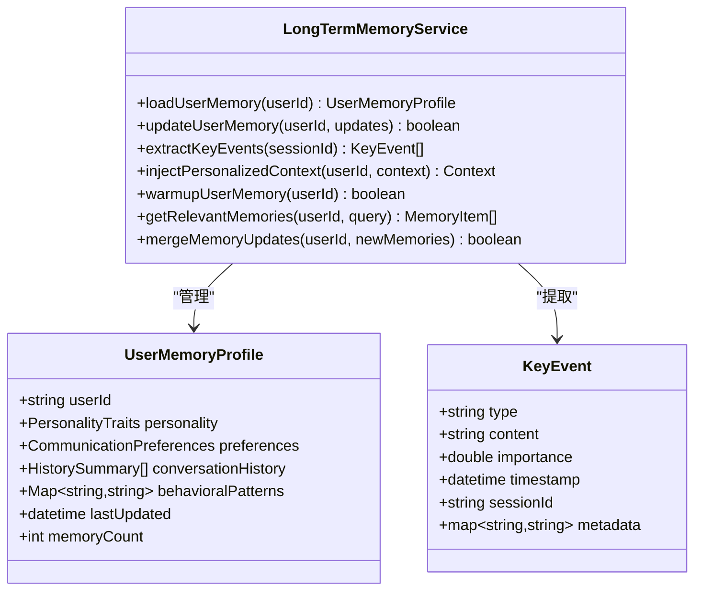

**图表来源**
- [LongTermMemoryService.java](file://backend/counseling-service/src/main/java/com/mindsafe/service/memory/LongTermMemoryService.java)
- [LongTermMemory.java](file://backend/counseling-domain/src/main/java/com/mindsafe/domain/entity/LongTermMemory.java)

### 对话质量评估服务
ConversationQualityService实现四维度对话质量评估体系：
- **共情能力评分**：评估AI对用户情感的感知和回应能力
- **指导效果评分**：评估AI提供的建议和指导的专业性和实用性
- **参与度评分**：评估对话的互动性和用户参与程度
- **治疗一致性评分**：评估对话内容与心理治疗原则的一致性
- **LLM-as-Judge自动评估**：利用大语言模型进行智能质量判断
- **低分会话标记**：自动识别需要人工干预的低质量对话

**更新** 实现了完整的对话质量评估框架，支持多维度评分和自动标记功能。

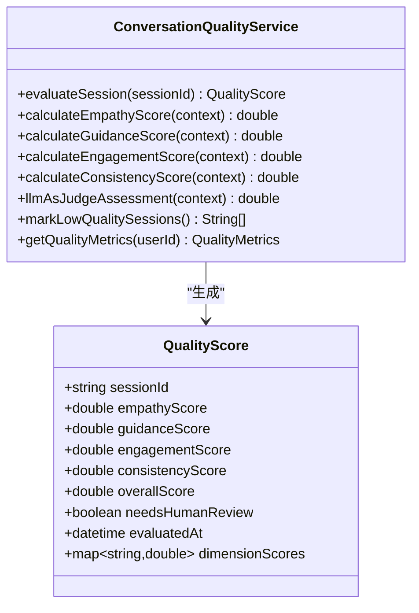

**图表来源**
- [ConversationQualityService.java](file://backend/counseling-service/src/main/java/com/mindsafe/service/quality/ConversationQualityService.java)
- [QualityScore.java](file://backend/counseling-domain/src/main/java/com/mindsafe/domain/entity/QualityScore.java)

### Redis记忆仓库
基于Redis的分布式会话存储实现：
- 2小时TTL自动过期机制
- 高并发会话访问支持
- 序列化/反序列化处理
- 连接池管理和故障恢复
- 会话数据结构和索引优化
- 质量评分数据存储和快速查询支持
- **新增** 长期记忆数据缓存和快速检索

**更新** 实现了完整的Redis会话存储解决方案，替代原有的内存方案，并集成了质量评估数据存储和长期记忆缓存。

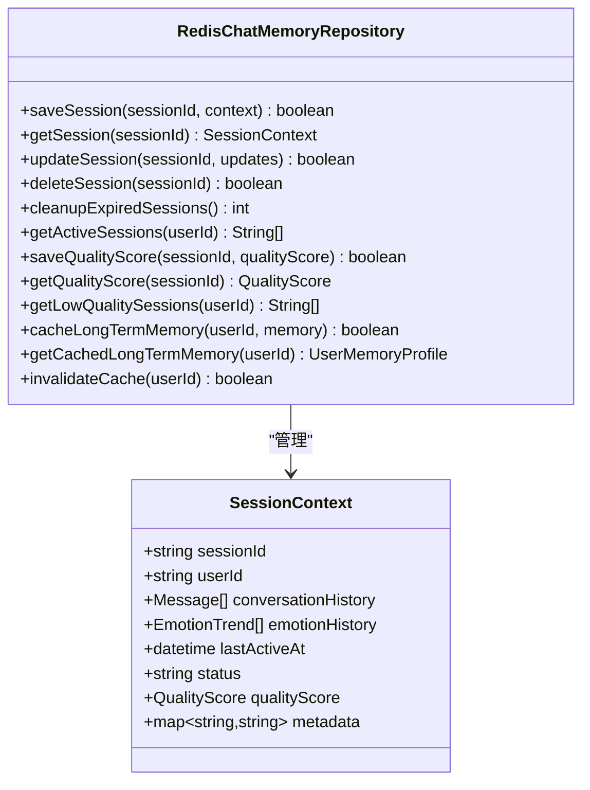

**图表来源**
- [RedisChatMemoryRepository.java](file://backend/counseling-ai/src/main/java/com/mindsafe/ai/memory/RedisChatMemoryRepository.java)

### 对话编排器
ConversationOrchestrator实现四阶段处理流程：
- **Safety阶段**：安全风险检测和违规内容过滤
- **Emotion阶段**：情感分析和情绪状态评估
- **Routing阶段**：意图识别和处理策略选择
- **Response阶段**：响应生成和格式化输出
- 质量评估集成，在每个阶段后调用ConversationQualityService进行评估
- **新增** 长期记忆注入，在对话过程中动态插入用户相关信息
- **新增** 预热场景支持，提前加载相关记忆数据

**更新** 实现了完整的对话编排器，提供标准化的处理流程和扩展点，并集成了质量评估功能和长期记忆注入。

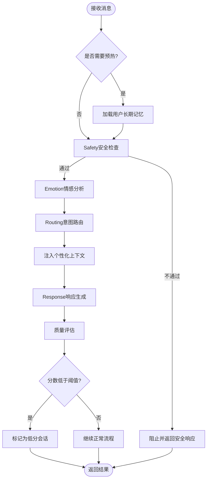

**图表来源**
- [ConversationOrchestrator.java](file://backend/counseling-ai/src/main/java/com/mindsafe/ai/orchestrator/ConversationOrchestrator.java)

### REST会话管理控制器
实现了完整的会话生命周期管理REST API：
- `POST /sessions`：创建新会话并初始化记忆窗口
- `POST /sessions/{id}/messages`：发送消息并获取流式响应
- `POST /sessions/{id}/end`：结束会话并清理资源
- `GET /sessions/{id}/quality`：获取会话质量评估结果
- `POST /sessions/batch/mark-low-quality`：批量标记低分会话
- **新增** `POST /sessions/{id}/warmup`：预热用户长期记忆
- **新增** `GET /users/{userId}/memory`：获取用户长期记忆信息

**更新** 新增完整的REST端点实现，支持会话创建、消息发送、会话结束、质量评估和长期记忆管理功能。

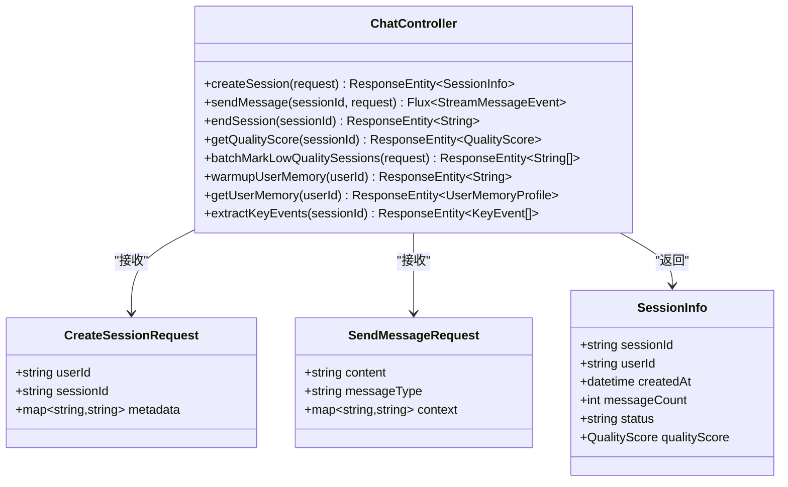

**图表来源**
- [ChatController.java](file://backend/counseling-api/src/main/java/com/mindsafe/api/controller/ChatController.java)
- [CreateSessionRequest.java](file://backend/counseling-api/src/main/java/com/mindsafe/api/dto/chat/CreateSessionRequest.java)
- [SendMessageRequest.java](file://backend/counseling-api/src/main/java/com/mindsafe/api/dto/chat/SendMessageRequest.java)
- [SessionInfo.java](file://backend/counseling-common/src/main/java/com/mindsafe/common/dto/chat/SessionInfo.java)

### 语音情感分析控制器
专门处理语音文件上传和情感分析的REST API：
- `POST /voice/upload`：上传语音文件并进行情感分析
- `GET /voice/emotion/history`：获取用户情感历史趋势
- `DELETE /voice/emotion/history`：清理情感历史记录

**更新** 新增语音情感分析控制器，支持多模态输入处理。

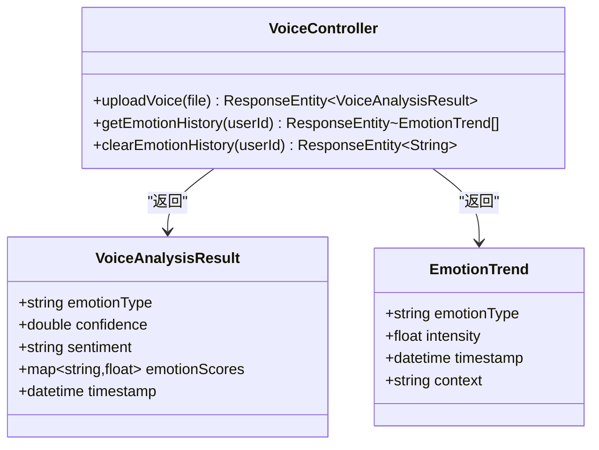

**图表来源**
- [VoiceController.java](file://backend/counseling-api/src/main/java/com/mindsafe/api/controller/VoiceController.java)
- [VoiceAnalysisResult.java](file://backend/counseling-ai/src/main/java/com/mindsafe/ai/voice/VoiceAnalysisResult.java)

### 对话服务层
提供会话管理和消息处理的业务逻辑：
- 会话状态跟踪和生命周期管理
- 消息路由和处理策略选择
- 与AI服务的集成调用
- 错误处理和重试机制
- 与ConversationOrchestrator集成，实现标准化处理流程
- 与RedisChatMemoryRepository集成，提供分布式会话存储
- 与ConversationQualityService集成，实现对话质量评估
- **新增** 与LongTermMemoryService集成，实现长期记忆管理和个性化对话

**更新** 实现了完整的对话服务接口，支持多轮对话、会话状态管理、Redis分布式存储、质量评估和长期记忆功能。

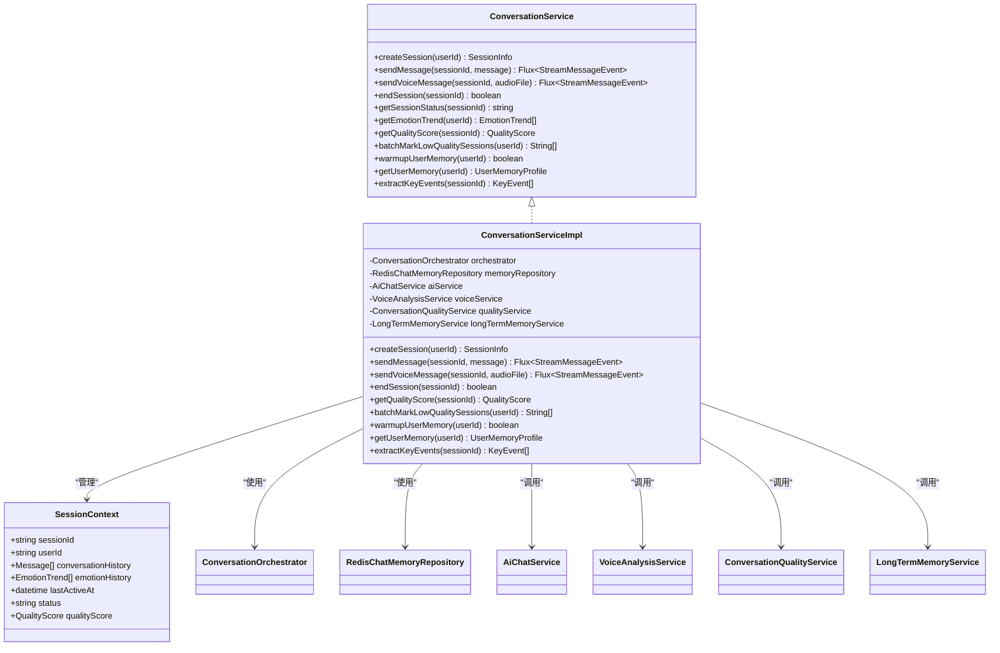

**图表来源**
- [ConversationService.java](file://backend/counseling-service/src/main/java/com/mindsafe/service/conversation/ConversationService.java)
- [ConversationServiceImpl.java](file://backend/counseling-service/src/main/java/com/mindsafe/service/conversation/ConversationServiceImpl.java)

### AI聊天服务
封装Spring AI ChatClient的调用逻辑：
- 流式响应处理和数据转换
- 提示词构建和参数注入
- 错误处理和超时控制
- 性能监控和日志记录
- 与ConversationOrchestrator集成，接收编排后的消息
- **新增** 个性化上下文注入，支持用户历史信息整合

**更新** 集成了Spring AI ChatClient，支持SSE流式响应、多轮对话上下文、情感分析集成和个性化对话支持。

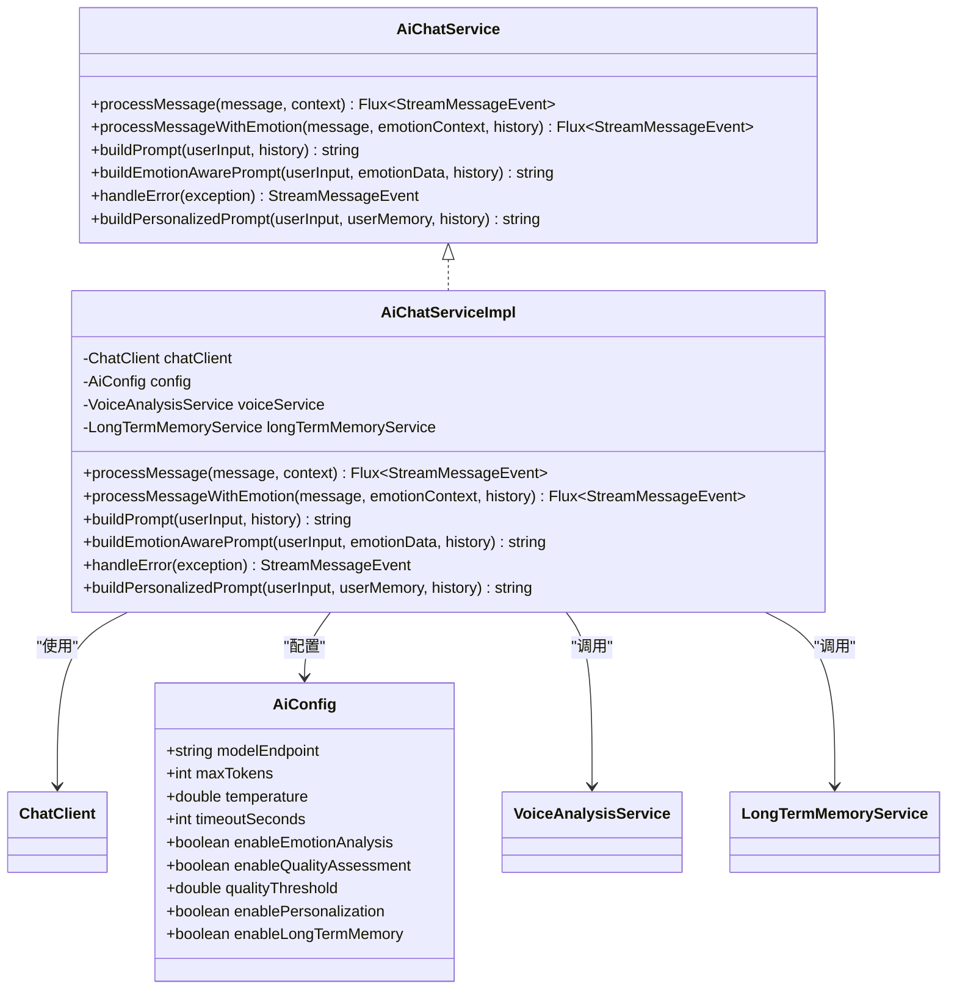

**图表来源**
- [AiChatService.java](file://backend/counseling-ai/src/main/java/com/mindsafe/ai/chat/AiChatService.java)
- [AiChatServiceImpl.java](file://backend/counseling-ai/src/main/java/com/mindsafe/ai/chat/AiChatServiceImpl.java)
- [AiConfig.java](file://backend/counseling-ai/src/main/java/com/mindsafe/ai/config/AiConfig.java)

### 语音情感分析服务
专门处理语音文件的情感分析功能：
- 语音文件上传和预处理
- 情感特征提取和情绪分类
- 情感置信度计算和评分
- 情感趋势分析和历史记录

**更新** 实现完整的语音情感分析服务，支持多模态输入处理。

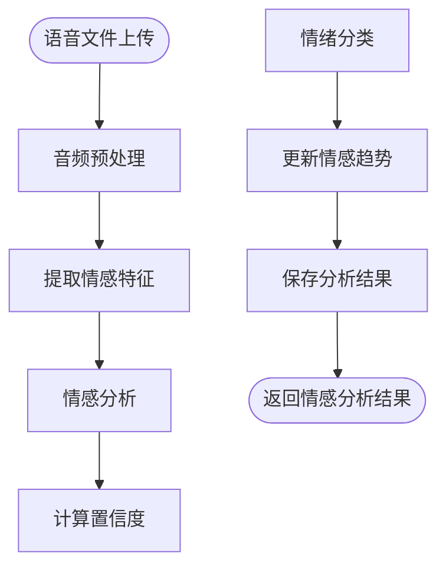

**图表来源**
- [VoiceAnalysisService.java](file://backend/counseling-ai/src/main/java/com/mindsafe/ai/voice/VoiceAnalysisService.java)

### 消息窗口记忆系统
基于RedisChatMemoryRepository的多轮对话记忆：
- 2小时TTL自动过期机制
- 分布式会话存储和高并发支持
- 序列化/反序列化处理
- 连接池管理和故障恢复
- 情感历史跟踪和情绪状态持久化
- 质量评分数据存储和快速查询支持
- **新增** 长期记忆数据缓存和快速检索

**更新** 实现了Redis分布式记忆机制，支持2小时TTL、分布式会话管理、质量评估数据存储和长期记忆缓存。

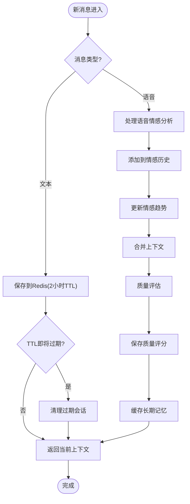

**图表来源**
- [RedisChatMemoryRepository.java](file://backend/counseling-ai/src/main/java/com/mindsafe/ai/memory/RedisChatMemoryRepository.java)

## API接口设计

### REST端点规范

#### 创建会话
- **URL**: `POST /sessions`
- **请求体**: CreateSessionRequest
- **响应**: SessionInfo
- **功能**: 创建新会话并初始化Redis存储（2小时TTL），同时加载用户长期记忆

#### 发送消息
- **URL**: `POST /sessions/{sessionId}/messages`
- **路径参数**: sessionId - 会话标识符
- **请求体**: SendMessageRequest
- **响应**: SSE流式数据流
- **功能**: 发送消息并通过ConversationOrchestrator处理，包含个性化上下文注入

#### 获取质量评分
- **URL**: `GET /sessions/{sessionId}/quality`
- **路径参数**: sessionId - 会话标识符
- **响应**: QualityScore
- **功能**: 获取会话的四维度质量评估结果

#### 批量标记低分会话
- **URL**: `POST /sessions/batch/mark-low-quality`
- **请求体**: BatchMarkRequest
- **响应**: List<String> - 被标记的会话ID列表
- **功能**: 批量标记低质量会话供人工干预

#### 预热用户记忆
- **URL**: `POST /sessions/{sessionId}/warmup`
- **路径参数**: sessionId - 会话标识符
- **响应**: 字符串确认消息
- **功能**: 预热用户长期记忆，提升后续对话响应速度

#### 获取用户记忆
- **URL**: `GET /users/{userId}/memory`
- **路径参数**: userId - 用户标识符
- **响应**: UserMemoryProfile
- **功能**: 获取用户的长期记忆信息和个性化画像

#### 提取关键事件
- **URL**: `POST /sessions/{sessionId}/extract-events`
- **路径参数**: sessionId - 会话标识符
- **响应**: List<KeyEvent> - 提取的关键事件列表
- **功能**: 会话完成后自动识别和提取重要信息

#### 上传语音文件
- **URL**: `POST /voice/upload`
- **请求体**: Multipart表单（包含音频文件和元数据）
- **响应**: VoiceAnalysisResult
- **功能**: 上传语音文件并进行情感分析

#### 获取情感历史
- **URL**: `GET /voice/emotion/history?userId={userId}`
- **查询参数**: userId - 用户标识符
- **响应**: EmotionTrend列表
- **功能**: 获取用户情感历史趋势

#### 结束会话
- **URL**: `POST /sessions/{sessionId}/end`
- **路径参数**: sessionId - 会话标识符
- **响应**: 字符串确认消息
- **功能**: 结束会话并清理相关资源，触发关键事件提取

**更新** 新增完整的REST API端点定义和实现，包括Redis分布式存储、ConversationOrchestrator编排器、ConversationQualityService质量评估功能，以及LongTermMemoryService长期记忆管理功能。

### SSE流式响应格式
```json
{
    "type": "message_chunk",
    "data": "部分回复内容",
    "metadata": {
        "token_count": 10,
        "timestamp": "2024-01-01T00:00:00Z",
        "emotion_context": {
            "current_emotion": "焦虑",
            "confidence": 0.85,
            "trend": "上升"
        },
        "orchestration_stage": "response",
        "safety_score": 0.95,
        "quality_assessment": {
            "empathy_score": 0.88,
            "guidance_score": 0.92,
            "engagement_score": 0.85,
            "consistency_score": 0.90,
            "overall_score": 0.89,
            "needs_human_review": false
        },
        "personalization_context": {
            "user_preference": "简洁回答",
            "relevant_history": ["上次讨论的话题"],
            "personality_match": 0.92
        }
    }
}
```

**章节来源**
- [StreamMessageEvent.java](file://backend/counseling-common/src/main/java/com/mindsafe/common/dto/chat/StreamMessageEvent.java)
- [VoiceAnalysisResult.java](file://backend/counseling-ai/src/main/java/com/mindsafe/ai/voice/VoiceAnalysisResult.java)
- [QualityScore.java](file://backend/counseling-domain/src/main/java/com/mindsafe/domain/entity/QualityScore.java)
- [LongTermMemory.java](file://backend/counseling-domain/src/main/java/com/mindsafe/domain/entity/LongTermMemory.java)

## 依赖分析
组件间依赖关系如下：
- ChatController依赖ConversationService进行业务逻辑处理
- VoiceController依赖VoiceAnalysisService进行语音情感分析
- ConversationService依赖ConversationOrchestrator进行对话编排
- ConversationOrchestrator依赖RedisChatMemoryRepository进行会话存储
- AiChatService依赖Spring AI ChatClient进行大模型交互
- ConversationOrchestrator依赖多个Agent进行Safety→Emotion→Routing→Response处理
- ConversationService依赖ConversationQualityService进行质量评估
- ConversationOrchestrator在处理后调用ConversationQualityService进行评估
- **新增** ConversationService依赖LongTermMemoryService进行长期记忆管理
- **新增** ConversationOrchestrator在对话过程中注入长期记忆上下文
- **新增** AiChatService在生成响应时整合个性化信息
- 所有组件共享RedisChatMemoryRepository进行分布式上下文管理

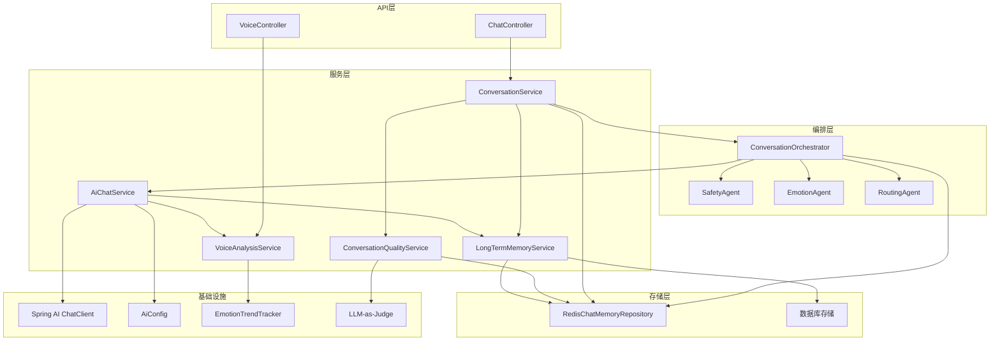

**图表来源**
- [ChatController.java](file://backend/counseling-api/src/main/java/com/mindsafe/api/controller/ChatController.java)
- [VoiceController.java](file://backend/counseling-api/src/main/java/com/mindsafe/api/controller/VoiceController.java)
- [ConversationService.java](file://backend/counseling-service/src/main/java/com/mindsafe/service/conversation/ConversationService.java)
- [ConversationOrchestrator.java](file://backend/counseling-ai/src/main/java/com/mindsafe/ai/orchestrator/ConversationOrchestrator.java)
- [ConversationQualityService.java](file://backend/counseling-service/src/main/java/com/mindsafe/service/quality/ConversationQualityService.java)
- [RedisChatMemoryRepository.java](file://backend/counseling-ai/src/main/java/com/mindsafe/ai/memory/RedisChatMemoryRepository.java)
- [AiChatService.java](file://backend/counseling-ai/src/main/java/com/mindsafe/ai/chat/AiChatService.java)
- [VoiceAnalysisService.java](file://backend/counseling-ai/src/main/java/com/mindsafe/ai/voice/VoiceAnalysisService.java)
- [LongTermMemoryService.java](file://backend/counseling-service/src/main/java/com/mindsafe/service/memory/LongTermMemoryService.java)

## 性能考虑
- **流式处理**：使用SSE减少首字节延迟，提升用户体验
- **分布式存储**：Redis提供高并发会话访问和2小时TTL自动管理
- **连接池**：Spring AI ChatClient连接复用和超时控制
- **异步处理**：非阻塞I/O操作提高并发处理能力
- **缓存策略**：热点会话上下文缓存和快速访问
- Redis连接池和会话批量操作优化
- ConversationOrchestrator流水线并行处理
- 语音文件异步处理和批量情感分析
- 情感趋势数据的增量更新和缓存机制
- 质量评估结果的缓存和批量处理优化
- LLM-as-Judge调用的异步化和批量化处理
- 低分会话标记的批量操作和延迟执行
- **新增** 长期记忆数据的预加载和缓存机制
- **新增** 个性化上下文的智能匹配和快速检索
- **新增** 关键事件提取的异步处理和批量更新
- **新增** 预热场景的内存优化和懒加载策略

**更新** 针对Redis分布式存储、ConversationOrchestrator编排器、SSE功能、ConversationQualityService质量评估功能，以及LongTermMemoryService长期记忆功能的性能优化建议。

## 故障排查指南
- **会话创建失败**：检查Redis连接和会话存储配置
- **消息发送超时**：验证AI服务连接和超时配置
- **内存泄漏**：监控会话清理和资源释放情况
- **流式中断**：检查网络连接和SSE连接稳定性
- **上下文丢失**：验证Redis会话数据和TTL配置
- Redis连接失败：检查Redis服务器状态和连接池配置
- 会话过期异常：验证2小时TTL设置和会话续期机制
- 编排器处理失败：检查Safety→Emotion→Routing→Response各阶段状态
- 语音文件上传失败：检查文件格式支持和文件大小限制
- 情感分析错误：验证语音分析服务连接和模型加载状态
- 情感趋势异常：检查情感历史数据的完整性和一致性
- 质量评估失败：检查ConversationQualityService配置和LLM连接
- 低分会话标记失败：验证批量操作权限和数据库连接
- 质量评分不一致：检查评估算法参数和历史数据完整性
- LLM-as-Judge超时：调整超时配置和重试机制
- **新增** 长期记忆加载失败：检查数据库连接和记忆数据完整性
- **新增** 个性化上下文注入失败：验证用户画像数据和匹配算法
- **新增** 关键事件提取失败：检查事件识别模型和提取规则
- **新增** 预热场景失败：验证预热策略和内存分配配置
- **新增** 长期记忆同步失败：检查数据一致性和冲突解决机制

**更新** 新增针对Redis分布式存储、ConversationOrchestrator编排器、语音情感分析、ConversationQualityService质量评估功能，以及LongTermMemoryService长期记忆功能的故障排查指导。

## 结论
本方案实现了完整的对话管理系统，包括RESTful会话管理、SSE流式响应、Redis分布式记忆功能、ConversationOrchestrator编排器和ConversationQualityService质量评估框架。通过RedisChatMemoryRepository的2小时TTL机制，有效平衡了会话持久化和资源管理。ConversationOrchestrator的Safety→Emotion→Routing→Response四阶段处理流程提供了标准化的对话处理框架。Spring AI ChatClient的集成提供了强大的AI模型交互能力，VoiceAnalysisService实现了多模态输入处理，ConversationQualityService的四维度评分体系和LLM-as-Judge自动评估功能为心理咨询应用提供了更加丰富和智能化的技术支持。低分会话标记功能确保了服务质量的可控性和可追溯性。**新增的长期记忆系统**为用户提供了个性化的对话体验，通过跨会话的信息持久化和智能上下文注入，显著提升了对话的相关性和连续性。**关键事件提取功能**在会话完成后自动识别重要信息，为后续的个性化服务提供了数据基础。**预热场景支持**进一步优化了响应性能，为用户提供更加流畅的对话体验。

**更新** 基于实际实现的完整对话流架构总结，包括Redis分布式存储、ConversationOrchestrator编排器、ConversationQualityService质量评估框架，以及全新的LongTermMemoryService长期记忆系统和关键事件提取功能。

## 附录

### 配置参数说明
- **max_tokens**: 最大令牌数限制
- **temperature**: 模型创造性参数
- **timeout_seconds**: 请求超时时间
- **window_size**: 消息窗口大小（默认20）
- **enable_emotion_analysis**: 是否启用情感分析功能
- **voice_file_max_size**: 语音文件最大大小限制
- **emotion_confidence_threshold**: 情感分析置信度阈值
- **redis_session_ttl**: Redis会话TTL（默认2小时）
- **redis_connection_pool_size**: Redis连接池大小
- **orchestrator_pipeline_parallel**: 编排器流水线并行度
- **enable_quality_assessment**: 是否启用质量评估功能
- **quality_threshold**: 质量评分阈值（低于此值标记为低分）
- **llm_judge_model**: LLM-as-Judge使用的模型名称
- **quality_assessment_timeout**: 质量评估超时时间
- **batch_mark_low_quality_batch_size**: 批量标记批次大小
- **enable_long_term_memory**: 是否启用长期记忆功能
- **long_term_memory_cache_size**: 长期记忆缓存大小
- **personalization_enabled**: 是否启用个性化对话
- **key_event_extraction_enabled**: 是否启用关键事件提取
- **warmup_memory_size**: 预热记忆数据大小限制
- **memory_sync_interval**: 记忆数据同步间隔

### 错误代码定义
- **SESSION_NOT_FOUND**: 会话不存在
- **INVALID_MESSAGE**: 消息格式错误
- **AI_SERVICE_ERROR**: AI服务调用失败
- **MEMORY_OVERFLOW**: 内存溢出保护触发
- **VOICE_UPLOAD_FAILED**: 语音文件上传失败
- **EMOTION_ANALYSIS_ERROR**: 情感分析处理错误
- **INVALID_VOICE_FORMAT**: 不支持的语音文件格式
- **REDIS_CONNECTION_ERROR**: Redis连接失败
- **SESSION_EXPIRED**: 会话已过期
- **ORCHESTRATOR_ERROR**: 对话编排器处理失败
- **QUALITY_ASSESSMENT_ERROR**: 质量评估处理失败
- **LLM_JUDGE_ERROR**: LLM-as-Judge调用失败
- **LOW_QUALITY_MARKING_ERROR**: 低分会话标记失败
- **LONG_TERM_MEMORY_ERROR**: 长期记忆操作失败
- **PERSONALIZATION_ERROR**: 个性化上下文注入失败
- **KEY_EVENT_EXTRACTION_ERROR**: 关键事件提取失败
- **WARMUP_FAILURE**: 预热场景执行失败
- **MEMORY_SYNC_ERROR**: 记忆数据同步失败

**章节来源**
- [AiConfig.java](file://backend/counseling-ai/src/main/java/com/mindsafe/ai/config/AiConfig.java)
- [StreamMessageEvent.java](file://backend/counseling-common/src/main/java/com/mindsafe/common/dto/chat/StreamMessageEvent.java)
- [VoiceAnalysisResult.java](file://backend/counseling-ai/src/main/java/com/mindsafe/ai/voice/VoiceAnalysisResult.java)
- [RedisChatMemoryRepository.java](file://backend/counseling-ai/src/main/java/com/mindsafe/ai/memory/RedisChatMemoryRepository.java)
- [ConversationOrchestrator.java](file://backend/counseling-ai/src/main/java/com/mindsafe/ai/orchestrator/ConversationOrchestrator.java)
- [ConversationQualityService.java](file://backend/counseling-service/src/main/java/com/mindsafe/service/quality/ConversationQualityService.java)
- [QualityScore.java](file://backend/counseling-domain/src/main/java/com/mindsafe/domain/entity/QualityScore.java)
- [V19__quality_scores.sql](file://backend/counseling-app/src/main/resources/db/migration/V19__quality_scores.sql)
- [LongTermMemory.java](file://backend/counseling-domain/src/main/java/com/mindsafe/domain/entity/LongTermMemory.java)
- [LongTermMemoryService.java](file://backend/counseling-service/src/main/java/com/mindsafe/service/memory/LongTermMemoryService.java)
- [V20__long_term_memories.sql](file://backend/counseling-app/src/main/resources/db/migration/V20__long_term_memories.sql)