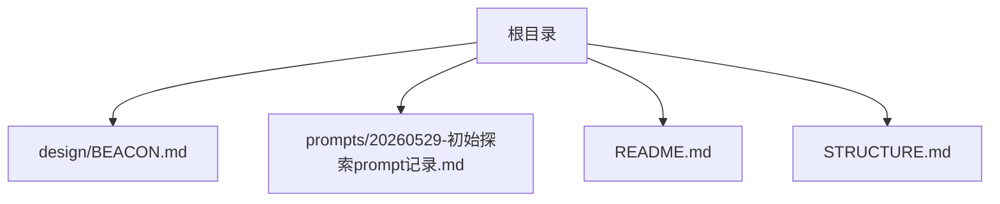
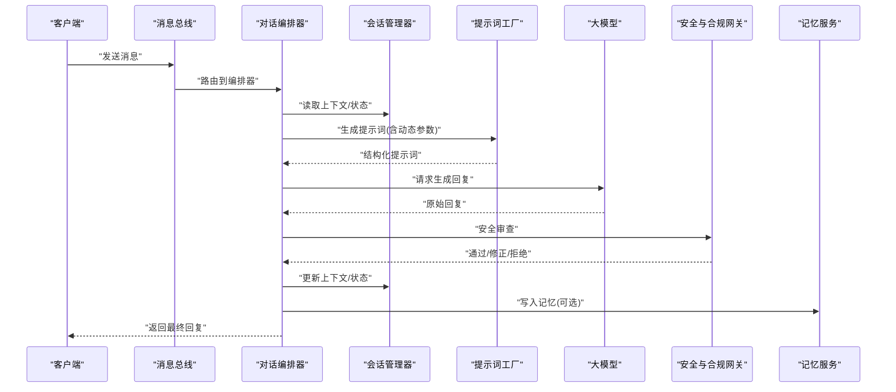
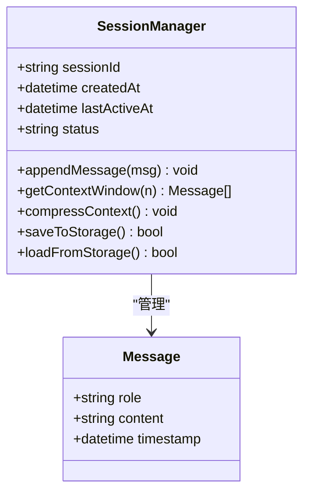
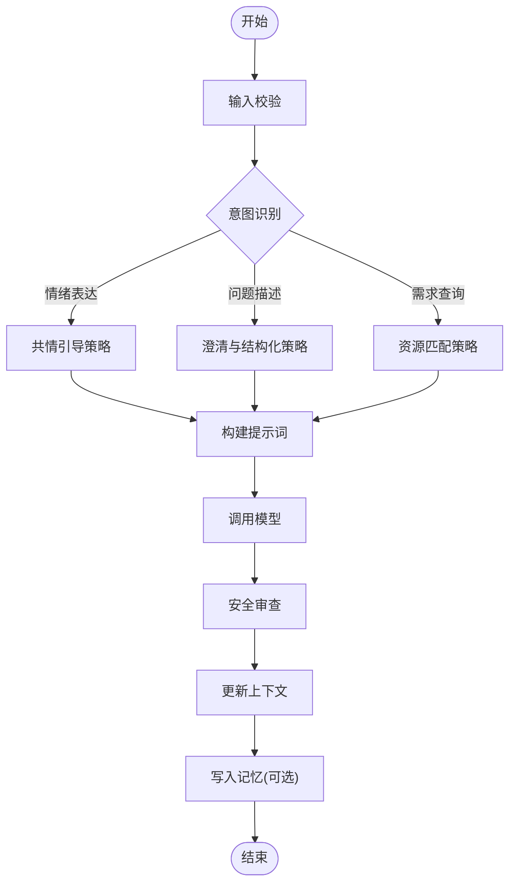
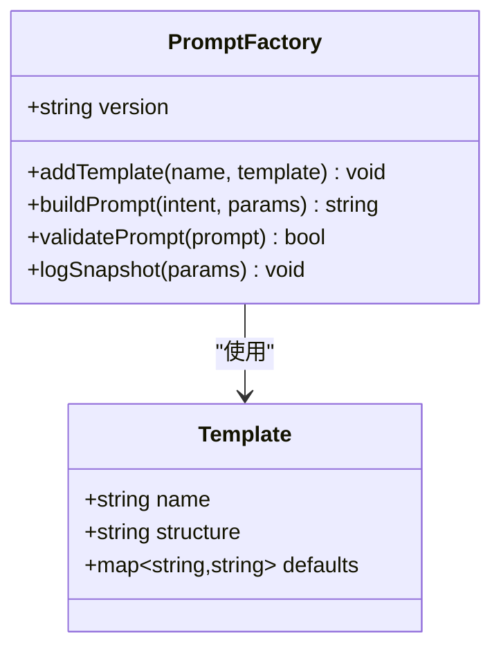
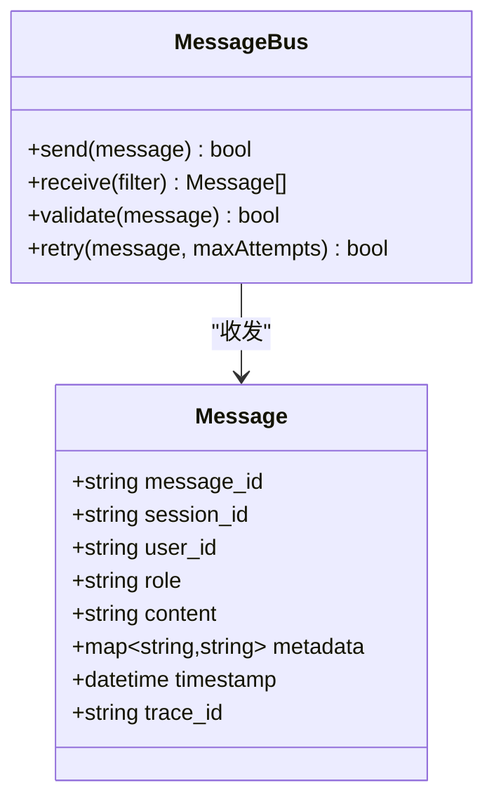
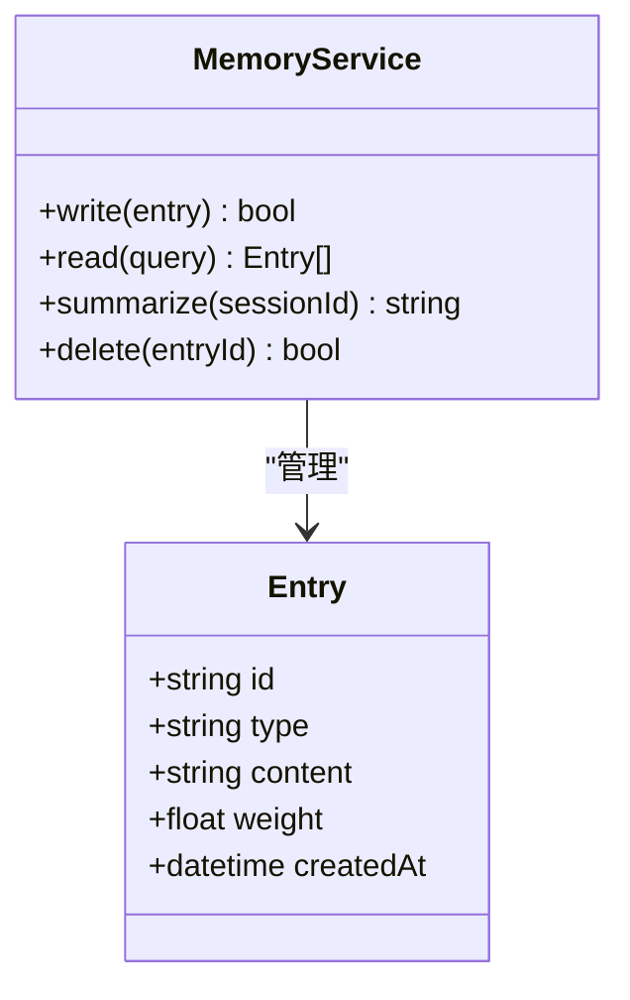
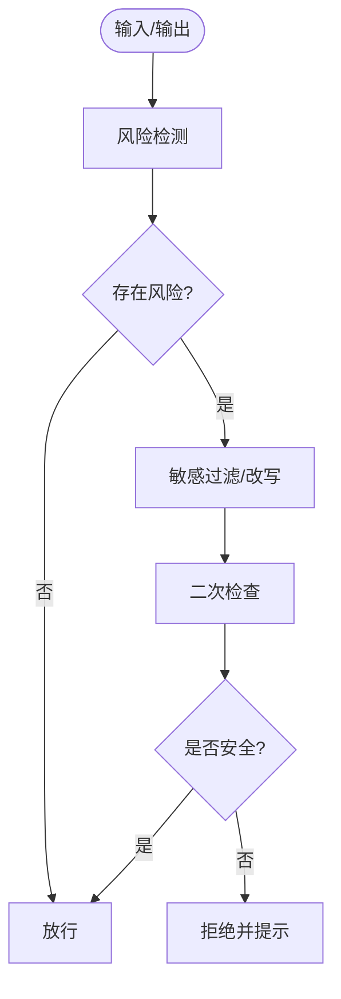
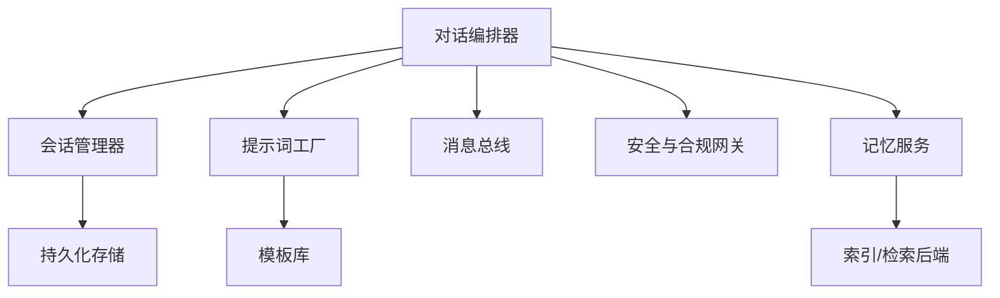

# 对话管理系统

<cite>
**本文引用的文件**   
- [README.md](file://README.md)
- [STRUCTURE.md](file://STRUCTURE.md)
- [BEACON.md](file://design/BEACON.md)
- [20260529-初始探索prompt记录.md](file://prompts/20260529-初始探索prompt记录.md)
</cite>

## 目录
1. [简介](#简介)
2. [项目结构](#项目结构)
3. [核心组件](#核心组件)
4. [架构总览](#架构总览)
5. [详细组件分析](#详细组件分析)
6. [依赖分析](#依赖分析)
7. [性能考虑](#性能考虑)
8. [故障排查指南](#故障排查指南)
9. [结论](#结论)
10. [附录](#附录)

## 简介
本技术文档聚焦于AI心理咨询系统的“对话管理系统”，围绕以下目标展开：
- 对话上下文管理与会话状态维护
- 多轮对话处理能力
- 提示词工程在对话中的应用（结构设计、动态参数注入、响应优化）
- 用户输入类型处理（情绪表达、问题描述、需求查询）
- 对话流程图、消息格式定义与错误处理机制
- 个性化对话体验与记忆功能实现思路

说明：当前仓库未包含具体源码实现，本文基于现有设计文档与提示词记录进行系统化梳理，提供可落地的架构与实现建议。

## 项目结构
仓库采用分层组织方式，关键目录与文件如下：
- design/BEACON.md：系统设计与交互原则
- prompts/20260529-初始探索prompt记录.md：提示词设计与迭代记录
- README.md、STRUCTURE.md：项目概览与结构说明

图表来源
- [BEACON.md](file://design/BEACON.md)
- [20260529-初始探索prompt记录.md](file://prompts/20260529-初始探索prompt记录.md)
- [README.md](file://README.md)
- [STRUCTURE.md](file://STRUCTURE.md)

章节来源
- [README.md](file://README.md)
- [STRUCTURE.md](file://STRUCTURE.md)
- [BEACON.md](file://design/BEACON.md)
- [20260529-初始探索prompt记录.md](file://prompts/20260529-初始探索prompt记录.md)

## 核心组件
对话管理系统由以下核心组件构成（概念性说明，便于后续落地实现）：
- 会话管理器（SessionManager）：负责会话生命周期、上下文窗口、记忆存取
- 对话编排器（DialogueOrchestrator）：解析意图、选择策略、组装提示词、调度模型
- 提示词工厂（PromptFactory）：根据场景与参数生成结构化提示词
- 消息总线（MessageBus）：统一消息格式、路由与校验
- 记忆服务（MemoryService）：长期/短期记忆读写、摘要与检索
- 安全与合规网关（SafetyGate）：风险识别、敏感信息过滤、伦理约束

职责边界清晰、松耦合，便于扩展与测试。

章节来源
- [BEACON.md](file://design/BEACON.md)

## 架构总览
对话管理系统整体流程如下：
- 客户端发送消息至消息总线
- 对话编排器解析意图并加载会话上下文
- 提示词工厂按策略生成提示词并注入动态参数
- 调用大模型生成回复
- 安全与合规网关对输出进行审查
- 更新会话上下文与记忆服务
- 返回结果给客户端

图表来源
- [BEACON.md](file://design/BEACON.md)

## 详细组件分析

### 会话管理器（SessionManager）
- 职责
  - 维护会话ID、时间戳、活跃状态
  - 管理上下文窗口（最近N条消息、摘要、关键事实）
  - 提供持久化接口（本地缓存/远程存储）
- 数据结构
  - 会话元数据：id、创建时间、最后活跃时间、状态
  - 上下文列表：消息序列、角色、时间戳
  - 摘要与事实：主题、关键词、情感倾向、承诺事项
- 复杂度
  - 上下文滑动窗口：O(1)追加、O(k)裁剪
  - 摘要合并：近似线性，受摘要长度影响
- 错误处理
  - 上下文溢出：触发压缩或摘要
  - 持久化失败：降级为内存模式并告警

图表来源
- [BEACON.md](file://design/BEACON.md)

章节来源
- [BEACON.md](file://design/BEACON.md)

### 对话编排器（DialogueOrchestrator）
- 职责
  - 意图识别与分流（情绪表达、问题描述、需求查询）
  - 策略选择（共情引导、澄清提问、资源推荐、转人工）
  - 组装提示词、调用模型、后处理
- 处理流程
  - 输入校验 -> 意图分类 -> 上下文加载 -> 提示词生成 -> 模型调用 -> 安全审查 -> 记忆更新 -> 返回

图表来源
- [BEACON.md](file://design/BEACON.md)

章节来源
- [BEACON.md](file://design/BEACON.md)

### 提示词工厂（PromptFactory）
- 职责
  - 模板管理：基础模板、场景模板、风格模板
  - 动态参数注入：用户画像、历史摘要、当前意图、约束条件
  - 响应优化：结构化输出、分步推理、安全约束
- 设计要点
  - 模块化：将角色、任务、背景、约束、示例分离
  - 可配置：支持A/B测试不同提示词变体
  - 可观测：记录提示词版本与参数快照

图表来源
- [20260529-初始探索prompt记录.md](file://prompts/20260529-初始探索prompt记录.md)

章节来源
- [20260529-初始探索prompt记录.md](file://prompts/20260529-初始探索prompt记录.md)

### 消息总线（MessageBus）
- 职责
  - 统一消息格式与路由
  - 校验必填字段、长度限制、敏感词过滤
  - 重试与幂等控制
- 消息格式定义（字段说明）
  - message_id：唯一标识
  - session_id：会话标识
  - user_id：用户标识
  - role：角色（user/system/assistant）
  - content：文本内容
  - metadata：扩展字段（意图、情感、来源）
  - timestamp：时间戳
  - trace_id：链路追踪

图表来源
- [BEACON.md](file://design/BEACON.md)

章节来源
- [BEACON.md](file://design/BEACON.md)

### 记忆服务（MemoryService）
- 职责
  - 短期记忆：会话内上下文、近期事实
  - 长期记忆：跨会话摘要、偏好、里程碑
  - 检索：关键词、语义相似度、时间衰减
- 数据结构
  - 条目：实体、关系、时间戳、权重
  - 索引：倒排索引、向量索引（可选）
- 复杂度
  - 插入：O(log n)
  - 检索：近似O(1)~O(log n)，取决于索引策略

图表来源
- [BEACON.md](file://design/BEACON.md)

章节来源
- [BEACON.md](file://design/BEACON.md)

### 安全与合规网关（SafetyGate）
- 职责
  - 风险识别：自伤、暴力、违法、隐私泄露
  - 敏感信息过滤：身份证号、联系方式等
  - 伦理约束：避免诊断性结论、鼓励专业求助
- 策略
  - 规则引擎 + 轻量模型辅助判断
  - 白名单/黑名单、阈值控制
  - 审计日志与告警

图表来源
- [BEACON.md](file://design/BEACON.md)

章节来源
- [BEACON.md](file://design/BEACON.md)

## 依赖分析
组件间依赖关系如下：
- 对话编排器依赖会话管理器、提示词工厂、消息总线、安全网关、记忆服务
- 提示词工厂依赖模板库与配置中心
- 会话管理器依赖持久化存储
- 记忆服务依赖索引与检索后端

图表来源
- [BEACON.md](file://design/BEACON.md)

章节来源
- [BEACON.md](file://design/BEACON.md)

## 性能考虑
- 上下文窗口控制：滑动窗口+摘要压缩，降低长对话成本
- 提示词缓存：相同意图与参数的提示词复用
- 异步写入：记忆与日志异步落盘，减少主路径延迟
- 并发与限流：编排器层面对外部模型调用进行限流与熔断
- 缓存策略：热点记忆与常用模板缓存，TTL与失效策略明确

[本节为通用性能建议，不直接分析具体文件]

## 故障排查指南
- 常见问题
  - 上下文丢失：检查会话持久化与恢复逻辑
  - 提示词异常：核对模板版本与参数注入
  - 安全拦截误判：调整阈值与白名单
  - 记忆写入失败：检查索引健康与重试策略
- 定位手段
  - 全链路trace_id追踪
  - 提示词快照与参数记录
  - 安全审查日志与命中规则
  - 会话状态与上下文快照

章节来源
- [BEACON.md](file://design/BEACON.md)

## 结论
本方案以清晰的组件划分与松耦合设计为基础，结合提示词工程与记忆能力，构建了可扩展、可观测、可治理的对话管理系统。通过统一的消息格式、严格的意图分流与安全审查，以及灵活的提示词工厂与记忆服务，能够有效支撑多轮对话、个性化体验与长期记忆。

[本节为总结性内容，不直接分析具体文件]

## 附录

### 消息格式定义（字段清单）
- message_id：字符串，全局唯一
- session_id：字符串，会话唯一
- user_id：字符串，用户唯一
- role：枚举，user/system/assistant
- content：字符串，消息正文
- metadata：键值对，意图、情感、来源等
- timestamp：时间戳
- trace_id：字符串，链路追踪

章节来源
- [BEACON.md](file://design/BEACON.md)

### 提示词工程实践要点
- 结构设计：角色、任务、背景、约束、示例、输出格式
- 动态参数注入：用户画像、历史摘要、当前意图、平台约束
- 响应优化：结构化输出、分步推理、安全约束、可解释性

章节来源
- [20260529-初始探索prompt记录.md](file://prompts/20260529-初始探索prompt记录.md)

### 用户输入类型处理策略
- 情绪表达：共情确认、情绪标签、引导式提问、必要时转介
- 问题描述：澄清关键信息、结构化拆解、提供可行步骤
- 需求查询：资源匹配、优先级排序、风险提示与行动建议

章节来源
- [BEACON.md](file://design/BEACON.md)