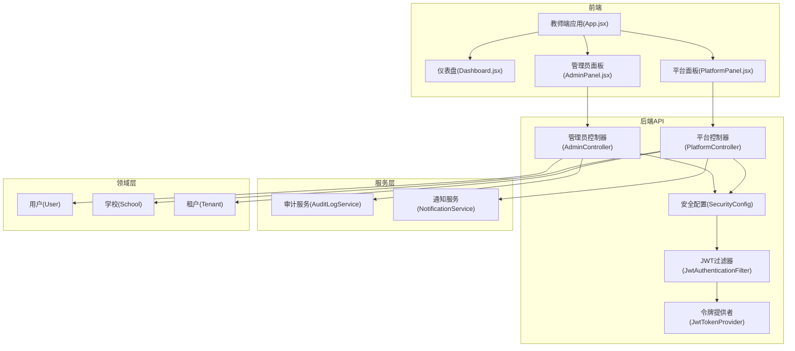
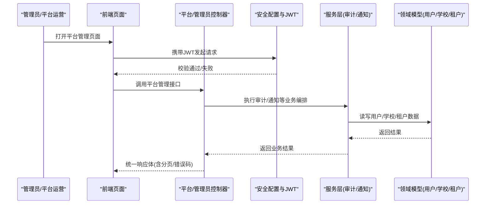
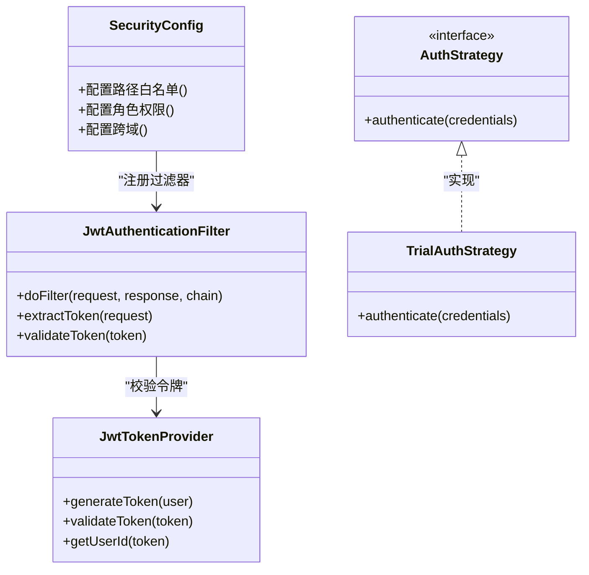
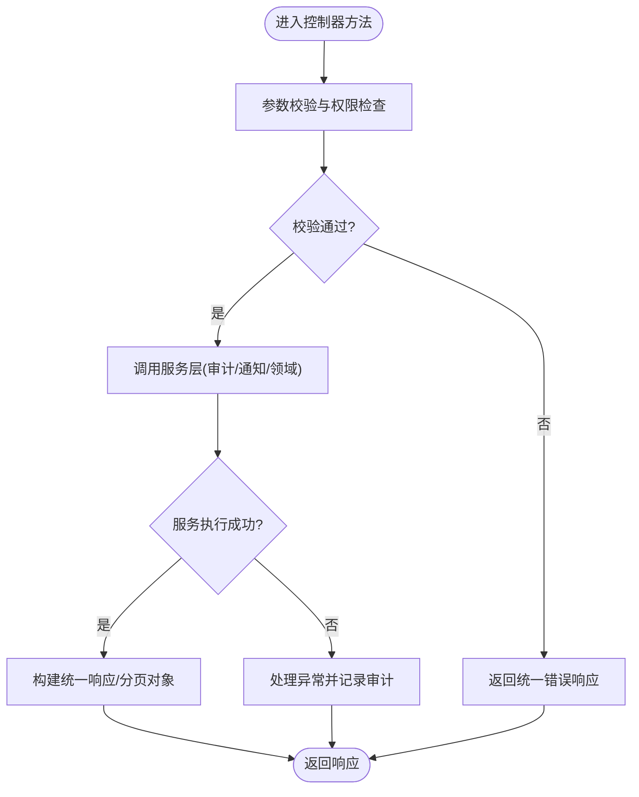
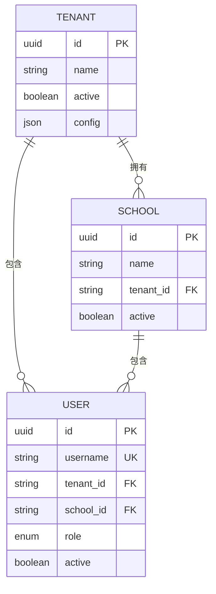
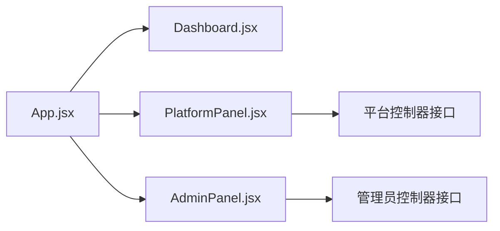
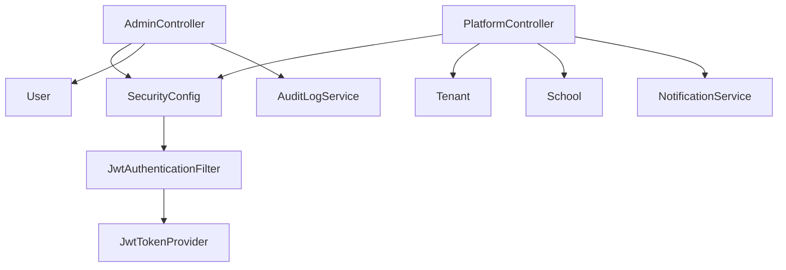

# 平台管理后台

<cite>
**本文引用的文件**   
- [README.md](file://README.md)
- [STRUCTURE.md](file://STRUCTURE.md)
- [DEPLOY-GUIDE.md](file://DEPLOY-GUIDE.md)
- [backend/counseling-api/src/main/java/com/mindsafe/api/controller/AdminController.java](file://backend/counseling-api/src/main/java/com/mindsafe/api/controller/AdminController.java)
- [backend/counseling-api/src/main/java/com/mindsafe/api/controller/PlatformController.java](file://backend/counseling-api/src/main/java/com/mindsafe/api/controller/PlatformController.java)
- [backend/counseling-api/src/main/java/com/mindsafe/api/config/SecurityConfig.java](file://backend/counseling-api/src/main/java/com/mindsafe/api/config/SecurityConfig.java)
- [backend/counseling-api/src/main/java/com/mindsafe/api/security/JwtAuthenticationFilter.java](file://backend/counseling-api/src/main/java/com/mindsafe/api/security/JwtAuthenticationFilter.java)
- [backend/counseling-api/src/main/java/com/mindsafe/api/security/JwtTokenProvider.java](file://backend/counseling-api/src/main/java/com/mindsafe/api/security/JwtTokenProvider.java)
- [backend/counseling-api/src/main/java/com/mindsafe/api/auth/AuthStrategy.java](file://backend/counseling-api/src/main/java/com/mindsafe/api/auth/AuthStrategy.java)
- [backend/counseling-api/src/main/java/com/mindsafe/api/auth/TrialAuthStrategy.java](file://backend/counseling-api/src/main/java/com/mindsafe/api/auth/TrialAuthStrategy.java)
- [backend/counseling-common/src/main/java/com/mindsafe/common/dto/ApiResponse.java](file://backend/counseling-common/src/main/java/com/mindsafe/common/dto/ApiResponse.java)
- [backend/counseling-common/src/main/java/com/mindsafe/common/dto/PageResponse.java](file://backend/counseling-common/src/main/java/com/mindsafe/common/dto/PageResponse.java)
- [backend/counseling-domain/src/main/java/com/mindsafe/domain/entity/User.java](file://backend/counseling-domain/src/main/java/com/mindsafe/domain/entity/User.java)
- [backend/counseling-domain/src/main/java/com/mindsafe/domain/entity/School.java](file://backend/counseling-domain/src/main/java/com/mindsafe/domain/entity/School.java)
- [backend/counseling-domain/src/main/java/com/mindsafe/domain/entity/Tenant.java](file://backend/counseling-domain/src/main/java/com/mindsafe/domain/entity/Tenant.java)
- [backend/counseling-service/src/main/java/com/mindsafe/service/audit/AuditLogService.java](file://backend/counseling-service/src/main/java/com/mindsafe/service/audit/AuditLogService.java)
- [backend/counseling-service/src/main/java/com/mindsafe/service/notification/NotificationService.java](file://backend/counseling-service/src/main/java/com/mindsafe/service/notification/NotificationService.java)
- [frontend/teacher-web/src/pages/Dashboard.jsx](file://frontend/teacher-web/src/pages/Dashboard.jsx)
- [frontend/teacher-web/src/components/teacher/PlatformPanel.jsx](file://frontend/teacher-web/src/components/teacher/PlatformPanel.jsx)
- [frontend/teacher-web/src/components/teacher/AdminPanel.jsx](file://frontend/teacher-web/src/components/teacher/AdminPanel.jsx)
- [frontend/teacher-web/src/App.jsx](file://frontend/teacher-web/src/App.jsx)
- [deploy/docker-compose.yml](file://deploy/docker-compose.yml)
</cite>

## 目录
1. [简介](#简介)
2. [项目结构](#项目结构)
3. [核心组件](#核心组件)
4. [架构总览](#架构总览)
5. [详细组件分析](#详细组件分析)
6. [依赖分析](#依赖分析)
7. [性能考虑](#性能考虑)
8. [故障排查指南](#故障排查指南)
9. [结论](#结论)
10. [附录](#附录)

## 简介
本文件聚焦“平台管理后台”能力，覆盖多租户与学校（Tenant/School）管理、用户与权限控制、审计与通知、以及前后端交互流程。系统采用 Spring Boot 后端 + React 前端的分层架构，通过 JWT 鉴权与安全配置实现访问控制，使用分页与统一响应封装提升接口一致性，并通过服务层提供业务编排与扩展点。

## 项目结构
- 后端模块
  - API 层：控制器、安全配置、认证策略、WebSocket 告警推送等
  - 领域层：实体与映射器（User、School、Tenant 等）
  - 服务层：审计、通知、对话服务等
  - 公共模块：统一响应体、分页、错误码等
- 前端模块
  - 教师端 Web：仪表盘、平台面板、管理员面板等页面与组件
- 部署与运维
  - Docker Compose、Nginx、监控等

图表来源
- [backend/counseling-api/src/main/java/com/mindsafe/api/config/SecurityConfig.java](file://backend/counseling-api/src/main/java/com/mindsafe/api/config/SecurityConfig.java)
- [backend/counseling-api/src/main/java/com/mindsafe/api/security/JwtAuthenticationFilter.java](file://backend/counseling-api/src/main/java/com/mindsafe/api/security/JwtAuthenticationFilter.java)
- [backend/counseling-api/src/main/java/com/mindsafe/api/security/JwtTokenProvider.java](file://backend/counseling-api/src/main/java/com/mindsafe/api/security/JwtTokenProvider.java)
- [backend/counseling-api/src/main/java/com/mindsafe/api/controller/AdminController.java](file://backend/counseling-api/src/main/java/com/mindsafe/api/controller/AdminController.java)
- [backend/counseling-api/src/main/java/com/mindsafe/api/controller/PlatformController.java](file://backend/counseling-api/src/main/java/com/mindsafe/api/controller/PlatformController.java)
- [backend/counseling-service/src/main/java/com/mindsafe/service/audit/AuditLogService.java](file://backend/counseling-service/src/main/java/com/mindsafe/service/audit/AuditLogService.java)
- [backend/counseling-service/src/main/java/com/mindsafe/service/notification/NotificationService.java](file://backend/counseling-service/src/main/java/com/mindsafe/service/notification/NotificationService.java)
- [backend/counseling-domain/src/main/java/com/mindsafe/domain/entity/User.java](file://backend/counseling-domain/src/main/java/com/mindsafe/domain/entity/User.java)
- [backend/counseling-domain/src/main/java/com/mindsafe/domain/entity/School.java](file://backend/counseling-domain/src/main/java/com/mindsafe/domain/entity/School.java)
- [backend/counseling-domain/src/main/java/com/mindsafe/domain/entity/Tenant.java](file://backend/counseling-domain/src/main/java/com/mindsafe/domain/entity/Tenant.java)
- [frontend/teacher-web/src/App.jsx](file://frontend/teacher-web/src/App.jsx)
- [frontend/teacher-web/src/pages/Dashboard.jsx](file://frontend/teacher-web/src/pages/Dashboard.jsx)
- [frontend/teacher-web/src/components/teacher/PlatformPanel.jsx](file://frontend/teacher-web/src/components/teacher/PlatformPanel.jsx)
- [frontend/teacher-web/src/components/teacher/AdminPanel.jsx](file://frontend/teacher-web/src/components/teacher/AdminPanel.jsx)

章节来源
- [README.md](file://README.md)
- [STRUCTURE.md](file://STRUCTURE.md)
- [DEPLOY-GUIDE.md](file://DEPLOY-GUIDE.md)

## 核心组件
- 安全与鉴权
  - 全局安全配置：定义受保护路径、放行路径、跨域与拦截器链
  - JWT 过滤器：解析请求头中的令牌并注入认证上下文
  - 令牌提供者：生成与校验令牌，维护密钥与过期策略
  - 认证策略：抽象不同登录方式（含试用注册策略）
- 平台管理控制器
  - 管理员控制器：面向超级管理员的租户、学校、用户等管理接口
  - 平台控制器：面向平台运营的多租户、学校、统计与通知相关接口
- 服务层
  - 审计服务：记录关键操作日志，支持查询与导出
  - 通知服务：向老师或管理员推送风险告警与系统消息
- 领域模型
  - 用户、学校、租户等实体及其映射器，支撑多租户隔离与权限划分
- 前端界面
  - 仪表盘、平台面板、管理员面板等页面，调用后端平台管理接口

章节来源
- [backend/counseling-api/src/main/java/com/mindsafe/api/config/SecurityConfig.java](file://backend/counseling-api/src/main/java/com/mindsafe/api/config/SecurityConfig.java)
- [backend/counseling-api/src/main/java/com/mindsafe/api/security/JwtAuthenticationFilter.java](file://backend/counseling-api/src/main/java/com/mindsafe/api/security/JwtAuthenticationFilter.java)
- [backend/counseling-api/src/main/java/com/mindsafe/api/security/JwtTokenProvider.java](file://backend/counseling-api/src/main/java/com/mindsafe/api/security/JwtTokenProvider.java)
- [backend/counseling-api/src/main/java/com/mindsafe/api/auth/AuthStrategy.java](file://backend/counseling-api/src/main/java/com/mindsafe/api/auth/AuthStrategy.java)
- [backend/counseling-api/src/main/java/com/mindsafe/api/auth/TrialAuthStrategy.java](file://backend/counseling-api/src/main/java/com/mindsafe/api/auth/TrialAuthStrategy.java)
- [backend/counseling-api/src/main/java/com/mindsafe/api/controller/AdminController.java](file://backend/counseling-api/src/main/java/com/mindsafe/api/controller/AdminController.java)
- [backend/counseling-api/src/main/java/com/mindsafe/api/controller/PlatformController.java](file://backend/counseling-api/src/main/java/com/mindsafe/api/controller/PlatformController.java)
- [backend/counseling-service/src/main/java/com/mindsafe/service/audit/AuditLogService.java](file://backend/counseling-service/src/main/java/com/mindsafe/service/audit/AuditLogService.java)
- [backend/counseling-service/src/main/java/com/mindsafe/service/notification/NotificationService.java](file://backend/counseling-service/src/main/java/com/mindsafe/service/notification/NotificationService.java)
- [backend/counseling-domain/src/main/java/com/mindsafe/domain/entity/User.java](file://backend/counseling-domain/src/main/java/com/mindsafe/domain/entity/User.java)
- [backend/counseling-domain/src/main/java/com/mindsafe/domain/entity/School.java](file://backend/counseling-domain/src/main/java/com/mindsafe/domain/entity/School.java)
- [backend/counseling-domain/src/main/java/com/mindsafe/domain/entity/Tenant.java](file://backend/counseling-domain/src/main/java/com/mindsafe/domain/entity/Tenant.java)
- [frontend/teacher-web/src/pages/Dashboard.jsx](file://frontend/teacher-web/src/pages/Dashboard.jsx)
- [frontend/teacher-web/src/components/teacher/PlatformPanel.jsx](file://frontend/teacher-web/src/components/teacher/PlatformPanel.jsx)
- [frontend/teacher-web/src/components/teacher/AdminPanel.jsx](file://frontend/teacher-web/src/components/teacher/AdminPanel.jsx)

## 架构总览
平台管理后台遵循“前端页面 -> API 控制器 -> 服务层 -> 领域模型”的分层模式，安全由统一的过滤器与令牌提供者保障，审计与通知作为横切关注点贯穿管理流程。

图表来源
- [backend/counseling-api/src/main/java/com/mindsafe/api/config/SecurityConfig.java](file://backend/counseling-api/src/main/java/com/mindsafe/api/config/SecurityConfig.java)
- [backend/counseling-api/src/main/java/com/mindsafe/api/security/JwtAuthenticationFilter.java](file://backend/counseling-api/src/main/java/com/mindsafe/api/security/JwtAuthenticationFilter.java)
- [backend/counseling-api/src/main/java/com/mindsafe/api/security/JwtTokenProvider.java](file://backend/counseling-api/src/main/java/com/mindsafe/api/security/JwtTokenProvider.java)
- [backend/counseling-api/src/main/java/com/mindsafe/api/controller/AdminController.java](file://backend/counseling-api/src/main/java/com/mindsafe/api/controller/AdminController.java)
- [backend/counseling-api/src/main/java/com/mindsafe/api/controller/PlatformController.java](file://backend/counseling-api/src/main/java/com/mindsafe/api/controller/PlatformController.java)
- [backend/counseling-service/src/main/java/com/mindsafe/service/audit/AuditLogService.java](file://backend/counseling-service/src/main/java/com/mindsafe/service/audit/AuditLogService.java)
- [backend/counseling-service/src/main/java/com/mindsafe/service/notification/NotificationService.java](file://backend/counseling-service/src/main/java/com/mindsafe/service/notification/NotificationService.java)
- [backend/counseling-domain/src/main/java/com/mindsafe/domain/entity/User.java](file://backend/counseling-domain/src/main/java/com/mindsafe/domain/entity/User.java)
- [backend/counseling-domain/src/main/java/com/mindsafe/domain/entity/School.java](file://backend/counseling-domain/src/main/java/com/mindsafe/domain/entity/School.java)
- [backend/counseling-domain/src/main/java/com/mindsafe/domain/entity/Tenant.java](file://backend/counseling-domain/src/main/java/com/mindsafe/domain/entity/Tenant.java)

## 详细组件分析

### 安全与鉴权组件
- 安全配置：集中管理路径白名单、角色/权限规则、跨域与拦截器顺序
- JWT 过滤器：从请求头提取令牌，校验签名与有效期，设置认证上下文
- 令牌提供者：负责令牌签发、刷新与验证，支持密钥轮换与过期策略
- 认证策略：抽象登录流程，支持试用注册等扩展场景

图表来源
- [backend/counseling-api/src/main/java/com/mindsafe/api/config/SecurityConfig.java](file://backend/counseling-api/src/main/java/com/mindsafe/api/config/SecurityConfig.java)
- [backend/counseling-api/src/main/java/com/mindsafe/api/security/JwtAuthenticationFilter.java](file://backend/counseling-api/src/main/java/com/mindsafe/api/security/JwtAuthenticationFilter.java)
- [backend/counseling-api/src/main/java/com/mindsafe/api/security/JwtTokenProvider.java](file://backend/counseling-api/src/main/java/com/mindsafe/api/security/JwtTokenProvider.java)
- [backend/counseling-api/src/main/java/com/mindsafe/api/auth/AuthStrategy.java](file://backend/counseling-api/src/main/java/com/mindsafe/api/auth/AuthStrategy.java)
- [backend/counseling-api/src/main/java/com/mindsafe/api/auth/TrialAuthStrategy.java](file://backend/counseling-api/src/main/java/com/mindsafe/api/auth/TrialAuthStrategy.java)

章节来源
- [backend/counseling-api/src/main/java/com/mindsafe/api/config/SecurityConfig.java](file://backend/counseling-api/src/main/java/com/mindsafe/api/config/SecurityConfig.java)
- [backend/counseling-api/src/main/java/com/mindsafe/api/security/JwtAuthenticationFilter.java](file://backend/counseling-api/src/main/java/com/mindsafe/api/security/JwtAuthenticationFilter.java)
- [backend/counseling-api/src/main/java/com/mindsafe/api/security/JwtTokenProvider.java](file://backend/counseling-api/src/main/java/com/mindsafe/api/security/JwtTokenProvider.java)
- [backend/counseling-api/src/main/java/com/mindsafe/api/auth/AuthStrategy.java](file://backend/counseling-api/src/main/java/com/mindsafe/api/auth/AuthStrategy.java)
- [backend/counseling-api/src/main/java/com/mindsafe/api/auth/TrialAuthStrategy.java](file://backend/counseling-api/src/main/java/com/mindsafe/api/auth/TrialAuthStrategy.java)

### 平台管理控制器
- 管理员控制器：提供租户创建、学校管理、用户增删改查、权限分配等接口
- 平台控制器：提供平台级统计、通知下发、资源配额、健康检查等接口
- 统一响应与分页：所有接口返回统一格式，支持分页查询

图表来源
- [backend/counseling-api/src/main/java/com/mindsafe/api/controller/AdminController.java](file://backend/counseling-api/src/main/java/com/mindsafe/api/controller/AdminController.java)
- [backend/counseling-api/src/main/java/com/mindsafe/api/controller/PlatformController.java](file://backend/counseling-api/src/main/java/com/mindsafe/api/controller/PlatformController.java)
- [backend/counseling-common/src/main/java/com/mindsafe/common/dto/ApiResponse.java](file://backend/counseling-common/src/main/java/com/mindsafe/common/dto/ApiResponse.java)
- [backend/counseling-common/src/main/java/com/mindsafe/common/dto/PageResponse.java](file://backend/counseling-common/src/main/java/com/mindsafe/common/dto/PageResponse.java)
- [backend/counseling-service/src/main/java/com/mindsafe/service/audit/AuditLogService.java](file://backend/counseling-service/src/main/java/com/mindsafe/service/audit/AuditLogService.java)

章节来源
- [backend/counseling-api/src/main/java/com/mindsafe/api/controller/AdminController.java](file://backend/counseling-api/src/main/java/com/mindsafe/api/controller/AdminController.java)
- [backend/counseling-api/src/main/java/com/mindsafe/api/controller/PlatformController.java](file://backend/counseling-api/src/main/java/com/mindsafe/api/controller/PlatformController.java)
- [backend/counseling-common/src/main/java/com/mindsafe/common/dto/ApiResponse.java](file://backend/counseling-common/src/main/java/com/mindsafe/common/dto/ApiResponse.java)
- [backend/counseling-common/src/main/java/com/mindsafe/common/dto/PageResponse.java](file://backend/counseling-common/src/main/java/com/mindsafe/common/dto/PageResponse.java)
- [backend/counseling-service/src/main/java/com/mindsafe/service/audit/AuditLogService.java](file://backend/counseling-service/src/main/java/com/mindsafe/service/audit/AuditLogService.java)

### 领域模型与多租户
- 用户：包含角色、所属租户/学校、状态等字段
- 学校：归属租户，承载学生与教师组织关系
- 租户：平台多租户隔离的基本单位，承载配置与配额

图表来源
- [backend/counseling-domain/src/main/java/com/mindsafe/domain/entity/User.java](file://backend/counseling-domain/src/main/java/com/mindsafe/domain/entity/User.java)
- [backend/counseling-domain/src/main/java/com/mindsafe/domain/entity/School.java](file://backend/counseling-domain/src/main/java/com/mindsafe/domain/entity/School.java)
- [backend/counseling-domain/src/main/java/com/mindsafe/domain/entity/Tenant.java](file://backend/counseling-domain/src/main/java/com/mindsafe/domain/entity/Tenant.java)

章节来源
- [backend/counseling-domain/src/main/java/com/mindsafe/domain/entity/User.java](file://backend/counseling-domain/src/main/java/com/mindsafe/domain/entity/User.java)
- [backend/counseling-domain/src/main/java/com/mindsafe/domain/entity/School.java](file://backend/counseling-domain/src/main/java/com/mindsafe/domain/entity/School.java)
- [backend/counseling-domain/src/main/java/com/mindsafe/domain/entity/Tenant.java](file://backend/counseling-domain/src/main/java/com/mindsafe/domain/entity/Tenant.java)

### 前端平台管理界面
- 仪表盘：展示平台关键指标与快捷入口
- 平台面板：租户与学校管理、通知下发、统计报表
- 管理员面板：用户与权限管理、审计日志查看

图表来源
- [frontend/teacher-web/src/App.jsx](file://frontend/teacher-web/src/App.jsx)
- [frontend/teacher-web/src/pages/Dashboard.jsx](file://frontend/teacher-web/src/pages/Dashboard.jsx)
- [frontend/teacher-web/src/components/teacher/PlatformPanel.jsx](file://frontend/teacher-web/src/components/teacher/PlatformPanel.jsx)
- [frontend/teacher-web/src/components/teacher/AdminPanel.jsx](file://frontend/teacher-web/src/components/teacher/AdminPanel.jsx)
- [backend/counseling-api/src/main/java/com/mindsafe/api/controller/PlatformController.java](file://backend/counseling-api/src/main/java/com/mindsafe/api/controller/PlatformController.java)
- [backend/counseling-api/src/main/java/com/mindsafe/api/controller/AdminController.java](file://backend/counseling-api/src/main/java/com/mindsafe/api/controller/AdminController.java)

章节来源
- [frontend/teacher-web/src/App.jsx](file://frontend/teacher-web/src/App.jsx)
- [frontend/teacher-web/src/pages/Dashboard.jsx](file://frontend/teacher-web/src/pages/Dashboard.jsx)
- [frontend/teacher-web/src/components/teacher/PlatformPanel.jsx](file://frontend/teacher-web/src/components/teacher/PlatformPanel.jsx)
- [frontend/teacher-web/src/components/teacher/AdminPanel.jsx](file://frontend/teacher-web/src/components/teacher/AdminPanel.jsx)

## 依赖分析
- 组件耦合
  - 控制器依赖服务层，服务层依赖领域模型；安全过滤器与令牌提供者为横切依赖
  - 审计与通知服务可被多个控制器复用，降低重复逻辑
- 外部依赖
  - 数据库迁移脚本位于应用资源中，启动时自动执行
  - Nginx 反向代理与 Docker Compose 编排用于部署

图表来源
- [backend/counseling-api/src/main/java/com/mindsafe/api/controller/AdminController.java](file://backend/counseling-api/src/main/java/com/mindsafe/api/controller/AdminController.java)
- [backend/counseling-api/src/main/java/com/mindsafe/api/controller/PlatformController.java](file://backend/counseling-api/src/main/java/com/mindsafe/api/controller/PlatformController.java)
- [backend/counseling-service/src/main/java/com/mindsafe/service/audit/AuditLogService.java](file://backend/counseling-service/src/main/java/com/mindsafe/service/audit/AuditLogService.java)
- [backend/counseling-service/src/main/java/com/mindsafe/service/notification/NotificationService.java](file://backend/counseling-service/src/main/java/com/mindsafe/service/notification/NotificationService.java)
- [backend/counseling-domain/src/main/java/com/mindsafe/domain/entity/User.java](file://backend/counseling-domain/src/main/java/com/mindsafe/domain/entity/User.java)
- [backend/counseling-domain/src/main/java/com/mindsafe/domain/entity/School.java](file://backend/counseling-domain/src/main/java/com/mindsafe/domain/entity/School.java)
- [backend/counseling-domain/src/main/java/com/mindsafe/domain/entity/Tenant.java](file://backend/counseling-domain/src/main/java/com/mindsafe/domain/entity/Tenant.java)
- [backend/counseling-api/src/main/java/com/mindsafe/api/config/SecurityConfig.java](file://backend/counseling-api/src/main/java/com/mindsafe/api/config/SecurityConfig.java)
- [backend/counseling-api/src/main/java/com/mindsafe/api/security/JwtAuthenticationFilter.java](file://backend/counseling-api/src/main/java/com/mindsafe/api/security/JwtAuthenticationFilter.java)
- [backend/counseling-api/src/main/java/com/mindsafe/api/security/JwtTokenProvider.java](file://backend/counseling-api/src/main/java/com/mindsafe/api/security/JwtTokenProvider.java)

章节来源
- [backend/counseling-api/src/main/java/com/mindsafe/api/controller/AdminController.java](file://backend/counseling-api/src/main/java/com/mindsafe/api/controller/AdminController.java)
- [backend/counseling-api/src/main/java/com/mindsafe/api/controller/PlatformController.java](file://backend/counseling-api/src/main/java/com/mindsafe/api/controller/PlatformController.java)
- [backend/counseling-service/src/main/java/com/mindsafe/service/audit/AuditLogService.java](file://backend/counseling-service/src/main/java/com/mindsafe/service/audit/AuditLogService.java)
- [backend/counseling-service/src/main/java/com/mindsafe/service/notification/NotificationService.java](file://backend/counseling-service/src/main/java/com/mindsafe/service/notification/NotificationService.java)
- [backend/counseling-domain/src/main/java/com/mindsafe/domain/entity/User.java](file://backend/counseling-domain/src/main/java/com/mindsafe/domain/entity/User.java)
- [backend/counseling-domain/src/main/java/com/mindsafe/domain/entity/School.java](file://backend/counseling-domain/src/main/java/com/mindsafe/domain/entity/School.java)
- [backend/counseling-domain/src/main/java/com/mindsafe/domain/entity/Tenant.java](file://backend/counseling-domain/src/main/java/com/mindsafe/domain/entity/Tenant.java)
- [backend/counseling-api/src/main/java/com/mindsafe/api/config/SecurityConfig.java](file://backend/counseling-api/src/main/java/com/mindsafe/api/config/SecurityConfig.java)
- [backend/counseling-api/src/main/java/com/mindsafe/api/security/JwtAuthenticationFilter.java](file://backend/counseling-api/src/main/java/com/mindsafe/api/security/JwtAuthenticationFilter.java)
- [backend/counseling-api/src/main/java/com/mindsafe/api/security/JwtTokenProvider.java](file://backend/counseling-api/src/main/java/com/mindsafe/api/security/JwtTokenProvider.java)

## 性能考虑
- 分页与限流：列表接口默认分页，避免一次性加载大量数据；必要时结合限流策略保护接口
- 缓存与异步：对热点配置（如租户/学校元数据）可引入缓存；通知与审计写入可异步化
- 连接池与索引：数据库连接池合理配置，针对高频查询字段建立索引
- 前端优化：按需加载页面与组件，减少首屏体积；合并请求与防抖节流

[本节为通用指导，不直接分析具体文件]

## 故障排查指南
- 鉴权失败
  - 检查 JWT 是否过期、签名是否正确、请求头是否携带
  - 确认安全配置中路径白名单与角色权限设置
- 接口报错
  - 统一响应体包含错误码与消息，优先定位错误码
  - 查看审计日志与服务日志，定位异常堆栈
- 多租户问题
  - 确认当前用户的租户/学校上下文是否正确注入
  - 检查数据隔离查询条件是否生效
- 部署问题
  - 核对 Docker Compose 环境变量与端口映射
  - 检查 Nginx 反向代理配置与证书

章节来源
- [backend/counseling-api/src/main/java/com/mindsafe/api/config/SecurityConfig.java](file://backend/counseling-api/src/main/java/com/mindsafe/api/config/SecurityConfig.java)
- [backend/counseling-api/src/main/java/com/mindsafe/api/security/JwtAuthenticationFilter.java](file://backend/counseling-api/src/main/java/com/mindsafe/api/security/JwtAuthenticationFilter.java)
- [backend/counseling-api/src/main/java/com/mindsafe/api/security/JwtTokenProvider.java](file://backend/counseling-api/src/main/java/com/mindsafe/api/security/JwtTokenProvider.java)
- [backend/counseling-common/src/main/java/com/mindsafe/common/dto/ApiResponse.java](file://backend/counseling-common/src/main/java/com/mindsafe/common/dto/ApiResponse.java)
- [backend/counseling-service/src/main/java/com/mindsafe/service/audit/AuditLogService.java](file://backend/counseling-service/src/main/java/com/mindsafe/service/audit/AuditLogService.java)
- [deploy/docker-compose.yml](file://deploy/docker-compose.yml)

## 结论
平台管理后台以清晰的分层架构与完善的安全机制为基础，围绕多租户与学校管理、用户权限、审计与通知等核心能力展开。通过统一响应与分页规范、可扩展的认证策略与横切服务，系统在可维护性与扩展性上具备良好基础。建议在生产环境加强缓存、异步与监控能力，进一步提升稳定性与性能。

[本节为总结性内容，不直接分析具体文件]

## 附录
- 部署参考：Docker Compose 与 Nginx 配置文件位置
- 文档参考：项目结构与部署指南

章节来源
- [DEPLOY-GUIDE.md](file://DEPLOY-GUIDE.md)
- [STRUCTURE.md](file://STRUCTURE.md)
- [deploy/docker-compose.yml](file://deploy/docker-compose.yml)
