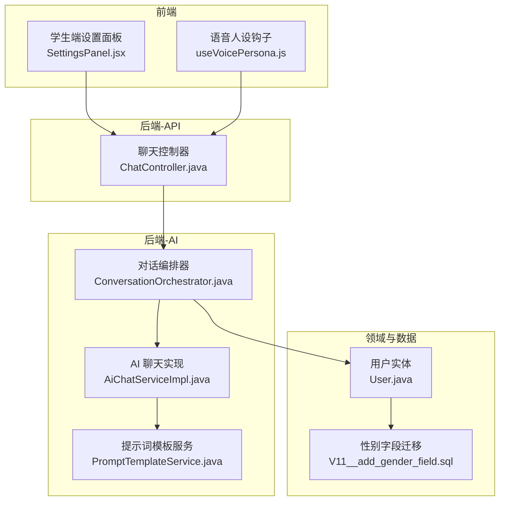
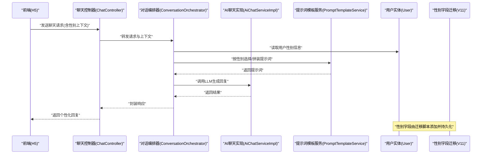
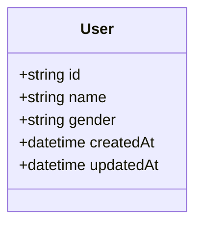
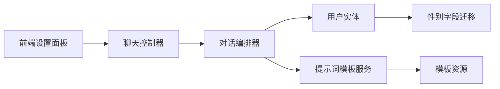

# 性别个性化系统

<cite>
**本文引用的文件**   
- [backend/counseling-domain/src/main/java/com/mindsafe/domain/entity/User.java](file://backend/counseling-domain/src/main/java/com/mindsafe/domain/entity/User.java)
- [backend/counseling-app/src/main/resources/db/migration/V11__add_gender_field.sql](file://backend/counseling-app/src/main/resources/db/migration/V11__add_gender_field.sql)
- [backend/counseling-api/src/main/java/com/mindsafe/api/controller/ChatController.java](file://backend/counseling-api/src/main/java/com/mindsafe/api/controller/ChatController.java)
- [backend/counseling-ai/src/main/java/com/mindsafe/ai/orchestrator/ConversationOrchestrator.java](file://backend/counseling-ai/src/main/java/com/mindsafe/ai/orchestrator/ConversationOrchestrator.java)
- [backend/counseling-ai/src/main/java/com/mindsafe/ai/chat/AiChatServiceImpl.java](file://backend/counseling-ai/src/main/java/com/mindsafe/ai/chat/AiChatServiceImpl.java)
- [backend/counseling-ai/src/main/java/com/mindsafe/ai/prompt/PromptTemplateService.java](file://backend/counseling-ai/src/main/java/com/mindsafe/ai/prompt/PromptTemplateService.java)
- [frontend/student-h5/src/components/SettingsPanel.jsx](file://frontend/student-h5/src/components/SettingsPanel.jsx)
- [frontend/student-h5/src/hooks/useVoicePersona.js](file://frontend/student-h5/src/hooks/useVoicePersona.js)
</cite>

## 目录
1. [简介](#简介)
2. [项目结构](#项目结构)
3. [核心组件](#核心组件)
4. [架构总览](#架构总览)
5. [详细组件分析](#详细组件分析)
6. [依赖关系分析](#依赖关系分析)
7. [性能考量](#性能考量)
8. [故障排查指南](#故障排查指南)
9. [结论](#结论)
10. [附录](#附录)

## 简介
本文件围绕“性别个性化系统”展开，聚焦于在心理咨询对话系统中如何基于用户性别进行个性化适配。该能力贯穿数据模型、数据库迁移、API 层、AI 编排与提示词模板、以及前端交互与语音人设等模块，形成端到端的性别个性化闭环：从用户性别信息的采集与存储，到对话策略与提示词的动态注入，再到前端界面与语音人设的呈现。

## 项目结构
本项目采用前后端分离与多模块后端架构：
- 后端分层清晰：API 控制器层、领域实体与映射层、服务层、AI 编排与提示词层、通用 DTO 与异常定义等。
- 前端包含学生端 H5 与教师端 Web，分别负责学生对话体验与教师管理后台。
- 性别个性化相关的关键点包括：
  - 领域实体 User 中引入性别字段
  - 数据库迁移脚本为现有表增加性别列
  - API 层接收并透传性别信息
  - AI 编排根据性别选择或拼接提示词
  - 前端设置面板与语音人设钩子根据性别调整 UI 与音色

图表来源
- [backend/counseling-api/src/main/java/com/mindsafe/api/controller/ChatController.java](file://backend/counseling-api/src/main/java/com/mindsafe/api/controller/ChatController.java)
- [backend/counseling-ai/src/main/java/com/mindsafe/ai/orchestrator/ConversationOrchestrator.java](file://backend/counseling-ai/src/main/java/com/mindsafe/ai/orchestrator/ConversationOrchestrator.java)
- [backend/counseling-ai/src/main/java/com/mindsafe/ai/chat/AiChatServiceImpl.java](file://backend/counseling-ai/src/main/java/com/mindsafe/ai/chat/AiChatServiceImpl.java)
- [backend/counseling-ai/src/main/java/com/mindsafe/ai/prompt/PromptTemplateService.java](file://backend/counseling-ai/src/main/java/com/mindsafe/ai/prompt/PromptTemplateService.java)
- [backend/counseling-domain/src/main/java/com/mindsafe/domain/entity/User.java](file://backend/counseling-domain/src/main/java/com/mindsafe/domain/entity/User.java)
- [backend/counseling-app/src/main/resources/db/migration/V11__add_gender_field.sql](file://backend/counseling-app/src/main/resources/db/migration/V11__add_gender_field.sql)
- [frontend/student-h5/src/components/SettingsPanel.jsx](file://frontend/student-h5/src/components/SettingsPanel.jsx)
- [frontend/student-h5/src/hooks/useVoicePersona.js](file://frontend/student-h5/src/hooks/useVoicePersona.js)

章节来源
- [backend/counseling-domain/src/main/java/com/mindsafe/domain/entity/User.java](file://backend/counseling-domain/src/main/java/com/mindsafe/domain/entity/User.java)
- [backend/counseling-app/src/main/resources/db/migration/V11__add_gender_field.sql](file://backend/counseling-app/src/main/resources/db/migration/V11__add_gender_field.sql)
- [backend/counseling-api/src/main/java/com/mindsafe/api/controller/ChatController.java](file://backend/counseling-api/src/main/java/com/mindsafe/api/controller/ChatController.java)
- [backend/counseling-ai/src/main/java/com/mindsafe/ai/orchestrator/ConversationOrchestrator.java](file://backend/counseling-ai/src/main/java/com/mindsafe/ai/orchestrator/ConversationOrchestrator.java)
- [backend/counseling-ai/src/main/java/com/mindsafe/ai/chat/AiChatServiceImpl.java](file://backend/counseling-ai/src/main/java/com/mindsafe/ai/chat/AiChatServiceImpl.java)
- [backend/counseling-ai/src/main/java/com/mindsafe/ai/prompt/PromptTemplateService.java](file://backend/counseling-ai/src/main/java/com/mindsafe/ai/prompt/PromptTemplateService.java)
- [frontend/student-h5/src/components/SettingsPanel.jsx](file://frontend/student-h5/src/components/SettingsPanel.jsx)
- [frontend/student-h5/src/hooks/useVoicePersona.js](file://frontend/student-h5/src/hooks/useVoicePersona.js)

## 核心组件
- 用户实体（User）
  - 职责：承载用户基本信息，包括性别字段，作为性别个性化的数据基础。
  - 关键点：性别字段需具备合理的取值范围与默认值策略，便于后续分支逻辑判断。
- 数据库迁移（V11__add_gender_field.sql）
  - 职责：为现有用户表新增性别列，保证向后兼容与数据完整性。
  - 关键点：迁移应处理空值、默认值与索引优化，避免对查询性能造成负面影响。
- 聊天控制器（ChatController）
  - 职责：接收来自前端的聊天请求，解析并透传用户上下文（含性别），调用 AI 编排。
  - 关键点：校验输入参数，确保性别字段有效；统一错误码与响应格式。
- 对话编排器（ConversationOrchestrator）
  - 职责：协调会话状态、安全策略、风险检测与提示词组装，按性别选择差异化策略。
  - 关键点：性别作为上下文变量参与提示词生成与策略路由。
- AI 聊天实现（AiChatServiceImpl）
  - 职责：执行具体的 LLM 调用流程，封装重试、超时与结果解析。
  - 关键点：将性别相关的上下文注入到消息历史或系统提示中。
- 提示词模板服务（PromptTemplateService）
  - 职责：加载与管理提示词模板，支持按性别、年龄、语言等维度动态拼装。
  - 关键点：模板版本化管理，性别分支模板可独立维护与灰度发布。
- 前端设置面板（SettingsPanel.jsx）
  - 职责：提供性别选择与保存入口，更新本地与后端配置。
  - 关键点：表单校验、即时反馈与无障碍访问。
- 语音人设钩子（useVoicePersona.js）
  - 职责：根据性别选择语音音色与说话风格，驱动 TTS 播放。
  - 关键点：缓存策略与降级方案，确保弱网环境下的稳定性。

章节来源
- [backend/counseling-domain/src/main/java/com/mindsafe/domain/entity/User.java](file://backend/counseling-domain/src/main/java/com/mindsafe/domain/entity/User.java)
- [backend/counseling-app/src/main/resources/db/migration/V11__add_gender_field.sql](file://backend/counseling-app/src/main/resources/db/migration/V11__add_gender_field.sql)
- [backend/counseling-api/src/main/java/com/mindsafe/api/controller/ChatController.java](file://backend/counseling-api/src/main/java/com/mindsafe/api/controller/ChatController.java)
- [backend/counseling-ai/src/main/java/com/mindsafe/ai/orchestrator/ConversationOrchestrator.java](file://backend/counseling-ai/src/main/java/com/mindsafe/ai/orchestrator/ConversationOrchestrator.java)
- [backend/counseling-ai/src/main/java/com/mindsafe/ai/chat/AiChatServiceImpl.java](file://backend/counseling-ai/src/main/java/com/mindsafe/ai/chat/AiChatServiceImpl.java)
- [backend/counseling-ai/src/main/java/com/mindsafe/ai/prompt/PromptTemplateService.java](file://backend/counseling-ai/src/main/java/com/mindsafe/ai/prompt/PromptTemplateService.java)
- [frontend/student-h5/src/components/SettingsPanel.jsx](file://frontend/student-h5/src/components/SettingsPanel.jsx)
- [frontend/student-h5/src/hooks/useVoicePersona.js](file://frontend/student-h5/src/hooks/useVoicePersona.js)

## 架构总览
性别个性化系统的整体流程如下：
- 前端通过设置面板收集并保存用户性别，同时根据性别选择语音人设。
- 后端 API 控制器接收聊天请求，携带用户性别上下文。
- AI 编排器根据性别选择提示词模板与对话策略，调用 AI 聊天实现。
- 提示词模板服务按性别动态拼装系统提示与任务指令。
- 领域实体与数据库迁移确保性别数据的持久化与一致性。

图表来源
- [backend/counseling-api/src/main/java/com/mindsafe/api/controller/ChatController.java](file://backend/counseling-api/src/main/java/com/mindsafe/api/controller/ChatController.java)
- [backend/counseling-ai/src/main/java/com/mindsafe/ai/orchestrator/ConversationOrchestrator.java](file://backend/counseling-ai/src/main/java/com/mindsafe/ai/orchestrator/ConversationOrchestrator.java)
- [backend/counseling-ai/src/main/java/com/mindsafe/ai/chat/AiChatServiceImpl.java](file://backend/counseling-ai/src/main/java/com/mindsafe/ai/chat/AiChatServiceImpl.java)
- [backend/counseling-ai/src/main/java/com/mindsafe/ai/prompt/PromptTemplateService.java](file://backend/counseling-ai/src/main/java/com/mindsafe/ai/prompt/PromptTemplateService.java)
- [backend/counseling-domain/src/main/java/com/mindsafe/domain/entity/User.java](file://backend/counseling-domain/src/main/java/com/mindsafe/domain/entity/User.java)
- [backend/counseling-app/src/main/resources/db/migration/V11__add_gender_field.sql](file://backend/counseling-app/src/main/resources/db/migration/V11__add_gender_field.sql)

## 详细组件分析

### 用户实体与性别字段
- 设计要点
  - 实体中包含性别字段，用于标识用户性别，支撑后续个性化逻辑。
  - 建议枚举或受限字符串类型，限制取值范围，避免脏数据。
- 数据流
  - 前端设置面板提交性别后，经 API 写入领域实体，并由迁移脚本保障数据库结构一致。
- 复杂度与影响
  - 查询与过滤时可按性别建立索引，提升统计与推荐效率。
  - 默认值策略需考虑新用户注册场景，避免空值分支过多。

图表来源
- [backend/counseling-domain/src/main/java/com/mindsafe/domain/entity/User.java](file://backend/counseling-domain/src/main/java/com/mindsafe/domain/entity/User.java)

章节来源
- [backend/counseling-domain/src/main/java/com/mindsafe/domain/entity/User.java](file://backend/counseling-domain/src/main/java/com/mindsafe/domain/entity/User.java)
- [backend/counseling-app/src/main/resources/db/migration/V11__add_gender_field.sql](file://backend/counseling-app/src/main/resources/db/migration/V11__add_gender_field.sql)

### 数据库迁移与兼容性
- 设计要点
  - 迁移脚本为现有用户表新增性别列，确保向后兼容。
  - 需要处理历史数据的默认值与约束，避免插入失败。
- 注意事项
  - 迁移幂等性：重复执行不产生副作用。
  - 回滚策略：保留回滚脚本或可逆操作。
  - 性能影响：大表加列需评估锁与 IO 开销，必要时分批次执行。

章节来源
- [backend/counseling-app/src/main/resources/db/migration/V11__add_gender_field.sql](file://backend/counseling-app/src/main/resources/db/migration/V11__add_gender_field.sql)

### 聊天控制器与上下文透传
- 设计要点
  - 接收前端请求，校验性别字段有效性。
  - 将用户上下文（含性别）传递给编排器，确保下游能感知性别。
- 错误处理
  - 非法性别值返回明确错误码与提示信息。
  - 缺失上下文时走默认策略，保证可用性。

章节来源
- [backend/counseling-api/src/main/java/com/mindsafe/api/controller/ChatController.java](file://backend/counseling-api/src/main/java/com/mindsafe/api/controller/ChatController.java)

### 对话编排器与性别策略路由
- 设计要点
  - 编排器整合会话状态、安全策略与提示词组装。
  - 性别作为关键上下文变量，决定提示词模板选择与对话策略分支。
- 扩展性
  - 策略路由可扩展至年龄、语言、角色等多维特征。
  - 模板版本化管理，支持 A/B 测试与灰度发布。

章节来源
- [backend/counseling-ai/src/main/java/com/mindsafe/ai/orchestrator/ConversationOrchestrator.java](file://backend/counseling-ai/src/main/java/com/mindsafe/ai/orchestrator/ConversationOrchestrator.java)

### AI 聊天实现与上下文注入
- 设计要点
  - 封装 LLM 调用流程，处理重试、超时与结果解析。
  - 将性别相关的上下文注入到消息历史或系统提示中，确保模型理解用户画像。
- 性能优化
  - 合理设置最大令牌数与温度参数，平衡质量与成本。
  - 缓存常用提示词片段，减少重复计算。

章节来源
- [backend/counseling-ai/src/main/java/com/mindsafe/ai/chat/AiChatServiceImpl.java](file://backend/counseling-ai/src/main/java/com/mindsafe/ai/chat/AiChatServiceImpl.java)

### 提示词模板服务与性别分支
- 设计要点
  - 模板服务按性别、年龄、语言等维度动态拼装提示词。
  - 支持模板版本管理与热更新，快速迭代个性化策略。
- 最佳实践
  - 模板命名规范与路径组织清晰，便于检索与维护。
  - 敏感内容过滤与安全规则嵌入模板，确保输出合规。

章节来源
- [backend/counseling-ai/src/main/java/com/mindsafe/ai/prompt/PromptTemplateService.java](file://backend/counseling-ai/src/main/java/com/mindsafe/ai/prompt/PromptTemplateService.java)

### 前端设置面板与语音人设
- 设计要点
  - 设置面板提供性别选择与保存，实时更新本地与后端配置。
  - 语音人设钩子根据性别选择音色与说话风格，驱动 TTS 播放。
- 用户体验
  - 表单校验与即时反馈，提升易用性。
  - 弱网与降级策略，确保功能可用性与稳定性。

章节来源
- [frontend/student-h5/src/components/SettingsPanel.jsx](file://frontend/student-h5/src/components/SettingsPanel.jsx)
- [frontend/student-h5/src/hooks/useVoicePersona.js](file://frontend/student-h5/src/hooks/useVoicePersona.js)

## 依赖关系分析
性别个性化系统在模块间的依赖关系如下：
- 前端依赖 API 接口获取与更新用户性别。
- API 依赖编排器进行策略路由与提示词组装。
- 编排器依赖领域实体获取用户性别，并依赖提示词模板服务生成个性化提示。
- 提示词模板服务依赖模板资源与版本管理。
- 数据库迁移脚本依赖领域实体结构变更。

图表来源
- [frontend/student-h5/src/components/SettingsPanel.jsx](file://frontend/student-h5/src/components/SettingsPanel.jsx)
- [backend/counseling-api/src/main/java/com/mindsafe/api/controller/ChatController.java](file://backend/counseling-api/src/main/java/com/mindsafe/api/controller/ChatController.java)
- [backend/counseling-ai/src/main/java/com/mindsafe/ai/orchestrator/ConversationOrchestrator.java](file://backend/counseling-ai/src/main/java/com/mindsafe/ai/orchestrator/ConversationOrchestrator.java)
- [backend/counseling-domain/src/main/java/com/mindsafe/domain/entity/User.java](file://backend/counseling-domain/src/main/java/com/mindsafe/domain/entity/User.java)
- [backend/counseling-ai/src/main/java/com/mindsafe/ai/prompt/PromptTemplateService.java](file://backend/counseling-ai/src/main/java/com/mindsafe/ai/prompt/PromptTemplateService.java)
- [backend/counseling-app/src/main/resources/db/migration/V11__add_gender_field.sql](file://backend/counseling-app/src/main/resources/db/migration/V11__add_gender_field.sql)

章节来源
- [backend/counseling-api/src/main/java/com/mindsafe/api/controller/ChatController.java](file://backend/counseling-api/src/main/java/com/mindsafe/api/controller/ChatController.java)
- [backend/counseling-ai/src/main/java/com/mindsafe/ai/orchestrator/ConversationOrchestrator.java](file://backend/counseling-ai/src/main/java/com/mindsafe/ai/orchestrator/ConversationOrchestrator.java)
- [backend/counseling-domain/src/main/java/com/mindsafe/domain/entity/User.java](file://backend/counseling-domain/src/main/java/com/mindsafe/domain/entity/User.java)
- [backend/counseling-ai/src/main/java/com/mindsafe/ai/prompt/PromptTemplateService.java](file://backend/counseling-ai/src/main/java/com/mindsafe/ai/prompt/PromptTemplateService.java)
- [backend/counseling-app/src/main/resources/db/migration/V11__add_gender_field.sql](file://backend/counseling-app/src/main/resources/db/migration/V11__add_gender_field.sql)
- [frontend/student-h5/src/components/SettingsPanel.jsx](file://frontend/student-h5/src/components/SettingsPanel.jsx)

## 性能考量
- 数据库层面
  - 为性别字段建立合适索引，提升按性别筛选与统计的性能。
  - 迁移脚本应避免长时间锁表，必要时分批更新历史数据。
- API 与编排层
  - 缓存常用提示词片段与模板，减少重复拼装与 I/O。
  - 合理设置并发与超时，避免 LLM 调用阻塞主线程。
- 前端层面
  - 语音人设资源按需加载与缓存，降低首屏延迟。
  - 弱网环境下提供降级策略，如切换文本模式或默认音色。

[本节为通用性能指导，无需具体文件引用]

## 故障排查指南
- 性别字段为空或无效
  - 检查前端表单校验与默认值设置。
  - 确认 API 层是否对性别字段进行合法性校验。
  - 查看数据库迁移是否成功执行，字段是否存在且约束正确。
- 提示词未按性别生效
  - 验证编排器是否正确读取用户性别上下文。
  - 检查提示词模板服务是否加载对应性别分支模板。
  - 确认模板版本管理与缓存刷新机制。
- 语音人设未切换
  - 检查 useVoicePersona 钩子是否正确监听性别变化。
  - 确认 TTS 服务可用性与资源加载状态。
  - 查看前端日志与网络请求，定位失败环节。

章节来源
- [backend/counseling-api/src/main/java/com/mindsafe/api/controller/ChatController.java](file://backend/counseling-api/src/main/java/com/mindsafe/api/controller/ChatController.java)
- [backend/counseling-ai/src/main/java/com/mindsafe/ai/orchestrator/ConversationOrchestrator.java](file://backend/counseling-ai/src/main/java/com/mindsafe/ai/orchestrator/ConversationOrchestrator.java)
- [backend/counseling-ai/src/main/java/com/mindsafe/ai/prompt/PromptTemplateService.java](file://backend/counseling-ai/src/main/java/com/mindsafe/ai/prompt/PromptTemplateService.java)
- [frontend/student-h5/src/hooks/useVoicePersona.js](file://frontend/student-h5/src/hooks/useVoicePersona.js)

## 结论
性别个性化系统通过数据模型、数据库迁移、API 层、AI 编排与提示词模板、以及前端交互与语音人设的协同，实现了端到端的性别差异化体验。建议在后续迭代中持续优化模板版本管理、策略路由扩展性与性能缓存机制，以提升系统的可维护性与用户体验。

[本节为总结性内容，无需具体文件引用]

## 附录
- 术语说明
  - 性别个性化：基于用户性别信息定制对话策略、提示词与语音人设。
  - 提示词模板：用于生成系统提示与任务指令的可配置文本片段。
  - 编排器：协调多个服务与策略的核心组件。
- 参考文档
  - 设计文档与技术架构说明位于 design 目录，涵盖 Agent 工作流、API 接口设计与前端架构等。

[本节为补充信息，无需具体文件引用]
