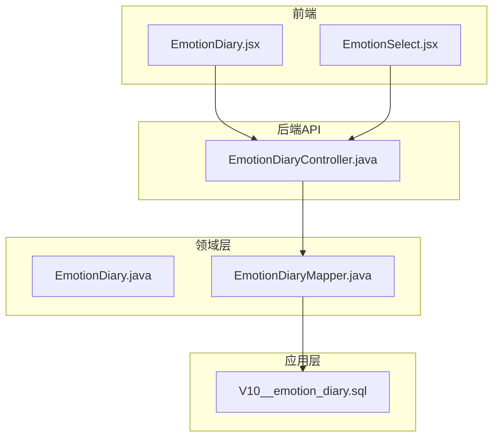
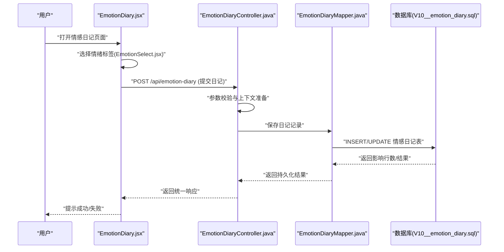
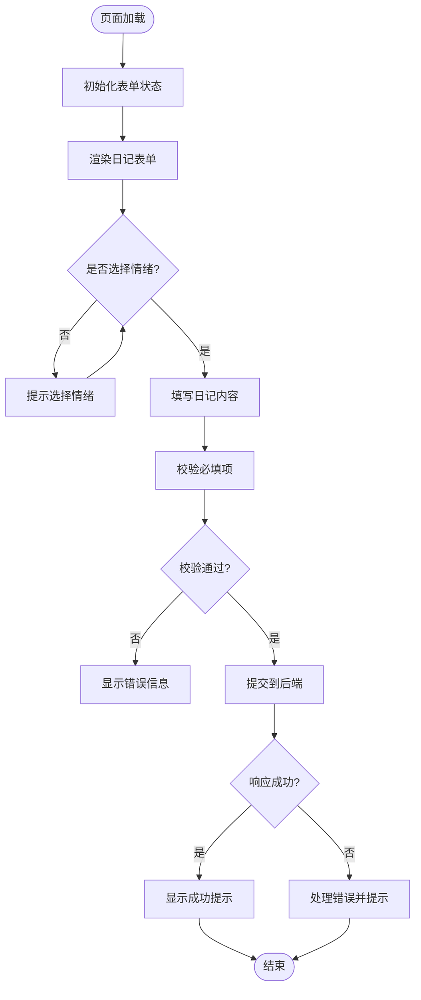
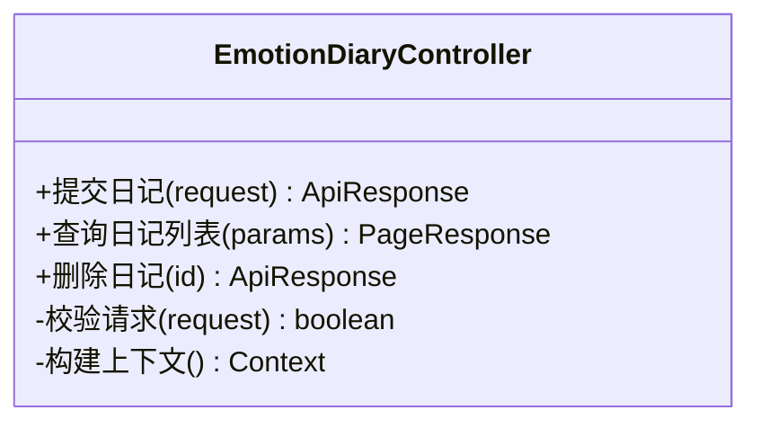
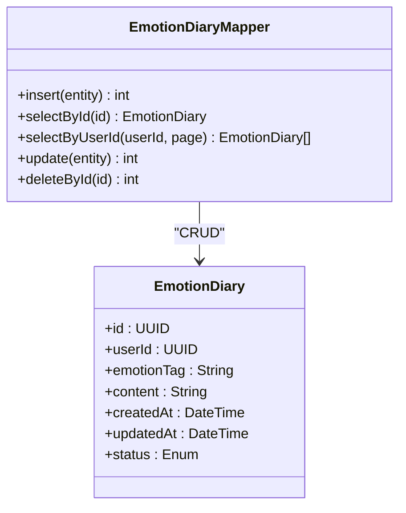
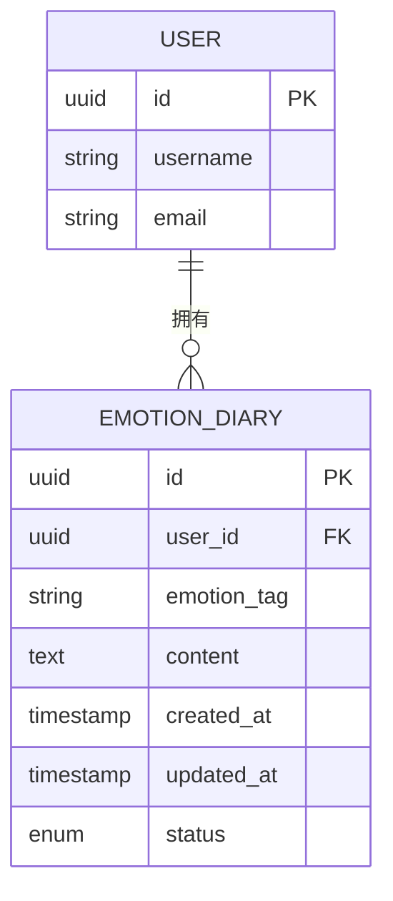
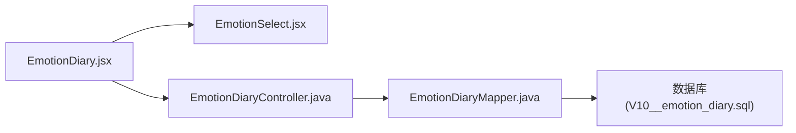

# 情感日记功能

<cite>
**本文引用的文件**   
- [EmotionDiaryController.java](file://backend/counseling-api/src/main/java/com/mindsafe/api/controller/EmotionDiaryController.java)
- [EmotionDiary.java](file://backend/counseling-domain/src/main/java/com/mindsafe/domain/entity/EmotionDiary.java)
- [EmotionDiaryMapper.java](file://backend/counseling-domain/src/main/java/com/mindsafe/domain/mapper/EmotionDiaryMapper.java)
- [V10__emotion_diary.sql](file://backend/counseling-app/src/main/resources/db/migration/V10__emotion_diary.sql)
- [EmotionDiary.jsx](file://frontend/student-h5/src/components/EmotionDiary.jsx)
- [EmotionSelect.jsx](file://frontend/student-h5/src/components/EmotionSelect.jsx)
</cite>

## 目录
1. [简介](#简介)
2. [项目结构](#项目结构)
3. [核心组件](#核心组件)
4. [架构总览](#架构总览)
5. [详细组件分析](#详细组件分析)
6. [依赖分析](#依赖分析)
7. [性能考虑](#性能考虑)
8. [故障排查指南](#故障排查指南)
9. [结论](#结论)
10. [附录](#附录)

## 简介
本章节概述“情感日记”功能的业务目标与整体设计。该功能面向学生用户，支持每日记录情绪、选择情绪标签、提交日记内容，并在后端持久化存储；前端提供可视化交互界面，便于学生快速完成记录。系统通过 REST API 暴露接口，领域层定义数据模型与持久化映射，数据库迁移脚本负责表结构初始化。

## 项目结构
围绕“情感日记”功能，代码分布在以下模块：
- 前端（student-h5）：页面与交互组件
- 后端 API（counseling-api）：控制器与请求处理
- 领域层（counseling-domain）：实体与 Mapper
- 应用层（counseling-app）：数据库迁移脚本

**图表来源** 
- [EmotionDiaryController.java](file://backend/counseling-api/src/main/java/com/mindsafe/api/controller/EmotionDiaryController.java)
- [EmotionDiary.java](file://backend/counseling-domain/src/main/java/com/mindsafe/domain/entity/EmotionDiary.java)
- [EmotionDiaryMapper.java](file://backend/counseling-domain/src/main/java/com/mindsafe/domain/mapper/EmotionDiaryMapper.java)
- [V10__emotion_diary.sql](file://backend/counseling-app/src/main/resources/db/migration/V10__emotion_diary.sql)

**章节来源**
- [EmotionDiaryController.java](file://backend/counseling-api/src/main/java/com/mindsafe/api/controller/EmotionDiaryController.java)
- [EmotionDiary.java](file://backend/counseling-domain/src/main/java/com/mindsafe/domain/entity/EmotionDiary.java)
- [EmotionDiaryMapper.java](file://backend/counseling-domain/src/main/java/com/mindsafe/domain/mapper/EmotionDiaryMapper.java)
- [V10__emotion_diary.sql](file://backend/counseling-app/src/main/resources/db/migration/V10__emotion_diary.sql)

## 核心组件
- 前端组件
  - EmotionDiary：主页面，负责展示表单、收集用户输入、调用后端接口
  - EmotionSelect：情绪选择器，提供可选的情绪标签与交互反馈
- 后端控制器
  - EmotionDiaryController：接收并校验请求，协调领域服务进行持久化
- 领域实体与映射
  - EmotionDiary：定义日记数据的字段与约束
  - EmotionDiaryMapper：定义与数据库的读写操作
- 数据库迁移
  - V10__emotion_diary.sql：创建或更新情感日记相关表结构

**章节来源**
- [EmotionDiary.jsx](file://frontend/student-h5/src/components/EmotionDiary.jsx)
- [EmotionSelect.jsx](file://frontend/student-h5/src/components/EmotionSelect.jsx)
- [EmotionDiaryController.java](file://backend/counseling-api/src/main/java/com/mindsafe/api/controller/EmotionDiaryController.java)
- [EmotionDiary.java](file://backend/counseling-domain/src/main/java/com/mindsafe/domain/entity/EmotionDiary.java)
- [EmotionDiaryMapper.java](file://backend/counseling-domain/src/main/java/com/mindsafe/domain/mapper/EmotionDiaryMapper.java)
- [V10__emotion_diary.sql](file://backend/counseling-app/src/main/resources/db/migration/V10__emotion_diary.sql)

## 架构总览
下图展示了从前端到后端的完整调用链路，包括请求进入、控制器处理、领域映射与数据库访问。

**图表来源** 
- [EmotionDiary.jsx](file://frontend/student-h5/src/components/EmotionDiary.jsx)
- [EmotionSelect.jsx](file://frontend/student-h5/src/components/EmotionSelect.jsx)
- [EmotionDiaryController.java](file://backend/counseling-api/src/main/java/com/mindsafe/api/controller/EmotionDiaryController.java)
- [EmotionDiaryMapper.java](file://backend/counseling-domain/src/main/java/com/mindsafe/domain/mapper/EmotionDiaryMapper.java)
- [V10__emotion_diary.sql](file://backend/counseling-app/src/main/resources/db/migration/V10__emotion_diary.sql)

## 详细组件分析

### 前端组件：EmotionDiary 与 EmotionSelect
- EmotionDiary
  - 职责：渲染日记表单、管理本地状态、发起网络请求、处理响应与错误提示
  - 交互：触发情绪选择、提交按钮点击、加载状态与错误边界
- EmotionSelect
  - 职责：提供情绪选项列表、选中状态管理、向父组件回调选中的情绪值
  - 交互：点击选择、视觉反馈、禁用态与必填校验

**图表来源** 
- [EmotionDiary.jsx](file://frontend/student-h5/src/components/EmotionDiary.jsx)
- [EmotionSelect.jsx](file://frontend/student-h5/src/components/EmotionSelect.jsx)

**章节来源**
- [EmotionDiary.jsx](file://frontend/student-h5/src/components/EmotionDiary.jsx)
- [EmotionSelect.jsx](file://frontend/student-h5/src/components/EmotionSelect.jsx)

### 后端控制器：EmotionDiaryController
- 职责：接收前端提交的日记数据，进行参数校验与权限检查，调用领域映射进行持久化
- 关键点：
  - 请求体结构与字段校验（如用户ID、情绪标签、日记内容等）
  - 统一响应封装与错误码处理
  - 与领域层的解耦（通过 Mapper 或直接服务方法）

**图表来源** 
- [EmotionDiaryController.java](file://backend/counseling-api/src/main/java/com/mindsafe/api/controller/EmotionDiaryController.java)

**章节来源**
- [EmotionDiaryController.java](file://backend/counseling-api/src/main/java/com/mindsafe/api/controller/EmotionDiaryController.java)

### 领域实体与映射：EmotionDiary 与 EmotionDiaryMapper
- EmotionDiary
  - 字段：用户标识、情绪标签、日记内容、时间戳、状态等
  - 约束：非空字段、长度限制、枚举值校验
- EmotionDiaryMapper
  - 方法：新增、查询、分页、删除等
  - 映射：SQL 语句或 ORM 注解映射到数据库表

**图表来源** 
- [EmotionDiary.java](file://backend/counseling-domain/src/main/java/com/mindsafe/domain/entity/EmotionDiary.java)
- [EmotionDiaryMapper.java](file://backend/counseling-domain/src/main/java/com/mindsafe/domain/mapper/EmotionDiaryMapper.java)

**章节来源**
- [EmotionDiary.java](file://backend/counseling-domain/src/main/java/com/mindsafe/domain/entity/EmotionDiary.java)
- [EmotionDiaryMapper.java](file://backend/counseling-domain/src/main/java/com/mindsafe/domain/mapper/EmotionDiaryMapper.java)

### 数据库迁移：V10__emotion_diary.sql
- 职责：创建或更新情感日记相关表结构，包含索引与约束
- 关键点：
  - 表名与字段命名规范
  - 主键与外键关系（如关联用户表）
  - 索引优化（如按用户ID与时间戳查询）

**图表来源** 
- [V10__emotion_diary.sql](file://backend/counseling-app/src/main/resources/db/migration/V10__emotion_diary.sql)

**章节来源**
- [V10__emotion_diary.sql](file://backend/counseling-app/src/main/resources/db/migration/V10__emotion_diary.sql)

## 依赖分析
- 前端依赖
  - EmotionDiary 依赖 EmotionSelect 组件以提供情绪选择能力
  - 两者均依赖统一的 API 客户端进行网络请求
- 后端依赖
  - EmotionDiaryController 依赖 EmotionDiaryMapper 进行数据持久化
  - EmotionDiaryMapper 依赖数据库驱动与连接池
- 数据库依赖
  - V10__emotion_diary.sql 定义的表结构与约束被 Mapper 使用

**图表来源** 
- [EmotionDiary.jsx](file://frontend/student-h5/src/components/EmotionDiary.jsx)
- [EmotionSelect.jsx](file://frontend/student-h5/src/components/EmotionSelect.jsx)
- [EmotionDiaryController.java](file://backend/counseling-api/src/main/java/com/mindsafe/api/controller/EmotionDiaryController.java)
- [EmotionDiaryMapper.java](file://backend/counseling-domain/src/main/java/com/mindsafe/domain/mapper/EmotionDiaryMapper.java)
- [V10__emotion_diary.sql](file://backend/counseling-app/src/main/resources/db/migration/V10__emotion_diary.sql)

**章节来源**
- [EmotionDiary.jsx](file://frontend/student-h5/src/components/EmotionDiary.jsx)
- [EmotionSelect.jsx](file://frontend/student-h5/src/components/EmotionSelect.jsx)
- [EmotionDiaryController.java](file://backend/counseling-api/src/main/java/com/mindsafe/api/controller/EmotionDiaryController.java)
- [EmotionDiaryMapper.java](file://backend/counseling-domain/src/main/java/com/mindsafe/domain/mapper/EmotionDiaryMapper.java)
- [V10__emotion_diary.sql](file://backend/counseling-app/src/main/resources/db/migration/V10__emotion_diary.sql)

## 性能考虑
- 前端
  - 避免重复渲染：在 EmotionSelect 中缓存选项列表
  - 防抖提交：对频繁点击提交进行节流处理
- 后端
  - 批量操作：若需导入历史日记，使用批量插入减少往返次数
  - 索引优化：为常用查询字段（如 userId、createdAt）建立索引
- 数据库
  - 连接池配置：合理设置最大连接数与超时时间
  - 慢查询监控：定期分析执行计划与锁等待

[本节为通用指导，不直接分析具体文件]

## 故障排查指南
- 前端问题
  - 情绪未选中导致提交失败：检查 EmotionSelect 的状态回传逻辑
  - 网络请求错误：查看统一错误码与提示信息
- 后端问题
  - 参数校验失败：确认请求体字段是否符合 DTO 定义
  - 持久化异常：检查 Mapper SQL 与数据库约束
- 数据库问题
  - 表结构不一致：核对迁移脚本版本与当前库结构
  - 索引缺失导致查询缓慢：补充必要索引并验证执行计划

**章节来源**
- [EmotionDiaryController.java](file://backend/counseling-api/src/main/java/com/mindsafe/api/controller/EmotionDiaryController.java)
- [EmotionDiaryMapper.java](file://backend/counseling-domain/src/main/java/com/mindsafe/domain/mapper/EmotionDiaryMapper.java)
- [V10__emotion_diary.sql](file://backend/counseling-app/src/main/resources/db/migration/V10__emotion_diary.sql)

## 结论
“情感日记”功能通过清晰的前后端分层与领域建模，实现了稳定的情绪记录与持久化能力。前端注重用户体验与交互反馈，后端强调参数校验与数据一致性，数据库层面通过迁移脚本保障结构演进。建议在后续迭代中加强性能监控与错误日志采集，以提升可维护性与稳定性。

[本节为总结性内容，不直接分析具体文件]

## 附录
- 术语说明
  - 情绪标签：用于描述用户当前情绪状态的分类词
  - 日记内容：用户对当天经历与感受的文字描述
  - 统一响应：后端返回的标准数据结构，包含状态码、消息与数据体

[本节为概念性内容，不直接分析具体文件]
