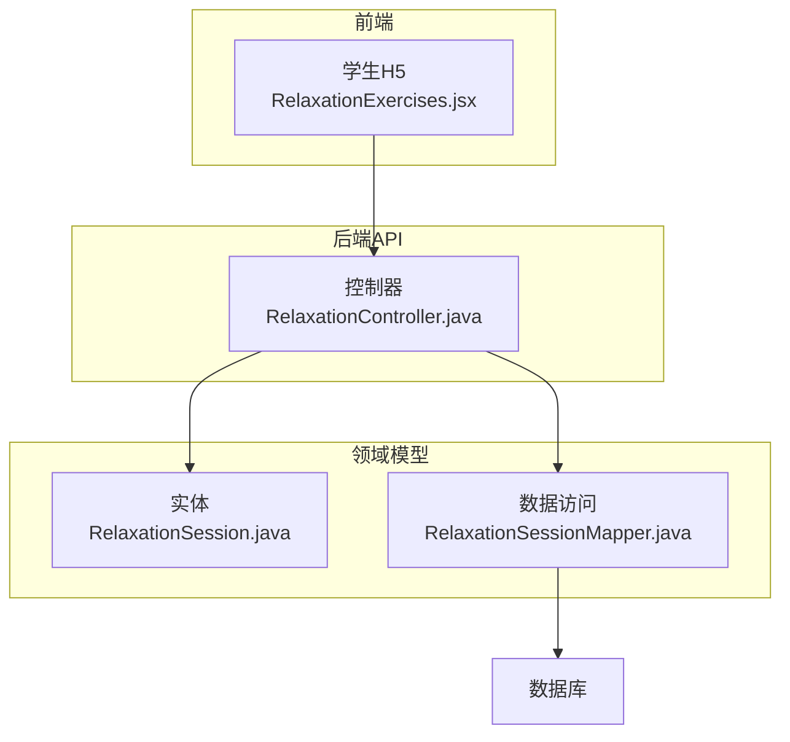
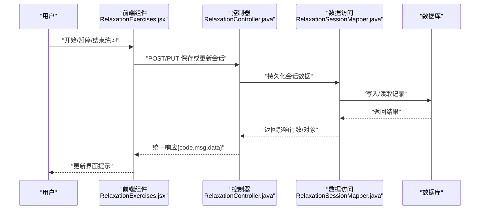
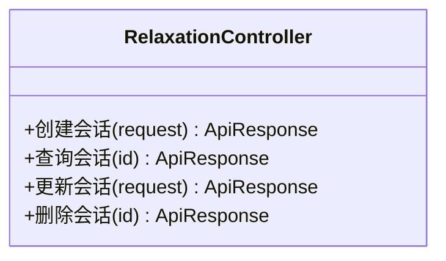
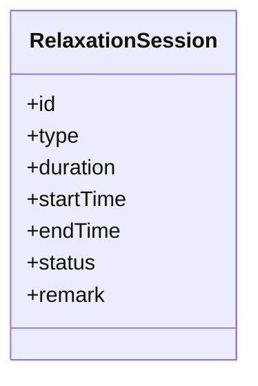
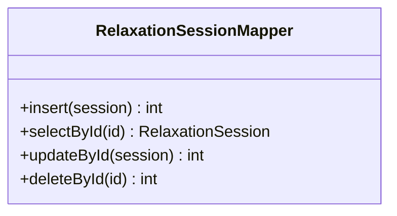
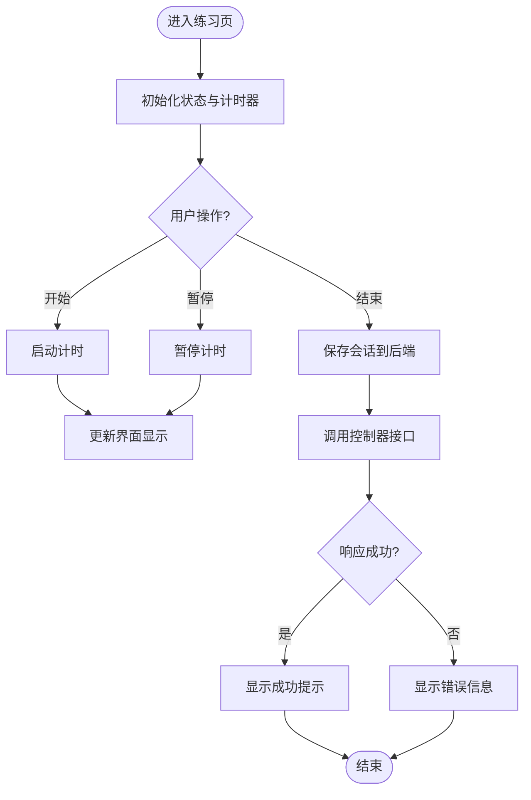
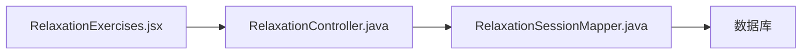

# 放松练习功能

<cite>
**本文引用的文件**   
- [RelaxationController.java](file://backend/counseling-api/src/main/java/com/mindsafe/api/controller/RelaxationController.java)
- [RelaxationSession.java](file://backend/counseling-domain/src/main/java/com/mindsafe/domain/entity/RelaxationSession.java)
- [RelaxationSessionMapper.java](file://backend/counseling-domain/src/main/java/com/mindsafe/domain/mapper/RelaxationSessionMapper.java)
- [RelaxationExercises.jsx](file://frontend/student-h5/src/components/RelaxationExercises.jsx)
</cite>

## 目录
1. [简介](#简介)
2. [项目结构](#项目结构)
3. [核心组件](#核心组件)
4. [架构总览](#架构总览)
5. [详细组件分析](#详细组件分析)
6. [依赖关系分析](#依赖关系分析)
7. [性能考虑](#性能考虑)
8. [故障排查指南](#故障排查指南)
9. [结论](#结论)
10. [附录](#附录)

## 简介
本章节概述“放松练习”功能的整体目标与范围。该功能面向学生端，提供引导式放松训练（如呼吸、肌肉放松等），记录每次练习会话，支持前端交互与后端持久化，便于后续统计与个性化推荐。

## 项目结构
放松练习功能涉及前后端协作：
- 前端：学生 H5 页面中的“放松练习”组件负责展示练习内容、计时与用户操作。
- 后端：API 层暴露 REST 接口；领域层定义会话实体；数据访问层通过 Mapper 进行持久化。

**图表来源** 
- [RelaxationController.java](file://backend/counseling-api/src/main/java/com/mindsafe/api/controller/RelaxationController.java)
- [RelaxationSession.java](file://backend/counseling-domain/src/main/java/com/mindsafe/domain/entity/RelaxationSession.java)
- [RelaxationSessionMapper.java](file://backend/counseling-domain/src/main/java/com/mindsafe/domain/mapper/RelaxationSessionMapper.java)

**章节来源**
- [RelaxationController.java](file://backend/counseling-api/src/main/java/com/mindsafe/api/controller/RelaxationController.java)
- [RelaxationSession.java](file://backend/counseling-domain/src/main/java/com/mindsafe/domain/entity/RelaxationSession.java)
- [RelaxationSessionMapper.java](file://backend/counseling-domain/src/main/java/com/mindsafe/domain/mapper/RelaxationSessionMapper.java)
- [RelaxationExercises.jsx](file://frontend/student-h5/src/components/RelaxationExercises.jsx)

## 核心组件
- 控制器（API）：对外暴露放松练习相关接口，处理请求参数校验、调用服务逻辑并返回统一响应。
- 实体（领域模型）：描述一次放松练习会话的关键属性（如类型、时长、状态、时间戳等）。
- 数据访问（Mapper）：封装对数据库的增删改查操作，映射实体与表结构。
- 前端组件：渲染练习界面、管理本地状态、发起网络请求并更新视图。

**章节来源**
- [RelaxationController.java](file://backend/counseling-api/src/main/java/com/mindsafe/api/controller/RelaxationController.java)
- [RelaxationSession.java](file://backend/counseling-domain/src/main/java/com/mindsafe/domain/entity/RelaxationSession.java)
- [RelaxationSessionMapper.java](file://backend/counseling-domain/src/main/java/com/mindsafe/domain/mapper/RelaxationSessionMapper.java)
- [RelaxationExercises.jsx](file://frontend/student-h5/src/components/RelaxationExercises.jsx)

## 架构总览
放松练习功能采用典型的前后端分离架构：前端通过 HTTP 调用后端控制器，控制器协调领域模型与数据访问层完成业务处理与数据持久化。

**图表来源** 
- [RelaxationController.java](file://backend/counseling-api/src/main/java/com/mindsafe/api/controller/RelaxationController.java)
- [RelaxationSessionMapper.java](file://backend/counseling-domain/src/main/java/com/mindsafe/domain/mapper/RelaxationSessionMapper.java)
- [RelaxationSession.java](file://backend/counseling-domain/src/main/java/com/mindsafe/domain/entity/RelaxationSession.java)
- [RelaxationExercises.jsx](file://frontend/student-h5/src/components/RelaxationExercises.jsx)

## 详细组件分析

### 控制器（RelaxationController）
- 职责：接收前端放松练习相关请求，进行参数校验，调用数据访问层完成会话的创建、查询、更新与删除等操作，返回统一格式响应。
- 关键点：
  - 输入校验：确保必填字段完整、数值范围合理（如时长、类型枚举）。
  - 错误处理：捕获异常并转换为标准错误码与消息。
  - 安全策略：鉴权与权限控制（由全局安全配置保障）。

**图表来源** 
- [RelaxationController.java](file://backend/counseling-api/src/main/java/com/mindsafe/api/controller/RelaxationController.java)

**章节来源**
- [RelaxationController.java](file://backend/counseling-api/src/main/java/com/mindsafe/api/controller/RelaxationController.java)

### 实体（RelaxationSession）
- 职责：定义放松练习会话的数据结构与约束，作为领域模型承载业务语义。
- 关键点：
  - 字段设计：包含会话标识、练习类型、持续时间、开始/结束时间、状态、备注等。
  - 约束规则：非空字段、长度限制、枚举值校验等。
  - 扩展性：预留扩展字段以支持未来新增属性。

**图表来源** 
- [RelaxationSession.java](file://backend/counseling-domain/src/main/java/com/mindsafe/domain/entity/RelaxationSession.java)

**章节来源**
- [RelaxationSession.java](file://backend/counseling-domain/src/main/java/com/mindsafe/domain/entity/RelaxationSession.java)

### 数据访问（RelaxationSessionMapper）
- 职责：封装对 RelaxationSession 表的 CRUD 操作，实现实体与数据库记录的映射。
- 关键点：
  - 方法设计：按实体字段提供插入、查询、更新、删除等方法。
  - 事务边界：在需要多步操作的场景下保证一致性。
  - 性能优化：合理使用索引与分页查询。

**图表来源** 
- [RelaxationSessionMapper.java](file://backend/counseling-domain/src/main/java/com/mindsafe/domain/mapper/RelaxationSessionMapper.java)

**章节来源**
- [RelaxationSessionMapper.java](file://backend/counseling-domain/src/main/java/com/mindsafe/domain/mapper/RelaxationSessionMapper.java)

### 前端组件（RelaxationExercises）
- 职责：渲染放松练习界面，管理用户交互（开始、暂停、结束）、计时器与本地状态，调用后端接口保存会话。
- 关键点：
  - 状态管理：维护练习状态、计时进度、用户选择等。
  - 网络请求：封装统一的请求方法与错误处理。
  - 用户体验：提供即时反馈、错误提示与加载状态。

**图表来源** 
- [RelaxationExercises.jsx](file://frontend/student-h5/src/components/RelaxationExercises.jsx)
- [RelaxationController.java](file://backend/counseling-api/src/main/java/com/mindsafe/api/controller/RelaxationController.java)

**章节来源**
- [RelaxationExercises.jsx](file://frontend/student-h5/src/components/RelaxationExercises.jsx)

## 依赖关系分析
放松练习功能的依赖关系如下：
- 前端组件依赖后端控制器提供的 REST 接口。
- 控制器依赖数据访问层进行数据持久化。
- 数据访问层依赖数据库存储实体记录。

**图表来源** 
- [RelaxationExercises.jsx](file://frontend/student-h5/src/components/RelaxationExercises.jsx)
- [RelaxationController.java](file://backend/counseling-api/src/main/java/com/mindsafe/api/controller/RelaxationController.java)
- [RelaxationSessionMapper.java](file://backend/counseling-domain/src/main/java/com/mindsafe/domain/mapper/RelaxationSessionMapper.java)

**章节来源**
- [RelaxationExercises.jsx](file://frontend/student-h5/src/components/RelaxationExercises.jsx)
- [RelaxationController.java](file://backend/counseling-api/src/main/java/com/mindsafe/api/controller/RelaxationController.java)
- [RelaxationSessionMapper.java](file://backend/counseling-domain/src/main/java/com/mindsafe/domain/mapper/RelaxationSessionMapper.java)

## 性能考虑
- 接口响应时间：避免在控制器中进行耗时计算，将复杂逻辑下沉至服务层或异步任务。
- 数据库查询：为常用查询字段建立索引，使用分页减少单次返回数据量。
- 前端渲染：避免频繁重绘，合理使用状态更新与防抖节流。
- 缓存策略：对不常变化的配置或字典数据进行缓存，降低重复查询开销。

[本节为通用指导，无需特定文件引用]

## 故障排查指南
- 常见问题：
  - 接口返回错误：检查请求参数是否完整、类型是否正确。
  - 数据未持久化：确认数据访问层方法执行成功且事务提交。
  - 前端状态异常：检查本地状态更新逻辑与网络请求回调。
- 调试建议：
  - 启用日志记录关键步骤与异常堆栈。
  - 使用浏览器开发者工具查看网络请求与响应。
  - 在后端添加断点验证数据流转。

**章节来源**
- [RelaxationController.java](file://backend/counseling-api/src/main/java/com/mindsafe/api/controller/RelaxationController.java)
- [RelaxationSessionMapper.java](file://backend/counseling-domain/src/main/java/com/mindsafe/domain/mapper/RelaxationSessionMapper.java)
- [RelaxationExercises.jsx](file://frontend/student-h5/src/components/RelaxationExercises.jsx)

## 结论
放松练习功能通过清晰的分层架构实现了前后端协作，具备可扩展性与可维护性。建议在后续迭代中增强错误处理、完善监控指标，并持续优化用户体验与性能表现。

[本节为总结性内容，无需特定文件引用]

## 附录
- 术语解释：
  - 会话：一次完整的放松练习过程，包含开始、结束与中间状态。
  - 控制器：处理 HTTP 请求并协调业务逻辑的组件。
  - 数据访问层：封装数据库操作的组件。
- 参考文档：
  - 系统架构设计文档
  - API 接口设计规范

[本节为补充信息，无需特定文件引用]
