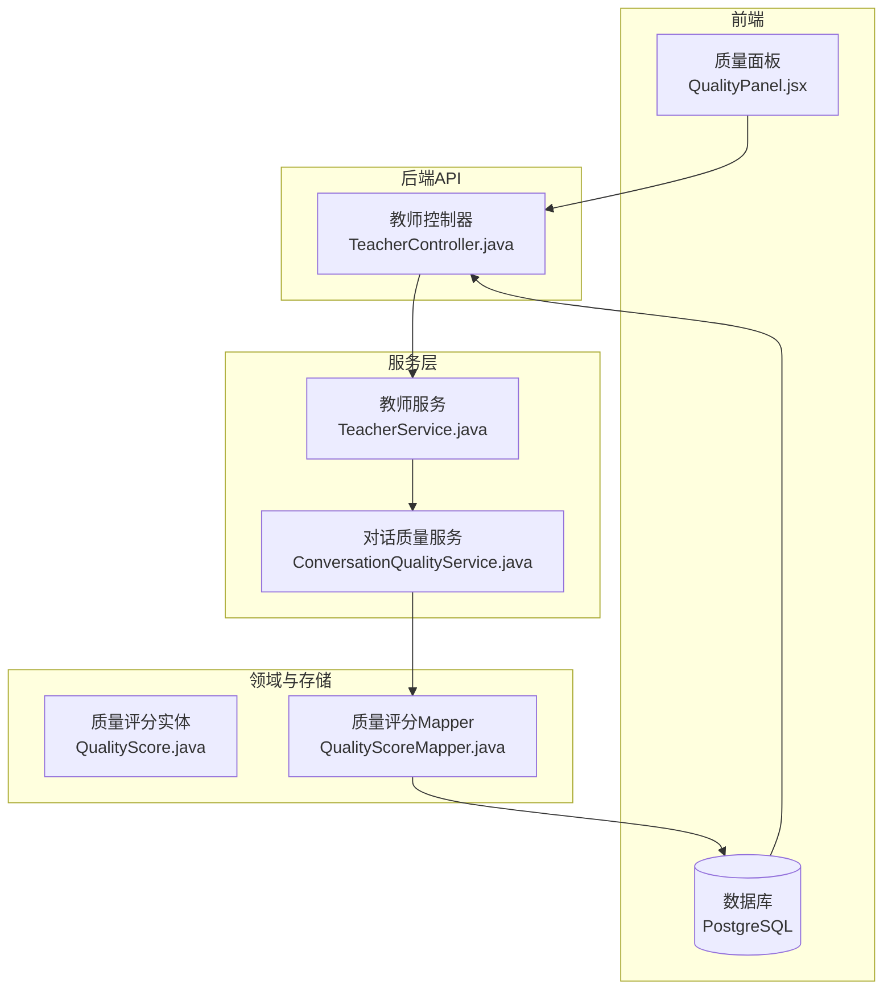
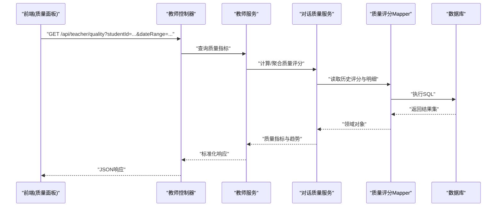
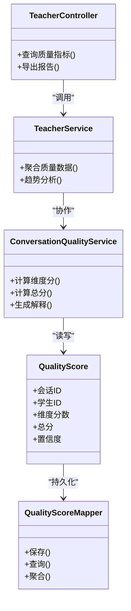

# 教师质量监控系统

<cite>
**本文档引用的文件**   
- [TeacherController.java](file://backend/counseling-api/src/main/java/com/mindsafe/api/controller/TeacherController.java)
- [TeacherService.java](file://backend/counseling-service/src/main/java/com/mindsafe/service/teacher/TeacherService.java)
- [QualityScore.java](file://backend/counseling-domain/src/main/java/com/mindsafe/domain/entity/QualityScore.java)
- [QualityScoreMapper.java](file://backend/counseling-domain/src/main/java/com/mindsafe/domain/mapper/QualityScoreMapper.java)
- [ConversationQualityService.java](file://backend/counseling-service/src/main/java/com/mindsafe/service/quality/ConversationQualityService.java)
- [V19__quality_scores.sql](file://backend/counseling-app/src/main/resources/db/migration/V19__quality_scores.sql)
- [QualityPanel.jsx](file://frontend/teacher-web/src/components/teacher/QualityPanel.jsx)
- [Dashboard.jsx](file://frontend/teacher-web/src/pages/Dashboard.jsx)
- [application.yml](file://backend/counseling-app/src/main/resources/application.yml)
</cite>

## 目录
1. [简介](#简介)
2. [项目结构](#项目结构)
3. [核心组件](#核心组件)
4. [架构总览](#架构总览)
5. [详细组件分析](#详细组件分析)
6. [依赖关系分析](#依赖关系分析)
7. [性能考量](#性能考量)
8. [故障排查指南](#故障排查指南)
9. [结论](#结论)
10. [附录](#附录)

## 简介
本系统面向学校教师，提供“教师质量监控”能力：围绕学生与AI的对话会话，采集、计算并展示质量评分与趋势，帮助教师了解干预效果、识别风险信号并进行教学改进。系统采用前后端分离架构，后端以Spring Boot为核心，提供REST接口与数据访问；前端基于React构建教师端Web界面，通过API获取质量指标与可视化图表。

## 项目结构
本项目为多模块工程，关键模块如下：
- counseling-api：对外暴露REST API（控制器层）
- counseling-service：业务服务层（含质量评估、通知、安全等）
- counseling-domain：领域模型与持久化映射（实体、Mapper）
- counseling-app：应用启动与数据库迁移脚本
- frontend/teacher-web：教师端Web前端（包含质量面板与仪表盘）

图示来源
- [TeacherController.java](file://backend/counseling-api/src/main/java/com/mindsafe/api/controller/TeacherController.java)
- [TeacherService.java](file://backend/counseling-service/src/main/java/com/mindsafe/service/teacher/TeacherService.java)
- [ConversationQualityService.java](file://backend/counseling-service/src/main/java/com/mindsafe/service/quality/ConversationQualityService.java)
- [QualityScore.java](file://backend/counseling-domain/src/main/java/com/mindsafe/domain/entity/QualityScore.java)
- [QualityScoreMapper.java](file://backend/counseling-domain/src/main/java/com/mindsafe/domain/mapper/QualityScoreMapper.java)
- [QualityPanel.jsx](file://frontend/teacher-web/src/components/teacher/QualityPanel.jsx)
- [Dashboard.jsx](file://frontend/teacher-web/src/pages/Dashboard.jsx)

章节来源
- [application.yml](file://backend/counseling-app/src/main/resources/application.yml)

## 核心组件
- 教师控制器（TeacherController）：提供教师端查询质量评分、会话摘要、预警列表等接口，统一入参校验与异常处理。
- 教师服务（TeacherService）：聚合质量、会话、预警等业务能力，协调调用质量服务与数据访问层。
- 对话质量服务（ConversationQualityService）：实现质量评分的计算策略、指标聚合、趋势统计等核心算法。
- 质量评分实体（QualityScore）：描述一次会话或一段时间窗口的质量评分维度与总分。
- 质量评分Mapper（QualityScoreMapper）：封装对质量评分表的CRUD与复杂查询。
- 数据库迁移（V19__quality_scores.sql）：定义质量评分表结构与索引。
- 前端质量面板（QualityPanel）：渲染质量指标、趋势图与明细列表，支持筛选与导出。
- 教师仪表盘（Dashboard）：汇总关键质量指标与告警概览，作为教师工作入口。

章节来源
- [TeacherController.java](file://backend/counseling-api/src/main/java/com/mindsafe/api/controller/TeacherController.java)
- [TeacherService.java](file://backend/counseling-service/src/main/java/com/mindsafe/service/teacher/TeacherService.java)
- [ConversationQualityService.java](file://backend/counseling-service/src/main/java/com/mindsafe/service/quality/ConversationQualityService.java)
- [QualityScore.java](file://backend/counseling-domain/src/main/java/com/mindsafe/domain/entity/QualityScore.java)
- [QualityScoreMapper.java](file://backend/counseling-domain/src/main/java/com/mindsafe/domain/mapper/QualityScoreMapper.java)
- [V19__quality_scores.sql](file://backend/counseling-app/src/main/resources/db/migration/V19__quality_scores.sql)
- [QualityPanel.jsx](file://frontend/teacher-web/src/components/teacher/QualityPanel.jsx)
- [Dashboard.jsx](file://frontend/teacher-web/src/pages/Dashboard.jsx)

## 架构总览
系统采用分层架构与前后端分离设计：
- 前端通过REST API与WebSocket（可选）获取质量数据与实时预警。
- 控制器层负责请求路由、参数校验与安全控制。
- 服务层编排业务逻辑，调用领域模型与外部服务。
- 领域层提供实体与Mapper，屏蔽数据库细节。
- 数据库使用PostgreSQL，通过Flyway进行版本化管理。

图示来源
- [TeacherController.java](file://backend/counseling-api/src/main/java/com/mindsafe/api/controller/TeacherController.java)
- [TeacherService.java](file://backend/counseling-service/src/main/java/com/mindsafe/service/teacher/TeacherService.java)
- [ConversationQualityService.java](file://backend/counseling-service/src/main/java/com/mindsafe/service/quality/ConversationQualityService.java)
- [QualityScoreMapper.java](file://backend/counseling-domain/src/main/java/com/mindsafe/domain/mapper/QualityScoreMapper.java)
- [V19__quality_scores.sql](file://backend/counseling-app/src/main/resources/db/migration/V19__quality_scores.sql)

## 详细组件分析

### 教师控制器（TeacherController）
职责：
- 暴露教师端质量相关接口（如按学生、班级、时间范围查询质量评分与趋势）。
- 统一错误码与分页响应格式。
- 集成鉴权与审计日志（由全局配置与过滤器保障）。

交互要点：
- 接收前端筛选条件（学生ID、日期区间、维度标签等）。
- 调用教师服务获取聚合后的质量指标。
- 将结果转换为统一的API响应结构返回。

章节来源
- [TeacherController.java](file://backend/counseling-api/src/main/java/com/mindsafe/api/controller/TeacherController.java)

### 教师服务（TeacherService）
职责：
- 聚合质量、会话、预警等多维数据，形成教师视角的统一视图。
- 协调对话质量服务进行指标计算与趋势分析。
- 处理权限与租户隔离（多学校场景）。

关键点：
- 缓存热点指标以减少重复计算。
- 对异常进行降级与兜底，保证页面可用性。

章节来源
- [TeacherService.java](file://backend/counseling-service/src/main/java/com/mindsafe/service/teacher/TeacherService.java)

### 对话质量服务（ConversationQualityService）
职责：
- 定义质量评分维度（如参与度、情绪稳定性、干预有效性等）。
- 实现评分计算策略（规则+模型结合），输出维度分与总分。
- 提供趋势统计（日/周/月粒度）、对比分析（同班/同龄段）。

算法要点：
- 输入：会话文本、语音情感特征、行为事件、历史评分。
- 处理：特征提取、规则匹配、模型打分、加权聚合。
- 输出：维度得分、总分、置信度、解释说明。

章节来源
- [ConversationQualityService.java](file://backend/counseling-service/src/main/java/com/mindsafe/service/quality/ConversationQualityService.java)

### 质量评分实体（QualityScore）
字段含义（示例）：
- 会话标识、学生标识、教师标识、评分时间戳
- 维度分数（参与度、情绪稳定性、干预有效性等）
- 总分、置信度、备注、版本号

复杂度：
- 实体包含多维分数与元数据，便于后续扩展新维度。
- 与Mapper配合完成批量写入与复杂查询。

章节来源
- [QualityScore.java](file://backend/counseling-domain/src/main/java/com/mindsafe/domain/entity/QualityScore.java)

### 质量评分Mapper（QualityScoreMapper）
职责：
- 提供质量评分的增删改查与聚合查询（按学生、班级、时间段）。
- 优化慢查询（索引、分页、预加载）。

章节来源
- [QualityScoreMapper.java](file://backend/counseling-domain/src/main/java/com/mindsafe/domain/mapper/QualityScoreMapper.java)

### 数据库迁移（V19__quality_scores.sql）
内容要点：
- 创建质量评分表及必要索引（学生ID、时间戳、会话ID等）。
- 定义约束与默认值，确保数据一致性。
- 提供初始数据与测试样例（可选）。

章节来源
- [V19__quality_scores.sql](file://backend/counseling-app/src/main/resources/db/migration/V19__quality_scores.sql)

### 前端质量面板（QualityPanel）
功能：
- 展示质量总分与维度分雷达图/柱状图。
- 支持按学生、班级、时间范围筛选。
- 提供明细列表与导出功能。

交互流程：
- 用户选择筛选条件后，调用教师控制器接口。
- 接收JSON数据并渲染图表与表格。
- 实时更新（可选）通过WebSocket推送预警与更新。

章节来源
- [QualityPanel.jsx](file://frontend/teacher-web/src/components/teacher/QualityPanel.jsx)

### 教师仪表盘（Dashboard）
功能：
- 汇总关键质量指标（平均分、趋势、预警数量）。
- 快速跳转至质量面板与预警队列。
- 显示班级整体画像与差异分析。

章节来源
- [Dashboard.jsx](file://frontend/teacher-web/src/pages/Dashboard.jsx)

## 依赖关系分析
- 控制器依赖服务层，服务层依赖领域模型与Mapper。
- 前端依赖后端REST接口，可能依赖WebSocket用于实时预警。
- 数据库通过Flyway管理版本，确保环境一致性。

图示来源
- [TeacherController.java](file://backend/counseling-api/src/main/java/com/mindsafe/api/controller/TeacherController.java)
- [TeacherService.java](file://backend/counseling-service/src/main/java/com/mindsafe/service/teacher/TeacherService.java)
- [ConversationQualityService.java](file://backend/counseling-service/src/main/java/com/mindsafe/service/quality/ConversationQualityService.java)
- [QualityScore.java](file://backend/counseling-domain/src/main/java/com/mindsafe/domain/entity/QualityScore.java)
- [QualityScoreMapper.java](file://backend/counseling-domain/src/main/java/com/mindsafe/domain/mapper/QualityScoreMapper.java)

章节来源
- [application.yml](file://backend/counseling-app/src/main/resources/application.yml)

## 性能考量
- 查询优化：在Mapper层使用分页与索引，避免全表扫描。
- 缓存策略：对热点指标（班级均值、趋势）进行短期缓存。
- 异步处理：质量评分计算可异步执行，降低接口延迟。
- 资源限制：通过限流与熔断保护后端服务。
- 前端优化：按需加载图表数据，减少首屏压力。

## 故障排查指南
常见问题与定位步骤：
- 接口超时：检查服务层耗时操作（质量计算、数据库查询），必要时增加超时与重试策略。
- 数据不一致：核对Mapper SQL与实体字段映射，确认事务边界。
- 前端渲染异常：检查API返回数据结构与字段命名是否一致。
- 预警未推送：验证WebSocket连接状态与消息路由配置。

建议工具：
- 日志追踪：开启链路追踪，记录关键节点耗时。
- 监控告警：对接口错误率、响应时间、数据库连接池进行监控。
- 单元测试：覆盖质量评分计算的核心路径与边界条件。

## 结论
教师质量监控系统通过清晰的分层架构与模块化设计，实现了从数据采集、指标计算到可视化展示的全流程闭环。系统在可扩展性、性能与可维护性方面具备良好基础，未来可进一步引入更丰富的维度与模型以提升评分准确性与解释力。

## 附录
- 部署与环境：参考application.yml中的数据库、缓存与第三方服务配置。
- 扩展建议：新增质量维度时，优先在实体与Mapper中扩展，再在服务层实现计算逻辑。
- 安全合规：遵循隐私保护与最小权限原则，确保学生数据安全。