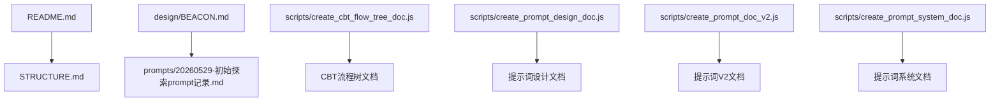
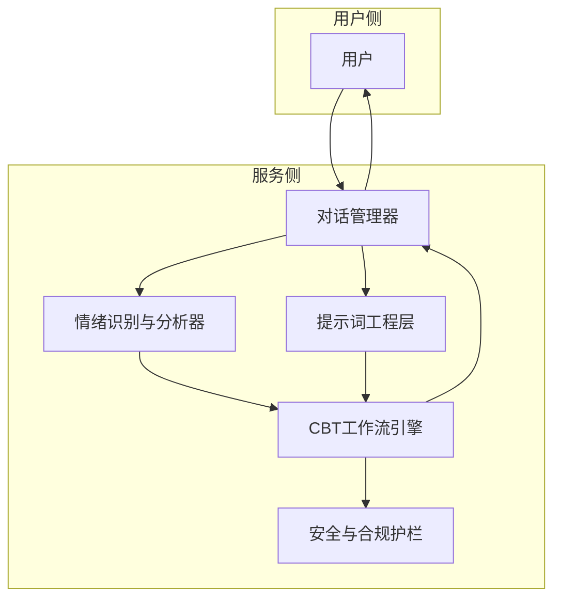
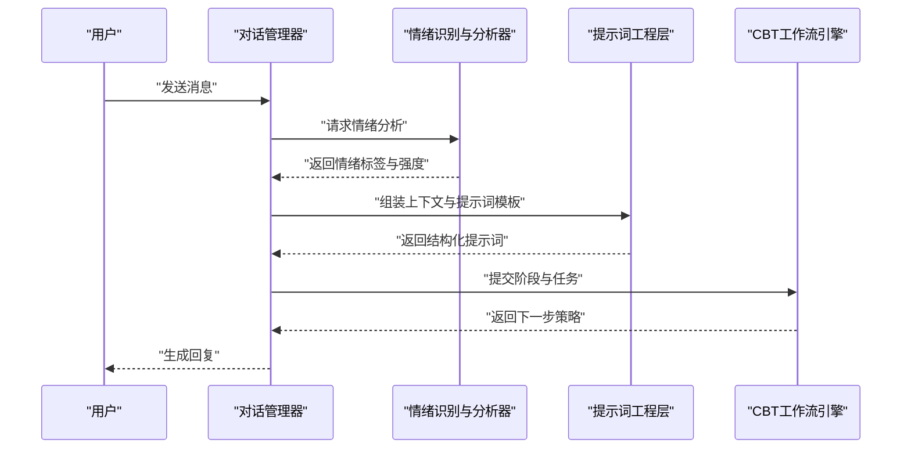
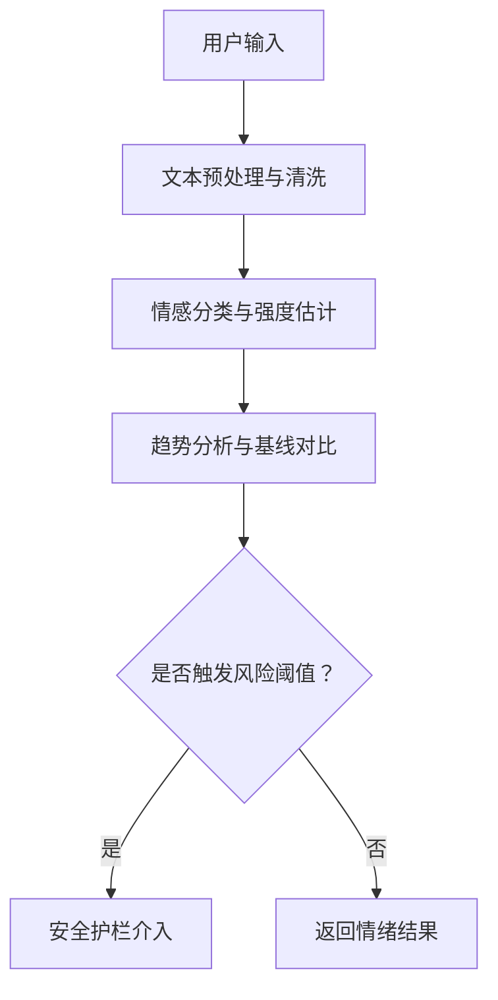
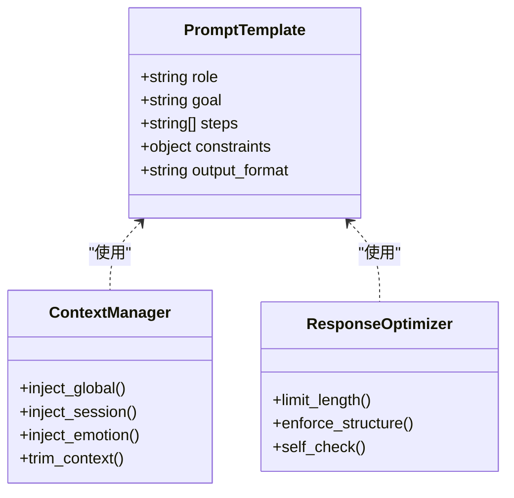
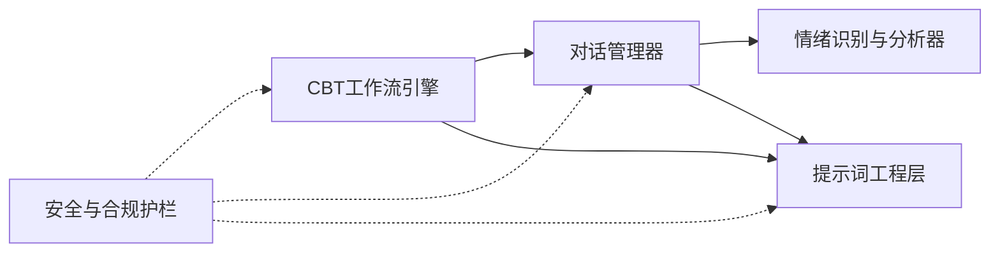

# 核心功能

<cite>
**本文引用的文件**   
- [README.md](file://README.md)
- [STRUCTURE.md](file://STRUCTURE.md)
- [design/BEACON.md](file://design/BEACON.md)
- [prompts/20260529-初始探索prompt记录.md](file://prompts/20260529-初始探索prompt记录.md)
- [scripts/create_cbt_flow_tree_doc.js](file://scripts/create_cbt_flow_tree_doc.js)
- [scripts/create_prompt_design_doc.js](file://scripts/create_prompt_design_doc.js)
- [scripts/create_prompt_doc_v2.js](file://scripts/create_prompt_doc_v2.js)
- [scripts/create_prompt_system_doc.js](file://scripts/create_prompt_system_doc.js)
</cite>

## 目录
1. [简介](#简介)
2. [项目结构](#项目结构)
3. [核心组件](#核心组件)
4. [架构总览](#架构总览)
5. [详细组件分析](#详细组件分析)
6. [依赖分析](#依赖分析)
7. [性能考虑](#性能考虑)
8. [故障排查指南](#故障排查指南)
9. [结论](#结论)
10. [附录](#附录)

## 简介
本技术文档聚焦AI心理咨询系统的核心功能，围绕认知行为疗法（CBT）工作流的设计与实现展开，涵盖对话管理、情绪识别与分析模块、提示词工程最佳实践等关键主题。文档旨在为开发者提供从系统架构到具体实现的完整说明，包括数据流转、协作关系、配置参数、使用模式以及调试方法，帮助快速理解并扩展系统能力。

## 项目结构
仓库采用“设计文档 + 提示词资产 + 脚本工具”的组织方式，便于在缺少源码的情况下仍能理解系统设计与运行流程。主要目录与职责如下：
- design：系统级设计与蓝图文档
- prompts：提示词资产与版本化记录
- scripts：用于生成文档与流程树的辅助脚本
- README.md、STRUCTURE.md：项目概览与结构说明

图表来源
- [README.md](file://README.md)
- [STRUCTURE.md](file://STRUCTURE.md)
- [design/BEACON.md](file://design/BEACON.md)
- [prompts/20260529-初始探索prompt记录.md](file://prompts/20260529-初始探索prompt记录.md)
- [scripts/create_cbt_flow_tree_doc.js](file://scripts/create_cbt_flow_tree_doc.js)
- [scripts/create_prompt_design_doc.js](file://scripts/create_prompt_design_doc.js)
- [scripts/create_prompt_doc_v2.js](file://scripts/create_prompt_doc_v2.js)
- [scripts/create_prompt_system_doc.js](file://scripts/create_prompt_system_doc.js)

章节来源
- [README.md](file://README.md)
- [STRUCTURE.md](file://STRUCTURE.md)

## 核心组件
基于仓库中的设计文档与提示词资产，可将系统划分为以下核心组件：
- CBT工作流引擎：负责会话阶段推进、任务编排与状态管理
- 对话管理器：维护上下文窗口、历史摘要、用户画像与目标追踪
- 情绪识别与分析器：对用户输入进行情感维度解析与强度评估，驱动干预策略
- 提示词工程层：结构化提示词模板、上下文注入、响应优化与安全约束
- 安全与合规护栏：危机检测、转介策略、伦理边界与可解释性输出

上述组件通过统一的数据契约交互，形成“输入→解析→推理→决策→输出→记忆更新”的闭环。

章节来源
- [design/BEACON.md](file://design/BEACON.md)
- [prompts/20260529-初始探索prompt记录.md](file://prompts/20260529-初始探索prompt记录.md)

## 架构总览
下图展示了CBT工作流在系统中的整体交互关系，包括对话管理、情绪分析与提示词工程的协作路径。

图表来源
- [design/BEACON.md](file://design/BEACON.md)
- [prompts/20260529-初始探索prompt记录.md](file://prompts/20260529-初始探索prompt记录.md)

## 详细组件分析

### CBT工作流引擎
- 职责：定义CBT会话的阶段划分（如探索、评估、重构、巩固），管理阶段转换条件与任务清单；协调对话管理与提示词工程，确保每次交互符合治疗逻辑。
- 关键流程：
  - 初始化：加载用户画像与目标，构建初始上下文
  - 阶段推进：依据情绪指标与用户反馈决定进入下一阶段
  - 任务编排：生成并执行CBT练习（如思维记录表、行为激活计划）
  - 终止与总结：输出阶段性报告与后续建议

图表来源
- [design/BEACON.md](file://design/BEACON.md)
- [scripts/create_cbt_flow_tree_doc.js](file://scripts/create_cbt_flow_tree_doc.js)

章节来源
- [design/BEACON.md](file://design/BEACON.md)
- [scripts/create_cbt_flow_tree_doc.js](file://scripts/create_cbt_flow_tree_doc.js)

### 对话管理器
- 职责：维护会话上下文、历史摘要、用户画像与目标追踪；控制上下文窗口大小与重要性权重；保证多轮对话的一致性与连贯性。
- 关键能力：
  - 上下文切片与压缩：保留关键事实与意图，剔除冗余信息
  - 角色与风格适配：根据用户偏好调整语气与表达
  - 目标对齐：将当前回复与长期目标关联，避免偏离主题

图表来源
- [design/BEACON.md](file://design/BEACON.md)
- [prompts/20260529-初始探索prompt记录.md](file://prompts/20260529-初始探索prompt记录.md)

章节来源
- [design/BEACON.md](file://design/BEACON.md)
- [prompts/20260529-初始探索prompt记录.md](file://prompts/20260529-初始探索prompt记录.md)

### 情绪识别与分析器
- 职责：对用户输入进行情感维度解析（如焦虑、抑郁、愤怒、悲伤、快乐）、强度评估与变化趋势判断；为CBT阶段推进与干预策略提供量化依据。
- 关键能力：
  - 多维情感分类：支持细粒度标签与置信度
  - 动态基线：建立个人情绪基线，识别异常波动
  - 风险预警：对高危信号进行即时标记与上报

图表来源
- [design/BEACON.md](file://design/BEACON.md)

章节来源
- [design/BEACON.md](file://design/BEACON.md)

### 提示词工程层
- 职责：设计结构化提示词模板，管理上下文注入与响应优化；确保模型输出符合CBT规范、安全与伦理要求。
- 最佳实践：
  - 结构设计：明确角色、目标、约束、步骤与输出格式
  - 上下文管理：分层注入（全局设定、会话上下文、实时情绪）
  - 响应优化：限制长度、强制结构化输出、增加自检步骤
  - 安全约束：内置拒绝策略与转介话术

图表来源
- [prompts/20260529-初始探索prompt记录.md](file://prompts/20260529-初始探索prompt记录.md)
- [scripts/create_prompt_design_doc.js](file://scripts/create_prompt_design_doc.js)
- [scripts/create_prompt_doc_v2.js](file://scripts/create_prompt_doc_v2.js)
- [scripts/create_prompt_system_doc.js](file://scripts/create_prompt_system_doc.js)

章节来源
- [prompts/20260529-初始探索prompt记录.md](file://prompts/20260529-初始探索prompt记录.md)
- [scripts/create_prompt_design_doc.js](file://scripts/create_prompt_design_doc.js)
- [scripts/create_prompt_doc_v2.js](file://scripts/create_prompt_doc_v2.js)
- [scripts/create_prompt_system_doc.js](file://scripts/create_prompt_system_doc.js)

### 安全与合规护栏
- 职责：监控高风险内容（自伤、暴力、严重心理危机），执行降级策略与转介流程；确保输出符合伦理与法律要求。
- 关键机制：
  - 关键词与语义双通道检测
  - 分级响应：提醒、暂停、转介、紧急联系
  - 审计日志：记录触发事件与处置过程

章节来源
- [design/BEACON.md](file://design/BEACON.md)

## 依赖分析
各组件之间的依赖关系如下：
- CBT工作流引擎依赖对话管理器与提示词工程层
- 对话管理器依赖情绪识别与分析器与提示词工程层
- 提示词工程层为所有组件提供统一的提示词装配与优化能力
- 安全与合规护栏贯穿全流程，作为横切关注点

图表来源
- [design/BEACON.md](file://design/BEACON.md)

章节来源
- [design/BEACON.md](file://design/BEACON.md)

## 性能考虑
- 上下文窗口优化：采用摘要与重要性评分减少token消耗
- 异步处理：情绪分析与提示词组装并行执行，降低延迟
- 缓存策略：对高频提示词模板与情绪基线进行缓存
- 批处理：批量生成CBT练习与家庭作业，提升吞吐

[本节为通用指导，不直接分析具体文件]

## 故障排查指南
- 常见问题定位：
  - 对话脱节：检查上下文切片与摘要逻辑
  - 情绪误判：核对情感分类阈值与基线更新频率
  - 提示词失效：验证模板结构与注入顺序
  - 安全漏检：审查关键词与语义检测规则
- 调试方法：
  - 启用详细日志：记录每步输入输出与中间状态
  - 回放会话：保存完整上下文以便复现问题
  - 单元测试：对情绪分类与提示词组装进行断言测试

章节来源
- [design/BEACON.md](file://design/BEACON.md)

## 结论
本系统以CBT工作流为核心，结合对话管理、情绪识别与分析、提示词工程与安全护栏，构建了完整的AI心理咨询能力框架。通过模块化设计与清晰的数据流转，系统在可扩展性、安全性与用户体验方面具备良好基础。开发者可基于本文档快速定位关键组件、理解协作关系并进行二次开发。

[本节为总结性内容，不直接分析具体文件]

## 附录
- 配置参数建议：
  - 上下文窗口大小：根据模型能力与业务需求调整
  - 情绪阈值：按人群特征与风险等级校准
  - 提示词模板版本：保持向后兼容与灰度发布
- 使用模式示例：
  - 单次咨询：短会话、聚焦单一问题
  - 系列咨询：多轮跟进、目标渐进达成
  - 自助练习：无监督模式下的CBT练习推荐

[本节为补充信息，不直接分析具体文件]