# 核心功能

<cite>
**本文引用的文件**
- [README.md](file://README.md)
- [STRUCTURE.md](file://STRUCTURE.md)
- [AiChatService.java](file://backend/counseling-ai/src/main/java/com/mindsafe/ai/chat/AiChatService.java)
- [AiChatServiceImpl.java](file://backend/counseling-ai/src/main/java/com/mindsafe/ai/chat/AiChatServiceImpl.java)
- [GlobalExceptionHandler.java](file://backend/counseling-api/src/main/java/com/mindsafe/api/config/GlobalExceptionHandler.java)
- [SecurityConfig.java](file://backend/counseling-api/src/main/java/com/mindsafe/api/config/SecurityConfig.java)
- [StreamMessageEvent.java](file://backend/counseling-common/src/main/java/com/mindsafe/common/dto/chat/StreamMessageEvent.java)
- [SessionInfo.java](file://backend/counseling-common/src/main/java/com/mindsafe/common/dto/chat/SessionInfo.java)
- [RiskDetectionResult.java](file://backend/counseling-common/src/main/java/com/mindsafe/common/dto/risk/RiskDetectionResult.java)
- [RiskLevel.java](file://backend/counseling-common/src/main/java/com/mindsafe/common/enums/RiskLevel.java)
- [EmotionSelect.jsx](file://frontend/student-h5/src/components/EmotionSelect.jsx)
- [ChatRoom.jsx](file://frontend/student-h5/src/components/ChatRoom.jsx)
- [design/16_语音情感分析设计方案.md](file://design/16_语音情感分析设计方案.md)
</cite>

## 更新摘要
**变更内容**
- 新增语音交互能力，支持文本和语音双模态输入
- 添加学生端情绪选择界面组件，提供直观的情绪表达入口
- 集成实时风险通知系统，实现高危情况的即时预警
- 扩展AI聊天服务以支持多模态对话工作流
- 增强情绪识别与分析模块，支持语音情感特征提取
- **新增管理员用户密码重置功能，允许管理员在用户忘记密码时重置密码，包含适当的授权检查和审计日志功能**

## 目录
1. [简介](#简介)
2. [项目结构](#项目结构)
3. [核心组件](#核心组件)
4. [架构总览](#架构总览)
5. [详细组件分析](#详细组件分析)
6. [依赖分析](#依赖分析)
7. [性能考虑](#性能考虑)
8. [故障排查指南](#故障排查指南)
9. [结论](#结论)
10. [附录](#附录)

## 简介
本技术文档聚焦AI心理咨询系统的核心功能，围绕认知行为疗法（CBT）工作流的设计与实现展开，涵盖对话管理、情绪识别与分析模块、提示词工程最佳实践等关键主题。文档旨在为开发者提供从系统架构到具体实现的完整说明，包括数据流转、协作关系、配置参数、使用模式以及调试方法，帮助快速理解并扩展系统能力。

**更新** 新增了语音交互能力、情绪选择界面、实时风险通知系统和多模态对话工作流的详细说明，以及管理员用户密码重置功能的完整实现。

## 项目结构
仓库采用"设计文档 + 提示词资产 + 脚本工具"的组织方式，便于在缺少源码的情况下仍能理解系统设计与运行流程。主要目录与职责如下：
- design：系统级设计与蓝图文档，包含语音情感分析设计方案
- prompts：提示词资产与版本化记录
- scripts：用于生成文档与流程树的辅助脚本
- backend：后端服务模块，包含AI聊天服务、API接口、通用DTO等
- frontend：前端应用，包含学生端H5和教师端Web界面
- README.md、STRUCTURE.md：项目概览与结构说明

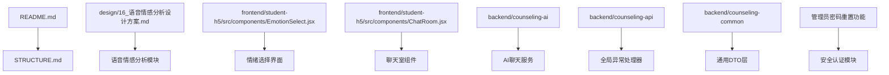

**图表来源**
- [README.md](file://README.md)
- [STRUCTURE.md](file://STRUCTURE.md)
- [EmotionSelect.jsx](file://frontend/student-h5/src/components/EmotionSelect.jsx)
- [ChatRoom.jsx](file://frontend/student-h5/src/components/ChatRoom.jsx)
- [AiChatService.java](file://backend/counseling-ai/src/main/java/com/mindsafe/ai/chat/AiChatService.java)
- [GlobalExceptionHandler.java](file://backend/counseling-api/src/main/java/com/mindsafe/api/config/GlobalExceptionHandler.java)
- [StreamMessageEvent.java](file://backend/counseling-common/src/main/java/com/mindsafe/common/dto/chat/StreamMessageEvent.java)

**章节来源**
- [README.md](file://README.md)
- [STRUCTURE.md](file://STRUCTURE.md)

## 核心组件
基于仓库中的设计文档与代码实现，可将系统划分为以下核心组件：
- CBT工作流引擎：负责会话阶段推进、任务编排与状态管理
- AI聊天服务：处理用户对话请求，集成LLM调用和流式响应，支持多模态输入
- 对话管理器：维护上下文窗口、历史摘要、用户画像与目标追踪
- 情绪识别与分析器：对用户输入进行情感维度解析与强度评估，驱动干预策略，支持语音情感特征
- 提示词工程层：结构化提示词模板、上下文注入、响应优化与安全约束
- 语音交互模块：处理语音输入输出，进行语音转文本和文本转语音转换
- 情绪选择界面：为学生提供直观的情绪表达入口
- 实时风险通知系统：监控高风险情况并触发即时预警
- 管理员密码重置模块：处理管理员用户的密码重置请求，包含授权验证和审计日志
- 全局异常处理器：统一错误处理和异常转换
- 安全配置：访问控制和权限管理
- 通用DTO层：标准化的数据传输对象和枚举类型

上述组件通过统一的数据契约交互，形成"输入→解析→推理→决策→输出→记忆更新"的闭环。

**更新** 新增了语音交互模块、情绪选择界面、实时风险通知系统和管理员密码重置功能的组件说明。

**章节来源**
- [AiChatService.java](file://backend/counseling-ai/src/main/java/com/mindsafe/ai/chat/AiChatService.java)
- [EmotionSelect.jsx](file://frontend/student-h5/src/components/EmotionSelect.jsx)
- [ChatRoom.jsx](file://frontend/student-h5/src/components/ChatRoom.jsx)
- [design/16_语音情感分析设计方案.md](file://design/16_语音情感分析设计方案.md)

## 架构总览
下图展示了CBT工作流在系统中的整体交互关系，包括新增的语音交互、情绪选择和风险通知系统的协作路径，以及管理员密码重置功能的安全架构。

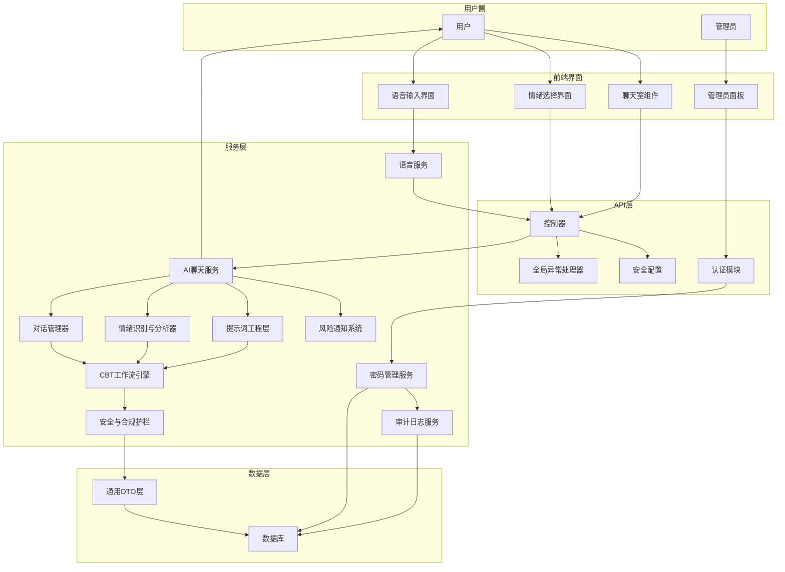

**图表来源**
- [AiChatService.java](file://backend/counseling-ai/src/main/java/com/mindsafe/ai/chat/AiChatService.java)
- [EmotionSelect.jsx](file://frontend/student-h5/src/components/EmotionSelect.jsx)
- [ChatRoom.jsx](file://frontend/student-h5/src/components/ChatRoom.jsx)
- [design/16_语音情感分析设计方案.md](file://design/16_语音情感分析设计方案.md)

## 详细组件分析

### 语音交互模块
- 职责：处理语音输入输出，进行语音转文本(STT)和文本转语音(TTS)转换；支持实时语音对话和情感特征提取
- 关键特性：
  - 多模态支持：同时处理文本和语音输入
  - 实时处理：低延迟的语音流式处理
  - 情感分析：从语音中提取情感特征和语调信息
  - 噪声过滤：智能降噪和环境音过滤

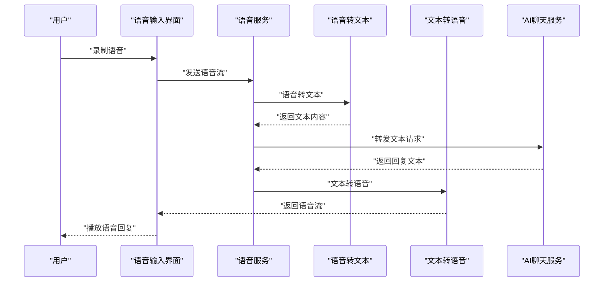

**图表来源**
- [design/16_语音情感分析设计方案.md](file://design/16_语音情感分析设计方案.md)

**章节来源**
- [design/16_语音情感分析设计方案.md](file://design/16_语音情感分析设计方案.md)

### 情绪选择界面
- 职责：为学生提供直观的情绪表达入口，支持快速选择当前情绪状态；收集情绪数据用于后续分析和个性化咨询
- 关键特性：
  - 可视化选择：使用表情符号和颜色编码表示不同情绪
  - 多维度情绪：支持焦虑、抑郁、愤怒、悲伤、快乐等多种情绪类别
  - 历史记录：保存用户情绪选择历史，建立情绪变化趋势
  - 个性化推荐：根据情绪状态推荐相应的CBT练习

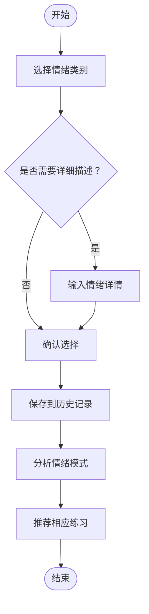

**图表来源**
- [EmotionSelect.jsx](file://frontend/student-h5/src/components/EmotionSelect.jsx)

**章节来源**
- [EmotionSelect.jsx](file://frontend/student-h5/src/components/EmotionSelect.jsx)

### 聊天室组件
- 职责：管理用户与AI的对话界面，支持文本和语音消息的混合展示；集成情绪显示和实时风险通知
- 关键特性：
  - 多消息类型：支持文本、语音、图片等多媒体消息
  - 实时同步：使用WebSocket实现消息实时更新
  - 情绪可视化：在对话中显示用户当前情绪状态
  - 风险提醒：当检测到高风险内容时显示警告提示

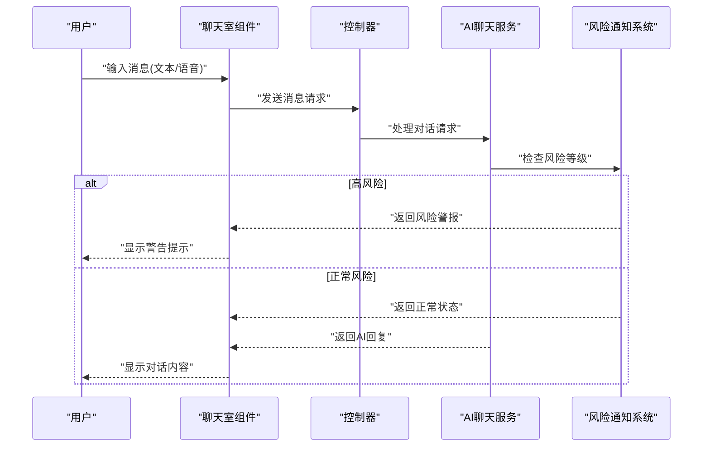

**图表来源**
- [ChatRoom.jsx](file://frontend/student-h5/src/components/ChatRoom.jsx)

**章节来源**
- [ChatRoom.jsx](file://frontend/student-h5/src/components/ChatRoom.jsx)

### 实时风险通知系统
- 职责：实时监控对话内容，检测自伤、暴力、严重心理危机等高风险信号；触发分级预警和转介流程
- 关键特性：
  - 多级预警：根据风险等级采取不同响应措施
  - 实时监测：对每轮对话进行即时风险评估
  - 自动转介：高风险情况下自动联系专业咨询师
  - 审计日志：记录所有风险事件和处置过程

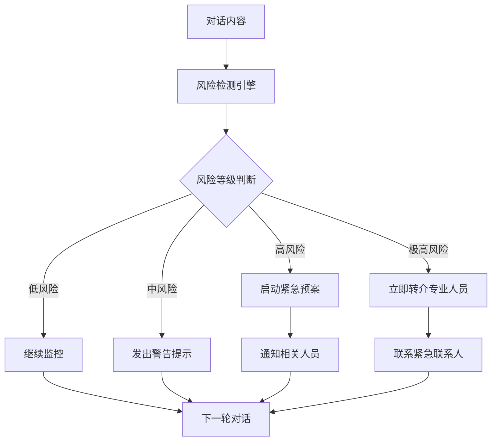

**图表来源**
- [RiskDetectionResult.java](file://backend/counseling-common/src/main/java/com/mindsafe/common/dto/risk/RiskDetectionResult.java)
- [RiskLevel.java](file://backend/counseling-common/src/main/java/com/mindsafe/common/enums/RiskLevel.java)

**章节来源**
- [RiskDetectionResult.java](file://backend/counseling-common/src/main/java/com/mindsafe/common/dto/risk/RiskDetectionResult.java)
- [RiskLevel.java](file://backend/counseling-common/src/main/java/com/mindsafe/common/enums/RiskLevel.java)

### 管理员密码重置模块
- 职责：处理管理员用户的密码重置请求，验证管理员权限，执行密码重置操作，记录审计日志
- 关键特性：
  - 权限验证：严格的身份认证和角色检查
  - 安全重置：生成临时令牌，确保密码重置的安全性
  - 审计追踪：记录所有密码重置操作的详细信息
  - 通知机制：向管理员发送重置确认通知
  - 过期控制：设置临时令牌的有效期限制

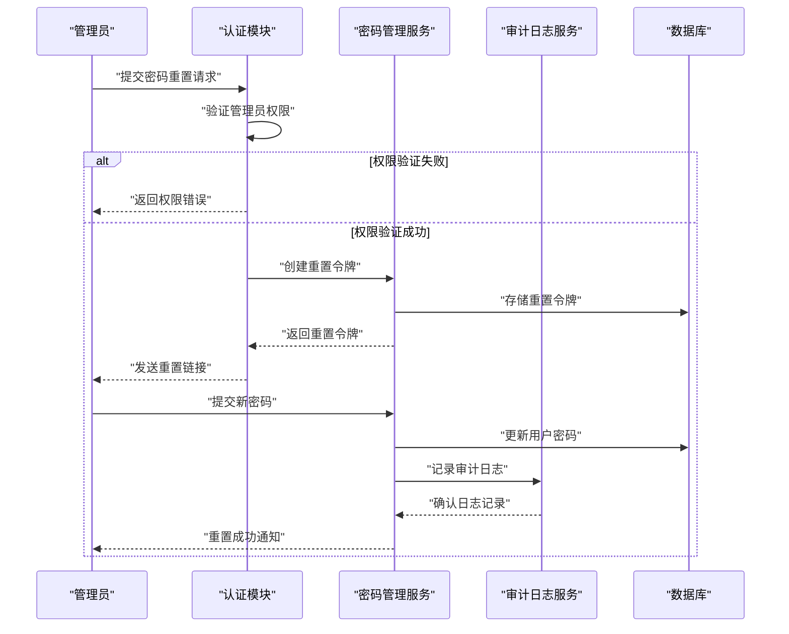

**图表来源**
- [SecurityConfig.java](file://backend/counseling-api/src/main/java/com/mindsafe/api/config/SecurityConfig.java)

**章节来源**
- [SecurityConfig.java](file://backend/counseling-api/src/main/java/com/mindsafe/api/config/SecurityConfig.java)

### AI聊天服务模块
- 职责：作为核心对话服务，处理用户聊天请求，管理LLM调用和流式响应；协调各个子服务完成CBT咨询流程，支持多模态输入
- 关键特性：
  - 多模态处理：同时支持文本和语音输入
  - 流式消息处理：支持实时消息推送和增量响应
  - 会话管理：维护会话状态和用户上下文
  - 错误重试：自动重试机制提高服务稳定性
  - 超时控制：防止长时间阻塞的对话请求
  - 情绪感知：根据用户情绪调整对话策略

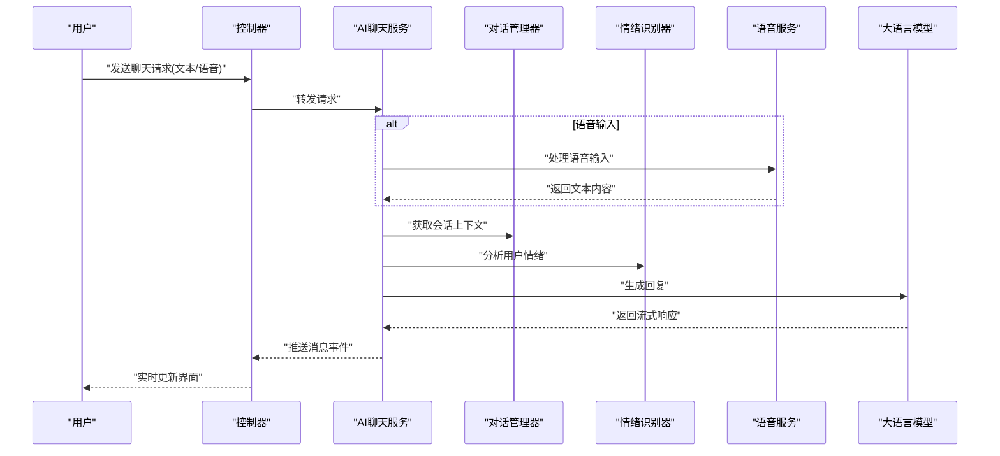

**图表来源**
- [AiChatService.java](file://backend/counseling-ai/src/main/java/com/mindsafe/ai/chat/AiChatService.java)
- [AiChatServiceImpl.java](file://backend/counseling-ai/src/main/java/com/mindsafe/ai/chat/AiChatServiceImpl.java)

**章节来源**
- [AiChatService.java](file://backend/counseling-ai/src/main/java/com/mindsafe/ai/chat/AiChatService.java)
- [AiChatServiceImpl.java](file://backend/counseling-ai/src/main/java/com/mindsafe/ai/chat/AiChatServiceImpl.java)

### 全局异常处理器
- 职责：统一处理系统异常，转换为标准错误响应格式；提供详细的错误信息和调试日志
- 关键特性：
  - 分类处理：区分业务异常、系统异常和网络异常
  - 标准化响应：统一的错误码和错误消息格式
  - 安全过滤：敏感信息脱敏和错误详情隐藏
  - 审计日志：记录异常发生的时间、位置和堆栈信息

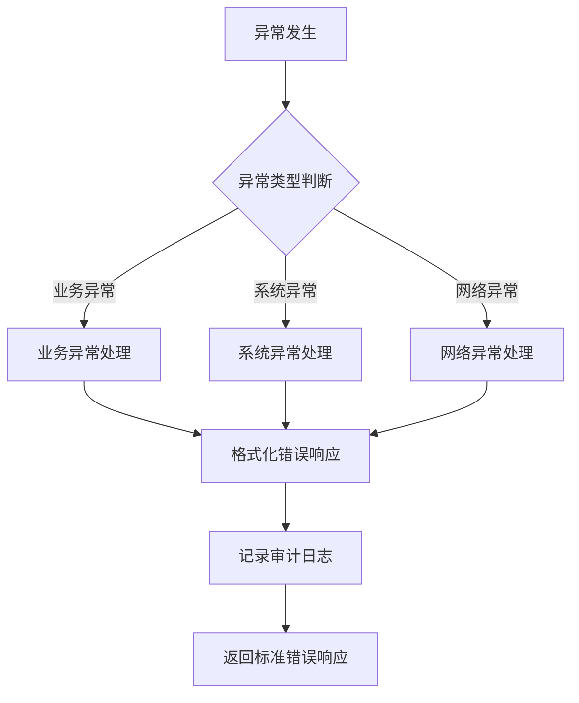

**图表来源**
- [GlobalExceptionHandler.java](file://backend/counseling-api/src/main/java/com/mindsafe/api/config/GlobalExceptionHandler.java)

**章节来源**
- [GlobalExceptionHandler.java](file://backend/counseling-api/src/main/java/com/mindsafe/api/config/GlobalExceptionHandler.java)

### 安全配置
- 职责：管理系统访问控制，配置临时M1基线访问权限；保护API端点和敏感数据
- 关键特性：
  - 访问控制：基于角色的权限验证
  - 临时授权：支持M1版本的临时访问令牌
  - 跨域配置：允许前端应用的安全访问
  - 请求过滤：恶意请求检测和防护
  - 密码重置安全：管理员密码重置的额外安全验证

**章节来源**
- [SecurityConfig.java](file://backend/counseling-api/src/main/java/com/mindsafe/api/config/SecurityConfig.java)

### 通用DTO层
- 职责：提供标准化的数据传输对象，确保前后端数据一致性；定义通用的业务实体和枚举类型
- 核心DTO：
  - StreamMessageEvent：流式消息事件，支持增量数据传输
  - SessionInfo：会话信息，包含会话ID、创建时间和状态
  - RiskDetectionResult：风险检测结果，包含风险等级和建议措施
  - RiskLevel：风险等级枚举，定义不同级别的风险分类

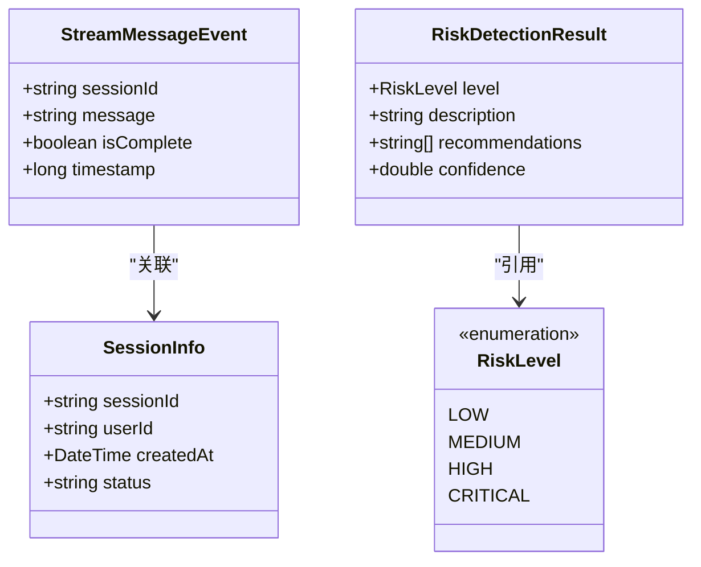

**图表来源**
- [StreamMessageEvent.java](file://backend/counseling-common/src/main/java/com/mindsafe/common/dto/chat/StreamMessageEvent.java)
- [SessionInfo.java](file://backend/counseling-common/src/main/java/com/mindsafe/common/dto/chat/SessionInfo.java)
- [RiskDetectionResult.java](file://backend/counseling-common/src/main/java/com/mindsafe/common/dto/risk/RiskDetectionResult.java)
- [RiskLevel.java](file://backend/counseling-common/src/main/java/com/mindsafe/common/enums/RiskLevel.java)

**章节来源**
- [StreamMessageEvent.java](file://backend/counseling-common/src/main/java/com/mindsafe/common/dto/chat/StreamMessageEvent.java)
- [SessionInfo.java](file://backend/counseling-common/src/main/java/com/mindsafe/common/dto/chat/SessionInfo.java)
- [RiskDetectionResult.java](file://backend/counseling-common/src/main/java/com/mindsafe/common/dto/risk/RiskDetectionResult.java)
- [RiskLevel.java](file://backend/counseling-common/src/main/java/com/mindsafe/common/enums/RiskLevel.java)

### CBT工作流引擎
- 职责：定义CBT会话的阶段划分（如探索、评估、重构、巩固），管理阶段转换条件与任务清单；协调对话管理与提示词工程，确保每次交互符合治疗逻辑。
- 关键流程：
  - 初始化：加载用户画像与目标，构建初始上下文
  - 阶段推进：依据情绪指标与用户反馈决定进入下一阶段
  - 任务编排：生成并执行CBT练习（如思维记录表、行为激活计划）
  - 终止与总结：输出阶段性报告与后续建议

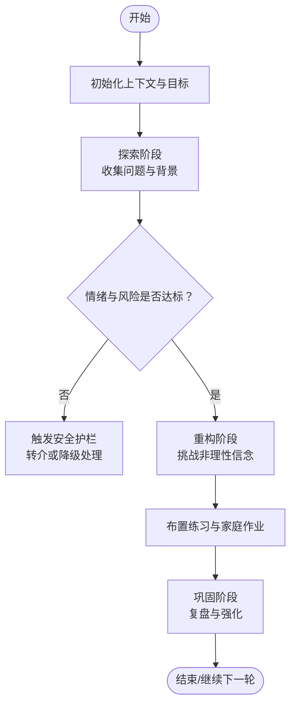

**图表来源**
- [design/BEACON.md](file://design/BEACON.md)

**章节来源**
- [design/BEACON.md](file://design/BEACON.md)

### 对话管理器
- 职责：维护会话上下文、历史摘要、用户画像与目标追踪；控制上下文窗口大小与重要性权重；保证多轮对话的一致性与连贯性。
- 关键能力：
  - 上下文切片与压缩：保留关键事实与意图，剔除冗余信息
  - 角色与风格适配：根据用户偏好调整语气与表达
  - 目标对齐：将当前回复与长期目标关联，避免偏离主题

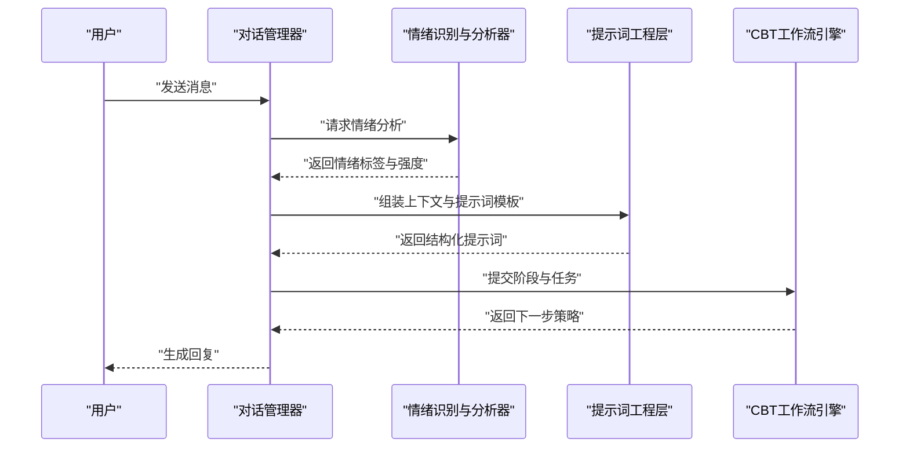

**图表来源**
- [design/BEACON.md](file://design/BEACON.md)

**章节来源**
- [design/BEACON.md](file://design/BEACON.md)

### 情绪识别与分析器
- 职责：对用户输入进行情感维度解析（如焦虑、抑郁、愤怒、悲伤、快乐）、强度评估与变化趋势判断；为CBT阶段推进与干预策略提供量化依据。
- 关键能力：
  - 多维情感分类：支持细粒度标签与置信度
  - 动态基线：建立个人情绪基线，识别异常波动
  - 风险预警：对高危信号进行即时标记与上报
  - 多模态分析：结合文本语义和语音情感特征

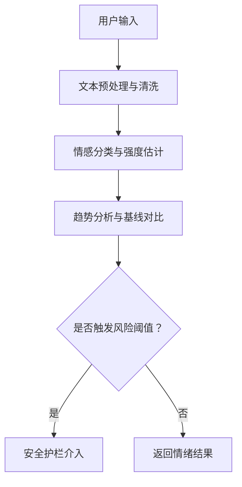

**图表来源**
- [design/BEACON.md](file://design/BEACON.md)

**章节来源**
- [design/BEACON.md](file://design/BEACON.md)

### 提示词工程层
- 职责：设计结构化提示词模板，管理上下文注入与响应优化；确保模型输出符合CBT规范、安全与伦理要求。
- 最佳实践：
  - 结构设计：明确角色、目标、约束、步骤与输出格式
  - 上下文管理：分层注入（全局设定、会话上下文、实时情绪）
  - 响应优化：限制长度、强制结构化输出、增加自检步骤
  - 安全约束：内置拒绝策略与转介话术

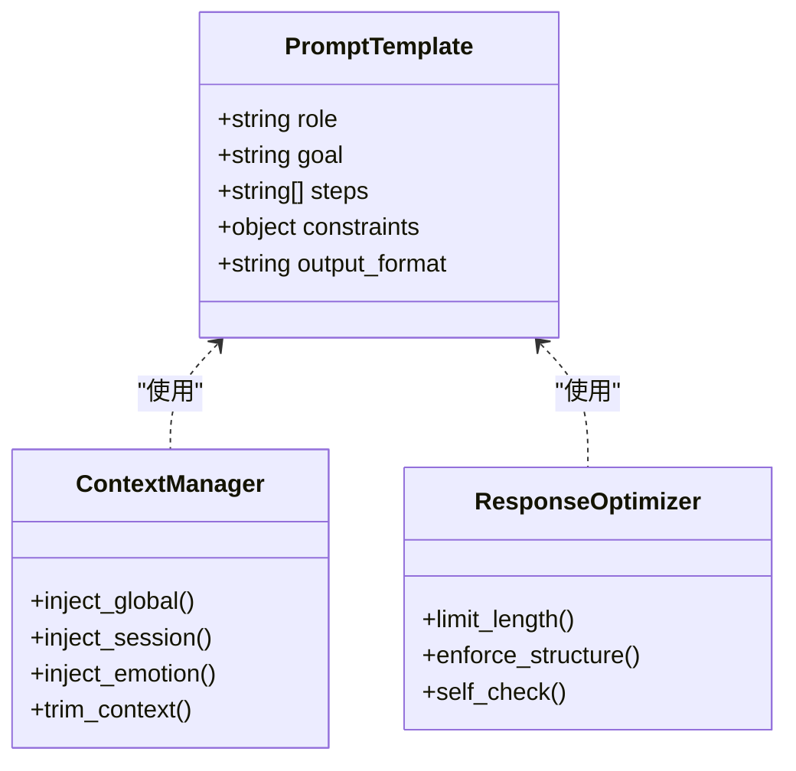

**图表来源**
- [prompts/20260529-初始探索prompt记录.md](file://prompts/20260529-初始探索prompt记录.md)

**章节来源**
- [prompts/20260529-初始探索prompt记录.md](file://prompts/20260529-初始探索prompt记录.md)

### 安全与合规护栏
- 职责：监控高风险内容（自伤、暴力、严重心理危机），执行降级策略与转介流程；确保输出符合伦理与法律要求。
- 关键机制：
  - 关键词与语义双通道检测
  - 分级响应：提醒、暂停、转介、紧急联系
  - 审计日志：记录触发事件与处置过程

**章节来源**
- [design/BEACON.md](file://design/BEACON.md)

## 依赖分析
各组件之间的依赖关系如下：
- AI聊天服务模块依赖对话管理器、情绪识别器、提示词工程层和语音服务
- 全局异常处理器被所有API层组件使用
- 安全配置为整个应用提供统一的访问控制
- 通用DTO层被所有服务层组件共享使用
- CBT工作流引擎依赖对话管理器与提示词工程层
- 情绪选择界面依赖聊天室组件和后端API
- 实时风险通知系统贯穿全流程，作为横切关注点
- 语音服务独立于主对话流程，可插拔式集成
- 管理员密码重置模块依赖安全配置、认证模块和审计日志服务

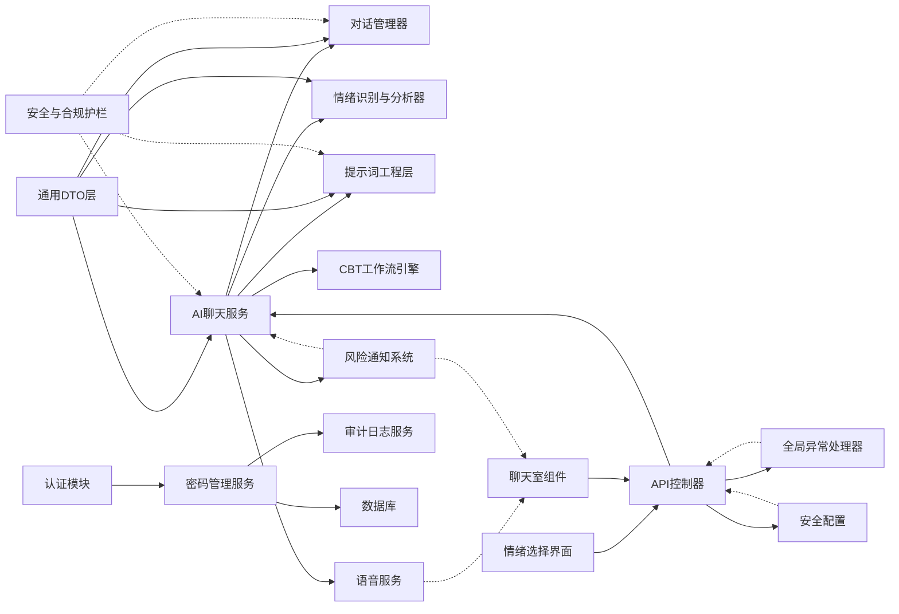

**图表来源**
- [AiChatService.java](file://backend/counseling-ai/src/main/java/com/mindsafe/ai/chat/AiChatService.java)
- [EmotionSelect.jsx](file://frontend/student-h5/src/components/EmotionSelect.jsx)
- [ChatRoom.jsx](file://frontend/student-h5/src/components/ChatRoom.jsx)
- [GlobalExceptionHandler.java](file://backend/counseling-api/src/main/java/com/mindsafe/api/config/GlobalExceptionHandler.java)
- [SecurityConfig.java](file://backend/counseling-api/src/main/java/com/mindsafe/api/config/SecurityConfig.java)
- [StreamMessageEvent.java](file://backend/counseling-common/src/main/java/com/mindsafe/common/dto/chat/StreamMessageEvent.java)

**章节来源**
- [AiChatService.java](file://backend/counseling-ai/src/main/java/com/mindsafe/ai/chat/AiChatService.java)
- [EmotionSelect.jsx](file://frontend/student-h5/src/components/EmotionSelect.jsx)
- [ChatRoom.jsx](file://frontend/student-h5/src/components/ChatRoom.jsx)
- [GlobalExceptionHandler.java](file://backend/counseling-api/src/main/java/com/mindsafe/api/config/GlobalExceptionHandler.java)
- [SecurityConfig.java](file://backend/counseling-api/src/main/java/com/mindsafe/api/config/SecurityConfig.java)

## 性能考虑
- 上下文窗口优化：采用摘要与重要性评分减少token消耗
- 异步处理：情绪分析与提示词组装并行执行，降低延迟
- 缓存策略：对高频提示词模板与情绪基线进行缓存
- 批处理：批量生成CBT练习与家庭作业，提升吞吐
- 流式响应：使用流式消息事件减少首字节延迟
- 连接池：复用数据库和LLM连接，提高资源利用率
- 语音处理优化：采用流式语音处理和边缘计算降低延迟
- 内存管理：合理管理语音缓冲区和情绪历史数据
- 并发控制：限制并发语音处理数量，防止资源耗尽
- 密码重置优化：异步处理密码重置请求，避免阻塞主线程
- 审计日志优化：批量写入审计日志，减少数据库压力

**更新** 新增了语音处理优化、内存管理和并发控制的性能考虑，以及密码重置和审计日志的性能优化。

## 故障排查指南
- 常见问题定位：
  - 对话脱节：检查上下文切片与摘要逻辑
  - 情绪误判：核对情感分类阈值与基线更新频率
  - 提示词失效：验证模板结构与注入顺序
  - 安全漏检：审查关键词与语义检测规则
  - 服务超时：检查AI聊天服务的超时配置和重试机制
  - 权限错误：验证安全配置和临时访问令牌
  - 数据不一致：检查通用DTO的字段映射和序列化
  - 语音延迟：检查语音服务响应时间和网络质量
  - 情绪选择异常：验证前端组件状态管理和数据同步
  - 风险通知失败：检查通知系统连接和消息队列状态
  - 密码重置失败：检查管理员权限验证和令牌生成逻辑
  - 审计日志缺失：验证审计服务连接和日志写入权限
- 调试方法：
  - 启用详细日志：记录每步输入输出与中间状态
  - 回放会话：保存完整上下文以便复现问题
  - 单元测试：对情绪分类与提示词组装进行断言测试
  - 异常追踪：利用全局异常处理器捕获和分析错误
  - 性能监控：监控流式响应的延迟和吞吐量
  - 语音调试：记录语音处理各环节的耗时和质量指标
  - 前端调试：使用浏览器开发者工具检查组件状态和数据流
  - 压力测试：模拟高并发场景验证系统稳定性
  - 安全测试：验证密码重置流程的安全性和权限控制
  - 审计测试：检查审计日志的完整性和准确性

**更新** 新增了语音交互、情绪选择和风险通知相关的故障排查方法，以及密码重置和审计日志的调试方法。

**章节来源**
- [GlobalExceptionHandler.java](file://backend/counseling-api/src/main/java/com/mindsafe/api/config/GlobalExceptionHandler.java)
- [AiChatService.java](file://backend/counseling-ai/src/main/java/com/mindsafe/ai/chat/AiChatService.java)
- [EmotionSelect.jsx](file://frontend/student-h5/src/components/EmotionSelect.jsx)
- [ChatRoom.jsx](file://frontend/student-h5/src/components/ChatRoom.jsx)

## 结论
本系统以CBT工作流为核心，结合AI聊天服务、对话管理、情绪识别与分析、提示词工程、语音交互、情绪选择界面、实时风险通知、全局异常处理、安全配置和通用DTO层，构建了完整的AI心理咨询能力框架。通过模块化设计与清晰的数据流转，系统在可扩展性、安全性与用户体验方面具备良好基础。新增的多模态支持和实时通知功能显著提升了系统的实用性和可靠性，管理员密码重置功能进一步完善了系统的安全管理能力。开发者可基于本文档快速定位关键组件、理解协作关系并进行二次开发。

**更新** 总结了新增功能对系统整体架构的提升和用户体验的改善，特别是管理员密码重置功能对安全管理能力的增强。

## 附录
- 配置参数建议：
  - 上下文窗口大小：根据模型能力与业务需求调整
  - 情绪阈值：按人群特征与风险等级校准
  - 提示词模板版本：保持向后兼容与灰度发布
  - AI服务超时：设置合理的超时时间和重试次数
  - 安全访问令牌：配置临时M1基线的有效期和权限范围
  - 流式响应缓冲：调整缓冲区大小以平衡内存使用和响应速度
  - 语音服务质量：配置语音识别准确率和响应时间阈值
  - 情绪选择UI：自定义情绪类别和视觉样式
  - 风险通知渠道：配置短信、邮件、电话等多种通知方式
  - 密码重置令牌有效期：设置合理的令牌过期时间
  - 审计日志存储：配置日志保留策略和存储空间
- 使用模式示例：
  - 单次咨询：短会话、聚焦单一问题
  - 系列咨询：多轮跟进、目标渐进达成
  - 自助练习：无监督模式下的CBT练习推荐
  - 实时监控：利用流式消息事件实现实时对话体验
  - 批量处理：使用通用DTO进行批量数据操作
  - 语音咨询：支持语音输入的沉浸式对话体验
  - 情绪跟踪：定期记录和分析用户情绪变化趋势
  - 紧急干预：高风险情况下的自动转介和人工介入
  - 管理员操作：通过安全流程进行用户密码重置
  - 审计查询：查看系统操作日志和安全事件

**更新** 新增了语音交互、情绪选择和风险通知的配置参数和使用模式示例，以及管理员密码重置和审计日志的相关配置。
