# 监控告警系统

<cite>
**本文引用的文件**   
- [AlertWebSocketHandler.java](file://backend/counseling-api/src/main/java/com/mindsafe/api/websocket/AlertWebSocketHandler.java)
- [AlertPushListener.java](file://backend/counseling-api/src/main/java/com/mindsafe/api/websocket/AlertPushListener.java)
- [WebSocketConfig.java](file://backend/counseling-api/src/main/java/com/mindsafe/api/websocket/WebSocketConfig.java)
- [NotificationService.java](file://backend/counseling-service/src/main/java/com/mindsafe/service/notification/NotificationService.java)
- [NotificationServiceImpl.java](file://backend/counseling-service/src/main/java/com/mindsafe/service/notification/NotificationServiceImpl.java)
- [RiskAlertPushEvent.java](file://backend/counseling-service/src/main/java/com/mindsafe/service/notification/RiskAlertPushEvent.java)
- [RiskEvent.java](file://backend/counseling-domain/src/main/java/com/mindsafe/domain/entity/RiskEvent.java)
- [RiskDetectorService.java](file://backend/counseling-ai/src/main/java/com/mindsafe/ai/risk/RiskDetectorService.java)
- [RiskDetectorServiceImpl.java](file://backend/counseling-ai/src/main/java/com/mindsafe/ai/risk/RiskDetectorServiceImpl.java)
- [RiskLevel.java](file://backend/counseling-common/src/main/java/com/mindsafe/common/enums/RiskLevel.java)
- [RiskDetectionResult.java](file://backend/counseling-common/src/main/java/com/mindsafe/common/dto/risk/RiskDetectionResult.java)
- [AlertQueue.jsx](file://frontend/teacher-web/src/components/teacher/AlertQueue.jsx)
- [useAlertWebSocket.jsx](file://frontend/teacher-web/src/hooks/useAlertWebSocket.jsx)
- [prometheus.yml](file://deploy/monitoring/prometheus.yml)
- [docker-compose.monitoring.yml](file://deploy/docker-compose.monitoring.yml)
- [AlertService.java](file://backend/counseling-service/src/main/java/com/mindsafe/service/alert/AlertService.java)
- [WeComAlertService.java](file://backend/counseling-service/src/main/java/com/mindsafe/service/alert/WeComAlertService.java)
- [LoggingAlertService.java](file://backend/counseling-service/src/main/java/com/mindsafe/service/alert/LoggingAlertService.java)
</cite>

## 更新摘要
**所做更改**   
- 新增完整的告警基础设施章节，包括AlertService接口设计
- 添加企业微信集成（WeComAlertService）详细说明
- 新增日志降级机制（LoggingAlertService）文档
- 更新质量评估系统集成部分
- 扩展架构总览图以包含新的告警服务组件

## 目录
1. [简介](#简介)
2. [项目结构](#项目结构)
3. [核心组件](#核心组件)
4. [架构总览](#架构总览)
5. [详细组件分析](#详细组件分析)
6. [告警基础设施](#告警基础设施)
7. [依赖关系分析](#依赖关系分析)
8. [性能考虑](#性能考虑)
9. [故障排查指南](#故障排查指南)
10. [结论](#结论)
11. [附录](#附录)

## 简介
本文件围绕"监控告警系统"进行系统化说明，聚焦风险识别、告警事件生成与推送、实时前端展示以及可观测性（Prometheus/Grafana）等关键能力。该系统以后端服务为核心，通过事件驱动与 WebSocket 实时通道，将高风险会话或异常行为及时推送至教师端界面，同时提供指标采集与可视化能力，帮助运营与管理人员快速定位问题并响应。

**更新** 新增了完整的告警基础设施，包括AlertService接口抽象、WeComAlertService企业微信集成、LoggingAlertService日志降级机制，以及与质量评估系统的自动告警集成，形成了更加完善和可靠的告警通知体系。

## 项目结构
与监控告警相关的代码分布在以下模块：
- API 层（counseling-api）：WebSocket 接入与告警推送入口
- 服务层（counseling-service）：通知服务、告警服务与告警事件定义
- AI 层（counseling-ai）：风险检测服务与结果模型
- 领域层（counseling-domain）：风险事件实体
- 公共层（counseling-common）：风险等级枚举与检测结果 DTO
- 前端（teacher-web）：告警队列与 WebSocket 客户端 Hook
- 部署与监控（deploy/monitoring）：Prometheus 配置与容器编排

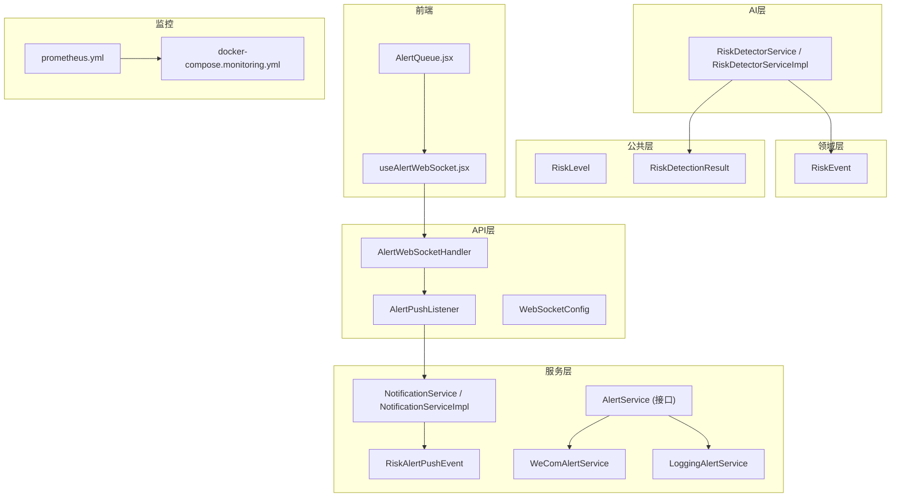

**图表来源**
- [AlertWebSocketHandler.java](file://backend/counseling-api/src/main/java/com/mindsafe/api/websocket/AlertWebSocketHandler.java)
- [AlertPushListener.java](file://backend/counseling-api/src/main/java/com/mindsafe/api/websocket/AlertPushListener.java)
- [WebSocketConfig.java](file://backend/counseling-api/src/main/java/com/mindsafe/api/websocket/WebSocketConfig.java)
- [NotificationService.java](file://backend/counseling-service/src/main/java/com/mindsafe/service/notification/NotificationService.java)
- [NotificationServiceImpl.java](file://backend/counseling-service/src/main/java/com/mindsafe/service/notification/NotificationServiceImpl.java)
- [RiskAlertPushEvent.java](file://backend/counseling-service/src/main/java/com/mindsafe/service/notification/RiskAlertPushEvent.java)
- [AlertService.java](file://backend/counseling-service/src/main/java/com/mindsafe/service/alert/AlertService.java)
- [WeComAlertService.java](file://backend/counseling-service/src/main/java/com/mindsafe/service/alert/WeComAlertService.java)
- [LoggingAlertService.java](file://backend/counseling-service/src/main/java/com/mindsafe/service/alert/LoggingAlertService.java)
- [RiskDetectorService.java](file://backend/counseling-ai/src/main/java/com/mindsafe/ai/risk/RiskDetectorService.java)
- [RiskDetectorServiceImpl.java](file://backend/counseling-ai/src/main/java/com/mindsafe/ai/risk/RiskDetectorServiceImpl.java)
- [RiskEvent.java](file://backend/counseling-domain/src/main/java/com/mindsafe/domain/entity/RiskEvent.java)
- [RiskLevel.java](file://backend/counseling-common/src/main/java/com/mindsafe/common/enums/RiskLevel.java)
- [RiskDetectionResult.java](file://backend/counseling-common/src/main/java/com/mindsafe/common/dto/risk/RiskDetectionResult.java)
- [AlertQueue.jsx](file://frontend/teacher-web/src/components/teacher/AlertQueue.jsx)
- [useAlertWebSocket.jsx](file://frontend/teacher-web/src/hooks/useAlertWebSocket.jsx)
- [prometheus.yml](file://deploy/monitoring/prometheus.yml)
- [docker-compose.monitoring.yml](file://deploy/docker-compose.monitoring.yml)

## 核心组件
- 风险检测服务：负责基于输入内容或上下文判断风险等级与类型，输出标准化检测结果。
- 通知服务与告警事件：封装告警事件，触发推送流程，支持异步处理与重试策略。
- **新增** 告警基础设施：统一的AlertService接口抽象，支持多种告警渠道实现。
- **新增** 企业微信集成：WeComAlertService提供企业微信机器人消息推送能力。
- **新增** 日志降级机制：LoggingAlertService作为默认降级实现，确保告警可靠性。
- WebSocket 推送：建立长连接，向已订阅的客户端（教师端）实时推送告警消息。
- 前端告警队列：维护告警列表、状态与交互操作，使用 Hook 管理 WebSocket 生命周期。
- 监控与可观测性：通过 Prometheus 采集指标，配合 Grafana 可视化展示。

**章节来源**
- [RiskDetectorService.java](file://backend/counseling-ai/src/main/java/com/mindsafe/ai/risk/RiskDetectorService.java)
- [RiskDetectorServiceImpl.java](file://backend/counseling-ai/src/main/java/com/mindsafe/ai/risk/RiskDetectorServiceImpl.java)
- [NotificationService.java](file://backend/counseling-service/src/main/java/com/mindsafe/service/notification/NotificationService.java)
- [NotificationServiceImpl.java](file://backend/counseling-service/src/main/java/com/mindsafe/service/notification/NotificationServiceImpl.java)
- [AlertService.java](file://backend/counseling-service/src/main/java/com/mindsafe/service/alert/AlertService.java)
- [WeComAlertService.java](file://backend/counseling-service/src/main/java/com/mindsafe/service/alert/WeComAlertService.java)
- [LoggingAlertService.java](file://backend/counseling-service/src/main/java/com/mindsafe/service/alert/LoggingAlertService.java)
- [AlertWebSocketHandler.java](file://backend/counseling-api/src/main/java/com/mindsafe/api/websocket/AlertWebSocketHandler.java)
- [AlertPushListener.java](file://backend/counseling-api/src/main/java/com/mindsafe/api/websocket/AlertPushListener.java)
- [AlertQueue.jsx](file://frontend/teacher-web/src/components/teacher/AlertQueue.jsx)
- [useAlertWebSocket.jsx](file://frontend/teacher-web/src/hooks/useAlertWebSocket.jsx)

## 架构总览
下图展示了从风险检测到前端展示的端到端流程，包括事件发布、WebSocket 推送与监控采集，以及新增的告警基础设施。

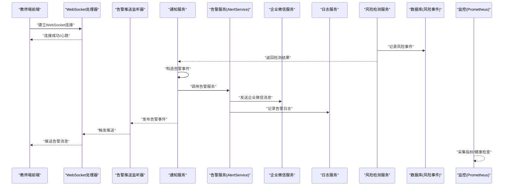

**图表来源**
- [AlertWebSocketHandler.java](file://backend/counseling-api/src/main/java/com/mindsafe/api/websocket/AlertWebSocketHandler.java)
- [AlertPushListener.java](file://backend/counseling-api/src/main/java/com/mindsafe/api/websocket/AlertPushListener.java)
- [NotificationService.java](file://backend/counseling-service/src/main/java/com/mindsafe/service/notification/NotificationService.java)
- [NotificationServiceImpl.java](file://backend/counseling-service/src/main/java/com/mindsafe/service/notification/NotificationServiceImpl.java)
- [AlertService.java](file://backend/counseling-service/src/main/java/com/mindsafe/service/alert/AlertService.java)
- [WeComAlertService.java](file://backend/counseling-service/src/main/java/com/mindsafe/service/alert/WeComAlertService.java)
- [LoggingAlertService.java](file://backend/counseling-service/src/main/java/com/mindsafe/service/alert/LoggingAlertService.java)
- [RiskDetectorService.java](file://backend/counseling-ai/src/main/java/com/mindsafe/ai/risk/RiskDetectorService.java)
- [RiskDetectorServiceImpl.java](file://backend/counseling-ai/src/main/java/com/mindsafe/ai/risk/RiskDetectorServiceImpl.java)
- [RiskEvent.java](file://backend/counseling-domain/src/main/java/com/mindsafe/domain/entity/RiskEvent.java)
- [prometheus.yml](file://deploy/monitoring/prometheus.yml)

## 详细组件分析

### 风险检测服务（AI层）
- 职责：接收对话或上下文数据，执行规则/模型判断，输出风险等级与详情。
- 关键数据结构：
  - 检测结果 DTO：包含风险等级、类型、置信度与建议动作。
  - 风险等级枚举：统一风险级别定义，便于下游消费。
- 复杂度与优化：
  - 检测逻辑可能涉及多规则匹配与外部模型调用，建议缓存热点规则与结果，降低延迟。
  - 对高并发场景采用异步化与批处理，避免阻塞主链路。

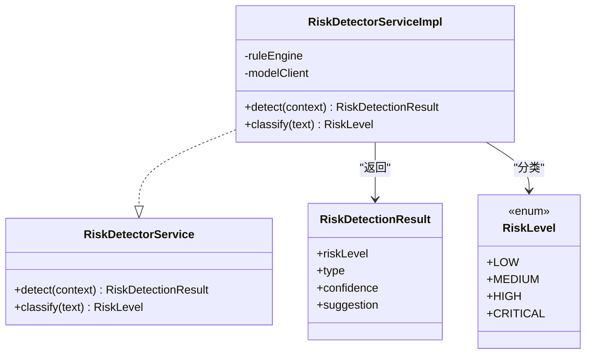

**图表来源**
- [RiskDetectorService.java](file://backend/counseling-ai/src/main/java/com/mindsafe/ai/risk/RiskDetectorService.java)
- [RiskDetectorServiceImpl.java](file://backend/counseling-ai/src/main/java/com/mindsafe/ai/risk/RiskDetectorServiceImpl.java)
- [RiskDetectionResult.java](file://backend/counseling-common/src/main/java/com/mindsafe/common/dto/risk/RiskDetectionResult.java)
- [RiskLevel.java](file://backend/counseling-common/src/main/java/com/mindsafe/common/enums/RiskLevel.java)

**章节来源**
- [RiskDetectorService.java](file://backend/counseling-ai/src/main/java/com/mindsafe/ai/risk/RiskDetectorService.java)
- [RiskDetectorServiceImpl.java](file://backend/counseling-ai/src/main/java/com/mindsafe/ai/risk/RiskDetectorServiceImpl.java)
- [RiskDetectionResult.java](file://backend/counseling-common/src/main/java/com/mindsafe/common/dto/risk/RiskDetectionResult.java)
- [RiskLevel.java](file://backend/counseling-common/src/main/java/com/mindsafe/common/enums/RiskLevel.java)

### 通知服务与告警事件（服务层）
- 职责：封装告警事件，协调持久化与推送；支持重试、去重与限流。
- 关键数据结构：
  - 告警推送事件：携带用户标识、会话信息、风险等级与时间戳。
- 处理流程：
  - 接收检测结果后创建告警事件，写入数据库，并通过监听器触发推送。
  - 失败时进行指数退避重试，确保可靠性。

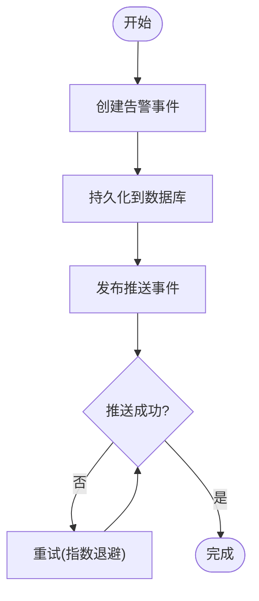

**图表来源**
- [NotificationService.java](file://backend/counseling-service/src/main/java/com/mindsafe/service/notification/NotificationService.java)
- [NotificationServiceImpl.java](file://backend/counseling-service/src/main/java/com/mindsafe/service/notification/NotificationServiceImpl.java)
- [RiskAlertPushEvent.java](file://backend/counseling-service/src/main/java/com/mindsafe/service/notification/RiskAlertPushEvent.java)

**章节来源**
- [NotificationService.java](file://backend/counseling-service/src/main/java/com/mindsafe/service/notification/NotificationService.java)
- [NotificationServiceImpl.java](file://backend/counseling-service/src/main/java/com/mindsafe/service/notification/NotificationServiceImpl.java)
- [RiskAlertPushEvent.java](file://backend/counseling-service/src/main/java/com/mindsafe/service/notification/RiskAlertPushEvent.java)

### WebSocket 推送（API层）
- 职责：管理 WebSocket 连接、鉴权与会话绑定，转发告警消息给订阅者。
- 关键点：
  - 连接建立与心跳保活，防止空闲断开。
  - 按用户或角色路由消息，确保精准推送。
  - 错误处理与断线重连提示。

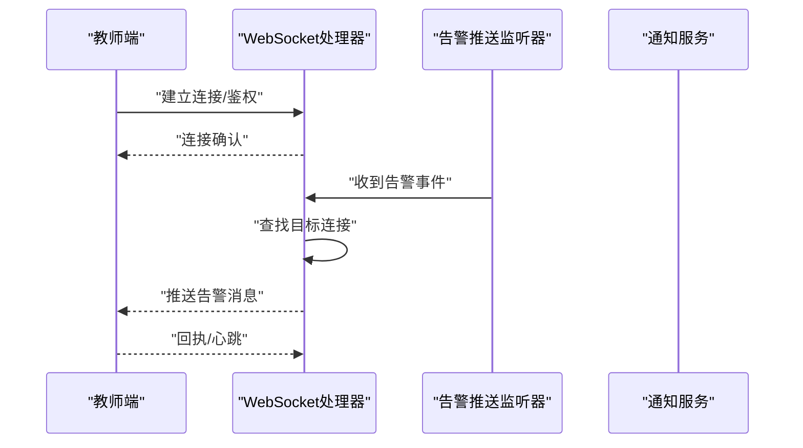

**图表来源**
- [AlertWebSocketHandler.java](file://backend/counseling-api/src/main/java/com/mindsafe/api/websocket/AlertWebSocketHandler.java)
- [AlertPushListener.java](file://backend/counseling-api/src/main/java/com/mindsafe/api/websocket/AlertPushListener.java)
- [WebSocketConfig.java](file://backend/counseling-api/src/main/java/com/mindsafe/api/websocket/WebSocketConfig.java)

**章节来源**
- [AlertWebSocketHandler.java](file://backend/counseling-api/src/main/java/com/mindsafe/api/websocket/AlertWebSocketHandler.java)
- [AlertPushListener.java](file://backend/counseling-api/src/main/java/com/mindsafe/api/websocket/AlertPushListener.java)
- [WebSocketConfig.java](file://backend/counseling-api/src/main/java/com/mindsafe/api/websocket/WebSocketConfig.java)

### 前端告警队列与 Hook（Teacher Web）
- 职责：维护告警列表、状态切换、交互操作（如标记已读、转交），并通过 Hook 管理 WebSocket 连接与消息订阅。
- 关键点：
  - 本地状态与远端同步，保证一致性。
  - 错误边界与降级策略（如网络异常时显示离线提示）。
  - 性能优化：分页加载、增量更新与防抖。

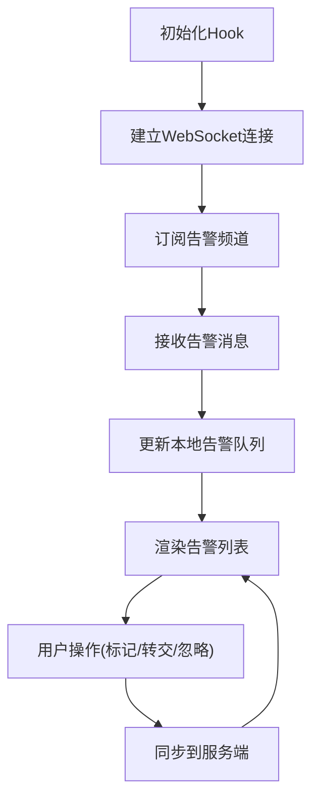

**图表来源**
- [AlertQueue.jsx](file://frontend/teacher-web/src/components/teacher/AlertQueue.jsx)
- [useAlertWebSocket.jsx](file://frontend/teacher-web/src/hooks/useAlertWebSocket.jsx)

**章节来源**
- [AlertQueue.jsx](file://frontend/teacher-web/src/components/teacher/AlertQueue.jsx)
- [useAlertWebSocket.jsx](file://frontend/teacher-web/src/hooks/useAlertWebSocket.jsx)

### 监控与可观测性（Prometheus/Grafana）
- 职责：采集应用指标与健康状态，提供可视化面板与告警规则。
- 关键点：
  - 暴露指标端点，配置抓取间隔与标签。
  - 定义告警规则（如错误率阈值、延迟分位值）。
  - 容器编排中集成监控栈，便于弹性伸缩与滚动升级。

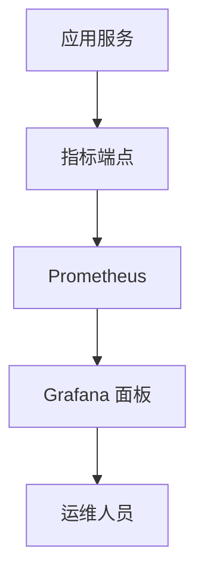

**图表来源**
- [prometheus.yml](file://deploy/monitoring/prometheus.yml)
- [docker-compose.monitoring.yml](file://deploy/docker-compose.monitoring.yml)

**章节来源**
- [prometheus.yml](file://deploy/monitoring/prometheus.yml)
- [docker-compose.monitoring.yml](file://deploy/docker-compose.monitoring.yml)

## 告警基础设施

### AlertService 接口设计
AlertService 作为统一的告警服务接口，定义了标准化的告警发送方法，支持多种告警渠道的实现。该接口提供了灵活可扩展的告警机制，允许系统根据配置选择不同的告警渠道。

**主要特性：**
- 统一的告警发送接口，屏蔽不同渠道的差异
- 支持多种告警类型（风险告警、系统告警、业务告警）
- 提供告警优先级和紧急程度控制
- 支持告警去重和频率限制

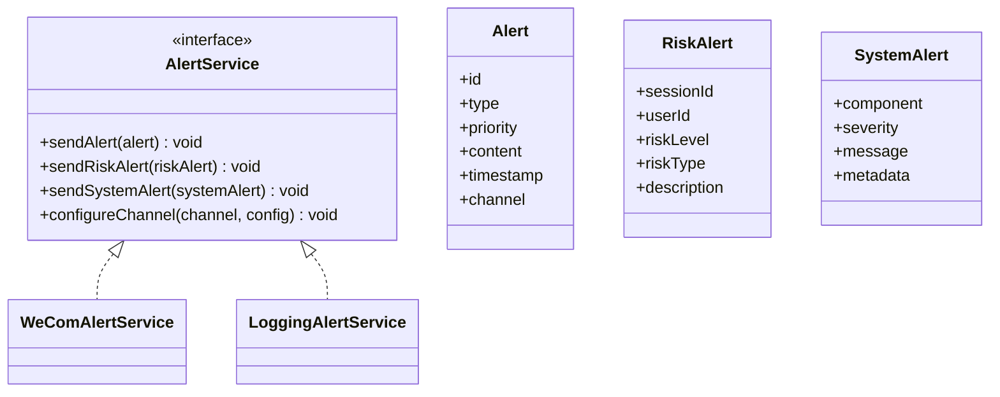

**图表来源**
- [AlertService.java](file://backend/counseling-service/src/main/java/com/mindsafe/service/alert/AlertService.java)

### 企业微信集成（WeComAlertService）
WeComAlertService 实现了 AlertService 接口，专门负责企业微信机器人的消息推送。该服务支持多种企业微信消息格式，包括文本、Markdown、图文等，满足不同场景的告警需求。

**核心功能：**
- 企业微信机器人 API 集成
- 支持多种消息格式（文本、Markdown、图文卡片）
- 消息模板管理和动态内容填充
- 失败重试和错误处理机制
- 消息发送状态监控和日志记录

**配置要求：**
- 企业微信机器人 webhook URL
- 消息模板配置
- 发送频率限制配置

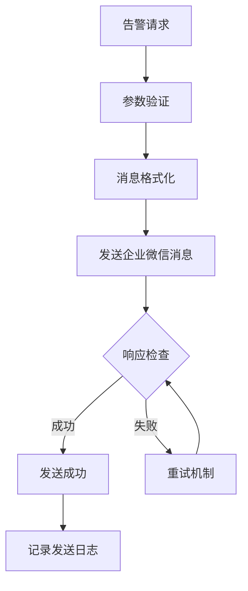

**图表来源**
- [WeComAlertService.java](file://backend/counseling-service/src/main/java/com/mindsafe/service/alert/WeComAlertService.java)

### 日志降级机制（LoggingAlertService）
LoggingAlertService 作为默认的告警服务实现，当其他告警渠道不可用时，自动降级为日志记录模式。这种设计确保了告警系统的可靠性和容错性。

**降级策略：**
- 主渠道失败时自动切换到日志记录
- 支持多级降级（企业微信 → 日志 → 内存队列）
- 告警消息持久化存储，支持后续恢复
- 批量处理和异步发送，提高性能

**监控指标：**
- 告警发送成功率
- 各渠道使用统计
- 降级触发次数
- 消息积压情况

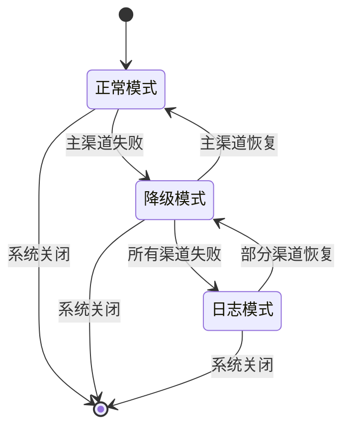

**图表来源**
- [LoggingAlertService.java](file://backend/counseling-service/src/main/java/com/mindsafe/service/alert/LoggingAlertService.java)

### 质量评估系统集成
告警基础设施与质量评估系统深度集成，当检测到会话质量异常时，自动触发相应的告警流程。这种集成确保了质量问题能够及时发现和处理。

**集成特性：**
- 质量评分异常自动告警
- 多维度质量指标监控
- 智能告警过滤和聚合
- 质量趋势分析和预警

**章节来源**
- [AlertService.java](file://backend/counseling-service/src/main/java/com/mindsafe/service/alert/AlertService.java)
- [WeComAlertService.java](file://backend/counseling-service/src/main/java/com/mindsafe/service/alert/WeComAlertService.java)
- [LoggingAlertService.java](file://backend/counseling-service/src/main/java/com/mindsafe/service/alert/LoggingAlertService.java)

## 依赖关系分析
- 耦合与内聚：
  - 风险检测服务与通知服务解耦，通过标准 DTO 传递结果，降低实现细节耦合。
  - WebSocket 推送仅依赖事件源，不关心业务逻辑，提升扩展性。
  - **新增** 告警服务通过接口抽象，实现了与具体告警渠道的解耦。
- 外部依赖：
  - 数据库用于持久化风险事件与告警记录。
  - 监控栈用于指标采集与可视化。
  - **新增** 企业微信 API 用于外部消息推送。
- 潜在循环依赖：
  - 通过事件与接口抽象避免直接循环引用。

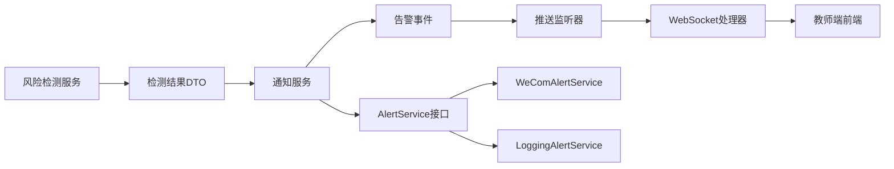

**图表来源**
- [RiskDetectorService.java](file://backend/counseling-ai/src/main/java/com/mindsafe/ai/risk/RiskDetectorService.java)
- [RiskDetectionResult.java](file://backend/counseling-common/src/main/java/com/mindsafe/common/dto/risk/RiskDetectionResult.java)
- [NotificationService.java](file://backend/counseling-service/src/main/java/com/mindsafe/service/notification/NotificationService.java)
- [RiskAlertPushEvent.java](file://backend/counseling-service/src/main/java/com/mindsafe/service/notification/RiskAlertPushEvent.java)
- [AlertPushListener.java](file://backend/counseling-api/src/main/java/com/mindsafe/api/websocket/AlertPushListener.java)
- [AlertWebSocketHandler.java](file://backend/counseling-api/src/main/java/com/mindsafe/api/websocket/AlertWebSocketHandler.java)
- [AlertService.java](file://backend/counseling-service/src/main/java/com/mindsafe/service/alert/AlertService.java)
- [WeComAlertService.java](file://backend/counseling-service/src/main/java/com/mindsafe/service/alert/WeComAlertService.java)
- [LoggingAlertService.java](file://backend/counseling-service/src/main/java/com/mindsafe/service/alert/LoggingAlertService.java)

**章节来源**
- [RiskDetectorService.java](file://backend/counseling-ai/src/main/java/com/mindsafe/ai/risk/RiskDetectorService.java)
- [RiskDetectionResult.java](file://backend/counseling-common/src/main/java/com/mindsafe/common/dto/risk/RiskDetectionResult.java)
- [NotificationService.java](file://backend/counseling-service/src/main/java/com/mindsafe/service/notification/NotificationService.java)
- [RiskAlertPushEvent.java](file://backend/counseling-service/src/main/java/com/mindsafe/service/notification/RiskAlertPushEvent.java)
- [AlertPushListener.java](file://backend/counseling-api/src/main/java/com/mindsafe/api/websocket/AlertPushListener.java)
- [AlertWebSocketHandler.java](file://backend/counseling-api/src/main/java/com/mindsafe/api/websocket/AlertWebSocketHandler.java)
- [AlertService.java](file://backend/counseling-service/src/main/java/com/mindsafe/service/alert/AlertService.java)
- [WeComAlertService.java](file://backend/counseling-service/src/main/java/com/mindsafe/service/alert/WeComAlertService.java)
- [LoggingAlertService.java](file://backend/counseling-service/src/main/java/com/mindsafe/service/alert/LoggingAlertService.java)

## 性能考虑
- 风险检测：
  - 规则与模型调用应缓存热点数据，减少重复计算。
  - 批量处理与异步化，避免阻塞主线程。
- 推送链路：
  - 使用连接池与消息队列缓冲突发流量。
  - 心跳与超时控制，释放无效连接。
  - **新增** 告警服务采用异步发送和批量处理，提高吞吐量。
- 前端：
  - 增量更新与虚拟列表，降低渲染压力。
  - 错误重试与降级，保障用户体验。
- 监控：
  - 合理设置抓取间隔与保留策略，平衡精度与存储成本。
  - **新增** 告警服务监控指标，包括发送成功率、延迟统计等。

## 故障排查指南
- 连接问题：
  - 检查 WebSocket 握手与鉴权流程，确认端口与防火墙策略。
  - 查看心跳与超时配置，确保连接稳定。
- 推送失败：
  - 核查监听器与通知服务的日志，定位事件丢失或重试失败原因。
  - 验证数据库写入是否成功，检查事务与锁竞争。
  - **新增** 检查告警服务配置和各渠道连接状态。
- 前端异常：
  - 检查 Hook 的连接状态与消息订阅回调。
  - 观察浏览器控制台错误与网络请求状态。
- 监控缺失：
  - 确认指标端点可达，Prometheus 抓取正常。
  - 检查 Grafana 数据源与面板配置。
  - **新增** 检查告警服务监控指标和降级状态。

**章节来源**
- [AlertWebSocketHandler.java](file://backend/counseling-api/src/main/java/com/mindsafe/api/websocket/AlertWebSocketHandler.java)
- [AlertPushListener.java](file://backend/counseling-api/src/main/java/com/mindsafe/api/websocket/AlertPushListener.java)
- [NotificationServiceImpl.java](file://backend/counseling-service/src/main/java/com/mindsafe/service/notification/NotificationServiceImpl.java)
- [useAlertWebSocket.jsx](file://frontend/teacher-web/src/hooks/useAlertWebSocket.jsx)
- [prometheus.yml](file://deploy/monitoring/prometheus.yml)
- [AlertService.java](file://backend/counseling-service/src/main/java/com/mindsafe/service/alert/AlertService.java)
- [WeComAlertService.java](file://backend/counseling-service/src/main/java/com/mindsafe/service/alert/WeComAlertService.java)
- [LoggingAlertService.java](file://backend/counseling-service/src/main/java/com/mindsafe/service/alert/LoggingAlertService.java)

## 结论
该监控告警系统以风险检测为核心，结合通知服务与 WebSocket 实时推送，形成从检测到响应的闭环。通过标准化的数据模型与事件驱动架构，系统在可扩展性与可靠性方面具备良好基础。配合 Prometheus/Grafana 的可观测性能力，能够有效支撑生产环境的监控与运维需求。

**更新** 新增的完整告警基础设施进一步增强了系统的可靠性和灵活性。AlertService 接口抽象提供了统一的告警发送机制，WeComAlertService 企业微信集成为即时通讯提供了便利，LoggingAlertService 日志降级机制确保了告警的可靠性。这些改进使得系统能够更好地应对各种生产环境挑战，提供更稳定和高效的告警服务。建议在后续迭代中持续优化性能与容错机制，完善监控告警规则与可视化面板。

## 附录
- 相关实体与枚举：
  - 风险事件实体：用于持久化风险相关信息。
  - 风险等级枚举：统一风险级别定义。
- 部署参考：
  - 监控栈容器编排与配置文件路径。
- **新增** 告警服务配置：
  - AlertService 接口配置和使用示例
  - WeComAlertService 企业微信机器人配置
  - LoggingAlertService 日志降级配置

**章节来源**
- [RiskEvent.java](file://backend/counseling-domain/src/main/java/com/mindsafe/domain/entity/RiskEvent.java)
- [RiskLevel.java](file://backend/counseling-common/src/main/java/com/mindsafe/common/enums/RiskLevel.java)
- [docker-compose.monitoring.yml](file://deploy/docker-compose.monitoring.yml)
- [prometheus.yml](file://deploy/monitoring/prometheus.yml)
- [AlertService.java](file://backend/counseling-service/src/main/java/com/mindsafe/service/alert/AlertService.java)
- [WeComAlertService.java](file://backend/counseling-service/src/main/java/com/mindsafe/service/alert/WeComAlertService.java)
- [LoggingAlertService.java](file://backend/counseling-service/src/main/java/com/mindsafe/service/alert/LoggingAlertService.java)