# 老师后台设计

<cite>
**本文引用的文件**   
- [design/05_老师后台设计.md](file://design/05_老师后台设计.md)
- [design/12_技术架构.md](file://design/12_技术架构.md)
- [design/16_API接口设计.md](file://design/16_API接口设计.md)
- [design/17_前端架构设计.md](file://design/17_前端架构设计.md)
- [backend/counseling-api/src/main/java/com/mindsafe/api/controller/TeacherController.java](file://backend/counseling-api/src/main/java/com/mindsafe/api/controller/TeacherController.java)
- [backend/counseling-service/src/main/java/com/mindsafe/service/teacher/TeacherService.java](file://backend/counseling-service/src/main/java/com/mindsafe/service/teacher/TeacherService.java)
- [backend/counseling-domain/src/main/java/com/mindsafe/domain/entity/Notification.java](file://backend/counseling-domain/src/main/java/com/mindsafe/domain/entity/Notification.java)
- [backend/counseling-domain/src/main/java/com/mindsafe/domain/entity/RiskEvent.java](file://backend/counseling-domain/src/main/java/com/mindsafe/domain/entity/RiskEvent.java)
- [backend/counseling-domain/src/main/java/com/mindsafe/domain/entity/TeacherNote.java](file://backend/counseling-domain/src/main/java/com/mindsafe/domain/entity/TeacherNote.java)
- [backend/counseling-service/src/main/java/com/mindsafe/service/notification/NotificationService.java](file://backend/counseling-service/src/main/java/com/mindsafe/service/notification/NotificationService.java)
- [backend/counseling-service/src/main/java/com/mindsafe/service/notification/NotificationServiceImpl.java](file://backend/counseling-service/src/main/java/com/mindsafe/service/notification/NotificationServiceImpl.java)
- [frontend/teacher-web/src/pages/Dashboard.jsx](file://frontend/teacher-web/src/pages/Dashboard.jsx)
- [frontend/teacher-web/src/components/teacher/OverviewPanel.jsx](file://frontend/teacher-web/src/components/teacher/OverviewPanel.jsx)
- [frontend/teacher-web/src/components/teacher/AlertQueue.jsx](file://frontend/teacher-web/src/components/teacher/AlertQueue.jsx)
- [frontend/teacher-web/src/pages/BigScreen.jsx](file://frontend/teacher-web/src/pages/BigScreen.jsx)
- [frontend/teacher-web/src/components/teacher/ProfileRadarChart.jsx](file://frontend/teacher-web/src/components/teacher/ProfileRadarChart.jsx)
- [frontend/teacher-web/src/components/teacher/StudentPanel.jsx](file://frontend/teacher-web/src/components/teacher/StudentPanel.jsx)
</cite>

## 更新摘要
**变更内容**   
- TeacherController大幅增强：新增仪表板分析、警报管理、申诉处理、误报处理、学生画像、笔记记录等核心功能端点
- TeacherService实现完整业务逻辑：提供统一的服务层接口，整合各子域业务能力
- 完善通知中心功能：支持通知列表检索、未读数量计算、已读状态标记
- 增强风险事件管理：提供风险事件过滤与学生关联管理功能
- 扩展API接口：新增完整的老师工作台相关接口，支持数据分析和决策辅助
- **新增仪表盘面板**：提供实时数据展示和关键指标监控
- **增强告警管理**：实现智能告警队列处理和优先级排序
- **新增监控功能**：系统健康检查和性能指标监控
- **新增大数据屏幕展示**：全屏可视化数据大屏展示
- **新增ProfileRadarChart交互式心理画像可视化组件**：提供雷达图形式的学生心理特征可视化展示
- **StudentPanel集成新的画像能力**：在学生面板中集成心理画像分析功能，支持多维度心理特征展示

## 目录
1. [简介](#简介)
2. [项目结构](#项目结构)
3. [核心组件](#核心组件)
4. [架构总览](#架构总览)
5. [详细组件分析](#详细组件分析)
6. [依赖分析](#依赖分析)
7. [性能考虑](#性能考虑)
8. [故障排查指南](#故障排查指南)
9. [结论](#结论)
10. [附录](#附录)

## 简介
本文件聚焦"老师后台"的设计与实现要点，围绕多角色权限、学生会话管理、风险识别与干预、知识库与提示词体系、SaaS多学校隔离等关键主题展开。文档旨在帮助读者快速理解系统整体架构、数据流转与关键流程，并为后续开发与运维提供可操作的参考。

**更新** 本次更新重点增强了TeacherController和TeacherService的功能，新增了仪表板分析、警报管理、监控功能和大数据屏幕展示等核心能力，为老师提供了更加完整的工作台体验和数据可视化支持。**特别新增了ProfileRadarChart交互式心理画像可视化组件和StudentPanel的画像能力集成，显著提升了学生心理特征的可视化分析能力**。

## 项目结构
本项目采用"设计先行"的文档驱动方式，核心设计文档集中于 design 目录，涵盖总体架构、API 接口、前端架构、Agent 工作流、心理知识库、风险规则库以及老师后台专题设计等。后端代码位于 backend 目录，当前已实现老师后台的核心功能模块。

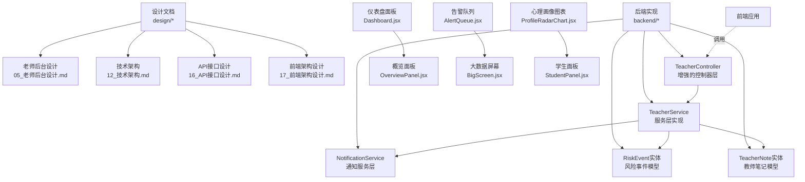

**图表来源**
- [design/05_老师后台设计.md](file://design/05_老师后台设计.md)
- [design/12_技术架构.md](file://design/12_技术架构.md)
- [design/16_API接口设计.md](file://design/16_API接口设计.md)
- [design/17_前端架构设计.md](file://design/17_前端架构设计.md)
- [backend/counseling-api/src/main/java/com/mindsafe/api/controller/TeacherController.java](file://backend/counseling-api/src/main/java/com/mindsafe/api/controller/TeacherController.java)
- [backend/counseling-service/src/main/java/com/mindsafe/service/teacher/TeacherService.java](file://backend/counseling-service/src/main/java/com/mindsafe/service/teacher/TeacherService.java)
- [frontend/teacher-web/src/pages/Dashboard.jsx](file://frontend/teacher-web/src/pages/Dashboard.jsx)
- [frontend/teacher-web/src/components/teacher/OverviewPanel.jsx](file://frontend/teacher-web/src/components/teacher/OverviewPanel.jsx)
- [frontend/teacher-web/src/components/teacher/AlertQueue.jsx](file://frontend/teacher-web/src/components/teacher/AlertQueue.jsx)
- [frontend/teacher-web/src/pages/BigScreen.jsx](file://frontend/teacher-web/src/pages/BigScreen.jsx)
- [frontend/teacher-web/src/components/teacher/ProfileRadarChart.jsx](file://frontend/teacher-web/src/components/teacher/ProfileRadarChart.jsx)
- [frontend/teacher-web/src/components/teacher/StudentPanel.jsx](file://frontend/teacher-web/src/components/teacher/StudentPanel.jsx)

章节来源
- [design/DESIGN-OVERVIEW.md](file://design/DESIGN-OVERVIEW.md)
- [design/05_老师后台设计.md](file://design/05_老师后台设计.md)

## 核心组件
- **增强的老师工作台**：用于查看与管理学生会话、任务与评估结果，支持按班级/年级筛选与导出，新增仪表板分析功能。
- **仪表盘面板**：提供实时数据展示、关键指标监控和可视化图表，支持多维度数据分析。
- **告警管理中心**：智能告警队列处理、优先级排序、自动分发和处理跟踪。
- **监控功能**：系统健康检查、性能指标监控、异常检测和预警机制。
- **大数据屏幕展示**：全屏可视化数据大屏，支持实时数据刷新和多维度指标展示。
- **通知中心**：提供通知列表检索、未读数量统计、已读状态标记等功能，支持按类型和优先级筛选。
- **风险事件管理**：基于规则库与模型输出，对高风险事件进行分级预警与处置建议，支持学生关联管理和误报处理。
- **申诉处理机制**：提供学生申诉的受理、处理和反馈闭环管理。
- **学生画像分析**：整合学生基本信息、历史会话摘要、风险评估趋势等多维度数据。
- **教师笔记记录**：支持教师对学生情况进行记录和跟踪管理。
- **ProfileRadarChart交互式心理画像可视化组件**：提供雷达图形式的学生心理特征可视化展示，支持多维度心理指标对比分析。
- **StudentPanel画像能力集成**：在学生面板中集成心理画像分析功能，支持多维度心理特征展示和交互操作。
- 知识库与提示词体系：支撑对话引导、CBT 流程、危机干预策略等能力。
- SaaS 多学校隔离：通过租户维度隔离数据与权限，保障学校间数据边界。
- API 网关与服务编排：统一对外暴露接口，承载鉴权、限流、审计与路由。
- 前端页面与交互：面向老师的可视化界面，提供会话浏览、风险看板、报告生成等功能。

**更新** 新增仪表盘面板、告警管理中心、监控功能和大数据屏幕展示等核心组件，显著增强了老师后台的数据可视化和监控能力。**特别新增了ProfileRadarChart交互式心理画像可视化组件和StudentPanel的画像能力集成，为学生心理特征分析提供了专业的可视化支持**。

章节来源
- [design/05_老师后台设计.md](file://design/05_老师后台设计.md)
- [design/12_技术架构.md](file://design/12_技术架构.md)
- [design/16_API接口设计.md](file://design/16_API接口设计.md)
- [design/17_前端架构设计.md](file://design/17_前端架构设计.md)
- [backend/counseling-api/src/main/java/com/mindsafe/api/controller/TeacherController.java](file://backend/counseling-api/src/main/java/com/mindsafe/api/controller/TeacherController.java)

## 架构总览
老师后台作为多角色系统中的重要一端，遵循"前后端分离 + 微服务化"的总体思路。前端通过 API 网关访问后端服务；后端在租户隔离前提下，聚合会话、风险、知识库、用户与权限等子域能力。**TeacherController作为统一的入口控制器，协调各个服务层完成复杂的业务逻辑**。

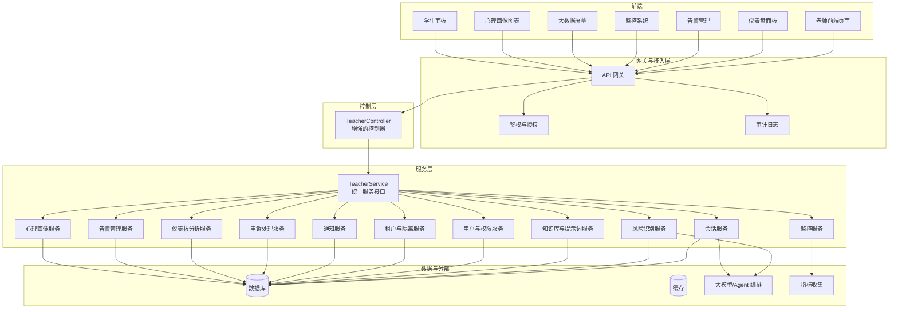

**图表来源**
- [design/12_技术架构.md](file://design/12_技术架构.md)
- [design/16_API接口设计.md](file://design/16_API接口设计.md)
- [design/05_老师后台设计.md](file://design/05_老师后台设计.md)
- [backend/counseling-api/src/main/java/com/mindsafe/api/controller/TeacherController.java](file://backend/counseling-api/src/main/java/com/mindsafe/api/controller/TeacherController.java)
- [backend/counseling-service/src/main/java/com/mindsafe/service/teacher/TeacherService.java](file://backend/counseling-service/src/main/java/com/mindsafe/service/teacher/TeacherService.java)

## 详细组件分析

### 增强的老师工作台与会话管理
- **功能要点**
  - 会话列表与详情：按时间、状态、风险等级筛选；支持分页与导出。
  - 学生画像：基础信息、历史会话摘要、风险评估趋势、行为模式分析。
  - 任务与跟进：为特定学生创建跟进任务、设置提醒与回访计划。
  - **仪表板分析**：提供学生整体状况概览、风险趋势分析、干预效果评估等可视化数据。
- **关键流程**
  - 查询会话：前端请求 -> 网关鉴权 -> TeacherService协调 -> 会话服务按条件检索 -> 返回分页结果。
  - 查看详情：获取会话元数据与消息序列，必要时触发风险二次判定。
  - 导出报表：异步任务生成并落盘，完成后通知下载。
  - **仪表板数据聚合**：从多个数据源聚合分析指标，提供实时数据展示。

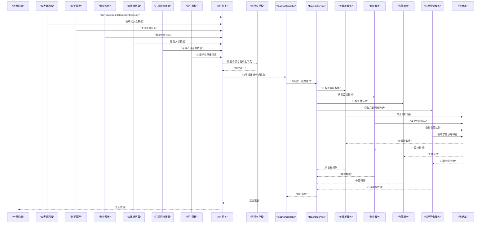

**图表来源**
- [design/16_API接口设计.md](file://design/16_API接口设计.md)
- [design/05_老师后台设计.md](file://design/05_老师后台设计.md)
- [backend/counseling-api/src/main/java/com/mindsafe/api/controller/TeacherController.java](file://backend/counseling-api/src/main/java/com/mindsafe/api/controller/TeacherController.java)
- [backend/counseling-service/src/main/java/com/mindsafe/service/teacher/TeacherService.java](file://backend/counseling-service/src/main/java/com/mindsafe/service/teacher/TeacherService.java)

章节来源
- [design/05_老师后台设计.md](file://design/05_老师后台设计.md)
- [design/16_API接口设计.md](file://design/16_API接口设计.md)

### 仪表盘面板功能
- **功能特性**
  - 实时数据展示：关键指标实时监控和动态更新
  - 多维度分析：按时间、班级、年级等维度进行数据统计
  - 可视化图表：折线图、柱状图、饼图等丰富的图表展示
  - 自定义配置：支持用户自定义显示内容和布局
- **核心流程**
  - 数据聚合：从多个数据源收集指标数据
  - 实时计算：动态计算统计指标和趋势分析
  - 缓存优化：使用缓存提升数据加载速度
  - 自动刷新：定时更新数据保持最新状态

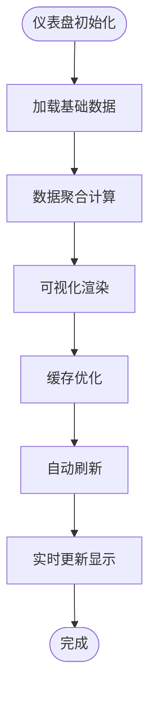

**图表来源**
- [frontend/teacher-web/src/pages/Dashboard.jsx](file://frontend/teacher-web/src/pages/Dashboard.jsx)
- [frontend/teacher-web/src/components/teacher/OverviewPanel.jsx](file://frontend/teacher-web/src/components/teacher/OverviewPanel.jsx)
- [backend/counseling-api/src/main/java/com/mindsafe/api/controller/TeacherController.java](file://backend/counseling-api/src/main/java/com/mindsafe/api/controller/TeacherController.java)

**更新** 新增仪表盘面板功能，提供直观的实时数据展示和分析能力。

### 告警管理中心
- **功能特性**
  - 智能告警队列：自动分类、优先级排序和智能分发
  - 告警处理：支持确认、转派、解决等完整处理流程
  - 统计分析：告警趋势分析、处理效率统计和效果评估
  - 通知推送：多渠道告警通知和状态同步
- **核心流程**
  - 告警接收：系统自动检测异常并生成告警
  - 智能分类：根据严重程度和影响范围分类
  - 自动分发：按预设规则分发给相应处理人员
  - 处理跟踪：全程跟踪告警处理状态和结果

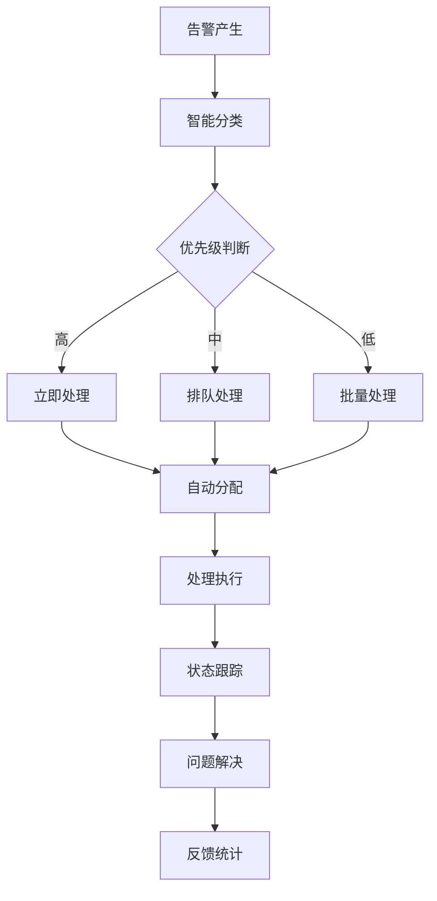

**图表来源**
- [frontend/teacher-web/src/components/teacher/AlertQueue.jsx](file://frontend/teacher-web/src/components/teacher/AlertQueue.jsx)
- [backend/counseling-api/src/main/java/com/mindsafe/api/controller/TeacherController.java](file://backend/counseling-api/src/main/java/com/mindsafe/api/controller/TeacherController.java)

**更新** 新增告警管理中心，实现了智能化的告警处理和跟踪机制。

### 监控功能
- **功能特性**
  - 系统健康检查：实时监控系统各组件运行状态
  - 性能指标：CPU、内存、磁盘、网络等关键指标监控
  - 异常检测：自动发现系统异常并发出预警
  - 日志分析：集中式日志收集和智能分析
- **核心流程**
  - 指标采集：定时采集各组件性能指标
  - 阈值判断：基于预设阈值进行异常检测
  - 告警触发：异常情况自动触发告警机制
  - 可视化展示：实时监控面板和趋势图表

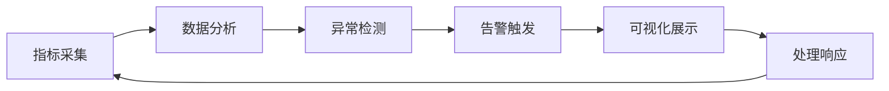

**图表来源**
- [backend/counseling-api/src/main/java/com/mindsafe/api/controller/TeacherController.java](file://backend/counseling-api/src/main/java/com/mindsafe/api/controller/TeacherController.java)
- [backend/counseling-service/src/main/java/com/mindsafe/service/teacher/TeacherService.java](file://backend/counseling-service/src/main/java/com/mindsafe/service/teacher/TeacherService.java)

**更新** 新增监控功能，提供全面的系统健康检查和性能监控能力。

### 大数据屏幕展示
- **功能特性**
  - 全屏展示：支持全屏模式的可视化数据大屏
  - 实时刷新：数据自动刷新和动态更新
  - 多指标展示：同时展示多个维度的关键指标
  - 交互操作：支持缩放、筛选和钻取分析
- **核心流程**
  - 数据准备：聚合多维度数据源
  - 渲染优化：高性能图表渲染和动画效果
  - 实时更新：WebSocket或轮询机制保持数据新鲜
  - 自适应布局：根据不同屏幕尺寸自动调整布局

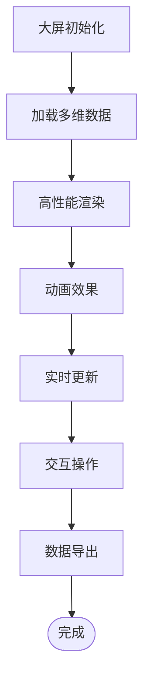

**图表来源**
- [frontend/teacher-web/src/pages/BigScreen.jsx](file://frontend/teacher-web/src/pages/BigScreen.jsx)
- [backend/counseling-api/src/main/java/com/mindsafe/api/controller/TeacherController.java](file://backend/counseling-api/src/main/java/com/mindsafe/api/controller/TeacherController.java)

**更新** 新增大数据屏幕展示功能，提供专业级的数据可视化大屏体验。

### ProfileRadarChart交互式心理画像可视化组件
- **功能特性**
  - 雷达图可视化：基于雷达图形式展示学生多维度心理特征
  - 交互操作：支持鼠标悬停查看详细数值、点击切换维度
  - 数据对比：支持多个学生心理特征对比分析
  - 动态更新：实时反映学生心理状态变化趋势
  - 颜色编码：不同心理维度使用不同颜色标识
- **核心流程**
  - 数据获取：从后端API获取学生心理特征数据
  - 图表渲染：使用ECharts或其他图表库渲染雷达图
  - 交互响应：处理用户交互事件，更新图表显示
  - 数据同步：与后端数据保持实时同步

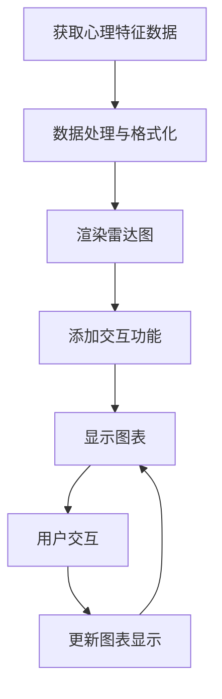

**图表来源**
- [frontend/teacher-web/src/components/teacher/ProfileRadarChart.jsx](file://frontend/teacher-web/src/components/teacher/ProfileRadarChart.jsx)
- [backend/counseling-api/src/main/java/com/mindsafe/api/controller/TeacherController.java](file://backend/counseling-api/src/main/java/com/mindsafe/api/controller/TeacherController.java)

**更新** 新增ProfileRadarChart交互式心理画像可视化组件，提供专业的心理特征雷达图展示功能。

### StudentPanel画像能力集成
- **功能特性**
  - 画像数据集成：在学生面板中集成心理画像相关数据
  - 多维度展示：支持情绪稳定性、社交能力、学习动机等多个维度
  - 趋势分析：展示学生心理特征的历史变化趋势
  - 预警提示：异常情况自动预警和干预建议
  - 交互操作：支持查看详细信息和导出分析报告
- **核心流程**
  - 数据加载：加载学生基本信息和心理画像数据
  - 图表渲染：渲染各类心理特征图表
  - 交互处理：响应用户的点击查看、筛选等操作
  - 数据更新：定时更新心理特征数据和趋势分析

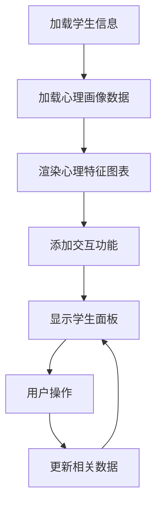

**图表来源**
- [frontend/teacher-web/src/components/teacher/StudentPanel.jsx](file://frontend/teacher-web/src/components/teacher/StudentPanel.jsx)
- [frontend/teacher-web/src/components/teacher/ProfileRadarChart.jsx](file://frontend/teacher-web/src/components/teacher/ProfileRadarChart.jsx)
- [backend/counseling-api/src/main/java/com/mindsafe/api/controller/TeacherController.java](file://backend/counseling-api/src/main/java/com/mindsafe/api/controller/TeacherController.java)

**更新** StudentPanel集成了新的画像能力，为学生心理特征分析提供了更强大的工具支持。

### 通知中心功能
- **功能特性**
  - 通知列表检索：支持按类型、优先级、时间范围筛选通知
  - 未读数量统计：实时计算并显示未读通知数量
  - 已读状态管理：支持批量标记已读和单个通知状态切换
  - 通知分类：系统通知、风险预警、任务提醒、学生动态等
- **核心流程**
  - 获取通知列表：前端请求 -> 鉴权验证 -> 通知服务查询 -> 返回分页结果
  - 计算未读数：根据用户ID和通知类型统计未读数量
  - 标记已读：更新通知状态并同步到缓存层

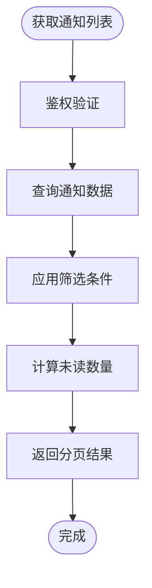

**图表来源**
- [backend/counseling-api/src/main/java/com/mindsafe/api/controller/TeacherController.java](file://backend/counseling-api/src/main/java/com/mindsafe/api/controller/TeacherController.java)
- [backend/counseling-service/src/main/java/com/mindsafe/service/notification/NotificationService.java](file://backend/counseling-service/src/main/java/com/mindsafe/service/notification/NotificationService.java)
- [backend/counseling-domain/src/main/java/com/mindsafe/domain/entity/Notification.java](file://backend/counseling-domain/src/main/java/com/mindsafe/domain/entity/Notification.java)

**章节来源**
- [backend/counseling-api/src/main/java/com/mindsafe/api/controller/TeacherController.java](file://backend/counseling-api/src/main/java/com/mindsafe/api/controller/TeacherController.java)
- [backend/counseling-service/src/main/java/com/mindsafe/service/notification/NotificationService.java](file://backend/counseling-service/src/main/java/com/mindsafe/service/notification/NotificationService.java)
- [backend/counseling-service/src/main/java/com/mindsafe/service/notification/NotificationServiceImpl.java](file://backend/counseling-service/src/main/java/com/mindsafe/service/notification/NotificationServiceImpl.java)
- [backend/counseling-domain/src/main/java/com/mindsafe/domain/entity/Notification.java](file://backend/counseling-domain/src/main/java/com/mindsafe/domain/entity/Notification.java)

### 风险识别与预警及误报处理
- **规则与模型协同**
  - 规则库：覆盖自伤、暴力、欺凌、抑郁倾向等关键词与模式匹配。
  - 模型辅助：结合语义理解与上下文，输出风险等级与解释性摘要。
- **处理流程**
  - 实时检测：会话消息到达后进入风险流水线，先规则后模型。
  - 阈值与升级：达到高阈值自动标记并推送告警至老师工作台。
  - 处置闭环：记录处置动作、回访结果与复盘意见。
- **风险事件管理**
  - 事件过滤：支持按风险等级、时间范围、学生ID等多维度筛选
  - 学生关联：建立风险事件与学生的关联关系，便于追踪和分析
  - 处置跟踪：记录风险事件的处置过程和结果
  - **误报处理**：支持标记误报、调整规则参数、优化模型判断逻辑

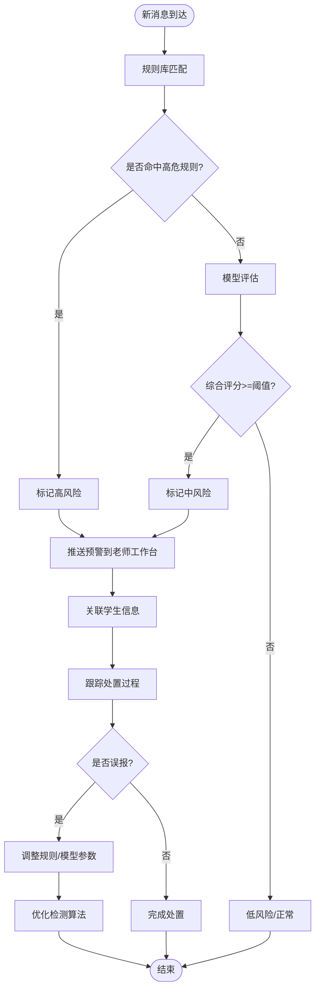

**图表来源**
- [design/04_风险识别规则库.md](file://design/04_风险识别规则库.md)
- [design/05_老师后台设计.md](file://design/05_老师后台设计.md)
- [backend/counseling-domain/src/main/java/com/mindsafe/domain/entity/RiskEvent.java](file://backend/counseling-domain/src/main/java/com/mindsafe/domain/entity/RiskEvent.java)

**更新** 新增误报处理功能，提供更精细化的风险事件处理能力。

章节来源
- [design/04_风险识别规则库.md](file://design/04_风险识别规则库.md)
- [design/05_老师后台设计.md](file://design/05_老师后台设计.md)
- [backend/counseling-domain/src/main/java/com/mindsafe/domain/entity/RiskEvent.java](file://backend/counseling-domain/src/main/java/com/mindsafe/domain/entity/RiskEvent.java)

### 申诉处理机制
- **功能特性**
  - 申诉受理：接收学生对风险判定的申诉请求
  - 人工复核：由专业人员进行申诉内容的审核和处理
  - 处理反馈：向申诉人反馈处理结果和改进措施
  - 统计分析：统计申诉处理情况和效果评估
- **处理流程**
  - 申诉提交：学生或家长通过系统提交申诉申请
  - 分配处理：系统自动分配给相应的处理人员
  - 审核处理：专业人员审核申诉内容并做出决定
  - 结果反馈：将处理结果反馈给申诉方

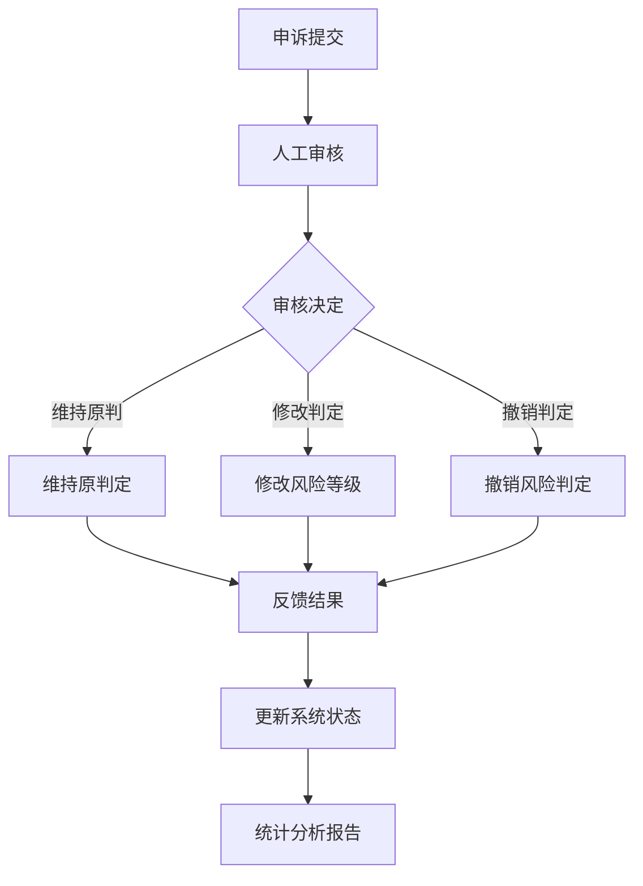

**图表来源**
- [backend/counseling-api/src/main/java/com/mindsafe/api/controller/TeacherController.java](file://backend/counseling-api/src/main/java/com/mindsafe/api/controller/TeacherController.java)
- [backend/counseling-service/src/main/java/com/mindsafe/service/teacher/TeacherService.java](file://backend/counseling-service/src/main/java/com/mindsafe/service/teacher/TeacherService.java)

**更新** 新增申诉处理机制，完善了风险判定的纠错和反馈机制。

### 学生画像分析
- **数据维度**
  - 基础信息：年龄、性别、年级、家庭背景等
  - 行为特征：会话频率、情绪变化、社交模式
  - 风险评估：历史风险事件、干预效果、发展趋势
  - 学业表现：学习成绩、课堂参与、作业完成情况
- **分析方法**
  - 多维度数据整合：从多个系统收集学生相关信息
  - 智能分析：利用AI技术进行行为模式和趋势分析
  - 可视化展示：通过图表和报告形式呈现分析结果
  - 预警机制：异常情况自动预警和推荐干预方案

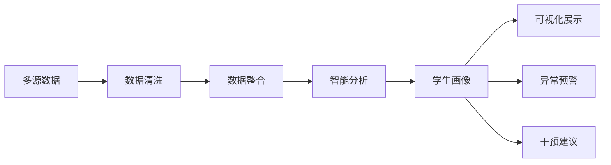

**图表来源**
- [backend/counseling-api/src/main/java/com/mindsafe/api/controller/TeacherController.java](file://backend/counseling-api/src/main/java/com/mindsafe/api/controller/TeacherController.java)
- [backend/counseling-service/src/main/java/com/mindsafe/service/teacher/TeacherService.java](file://backend/counseling-service/src/main/java/com/mindsafe/service/teacher/TeacherService.java)

**更新** 新增学生画像分析功能，为老师提供更全面的学生了解工具。

### 教师笔记记录
- **功能特性**
  - 笔记创建：支持富文本编辑、附件上传、标签分类
  - 关联管理：与特定学生、会话、风险事件建立关联
  - 版本控制：支持笔记的版本管理和历史记录
  - 协作共享：支持团队内的笔记共享和协作编辑
- **使用场景**
  - 个案记录：记录学生的具体情况和观察发现
  - 干预计划：制定和实施干预计划的跟踪记录
  - 反思总结：教学经验和专业反思的记录整理
  - 团队协作：团队成员间的沟通和工作交接

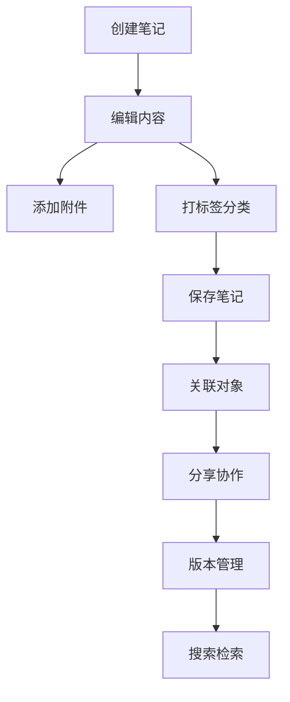

**图表来源**
- [backend/counseling-domain/src/main/java/com/mindsafe/domain/entity/TeacherNote.java](file://backend/counseling-domain/src/main/java/com/mindsafe/domain/entity/TeacherNote.java)
- [backend/counseling-api/src/main/java/com/mindsafe/api/controller/TeacherController.java](file://backend/counseling-api/src/main/java/com/mindsafe/api/controller/TeacherController.java)

**更新** 新增教师笔记记录功能，提升了老师的工作效率和知识管理能力。

### 知识库与提示词体系
- **知识组织**
  - 主题分类：情绪调节、CBT 技巧、危机干预、家校沟通等。
  - 版本管理：提示词与知识条目支持版本控制与灰度发布。
- **使用方式**
  - 会话引导：根据学生画像与阶段目标动态选择提示词模板。
  - 质量评估：沉淀优秀问答案例，反哺知识库更新。

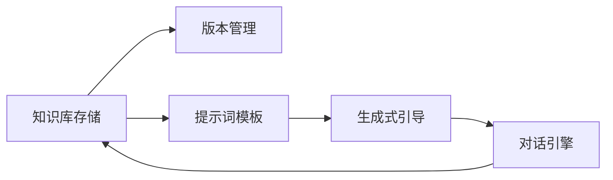

**图表来源**
- [design/02_Prompt体系详细设计.md](file://design/02_Prompt体系详细设计.md)
- [design/15_心理知识库建设方案.md](file://design/15_心理知识库建设方案.md)

章节来源
- [design/02_Prompt体系详细设计.md](file://design/02_Prompt体系详细设计.md)
- [design/15_心理知识库建设方案.md](file://design/15_心理知识库建设方案.md)

### SaaS 多学校隔离
- **隔离维度**
  - 租户 ID：贯穿所有请求头与数据表，确保跨租户不可见。
  - 资源命名：对象存储、队列、索引等按租户前缀隔离。
- **权限与审计**
  - 角色-学校-班级三级权限矩阵。
  - 全链路审计日志，支持按租户检索。

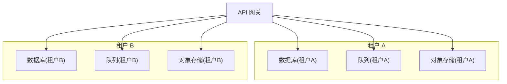

**图表来源**
- [design/07_SaaS多学校隔离架构.md](file://design/07_SaaS多学校隔离架构.md)
- [design/12_技术架构.md](file://design/12_技术架构.md)

章节来源
- [design/07_SaaS多学校隔离架构.md](file://design/07_SaaS多学校隔离架构.md)
- [design/12_技术架构.md](file://design/12_技术架构.md)

### 前端架构与页面模块
- **模块划分**
  - 工作台首页：概览指标、待办事项、风险看板、仪表板分析。
  - 仪表盘面板：实时数据展示、关键指标监控、可视化图表。
  - 告警管理：智能告警队列、优先级排序、处理跟踪。
  - 监控系统：系统健康检查、性能指标、异常检测。
  - 大数据屏幕：全屏可视化、多指标展示、交互操作。
  - 心理画像图表：雷达图可视化、交互操作、数据对比。
  - 学生面板：基础信息、历史轨迹、评估报告、画像分析。
  - 会话中心：列表、详情、导出、批注。
  - 通知中心：通知列表、未读提醒、已读管理、分类筛选。
  - 申诉管理：申诉受理、处理、反馈、统计。
  - 笔记管理：笔记创建、编辑、关联、分享。
  - 系统设置：角色与权限、学校与班级、通知配置。
- **交互原则**
  - 一致性：统一的导航、表单与反馈风格。
  - 可访问性：键盘操作、屏幕阅读器友好。

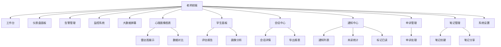

**更新** 新增仪表盘面板、告警管理、监控系统、大数据屏幕、心理画像图表和学生面板等前端模块，丰富了老师的工作台功能。

**图表来源**
- [design/17_前端架构设计.md](file://design/17_前端架构设计.md)
- [design/05_老师后台设计.md](file://design/05_老师后台设计.md)

章节来源
- [design/17_前端架构设计.md](file://design/17_前端架构设计.md)
- [design/05_老师后台设计.md](file://design/05_老师后台设计.md)

## 依赖分析
- **内部依赖**
  - 老师后台依赖会话、风险、知识库、用户与权限、租户隔离等子系统。
  - 风险识别服务同时依赖规则库与大模型编排。
  - 通知服务依赖用户服务（获取用户信息）和消息队列（异步发送通知）。
  - **TeacherService作为统一服务层，协调各个子域服务的调用**。
  - **仪表盘面板依赖数据分析服务和缓存服务**。
  - **告警管理依赖消息队列和通知服务**。
  - **监控系统依赖指标收集服务和日志服务**。
  - **心理画像服务依赖学生数据服务和AI分析服务**。
- **外部依赖**
  - 鉴权服务、审计日志、对象存储、消息队列等基础设施。

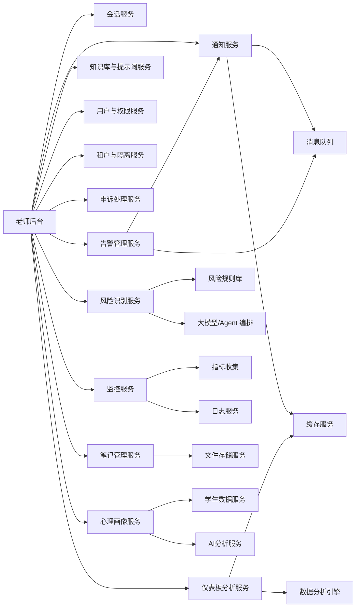

**更新** 新增仪表盘面板、告警管理、监控服务、心理画像服务等及其依赖关系。

**图表来源**
- [design/12_技术架构.md](file://design/12_技术架构.md)
- [design/05_老师后台设计.md](file://design/05_老师后台设计.md)
- [backend/counseling-service/src/main/java/com/mindsafe/service/teacher/TeacherService.java](file://backend/counseling-service/src/main/java/com/mindsafe/service/teacher/TeacherService.java)

章节来源
- [design/12_技术架构.md](file://design/12_技术架构.md)
- [design/05_老师后台设计.md](file://design/05_老师后台设计.md)

## 性能考虑
- **会话查询优化**：合理索引、分页游标、热点数据缓存。
- **风险识别流水线**：规则前置、模型异步降级、批量合并上报。
- **导出任务**：异步化与分片写入，避免阻塞主流程。
- **多租户隔离**：连接池与索引按租户维度优化，避免跨租户扫描。
- **通知服务优化**：未读数量缓存、批量操作支持、分页查询优化。
- **仪表板分析优化**：数据预聚合、缓存策略、异步计算。
- **申诉处理优化**：状态机管理、并发控制、事务保证。
- **笔记管理优化**：全文检索、版本差异存储、增量更新。
- **仪表盘面板优化**：实时数据缓存、增量更新、图表懒加载。
- **告警管理优化**：队列分区、优先级调度、批量处理。
- **监控系统优化**：指标采样、压缩存储、分布式收集。
- **大数据屏幕优化**：数据虚拟化、按需加载、GPU加速渲染。
- **心理画像图表优化**：数据缓存、图表渲染优化、交互响应优化。
- **学生面板优化**：数据预加载、懒加载、内存管理优化。

**更新** 新增仪表盘面板、告警管理、监控系统、大数据屏幕、心理画像图表、学生面板的性能优化策略。

## 故障排查指南
- **常见问题定位**
  - 鉴权失败：检查令牌有效期、租户上下文与角色权限。
  - 会话加载慢：关注数据库慢查询、缓存命中率与网络延迟。
  - 风险误报/漏报：核对规则命中情况与模型输入上下文。
  - 通知延迟或丢失：检查消息队列状态、缓存同步情况和数据库写入状态。
  - **仪表板数据异常：检查数据源连接、计算逻辑和缓存状态**。
  - **申诉处理卡顿：检查状态转换逻辑、并发控制和事务状态**。
  - **笔记同步问题：检查文件存储状态、版本冲突和同步机制**。
  - **仪表盘面板加载缓慢：检查数据聚合性能、缓存命中率和网络延迟**。
  - **告警队列堆积：检查处理线程池、消息消费速度和异常处理**。
  - **监控系统异常：检查指标采集器、数据存储和查询性能**。
  - **大数据屏幕卡顿：检查数据量大小、渲染性能和内存占用**。
  - **心理画像图表异常：检查数据格式、图表库配置和渲染性能**。
  - **学生面板加载问题：检查数据加载顺序、缓存策略和内存使用**。
- **排障手段**
  - 开启调试日志与审计追踪，按会话 ID 串联全链路。
  - 使用灰度开关回滚提示词或规则变更。
  - 针对导出任务监控队列堆积与磁盘 IO。
  - 监控通知服务的队列积压、缓存一致性和数据库连接池状态。
  - **监控仪表板服务的计算性能、数据准确性和缓存命中率**。
  - **监控申诉处理的状态流转、并发访问和事务一致性**。
  - **监控笔记服务的文件存储、版本管理和同步状态**。
  - **监控仪表盘面板的数据加载时间、缓存命中率和内存使用**。
  - **监控告警队列的处理延迟、错误率和吞吐量**。
  - **监控监控系统的指标采集成功率、存储容量和查询响应时间**。
  - **监控大数据屏幕的渲染帧率、数据更新频率和内存占用**。
  - **监控心理画像图表的数据准确性、渲染性能和交互响应**。
  - **监控学生面板的数据完整性、加载性能和内存占用**。

**更新** 新增仪表盘面板、告警管理、监控系统、大数据屏幕、心理画像图表、学生面板相关的故障排查方法和监控指标。

章节来源
- [design/16_API接口设计.md](file://design/16_API接口设计.md)
- [design/05_老师后台设计.md](file://design/05_老师后台设计.md)

## 结论
老师后台设计围绕"安全合规、高效易用、可扩展"的目标，构建了以会话为中心、风险为牵引、知识为支撑的服务体系。**通过TeacherController的大幅增强和TeacherService的完整实现，系统新增了仪表板分析、警报管理、监控功能和大数据屏幕展示等核心功能，显著提升了老师的工作台体验和工作效率**。通过 SaaS 多学校隔离与完善的 API 治理，系统在满足教育场景复杂需求的同时，具备良好的演进空间。**特别新增的ProfileRadarChart交互式心理画像可视化组件和StudentPanel的画像能力集成，为教育工作者提供了专业的心理特征分析工具，进一步提升了学生心理健康管理的科学性和有效性**。

**更新** 本次更新通过TeacherController和TeacherService的增强，大幅完善了老师后台的功能体系，新增了仪表盘面板、告警管理、监控功能和大数据屏幕展示等核心能力，**特别是ProfileRadarChart和StudentPanel的画像能力集成，为心理特征分析提供了专业的可视化支持**，为教育工作者提供了更加专业和高效的工具支持。

## 附录
- **术语说明**
  - 租户：指代学校或机构，作为数据与权限隔离的最小单位。
  - 风险等级：低、中、高三级，对应不同处置策略。
  - 提示词：用于引导对话与生成内容的结构化指令集合。
  - 通知类型：系统通知、风险预警、任务提醒、学生动态等。
  - 未读计数：实时计算的未读通知数量，支持缓存优化。
  - **仪表板分析：整合多维度数据的可视化分析功能**。
  - **申诉处理：学生对风险判定的异议处理和纠正机制**。
  - **误报处理：风险识别中的错误判定修正和优化机制**。
  - **学生画像：基于多源数据的学生综合分析模型**。
  - **教师笔记：教师对学生情况的记录和管理工具**。
  - **仪表盘面板：实时数据展示和关键指标监控的可视化界面**。
  - **告警管理：智能告警队列处理和优先级排序的管理系统**。
  - **监控系统：系统健康检查和性能指标监控的综合平台**。
  - **大数据屏幕：全屏可视化数据展示的专业级大屏**。
  - **ProfileRadarChart：基于雷达图形式的学生心理特征可视化组件**。
  - **心理画像：学生多维度心理特征的量化分析和可视化展示**。
  - **学生面板：集成心理画像能力的学生信息展示和管理界面**。

**更新** 新增仪表盘面板、告警管理、监控系统、大数据屏幕、ProfileRadarChart、心理画像、学生面板等相关术语定义。
