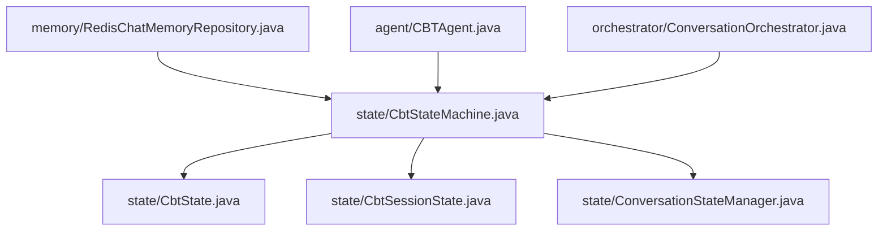
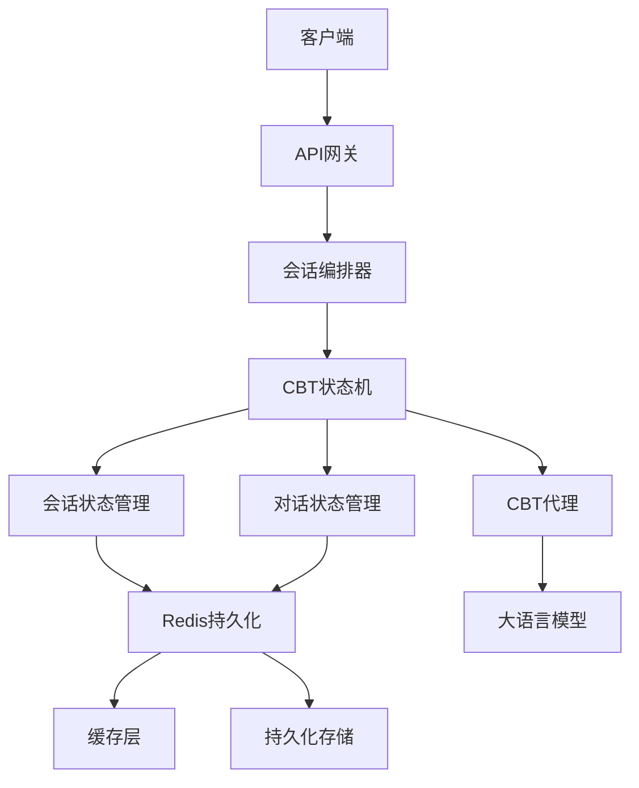
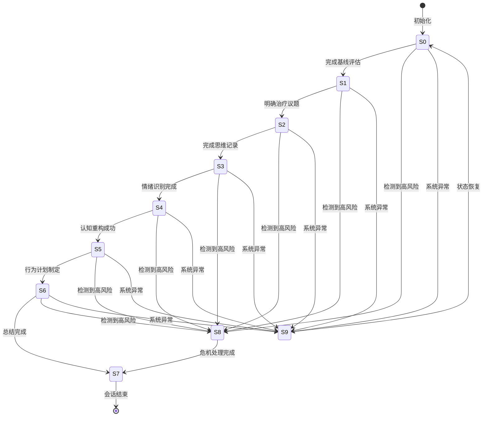
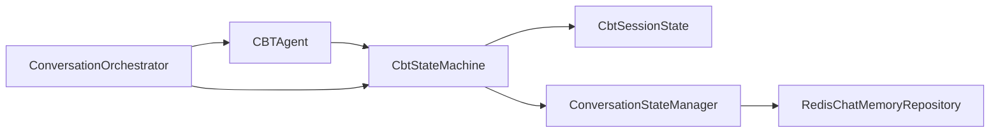

# 认知行为疗法工作流

<cite>
**本文引用的文件**
- [CbtSessionState.java](file://backend/counseling-ai/src/main/java/com/mindsafe/ai/state/CbtSessionState.java)
- [ConversationStateManager.java](file://backend/counseling-ai/src/main/java/com/mindsafe/ai/state/ConversationStateManager.java)
- [CbtStateMachine.java](file://backend/counseling-ai/src/main/java/com/mindsafe/ai/state/CbtStateMachine.java)
- [CbtState.java](file://backend/counseling-ai/src/main/java/com/mindsafe/ai/state/CbtState.java)
- [RedisChatMemoryRepository.java](file://backend/counseling-ai/src/main/java/com/mindsafe/ai/memory/RedisChatMemoryRepository.java)
- [CBTAgent.java](file://backend/counseling-ai/src/main/java/com/mindsafe/ai/agent/CBTAgent.java)
- [ConversationOrchestrator.java](file://backend/counseling-ai/src/main/java/com/mindsafe/ai/orchestrator/ConversationOrchestrator.java)
</cite>

## 更新摘要
**所做更改**
- 新增CBT状态机实现章节，详细说明S0-S9的10个状态工作流
- 添加CbtSessionState会话状态管理组件说明
- 新增ConversationStateManager对话状态管理器详解
- 补充Redis持久化支持的技术实现
- 更新状态转换流程图和架构图以反映新的状态机设计

## 目录
1. [简介](#简介)
2. [项目结构](#项目结构)
3. [核心组件](#核心组件)
4. [架构总览](#架构总览)
5. [详细组件分析](#详细组件分析)
6. [依赖分析](#依赖分析)
7. [性能考虑](#性能考虑)
8. [故障排查指南](#故障排查指南)
9. [结论](#结论)
10. [附录](#附录)

## 简介
本技术文档围绕认知行为疗法（CBT）工作流，系统化阐述治疗框架的核心概念与实现原理，包括思维记录、情绪识别、认知重构等关键步骤。文档重点说明工作流的10个状态（S0-S9）状态机实现、会话状态管理和对话状态管理，并提供可操作的扩展方法，用于新增CBT技术模块与自定义治疗协议。为便于理解，文档包含完整的状态转换图、数据模型定义与API接口说明，并给出代码级示例路径以便快速定位实现细节。

## 项目结构
仓库采用分层架构组织，CBT状态机相关代码主要集中在state目录下：
- state：CBT状态机核心实现，包含状态定义、状态管理和会话状态
- agent：AI代理层，包含CBT专用代理
- memory：持久化存储，支持Redis缓存
- orchestrator：会话编排器，协调各个组件

**图表来源**
- [CbtStateMachine.java](file://backend/counseling-ai/src/main/java/com/mindsafe/ai/state/CbtStateMachine.java)
- [CbtState.java](file://backend/counseling-ai/src/main/java/com/mindsafe/ai/state/CbtState.java)
- [CbtSessionState.java](file://backend/counseling-ai/src/main/java/com/mindsafe/ai/state/CbtSessionState.java)
- [ConversationStateManager.java](file://backend/counseling-ai/src/main/java/com/mindsafe/ai/state/ConversationStateManager.java)
- [RedisChatMemoryRepository.java](file://backend/counseling-ai/src/main/java/com/mindsafe/ai/memory/RedisChatMemoryRepository.java)
- [CBTAgent.java](file://backend/counseling-ai/src/main/java/com/mindsafe/ai/agent/CBTAgent.java)
- [ConversationOrchestrator.java](file://backend/counseling-ai/src/main/java/com/mindsafe/ai/orchestrator/ConversationOrchestrator.java)

## 核心组件
- **CBT状态机（CbtStateMachine）**
  - 职责：管理S0-S9共10个状态的完整生命周期，驱动CBT治疗流程
  - 关键能力：状态转换验证、条件判断、异常处理、审计日志
- **会话状态管理（CbtSessionState）**
  - 职责：维护单个CBT会话的完整状态信息，包括当前状态、历史交互、评估结果
  - 关键能力：状态持久化、并发安全、版本控制、快照恢复
- **对话状态管理器（ConversationStateManager）**
  - 职责：协调多个会话的状态同步，提供跨会话的状态查询和管理
  - 关键能力：状态广播、事件监听、批量操作、一致性保证
- **Redis持久化存储**
  - 职责：提供高性能的会话状态缓存和持久化
  - 关键能力：自动过期、事务支持、集群模式、数据备份

**章节来源**
- [CbtStateMachine.java](file://backend/counseling-ai/src/main/java/com/mindsafe/ai/state/CbtStateMachine.java)
- [CbtSessionState.java](file://backend/counseling-ai/src/main/java/com/mindsafe/ai/state/CbtSessionState.java)
- [ConversationStateManager.java](file://backend/counseling-ai/src/main/java/com/mindsafe/ai/state/ConversationStateManager.java)
- [RedisChatMemoryRepository.java](file://backend/counseling-ai/src/main/java/com/mindsafe/ai/memory/RedisChatMemoryRepository.java)

## 架构总览
下图展示CBT状态机在系统中的整体架构，包含10个状态的工作流程和Redis持久化支持：

**图表来源**
- [ConversationOrchestrator.java](file://backend/counseling-ai/src/main/java/com/mindsafe/ai/orchestrator/ConversationOrchestrator.java)
- [CbtStateMachine.java](file://backend/counseling-ai/src/main/java/com/mindsafe/ai/state/CbtStateMachine.java)
- [CbtSessionState.java](file://backend/counseling-ai/src/main/java/com/mindsafe/ai/state/CbtSessionState.java)
- [ConversationStateManager.java](file://backend/counseling-ai/src/main/java/com/mindsafe/ai/state/ConversationStateManager.java)
- [RedisChatMemoryRepository.java](file://backend/counseling-ai/src/main/java/com/mindsafe/ai/memory/RedisChatMemoryRepository.java)
- [CBTAgent.java](file://backend/counseling-ai/src/main/java/com/mindsafe/ai/agent/CBTAgent.java)

## 详细组件分析

### CBT状态机实现（S0-S9十状态工作流）
CBT状态机实现了完整的10个状态工作流，每个状态对应特定的治疗阶段：

- **S0：初始化状态**
  - 功能：建立会话、加载用户画像、进行基线评估
  - 触发条件：新会话创建
  - 转换规则：完成评估后进入S1探索状态

- **S1：探索状态**
  - 功能：开放式提问、澄清目标、确认动机
  - 触发条件：用户回应初始问题
  - 转换规则：明确议题后进入S2思维记录状态

- **S2：思维记录状态**
  - 功能：捕捉情境-想法-情绪-行为链条
  - 触发条件：用户描述具体情境
  - 转换规则：完成思维记录后进入S3情绪识别状态

- **S3：情绪识别状态**
  - 功能：标注情绪类型与强度、验证一致性
  - 触发条件：识别到情绪表达
  - 转换规则：情绪确认后进入S4认知重构状态

- **S4：认知重构状态**
  - 功能：识别偏差、生成替代性解释、证据检验
  - 触发条件：发现认知偏差
  - 转换规则：重构完成后进入S5行为实验状态

- **S5：行为实验状态**
  - 功能：制定小步行动、设定衡量指标
  - 触发条件：认知重构成功
  - 转换规则：计划制定后进入S6总结回顾状态

- **S6：总结回顾状态**
  - 功能：巩固学习、布置作业、预约下次
  - 触发条件：行为计划确定
  - 转换规则：总结完成后进入S7结束状态

- **S7：结束状态**
  - 功能：保存会话、输出摘要、触发后续任务
  - 触发条件：治疗目标达成
  - 转换规则：自然结束或主动终止

- **S8：危机干预状态**
  - 功能：高风险信号处理、紧急资源提供
  - 触发条件：检测到自杀风险或严重心理危机
  - 转换规则：危机处理后进入S7结束状态

- **S9：异常处理状态**
  - 功能：系统错误恢复、状态回滚、用户引导
  - 触发条件：系统异常或状态不一致
  - 转换规则：恢复后回到原状态或S0初始化

**图表来源**
- [CbtStateMachine.java](file://backend/counseling-ai/src/main/java/com/mindsafe/ai/state/CbtStateMachine.java)
- [CbtState.java](file://backend/counseling-ai/src/main/java/com/mindsafe/ai/state/CbtState.java)

**章节来源**
- [CbtStateMachine.java](file://backend/counseling-ai/src/main/java/com/mindsafe/ai/state/CbtStateMachine.java)
- [CbtState.java](file://backend/counseling-ai/src/main/java/com/mindsafe/ai/state/CbtState.java)

### 会话状态管理（CbtSessionState）
CbtSessionState负责维护单个CBT会话的完整状态信息：

- **状态属性**
  - sessionId：唯一会话标识
  - currentState：当前状态（S0-S9）
  - previousState：前一个状态（用于回滚）
  - sessionData：会话数据（用户输入、AI响应、评估结果）
  - metadata：元数据（时间戳、设备信息、IP地址）

- **状态操作方法**
  - transitionTo(newState)：状态转换，包含验证和持久化
  - rollback()：状态回滚，恢复到上一个状态
  - snapshot()：创建状态快照，用于调试和恢复
  - merge(otherState)：合并其他会话状态

- **并发安全机制**
  - 使用分布式锁防止竞态条件
  - 乐观锁版本号确保数据一致性
  - 异步持久化避免阻塞主流程

**章节来源**
- [CbtSessionState.java](file://backend/counseling-ai/src/main/java/com/mindsafe/ai/state/CbtSessionState.java)

### 对话状态管理器（ConversationStateManager）
ConversationStateManager提供跨会话的状态管理能力：

- **核心功能**
  - 会话注册：新会话创建时自动注册
  - 状态查询：根据会话ID获取当前状态
  - 批量操作：同时管理多个会话状态
  - 事件监听：订阅状态变更事件

- **持久化策略**
  - Redis缓存：热点会话状态实时缓存
  - 数据库持久化：重要状态定期持久化
  - 增量更新：只更新变化的字段

- **监控和告警**
  - 状态分布统计：各状态会话数量
  - 异常检测：长时间停留同一状态
  - 性能监控：状态转换耗时统计

**章节来源**
- [ConversationStateManager.java](file://backend/counseling-ai/src/main/java/com/mindsafe/ai/state/ConversationStateManager.java)

### Redis持久化支持
RedisChatMemoryRepository提供高性能的会话状态持久化：

- **数据结构设计**
  - Hash结构存储会话状态字段
  - String结构存储会话元数据
  - List结构存储会话历史消息
  - Set结构存储活跃会话索引

- **缓存策略**
  - TTL设置：会话过期时间（默认30分钟）
  - 热键保护：高频访问会话特殊处理
  - 内存优化：压缩存储、淘汰策略

- **数据一致性**
  - 事务支持：多操作原子性保证
  - 重试机制：网络异常自动重试
  - 降级策略：Redis不可用时降级到内存

**章节来源**
- [RedisChatMemoryRepository.java](file://backend/counseling-ai/src/main/java/com/mindsafe/ai/memory/RedisChatMemoryRepository.java)

### CBT代理集成
CBTAgent将状态机与AI代理能力集成：

- **状态感知提示词**
  - 根据当前状态动态选择提示词模板
  - 注入会话上下文和用户画像信息
  - 生成符合CBT原则的回复内容

- **意图识别和状态决策**
  - 分析用户输入意图，推荐下一个状态
  - 结合风险评估决定是否需要危机干预
  - 基于对话质量调整推进速度

- **安全检查和合规性**
  - 敏感内容检测和过滤
  - 隐私信息脱敏处理
  - 伦理准则遵循检查

**章节来源**
- [CBTAgent.java](file://backend/counseling-ai/src/main/java/com/mindsafe/ai/agent/CBTAgent.java)

## 依赖分析
- **内部依赖关系**
  - CbtStateMachine依赖CbtSessionState和ConversationStateManager
  - ConversationStateManager依赖RedisChatMemoryRepository
  - CBTAgent依赖CbtStateMachine和提示词引擎
  - ConversationOrchestrator协调所有组件

- **外部依赖**
  - Redis：高性能缓存和持久化
  - 大语言模型服务：AI对话生成
  - 监控系统：状态变更审计和性能追踪

- **耦合度分析**
  - 低耦合：通过接口抽象降低组件间依赖
  - 高内聚：相关功能集中在相应组件中
  - 可扩展：插件化设计支持新功能接入

**图表来源**
- [CbtStateMachine.java](file://backend/counseling-ai/src/main/java/com/mindsafe/ai/state/CbtStateMachine.java)
- [CbtSessionState.java](file://backend/counseling-ai/src/main/java/com/mindsafe/ai/state/CbtSessionState.java)
- [ConversationStateManager.java](file://backend/counseling-ai/src/main/java/com/mindsafe/ai/state/ConversationStateManager.java)
- [RedisChatMemoryRepository.java](file://backend/counseling-ai/src/main/java/com/mindsafe/ai/memory/RedisChatMemoryRepository.java)
- [CBTAgent.java](file://backend/counseling-ai/src/main/java/com/mindsafe/ai/agent/CBTAgent.java)
- [ConversationOrchestrator.java](file://backend/counseling-ai/src/main/java/com/mindsafe/ai/orchestrator/ConversationOrchestrator.java)

**章节来源**
- [ConversationOrchestrator.java](file://backend/counseling-ai/src/main/java/com/mindsafe/ai/orchestrator/ConversationOrchestrator.java)

## 性能考虑
- **状态转换优化**
  - 预编译状态转换规则，减少运行时计算
  - 批量状态更新，减少数据库往返次数
  - 异步状态持久化，避免阻塞主流程

- **缓存策略**
  - 多级缓存：本地缓存 + Redis缓存
  - 热点数据优先：常用状态和模板预加载
  - 智能失效：基于访问频率的动态调整

- **并发处理**
  - 无锁数据结构：提高并发读写性能
  - 分片存储：按会话ID哈希分片
  - 连接池管理：合理配置Redis连接数

## 故障排查指南
- **常见问题诊断**
  - 状态卡死：检查状态转换条件和超时设置
  - 数据不一致：查看Redis和数据库同步状态
  - 性能下降：分析慢查询和内存使用情况

- **监控指标**
  - 状态转换成功率：应高于99.9%
  - 平均响应时间：状态转换应小于100ms
  - 内存使用率：Redis内存使用应低于80%

- **恢复策略**
  - 自动重试：网络异常自动重试3次
  - 状态回滚：数据异常时自动回滚到上一状态
  - 降级服务：Redis不可用时切换到内存模式

## 结论
本方案通过实现S0-S9的10个状态工作流，构建了完整的CBT状态机系统。结合CbtSessionState会话状态管理和ConversationStateManager对话状态管理，以及Redis持久化支持，提供了高性能、高可用的CBT治疗框架。该设计既保证了CBT治疗的专业性和安全性，又具备良好的扩展性和可维护性。建议在生产环境中充分测试各种边界情况，并建立完善的监控和告警机制。

## 附录
- **术语表**
  - 状态机：管理对象状态及其转换的数学模型
  - 会话状态：单次对话过程中的所有相关信息
  - 持久化：将内存数据保存到持久存储介质
  - 分布式锁：在多进程环境下保证数据一致性的机制

- **参考资源**
  - CBT状态机设计：详细的10个状态定义和转换规则
  - Redis最佳实践：高性能缓存和持久化配置
  - 并发编程指南：多线程环境下的状态管理

**章节来源**
- [CbtStateMachine.java](file://backend/counseling-ai/src/main/java/com/mindsafe/ai/state/CbtStateMachine.java)
- [CbtSessionState.java](file://backend/counseling-ai/src/main/java/com/mindsafe/ai/state/CbtSessionState.java)
- [ConversationStateManager.java](file://backend/counseling-ai/src/main/java/com/mindsafe/ai/state/ConversationStateManager.java)
- [RedisChatMemoryRepository.java](file://backend/counseling-ai/src/main/java/com/mindsafe/ai/memory/RedisChatMemoryRepository.java)
- [CBTAgent.java](file://backend/counseling-ai/src/main/java/com/mindsafe/ai/agent/CBTAgent.java)
- [ConversationOrchestrator.java](file://backend/counseling-ai/src/main/java/com/mindsafe/ai/orchestrator/ConversationOrchestrator.java)
