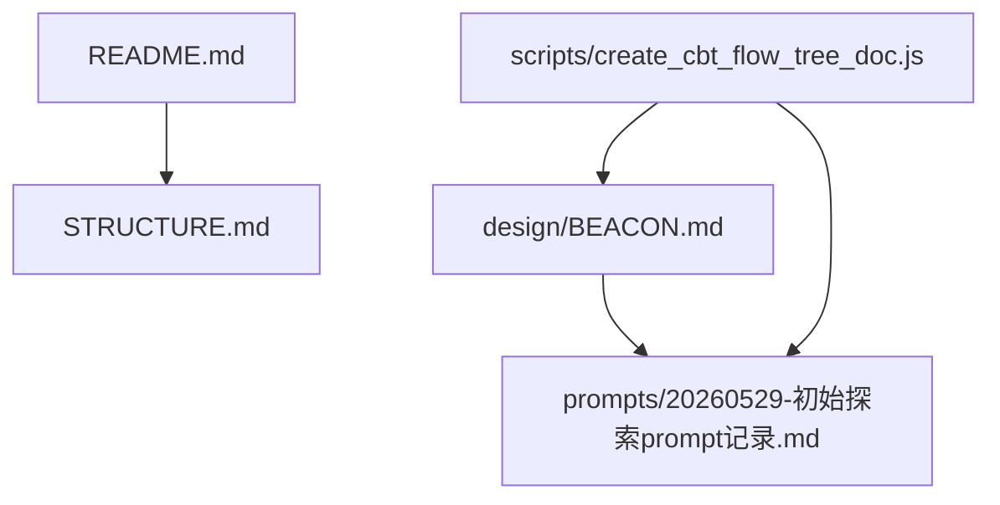
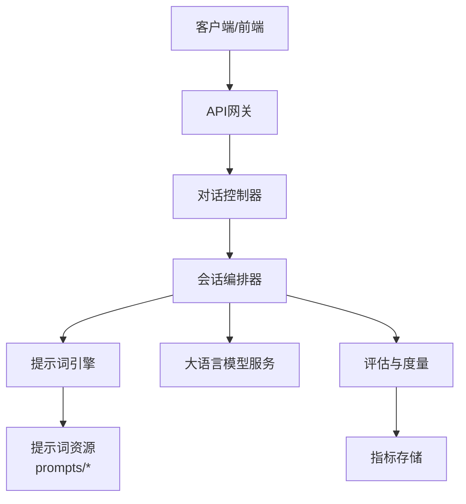
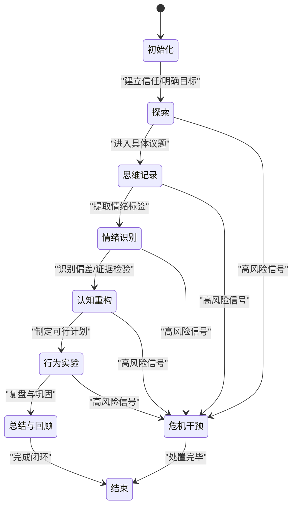
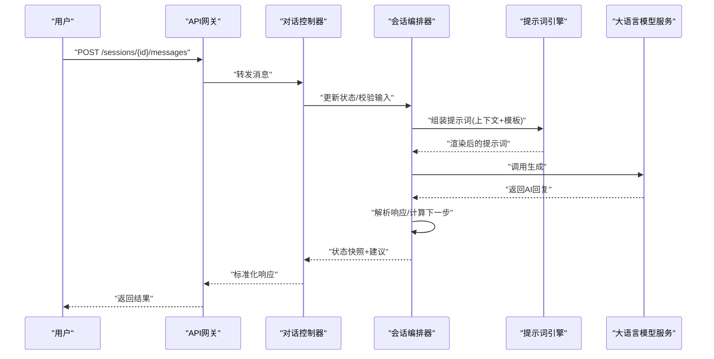
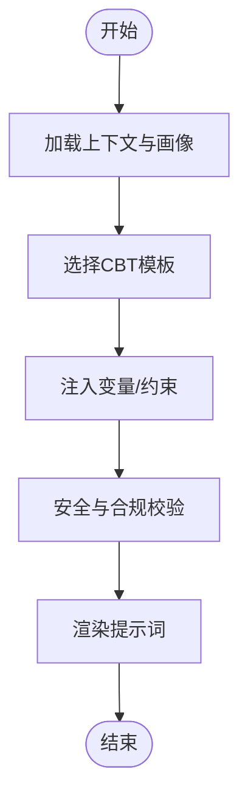
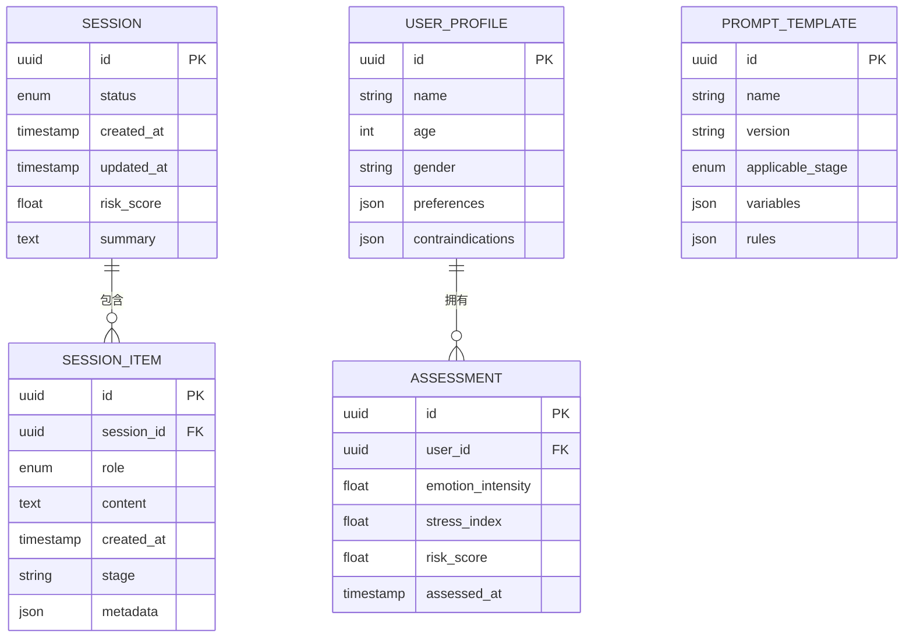
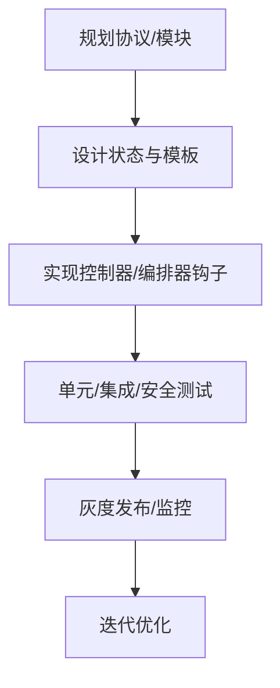
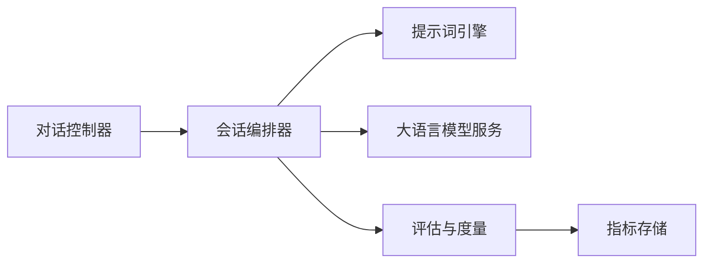

# 认知行为疗法工作流

<cite>
**本文引用的文件**   
- [README.md](file://README.md)
- [STRUCTURE.md](file://STRUCTURE.md)
- [BEACON.md](file://design/BEACON.md)
- [20260529-初始探索prompt记录.md](file://prompts/20260529-初始探索prompt记录.md)
- [create_cbt_flow_tree_doc.js](file://scripts/create_cbt_flow_tree_doc.js)
</cite>

## 目录
1. [简介](#简介)
2. [项目结构](#项目结构)
3. [核心组件](#核心组件)
4. [架构总览](#架构总览)
5. [详细组件分析](#详细组件分析)
6. [依赖分析](#依赖分析)
7. [性能考虑](#性能考虑)
8. [故障排查指南](#故障排查指南)
9. [结论](#结论)
10. [附录](#附录)

## 简介
本技术文档围绕认知行为疗法（CBT）工作流，系统化阐述治疗框架的核心概念与实现原理，包括思维记录、情绪识别、认知重构等关键步骤。文档重点说明工作流的状态管理、流程控制与决策逻辑，并提供可操作的扩展方法，用于新增CBT技术模块与自定义治疗协议。为便于理解，文档包含流程图、数据模型定义与API接口说明，并给出代码级示例路径以便快速定位实现细节。

## 项目结构
仓库采用“设计-提示词-脚本”分层组织：
- design：总体设计与蓝图（如BEACON）
- prompts：对话提示词与引导策略
- scripts：生成文档与流程树的工具脚本
- src/tests：测试与集成用例（当前为空或占位）
- README/STRUCTURE：项目概览与结构说明

图表来源
- [README.md](file://README.md)
- [STRUCTURE.md](file://STRUCTURE.md)
- [BEACON.md](file://design/BEACON.md)
- [20260529-初始探索prompt记录.md](file://prompts/20260529-初始探索prompt记录.md)
- [create_cbt_flow_tree_doc.js](file://scripts/create_cbt_flow_tree_doc.js)

章节来源
- [README.md](file://README.md)
- [STRUCTURE.md](file://STRUCTURE.md)

## 核心组件
- 会话编排器（Session Orchestrator）
  - 职责：维护会话状态机、驱动阶段流转、协调提示词与外部服务
  - 关键能力：状态持久化、错误恢复、超时与重试、审计日志
- 提示词引擎（Prompt Engine）
  - 职责：组装上下文、注入用户画像与历史、选择模板、渲染最终提示
  - 关键能力：模板库、变量替换、安全过滤、版本化
- 对话控制器（Dialogue Controller）
  - 职责：接收用户输入、调用LLM、解析响应、更新状态、触发下一步
  - 关键能力：输入校验、意图识别、响应结构化、中断处理
- 评估与度量（Assessment & Metrics）
  - 职责：采集指标（停留时长、完成率、风险信号）、输出报告
  - 关键能力：事件埋点、阈值告警、隐私脱敏

章节来源
- [BEACON.md](file://design/BEACON.md)
- [20260529-初始探索prompt记录.md](file://prompts/20260529-初始探索prompt记录.md)

## 架构总览
下图展示CBT工作流在系统中的整体交互关系：前端/客户端通过API与服务端交互；服务端由对话控制器、会话编排器、提示词引擎组成；提示词引擎读取提示词资源；会话编排器驱动状态机并调用LLM；评估与度量模块收集运行指标。

图表来源
- [BEACON.md](file://design/BEACON.md)
- [20260529-初始探索prompt记录.md](file://prompts/20260529-初始探索prompt记录.md)
- [create_cbt_flow_tree_doc.js](file://scripts/create_cbt_flow_tree_doc.js)

## 详细组件分析

### CBT会话状态机与流程控制
- 状态定义
  - 初始化：建立会话、加载用户画像与基线评估
  - 探索：开放式提问、澄清目标、确认动机
  - 思维记录：捕捉情境-想法-情绪-行为链条
  - 情绪识别：标注情绪类型与强度、验证一致性
  - 认知重构：识别偏差、生成替代性解释、证据检验
  - 行为实验：制定小步行动、设定衡量指标
  - 总结与回顾：巩固学习、布置作业、预约下次
  - 结束：保存会话、输出摘要、触发后续任务
- 流转规则
  - 条件跳转：依据风险评估、用户反馈、完成度判定
  - 回退机制：当信息不足时回到上一阶段补充
  - 异常分支：高风险信号直接转入危机干预流程
- 决策逻辑
  - 基于规则的优先级：安全优先 > 目标对齐 > 效率
  - 动态权重：根据用户参与度调整推进速度

图表来源
- [BEACON.md](file://design/BEACON.md)
- [20260529-初始探索prompt记录.md](file://prompts/20260529-初始探索prompt记录.md)

章节来源
- [BEACON.md](file://design/BEACON.md)
- [20260529-初始探索prompt记录.md](file://prompts/20260529-初始探索prompt记录.md)

### 对话控制器与API接口
- 入口与路由
  - POST /sessions：创建会话，返回会话ID
  - POST /sessions/{id}/messages：发送消息，返回AI回复与下一步建议
  - GET /sessions/{id}：查询会话状态与进度
  - DELETE /sessions/{id}：终止会话并归档
- 请求/响应要点
  - 请求体包含：用户文本、可选元数据（时间戳、设备、上下文片段）
  - 响应体包含：AI回复、状态快照、风险提示、下一步动作
- 错误码与重试
  - 4xx：参数校验失败、权限不足
  - 5xx：上游服务不可用、超时
  - 幂等键：支持重复提交去重

图表来源
- [BEACON.md](file://design/BEACON.md)
- [20260529-初始探索prompt记录.md](file://prompts/20260529-初始探索prompt记录.md)

章节来源
- [BEACON.md](file://design/BEACON.md)

### 提示词引擎与CBT模板
- 模板分类
  - 探索类：开放式问题、动机访谈技巧
  - 记录类：思维记录表字段引导
  - 重构类：认知偏差清单、证据检验步骤
  - 行为类：行动计划、量化指标
- 变量注入
  - 用户画像：年龄、性别、文化背景
  - 会话上下文：最近N轮对话摘要、已识别主题
  - 评估结果：情绪强度、风险等级、完成度
- 安全与合规
  - 敏感词过滤、最小化采集、可撤回同意
  - 提示词版本化与灰度发布

图表来源
- [20260529-初始探索prompt记录.md](file://prompts/20260529-初始探索prompt记录.md)

章节来源
- [20260529-初始探索prompt记录.md](file://prompts/20260529-初始探索prompt记录.md)

### 数据模型定义
- 会话与会话项
  - 会话：会话ID、状态、创建/更新时间、风险等级、摘要
  - 会话项：角色（用户/AI）、内容、时间戳、关联阶段、元数据
- 用户画像与评估
  - 画像：人口学信息、偏好、禁忌话题
  - 评估：情绪量表得分、压力指数、风险评分
- 提示词与模板
  - 模板：ID、名称、版本、适用阶段、变量列表、校验规则
  - 实例：模板ID、渲染参数、生效范围、审计追踪

图表来源
- [BEACON.md](file://design/BEACON.md)
- [20260529-初始探索prompt记录.md](file://prompts/20260529-初始探索prompt记录.md)

章节来源
- [BEACON.md](file://design/BEACON.md)

### 扩展新CBT技术与自定义协议
- 新增技术模块
  - 定义阶段与状态转换规则
  - 编写对应提示词模板与变量规范
  - 接入对话控制器路由与编排器钩子
- 自定义治疗协议
  - 组合多个技术模块形成协议
  - 配置条件跳转与回退策略
  - 设置评估阈值与告警规则
- 验证与回归
  - 单元测试：模板渲染、状态机边界
  - 集成测试：端到端对话流程
  - 安全测试：敏感信息与越权访问

图表来源
- [create_cbt_flow_tree_doc.js](file://scripts/create_cbt_flow_tree_doc.js)
- [BEACON.md](file://design/BEACON.md)

章节来源
- [create_cbt_flow_tree_doc.js](file://scripts/create_cbt_flow_tree_doc.js)
- [BEACON.md](file://design/BEACON.md)

## 依赖分析
- 内部依赖
  - 对话控制器依赖会话编排器与提示词引擎
  - 会话编排器依赖提示词引擎与大语言模型服务
  - 评估与度量依赖会话编排器的状态变更事件
- 外部依赖
  - 大语言模型服务：生成式对话、结构化解析
  - 指标存储：时序数据库或对象存储
- 耦合与内聚
  - 高内聚：各组件职责清晰，接口稳定
  - 低耦合：通过消息与事件解耦，便于替换实现

图表来源
- [BEACON.md](file://design/BEACON.md)

章节来源
- [BEACON.md](file://design/BEACON.md)

## 性能考虑
- 提示词缓存：对高频模板进行缓存与增量更新
- 流式响应：降低首字延迟，提升用户体验
- 批处理与异步：将评估与度量写入异步队列
- 限流与熔断：保护上游LLM服务，避免雪崩
- 压缩与分页：长对话历史按需拉取与压缩

[本节为通用指导，不直接分析具体文件]

## 故障排查指南
- 常见问题
  - 提示词渲染失败：检查变量缺失、模板版本不一致
  - 状态机卡死：核对条件判断与回退路径
  - 高风险未触发：复核阈值与规则优先级
- 诊断手段
  - 启用详细日志：记录状态变更、提示词渲染前后对比
  - 回放会话：导出会话项与状态快照进行复现
  - 指标看板：关注错误率、延迟分布、风险告警数

章节来源
- [BEACON.md](file://design/BEACON.md)

## 结论
本方案以状态机为核心，结合提示词引擎与对话控制器，构建了可扩展的CBT工作流。通过清晰的阶段划分、严谨的决策逻辑与完善的评估体系，既能保障安全性与合规性，又具备良好的扩展性与可观测性。建议在持续迭代中完善模板库、强化安全策略，并通过A/B测试验证不同协议的效果。

[本节为总结性内容，不直接分析具体文件]

## 附录
- 术语表
  - 思维记录：记录情境-想法-情绪-行为的结构化过程
  - 认知重构：识别并修正非理性信念的过程
  - 行为实验：通过小步行动验证假设的实践
- 参考资源
  - BEACON设计文档：总体架构与治理原则
  - 初始探索提示词：对话引导与模板样例
  - CBT流程树脚本：自动生成流程可视化

章节来源
- [BEACON.md](file://design/BEACON.md)
- [20260529-初始探索prompt记录.md](file://prompts/20260529-初始探索prompt记录.md)
- [create_cbt_flow_tree_doc.js](file://scripts/create_cbt_flow_tree_doc.js)