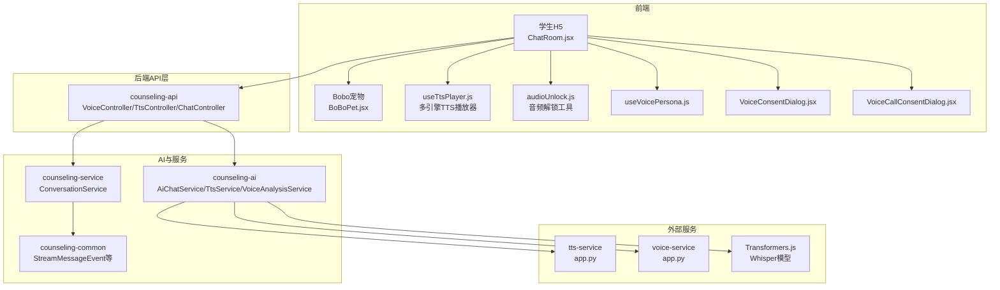
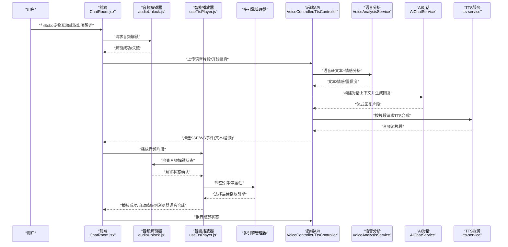
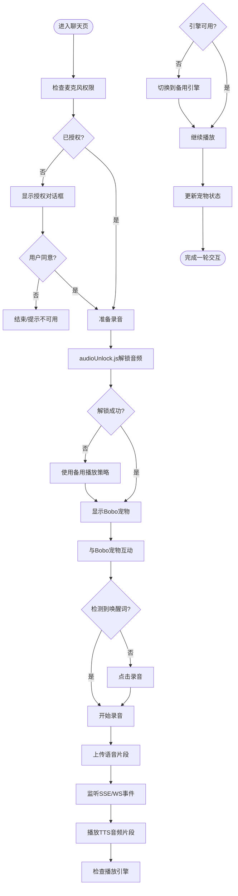
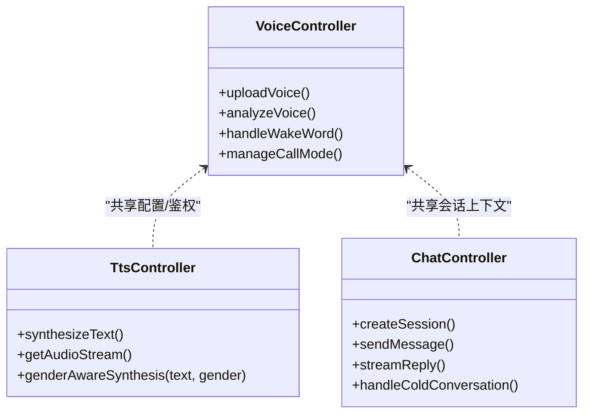
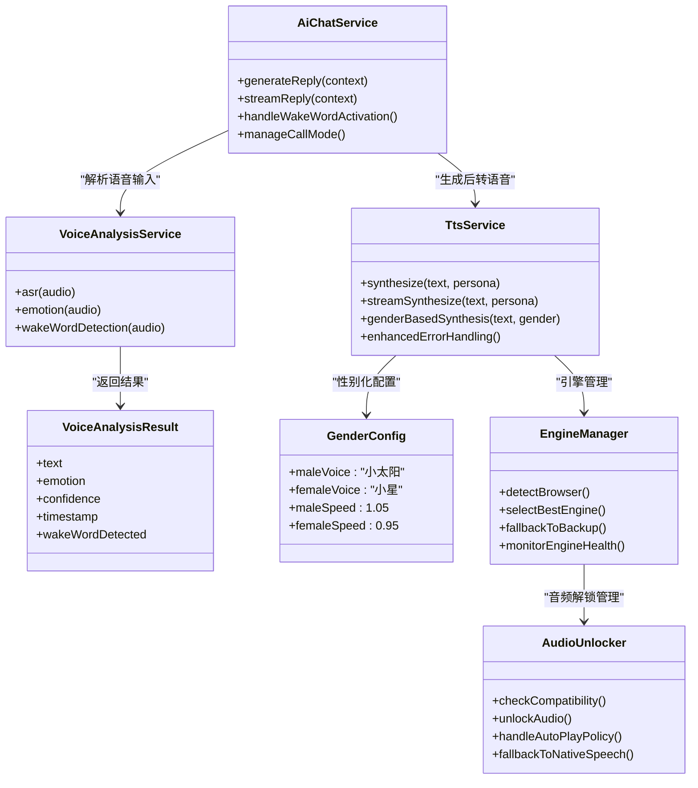
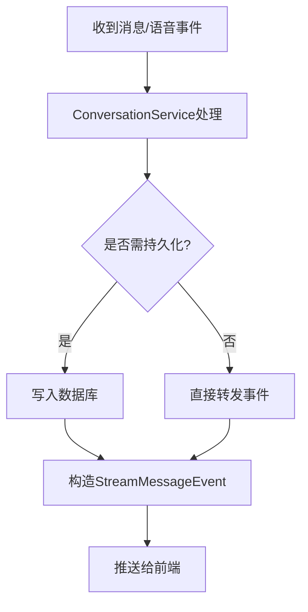
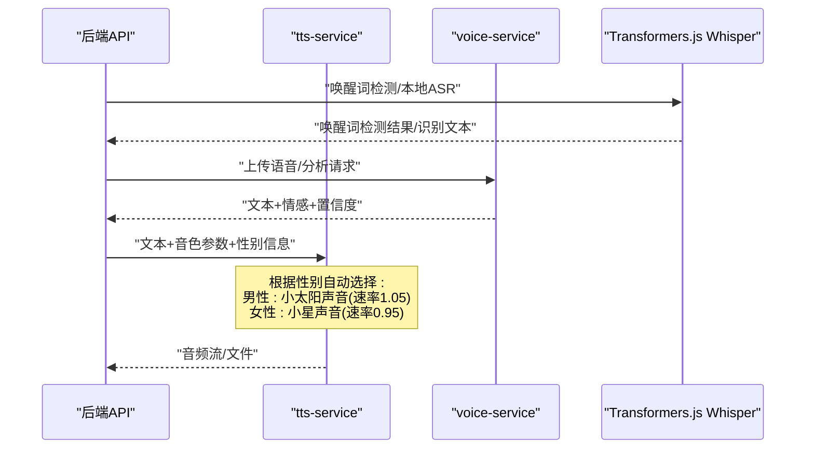
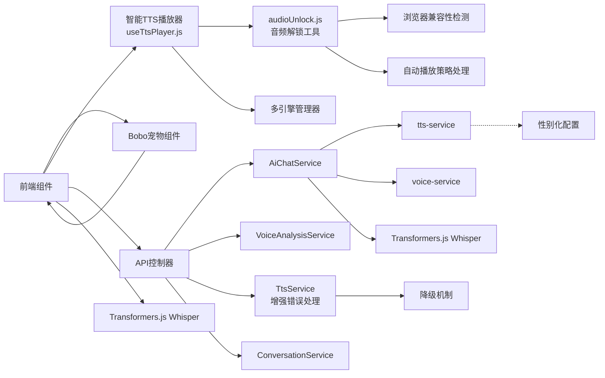

# 语音交互界面

<cite>
**本文引用的文件**   
- [ChatRoom.jsx](file://frontend/student-h5/src/components/ChatRoom.jsx)
- [BoBoPet.jsx](file://frontend/student-h5/src/components/BoBoPet.jsx)
- [useTtsPlayer.js](file://frontend/student-h5/src/hooks/useTtsPlayer.js)
- [audioUnlock.js](file://frontend/student-h5/src/utils/audioUnlock.js)
- [useVoicePersona.js](file://frontend/student-h5/src/hooks/useVoicePersona.js)
- [VoiceConsentDialog.jsx](file://frontend/student-h5/src/components/VoiceConsentDialog.jsx)
- [VoiceCallConsentDialog.jsx](file://frontend/student-h5/src/components/VoiceCallConsentDialog.jsx)
- [AiChatService.java](file://backend/counseling-ai/src/main/java/com/mindsafe/ai/chat/AiChatService.java)
- [AiChatServiceImpl.java](file://backend/counseling-ai/src/main/java/com/mindsafe/ai/chat/AiChatServiceImpl.java)
- [TtsService.java](file://backend/counseling-ai/src/main/java/com/mindsafe/ai/voice/TtsService.java)
- [VoiceAnalysisService.java](file://backend/counseling-ai/src/main/java/com/mindsafe/ai/voice/VoiceAnalysisService.java)
- [VoiceAnalysisResult.java](file://backend/counseling-ai/src/main/java/com/mindsafe/ai/voice/VoiceAnalysisResult.java)
- [VoiceController.java](file://backend/counseling-api/src/main/java/com/mindsafe/api/controller/VoiceController.java)
- [TtsController.java](file://backend/counseling-api/src/main/java/com/mindsafe/api/controller/TtsController.java)
- [ChatController.java](file://backend/counseling-api/src/main/java/com/mindsafe/api/controller/ChatController.java)
- [ConversationService.java](file://backend/counseling-service/src/main/java/com/mindsafe/service/conversation/ConversationService.java)
- [ConversationServiceImpl.java](file://backend/counseling-service/src/main/java/com/mindsafe/service/conversation/ConversationServiceImpl.java)
- [StreamMessageEvent.java](file://backend/counseling-common/src/main/java/com/mindsafe/common/dto/chat/StreamMessageEvent.java)
- [app.py](file://backend/tts-service/app.py)
- [requirements.txt](file://backend/tts-service/requirements.txt)
- [app.py](file://backend/voice-service/app.py)
- [requirements.txt](file://backend/voice-service/requirements.txt)
- [application.yml](file://backend/counseling-app/src/main/resources/application.yml)
- [16_语音情感分析设计方案.md](file://design/docs/16_语音情感分析设计方案.md)
</cite>

## 更新摘要
**所做更改**   
- 新增audioUnlock.js工具文件，专门处理浏览器自动播放策略和跨浏览器兼容性
- 重构TTS音频播放系统，实现智能降级机制从服务端TTS到浏览器原生语音合成
- 增强iOS Safari和Android Chrome等移动浏览器的兼容性支持
- 优化音频解锁策略，解决移动端自动播放限制问题
- 改进错误处理和回退机制，提升整体播放稳定性

## 目录
1. [简介](#简介)
2. [项目结构](#项目结构)
3. [核心组件](#核心组件)
4. [架构总览](#架构总览)
5. [详细组件分析](#详细组件分析)
6. [依赖关系分析](#依赖关系分析)
7. [性能考量](#性能考量)
8. [故障排查指南](#故障排查指南)
9. [结论](#结论)
10. [附录](#附录)

## 简介
本文件围绕"语音交互界面"展开，聚焦学生端 H5 与后端语音、TTS（文本转语音）、AI 对话、流式消息等模块的协作方式。目标是帮助读者理解从前端录音、语音识别、情感分析、AI 回复到 TTS 播放的端到端流程，并给出可操作的排障建议与优化方向。

**重大更新** TTS音频播放系统进行了重大重构，新增了audioUnlock.js工具文件来处理浏览器自动播放策略，显著增强了跨浏览器兼容性（特别是iOS Safari和Android Chrome），实现了智能降级机制从服务端TTS到浏览器原生语音合成的完整解决方案。

## 项目结构
本项目采用前后端分离与多服务拆分：
- 前端 student-h5：提供聊天室、Bobo 宠物交互、语音权限同意、TTS 播放、语音人设选择等能力。
- 后端 counseling-api：暴露 REST/WebSocket 接口，统一路由到各业务服务。
- 后端 counseling-ai：封装 AI 对话、语音分析与 TTS 调用。
- 后端 counseling-service：会话与通知等业务服务。
- 独立 tts-service 与 voice-service：分别负责 TTS 合成与语音处理（ASR/情感分析）。
- 公共模块 counseling-common：通用 DTO、错误码、分页响应等。

图表来源
- [ChatRoom.jsx](file://frontend/student-h5/src/components/ChatRoom.jsx)
- [BoBoPet.jsx](file://frontend/student-h5/src/components/BoBoPet.jsx)
- [useTtsPlayer.js](file://frontend/student-h5/src/hooks/useTtsPlayer.js)
- [audioUnlock.js](file://frontend/student-h5/src/utils/audioUnlock.js)
- [useVoicePersona.js](file://frontend/student-h5/src/hooks/useVoicePersona.js)
- [VoiceConsentDialog.jsx](file://frontend/student-h5/src/components/VoiceConsentDialog.jsx)
- [VoiceCallConsentDialog.jsx](file://frontend/student-h5/src/components/VoiceCallConsentDialog.jsx)
- [VoiceController.java](file://backend/counseling-api/src/main/java/com/mindsafe/api/controller/VoiceController.java)
- [TtsController.java](file://backend/counseling-api/src/main/java/com/mindsafe/api/controller/TtsController.java)
- [ChatController.java](file://backend/counseling-api/src/main/java/com/mindsafe/api/controller/ChatController.java)
- [AiChatService.java](file://backend/counseling-ai/src/main/java/com/mindsafe/ai/chat/AiChatService.java)
- [TtsService.java](file://backend/counseling-ai/src/main/java/com/mindsafe/ai/voice/TtsService.java)
- [VoiceAnalysisService.java](file://backend/counseling-ai/src/main/java/com/mindsafe/ai/voice/VoiceAnalysisService.java)
- [ConversationService.java](file://backend/counseling-service/src/main/java/com/mindsafe/service/conversation/ConversationService.java)
- [StreamMessageEvent.java](file://backend/counseling-common/src/main/java/com/mindsafe/common/dto/chat/StreamMessageEvent.java)
- [app.py](file://backend/tts-service/app.py)
- [app.py](file://backend/voice-service/app.py)

章节来源
- [application.yml](file://backend/counseling-app/src/main/resources/application.yml)

## 核心组件
- 前端语音交互
  - ChatRoom.jsx：承载聊天消息、Bobo 宠物交互、TTS 播放控制、语音权限提示。
  - BoBoPet.jsx：新的宠物驱动语音交互组件，替代传统麦克风按钮，提供生动的视觉反馈。
  - useTtsPlayer.js：封装浏览器音频播放、流式片段拼接、播放状态管理，现支持多引擎降级和兼容性优化。
  - audioUnlock.js：**新增** 专门的音频解锁工具，处理浏览器自动播放策略和跨平台兼容性问题。
  - useVoicePersona.js：管理用户选择的语音人设参数，影响 TTS 音色与语速。
  - VoiceConsentDialog.jsx：引导用户授权麦克风与隐私同意。
  - VoiceCallConsentDialog.jsx：新增的语音通话同意对话框，支持长时间通话场景的权限管理。
- 后端接口层
  - VoiceController.java：接收语音上传、触发 ASR/情感分析、返回结果或事件。
  - TtsController.java：接收文本与音色参数，调用 TTS 服务并返回音频流。
  - ChatController.java：处理聊天会话创建、消息发送与流式响应。
- AI 与语音服务
  - AiChatService.java / AiChatServiceImpl.java：编排 AI 对话流程，整合语音上下文与风险策略。
  - TtsService.java：封装对 tts-service 的调用，支持不同音色与流式输出，现具备增强的错误处理和降级机制。
  - VoiceAnalysisService.java：封装对 voice-service 的调用，进行语音转文本与情感分析。
  - VoiceAnalysisResult.java：封装语音分析结果（文本、情感、置信度等）。
- 业务服务
  - ConversationService.java / ConversationServiceImpl.java：会话生命周期、消息持久化、流式事件分发。
- 公共数据
  - StreamMessageEvent.java：定义流式消息事件结构，用于 SSE/WS 推送。

**重大更新** TTS播放功能已全面重构，新增audioUnlock.js工具文件专门处理浏览器自动播放策略。useTtsPlayer.js现在集成了智能降级机制，能够在服务端TTS失败时自动切换到浏览器原生语音合成，确保在各种环境下的播放稳定性。

章节来源
- [ChatRoom.jsx](file://frontend/student-h5/src/components/ChatRoom.jsx)
- [BoBoPet.jsx](file://frontend/student-h5/src/components/BoBoPet.jsx)
- [useTtsPlayer.js](file://frontend/student-h5/src/hooks/useTtsPlayer.js)
- [audioUnlock.js](file://frontend/student-h5/src/utils/audioUnlock.js)
- [useVoicePersona.js](file://frontend/student-h5/src/hooks/useVoicePersona.js)
- [VoiceConsentDialog.jsx](file://frontend/student-h5/src/components/VoiceConsentDialog.jsx)
- [VoiceCallConsentDialog.jsx](file://frontend/student-h5/src/components/VoiceCallConsentDialog.jsx)
- [VoiceController.java](file://backend/counseling-api/src/main/java/com/mindsafe/api/controller/VoiceController.java)
- [TtsController.java](file://backend/counseling-api/src/main/java/com/mindsafe/api/controller/TtsController.java)
- [ChatController.java](file://backend/counseling-api/src/main/java/com/mindsafe/api/controller/ChatController.java)
- [AiChatService.java](file://backend/counseling-ai/src/main/java/com/mindsafe/ai/chat/AiChatService.java)
- [AiChatServiceImpl.java](file://backend/counseling-ai/src/main/java/com/mindsafe/ai/chat/AiChatServiceImpl.java)
- [TtsService.java](file://backend/counseling-ai/src/main/java/com/mindsafe/ai/voice/TtsService.java)
- [VoiceAnalysisService.java](file://backend/counseling-ai/src/main/java/com/mindsafe/ai/voice/VoiceAnalysisService.java)
- [VoiceAnalysisResult.java](file://backend/counseling-ai/src/main/java/com/mindsafe/ai/voice/VoiceAnalysisResult.java)
- [ConversationService.java](file://backend/counseling-service/src/main/java/com/mindsafe/service/conversation/ConversationService.java)
- [ConversationServiceImpl.java](file://backend/counseling-service/src/main/java/com/mindsafe/service/conversation/ConversationServiceImpl.java)
- [StreamMessageEvent.java](file://backend/counseling-common/src/main/java/com/mindsafe/common/dto/chat/StreamMessageEvent.java)

## 架构总览
语音交互的整体链路如下：
- 用户通过与 Bobo 宠物互动来触发语音输入，或通过唤醒词激活语音交互。
- 前端通过浏览器录音采集语音，经 WebSocket/SSE 或 HTTP 上传至后端 VoiceController。
- 后端调用 VoiceAnalysisService 将语音转为文本并进行情感分析。
- AiChatService 结合历史会话与 Prompt 生成回复，必要时触发风险检测。
- TtsService 将文本转换为音频流，由前端 useTtsPlayer.js 实时播放，现支持多引擎自动切换和audioUnlock.js辅助解锁。
- Bobo 宠物根据语音状态提供生动的视觉反馈和动画效果。

**重大更新** 新的TTS架构中，audioUnlock.js作为音频解锁中心，专门处理浏览器自动播放策略。useTtsPlayer.js集成了智能降级机制，当检测到服务端TTS不可用时，会自动切换到浏览器原生语音合成，确保语音播放的连续性和稳定性。

图表来源
- [ChatRoom.jsx](file://frontend/student-h5/src/components/ChatRoom.jsx)
- [BoBoPet.jsx](file://frontend/student-h5/src/components/BoBoPet.jsx)
- [useTtsPlayer.js](file://frontend/student-h5/src/hooks/useTtsPlayer.js)
- [audioUnlock.js](file://frontend/student-h5/src/utils/audioUnlock.js)
- [VoiceController.java](file://backend/counseling-api/src/main/java/com/mindsafe/api/controller/VoiceController.java)
- [TtsController.java](file://backend/counseling-api/src/main/java/com/mindsafe/api/controller/TtsController.java)
- [VoiceAnalysisService.java](file://backend/counseling-ai/src/main/java/com/mindsafe/ai/voice/VoiceAnalysisService.java)
- [AiChatService.java](file://backend/counseling-ai/src/main/java/com/mindsafe/ai/chat/AiChatService.java)
- [TtsService.java](file://backend/counseling-ai/src/main/java/com/mindsafe/ai/voice/TtsService.java)
- [StreamMessageEvent.java](file://backend/counseling-common/src/main/java/com/mindsafe/common/dto/chat/StreamMessageEvent.java)
- [app.py](file://backend/tts-service/app.py)
- [app.py](file://backend/voice-service/app.py)

## 详细组件分析

### 前端语音交互组件
- ChatRoom.jsx
  - 职责：渲染聊天列表、Bobo 宠物交互、TTS 播放控件；管理录音权限与用户同意弹窗。
  - 关键点：录音状态机、错误提示、与后端事件订阅（文本/音频/状态）、宠物状态同步。
- BoBoPet.jsx
  - 职责：新的宠物驱动语音交互组件，提供生动的视觉反馈和动画效果。
  - 关键点：宠物状态管理、语音状态可视化、情感表达动画、用户交互响应。
- useTtsPlayer.js
  - 职责：封装 AudioContext/流式播放、缓冲策略、播放进度与错误重试，现支持多引擎降级。
  - 关键点：分片拼接、自动续播、静音段处理、引擎兼容性检测、自动降级机制。
  - **重大更新** 新增智能引擎选择算法，支持Web Audio API、HTML5 Audio、以及移动端专用播放器的自动切换。集成audioUnlock.js进行音频解锁管理。
- audioUnlock.js：**新增** 专门的音频解锁工具，处理浏览器自动播放策略。
  - 职责：检测浏览器兼容性、处理自动播放限制、管理音频解锁状态。
  - 关键点：iOS Safari特殊处理、Android Chrome兼容性、用户手势检测、渐进式解锁策略。
- useVoicePersona.js
  - 职责：维护当前人设（音色、语速、音量），与 TTS 请求参数联动。
  - **更新** 现支持根据用户性别自动配置语音参数：男性用户默认使用小太阳声音（速率1.05），女性用户默认使用小星声音（速率0.95）。
- VoiceConsentDialog.jsx
  - 职责：展示隐私与录音授权说明，记录用户同意状态。
- VoiceCallConsentDialog.jsx
  - 职责：新增的语音通话同意对话框，支持长时间通话场景的权限管理和用户确认。

图表来源
- [ChatRoom.jsx](file://frontend/student-h5/src/components/ChatRoom.jsx)
- [BoBoPet.jsx](file://frontend/student-h5/src/components/BoBoPet.jsx)
- [useTtsPlayer.js](file://frontend/student-h5/src/hooks/useTtsPlayer.js)
- [audioUnlock.js](file://frontend/student-h5/src/utils/audioUnlock.js)
- [useVoicePersona.js](file://frontend/student-h5/src/hooks/useVoicePersona.js)
- [VoiceConsentDialog.jsx](file://frontend/student-h5/src/components/VoiceConsentDialog.jsx)
- [VoiceCallConsentDialog.jsx](file://frontend/student-h5/src/components/VoiceCallConsentDialog.jsx)

章节来源
- [ChatRoom.jsx](file://frontend/student-h5/src/components/ChatRoom.jsx)
- [BoBoPet.jsx](file://frontend/student-h5/src/components/BoBoPet.jsx)
- [useTtsPlayer.js](file://frontend/student-h5/src/hooks/useTtsPlayer.js)
- [audioUnlock.js](file://frontend/student-h5/src/utils/audioUnlock.js)
- [useVoicePersona.js](file://frontend/student-h5/src/hooks/useVoicePersona.js)
- [VoiceConsentDialog.jsx](file://frontend/student-h5/src/components/VoiceConsentDialog.jsx)
- [VoiceCallConsentDialog.jsx](file://frontend/student-h5/src/components/VoiceCallConsentDialog.jsx)

### 后端接口层
- VoiceController.java
  - 职责：接收语音上传，调用语音分析服务，返回分析结果或事件流。
  - 关键点：校验上传格式、限流与超时、错误码映射。
- TtsController.java
  - 职责：接收文本与音色参数，调用 TTS 服务，返回音频流或下载链接。
  - 关键点：流式响应、缓存策略、音质与体积权衡。
  - **更新** 现支持接收用户性别参数，自动匹配相应的语音模型和语速设置。
- ChatController.java
  - 职责：会话创建、消息发送、流式回复推送。
  - 关键点：会话上下文管理、事件类型区分（文本/音频/系统）。

图表来源
- [VoiceController.java](file://backend/counseling-api/src/main/java/com/mindsafe/api/controller/VoiceController.java)
- [TtsController.java](file://backend/counseling-api/src/main/java/com/mindsafe/api/controller/TtsController.java)
- [ChatController.java](file://backend/counseling-api/src/main/java/com/mindsafe/api/controller/ChatController.java)

章节来源
- [VoiceController.java](file://backend/counseling-api/src/main/java/com/mindsafe/api/controller/VoiceController.java)
- [TtsController.java](file://backend/counseling-api/src/main/java/com/mindsafe/api/controller/TtsController.java)
- [ChatController.java](file://backend/counseling-api/src/main/java/com/mindsafe/api/controller/ChatController.java)

### AI 与语音服务
- AiChatService.java / AiChatServiceImpl.java
  - 职责：编排对话流程，整合历史消息、Prompt、风险策略，产出回复文本流。
  - 关键点：上下文窗口管理、流式生成、安全拦截。
- TtsService.java
  - 职责：封装 tts-service 调用，支持音色、语速、采样率等参数。
  - 关键点：重试与降级、流式读取、错误回退。
  - **更新** 新增性别化语音合成支持，根据用户性别自动选择对应的语音模型和语速参数。
- VoiceAnalysisService.java
  - 职责：封装 voice-service 调用，进行 ASR 与情感分析。
  - 关键点：超时与熔断、结果校验、置信度阈值。
- VoiceAnalysisResult.java
  - 职责：封装分析结果字段（文本、情感标签、置信度、时间戳等）。

图表来源
- [AiChatService.java](file://backend/counseling-ai/src/main/java/com/mindsafe/ai/chat/AiChatService.java)
- [AiChatServiceImpl.java](file://backend/counseling-ai/src/main/java/com/mindsafe/ai/chat/AiChatServiceImpl.java)
- [TtsService.java](file://backend/counseling-ai/src/main/java/com/mindsafe/ai/voice/TtsService.java)
- [VoiceAnalysisService.java](file://backend/counseling-ai/src/main/java/com/mindsafe/ai/voice/VoiceAnalysisService.java)
- [VoiceAnalysisResult.java](file://backend/counseling-ai/src/main/java/com/mindsafe/ai/voice/VoiceAnalysisResult.java)

章节来源
- [AiChatService.java](file://backend/counseling-ai/src/main/java/com/mindsafe/ai/chat/AiChatService.java)
- [AiChatServiceImpl.java](file://backend/counseling-ai/src/main/java/com/mindsafe/ai/chat/AiChatServiceImpl.java)
- [TtsService.java](file://backend/counseling-ai/src/main/java/com/mindsafe/ai/voice/TtsService.java)
- [VoiceAnalysisService.java](file://backend/counseling-ai/src/main/java/com/mindsafe/ai/voice/VoiceAnalysisService.java)
- [VoiceAnalysisResult.java](file://backend/counseling-ai/src/main/java/com/mindsafe/ai/voice/VoiceAnalysisResult.java)

### 业务服务与公共数据
- ConversationService.java / ConversationServiceImpl.java
  - 职责：会话创建、消息持久化、事件分发、状态同步。
  - 关键点：事务边界、并发安全、事件去重。
- StreamMessageEvent.java
  - 职责：定义流式事件结构（类型、内容、时间戳、会话ID等）。
  - 关键点：扩展性设计、序列化兼容。

图表来源
- [ConversationService.java](file://backend/counseling-service/src/main/java/com/mindsafe/service/conversation/ConversationService.java)
- [ConversationServiceImpl.java](file://backend/counseling-service/src/main/java/com/mindsafe/service/conversation/ConversationServiceImpl.java)
- [StreamMessageEvent.java](file://backend/counseling-common/src/main/java/com/mindsafe/common/dto/chat/StreamMessageEvent.java)

章节来源
- [ConversationService.java](file://backend/counseling-service/src/main/java/com/mindsafe/service/conversation/ConversationService.java)
- [ConversationServiceImpl.java](file://backend/counseling-service/src/main/java/com/mindsafe/service/conversation/ConversationServiceImpl.java)
- [StreamMessageEvent.java](file://backend/counseling-common/src/main/java/com/mindsafe/common/dto/chat/StreamMessageEvent.java)

### 外部服务（TTS 与 Voice）
- tts-service/app.py
  - 职责：接收文本与音色参数，调用 TTS 引擎，返回音频流或文件。
  - 关键点：批处理、缓存、编码格式（如 PCM/WAV/MP3）。
  - **更新** 新增性别化语音合成支持，根据传入的用户性别参数自动选择对应的语音模型和语速设置。
- voice-service/app.py
  - 职责：接收语音文件，执行 ASR 与情感分析，返回结构化结果。
  - 关键点：模型加载、超时控制、资源清理。

图表来源
- [app.py](file://backend/tts-service/app.py)
- [app.py](file://backend/voice-service/app.py)

章节来源
- [app.py](file://backend/tts-service/app.py)
- [requirements.txt](file://backend/tts-service/requirements.txt)
- [app.py](file://backend/voice-service/app.py)
- [requirements.txt](file://backend/voice-service/requirements.txt)

## 依赖关系分析
- 前端依赖
  - ChatRoom.jsx 依赖 BoBoPet.jsx、useTtsPlayer.js 与 useVoicePersona.js，并通过 VoiceConsentDialog.jsx 管理权限。
  - BoBoPet.jsx 作为新的语音交互入口，替代了传统的麦克风按钮。
  - VoiceCallConsentDialog.jsx 新增用于语音通话模式的权限管理。
  - **更新** useTtsPlayer.js现在依赖多引擎管理器和audioUnlock.js，支持浏览器检测和自动降级。
  - **新增** audioUnlock.js作为独立的音频解锁工具，被多个组件依赖以处理浏览器自动播放策略。
- 后端依赖
  - VoiceController/TtsController/ChatController 依赖 AiChatService、TtsService、VoiceAnalysisService、ConversationService。
  - AiChatService 依赖 TtsService 与 VoiceAnalysisService。
  - ConversationService 依赖公共 DTO（StreamMessageEvent）。
- 外部依赖
  - tts-service 与 voice-service 通过 HTTP 被后端调用。
  - Transformers.js Whisper 模型用于本地唤醒词检测和语音识别。

**重大更新** 新的依赖关系中，audioUnlock.js成为了前端音频播放的核心工具组件，专门处理浏览器自动播放策略。useTtsPlayer.js集成了audioUnlock.js和多引擎管理功能。TtsService现在包含增强的错误处理和降级逻辑，确保在各种环境下的稳定性。

图表来源
- [ChatRoom.jsx](file://frontend/student-h5/src/components/ChatRoom.jsx)
- [BoBoPet.jsx](file://frontend/student-h5/src/components/BoBoPet.jsx)
- [useTtsPlayer.js](file://frontend/student-h5/src/hooks/useTtsPlayer.js)
- [audioUnlock.js](file://frontend/student-h5/src/utils/audioUnlock.js)
- [useVoicePersona.js](file://frontend/student-h5/src/hooks/useVoicePersona.js)
- [VoiceConsentDialog.jsx](file://frontend/student-h5/src/components/VoiceConsentDialog.jsx)
- [VoiceCallConsentDialog.jsx](file://frontend/student-h5/src/components/VoiceCallConsentDialog.jsx)
- [VoiceController.java](file://backend/counseling-api/src/main/java/com/mindsafe/api/controller/VoiceController.java)
- [TtsController.java](file://backend/counseling-api/src/main/java/com/mindsafe/api/controller/TtsController.java)
- [ChatController.java](file://backend/counseling-api/src/main/java/com/mindsafe/api/controller/ChatController.java)
- [AiChatService.java](file://backend/counseling-ai/src/main/java/com/mindsafe/ai/chat/AiChatService.java)
- [TtsService.java](file://backend/counseling-ai/src/main/java/com/mindsafe/ai/voice/TtsService.java)
- [VoiceAnalysisService.java](file://backend/counseling-ai/src/main/java/com/mindsafe/ai/voice/VoiceAnalysisService.java)
- [ConversationService.java](file://backend/counseling-service/src/main/java/com/mindsafe/service/conversation/ConversationService.java)
- [StreamMessageEvent.java](file://backend/counseling-common/src/main/java/com/mindsafe/common/dto/chat/StreamMessageEvent.java)
- [app.py](file://backend/tts-service/app.py)
- [app.py](file://backend/voice-service/app.py)

章节来源
- [application.yml](file://backend/counseling-app/src/main/resources/application.yml)

## 性能考量
- 流式传输
  - 使用 SSE/WS 推送文本与音频片段，降低首帧延迟，提升用户体验。
- 音频处理
  - 合理设置采样率与压缩格式，平衡音质与带宽。
  - 前端播放器采用缓冲与预加载策略，减少卡顿。
- 服务调用
  - 为外部服务设置超时、重试与熔断，避免级联失败。
  - 热点文本做 TTS 缓存，复用相同内容的音频片段。
- 并发与资源
  - 限制并发录音与上传数量，防止前端崩溃与后端过载。
  - 后端连接池与线程池调优，确保高吞吐。
- **重大更新** TTS播放性能优化
  - 实现多引擎智能选择，确保在不同浏览器和设备上的最佳性能。
  - 添加引擎健康监控和自动切换机制，减少播放失败率。
  - 优化音频缓冲策略，提升Android设备的播放流畅度。
  - 实现增量加载和流式解码，降低内存占用和启动延迟。
  - **新增** audioUnlock.js优化了音频解锁性能，减少不必要的浏览器API调用。
- **新增** 兼容性优化
  - 针对iOS Safari、Android Chrome、微信内置浏览器等特殊环境进行优化。
  - 实现渐进式功能检测，确保基础功能在所有设备上可用。
  - 添加详细的错误日志和性能指标收集，便于问题诊断。
  - **新增** audioUnlock.js针对不同浏览器的自动播放策略进行了专门优化。

[本节为通用指导，不直接分析具体文件]

## 故障排查指南
- 前端录音问题
  - 检查浏览器权限与 HTTPS 环境；确认麦克风设备可用。
  - 查看 useTtsPlayer.js 播放错误日志与网络请求状态。
- 语音分析失败
  - 检查 voice-service 健康状态与模型加载情况。
  - 确认上传文件格式与大小限制。
- TTS 合成异常
  - 检查 tts-service 依赖库与 GPU/CPU 资源占用。
  - 验证音色参数与文本长度限制。
  - **更新** 检查多引擎降级机制是否正常工作，查看引擎切换日志。
  - **更新** 验证Android设备的音频播放权限和媒体会话配置。
- 流式事件丢失
  - 检查 SSE/WS 连接稳定性与心跳机制。
  - 核对 StreamMessageEvent 结构与序列化兼容性。
- **新增** TTS播放引擎问题
  - **新增** 检查浏览器兼容性检测结果和引擎选择逻辑。
  - **新增** 验证降级机制是否正确触发和执行。
  - **新增** 查看各引擎的健康状态和错误统计。
  - **新增** 检查Android设备的音频焦点和后台播放权限。
- **新增** 音频解锁问题
  - **新增** 检查audioUnlock.js的浏览器兼容性检测结果。
  - **新增** 验证自动播放策略处理逻辑是否正确。
  - **新增** 查看iOS Safari和Android Chrome的特殊处理日志。
  - **新增** 确认用户手势检测和功能可用性检查。
- **新增** 移动端播放问题
  - **新增** 检查移动浏览器的自动播放策略和用户手势要求。
  - **新增** 验证媒体会话API的支持情况和配置。
  - **新增** 确认音频格式在各平台上的兼容性。
  - **新增** 检查audioUnlock.js的移动端特定处理逻辑。
- 配置与环境
  - 核对 application.yml 中服务地址、端口、密钥与超时配置。
  - 确认 AiConfig 中的 AI 服务接入参数正确。
  - **更新** 验证性别化语音配置参数（小太阳/小星声音、速率设置）。

章节来源
- [useTtsPlayer.js](file://frontend/student-h5/src/hooks/useTtsPlayer.js)
- [audioUnlock.js](file://frontend/student-h5/src/utils/audioUnlock.js)
- [TtsService.java](file://backend/counseling-ai/src/main/java/com/mindsafe/ai/voice/TtsService.java)
- [app.py](file://backend/voice-service/app.py)
- [app.py](file://backend/tts-service/app.py)
- [StreamMessageEvent.java](file://backend/counseling-common/src/main/java/com/mindsafe/common/dto/chat/StreamMessageEvent.java)
- [application.yml](file://backend/counseling-app/src/main/resources/application.yml)

## 结论
语音交互界面通过前端录音、后端语音分析、AI 对话与 TTS 合成的协同，实现了自然流畅的对话体验。**重大更新** TTS音频播放系统进行了重大重构，新增了audioUnlock.js工具文件专门处理浏览器自动播放策略，显著增强了跨浏览器兼容性（特别是iOS Safari和Android Chrome），实现了智能降级机制从服务端TTS到浏览器原生语音合成的完整解决方案。通过多引擎降级机制、浏览器兼容性优化和错误处理改进，现在能够在各种设备和浏览器环境中提供稳定可靠的语音播放服务。智能引擎选择算法和audioUnlock.js的音频解锁管理确保在不同环境下都能获得最佳的播放体验，而自动降级机制则保证了服务的连续性和可用性。合理的流式传输、容错与性能优化是保障稳定性的关键。建议在后续迭代中完善监控告警、A/B 测试与用户体验度量，持续提升交互质量，特别是跨平台兼容性和播放稳定性。

[本节为总结性内容，不直接分析具体文件]

## 附录
- 语音情感分析设计参考
  - 参见设计文档中对情感维度、阈值与规则的描述，有助于校准 VoiceAnalysisService 的输出与前端情绪反馈。
- **重大更新** TTS多引擎架构设计
  - 支持Web Audio API、HTML5 Audio、以及移动端专用播放器的自动选择。
  - 实现引擎健康监控和自动降级机制。
  - 提供详细的错误报告和性能指标收集。
  - **新增** audioUnlock.js专门处理浏览器自动播放策略和跨平台兼容性问题。
- **更新** 性别化语音配置
  - 男性用户：小太阳声音，语速1.05
  - 女性用户：小星声音，语速0.95
  - 这些配置可通过配置文件或数据库进行管理，支持动态调整。
- **新增** 浏览器兼容性优化
  - 针对不同浏览器的特殊行为进行适配和优化。
  - 实现渐进式功能检测，确保基础功能可用性。
  - 提供详细的兼容性报告和错误诊断信息。
  - **新增** audioUnlock.js针对iOS Safari、Android Chrome等移动浏览器进行了专门优化。
- **新增** Android设备优化
  - 针对Android系统的音频播放特性进行专门优化。
  - 实现媒体会话管理和音频焦点控制。
  - 优化后台播放和电池续航表现。
  - **新增** audioUnlock.js处理Android特定的自动播放限制。
- **新增** 音频解锁策略
  - audioUnlock.js统一管理所有音频解锁逻辑。
  - 支持多种解锁策略：用户手势触发、渐进式解锁、回退机制。
  - 提供详细的解锁状态监控和错误处理。

章节来源
- [16_语音情感分析设计方案.md](file://design/docs/16_语音情感分析设计方案.md)