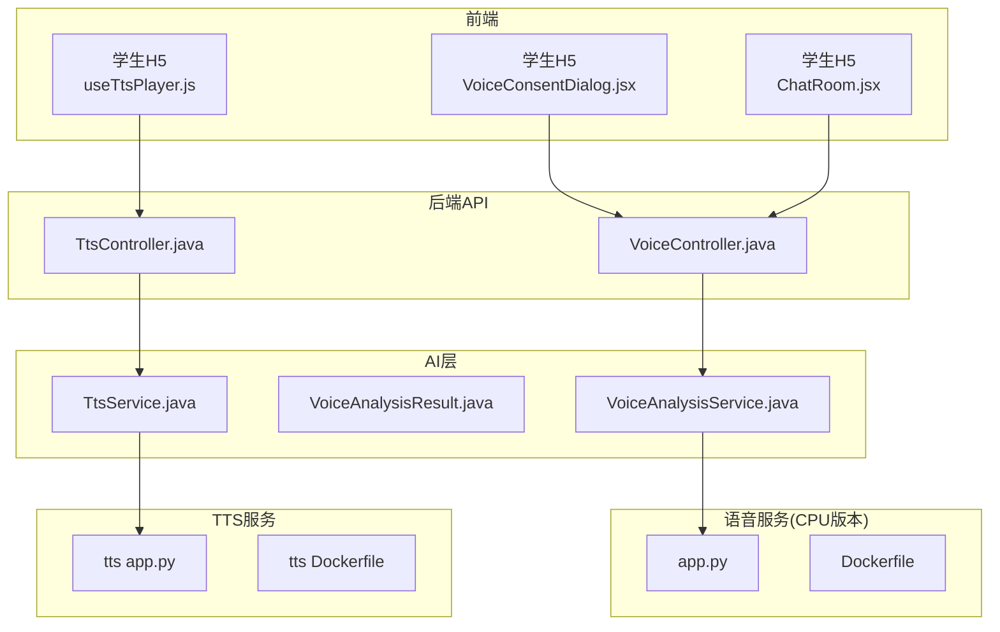
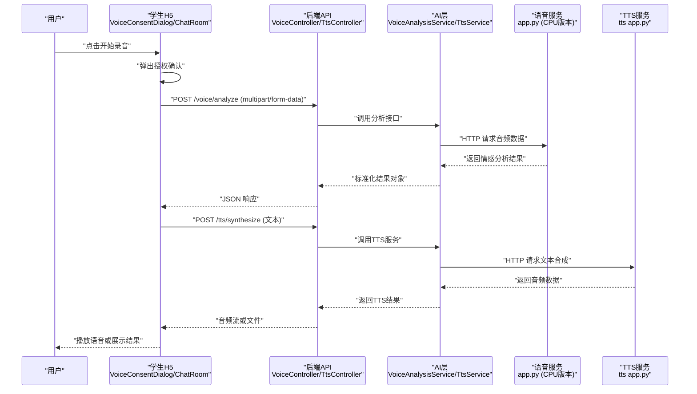
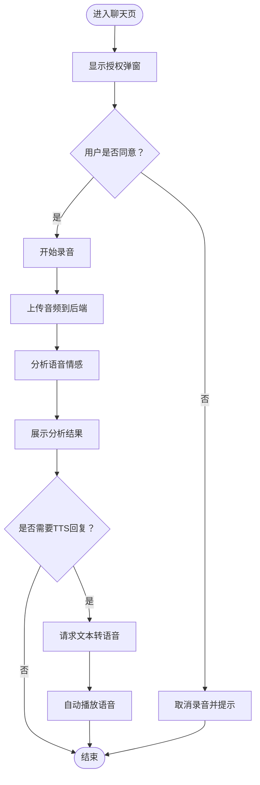
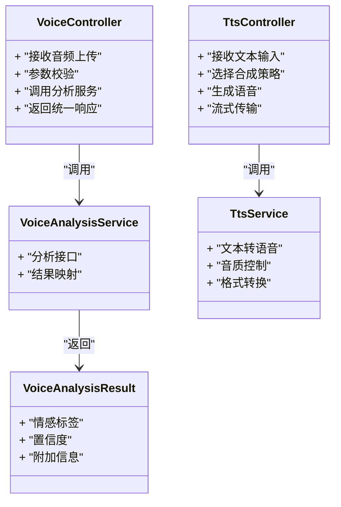
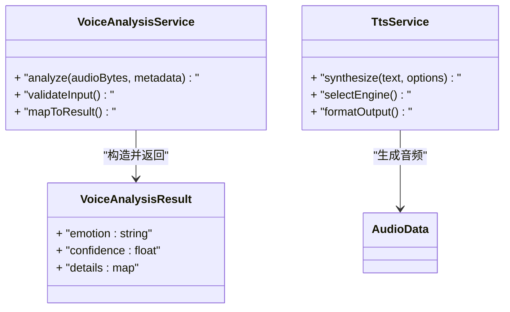
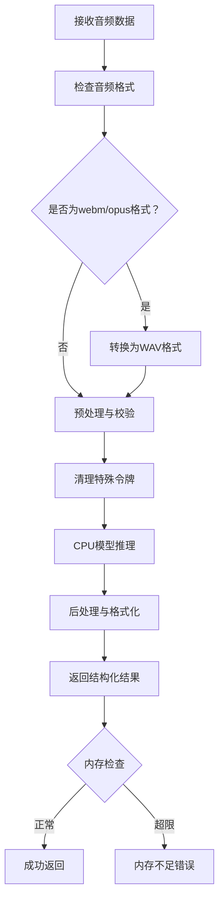
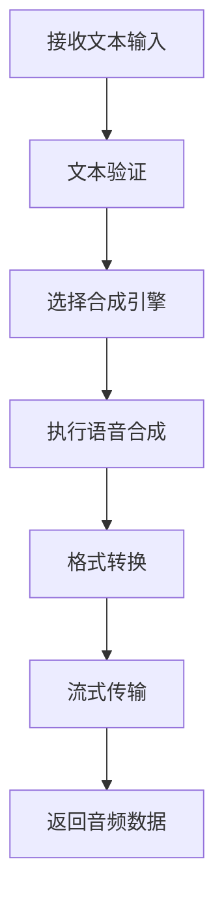
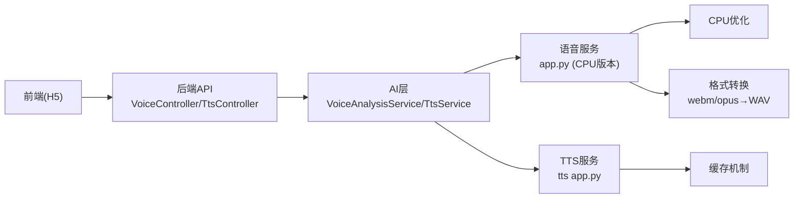

# 语音情感分析系统

<cite>
**本文引用的文件**   
- [backend/counseling-api/src/main/java/com/mindsafe/api/controller/VoiceController.java](file://backend/counseling-api/src/main/java/com/mindsafe/api/controller/VoiceController.java)
- [backend/counseling-api/src/main/java/com/mindsafe/api/controller/TtsController.java](file://backend/counseling-api/src/main/java/com/mindsafe/api/controller/TtsController.java)
- [backend/counseling-ai/src/main/java/com/mindsafe/ai/voice/VoiceAnalysisService.java](file://backend/counseling-ai/src/main/java/com/mindsafe/ai/voice/VoiceAnalysisService.java)
- [backend/counseling-ai/src/main/java/com/mindsafe/ai/voice/VoiceAnalysisResult.java](file://backend/counseling-ai/src/main/java/com/mindsafe/ai/voice/VoiceAnalysisResult.java)
- [backend/counseling-ai/src/main/java/com/mindsafe/ai/voice/TtsService.java](file://backend/counseling-ai/src/main/java/com/mindsafe/ai/voice/TtsService.java)
- [backend/voice-service/app.py](file://backend/voice-service/app.py)
- [backend/voice-service/Dockerfile](file://backend/voice-service/Dockerfile)
- [backend/tts-service/app.py](file://backend/tts-service/app.py)
- [backend/tts-service/Dockerfile](file://backend/tts-service/Dockerfile)
- [design/docs/16_语音情感分析设计方案.md](file://design/docs/16_语音情感分析设计方案.md)
- [frontend/student-h5/src/components/VoiceConsentDialog.jsx](file://frontend/student-h5/src/components/VoiceConsentDialog.jsx)
- [frontend/student-h5/src/components/ChatRoom.jsx](file://frontend/student-h5/src/components/ChatRoom.jsx)
- [frontend/student-h5/src/hooks/useTtsPlayer.js](file://frontend/student-h5/src/hooks/useTtsPlayer.js)
</cite>

## 更新摘要
**变更内容**   
- 增强了语音识别管道，支持webm/opus音频格式转换为WAV格式
- 修复了ASR处理中的特殊令牌清理问题
- 更新了DeepSeek模型名称配置
- 优化了音频格式转换和预处理流程

## 目录
1. [简介](#简介)
2. [项目结构](#项目结构)
3. [核心组件](#核心组件)
4. [架构总览](#架构总览)
5. [详细组件分析](#详细组件分析)
6. [依赖关系分析](#依赖关系分析)
7. [性能考虑](#性能考虑)
8. [故障排查指南](#故障排查指南)
9. [结论](#结论)
10. [附录](#附录)

## 简介
本系统为"语音情感分析"能力提供端到端支持：前端采集用户语音并获取授权，后端通过 REST API 接收音频数据，调用独立的语音服务进行特征提取与情感分类，最终返回结构化结果供对话、风险识别等模块使用。整体采用前后端分离与微服务化设计，语音服务以 Python 应用形式独立部署，便于模型迭代与横向扩展。

**更新** 系统现已增强语音识别管道，支持更多音频格式（webm/opus）自动转换为WAV格式，修复了ASR处理中的特殊令牌清理问题，并更新了DeepSeek模型名称配置，提升了系统的兼容性和稳定性。

## 项目结构
围绕语音情感分析的关键代码分布在以下位置：
- 前端（学生 H5）：录音与授权交互、聊天界面集成、TTS播放器
- 后端 API：暴露语音上传、分析和TTS合成接口
- AI 层：定义语音分析服务接口与结果模型，新增TTS服务接口
- 语音服务：Python 应用，承载具体推理逻辑（已更新为CPU版本）
- TTS服务：独立的文本转语音服务
- 设计文档：语音情感分析方案说明

**图表来源**
- [backend/counseling-api/src/main/java/com/mindsafe/api/controller/VoiceController.java](file://backend/counseling-api/src/main/java/com/mindsafe/api/controller/VoiceController.java)
- [backend/counseling-api/src/main/java/com/mindsafe/api/controller/TtsController.java](file://backend/counseling-api/src/main/java/com/mindsafe/api/controller/TtsController.java)
- [backend/counseling-ai/src/main/java/com/mindsafe/ai/voice/VoiceAnalysisService.java](file://backend/counseling-ai/src/main/java/com/mindsafe/ai/voice/VoiceAnalysisService.java)
- [backend/counseling-ai/src/main/java/com/mindsafe/ai/voice/VoiceAnalysisResult.java](file://backend/counseling-ai/src/main/java/com/mindsafe/ai/voice/VoiceAnalysisResult.java)
- [backend/counseling-ai/src/main/java/com/mindsafe/ai/voice/TtsService.java](file://backend/counseling-ai/src/main/java/com/mindsafe/ai/voice/TtsService.java)
- [backend/voice-service/app.py](file://backend/voice-service/app.py)
- [backend/voice-service/Dockerfile](file://backend/voice-service/Dockerfile)
- [backend/tts-service/app.py](file://backend/tts-service/app.py)
- [backend/tts-service/Dockerfile](file://backend/tts-service/Dockerfile)
- [frontend/student-h5/src/components/VoiceConsentDialog.jsx](file://frontend/student-h5/src/components/VoiceConsentDialog.jsx)
- [frontend/student-h5/src/components/ChatRoom.jsx](file://frontend/student-h5/src/components/ChatRoom.jsx)
- [frontend/student-h5/src/hooks/useTtsPlayer.js](file://frontend/student-h5/src/hooks/useTtsPlayer.js)

章节来源
- [design/docs/16_语音情感分析设计方案.md](file://design/docs/16_语音情感分析设计方案.md)

## 核心组件
- 前端授权与采集
  - 语音同意弹窗：用于收集用户对语音采集的明确授权，保障合规性
  - 聊天页面集成：在对话流程中触发录音与上传
  - TTS播放器：新增的文本转语音播放组件，支持自动播放和管道化处理
- 后端 API 控制器
  - 提供语音上传与分析的统一入口，负责参数校验、鉴权与响应封装
  - 新增TTS控制器：处理文本转语音请求，支持多种合成策略
- AI 层服务接口与结果模型
  - 定义语音分析服务的契约与返回数据结构，屏蔽下游实现细节
  - 新增TTS服务接口：统一管理文本转语音功能
- 语音服务（Python）
  - 独立部署的推理服务，接收音频数据，执行特征提取与情感分类，返回结构化结果
  - **更新** 已转换为纯CPU版本，内存限制为6GB，提升稳定性和可移植性
  - **更新** 增强了音频格式转换能力，支持webm/opus到WAV格式的自动转换
- TTS服务（Python）
  - 专门的文本转语音服务，支持高质量语音合成

章节来源
- [frontend/student-h5/src/components/VoiceConsentDialog.jsx](file://frontend/student-h5/src/components/VoiceConsentDialog.jsx)
- [frontend/student-h5/src/components/ChatRoom.jsx](file://frontend/student-h5/src/components/ChatRoom.jsx)
- [frontend/student-h5/src/hooks/useTtsPlayer.js](file://frontend/student-h5/src/hooks/useTtsPlayer.js)
- [backend/counseling-api/src/main/java/com/mindsafe/api/controller/VoiceController.java](file://backend/counseling-api/src/main/java/com/mindsafe/api/controller/VoiceController.java)
- [backend/counseling-api/src/main/java/com/mindsafe/api/controller/TtsController.java](file://backend/counseling-api/src/main/java/com/mindsafe/api/controller/TtsController.java)
- [backend/counseling-ai/src/main/java/com/mindsafe/ai/voice/VoiceAnalysisService.java](file://backend/counseling-ai/src/main/java/com/mindsafe/ai/voice/VoiceAnalysisService.java)
- [backend/counseling-ai/src/main/java/com/mindsafe/ai/voice/VoiceAnalysisResult.java](file://backend/counseling-ai/src/main/java/com/mindsafe/ai/voice/VoiceAnalysisResult.java)
- [backend/counseling-ai/src/main/java/com/mindsafe/ai/voice/TtsService.java](file://backend/counseling-ai/src/main/java/com/mindsafe/ai/voice/TtsService.java)
- [backend/voice-service/app.py](file://backend/voice-service/app.py)
- [backend/voice-service/Dockerfile](file://backend/voice-service/Dockerfile)
- [backend/tts-service/app.py](file://backend/tts-service/app.py)
- [backend/tts-service/Dockerfile](file://backend/tts-service/Dockerfile)

## 架构总览
系统采用分层与微服务结合的方式：前端通过浏览器录音能力采集音频，经后端 API 转发至语音服务完成推理；AI 层对上层隐藏具体实现，统一输出标准结果模型。

**更新** 新增TTS功能，支持从文本到语音的转换，形成完整的语音交互闭环。同时增强了音频格式兼容性，支持更多输入格式。

**图表来源**
- [frontend/student-h5/src/components/VoiceConsentDialog.jsx](file://frontend/student-h5/src/components/VoiceConsentDialog.jsx)
- [frontend/student-h5/src/components/ChatRoom.jsx](file://frontend/student-h5/src/components/ChatRoom.jsx)
- [frontend/student-h5/src/hooks/useTtsPlayer.js](file://frontend/student-h5/src/hooks/useTtsPlayer.js)
- [backend/counseling-api/src/main/java/com/mindsafe/api/controller/VoiceController.java](file://backend/counseling-api/src/main/java/com/mindsafe/api/controller/VoiceController.java)
- [backend/counseling-api/src/main/java/com/mindsafe/api/controller/TtsController.java](file://backend/counseling-api/src/main/java/com/mindsafe/api/controller/TtsController.java)
- [backend/counseling-ai/src/main/java/com/mindsafe/ai/voice/VoiceAnalysisService.java](file://backend/counseling-ai/src/main/java/com/mindsafe/ai/voice/VoiceAnalysisService.java)
- [backend/counseling-ai/src/main/java/com/mindsafe/ai/voice/TtsService.java](file://backend/counseling-ai/src/main/java/com/mindsafe/ai/voice/TtsService.java)
- [backend/voice-service/app.py](file://backend/voice-service/app.py)
- [backend/tts-service/app.py](file://backend/tts-service/app.py)

## 详细组件分析

### 前端：授权、录音与TTS播放
- 语音同意弹窗
  - 职责：在录音前向用户展示隐私与用途说明，获得明确授权后再启动录音
  - 关键点：需记录用户同意状态，避免未授权采集
- 聊天页面集成
  - 职责：在对话场景中触发录音、上传与分析，并将结果反馈到 UI
  - 关键点：处理网络异常、超时与失败重试；将分析结果与对话上下文关联
- TTS播放器（新增）
  - 职责：管理文本转语音的播放逻辑，支持自动播放和管道化处理
  - 关键点：优化移动端兼容性，支持HTTPS和iOS设备识别

**图表来源**
- [frontend/student-h5/src/components/VoiceConsentDialog.jsx](file://frontend/student-h5/src/components/VoiceConsentDialog.jsx)
- [frontend/student-h5/src/components/ChatRoom.jsx](file://frontend/student-h5/src/components/ChatRoom.jsx)
- [frontend/student-h5/src/hooks/useTtsPlayer.js](file://frontend/student-h5/src/hooks/useTtsPlayer.js)

章节来源
- [frontend/student-h5/src/components/VoiceConsentDialog.jsx](file://frontend/student-h5/src/components/VoiceConsentDialog.jsx)
- [frontend/student-h5/src/components/ChatRoom.jsx](file://frontend/student-h5/src/components/ChatRoom.jsx)
- [frontend/student-h5/src/hooks/useTtsPlayer.js](file://frontend/student-h5/src/hooks/useTtsPlayer.js)

### 后端 API：语音上传、分析与TTS合成
- 语音控制器职责
  - 接收前端 multipart 表单中的音频文件
  - 校验文件大小、格式与必填字段
  - 调用 AI 层服务进行分析
  - 统一错误码与响应体封装
- TTS控制器（新增）
  - 处理文本转语音请求
  - 支持多种合成策略和音质选项
  - 管理音频流传输和缓存

**图表来源**
- [backend/counseling-api/src/main/java/com/mindsafe/api/controller/VoiceController.java](file://backend/counseling-api/src/main/java/com/mindsafe/api/controller/VoiceController.java)
- [backend/counseling-api/src/main/java/com/mindsafe/api/controller/TtsController.java](file://backend/counseling-api/src/main/java/com/mindsafe/api/controller/TtsController.java)
- [backend/counseling-ai/src/main/java/com/mindsafe/ai/voice/VoiceAnalysisService.java](file://backend/counseling-ai/src/main/java/com/mindsafe/ai/voice/VoiceAnalysisService.java)
- [backend/counseling-ai/src/main/java/com/mindsafe/ai/voice/TtsService.java](file://backend/counseling-ai/src/main/java/com/mindsafe/ai/voice/TtsService.java)
- [backend/counseling-ai/src/main/java/com/mindsafe/ai/voice/VoiceAnalysisResult.java](file://backend/counseling-ai/src/main/java/com/mindsafe/ai/voice/VoiceAnalysisResult.java)

章节来源
- [backend/counseling-api/src/main/java/com/mindsafe/api/controller/VoiceController.java](file://backend/counseling-api/src/main/java/com/mindsafe/api/controller/VoiceController.java)
- [backend/counseling-api/src/main/java/com/mindsafe/api/controller/TtsController.java](file://backend/counseling-api/src/main/java/com/mindsafe/api/controller/TtsController.java)
- [backend/counseling-ai/src/main/java/com/mindsafe/ai/voice/VoiceAnalysisService.java](file://backend/counseling-ai/src/main/java/com/mindsafe/ai/voice/VoiceAnalysisService.java)
- [backend/counseling-ai/src/main/java/com/mindsafe/ai/voice/TtsService.java](file://backend/counseling-ai/src/main/java/com/mindsafe/ai/voice/TtsService.java)
- [backend/counseling-ai/src/main/java/com/mindsafe/ai/voice/VoiceAnalysisResult.java](file://backend/counseling-ai/src/main/java/com/mindsafe/ai/voice/VoiceAnalysisResult.java)

### AI 层：服务接口与结果模型
- 语音分析服务接口
  - 定义统一的语音分析入口，屏蔽下游语音服务差异
  - 负责输入预处理、异常转换与结果标准化
- TTS服务接口（新增）
  - 统一管理文本转语音功能
  - 支持多种合成引擎和配置选项
- 结果模型
  - 包含情感类别、置信度及可选的细粒度指标
  - 作为跨模块共享的数据契约

**图表来源**
- [backend/counseling-ai/src/main/java/com/mindsafe/ai/voice/VoiceAnalysisService.java](file://backend/counseling-ai/src/main/java/com/mindsafe/ai/voice/VoiceAnalysisService.java)
- [backend/counseling-ai/src/main/java/com/mindsafe/ai/voice/TtsService.java](file://backend/counseling-ai/src/main/java/com/mindsafe/ai/voice/TtsService.java)
- [backend/counseling-ai/src/main/java/com/mindsafe/ai/voice/VoiceAnalysisResult.java](file://backend/counseling-ai/src/main/java/com/mindsafe/ai/voice/VoiceAnalysisResult.java)

章节来源
- [backend/counseling-ai/src/main/java/com/mindsafe/ai/voice/VoiceAnalysisService.java](file://backend/counseling-ai/src/main/java/com/mindsafe/ai/voice/VoiceAnalysisService.java)
- [backend/counseling-ai/src/main/java/com/mindsafe/ai/voice/TtsService.java](file://backend/counseling-ai/src/main/java/com/mindsafe/ai/voice/TtsService.java)
- [backend/counseling-ai/src/main/java/com/mindsafe/ai/voice/VoiceAnalysisResult.java](file://backend/counseling-ai/src/main/java/com/mindsafe/ai/voice/VoiceAnalysisResult.java)

### 语音服务（Python）：推理与返回
- 职责
  - 接收音频数据，执行特征提取与模型推理
  - 返回标准化的 JSON 结果，包含情感标签与置信度
- 依赖管理
  - requirements.txt 声明运行所需库，便于容器化与版本锁定
- **更新** 已转换为纯CPU版本，内存限制为6GB，提升稳定性和部署灵活性
- **更新** 增强了音频格式转换能力，支持webm/opus到WAV格式的自动转换
- **更新** 修复了ASR处理中的特殊令牌清理问题，提高了处理准确性

**图表来源**
- [backend/voice-service/app.py](file://backend/voice-service/app.py)
- [backend/voice-service/Dockerfile](file://backend/voice-service/Dockerfile)

章节来源
- [backend/voice-service/app.py](file://backend/voice-service/app.py)
- [backend/voice-service/Dockerfile](file://backend/voice-service/Dockerfile)

### TTS服务（Python）：文本转语音
- 职责
  - 接收文本输入，选择合适的语音合成引擎
  - 生成高质量的音频输出，支持多种格式
  - 提供流式传输和缓存机制
- 特性
  - 支持多语言和多音色
  - 可配置的语速、音调和音量
  - 与前端TTS播放器无缝集成

**图表来源**
- [backend/tts-service/app.py](file://backend/tts-service/app.py)
- [backend/tts-service/Dockerfile](file://backend/tts-service/Dockerfile)

章节来源
- [backend/tts-service/app.py](file://backend/tts-service/app.py)
- [backend/tts-service/Dockerfile](file://backend/tts-service/Dockerfile)

## 依赖关系分析
- 前端依赖后端 API 提供的语音分析和TTS合成接口
- 后端 API 依赖 AI 层服务接口
- AI 层依赖语音服务和TTS服务进行实际处理
- 语音服务已优化为CPU版本，降低硬件要求
- TTS服务独立部署，支持高并发文本转语音请求
- **更新** 语音服务现在支持更多音频格式，提高了兼容性

**图表来源**
- [frontend/student-h5/src/components/ChatRoom.jsx](file://frontend/student-h5/src/components/ChatRoom.jsx)
- [frontend/student-h5/src/hooks/useTtsPlayer.js](file://frontend/student-h5/src/hooks/useTtsPlayer.js)
- [backend/counseling-api/src/main/java/com/mindsafe/api/controller/VoiceController.java](file://backend/counseling-api/src/main/java/com/mindsafe/api/controller/VoiceController.java)
- [backend/counseling-api/src/main/java/com/mindsafe/api/controller/TtsController.java](file://backend/counseling-api/src/main/java/com/mindsafe/api/controller/TtsController.java)
- [backend/counseling-ai/src/main/java/com/mindsafe/ai/voice/VoiceAnalysisService.java](file://backend/counseling-ai/src/main/java/com/mindsafe/ai/voice/VoiceAnalysisService.java)
- [backend/counseling-ai/src/main/java/com/mindsafe/ai/voice/TtsService.java](file://backend/counseling-ai/src/main/java/com/mindsafe/ai/voice/TtsService.java)
- [backend/voice-service/app.py](file://backend/voice-service/app.py)
- [backend/tts-service/app.py](file://backend/tts-service/app.py)

## 性能考虑
- 音频上传
  - 控制单次文件大小上限，避免内存溢出
  - 使用分片上传与断点续传提升弱网体验
- 并发与吞吐
  - 语音服务无状态化部署，水平扩展提高吞吐
  - 引入连接池与异步 I/O 降低延迟
  - **更新** 语音服务已优化为CPU版本，内存限制6GB，提升稳定性
- 缓存与复用
  - 对相同音频指纹的结果进行短期缓存，减少重复计算
  - TTS结果缓存，避免重复合成相同文本
- 监控与告警
  - 统计 P95/P99 时延、错误率与资源占用，设置阈值告警
  - **更新** 新增TTS服务监控，跟踪合成质量和延迟
- 移动端优化
  - **新增** 改进HTTPS支持和iOS设备识别
  - 优化TTS自动播放，提升用户体验
- **更新** 音频格式转换优化
  - webm/opus格式自动转换为WAV，减少格式兼容性问题
  - 特殊令牌清理优化，提高ASR处理准确性

## 故障排查指南
- 前端侧
  - 检查授权弹窗是否被拦截或未记录同意状态
  - 确认浏览器录音权限与麦克风可用性
  - 查看网络请求状态码与响应体，定位上传失败原因
  - **新增** 检查TTS播放器状态和自动播放权限
- 后端侧
  - 校验入参格式、大小与类型，关注非法请求导致的异常
  - 检查与语音服务和TTS服务的连通性与超时配置
  - 统一错误码与日志，快速定位问题链路
- 语音服务侧
  - 核对依赖版本与模型路径，确保环境一致
  - **更新** 监控CPU利用率和内存使用，确保不超过6GB限制
  - **更新** 检查音频格式转换是否正常，特别是webm/opus格式
  - **更新** 验证特殊令牌清理功能，确保ASR处理准确性
  - 针对长音频或噪声场景增加健壮性处理
- TTS服务侧
  - **新增** 检查文本编码和特殊字符处理
  - **新增** 监控合成引擎性能和队列长度
  - **新增** 验证音频格式兼容性和播放质量

章节来源
- [frontend/student-h5/src/components/VoiceConsentDialog.jsx](file://frontend/student-h5/src/components/VoiceConsentDialog.jsx)
- [frontend/student-h5/src/components/ChatRoom.jsx](file://frontend/student-h5/src/components/ChatRoom.jsx)
- [frontend/student-h5/src/hooks/useTtsPlayer.js](file://frontend/student-h5/src/hooks/useTtsPlayer.js)
- [backend/counseling-api/src/main/java/com/mindsafe/api/controller/VoiceController.java](file://backend/counseling-api/src/main/java/com/mindsafe/api/controller/VoiceController.java)
- [backend/counseling-api/src/main/java/com/mindsafe/api/controller/TtsController.java](file://backend/counseling-api/src/main/java/com/mindsafe/api/controller/TtsController.java)
- [backend/voice-service/app.py](file://backend/voice-service/app.py)
- [backend/tts-service/app.py](file://backend/tts-service/app.py)

## 结论
本系统通过清晰的分层与微服务边界，实现了从前端录音授权到后端分析返回的完整闭环。AI 层抽象了语音服务的具体实现，便于模型替换与持续优化。**更新** 新增的TTS功能进一步完善了语音交互体验，支持从文本到语音的无缝转换。系统在移动端兼容性、服务器资源配置方面都有显著改进，特别是语音服务的CPU优化、音频格式转换增强和TTS自动播放功能的增强。建议在后续迭代中继续完善监控、限流与缓存策略，进一步提升稳定性与可扩展性。

## 附录
- 参考设计文档
  - 语音情感分析设计方案：[design/docs/16_语音情感分析设计方案.md](file://design/docs/16_语音情感分析设计方案.md)
- **新增** TTS相关文档
  - TTS服务架构设计
  - 移动端兼容性指南
  - 性能优化最佳实践
- **新增** 音频格式支持说明
  - 支持的输入格式：webm、opus、wav等
  - 自动格式转换机制
  - ASR特殊令牌处理规范
