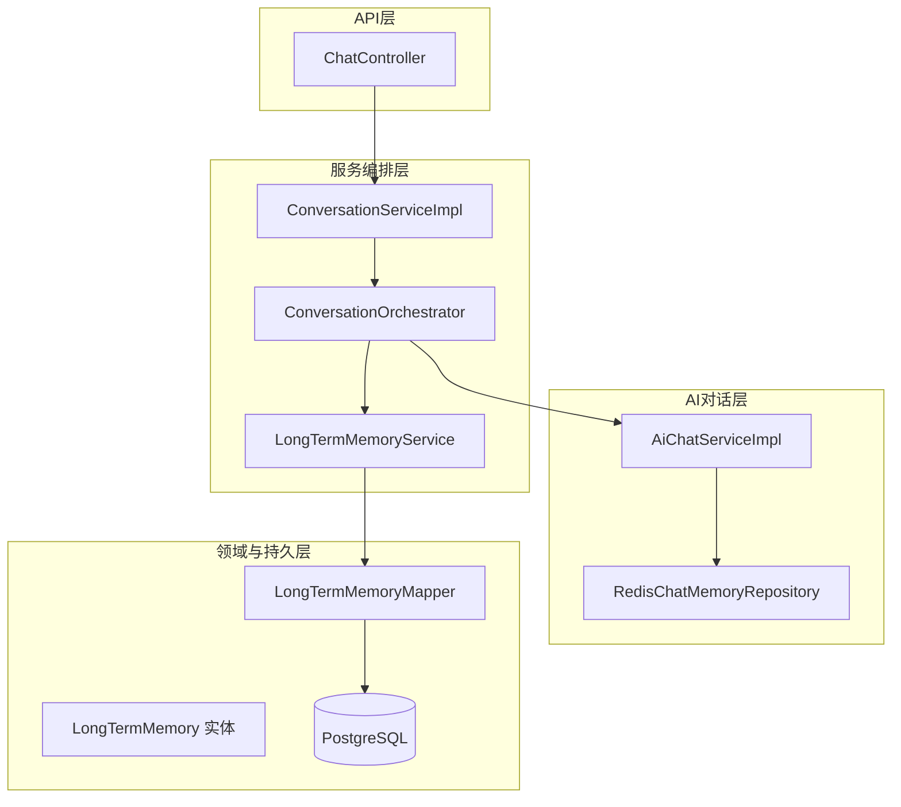
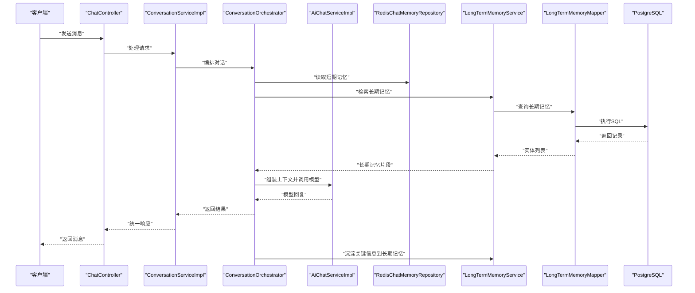
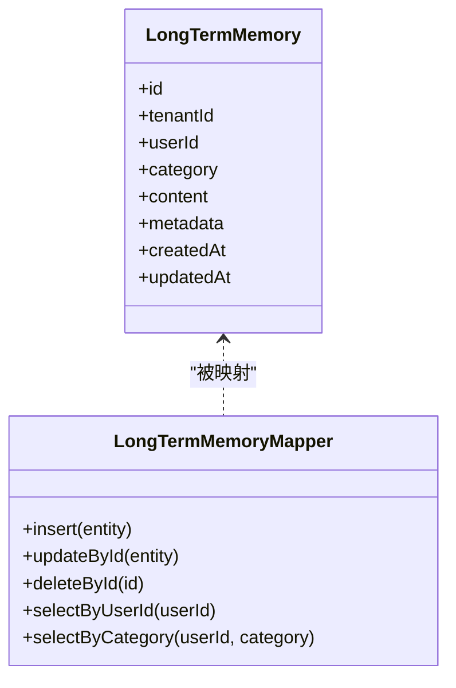
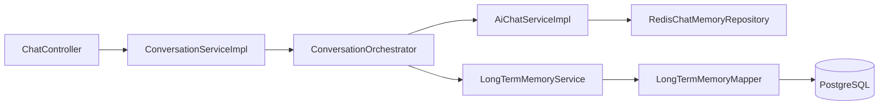

# 长期记忆增强系统

<cite>
**本文引用的文件**   
- [LongTermMemory.java](file://backend/counseling-domain/src/main/java/com/mindsafe/domain/entity/LongTermMemory.java)
- [LongTermMemoryMapper.java](file://backend/counseling-domain/src/main/java/com/mindsafe/domain/mapper/LongTermMemoryMapper.java)
- [V20__long_term_memories.sql](file://backend/counseling-app/src/main/resources/db/migration/V20__long_term_memories.sql)
- [RedisChatMemoryRepository.java](file://backend/counseling-ai/src/main/java/com/mindsafe/ai/memory/RedisChatMemoryRepository.java)
- [ConversationOrchestrator.java](file://backend/counseling-ai/src/main/java/com/mindsafe/ai/orchestrator/ConversationOrchestrator.java)
- [AiChatServiceImpl.java](file://backend/counseling-ai/src/main/java/com/mindsafe/ai/chat/AiChatServiceImpl.java)
- [LongTermMemoryService.java](file://backend/counseling-service/src/main/java/com/mindsafe/service/memory/LongTermMemoryService.java)
- [ConversationServiceImpl.java](file://backend/counseling-service/src/main/java/com/mindsafe/service/conversation/ConversationServiceImpl.java)
- [ChatController.java](file://backend/counseling-api/src/main/java/com/mindsafe/api/controller/ChatController.java)
- [application.yml](file://backend/counseling-app/src/main/resources/application.yml)
</cite>

## 目录
1. [引言](#引言)
2. [项目结构](#项目结构)
3. [核心组件](#核心组件)
4. [架构总览](#架构总览)
5. [详细组件分析](#详细组件分析)
6. [依赖关系分析](#依赖关系分析)
7. [性能考量](#性能考量)
8. [故障排查指南](#故障排查指南)
9. [结论](#结论)
10. [附录](#附录)

## 引言
本文件围绕“长期记忆增强系统”展开，聚焦于心理咨询系统中如何持久化、检索与利用跨会话的对话记忆，以支撑更连贯、个性化和安全的对话体验。该能力贯穿AI对话层、服务编排层与数据持久层，通过短期记忆（Redis）与长期记忆（PostgreSQL）协同工作，形成“近实时+可追溯”的记忆体系。

## 项目结构
围绕长期记忆的关键代码分布在以下模块：
- AI对话层：负责短期记忆读写、提示词组装与模型调用
- 服务编排层：协调对话流程、触发记忆写入与检索
- 领域模型与持久层：定义长期记忆实体、映射器与数据库迁移脚本
- API层：暴露聊天接口，驱动端到端流程

图表来源 
- [ChatController.java](file://backend/counseling-api/src/main/java/com/mindsafe/api/controller/ChatController.java)
- [ConversationServiceImpl.java](file://backend/counseling-service/src/main/java/com/mindsafe/service/conversation/ConversationServiceImpl.java)
- [ConversationOrchestrator.java](file://backend/counseling-ai/src/main/java/com/mindsafe/ai/orchestrator/ConversationOrchestrator.java)
- [AiChatServiceImpl.java](file://backend/counseling-ai/src/main/java/com/mindsafe/ai/chat/AiChatServiceImpl.java)
- [RedisChatMemoryRepository.java](file://backend/counseling-ai/src/main/java/com/mindsafe/ai/memory/RedisChatMemoryRepository.java)
- [LongTermMemory.java](file://backend/counseling-domain/src/main/java/com/mindsafe/domain/entity/LongTermMemory.java)
- [LongTermMemoryMapper.java](file://backend/counseling-domain/src/main/java/com/mindsafe/domain/mapper/LongTermMemoryMapper.java)

章节来源
- [application.yml](file://backend/counseling-app/src/main/resources/application.yml)

## 核心组件
- 长期记忆实体与映射
  - LongTermMemory：定义长期记忆的领域模型字段与语义
  - LongTermMemoryMapper：提供对长期记忆的CRUD访问
- 短期记忆仓库
  - RedisChatMemoryRepository：基于Redis的会话级短期记忆存取
- 对话编排与AI服务
  - ConversationOrchestrator：编排对话阶段、决定何时读取/写入长期记忆
  - AiChatServiceImpl：封装模型调用、上下文拼装与短期记忆交互
- 业务服务
  - LongTermMemoryService：对外暴露长期记忆的增删改查与聚合查询
  - ConversationServiceImpl：串联用户请求、编排器与记忆服务
- API入口
  - ChatController：接收聊天消息，返回流式或批量响应

章节来源
- [LongTermMemory.java](file://backend/counseling-domain/src/main/java/com/mindsafe/domain/entity/LongTermMemory.java)
- [LongTermMemoryMapper.java](file://backend/counseling-domain/src/main/java/com/mindsafe/domain/mapper/LongTermMemoryMapper.java)
- [RedisChatMemoryRepository.java](file://backend/counseling-ai/src/main/java/com/mindsafe/ai/memory/RedisChatMemoryRepository.java)
- [ConversationOrchestrator.java](file://backend/counseling-ai/src/main/java/com/mindsafe/ai/orchestrator/ConversationOrchestrator.java)
- [AiChatServiceImpl.java](file://backend/counseling-ai/src/main/java/com/mindsafe/ai/chat/AiChatServiceImpl.java)
- [LongTermMemoryService.java](file://backend/counseling-service/src/main/java/com/mindsafe/service/memory/LongTermMemoryService.java)
- [ConversationServiceImpl.java](file://backend/counseling-service/src/main/java/com/mindsafe/service/conversation/ConversationServiceImpl.java)
- [ChatController.java](file://backend/counseling-api/src/main/java/com/mindsafe/api/controller/ChatController.java)

## 架构总览
长期记忆增强系统的整体数据流如下：
- 客户端通过ChatController发起聊天请求
- ConversationServiceImpl进行参数校验与会话管理
- ConversationOrchestrator根据当前对话状态决定：
  - 从Redis短期记忆中读取最近N轮对话
  - 从长期记忆中检索相关历史摘要或关键事实
  - 将两者组合为Prompt上下文发送给AiChatServiceImpl
- AiChatServiceImpl调用大模型并生成回复
- 对话结束后，ConversationOrchestrator触发记忆沉淀：
  - 将关键信息写入LongTermMemoryService
  - 清理或压缩短期记忆

图表来源 
- [ChatController.java](file://backend/counseling-api/src/main/java/com/mindsafe/api/controller/ChatController.java)
- [ConversationServiceImpl.java](file://backend/counseling-service/src/main/java/com/mindsafe/service/conversation/ConversationServiceImpl.java)
- [ConversationOrchestrator.java](file://backend/counseling-ai/src/main/java/com/mindsafe/ai/orchestrator/ConversationOrchestrator.java)
- [AiChatServiceImpl.java](file://backend/counseling-ai/src/main/java/com/mindsafe/ai/chat/AiChatServiceImpl.java)
- [RedisChatMemoryRepository.java](file://backend/counseling-ai/src/main/java/com/mindsafe/ai/memory/RedisChatMemoryRepository.java)
- [LongTermMemoryService.java](file://backend/counseling-service/src/main/java/com/mindsafe/service/memory/LongTermMemoryService.java)
- [LongTermMemoryMapper.java](file://backend/counseling-domain/src/main/java/com/mindsafe/domain/mapper/LongTermMemoryMapper.java)

## 详细组件分析

### 长期记忆实体与存储
- 实体设计
  - LongTermMemory用于承载跨会话的关键信息，如用户画像、重要事件、偏好与风险标记等
  - 字段通常包含标识、租户/用户维度、内容、元数据与时间戳
- 持久化
  - LongTermMemoryMapper提供按用户/会话/标签等多维查询能力
  - V20__long_term_memories.sql定义了长期记忆表结构与索引策略

图表来源 
- [LongTermMemory.java](file://backend/counseling-domain/src/main/java/com/mindsafe/domain/entity/LongTermMemory.java)
- [LongTermMemoryMapper.java](file://backend/counseling-domain/src/main/java/com/mindsafe/domain/mapper/LongTermMemoryMapper.java)
- [V20__long_term_memories.sql](file://backend/counseling-app/src/main/resources/db/migration/V20__long_term_memories.sql)

章节来源
- [LongTermMemory.java](file://backend/counseling-domain/src/main/java/com/mindsafe/domain/entity/LongTermMemory.java)
- [LongTermMemoryMapper.java](file://backend/counseling-domain/src/main/java/com/mindsafe/domain/mapper/LongTermMemoryMapper.java)
- [V20__long_term_memories.sql](file://backend/counseling-app/src/main/resources/db/migration/V20__long_term_memories.sql)

### 短期记忆仓库（Redis）
- 职责
  - 维护单会话的最近N轮对话，支持快速追加与滑动窗口裁剪
  - 作为Prompt上下文的即时来源，降低延迟
- 关键点
  - 键空间按会话隔离，避免跨会话污染
  - 过期策略与容量限制保障内存占用可控

章节来源
- [RedisChatMemoryRepository.java](file://backend/counseling-ai/src/main/java/com/mindsafe/ai/memory/RedisChatMemoryRepository.java)

### 对话编排器（ConversationOrchestrator）
- 职责
  - 根据当前对话阶段决定读取短期记忆与长期记忆的粒度
  - 控制记忆沉淀时机（如会话结束、达到阈值、检测到高风险关键词）
- 决策要点
  - 何时合并短期与长期记忆
  - 何时触发摘要生成与去重
  - 安全策略：敏感信息过滤与脱敏

章节来源
- [ConversationOrchestrator.java](file://backend/counseling-ai/src/main/java/com/mindsafe/ai/orchestrator/ConversationOrchestrator.java)

### AI聊天服务（AiChatServiceImpl）
- 职责
  - 组装Prompt上下文（短期记忆+长期记忆+系统提示）
  - 调用模型并处理流式或非流式响应
  - 异常重试与降级策略
- 性能与安全
  - 超时与熔断配置
  - 输出内容安全审查与敏感词过滤

章节来源
- [AiChatServiceImpl.java](file://backend/counseling-ai/src/main/java/com/mindsafe/ai/chat/AiChatServiceImpl.java)

### 长期记忆服务（LongTermMemoryService）
- 职责
  - 提供统一的长期记忆读写接口
  - 聚合查询与去重合并
  - 与对话编排器协作完成记忆沉淀
- 事务与一致性
  - 在沉淀关键信息时保证幂等性与一致性

章节来源
- [LongTermMemoryService.java](file://backend/counseling-service/src/main/java/com/mindsafe/service/memory/LongTermMemoryService.java)

### 对话服务（ConversationServiceImpl）
- 职责
  - 接收并校验请求参数
  - 调用编排器完成对话流程
  - 统一错误码与响应格式

章节来源
- [ConversationServiceImpl.java](file://backend/counseling-service/src/main/java/com/mindsafe/service/conversation/ConversationServiceImpl.java)

### API控制器（ChatController）
- 职责
  - 暴露聊天接口，支持文本输入与流式输出
  - 鉴权与会话绑定

章节来源
- [ChatController.java](file://backend/counseling-api/src/main/java/com/mindsafe/api/controller/ChatController.java)

## 依赖关系分析
- 耦合度
  - ChatController仅依赖ConversationServiceImpl，保持接口清晰
  - ConversationServiceImpl依赖编排器与记忆服务，职责单一
  - ConversationOrchestrator依赖短期记忆仓库与长期记忆服务，解耦存储实现
  - AiChatServiceImpl依赖短期记忆仓库与外部模型服务
- 外部依赖
  - Redis：短期记忆缓存
  - PostgreSQL：长期记忆持久化
  - 大模型API：对话生成

图表来源 
- [ChatController.java](file://backend/counseling-api/src/main/java/com/mindsafe/api/controller/ChatController.java)
- [ConversationServiceImpl.java](file://backend/counseling-service/src/main/java/com/mindsafe/service/conversation/ConversationServiceImpl.java)
- [ConversationOrchestrator.java](file://backend/counseling-ai/src/main/java/com/mindsafe/ai/orchestrator/ConversationOrchestrator.java)
- [AiChatServiceImpl.java](file://backend/counseling-ai/src/main/java/com/mindsafe/ai/chat/AiChatServiceImpl.java)
- [RedisChatMemoryRepository.java](file://backend/counseling-ai/src/main/java/com/mindsafe/ai/memory/RedisChatMemoryRepository.java)
- [LongTermMemoryService.java](file://backend/counseling-service/src/main/java/com/mindsafe/service/memory/LongTermMemoryService.java)
- [LongTermMemoryMapper.java](file://backend/counseling-domain/src/main/java/com/mindsafe/domain/mapper/LongTermMemoryMapper.java)

章节来源
- [application.yml](file://backend/counseling-app/src/main/resources/application.yml)

## 性能考量
- 短期记忆
  - 使用Redis滑动窗口，O(1)追加与裁剪，适合高频读写
  - 合理设置过期时间与最大长度，避免内存膨胀
- 长期记忆
  - 按用户与类别建立索引，提升检索效率
  - 沉淀策略采用批量化与去重，减少写放大
- 模型调用
  - 设置合理的超时与重试上限，失败快速降级
  - 流式响应降低首字节延迟
- 并发与一致性
  - 记忆沉淀需幂等，避免重复写入
  - 读写分离场景下注意最终一致性

## 故障排查指南
- 短期记忆异常
  - 检查Redis连接与网络连通性
  - 确认会话键未冲突与过期策略正确
- 长期记忆写入失败
  - 查看数据库连接池与慢查询日志
  - 核对迁移脚本是否已执行（V20__long_term_memories.sql）
- 模型调用超时
  - 调整超时与重试策略
  - 检查限流与熔断配置
- 安全与合规
  - 确认敏感词库与输出过滤生效
  - 审计日志是否完整记录关键操作

章节来源
- [V20__long_term_memories.sql](file://backend/counseling-app/src/main/resources/db/migration/V20__long_term_memories.sql)
- [application.yml](file://backend/counseling-app/src/main/resources/application.yml)

## 结论
长期记忆增强系统通过短期记忆与长期记忆的协同，实现了跨会话的个性化与连续性对话。其分层架构清晰、职责明确，便于扩展与维护。建议持续优化记忆沉淀策略与检索算法，结合安全与性能监控，进一步提升用户体验与系统稳定性。

## 附录
- 关键迁移脚本
  - V20__long_term_memories.sql：长期记忆表结构与索引
- 配置项参考
  - application.yml：Redis、数据库与大模型相关配置