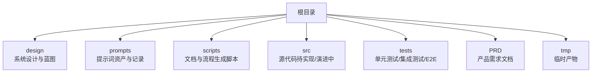
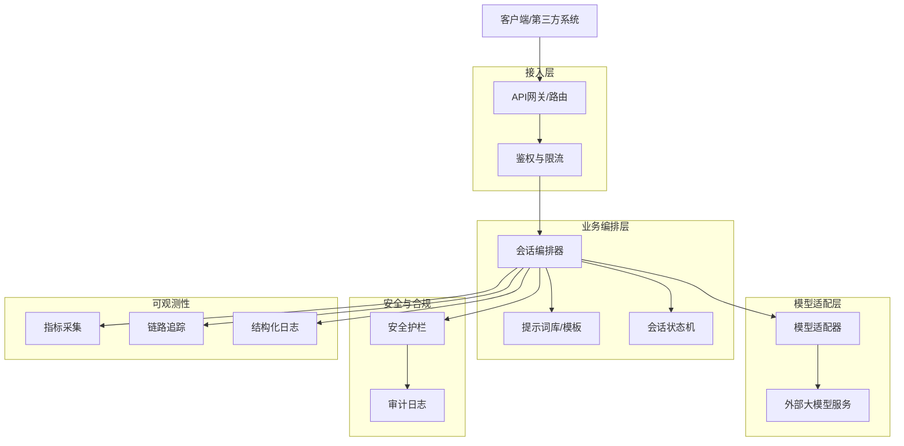
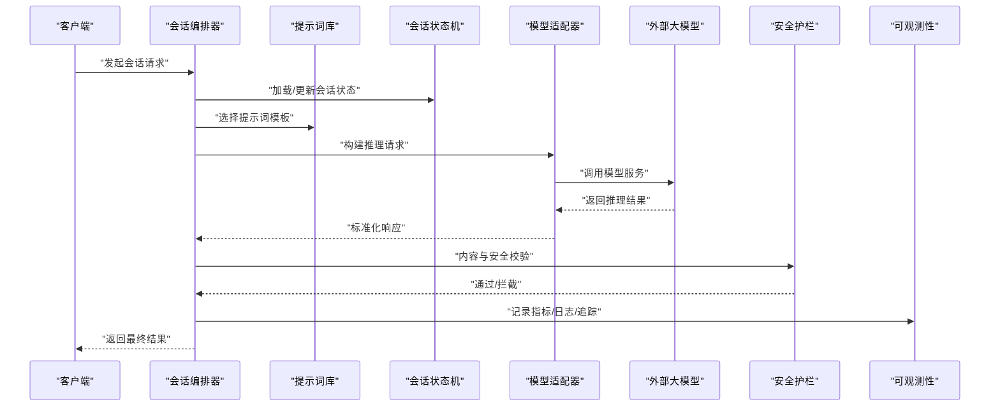
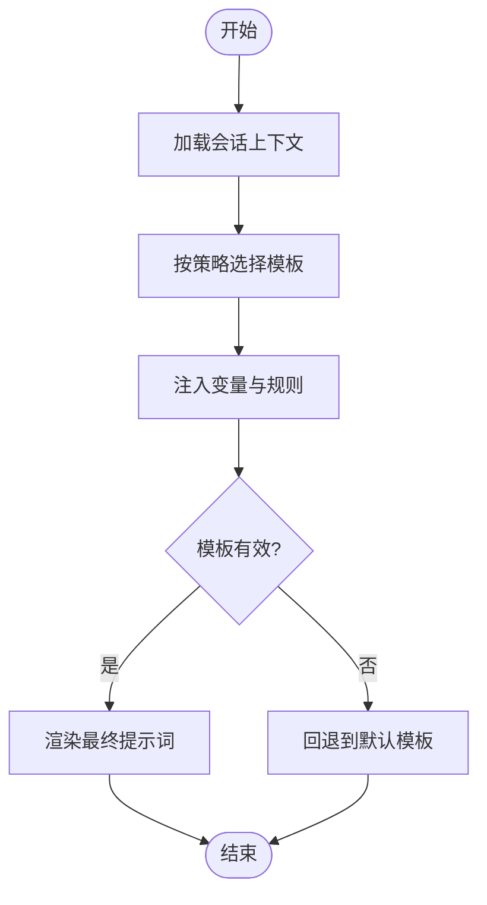
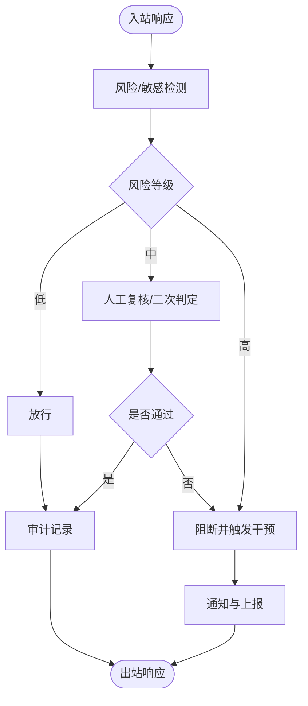
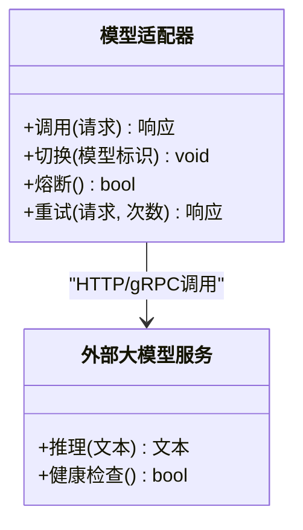
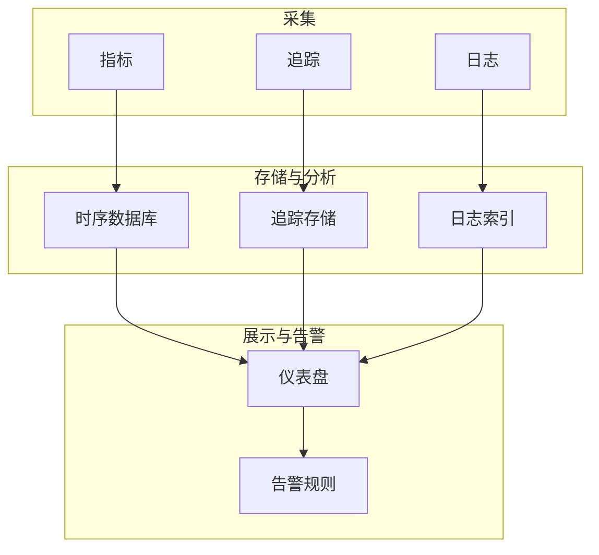
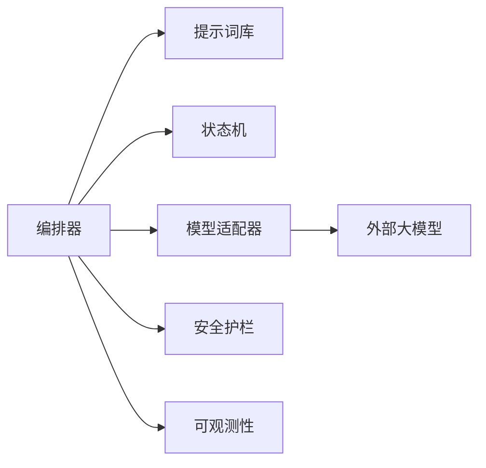

# 系统设计

<cite>
**本文引用的文件**   
- [README.md](file://README.md)
- [STRUCTURE.md](file://STRUCTURE.md)
- [design/BEACON.md](file://design/BEACON.md)
- [prompts/20260529-初始探索prompt记录.md](file://prompts/20260529-初始探索prompt记录.md)
</cite>

## 目录
1. [简介](#简介)
2. [项目结构](#项目结构)
3. [核心组件](#核心组件)
4. [架构总览](#架构总览)
5. [详细组件分析](#详细组件分析)
6. [依赖关系分析](#依赖关系分析)
7. [性能考虑](#性能考虑)
8. [故障排查指南](#故障排查指南)
9. [结论](#结论)
10. [附录](#附录)

## 简介
本设计文档面向AI心理咨询系统，聚焦于BEACON系统的整体架构与实现指导。文档从模块化结构、组件交互模式、数据流与处理流程入手，结合架构图、数据流向图与组件关系图，帮助开发者快速理解并落地系统。同时，文档总结了技术决策的权衡、性能优化策略与扩展性设计，并提供接口定义、配置选项与部署要求的实践建议。

## 项目结构
仓库采用“设计先行、脚本驱动、提示词资产化”的组织方式：
- design：存放系统级设计文档（如BEACON架构说明）
- prompts：沉淀提示词资产与版本记录，便于迭代与回溯
- scripts：自动化生成各类文档与流程树，提升研发效率
- src/tests：测试分层（单元、集成、端到端），保障质量
- README/STRUCTURE：项目概览与结构说明

**图表来源** 
- [STRUCTURE.md:1-200](file://STRUCTURE.md#L1-L200)
- [README.md:1-200](file://README.md#L1-L200)

**章节来源**
- [README.md:1-200](file://README.md#L1-L200)
- [STRUCTURE.md:1-200](file://STRUCTURE.md#L1-L200)

## 核心组件
基于设计文档与仓库现状，BEACON系统围绕以下核心能力展开：
- 会话编排与状态管理：负责对话生命周期、上下文维护与多轮推理调度
- 提示词工程与模板库：将咨询策略、CBT流程、安全护栏等固化为可复用提示词资产
- 模型服务适配层：抽象不同大模型的调用接口，统一输入输出格式与错误处理
- 安全与合规护栏：敏感信息识别、危机干预触发、伦理约束与审计日志
- 评估与反馈闭环：用户满意度、风险指标、模型表现监控与持续改进
- 运维与可观测性：日志、指标、追踪与告警，支撑生产稳定性

上述组件通过清晰的边界与契约进行协作，确保系统在可扩展性与安全性之间取得平衡。

**章节来源**
- [design/BEACON.md:1-200](file://design/BEACON.md#L1-L200)

## 架构总览
BEACON采用分层与事件驱动的混合架构：前端或客户端发起会话请求，经由网关进入编排层；编排层根据当前阶段选择提示词模板，调用模型服务适配层完成推理；结果经安全护栏校验后返回客户端，同时将关键事件写入可观测性子系统。

**图表来源** 
- [design/BEACON.md:1-200](file://design/BEACON.md#L1-L200)

## 详细组件分析

### 会话编排器
职责：
- 解析入站请求，确定会话阶段与目标策略
- 组装上下文与提示词，协调各子组件执行
- 管理重试、超时与降级策略

交互：
- 读取提示词库中的模板
- 更新会话状态机
- 调用模型适配器
- 触发安全护栏与可观测性上报

**图表来源** 
- [design/BEACON.md:1-200](file://design/BEACON.md#L1-L200)

**章节来源**
- [design/BEACON.md:1-200](file://design/BEACON.md#L1-L200)

### 提示词工程与模板库
职责：
- 将咨询策略、CBT流程、风险评估等固化为模板
- 支持变量注入、条件分支与版本化管理
- 提供模板检索与热更新机制

**图表来源** 
- [prompts/20260529-初始探索prompt记录.md:1-200](file://prompts/20260529-初始探索prompt记录.md#L1-L200)

**章节来源**
- [prompts/20260529-初始探索prompt记录.md:1-200](file://prompts/20260529-初始探索prompt记录.md#L1-L200)

### 安全与合规护栏
职责：
- 敏感信息与隐私保护
- 危机信号检测与升级流程
- 伦理约束与可解释性输出
- 审计留痕与合规报告

**图表来源** 
- [design/BEACON.md:1-200](file://design/BEACON.md#L1-L200)

**章节来源**
- [design/BEACON.md:1-200](file://design/BEACON.md#L1-L200)

### 模型适配层
职责：
- 统一对外模型接口（输入/输出/错误码）
- 支持多模型切换、负载均衡与熔断
- 缓存与重试策略、幂等控制

**图表来源** 
- [design/BEACON.md:1-200](file://design/BEACON.md#L1-L200)

**章节来源**
- [design/BEACON.md:1-200](file://design/BEACON.md#L1-L200)

### 可观测性与运维
职责：
- 指标采集（延迟、吞吐、错误率、成本）
- 链路追踪（跨组件调用链）
- 结构化日志与告警
- 容量规划与弹性伸缩

**图表来源** 
- [design/BEACON.md:1-200](file://design/BEACON.md#L1-L200)

**章节来源**
- [design/BEACON.md:1-200](file://design/BEACON.md#L1-L200)

## 依赖关系分析
- 模块内聚与解耦：编排器作为中枢，仅依赖明确定义的接口（提示词库、状态机、适配器、护栏、可观测性）
- 外部依赖：大模型服务、消息队列（可选）、对象存储（提示词/审计归档）
- 潜在循环依赖：应避免在适配器中反向依赖编排器，使用事件总线或回调解耦
- 集成点：网关鉴权、计费与配额、风控与合规平台

**图表来源** 
- [design/BEACON.md:1-200](file://design/BEACON.md#L1-L200)

**章节来源**
- [design/BEACON.md:1-200](file://design/BEACON.md#L1-L200)

## 性能考虑
- 并发与批处理：对非实时任务采用批量处理与异步队列，降低峰值压力
- 缓存策略：热点提示词与中间结果缓存，减少重复计算
- 连接池与超时：为模型适配层设置合理的连接池、读写超时与重试上限
- 降级与熔断：当外部模型不可用时，自动降级到轻量策略或排队等待
- 资源隔离：按租户/场景隔离资源，避免相互影响
- 成本优化：按需选择模型规格，结合缓存与预取降低调用成本

[本节为通用性能建议，不直接分析具体文件]

## 故障排查指南
- 常见问题定位：
  - 模型调用失败：检查适配器健康检查、熔断状态与重试计数
  - 提示词渲染异常：核对模板变量注入与版本一致性
  - 安全拦截误报：查看护栏规则阈值与审计日志
  - 性能抖动：观察指标与追踪，定位慢调用与热点路径
- 诊断工具：
  - 结构化日志关键字检索
  - 链路追踪ID关联跨组件问题
  - 指标看板对比基线，识别回归
- 应急措施：
  - 快速回滚提示词版本
  - 切换备用模型或降级策略
  - 开启限流与熔断保护

**章节来源**
- [design/BEACON.md:1-200](file://design/BEACON.md#L1-L200)

## 结论
BEACON系统以编排器为核心，结合提示词工程、模型适配、安全护栏与可观测性，形成高可用、可扩展且合规可控的AI心理咨询平台。通过明确的接口契约与分层架构，系统能够在保证用户体验的同时，满足安全与合规要求，并为后续功能扩展预留空间。

[本节为总结性内容，不直接分析具体文件]

## 附录

### 接口定义（示例）
- 会话创建
  - 方法：POST /api/v1/sessions
  - 请求体：包含用户标识、初始意图、上下文快照
  - 响应：会话ID、初始提示词摘要、下一步动作
- 消息发送
  - 方法：POST /api/v1/sessions/{id}/messages
  - 请求体：用户消息、阶段标记、附加参数
  - 响应：助手回复、风险提示、操作建议
- 会话查询
  - 方法：GET /api/v1/sessions/{id}
  - 响应：会话状态、历史摘要、审计摘要

[本节为概念性接口说明，不直接分析具体文件]

### 配置选项（示例）
- 模型适配
  - 模型名称、密钥、超时、重试次数、熔断阈值
- 提示词库
  - 模板目录、版本策略、热更新开关
- 安全护栏
  - 风险阈值、关键词白名单、干预策略
- 可观测性
  - 指标导出地址、日志级别、追踪采样率

[本节为概念性配置说明，不直接分析具体文件]

### 部署要求（示例）
- 运行环境
  - 容器化部署，Kubernetes编排
  - 环境变量与密钥管理（Secrets）
- 外部依赖
  - 大模型服务可达性与健康检查
  - 对象存储用于提示词与审计归档
- 网络与安全
  - 最小权限原则、TLS加密、访问控制
- 监控与告警
  - 指标、日志、追踪三件套齐备
  - 关键指标阈值与告警通道

[本节为概念性部署说明，不直接分析具体文件]