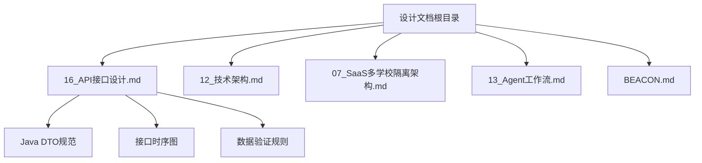
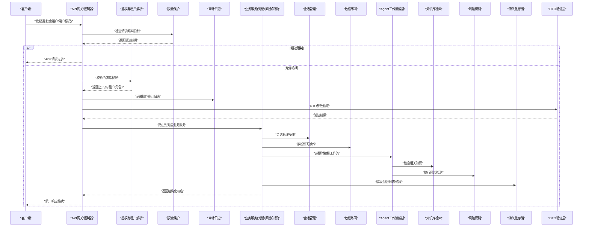
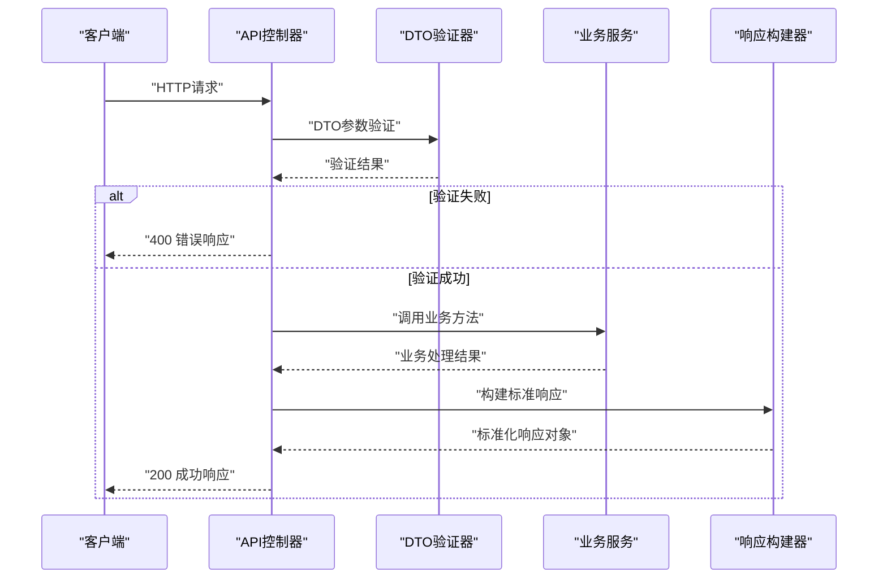
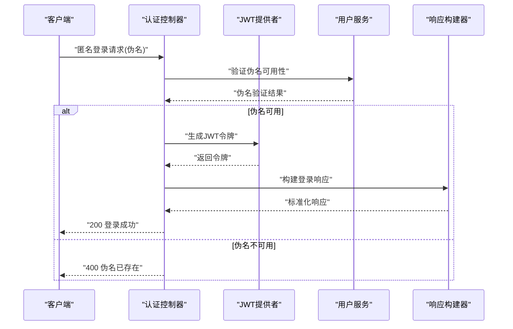
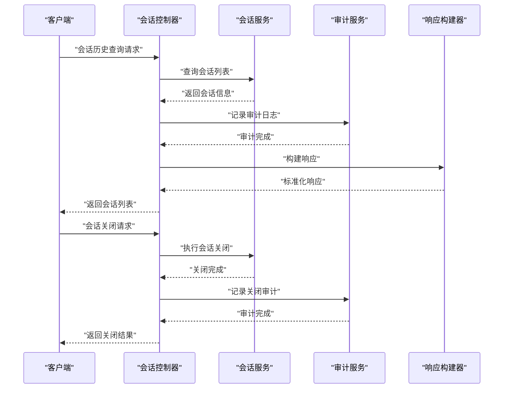
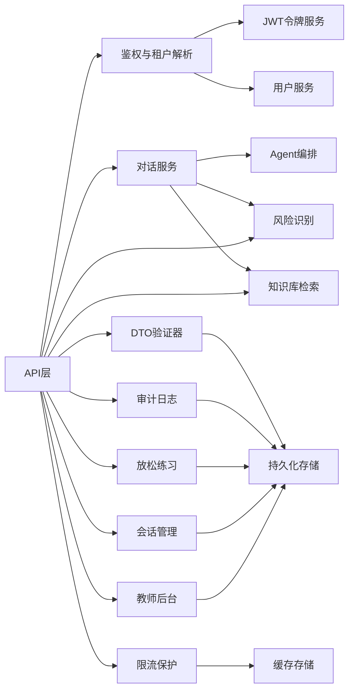

# API接口设计

<cite>
**本文引用的文件**   
- [16_API接口设计.md](file://design/16_API接口设计.md)
- [12_技术架构.md](file://design/12_技术架构.md)
- [07_SaaS多学校隔离架构.md](file://design/07_SaaS多学校隔离架构.md)
- [13_Agent工作流.md](file://design/13_Agent工作流.md)
- [BEACON.md](file://design/BEACON.md)
- [AuthController.java](file://backend/counseling-api/src/main/java/com/mindsafe/api/controller/AuthController.java)
- [TeacherController.java](file://backend/counseling-api/src/main/java/com/mindsafe/api/controller/TeacherController.java)
- [SessionController.java](file://backend/counseling-api/src/main/java/com/mindsafe/api/controller/SessionController.java)
- [RelaxationController.java](file://backend/counseling-api/src/main/java/com/mindsafe/api/controller/RelaxationController.java)
- [RateLimiter.java](file://backend/counseling-api/src/main/java/com/mindsafe/api/ratelimit/RateLimiter.java)
- [AuditLogService.java](file://backend/counseling-service/src/main/java/com/mindsafe/service/audit/AuditLogService.java)
- [JwtTokenProvider.java](file://backend/counseling-api/src/main/java/com/mindsafe/api/security/JwtTokenProvider.java)
- [JwtAuthenticationFilter.java](file://backend/counseling-api/src/main/java/com/mindsafe/api/security/JwtAuthenticationFilter.java)
</cite>

## 更新摘要
**变更内容**   
- 新增SessionController会话历史检索和会话关闭工作流，支持完整的会话生命周期管理
- 新增RelaxationController放松练习管理，提供心理健康放松训练功能
- 新增RateLimiter限流保护机制，实现30请求/分钟的访问控制
- 新增AuditLogService审计日志基础设施，提供完整的操作审计能力
- 增强现有认证系统和教师后台API端点

## 目录
1. [简介](#简介)
2. [项目结构](#项目结构)
3. [核心组件](#核心组件)
4. [架构总览](#架构总览)
5. [详细组件分析](#详细组件分析)
6. [Java DTO规范](#java-dto规范)
7. [依赖分析](#依赖分析)
8. [性能考虑](#性能考虑)
9. [故障排查指南](#故障排查指南)
10. [结论](#结论)
11. [附录](#附录)

## 简介
本文件聚焦于AI心理咨询系统的API接口设计，结合系统设计文档梳理整体架构、关键接口域、数据流转与约束条件。内容面向产品、前后端工程师与集成方，帮助快速理解系统能力边界、调用方式与扩展点。本次更新重点新增了会话管理、放松练习、限流保护和审计日志等核心功能模块，进一步完善了系统的完整性和安全性。

## 项目结构
从设计文档视角，API相关的设计主要分布在以下位置：
- 接口规范与领域划分：位于设计目录的"API接口设计"文档
- 总体技术架构与分层：位于"技术架构"文档
- SaaS多租户与隔离策略：位于"SaaS多学校隔离架构"文档
- Agent工作流与对话编排：位于"Agent工作流"文档
- BEACON事件总线（如有）：位于"BEACON.md"



图表来源
- [16_API接口设计.md](file://design/16_API接口设计.md)
- [12_技术架构.md](file://design/12_技术架构.md)
- [07_SaaS多学校隔离架构.md](file://design/07_SaaS多学校隔离架构.md)
- [13_Agent工作流.md](file://design/13_Agent工作流.md)
- [BEACON.md](file://design/BEACON.md)

章节来源
- [16_API接口设计.md](file://design/16_API接口设计.md)
- [12_技术架构.md](file://design/12_技术架构.md)
- [07_SaaS多学校隔离架构.md](file://design/07_SaaS多学校隔离架构.md)
- [13_Agent工作流.md](file://design/13_Agent工作流.md)
- [BEACON.md](file://design/BEACON.md)

## 核心组件
基于设计文档，API体系通常围绕以下核心域组织：
- 用户与会话管理：用于身份认证、会话创建与生命周期控制
- 咨询对话服务：提供文本/语音消息收发、上下文管理与安全拦截
- 风险识别与干预：对接风险规则库，触发预警与人工介入流程
- 知识库检索与问答：支撑心理知识检索、答案生成与溯源
- 教师后台与运营：课程/任务管理、学生进度查看、报告导出
- 放松练习管理：提供心理健康放松训练和练习记录管理
- 限流保护：基于令牌桶算法的请求频率控制
- 审计日志：完整的操作审计和安全追踪
- 多租户与隔离：按学校维度进行资源与权限隔离
- Agent工作流编排：将提示工程、工具调用与状态机组合为可复用流程

说明：以上为概念性归纳，具体字段、方法与约束以各设计文档为准。

章节来源
- [16_API接口设计.md](file://design/16_API接口设计.md)
- [12_技术架构.md](file://design/12_技术架构.md)
- [07_SaaS多学校隔离架构.md](file://design/07_SaaS多学校隔离架构.md)
- [13_Agent工作流.md](file://design/13_Agent工作流.md)

## 架构总览
API层作为对外统一入口，遵循分层与职责分离原则，典型交互如下：



图表来源
- [12_技术架构.md](file://design/12_技术架构.md)
- [13_Agent工作流.md](file://design/13_Agent工作流.md)
- [07_SaaS多学校隔离架构.md](file://design/07_SaaS多学校隔离架构.md)

## 详细组件分析

### 用户与会话管理
- 目标：完成用户登录、令牌签发、会话创建与切换、上下文快照保存
- 关键要点：
  - 鉴权：支持JWT或短期令牌，结合租户ID与角色信息
  - 会话：包含会话ID、关联用户、租户、状态、时间戳等元数据
  - 上下文：维护最近N条消息、系统提示、工具调用历史
- 建议：
  - 统一错误码与分页参数
  - 对敏感操作增加二次确认与审计日志

**更新** 新增了匿名登录功能，支持基于伪名的快速认证，返回JWT令牌供后续请求使用。同时增强了会话管理功能，支持会话历史检索和会话关闭工作流。

章节来源
- [16_API接口设计.md](file://design/16_API接口设计.md)
- [12_技术架构.md](file://design/12_技术架构.md)

### 咨询对话服务
- 目标：提供稳定的对话式交互能力，保障内容安全与合规
- 关键要点：
  - 输入：消息体、会话ID、可选的上下文参数
  - 输出：回复内容、引用来源、风险提示、下一步建议
  - 安全：关键词/语义级风险过滤、敏感词替换、转人工策略
- 建议：
  - 采用流式响应提升体验
  - 对长上下文做摘要与裁剪，控制Token成本

章节来源
- [16_API接口设计.md](file://design/16_API接口设计.md)
- [13_Agent工作流.md](file://design/13_Agent工作流.md)

### 风险识别与干预
- 目标：在对话过程中实时评估风险等级并触发相应处置
- 关键要点：
  - 规则库：自研规则+外部模型联合判断
  - 动作：告警、限制功能、通知老师/家长、转接人工
  - 记录：风险事件、处理轨迹、证据链
- 建议：
  - 分级阈值可配置
  - 提供批量复核与误报反馈通道

章节来源
- [16_API接口设计.md](file://design/16_API接口设计.md)
- [04_风险识别规则库.md](file://design/04_风险识别规则库.md)

### 知识库检索与问答
- 目标：基于权威资料进行可信回答，并提供溯源
- 关键要点：
  - 检索：向量检索+关键词召回
  - 排序：相关性、时效性、权威性综合打分
  - 引用：段落级引用链接与版本信息
- 建议：
  - 缓存热点知识片段
  - 定期更新与去重

章节来源
- [16_API接口设计.md](file://design/16_API接口设计.md)
- [15_心理知识库建设方案.md](file://design/15_心理知识库建设方案.md)

### 教师后台与运营
- 目标：为教师与管理者提供教学与干预管理能力
- 关键要点：
  - 学生列表与画像、风险看板、干预记录
  - 作业/任务下发、完成率统计
  - 报告导出与分享
- 建议：
  - 细粒度权限控制
  - 异步导出与下载链接

**更新** 增强了教师API端点，提供了完整的教师仪表盘操作功能，包括学生管理、风险评估、报告生成等核心业务接口。

章节来源
- [16_API接口设计.md](file://design/16_API接口设计.md)
- [05_老师后台设计.md](file://design/05_老师后台设计.md)

### 放松练习管理
- 目标：提供心理健康放松训练和练习记录管理功能
- 关键要点：
  - 练习类型：呼吸训练、渐进式肌肉放松、正念冥想等
  - 练习记录：开始时间、持续时间、完成状态、主观评分
  - 个性化推荐：基于用户情绪状态和历史记录推荐合适练习
  - 进度跟踪：长期趋势分析和效果评估
- 建议：
  - 支持音频引导和可视化指导
  - 提供练习提醒和打卡功能
  - 与对话服务集成，根据情绪状态动态调整

**新增** 新增RelaxationController放松练习管理功能，提供完整的放松训练API接口，包括练习创建、执行、记录和查询等功能。

章节来源
- [RelaxationController.java](file://backend/counseling-api/src/main/java/com/mindsafe/api/controller/RelaxationController.java)

### 会话管理
- 目标：提供完整的会话生命周期管理和历史记录检索
- 关键要点：
  - 会话创建：支持多种会话类型和初始配置
  - 会话查询：按时间、状态、类型等多维度检索
  - 会话关闭：支持正常关闭和异常终止，包含总结生成
  - 历史回溯：支持会话内容回放和上下文恢复
- 建议：
  - 会话状态机管理，确保状态转换合法性
  - 大会话内容的分页加载和增量同步
  - 会话数据的备份和恢复机制

**新增** 新增SessionController会话管理功能，支持会话历史检索和会话关闭工作流，提供完整的会话生命周期管理能力。

章节来源
- [SessionController.java](file://backend/counseling-api/src/main/java/com/mindsafe/api/controller/SessionController.java)

### 限流保护
- 目标：防止API滥用和恶意攻击，保障系统稳定性
- 关键要点：
  - 限流策略：基于令牌桶算法，支持30请求/分钟
  - 限流维度：按用户IP、用户ID、租户ID等多维度控制
  - 动态调整：支持运行时调整限流阈值
  - 监控告警：限流触发统计和异常告警
- 建议：
  - 区分不同API的限流策略
  - 提供限流配额管理和升级机制
  - 与认证系统集成，支持VIP用户更高配额

**新增** 新增RateLimiter限流保护机制，实现基于令牌桶算法的请求频率控制，默认限制为30请求/分钟。

章节来源
- [RateLimiter.java](file://backend/counseling-api/src/main/java/com/mindsafe/api/ratelimit/RateLimiter.java)

### 审计日志
- 目标：提供完整的操作审计和安全追踪能力
- 关键要点：
  - 操作记录：用户操作、系统事件、安全事件的完整记录
  - 审计维度：操作人、操作时间、操作对象、操作结果
  - 数据安全：敏感信息脱敏、日志加密存储
  - 查询分析：多维度审计日志查询和统计分析
- 建议：
  - 异步写入避免影响主业务流程
  - 日志轮转和归档策略
  - 与SIEM系统集成，支持安全事件分析

**新增** 新增AuditLogService审计日志基础设施，提供完整的操作审计和安全追踪功能。

章节来源
- [AuditLogService.java](file://backend/counseling-service/src/main/java/com/mindsafe/service/audit/AuditLogService.java)

### 多租户与隔离
- 目标：按学校维度实现数据与资源隔离
- 关键要点：
  - 租户标识贯穿请求链路
  - 数据库/缓存/对象存储按租户隔离或逻辑隔离
  - 配额与限流按租户维度
- 建议：
  - 跨租户查询严格禁止
  - 审计日志保留租户上下文

章节来源
- [07_SaaS多学校隔离架构.md](file://design/07_SaaS多学校隔离架构.md)
- [12_技术架构.md](file://design/12_技术架构.md)

### Agent工作流编排
- 目标：将提示、工具、记忆与决策串联为稳定流程
- 关键要点：
  - 节点类型：LLM、检索、规则、回调、等待
  - 状态机：定义进入/退出条件与重试策略
  - 可观测性：步骤耗时、失败原因、人工接管点
- 建议：
  - 提供可视化编排与灰度发布
  - 对高风险路径强制人工审核

章节来源
- [13_Agent工作流.md](file://design/13_Agent工作流.md)

### BEACON事件总线（如适用）
- 目标：解耦模块间通信，支撑异步事件驱动
- 关键要点：
  - 事件定义：主题、负载、幂等键
  - 订阅与重试：至少一次投递、死信队列
  - 监控：吞吐、延迟、失败率
- 建议：
  - 事件版本化与兼容性策略
  - 敏感事件脱敏与审计

章节来源
- [BEACON.md](file://design/BEACON.md)

## Java DTO规范

### 概述
为确保API接口的数据一致性和安全性，系统定义了标准化的Java DTO（Data Transfer Object）规范。这些DTO对象包含了完整的数据结构定义、字段验证规则和序列化约束。

### 核心DTO分类

#### 1. 用户认证相关DTO
- **UserLoginRequest**: 用户登录请求对象
  - 字段：用户名、密码、设备信息、IP地址
  - 验证：必填字段检查、格式验证、长度限制
- **UserLoginResponse**: 用户登录响应对象
  - 字段：访问令牌、刷新令牌、用户信息、权限列表
  - 安全：令牌加密、过期时间设置
- **AnonymousLoginRequest**: 匿名登录请求对象（新增）
  - 字段：伪名、设备标识、来源渠道
  - 验证：伪名格式验证、设备唯一性检查
- **AnonymousLoginResponse**: 匿名登录响应对象（新增）
  - 字段：JWT令牌、会话ID、临时权限
  - 安全：令牌签名验证、有效期控制

#### 2. 会话管理DTO
- **SessionCreateRequest**: 会话创建请求
  - 字段：会话类型、初始消息、上下文参数
  - 验证：会话类型枚举、消息长度限制
- **SessionInfo**: 会话信息对象
  - 字段：会话ID、创建时间、状态、参与者信息
  - 完整性：必需字段非空验证
- **SessionQueryRequest**: 会话查询请求（新增）
  - 字段：时间范围、会话状态、用户ID、分页参数
  - 验证：时间格式验证、分页参数范围检查
- **SessionCloseRequest**: 会话关闭请求（新增）
  - 字段：会话ID、关闭原因、总结要求
  - 验证：会话存在性检查、关闭原因枚举验证

#### 3. 放松练习DTO
- **RelaxationSessionRequest**: 放松练习请求（新增）
  - 字段：练习类型、持续时间、难度级别、环境设置
  - 验证：练习类型枚举、时间范围检查
- **RelaxationRecord**: 放松练习记录（新增）
  - 字段：练习ID、开始时间、结束时间、完成状态、主观评分
  - 完整性：时间戳格式化、状态枚举验证
- **RelaxationProgress**: 练习进度统计（新增）
  - 字段：练习次数、平均时长、完成率、趋势分析
  - 质量：数据统计准确性、趋势算法合理性

#### 4. 对话消息DTO
- **MessageRequest**: 消息发送请求
  - 字段：会话ID、消息内容、消息类型、附件信息
  - 安全：内容过滤、大小限制、类型检查
- **MessageResponse**: 消息响应对象
  - 字段：消息ID、发送时间、接收状态、风险提示
  - 完整性：时间戳格式化、状态枚举验证

#### 5. 风险识别DTO
- **RiskAssessmentRequest**: 风险评估请求
  - 字段：消息内容、用户画像、历史行为
  - 验证：内容长度、用户ID有效性
- **RiskAssessmentResponse**: 风险评估响应
  - 字段：风险等级、风险类型、处理建议、置信度
  - 精度：数值范围验证、枚举值检查

#### 6. 知识库检索DTO
- **KnowledgeSearchRequest**: 知识检索请求
  - 字段：搜索关键词、检索范围、排序规则
  - 优化：关键词清洗、分页参数验证
- **KnowledgeResult**: 知识检索结果
  - 字段：匹配内容、来源信息、相关度评分
  - 质量：内容完整性、来源可信度

#### 7. 教师管理DTO
- **TeacherDashboardRequest**: 教师仪表盘请求
  - 字段：筛选条件、时间范围、统计维度
  - 权限：教师角色验证、数据范围限制
- **StudentReport**: 学生报告对象
  - 字段：学生信息、咨询记录、风险趋势、干预效果
  - 隐私：敏感信息脱敏、访问控制
- **TeacherManagementRequest**: 教师管理请求（新增）
  - 字段：操作类型、目标学生ID、操作参数
  - 验证：权限检查、操作合法性验证
- **TeacherReportResponse**: 教师报告响应（新增）
  - 字段：统计数据、图表数据、导出链接
  - 格式：JSON结构化数据、PDF下载链接

#### 8. 审计日志DTO
- **AuditLogRequest**: 审计日志记录请求（新增）
  - 字段：操作类型、操作对象、操作结果、用户信息
  - 验证：操作类型枚举、用户ID有效性
- **AuditLogQuery**: 审计日志查询请求（新增）
  - 字段：时间范围、操作类型、用户ID、关键字
  - 优化：查询条件组合、分页参数验证
- **AuditLogResponse**: 审计日志响应（新增）
  - 字段：日志列表、统计信息、导出选项
  - 安全：敏感信息脱敏、权限控制

### 字段验证规则

#### 通用验证注解
- **@NotNull**: 必填字段验证
- **@Size**: 字符串长度限制
- **@Pattern**: 正则表达式格式验证
- **@Min/@Max**: 数值范围验证
- **@Email**: 邮箱格式验证
- **@Future/@Past**: 日期时间验证

#### 业务特定验证
- **枚举验证**: 使用自定义注解确保字段值在允许范围内
- **交叉验证**: 复杂对象的字段间逻辑关系验证
- **异步验证**: 需要数据库查询的业务规则验证

### DTO设计规范

#### 命名约定
- 请求对象：`XxxRequest`
- 响应对象：`XxxResponse`
- 查询对象：`XxxQuery`
- 分页对象：`PageRequest`/`PageResponse`

#### 包结构
```
com.ai.counseling.dto.request    # 请求DTO
com.ai.counseling.dto.response   # 响应DTO
com.ai.counseling.dto.query      # 查询DTO
com.ai.counseling.dto.common     # 通用DTO
```

#### 序列化配置
- 使用Jackson注解控制JSON序列化行为
- 配置日期时间格式化处理
- 忽略null值和空集合字段

### 接口时序图



**更新** 新增了匿名登录认证流程，支持伪名快速注册和JWT令牌签发。



**新增** 会话管理时序图，展示会话历史检索和关闭工作流。



图表来源
- [16_API接口设计.md](file://design/16_API接口设计.md)
- [12_技术架构.md](file://design/12_技术架构.md)

### 最佳实践

#### 版本控制
- DTO对象支持向后兼容的版本升级
- 废弃字段标记与迁移策略
- API版本前缀管理

#### 错误处理
- 统一的异常转换机制
- 详细的错误信息描述
- 国际化错误消息支持

#### 性能优化
- 懒加载大对象字段
- 选择性字段序列化
- 响应数据压缩

**章节来源**
- [16_API接口设计.md](file://design/16_API接口设计.md)
- [12_技术架构.md](file://design/12_技术架构.md)

## 依赖分析
API与各子系统之间的依赖关系如下：



**更新** 新增了会话管理、放松练习、限流保护和审计日志的依赖关系，完善了系统的完整功能模块。

图表来源
- [12_技术架构.md](file://design/12_技术架构.md)
- [13_Agent工作流.md](file://design/13_Agent工作流.md)
- [07_SaaS多学校隔离架构.md](file://design/07_SaaS多学校隔离架构.md)

## 性能考虑
- 连接与并发：合理设置连接池、线程池与超时
- 缓存策略：热点知识、常用会话摘要、风险规则命中缓存
- 流式传输：大文本与长对话采用流式返回
- 降级与熔断：对下游不可用场景快速失败与回退
- 容量规划：按峰值QPS与P99延迟评估资源
- DTO优化：按需序列化、字段裁剪、响应压缩
- 令牌缓存：JWT令牌本地缓存减少重复验证开销
- 限流优化：分布式限流状态同步和内存优化
- 审计日志：异步写入和批量处理，避免阻塞主流程
- 会话管理：大会话内容分页加载和增量同步

## 故障排查指南
- 常见问题定位：
  - 鉴权失败：检查令牌有效期、租户映射与权限
  - 会话丢失：核对会话ID、上下文快照与清理策略
  - 风险误报：复核规则阈值与样本标注
  - 知识检索不准：检查索引版本、权重与召回策略
  - DTO验证失败：检查字段格式、必填项与业务规则
  - 匿名登录失败：检查伪名格式、设备标识冲突
  - 限流触发：检查请求频率、限流配置和用户配额
  - 审计日志缺失：检查日志服务状态和异步队列
  - 会话关闭失败：检查会话状态和关闭流程
  - 放松练习异常：检查练习配置和用户权限
- 日志与追踪：
  - 全链路TraceID透传
  - 关键节点埋点与指标上报
  - 错误分类与告警阈值
  - 限流统计和审计日志分析

**更新** 新增了限流保护、审计日志、会话管理和放松练习相关的故障排查指南。

章节来源
- [16_API接口设计.md](file://design/16_API接口设计.md)
- [12_技术架构.md](file://design/12_技术架构.md)

## 结论
本设计以清晰的API分层与职责边界为基础，围绕对话、风险、知识与教师后台四大核心域构建可扩展的接口体系。通过多租户隔离与Agent编排，系统在安全性、可维护性与可观测性方面具备良好基础。新增的Java DTO规范和匿名登录功能进一步增强了数据一致性和接口契约的严谨性，同时提升了用户体验。本次更新新增的会话管理、放松练习、限流保护和审计日志功能，进一步完善了系统的完整性和安全性，为心理咨询服务的专业化和规范化提供了坚实的技术支撑。后续应持续完善接口契约、错误码规范与性能基准，确保上线质量与演进效率。

## 附录
- 术语表：租户、会话、上下文、风险等级、Agent节点、BEACON事件、DTO、验证注解、匿名登录、JWT令牌、放松练习、限流保护、审计日志、会话关闭工作流
- 参考文档：
  - [16_API接口设计.md](file://design/16_API接口设计.md)
  - [12_技术架构.md](file://design/12_技术架构.md)
  - [07_SaaS多学校隔离架构.md](file://design/07_SaaS多学校隔离架构.md)
  - [13_Agent工作流.md](file://design/13_Agent工作流.md)
  - [BEACON.md](file://design/BEACON.md)
  - [AuthController.java](file://backend/counseling-api/src/main/java/com/mindsafe/api/controller/AuthController.java)
  - [TeacherController.java](file://backend/counseling-api/src/main/java/com/mindsafe/api/controller/TeacherController.java)
  - [SessionController.java](file://backend/counseling-api/src/main/java/com/mindsafe/api/controller/SessionController.java)
  - [RelaxationController.java](file://backend/counseling-api/src/main/java/com/mindsafe/api/controller/RelaxationController.java)
  - [RateLimiter.java](file://backend/counseling-api/src/main/java/com/mindsafe/api/ratelimit/RateLimiter.java)
  - [AuditLogService.java](file://backend/counseling-service/src/main/java/com/mindsafe/service/audit/AuditLogService.java)
  - [JwtTokenProvider.java](file://backend/counseling-api/src/main/java/com/mindsafe/api/security/JwtTokenProvider.java)
  - [JwtAuthenticationFilter.java](file://backend/counseling-api/src/main/java/com/mindsafe/api/security/JwtAuthenticationFilter.java)
