# SaaS多学校隔离架构

<cite>
**本文引用的文件**   
- [SaaS多学校隔离架构.md](file://design/07_SaaS多学校隔离架构.md)
- [技术架构.md](file://design/12_技术架构.md)
- [API接口设计.md](file://design/16_API接口设计.md)
- [前端架构设计.md](file://design/17_前端架构设计.md)
- [BEACON.md](file://design/BEACON.md)
- [DESIGN-OVERVIEW.md](file://design/DESIGN-OVERVIEW.md)
</cite>

## 目录
1. [简介](#简介)
2. [项目结构](#项目结构)
3. [核心组件](#核心组件)
4. [架构总览](#架构总览)
5. [详细组件分析](#详细组件分析)
6. [依赖关系分析](#依赖关系分析)
7. [性能与扩展性](#性能与扩展性)
8. [故障排查指南](#故障排查指南)
9. [结论](#结论)
10. [附录](#附录)

## 简介
本文件围绕“SaaS多学校隔离架构”进行系统化说明，聚焦于在多租户（多学校）场景下的数据、权限、配置与可观测性隔离策略。文档从整体架构到关键组件逐一展开，并结合现有设计文档中的要点，给出面向实施与运维的可操作建议。

## 项目结构
本项目的设计文档集中于 design 目录，其中与多学校隔离直接相关的包括：
- 多学校隔离总体方案
- 技术架构总览
- API 接口设计
- 前端架构设计
- BEACON 可观测性与治理规范
- 设计总览

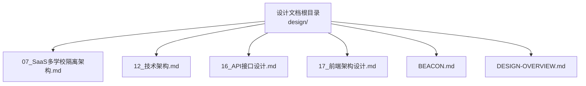

**图表来源** 
- [SaaS多学校隔离架构.md](file://design/07_SaaS多学校隔离架构.md)
- [技术架构.md](file://design/12_技术架构.md)
- [API接口设计.md](file://design/16_API接口设计.md)
- [前端架构设计.md](file://design/17_前端架构设计.md)
- [BEACON.md](file://design/BEACON.md)
- [DESIGN-OVERVIEW.md](file://design/DESIGN-OVERVIEW.md)

**章节来源**
- [SaaS多学校隔离架构.md](file://design/07_SaaS多学校隔离架构.md)
- [技术架构.md](file://design/12_技术架构.md)
- [API接口设计.md](file://design/16_API接口设计.md)
- [前端架构设计.md](file://design/17_前端架构设计.md)
- [BEACON.md](file://design/BEACON.md)
- [DESIGN-OVERVIEW.md](file://design/DESIGN-OVERVIEW.md)

## 核心组件
围绕多学校隔离，系统通常由以下核心组件构成（概念性描述，便于理解整体边界与职责）：
- 租户识别与路由：在网关或应用入口解析租户标识（如 schoolId），并注入上下文贯穿后续处理链路。
- 数据访问层：基于租户标识实现行级或库级隔离，确保查询与写入仅作用于当前学校的数据范围。
- 权限与授权：结合角色与组织维度，控制跨校访问与越权风险。
- 配置中心：按学校维度管理差异化配置（功能开关、提示词模板、业务规则等）。
- 审计与可观测性：记录租户维度的操作日志、指标与追踪，支撑问题定位与合规审计。
- 缓存与消息：为共享资源提供租户键空间隔离，避免数据串扰。

[本节为概念性概述，不直接分析具体文件]

## 架构总览
下图展示多学校隔离的总体分层与交互关系，强调请求进入后的租户识别、上下文传播、数据隔离与可观测性闭环。

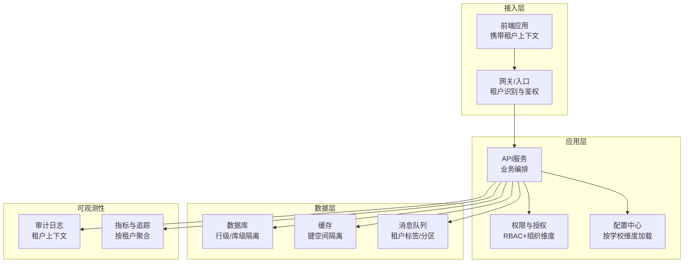

**图表来源** 
- [技术架构.md](file://design/12_技术架构.md)
- [SaaS多学校隔离架构.md](file://design/07_SaaS多学校隔离架构.md)

**章节来源**
- [技术架构.md](file://design/12_技术架构.md)
- [SaaS多学校隔离架构.md](file://design/07_SaaS多学校隔离架构.md)

## 详细组件分析

### 租户识别与上下文传播
- 目标：在请求进入时稳定识别学校租户，并将租户标识贯穿至所有下游调用。
- 关键点：
  - 统一入口解析租户标识（域名、路径、Header 或 Cookie）。
  - 将租户标识放入不可篡改的上下文对象，供各层读取。
  - 对缺失或非法租户标识进行快速失败与告警。
- 建议：
  - 在网关层完成基础校验，减少后端压力。
  - 对关键操作增加二次校验，防止上下文被覆盖。

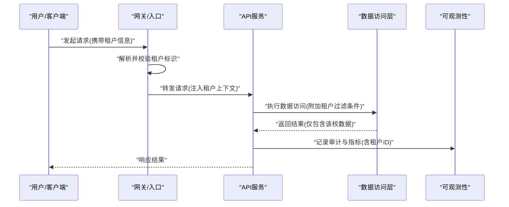

**图表来源** 
- [SaaS多学校隔离架构.md](file://design/07_SaaS多学校隔离架构.md)
- [技术架构.md](file://design/12_技术架构.md)

**章节来源**
- [SaaS多学校隔离架构.md](file://design/07_SaaS多学校隔离架构.md)
- [技术架构.md](file://design/12_技术架构.md)

### 数据隔离策略
- 行级隔离：通过每条记录携带学校标识并在查询中强制附加过滤条件，适用于单库多租户。
- 库级隔离：按学校划分独立数据库实例或Schema，适用于强隔离与合规要求高的场景。
- 混合模式：核心元数据共享，敏感数据按库隔离，兼顾成本与安全。
- 注意事项：
  - 所有SQL必须强制附加租户过滤条件，禁止绕过。
  - 批量操作需保证事务内一致性，避免部分成功导致数据不一致。
  - 迁移与备份策略需考虑租户粒度。

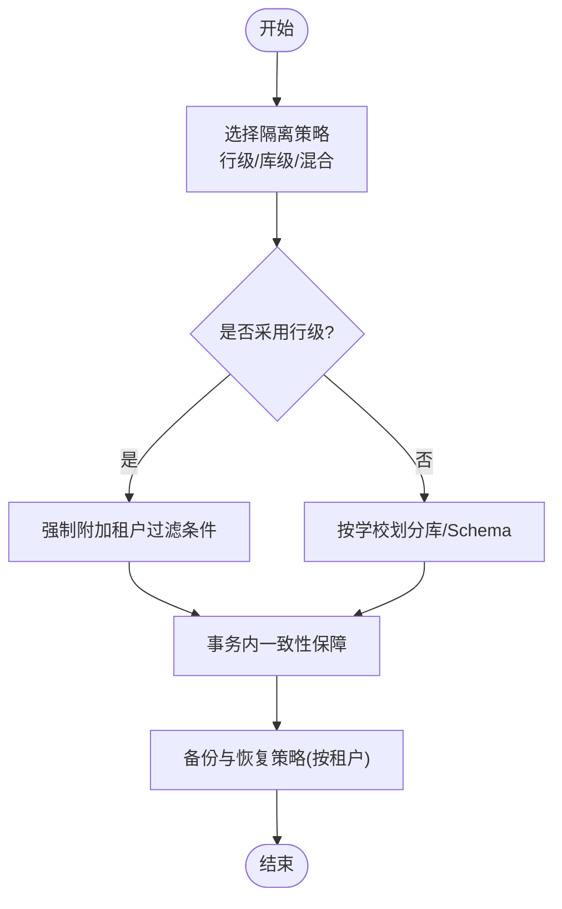

**图表来源** 
- [SaaS多学校隔离架构.md](file://design/07_SaaS多学校隔离架构.md)
- [技术架构.md](file://design/12_技术架构.md)

**章节来源**
- [SaaS多学校隔离架构.md](file://design/07_SaaS多学校隔离架构.md)
- [技术架构.md](file://design/12_技术架构.md)

### 权限与授权模型
- 维度：用户-角色-组织（学校）三维矩阵，确保最小权限原则。
- 控制点：
  - 接口级鉴权：基于角色与组织范围校验。
  - 数据级鉴权：结合租户上下文限制数据可见范围。
  - 跨校访问：需要显式审批与审计。
- 建议：
  - 使用统一的权限中间件集中处理。
  - 对高风险操作引入双人复核与审计留痕。

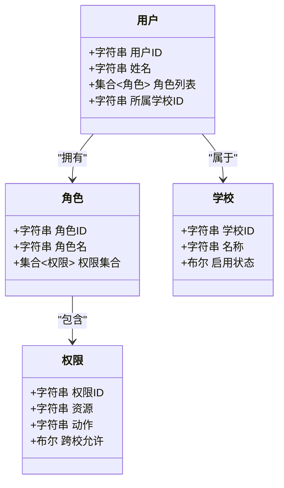

**图表来源** 
- [SaaS多学校隔离架构.md](file://design/07_SaaS多学校隔离架构.md)
- [技术架构.md](file://design/12_技术架构.md)

**章节来源**
- [SaaS多学校隔离架构.md](file://design/07_SaaS多学校隔离架构.md)
- [技术架构.md](file://design/12_技术架构.md)

### 配置管理与差异化能力
- 按学校维度加载配置，支持功能开关、提示词模板、业务规则等差异化。
- 配置变更应灰度发布，具备回滚与审计能力。
- 建议：
  - 使用配置中心统一管理，避免硬编码。
  - 对敏感配置加密存储与传输。

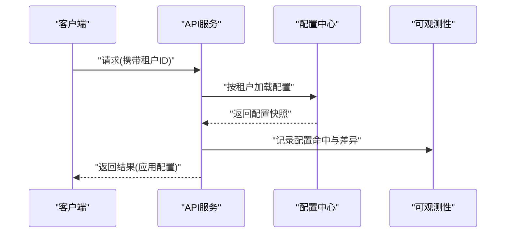

**图表来源** 
- [SaaS多学校隔离架构.md](file://design/07_SaaS多学校隔离架构.md)
- [技术架构.md](file://design/12_技术架构.md)

**章节来源**
- [SaaS多学校隔离架构.md](file://design/07_SaaS多学校隔离架构.md)
- [技术架构.md](file://design/12_技术架构.md)

### 可观测性与审计（BEACON）
- 指标与追踪：按租户维度聚合，便于容量规划与问题定位。
- 审计日志：记录关键操作的租户上下文、主体、资源与结果。
- 建议：
  - 统一埋点规范，避免遗漏关键事件。
  - 对敏感信息进行脱敏处理。

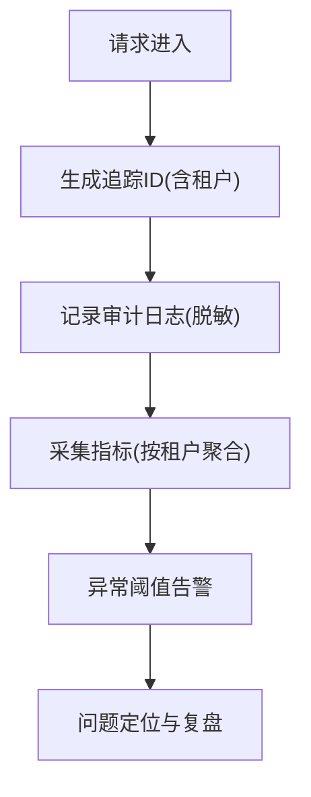

**图表来源** 
- [BEACON.md](file://design/BEACON.md)
- [SaaS多学校隔离架构.md](file://design/07_SaaS多学校隔离架构.md)

**章节来源**
- [BEACON.md](file://design/BEACON.md)
- [SaaS多学校隔离架构.md](file://design/07_SaaS多学校隔离架构.md)

### API 设计与租户上下文
- 接口设计需明确租户上下文的传递方式（Header、路径参数等）。
- 错误码与响应体应包含足够的诊断信息，同时避免泄露敏感数据。
- 建议：
  - 在网关层统一校验租户字段。
  - 对分页、排序、过滤等通用能力提供租户安全默认值。

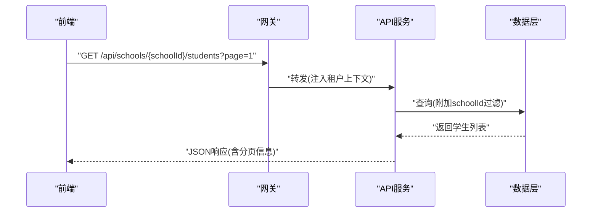

**图表来源** 
- [API接口设计.md](file://design/16_API接口设计.md)
- [SaaS多学校隔离架构.md](file://design/07_SaaS多学校隔离架构.md)

**章节来源**
- [API接口设计.md](file://design/16_API接口设计.md)
- [SaaS多学校隔离架构.md](file://design/07_SaaS多学校隔离架构.md)

### 前端架构与租户感知
- 前端需在路由、请求头、本地存储中维护租户上下文。
- 页面与菜单按学校维度动态渲染，避免越权访问。
- 建议：
  - 在路由守卫中校验租户合法性。
  - 对静态资源与CDN路径按租户隔离或白名单管理。

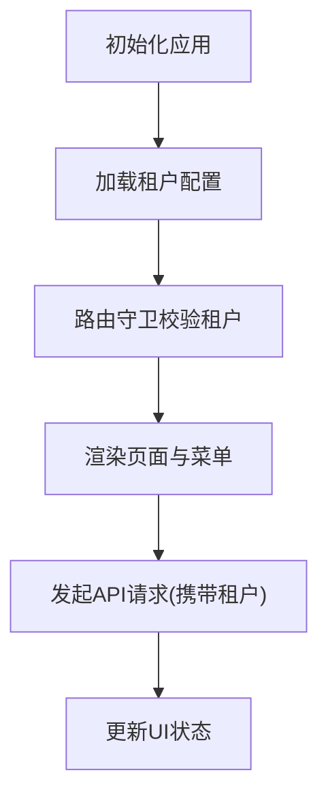

**图表来源** 
- [前端架构设计.md](file://design/17_前端架构设计.md)
- [SaaS多学校隔离架构.md](file://design/07_SaaS多学校隔离架构.md)

**章节来源**
- [前端架构设计.md](file://design/17_前端架构设计.md)
- [SaaS多学校隔离架构.md](file://design/07_SaaS多学校隔离架构.md)

## 依赖关系分析
- 组件耦合：
  - 网关与API服务：强耦合于租户上下文协议。
  - API与服务内部模块：通过上下文与配置中心解耦。
  - 数据层与ORM：通过拦截器或基类强制附加租户过滤。
- 外部依赖：
  - 配置中心、认证服务、日志与指标平台。
- 潜在风险：
  - 上下文丢失或被覆盖。
  - 第三方SDK未遵循租户隔离约定。
  - 缓存键冲突导致数据串扰。

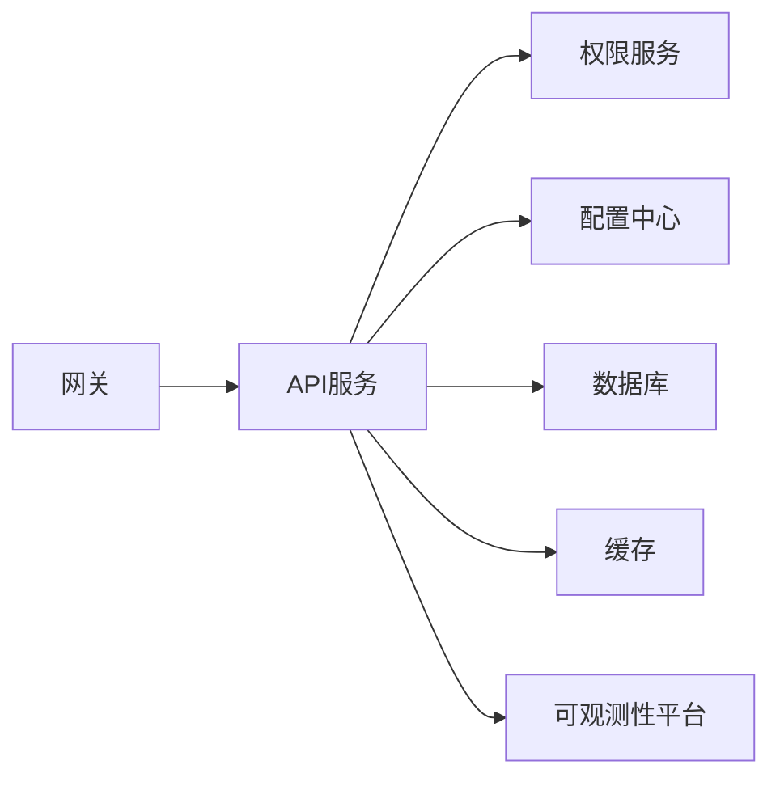

**图表来源** 
- [技术架构.md](file://design/12_技术架构.md)
- [SaaS多学校隔离架构.md](file://design/07_SaaS多学校隔离架构.md)

**章节来源**
- [技术架构.md](file://design/12_技术架构.md)
- [SaaS多学校隔离架构.md](file://design/07_SaaS多学校隔离架构.md)

## 性能与扩展性
- 水平扩展：无状态服务横向扩容，结合租户亲和调度优化热点学校访问。
- 缓存策略：按租户键空间隔离，合理设置TTL与失效策略。
- 数据库：读写分离、分库分表可按学校维度规划；慢查询监控与索引优化。
- 消息队列：按租户分区或标签路由，避免长尾影响。

[本节为通用指导，不直接分析具体文件]

## 故障排查指南
- 常见问题：
  - 租户上下文缺失：检查网关注入与链路透传。
  - 数据越权：核查SQL过滤条件与权限中间件。
  - 配置不一致：对比配置中心版本与生效快照。
  - 缓存污染：确认键前缀与过期策略。
- 定位手段：
  - 基于追踪ID串联全链路日志。
  - 按租户聚合指标，观察异常峰值。
  - 审计日志回溯关键操作。

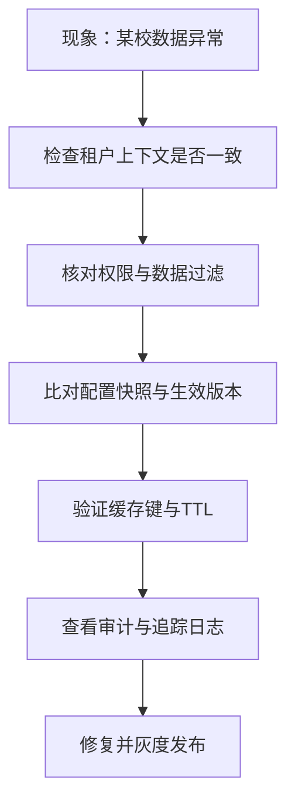

**图表来源** 
- [BEACON.md](file://design/BEACON.md)
- [SaaS多学校隔离架构.md](file://design/07_SaaS多学校隔离架构.md)

**章节来源**
- [BEACON.md](file://design/BEACON.md)
- [SaaS多学校隔离架构.md](file://design/07_SaaS多学校隔离架构.md)

## 结论
多学校隔离的核心在于“一致的租户上下文、严格的权限与数据过滤、完善的可观测性”。通过网关前置校验、应用层上下文传播、数据层强制过滤以及配置与缓存的租户化，可在保证安全与合规的前提下实现高效的多租户SaaS交付。

[本节为总结性内容，不直接分析具体文件]

## 附录
- 术语：
  - 租户：指代一个独立的学校实体。
  - 行级隔离：在同一数据库中通过字段区分不同租户数据。
  - 库级隔离：为每个租户分配独立数据库实例或Schema。
- 参考文档：
  - 设计总览与治理规范有助于统一落地标准。

[本节为补充信息，不直接分析具体文件]
