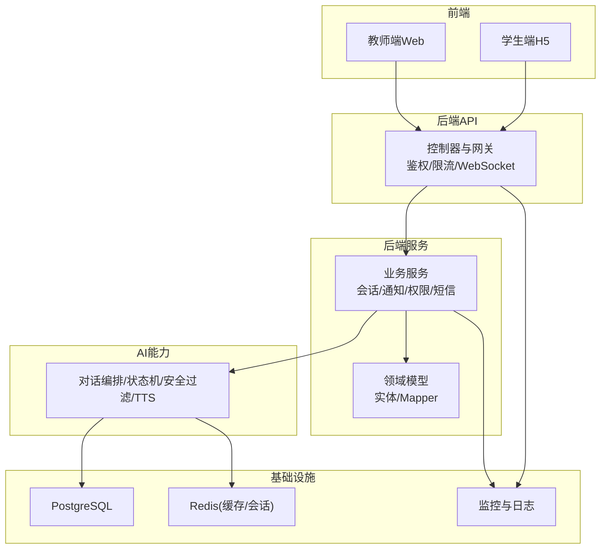
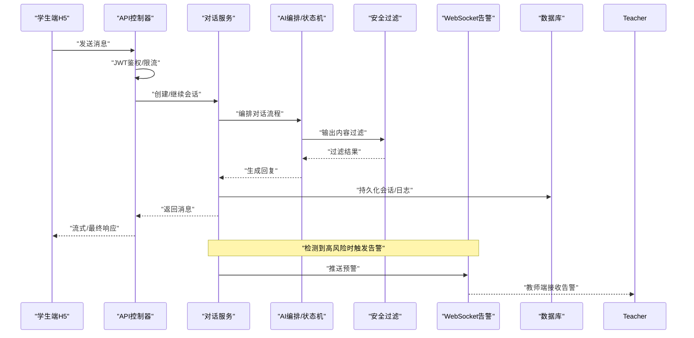
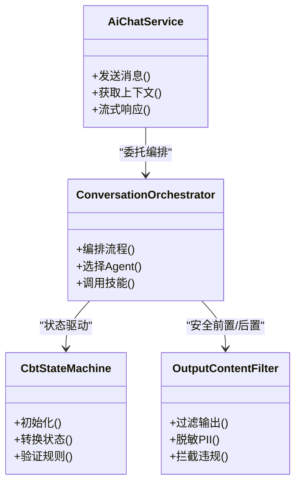
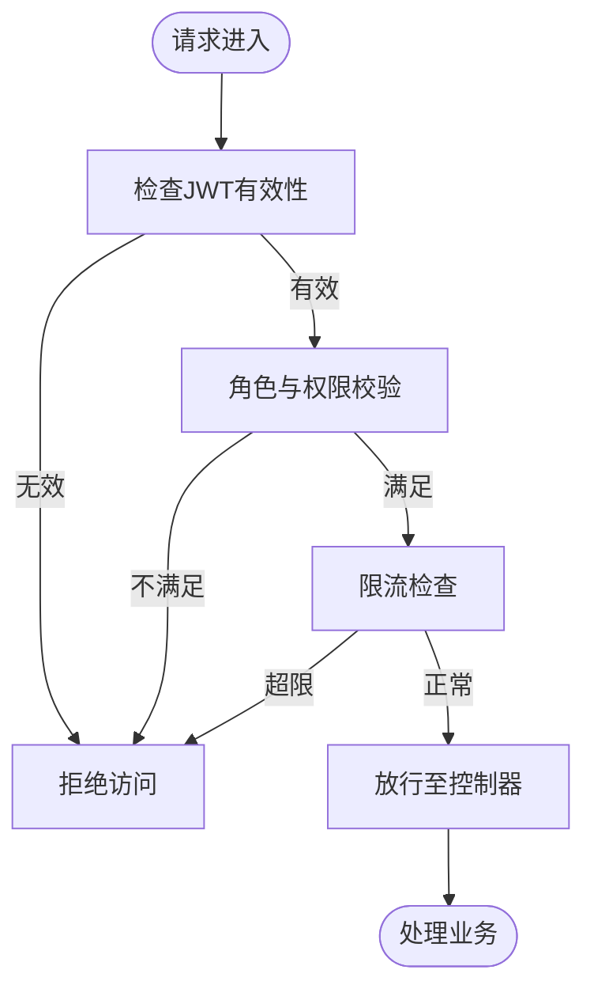
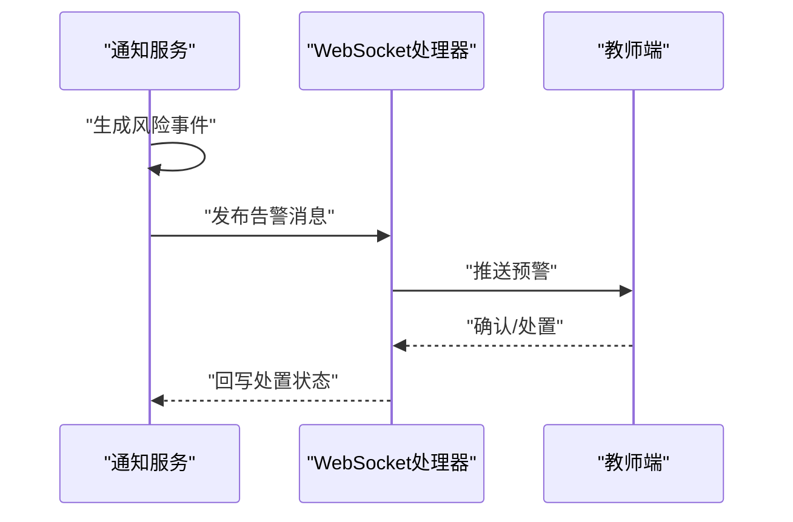
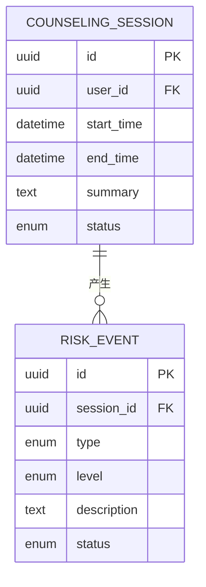
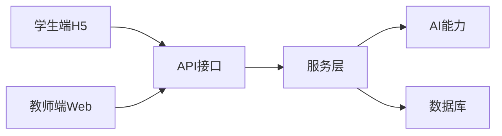
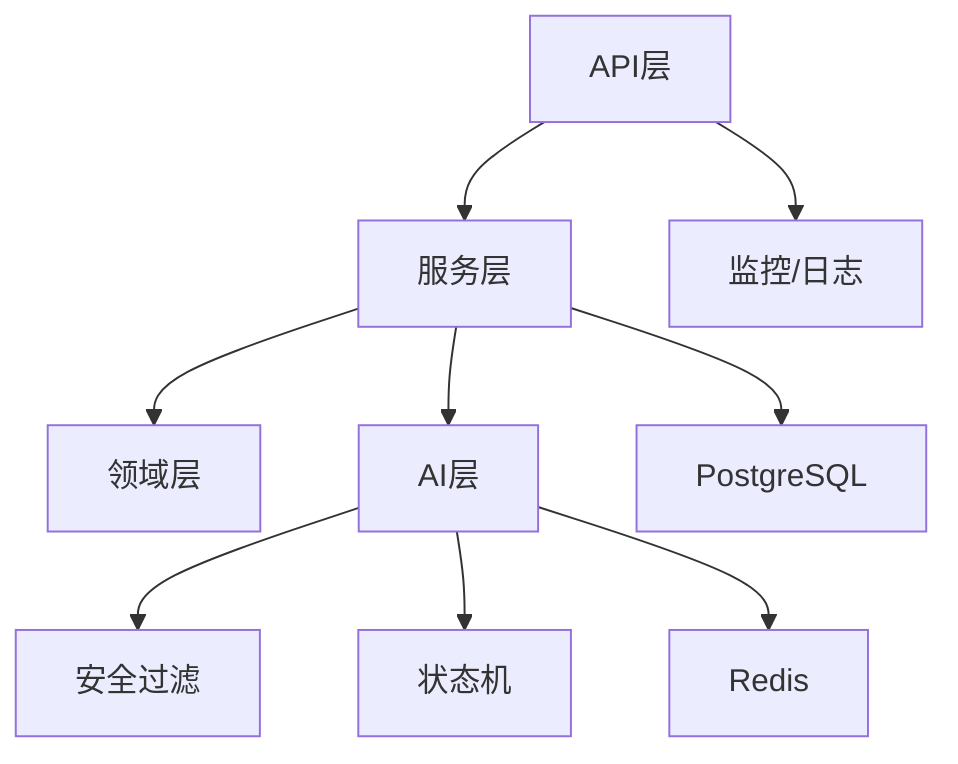

# 产品全景优化规划

<cite>
**本文引用的文件**   
- [README.md](file://README.md)
- [STRUCTURE.md](file://STRUCTURE.md)
- [DEPLOY-GUIDE.md](file://DEPLOY-GUIDE.md)
- [backend/counseling-app/src/main/resources/application.yml](file://backend/counseling-app/src/main/resources/application.yml)
- [backend/counseling-api/src/main/java/com/mindsafe/api/controller/ChatController.java](file://backend/counseling-api/src/main/java/com/mindsafe/api/controller/ChatController.java)
- [backend/counseling-api/src/main/java/com/mindsafe/api/config/SecurityConfig.java](file://backend/counseling-api/src/main/java/com/mindsafe/api/config/SecurityConfig.java)
- [backend/counseling-api/src/main/java/com/mindsafe/api/security/JwtAuthenticationFilter.java](file://backend/counseling-api/src/main/java/com/mindsafe/api/security/JwtAuthenticationFilter.java)
- [backend/counseling-api/src/main/java/com/mindsafe/api/ratelimit/RateLimitInterceptor.java](file://backend/counseling-api/src/main/java/com/mindsafe/api/ratelimit/RateLimitInterceptor.java)
- [backend/counseling-api/src/main/java/com/mindsafe/api/websocket/AlertWebSocketHandler.java](file://backend/counseling-api/src/main/java/com/mindsafe/api/websocket/AlertWebSocketHandler.java)
- [backend/counseling-service/src/main/java/com/mindsafe/service/conversation/ConversationServiceImpl.java](file://backend/counseling-service/src/main/java/com/mindsafe/service/conversation/ConversationServiceImpl.java)
- [backend/counseling-service/src/main/java/com/mindsafe/service/notification/NotificationServiceImpl.java](file://backend/counseling-service/src/main/java/com/mindsafe/service/notification/NotificationServiceImpl.java)
- [backend/counseling-ai/src/main/java/com/mindsafe/ai/chat/AiChatServiceImpl.java](file://backend/counseling-ai/src/main/java/com/mindsafe/ai/chat/AiChatServiceImpl.java)
- [backend/counseling-ai/src/main/java/com/mindsafe/ai/orchestrator/ConversationOrchestrator.java](file://backend/counseling-ai/src/main/java/com/mindsafe/ai/orchestrator/ConversationOrchestrator.java)
- [backend/counseling-ai/src/main/java/com/mindsafe/ai/safety/OutputContentFilter.java](file://backend/counseling-ai/src/main/java/com/mindsafe/ai/safety/OutputContentFilter.java)
- [backend/counseling-ai/src/main/java/com/mindsafe/ai/state/CbtStateMachine.java](file://backend/counseling-ai/src/main/java/com/mindsafe/ai/state/CbtStateMachine.java)
- [backend/counseling-domain/src/main/java/com/mindsafe/domain/entity/CounselingSession.java](file://backend/counseling-domain/src/main/java/com/mindsafe/domain/entity/CounselingSession.java)
- [backend/counseling-domain/src/main/java/com/mindsafe/domain/entity/RiskEvent.java](file://backend/counseling-domain/src/main/java/com/mindsafe/domain/entity/RiskEvent.java)
- [frontend/student-h5/src/App.jsx](file://frontend/student-h5/src/App.jsx)
- [frontend/student-h5/src/components/ChatRoom.jsx](file://frontend/student-h5/src/components/ChatRoom.jsx)
- [frontend/teacher-web/src/pages/Dashboard.jsx](file://frontend/teacher-web/src/pages/Dashboard.jsx)
- [deploy/docker-compose.yml](file://deploy/docker-compose.yml)
- [design/30_产品全景优化规划.md](file://design/30_产品全景优化规划.md)
</cite>

## 目录
1. [引言](#引言)
2. [项目结构](#项目结构)
3. [核心组件](#核心组件)
4. [架构总览](#架构总览)
5. [详细组件分析](#详细组件分析)
6. [依赖关系分析](#依赖关系分析)
7. [性能考量](#性能考量)
8. [故障排查指南](#故障排查指南)
9. [结论](#结论)
10. [附录](#附录)

## 引言
本规划面向AI心理咨询系统的全景优化，围绕“安全合规、体验流畅、可观测与可扩展”四大目标，结合现有后端多模块（API、服务、领域、AI智能体）、前端学生端与教师端、以及部署监控体系，提出分阶段优化路径。重点覆盖：对话编排与安全过滤、风险识别与告警、家长与教师协同、语音能力接入、数据留存与隐私保护、性能与稳定性提升、可观测性与运维自动化等方向。

## 项目结构
系统采用前后端分离与后端多模块分层架构：
- 前端
  - 学生端H5：聊天、情绪日记、放松练习、家长报告入口等
  - 教师端Web：仪表盘、预警队列、学生画像、平台管理等
- 后端
  - API层：REST接口、鉴权、限流、WebSocket推送
  - 服务层：会话、通知、权限、短信、使用时长限制等
  - 领域层：实体与Mapper（会话、风险事件、用户、学校等）
  - AI层：对话服务、提示词模板、状态机、安全过滤、语音TTS
  - 应用启动：Spring Boot主类与数据库迁移脚本
- 部署与监控
  - Docker Compose编排、Nginx反向代理、Prometheus/Grafana监控

**图表来源** 
- [backend/counseling-api/src/main/java/com/mindsafe/api/controller/ChatController.java](file://backend/counseling-api/src/main/java/com/mindsafe/api/controller/ChatController.java)
- [backend/counseling-service/src/main/java/com/mindsafe/service/conversation/ConversationServiceImpl.java](file://backend/counseling-service/src/main/java/com/mindsafe/service/conversation/ConversationServiceImpl.java)
- [backend/counseling-ai/src/main/java/com/mindsafe/ai/orchestrator/ConversationOrchestrator.java](file://backend/counseling-ai/src/main/java/com/mindsafe/ai/orchestrator/ConversationOrchestrator.java)
- [backend/counseling-domain/src/main/java/com/mindsafe/domain/entity/CounselingSession.java](file://backend/counseling-domain/src/main/java/com/mindsafe/domain/entity/CounselingSession.java)
- [deploy/docker-compose.yml](file://deploy/docker-compose.yml)

**章节来源**
- [README.md](file://README.md)
- [STRUCTURE.md](file://STRUCTURE.md)
- [DEPLOY-GUIDE.md](file://DEPLOY-GUIDE.md)

## 核心组件
- 对话与编排
  - 对话服务：统一消息收发、上下文管理、流式响应
  - 编排器：协调多Agent、技能调用、任务调度
  - 状态机：CBT会话状态流转，确保流程可控
- 安全与合规
  - 输出内容过滤：敏感词、PII脱敏、安全策略
  - 风险检测与告警：高危信号识别、实时推送
- 认证与访问控制
  - JWT鉴权、角色授权、试用与家庭码校验
  - 登录锁屏、密码策略、黑名单Token
- 通知与推送
  - WebSocket告警通道、短信通知、站内信
- 数据与持久化
  - 会话、风险事件、用户档案、学校租户等实体
  - 数据库迁移脚本与审计日志

**章节来源**
- [backend/counseling-ai/src/main/java/com/mindsafe/ai/chat/AiChatServiceImpl.java](file://backend/counseling-ai/src/main/java/com/mindsafe/ai/chat/AiChatServiceImpl.java)
- [backend/counseling-ai/src/main/java/com/mindsafe/ai/orchestrator/ConversationOrchestrator.java](file://backend/counseling-ai/src/main/java/com/mindsafe/ai/orchestrator/ConversationOrchestrator.java)
- [backend/counseling-ai/src/main/java/com/mindsafe/ai/state/CbtStateMachine.java](file://backend/counseling-ai/src/main/java/com/mindsafe/ai/state/CbtStateMachine.java)
- [backend/counseling-ai/src/main/java/com/mindsafe/ai/safety/OutputContentFilter.java](file://backend/counseling-ai/src/main/java/com/mindsafe/ai/safety/OutputContentFilter.java)
- [backend/counseling-api/src/main/java/com/mindsafe/api/security/JwtAuthenticationFilter.java](file://backend/counseling-api/src/main/java/com/mindsafe/api/security/JwtAuthenticationFilter.java)
- [backend/counseling-service/src/main/java/com/mindsafe/service/notification/NotificationServiceImpl.java](file://backend/counseling-service/src/main/java/com/mindsafe/service/notification/NotificationServiceImpl.java)
- [backend/counseling-domain/src/main/java/com/mindsafe/domain/entity/CounselingSession.java](file://backend/counseling-domain/src/main/java/com/mindsafe/domain/entity/CounselingSession.java)
- [backend/counseling-domain/src/main/java/com/mindsafe/domain/entity/RiskEvent.java](file://backend/counseling-domain/src/main/java/com/mindsafe/domain/entity/RiskEvent.java)

## 架构总览
从请求到响应的关键链路：
- 学生端发起对话请求
- API层进行鉴权与限流
- 服务层编排对话流程，调用AI层生成回复
- AI层执行安全过滤与状态机控制
- 风险事件触发告警，通过WebSocket推送至教师端
- 所有交互落库并记录审计与指标

**图表来源** 
- [backend/counseling-api/src/main/java/com/mindsafe/api/controller/ChatController.java](file://backend/counseling-api/src/main/java/com/mindsafe/api/controller/ChatController.java)
- [backend/counseling-service/src/main/java/com/mindsafe/service/conversation/ConversationServiceImpl.java](file://backend/counseling-service/src/main/java/com/mindsafe/service/conversation/ConversationServiceImpl.java)
- [backend/counseling-ai/src/main/java/com/mindsafe/ai/orchestrator/ConversationOrchestrator.java](file://backend/counseling-ai/src/main/java/com/mindsafe/ai/orchestrator/ConversationOrchestrator.java)
- [backend/counseling-ai/src/main/java/com/mindsafe/ai/safety/OutputContentFilter.java](file://backend/counseling-ai/src/main/java/com/mindsafe/ai/safety/OutputContentFilter.java)
- [backend/counseling-api/src/main/java/com/mindsafe/api/websocket/AlertWebSocketHandler.java](file://backend/counseling-api/src/main/java/com/mindsafe/api/websocket/AlertWebSocketHandler.java)
- [backend/counseling-domain/src/main/java/com/mindsafe/domain/entity/CounselingSession.java](file://backend/counseling-domain/src/main/java/com/mindsafe/domain/entity/CounselingSession.java)

## 详细组件分析

### 对话与编排（AI层）
- 对话服务：封装消息上下文、历史记忆、流式输出；与编排器协作完成技能调用与任务路由
- 编排器：根据当前状态与意图选择Agent或技能，维护会话生命周期
- 状态机：定义CBT各阶段转换规则，保证干预流程合规与可追溯
- 安全过滤：对输出进行敏感词匹配、PII脱敏、安全策略拦截

**图表来源** 
- [backend/counseling-ai/src/main/java/com/mindsafe/ai/chat/AiChatServiceImpl.java](file://backend/counseling-ai/src/main/java/com/mindsafe/ai/chat/AiChatServiceImpl.java)
- [backend/counseling-ai/src/main/java/com/mindsafe/ai/orchestrator/ConversationOrchestrator.java](file://backend/counseling-ai/src/main/java/com/mindsafe/ai/orchestrator/ConversationOrchestrator.java)
- [backend/counseling-ai/src/main/java/com/mindsafe/ai/state/CbtStateMachine.java](file://backend/counseling-ai/src/main/java/com/mindsafe/ai/state/CbtStateMachine.java)
- [backend/counseling-ai/src/main/java/com/mindsafe/ai/safety/OutputContentFilter.java](file://backend/counseling-ai/src/main/java/com/mindsafe/ai/safety/OutputContentFilter.java)

**章节来源**
- [backend/counseling-ai/src/main/java/com/mindsafe/ai/chat/AiChatServiceImpl.java](file://backend/counseling-ai/src/main/java/com/mindsafe/ai/chat/AiChatServiceImpl.java)
- [backend/counseling-ai/src/main/java/com/mindsafe/ai/orchestrator/ConversationOrchestrator.java](file://backend/counseling-ai/src/main/java/com/mindsafe/ai/orchestrator/ConversationOrchestrator.java)
- [backend/counseling-ai/src/main/java/com/mindsafe/ai/state/CbtStateMachine.java](file://backend/counseling-ai/src/main/java/com/mindsafe/ai/state/CbtStateMachine.java)
- [backend/counseling-ai/src/main/java/com/mindsafe/ai/safety/OutputContentFilter.java](file://backend/counseling-ai/src/main/java/com/mindsafe/ai/safety/OutputContentFilter.java)

### 认证与访问控制（API层）
- JWT过滤器：解析令牌、校验签名、注入用户上下文
- 安全配置：白名单、角色权限、跨域与CORS
- 限流拦截器：按IP/用户维度限流，防止滥用
- 试用与家长端认证：试用注册、家庭码绑定、权限隔离

**图表来源** 
- [backend/counseling-api/src/main/java/com/mindsafe/api/security/JwtAuthenticationFilter.java](file://backend/counseling-api/src/main/java/com/mindsafe/api/security/JwtAuthenticationFilter.java)
- [backend/counseling-api/src/main/java/com/mindsafe/api/config/SecurityConfig.java](file://backend/counseling-api/src/main/java/com/mindsafe/api/config/SecurityConfig.java)
- [backend/counseling-api/src/main/java/com/mindsafe/api/ratelimit/RateLimitInterceptor.java](file://backend/counseling-api/src/main/java/com/mindsafe/api/ratelimit/RateLimitInterceptor.java)

**章节来源**
- [backend/counseling-api/src/main/java/com/mindsafe/api/security/JwtAuthenticationFilter.java](file://backend/counseling-api/src/main/java/com/mindsafe/api/security/JwtAuthenticationFilter.java)
- [backend/counseling-api/src/main/java/com/mindsafe/api/config/SecurityConfig.java](file://backend/counseling-api/src/main/java/com/mindsafe/api/config/SecurityConfig.java)
- [backend/counseling-api/src/main/java/com/mindsafe/api/ratelimit/RateLimitInterceptor.java](file://backend/counseling-api/src/main/java/com/mindsafe/api/ratelimit/RateLimitInterceptor.java)

### 通知与告警（WebSocket）
- 告警处理器：建立连接、订阅主题、推送风险事件
- 通知服务：聚合多渠道（站内信、短信、WebSocket）
- 教师端：实时接收预警，支持处置与反馈

**图表来源** 
- [backend/counseling-service/src/main/java/com/mindsafe/service/notification/NotificationServiceImpl.java](file://backend/counseling-service/src/main/java/com/mindsafe/service/notification/NotificationServiceImpl.java)
- [backend/counseling-api/src/main/java/com/mindsafe/api/websocket/AlertWebSocketHandler.java](file://backend/counseling-api/src/main/java/com/mindsafe/api/websocket/AlertWebSocketHandler.java)

**章节来源**
- [backend/counseling-service/src/main/java/com/mindsafe/service/notification/NotificationServiceImpl.java](file://backend/counseling-service/src/main/java/com/mindsafe/service/notification/NotificationServiceImpl.java)
- [backend/counseling-api/src/main/java/com/mindsafe/api/websocket/AlertWebSocketHandler.java](file://backend/counseling-api/src/main/java/com/mindsafe/api/websocket/AlertWebSocketHandler.java)

### 数据模型（领域层）
- 咨询会话：会话ID、用户、开始/结束时间、摘要、状态
- 风险事件：事件类型、等级、描述、关联会话、处理状态
- 其他实体：用户、学校、家长-学生关联、放松会话、同意书等

**图表来源** 
- [backend/counseling-domain/src/main/java/com/mindsafe/domain/entity/CounselingSession.java](file://backend/counseling-domain/src/main/java/com/mindsafe/domain/entity/CounselingSession.java)
- [backend/counseling-domain/src/main/java/com/mindsafe/domain/entity/RiskEvent.java](file://backend/counseling-domain/src/main/java/com/mindsafe/domain/entity/RiskEvent.java)

**章节来源**
- [backend/counseling-domain/src/main/java/com/mindsafe/domain/entity/CounselingSession.java](file://backend/counseling-domain/src/main/java/com/mindsafe/domain/entity/CounselingSession.java)
- [backend/counseling-domain/src/main/java/com/mindsafe/domain/entity/RiskEvent.java](file://backend/counseling-domain/src/main/java/com/mindsafe/domain/entity/RiskEvent.java)

### 前端交互（学生端与教师端）
- 学生端：聊天室、情绪日记、放松练习、家长报告入口、设置面板
- 教师端：仪表盘、预警队列、学生画像雷达图、平台管理

**图表来源** 
- [frontend/student-h5/src/App.jsx](file://frontend/student-h5/src/App.jsx)
- [frontend/student-h5/src/components/ChatRoom.jsx](file://frontend/student-h5/src/components/ChatRoom.jsx)
- [frontend/teacher-web/src/pages/Dashboard.jsx](file://frontend/teacher-web/src/pages/Dashboard.jsx)

**章节来源**
- [frontend/student-h5/src/App.jsx](file://frontend/student-h5/src/App.jsx)
- [frontend/student-h5/src/components/ChatRoom.jsx](file://frontend/student-h5/src/components/ChatRoom.jsx)
- [frontend/teacher-web/src/pages/Dashboard.jsx](file://frontend/teacher-web/src/pages/Dashboard.jsx)

## 依赖关系分析
- 模块耦合
  - API层依赖服务层与公共DTO
  - 服务层依赖领域模型与AI能力
  - AI层依赖安全过滤、状态机、提示词模板
- 外部依赖
  - PostgreSQL存储会话与实体
  - Redis用于会话与缓存
  - 监控与日志采集

**图表来源** 
- [backend/counseling-api/src/main/java/com/mindsafe/api/controller/ChatController.java](file://backend/counseling-api/src/main/java/com/mindsafe/api/controller/ChatController.java)
- [backend/counseling-service/src/main/java/com/mindsafe/service/conversation/ConversationServiceImpl.java](file://backend/counseling-service/src/main/java/com/mindsafe/service/conversation/ConversationServiceImpl.java)
- [backend/counseling-ai/src/main/java/com/mindsafe/ai/orchestrator/ConversationOrchestrator.java](file://backend/counseling-ai/src/main/java/com/mindsafe/ai/orchestrator/ConversationOrchestrator.java)
- [backend/counseling-ai/src/main/java/com/mindsafe/ai/safety/OutputContentFilter.java](file://backend/counseling-ai/src/main/java/com/mindsafe/ai/safety/OutputContentFilter.java)
- [backend/counseling-ai/src/main/java/com/mindsafe/ai/state/CbtStateMachine.java](file://backend/counseling-ai/src/main/java/com/mindsafe/ai/state/CbtStateMachine.java)

**章节来源**
- [backend/counseling-api/src/main/java/com/mindsafe/api/controller/ChatController.java](file://backend/counseling-api/src/main/java/com/mindsafe/api/controller/ChatController.java)
- [backend/counseling-service/src/main/java/com/mindsafe/service/conversation/ConversationServiceImpl.java](file://backend/counseling-service/src/main/java/com/mindsafe/service/conversation/ConversationServiceImpl.java)
- [backend/counseling-ai/src/main/java/com/mindsafe/ai/orchestrator/ConversationOrchestrator.java](file://backend/counseling-ai/src/main/java/com/mindsafe/ai/orchestrator/ConversationOrchestrator.java)

## 性能考量
- 对话流式响应：降低首包延迟，提升用户体验
- 缓存与会话：Redis缓存热点数据与会话上下文
- 限流与熔断：API层限流，避免雪崩；AI层超时与重试策略
- 数据库优化：索引与会话归档，定期清理历史数据
- 监控与告警：Prometheus指标、Grafana看板、错误率阈值

[本节为通用指导，不直接分析具体文件]

## 故障排查指南
- 鉴权失败
  - 检查JWT过滤器与密钥配置
  - 查看Token黑名单与过期策略
- 限流触发
  - 检查限流拦截器阈值与统计窗口
  - 定位高频请求来源
- 安全风险误报
  - 调整安全关键词库与过滤规则
  - 审查输出内容过滤逻辑
- WebSocket断连
  - 检查Nginx与容器网络配置
  - 查看告警处理器日志与订阅主题
- 数据库异常
  - 检查迁移脚本与连接池配置
  - 关注慢查询与锁等待

**章节来源**
- [backend/counseling-api/src/main/java/com/mindsafe/api/security/JwtAuthenticationFilter.java](file://backend/counseling-api/src/main/java/com/mindsafe/api/security/JwtAuthenticationFilter.java)
- [backend/counseling-api/src/main/java/com/mindsafe/api/ratelimit/RateLimitInterceptor.java](file://backend/counseling-api/src/main/java/com/mindsafe/api/ratelimit/RateLimitInterceptor.java)
- [backend/counseling-ai/src/main/java/com/mindsafe/ai/safety/OutputContentFilter.java](file://backend/counseling-ai/src/main/java/com/mindsafe/ai/safety/OutputContentFilter.java)
- [backend/counseling-api/src/main/java/com/mindsafe/api/websocket/AlertWebSocketHandler.java](file://backend/counseling-api/src/main/java/com/mindsafe/api/websocket/AlertWebSocketHandler.java)
- [backend/counseling-app/src/main/resources/application.yml](file://backend/counseling-app/src/main/resources/application.yml)

## 结论
本次全景优化以“安全优先、体验至上、可观测与可扩展”为核心，聚焦对话编排、安全过滤、风险告警、认证授权、数据治理与性能调优。建议分三阶段推进：短期补齐安全与限流、中期强化编排与告警、长期完善数据治理与可观测性，持续迭代以提升系统稳定性与用户满意度。

[本节为总结性内容，不直接分析具体文件]

## 附录
- 部署参考：Docker Compose编排、Nginx配置、监控栈
- 设计文档：产品全景优化规划、技术架构、Agent工作流、Prompt体系
- 运行配置：application.yml环境变量与数据库迁移

**章节来源**
- [deploy/docker-compose.yml](file://deploy/docker-compose.yml)
- [design/30_产品全景优化规划.md](file://design/30_产品全景优化规划.md)
- [backend/counseling-app/src/main/resources/application.yml](file://backend/counseling-app/src/main/resources/application.yml)
