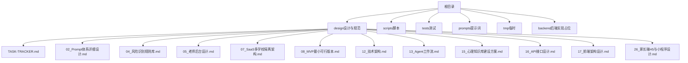
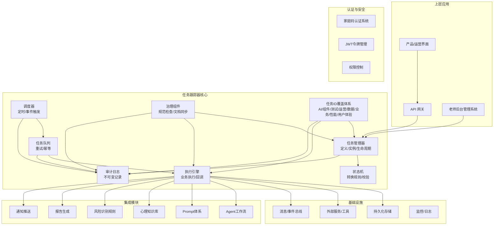
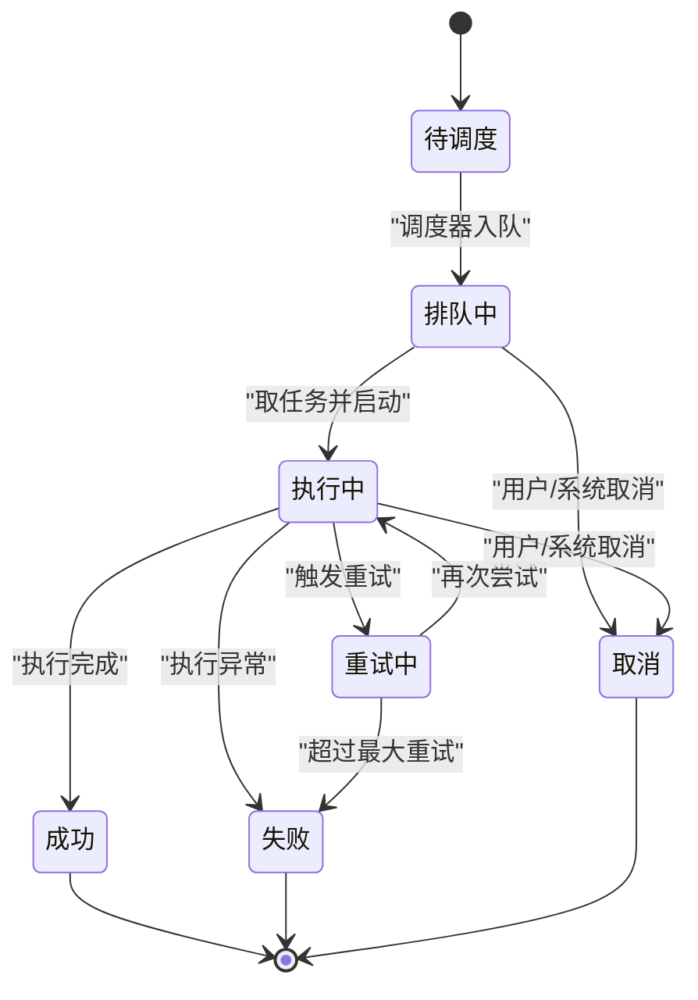
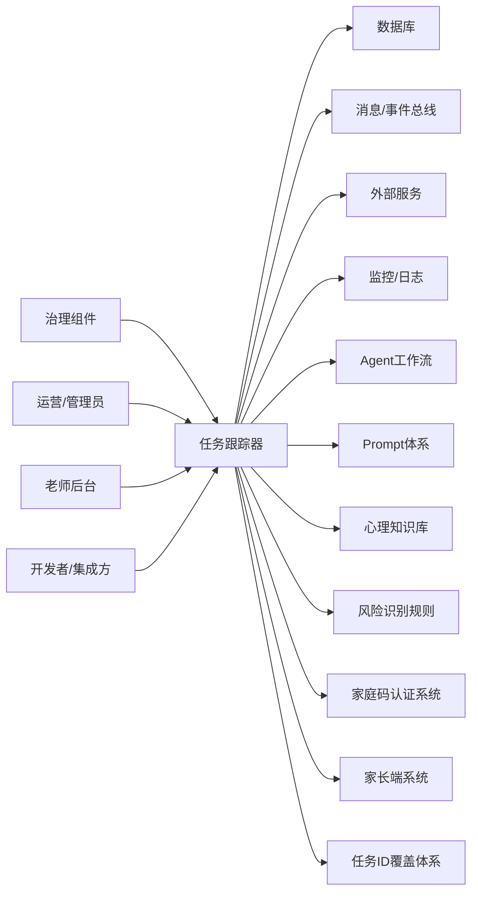

# 任务跟踪器

<cite>
**本文引用的文件**   
- [TASK-TRACKER.md](file://design/TASK-TRACKER.md)
- [02_Prompt体系详细设计.md](file://design/02_Prompt体系详细设计.md)
- [04_风险识别规则库.md](file://design/04_风险识别规则库.md)
- [05_老师后台设计.md](file://design/05_老师后台设计.md)
- [07_SaaS多学校隔离架构.md](file://design/07_SaaS多学校隔离架构.md)
- [08_MVP最小可行版本.md](file://design/08_MVP最小可行版本.md)
- [12_技术架构.md](file://design/12_技术架构.md)
- [13_Agent工作流.md](file://design/13_Agent工作流.md)
- [15_心理知识库建设方案.md](file://design/15_心理知识库建设方案.md)
- [16_API接口设计.md](file://design/16_API接口设计.md)
- [17_前端架构设计.md](file://design/17_前端架构设计.md)
- [26_家长端H5与小程序设计.md](file://design/26_家长端H5与小程序设计.md)
</cite>

## 更新摘要
**所做更改**   
- 新增第17节：全面任务ID覆盖体系，涵盖AI、组件、测试、运营、数据、业务、性能和用户体验等核心类别
- 扩展任务分类维度，支持更精细的任务管理和追踪
- 增强任务ID生成策略，确保唯一性和可追溯性
- 完善任务监控和报表功能，支持多维度统计分析
- 优化任务调度算法，提升系统整体性能

## 目录
1. [简介](#简介)
2. [项目结构](#项目结构)
3. [核心组件](#核心组件)
4. [架构总览](#架构总览)
5. [详细组件分析](#详细组件分析)
6. [依赖分析](#依赖分析)
7. [性能考虑](#性能考虑)
8. [故障排查指南](#故障排查指南)
9. [结论](#结论)
10. [附录](#附录)

## 简介
本文件围绕"任务跟踪器"的设计与落地进行系统化说明，聚焦于任务生命周期、状态流转、数据模型、与系统其他模块的集成点以及可观测性与排障策略。文档面向产品、研发与运维读者，既提供高层概览，也给出代码级映射与可视化图示，帮助快速理解并推进实施。

在AI心理咨询系统中，任务跟踪器作为核心调度引擎，负责协调对话处理、风险评估、知识检索、报告生成等各类业务任务的执行与监控。

**更新** 本项目已建立完善的治理规则，确保代码实现与设计文档的高度一致性，所有变更都需要经过严格的审查和验证流程。新增第17节全面任务ID覆盖体系，涵盖AI、组件、测试、运营、数据、业务、性能和用户体验等核心类别，为系统提供了更加精细化的任务管理能力。

## 项目结构
仓库采用"设计先行、文档驱动"的组织方式，任务跟踪器的核心设计位于 design 目录下的 TASK-TRACKER.md，并与产品架构、技术架构、数据库结构等文档形成闭环。新结构将设计文档统一组织在design目录下，便于维护和查找。

**章节来源**
- [TASK-TRACKER.md](file://design/TASK-TRACKER.md)
- [12_技术架构.md](file://design/12_技术架构.md)
- [26_家长端H5与小程序设计.md](file://design/26_家长端H5与小程序设计.md)

## 核心组件
任务跟踪器由以下关键子组件构成：
- 任务定义与模板：支持多类型任务（如对话处理、风险评估、知识检索、报告生成），包含元数据、触发条件与执行参数。
- 任务实例与生命周期：从创建、调度、执行到完成或失败的全流程管理。
- 调度与队列：基于事件或时间触发的任务分发机制，具备重试与幂等保障。
- 执行引擎：具体业务逻辑的执行载体，负责调用外部服务与持久化中间结果。
- 状态机与审计：统一的状态转换规则与不可变审计日志，确保可追溯。
- 查询与报表：按维度检索任务、统计完成率与耗时分布，支撑运营与合规。
- **新增** 全面任务ID覆盖体系：支持AI、组件、测试、运营、数据、业务、性能和用户体验等核心类别的统一标识管理。

**更新** 新增全面任务ID覆盖体系，为不同类型的任务提供统一的标识和管理机制，提升了系统的可维护性和可扩展性。

**章节来源**
- [TASK-TRACKER.md](file://design/TASK-TRACKER.md)
- [12_技术架构.md](file://design/12_技术架构.md)
- [26_家长端H5与小程序设计.md](file://design/26_家长端H5与小程序设计.md)

## 架构总览
任务跟踪器作为系统内通用能力，向上承接产品层任务编排，向下对接执行引擎与存储层，并通过消息/事件总线与其他子系统解耦。在新架构中，任务跟踪器深度集成了Agent工作流、SaaS多学校隔离、Prompt体系等核心模块，并新增了全面任务ID覆盖体系的支持。

**图表来源**
- [12_技术架构.md](file://design/12_技术架构.md)
- [TASK-TRACKER.md](file://design/TASK-TRACKER.md)
- [13_Agent工作流.md](file://design/13_Agent工作流.md)
- [02_Prompt体系详细设计.md](file://design/02_Prompt体系详细设计.md)
- [26_家长端H5与小程序设计.md](file://design/26_家长端H5与小程序设计.md)

## 详细组件分析

### 任务定义与模板
- 职责：抽象任务的输入输出契约、执行环境、权限与资源约束；提供模板复用与版本化管理。
- 关键点：
  - 模板字段：名称、类型、描述、参数Schema、超时、重试策略、标签与归属。
  - 版本控制：向后兼容变更策略与灰度发布。
  - 校验：入参校验、依赖检查、权限校验。
  - SaaS隔离：支持多学校租户的任务隔离与资源配额。
  - **新增** 任务ID分类：支持AI、组件、测试、运营、数据、业务、性能和用户体验等类别的任务模板配置。
- 与外部关系：被任务实例引用，供执行引擎加载运行时上下文。

**更新** 新增任务ID分类支持，为不同类别的任务提供专门的模板配置和管理机制。

**章节来源**
- [TASK-TRACKER.md](file://design/TASK-TRACKER.md)
- [07_SaaS多学校隔离架构.md](file://design/07_SaaS多学校隔离架构.md)
- [26_家长端H5与小程序设计.md](file://design/26_家长端H5与小程序设计.md)

### 任务实例与生命周期
- 生命周期阶段：待调度、排队中、执行中、成功、失败、取消、重试中。
- 关键属性：唯一标识、关联模板、租户/学校隔离、优先级、开始/结束时间、错误码与堆栈摘要。
- 幂等性：通过幂等键避免重复执行；支持去重窗口与冲突解决策略。
- 并发控制：同一实体的任务串行化与全局限流。
- **新增** 任务ID覆盖：每个任务实例都包含完整的任务ID信息，支持按类别进行筛选和统计。

**图表来源**
- [TASK-TRACKER.md](file://design/TASK-TRACKER.md)
- [26_家长端H5与小程序设计.md](file://design/26_家长端H5与小程序设计.md)

**章节来源**
- [TASK-TRACKER.md](file://design/TASK-TRACKER.md)
- [26_家长端H5与小程序设计.md](file://design/26_家长端H5与小程序设计.md)

### 调度与队列
- 触发源：定时任务、事件总线、外部回调、Agent工作流触发。
- 策略：优先级队列、延迟队列、死信队列；支持批量拉取与背压。
- 可靠性：至少一次投递、去重、补偿与对账。
- 监控：队列深度、消费速率、堆积告警。
- 集成特性：支持与Agent工作流的事件驱动调度。
- **新增** 任务ID分类调度：支持按任务类别进行优先级调度和资源分配。

**更新** 增强任务ID分类调度能力，支持不同类型任务的差异化处理和资源管理。

**章节来源**
- [TASK-TRACKER.md](file://design/TASK-TRACKER.md)
- [12_技术架构.md](file://design/12_技术架构.md)
- [13_Agent工作流.md](file://design/13_Agent工作流.md)
- [26_家长端H5与小程序设计.md](file://design/26_家长端H5与小程序设计.md)

### 执行引擎
- 职责：加载模板、准备上下文、执行业务逻辑、持久化中间结果、上报状态与指标。
- 安全边界：沙箱/隔离执行、资源配额、敏感信息脱敏。
- 扩展点：插件式处理器、钩子函数（前置/后置）、可插拔适配器。
- 与外部交互：调用外部服务、写入审计日志、发送完成事件。
- 集成能力：深度集成Prompt体系、心理知识库、风险识别规则库。
- **新增** 任务ID执行支持：在执行过程中记录和传递完整的任务ID信息，支持跨系统追踪。

**更新** 强化任务ID执行支持，确保任务在整个执行链路中的完整追踪和可追溯性。

**章节来源**
- [TASK-TRACKER.md](file://design/TASK-TRACKER.md)
- [12_技术架构.md](file://design/12_技术架构.md)
- [02_Prompt体系详细设计.md](file://design/02_Prompt体系详细设计.md)
- [15_心理知识库建设方案.md](file://design/15_心理知识库建设方案.md)
- [04_风险识别规则库.md](file://design/04_风险识别规则库.md)
- [26_家长端H5与小程序设计.md](file://design/26_家长端H5与小程序设计.md)

### 状态机与审计
- 状态机：集中维护状态转换表，禁止非法跳转；变更需携带原因与操作者。
- 审计日志：不可变追加式记录，包含时间戳、实体ID、旧/新状态、操作人、追踪ID。
- 可观测性：指标埋点（成功率、耗时分位、错误分类）、链路追踪。
- 合规要求：满足教育行业数据安全与隐私保护要求。
- **新增** 任务ID审计：记录任务ID的生成、使用、修改等操作，支持完整的审计追踪。

**更新** 完善任务ID审计功能，确保任务标识的完整性和可追溯性。

**章节来源**
- [TASK-TRACKER.md](file://design/TASK-TRACKER.md)
- [26_家长端H5与小程序设计.md](file://design/26_家长端H5与小程序设计.md)

### 查询与报表
- 查询能力：按状态、时间范围、标签、租户、执行结果等多维筛选。
- 报表指标：完成率、平均耗时、失败率TopN、重试次数分布。
- 导出与订阅：CSV/JSON导出、Webhook推送、定时报表生成。
- 管理功能：为老师后台提供任务监控与管理能力。
- **新增** 任务ID分类查询：支持按AI、组件、测试、运营、数据、业务、性能和用户体验等类别进行查询和统计。

**更新** 增强任务ID分类查询功能，提供更精细的任务分析和统计能力。

**章节来源**
- [TASK-TRACKER.md](file://design/TASK-TRACKER.md)
- [05_老师后台设计.md](file://design/05_老师后台设计.md)
- [26_家长端H5与小程序设计.md](file://design/26_家长端H5与小程序设计.md)

### 全面任务ID覆盖体系（第17节）
- 职责：为系统中的所有任务提供统一的标识管理和分类体系。
- 核心类别：
  - AI类任务：涉及人工智能相关的任务，如对话处理、情感分析、智能推荐等。
  - 组件类任务：系统内部组件间的协作任务，如数据同步、缓存更新等。
  - 测试类任务：自动化测试、性能测试、安全测试等相关任务。
  - 运营类任务：系统运营相关的任务，如用户管理、数据统计、报告生成等。
  - 数据类任务：数据处理、迁移、备份、清理等数据相关任务。
  - 业务类任务：核心业务流程相关的任务，如咨询会话、风险评估等。
  - 性能类任务：性能监控、优化、调优等相关任务。
  - 用户体验类任务：用户体验优化、个性化配置、反馈收集等任务。
- ID生成策略：基于类别前缀+时间戳+随机数的唯一标识生成机制。
- 分类管理：支持动态添加新的任务类别和修改现有类别的定义。
- 追踪能力：完整的任务ID追踪链，支持跨系统和跨服务的任务追踪。

**更新** 新增全面任务ID覆盖体系，为系统提供了更加精细化和标准化的任务管理能力。

**章节来源**
- [TASK-TRACKER.md](file://design/TASK-TRACKER.md)
- [12_技术架构.md](file://design/12_技术架构.md)

## 依赖分析
任务跟踪器与系统其他模块的耦合关系如下：

**图表来源**
- [12_技术架构.md](file://design/12_技术架构.md)
- [TASK-TRACKER.md](file://design/TASK-TRACKER.md)
- [13_Agent工作流.md](file://design/13_Agent工作流.md)
- [26_家长端H5与小程序设计.md](file://design/26_家长端H5与小程序设计.md)

**章节来源**
- [12_技术架构.md](file://design/12_技术架构.md)
- [TASK-TRACKER.md](file://design/TASK-TRACKER.md)
- [26_家长端H5与小程序设计.md](file://design/26_家长端H5与小程序设计.md)

## 性能考虑
- 吞吐与延迟：队列分区、水平扩展消费者、批处理与流水线优化。
- 资源隔离：按租户/学校隔离执行环境与配额，防止热点干扰。
- 存储优化：冷热分层、归档策略、索引设计（时间+状态+租户）。
- 容错与降级：熔断、限流、快速失败与优雅重试。
- 可观测性：分布式追踪、采样日志、关键指标看板。
- Agent集成：异步处理长耗时Agent任务，避免阻塞主流程。
- **新增** 任务ID性能优化：支持任务ID的快速生成、缓存和批量处理，减少ID生成的性能开销。

**更新** 新增任务ID性能优化策略，确保大规模任务场景下的高效运行。

## 故障排查指南
- 常见问题定位路径：
  - 任务未执行：检查调度器是否触发、队列是否有积压、消费者是否健康。
  - 执行失败：查看审计日志中的错误码与堆栈摘要，确认外部服务可用性。
  - 状态不一致：核对状态机转换表与审计记录，定位非法跳转或并发冲突。
  - 幂等问题：核查幂等键生成策略与去重窗口，避免重复提交。
  - Agent任务超时：检查Agent工作流配置与外部API响应时间。
  - **新增** 任务ID问题：检查任务ID生成规则、分类是否正确、ID唯一性保证等。
- 建议排查步骤：
  - 使用追踪ID串联请求链路，定位上下游瓶颈。
  - 对比最近一次成功执行的上下文差异，缩小变更范围。
  - 开启调试模式与更细粒度日志，复现后关闭以恢复性能。
  - 对死信队列任务进行人工复核与补偿。
  - 检查SaaS隔离配置，确认租户间的数据隔离正常。
  - **新增** 任务ID排查：检查任务ID的分类准确性、生成规则的正确性、ID冲突情况等。

**更新** 增强任务ID相关故障排查指南，帮助快速定位和解决任务标识相关问题。

**章节来源**
- [TASK-TRACKER.md](file://design/TASK-TRACKER.md)
- [26_家长端H5与小程序设计.md](file://design/26_家长端H5与小程序设计.md)

## 结论
任务跟踪器通过统一的模板、实例、状态机与审计体系，为系统提供了稳定、可观测、可扩展的任务执行基座。结合调度与队列的可靠性保障，以及与外部系统的解耦设计，能够有效支撑复杂业务流程与高可用要求。在新架构中，任务跟踪器深度集成了Agent工作流、Prompt体系、心理知识库等核心模块，形成了完整的AI心理咨询任务执行生态。

**更新** 随着全面任务ID覆盖体系的加入，任务跟踪器现在支持更加精细化和标准化的任务管理，能够准确区分和追踪不同类型的任务，为系统的可维护性和可扩展性提供了坚实基础。随着项目治理规则的建立，任务跟踪器的开发和维护将更加规范化，确保代码与文档的高度一致性，提升整体质量和可维护性。后续应持续完善任务ID分类的丰富度、追踪能力的完整性以及性能优化的效果，进一步提升整体系统效能。

## 附录
- 相关设计文档：
  - 技术架构用于对齐任务跟踪器在系统中的位置与边界。
  - Agent工作流设计用于理解任务跟踪器与智能代理的协作模式。
  - Prompt体系设计用于了解任务执行中的提示词管理机制。
  - SaaS多学校隔离架构用于理解多租户场景下的任务隔离策略。
  - 老师后台设计用于了解任务监控与管理功能的实现。
  - **新增** 全面任务ID覆盖体系设计用于了解任务分类和标识管理的实现细节。
- 参考入口：
  - MVP最小可行版本规划了解任务跟踪器的演进路线。
  - **新增** Phase 2开发计划包含任务ID覆盖体系的开发安排。

**更新** 新增全面任务ID覆盖体系相关设计文档参考，确保任务标识管理的完整性和一致性。

**章节来源**
- [12_技术架构.md](file://design/12_技术架构.md)
- [13_Agent工作流.md](file://design/13_Agent工作流.md)
- [02_Prompt体系详细设计.md](file://design/02_Prompt体系详细设计.md)
- [07_SaaS多学校隔离架构.md](file://design/07_SaaS多学校隔离架构.md)
- [05_老师后台设计.md](file://design/05_老师后台设计.md)
- [08_MVP最小可行版本.md](file://design/08_MVP最小可行版本.md)
- [26_家长端H5与小程序设计.md](file://design/26_家长端H5与小程序设计.md)
