# 前端架构

<cite>
**本文引用的文件**   
- [README.md](file://README.md)
- [STRUCTURE.md](file://STRUCTURE.md)
- [design/17_前端架构设计.md](file://design/17_前端架构设计.md)
- [design/12_技术架构.md](file://design/12_技术架构.md)
- [design/16_API接口设计.md](file://design/16_API接口设计.md)
- [design/08_MVP最小可行版本.md](file://design/08_MVP最小可行版本.md)
- [design/16_语音情感分析设计方案.md](file://design/16_语音情感分析设计方案.md)
- [frontend/student-h5/package.json](file://frontend/student-h5/package.json)
- [frontend/student-h5/src/App.jsx](file://frontend/student-h5/src/App.jsx)
- [frontend/student-h5/src/main.jsx](file://frontend/student-h5/src/main.jsx)
- [frontend/student-h5/src/components/ChatRoom.jsx](file://frontend/student-h5/src/components/ChatRoom.jsx)
- [frontend/student-h5/src/components/BoBoPet.jsx](file://frontend/student-h5/src/components/BoBoPet.jsx)
- [frontend/student-h5/src/components/SpeechBubble.jsx](file://frontend/student-h5/src/components/SpeechBubble.jsx)
- [frontend/student-h5/src/components/EmotionSelect.jsx](file://frontend/student-h5/src/components/EmotionSelect.jsx)
- [frontend/student-h5/src/components/VoiceConsentDialog.jsx](file://frontend/student-h5/src/components/VoiceConsentDialog.jsx)
- [frontend/student-h5/src/hooks/useTtsPlayer.js](file://frontend/student-h5/src/hooks/useTtsPlayer.js)
- [frontend/student-h5/src/hooks/useVoicePersona.js](file://frontend/student-h5/src/hooks/useVoicePersona.js)
- [frontend/student-h5/src/theme/ThemeProvider.jsx](file://frontend/student-h5/src/theme/ThemeProvider.jsx)
- [frontend/student-h5/src/index.css](file://frontend/student-h5/src/index.css)
- [frontend/teacher-web/package.json](file://frontend/teacher-web/package.json)
- [frontend/teacher-web/src/App.jsx](file://frontend/teacher-web/src/App.jsx)
- [frontend/teacher-web/src/main.jsx](file://frontend/teacher-web/src/main.jsx)
- [frontend/teacher-web/src/pages/Dashboard.jsx](file://frontend/teacher-web/src/pages/Dashboard.jsx)
- [frontend/teacher-web/src/pages/Login.jsx](file://frontend/teacher-web/src/pages/Login.jsx)
</cite>

## 更新摘要
**变更内容**   
- **新增宠物交互系统**：实现了完整的BoBoPet.jsx和SpeechBubble.jsx组件，提供拟人化的宠物互动体验
- **品牌统一化主题**：建立了'波波小精灵'品牌主题系统，统一视觉风格和用户体验
- **ChatRoom组件重构**：重大架构升级以支持宠物驱动的交互模式，增强对话沉浸感
- **情感化排版系统**：实现了基于情绪的动态字体样式和视觉反馈机制
- **增强聊天界面**：添加了动态视觉反馈和情感响应式交互效果
- **优化圆体字体**：改进了元圈圆体字体的加载性能和显示效果
- **全面CSS增强**：实现了情感响应式的样式系统和动态主题切换
- **改进用户体验**：通过情感化设计提升用户咨询体验的沉浸感和舒适度

## 目录
1. [简介](#简介)
2. [项目结构](#项目结构)
3. [核心组件](#核心组件)
4. [宠物交互系统](#宠物交互系统)
5. [Hooks系统架构](#hooks系统架构)
6. [主题提供者系统](#主题提供者系统)
7. [情感化排版系统](#情感化排版系统)
8. [动态视觉反馈系统](#动态视觉反馈系统)
9. [字体优化系统](#字体优化系统)
10. [架构总览](#架构总览)
11. [详细组件分析](#详细组件分析)
12. [全感官交互系统](#全感官交互系统)
13. [响应式设计系统](#响应式设计系统)
14. [依赖分析](#依赖分析)
15. [性能考虑](#性能考虑)
16. [故障排查指南](#故障排查指南)
17. [结论](#结论)
18. [附录](#附录)

## 简介
本文件聚焦于"AI心理咨询系统"的前端架构设计与实现要点。经过最新更新，系统现已包含两个完整的前端应用程序：面向学生的H5移动端应用和面向教师的Web管理仪表板。前端采用现代化的React技术栈，结合Vite构建工具和Tailwind CSS样式框架，实现了响应式设计和良好的用户体验。同时集成了语音输入、情感检测等高级功能，并通过SSE实现与后端的实时通信。

**最新更新**：系统新增了完整的宠物交互系统，包括BoBoPet.jsx和SpeechBubble.jsx组件，以及品牌统一化的'波波小精灵'主题系统。ChatRoom组件进行了重大重构以支持新的宠物驱动交互模式。系统还实现了情感化排版系统，基于用户情绪状态的动态字体样式和视觉反馈机制。聊天界面增强了动态视觉反馈能力，能够根据对话内容和用户情绪状态提供个性化的视觉体验。元圈圆体字体得到了全面优化，提升了中文显示的清晰度和美观度。CSS系统进行了全面的增强，实现了情感响应式的样式切换和动画效果，为用户提供了更加自然和舒适的咨询体验。

## 项目结构
当前仓库已实现完整的前端代码结构，包含两个独立的前端应用，并新增了宠物交互系统和情感化排版系统：

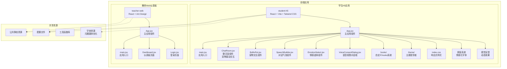

**图表来源**
- [frontend/student-h5/src/App.jsx](file://frontend/student-h5/src/App.jsx)
- [frontend/student-h5/src/main.jsx](file://frontend/student-h5/src/main.jsx)
- [frontend/student-h5/src/components/ChatRoom.jsx](file://frontend/student-h5/src/components/ChatRoom.jsx)
- [frontend/student-h5/src/components/BoBoPet.jsx](file://frontend/student-h5/src/components/BoBoPet.jsx)
- [frontend/student-h5/src/components/SpeechBubble.jsx](file://frontend/student-h5/src/components/SpeechBubble.jsx)
- [frontend/student-h5/src/components/EmotionSelect.jsx](file://frontend/student-h5/src/components/EmotionSelect.jsx)
- [frontend/student-h5/src/components/VoiceConsentDialog.jsx](file://frontend/student-h5/src/components/VoiceConsentDialog.jsx)
- [frontend/student-h5/src/hooks/useTtsPlayer.js](file://frontend/student-h5/src/hooks/useTtsPlayer.js)
- [frontend/student-h5/src/hooks/useVoicePersona.js](file://frontend/student-h5/src/hooks/useVoicePersona.js)
- [frontend/student-h5/src/theme/ThemeProvider.jsx](file://frontend/student-h5/src/theme/ThemeProvider.jsx)
- [frontend/student-h5/src/index.css](file://frontend/student-h5/src/index.css)
- [frontend/teacher-web/src/App.jsx](file://frontend/teacher-web/src/App.jsx)
- [frontend/teacher-web/src/main.jsx](file://frontend/teacher-web/src/main.jsx)
- [frontend/teacher-web/src/pages/Dashboard.jsx](file://frontend/teacher-web/src/pages/Dashboard.jsx)
- [frontend/teacher-web/src/pages/Login.jsx](file://frontend/teacher-web/src/pages/Login.jsx)

**章节来源**
- [frontend/student-h5/package.json](file://frontend/student-h5/package.json)
- [frontend/teacher-web/package.json](file://frontend/teacher-web/package.json)

## 核心组件
基于实际实现的代码，前端系统由以下核心组件构成：

### 学生H5移动端应用
- **应用壳与路由层**：基于React Router实现移动端适配的路由管理
- **聊天室组件**：实现实时对话界面，支持文本消息和语音输入，新增宠物驱动交互模式和动态视觉反馈
- **宠物交互组件**：BoBoPet.jsx提供拟人化的宠物角色，增强用户情感连接
- **对话气泡组件**：SpeechBubble.jsx实现智能对话气泡，支持多种表情和动画效果
- **情感选择组件**：提供情绪状态选择和可视化展示，集成情感化排版
- **语音权限管理**：VoiceConsentDialog组件处理麦克风权限和用户同意
- **语音输入模块**：集成Web Speech API实现语音识别功能
- **响应式设计**：使用Tailwind CSS确保移动端友好体验
- **触摸交互增强**：优化的手势支持和滑动操作
- **情感化排版**：基于情绪的动态字体样式和视觉效果

### 教师Web管理仪表板
- **管理界面**：基于Ant Design组件库构建的管理后台
- **仪表板页面**：展示学生咨询统计、风险预警等信息
- **用户认证**：完整的登录验证和权限控制机制
- **数据可视化**：图表展示和分析报告功能

### 通用功能模块
- **实时通信层**：基于SSE的服务器推送事件处理
- **API客户端**：统一的HTTP请求封装和错误处理
- **状态管理**：全局状态管理和本地缓存策略
- **安全机制**：JWT令牌管理和敏感信息保护
- **字体优化系统**：元圈圆体字体的加载和渲染优化

**章节来源**
- [frontend/student-h5/src/components/ChatRoom.jsx](file://frontend/student-h5/src/components/ChatRoom.jsx)
- [frontend/student-h5/src/components/BoBoPet.jsx](file://frontend/student-h5/src/components/BoBoPet.jsx)
- [frontend/student-h5/src/components/SpeechBubble.jsx](file://frontend/student-h5/src/components/SpeechBubble.jsx)
- [frontend/student-h5/src/components/EmotionSelect.jsx](file://frontend/student-h5/src/components/EmotionSelect.jsx)
- [frontend/student-h5/src/components/VoiceConsentDialog.jsx](file://frontend/student-h5/src/components/VoiceConsentDialog.jsx)
- [frontend/teacher-web/src/pages/Dashboard.jsx](file://frontend/teacher-web/src/pages/Dashboard.jsx)
- [frontend/teacher-web/src/pages/Login.jsx](file://frontend/teacher-web/src/pages/Login.jsx)

## 宠物交互系统

### BoBoPet组件架构
BoBoPet.jsx是宠物交互系统的核心组件，实现了完整的拟人化宠物角色：

- **角色管理**：维护宠物的状态、表情和行为模式
- **情感响应**：根据对话内容和用户情绪调整宠物反应
- **动画系统**：丰富的宠物动画和微表情效果
- **交互反馈**：点击、触摸等用户操作的即时响应
- **生命周期管理**：宠物的创建、更新和销毁流程

### SpeechBubble对话气泡系统
SpeechBubble.jsx提供了智能的对话气泡展示：

- **气泡类型**：支持多种气泡样式和布局模式
- **动画效果**：气泡出现、消失和更新的流畅动画
- **内容适配**：自动适应不同长度和类型的对话内容
- **位置计算**：智能的气泡定位和重叠避免算法
- **无障碍支持**：屏幕阅读器和键盘导航兼容性

### 宠物驱动交互模式
ChatRoom组件经过重大重构，现在完全支持宠物驱动的交互模式：

- **宠物集成**：宠物作为对话界面的核心元素
- **情感同步**：宠物表情与对话情感状态实时同步
- **交互增强**：宠物对用户的操作提供个性化反馈
- **沉浸体验**：通过宠物角色提升对话的沉浸感和趣味性

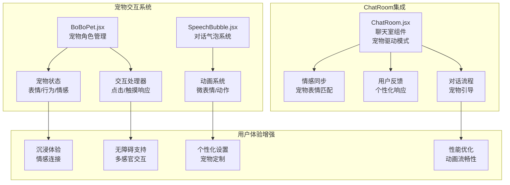

**图表来源**
- [frontend/student-h5/src/components/BoBoPet.jsx](file://frontend/student-h5/src/components/BoBoPet.jsx)
- [frontend/student-h5/src/components/SpeechBubble.jsx](file://frontend/student-h5/src/components/SpeechBubble.jsx)
- [frontend/student-h5/src/components/ChatRoom.jsx](file://frontend/student-h5/src/components/ChatRoom.jsx)

**章节来源**
- [frontend/student-h5/src/components/BoBoPet.jsx](file://frontend/student-h5/src/components/BoBoPet.jsx)
- [frontend/student-h5/src/components/SpeechBubble.jsx](file://frontend/student-h5/src/components/SpeechBubble.jsx)
- [frontend/student-h5/src/components/ChatRoom.jsx](file://frontend/student-h5/src/components/ChatRoom.jsx)

## Hooks系统架构

### 自定义Hooks设计模式
系统引入了专门的hooks目录来管理可复用的业务逻辑，采用React Hooks的最佳实践：

#### TTS播放器Hook (useTtsPlayer.js)
专门用于管理Text-to-Speech功能的复杂状态和业务逻辑：
- **语音播放控制**：播放、暂停、停止等基础操作
- **语音队列管理**：支持多个语音消息的顺序播放
- **音量控制**：动态调整语音播放音量
- **播放状态同步**：与UI组件的状态保持同步
- **错误处理**：语音播放失败的降级处理

#### 语音人格Hook (useVoicePersona.js)
管理语音个性化设置和用户偏好：
- **语音风格选择**：不同情感色彩的语音风格
- **语速调节**：根据用户偏好调整语音速度
- **音色定制**：支持多种预设音色选择
- **偏好持久化**：用户设置的本地存储和恢复

### Hook架构优势
- **逻辑复用**：避免在组件中重复实现相同的业务逻辑
- **状态隔离**：每个hook专注于特定的功能领域
- **测试友好**：独立的hook便于单元测试
- **性能优化**：减少不必要的组件重渲染

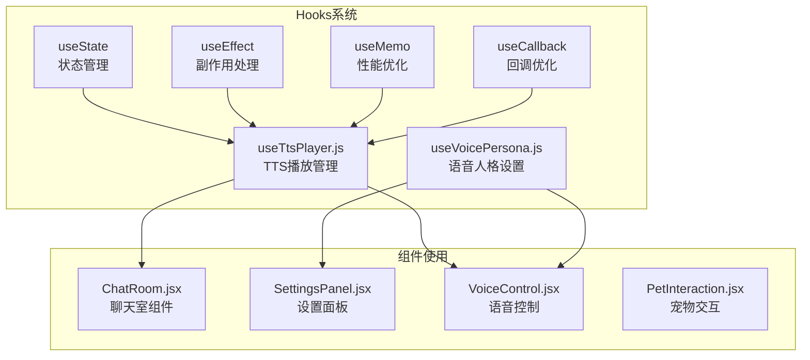

**图表来源**
- [frontend/student-h5/src/hooks/useTtsPlayer.js](file://frontend/student-h5/src/hooks/useTtsPlayer.js)
- [frontend/student-h5/src/hooks/useVoicePersona.js](file://frontend/student-h5/src/hooks/useVoicePersona.js)
- [frontend/student-h5/src/components/ChatRoom.jsx](file://frontend/student-h5/src/components/ChatRoom.jsx)

**章节来源**
- [frontend/student-h5/src/hooks/useTtsPlayer.js](file://frontend/student-h5/src/hooks/useTtsPlayer.js)
- [frontend/student-h5/src/hooks/useVoicePersona.js](file://frontend/student-h5/src/hooks/useVoicePersona.js)

## 主题提供者系统

### 主题架构设计
系统实现了完整的主题提供者模式，支持动态主题切换和个性化定制：

#### ThemeProvider组件
作为整个应用的主题上下文提供者：
- **主题状态管理**：集中管理当前激活的主题
- **主题切换API**：提供统一的主题切换接口
- **默认主题配置**：预定义多种主题方案
- **主题持久化**：用户主题偏好的本地存储

#### 主题系统集成
- **CSS变量驱动**：基于CSS自定义属性的主题变量系统
- **运行时切换**：无需刷新页面的即时主题切换
- **动画过渡**：主题切换时的平滑视觉效果
- **无障碍支持**：符合WCAG标准的对比度要求

### 主题类型支持
- **浅色主题**：适合白天使用的明亮配色方案
- **深色主题**：适合夜间使用的暗色配色方案
- **高对比度主题**：为视力障碍用户提供更好的可读性
- **自定义主题**：支持用户创建个人化的主题方案

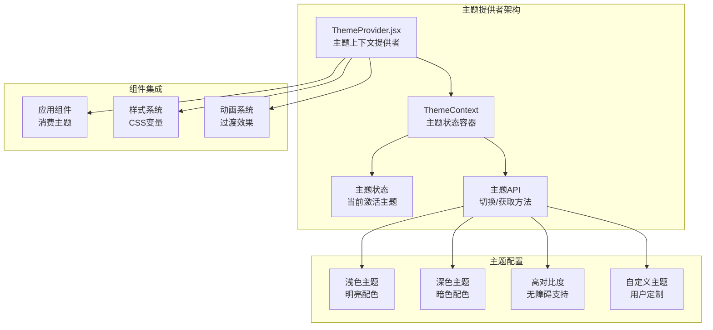

**图表来源**
- [frontend/student-h5/src/theme/ThemeProvider.jsx](file://frontend/student-h5/src/theme/ThemeProvider.jsx)

**章节来源**
- [frontend/student-h5/src/theme/ThemeProvider.jsx](file://frontend/student-h5/src/theme/ThemeProvider.jsx)

## 情感化排版系统

### 情感化字体设计
系统实现了基于用户情绪状态的动态字体排版系统，为用户提供更加个性化的阅读体验：

#### 情绪感知字体
- **情绪映射**：将用户情绪状态映射到相应的字体样式
- **动态调整**：根据对话内容自动调整字体大小、行高和间距
- **情感色彩**：不同情绪状态对应不同的字体颜色和透明度
- **平滑过渡**：字体变化时的流畅动画效果

#### 字体层次结构
- **标题字体**：加粗、大字号，突出重要信息
- **正文字体**：标准字号，保证阅读舒适性
- **辅助字体**：较小字号，用于次要信息展示
- **强调字体**：特殊样式，用于关键内容突出

### 排版响应式系统
- **自适应布局**：根据屏幕尺寸和设备类型自动调整排版
- **多语言支持**：针对不同语言的字符特性优化显示效果
- **无障碍优化**：确保所有用户都能获得良好的阅读体验
- **性能优化**：字体资源的懒加载和缓存策略

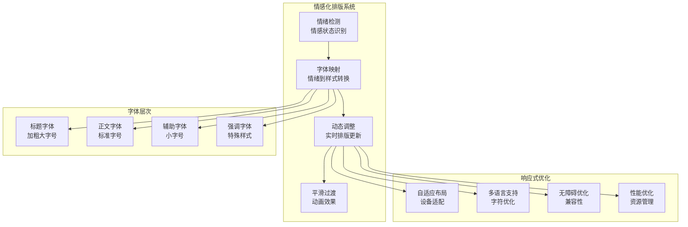

**图表来源**
- [frontend/student-h5/src/components/ChatRoom.jsx](file://frontend/student-h5/src/components/ChatRoom.jsx)
- [frontend/student-h5/src/index.css](file://frontend/student-h5/src/index.css)

**章节来源**
- [frontend/student-h5/src/components/ChatRoom.jsx](file://frontend/student-h5/src/components/ChatRoom.jsx)
- [frontend/student-h5/src/index.css](file://frontend/student-h5/src/index.css)

## 动态视觉反馈系统

### 视觉反馈机制
系统实现了丰富的动态视觉反馈机制，提升用户的交互体验和情感连接：

#### 情绪响应式动画
- **情绪触发**：根据用户情绪状态触发相应的动画效果
- **颜色渐变**：背景色和边框色的平滑渐变过渡
- **形状变换**：按钮和容器的形状动态变化
- **粒子效果**：微妙的粒子动画增强视觉吸引力

#### 交互反馈系统
- **点击反馈**：按钮点击时的视觉确认效果
- **输入反馈**：文本输入时的实时验证和提示
- **加载状态**：异步操作的进度指示和状态反馈
- **错误提示**：友好的错误信息和解决建议

### 动画性能优化
- **GPU加速**：使用CSS transform和opacity属性实现硬件加速
- **请求帧优化**：使用requestAnimationFrame确保流畅动画
- **内存管理**：及时清理动画资源和事件监听器
- **降级处理**：在不支持高级特性的设备上提供基础动画

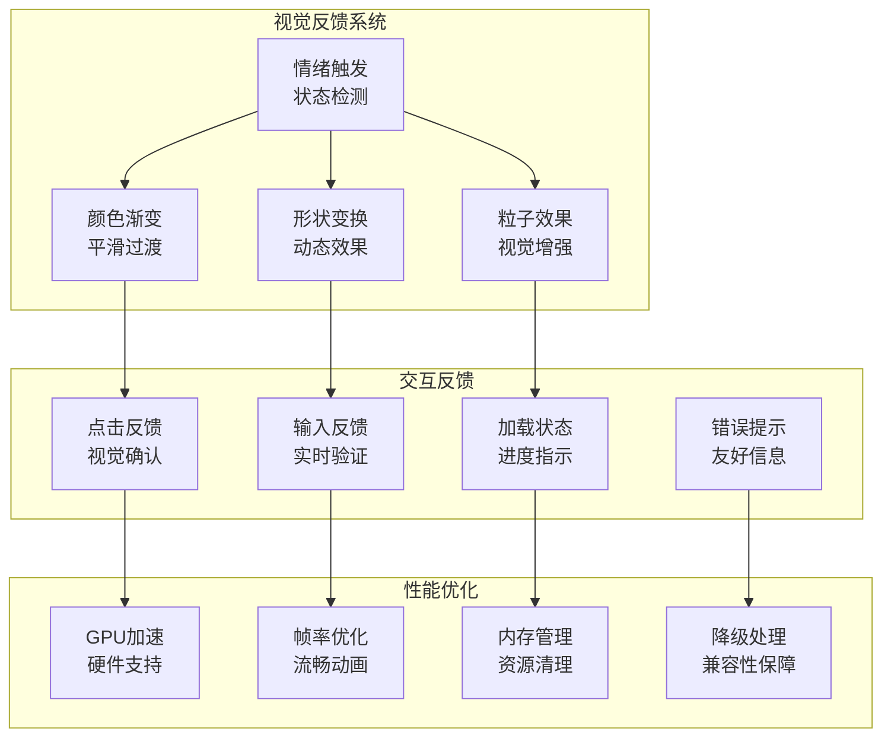

**图表来源**
- [frontend/student-h5/src/components/ChatRoom.jsx](file://frontend/student-h5/src/components/ChatRoom.jsx)
- [frontend/student-h5/src/index.css](file://frontend/student-h5/src/index.css)

**章节来源**
- [frontend/student-h5/src/components/ChatRoom.jsx](file://frontend/student-h5/src/components/ChatRoom.jsx)
- [frontend/student-h5/src/index.css](file://frontend/student-h5/src/index.css)

## 字体优化系统

### 元圈圆体字体优化
系统对元圈圆体字体进行了全面的优化，提升中文显示效果和加载性能：

#### 字体加载优化
- **预加载策略**：关键字体的预加载和优先级管理
- **懒加载机制**：非关键字体的按需加载和缓存
- **格式优化**：WOFF2格式的字体文件压缩和优化
- **CDN加速**：字体文件的CDN分发和边缘缓存

#### 显示效果优化
- **抗锯齿优化**：针对不同设备的字体渲染优化
- **子像素渲染**：利用子像素技术提升字体清晰度
- **字体回退**：优雅降级到系统字体的备用方案
- **缩放适配**：不同分辨率下的字体缩放和适配

### 字体性能监控
- **加载时间监控**：字体加载时间的实时监控和告警
- **渲染性能**：字体渲染性能的分析和优化
- **内存占用**：字体资源的内存使用情况监控
- **错误处理**：字体加载失败的回退和错误处理

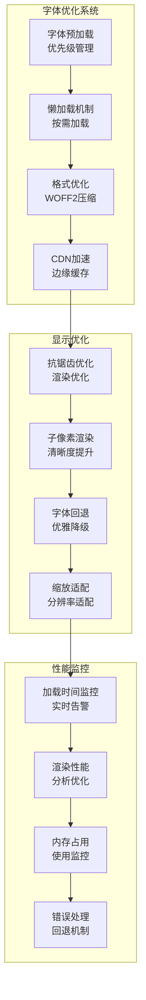

**图表来源**
- [frontend/student-h5/public/fonts/](file://frontend/student-h5/public/fonts/)
- [frontend/student-h5/src/index.css](file://frontend/student-h5/src/index.css)

**章节来源**
- [frontend/student-h5/public/fonts/](file://frontend/student-h5/public/fonts/)
- [frontend/student-h5/src/index.css](file://frontend/student-h5/src/index.css)

## 架构总览
前端采用双应用架构模式，分别服务于不同用户群体，通过统一的后端API进行交互。整体架构强调模块化、可维护性和用户体验，并新增了宠物交互系统、情感化排版、动态视觉反馈和字体优化系统。

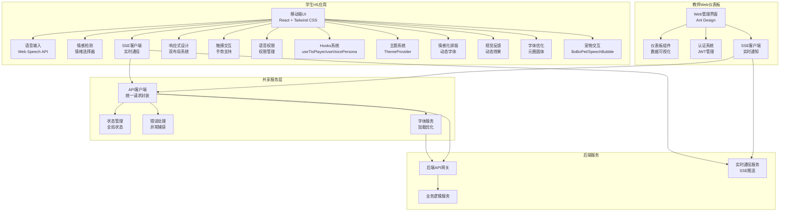

**图表来源**
- [frontend/student-h5/src/App.jsx](file://frontend/student-h5/src/App.jsx)
- [frontend/teacher-web/src/App.jsx](file://frontend/teacher-web/src/App.jsx)
- [frontend/student-h5/src/components/ChatRoom.jsx](file://frontend/student-h5/src/components/ChatRoom.jsx)
- [frontend/teacher-web/src/pages/Dashboard.jsx](file://frontend/teacher-web/src/pages/Dashboard.jsx)
- [frontend/student-h5/src/hooks/useTtsPlayer.js](file://frontend/student-h5/src/hooks/useTtsPlayer.js)
- [frontend/student-h5/src/theme/ThemeProvider.jsx](file://frontend/student-h5/src/theme/ThemeProvider.jsx)

## 详细组件分析

### 学生H5移动端应用架构

#### 应用入口与初始化
应用基于React 18和Vite构建，采用现代化的开发体验和构建优化。

**章节来源**
- [frontend/student-h5/src/main.jsx](file://frontend/student-h5/src/main.jsx)
- [frontend/student-h5/package.json](file://frontend/student-h5/package.json)

#### 聊天室组件实现
聊天室组件是核心功能模块，实现了完整的对话交互流程：

- **消息渲染**：支持文本消息的富文本显示和格式化
- **语音输入**：集成Web Speech API实现语音转文字功能
- **实时通信**：通过SSE接收服务器推送的消息更新
- **情感标记**：自动识别和标记消息中的情感倾向
- **架构改进**：组件化重构，提升可维护性和性能
- **动态视觉反馈**：新增情绪响应的动画和视觉效果
- **情感化排版**：根据对话内容自动调整字体样式
- **宠物驱动交互**：集成BoBoPet和SpeechBubble组件，提供拟人化对话体验

**章节来源**
- [frontend/student-h5/src/components/ChatRoom.jsx](file://frontend/student-h5/src/components/ChatRoom.jsx)

#### 宠物交互组件
BoBoPet.jsx和SpeechBubble.jsx构成了完整的宠物交互系统：

- **宠物角色管理**：BoBoPet组件维护宠物的状态、表情和行为模式
- **对话气泡系统**：SpeechBubble组件提供智能的对话气泡展示和动画效果
- **情感同步**：宠物表情与对话情感状态实时同步
- **交互反馈**：用户操作时宠物的个性化响应
- **动画系统**：丰富的宠物动画和微表情效果

**章节来源**
- [frontend/student-h5/src/components/BoBoPet.jsx](file://frontend/student-h5/src/components/BoBoPet.jsx)
- [frontend/student-h5/src/components/SpeechBubble.jsx](file://frontend/student-h5/src/components/SpeechBubble.jsx)

#### 情感检测组件
情感选择组件提供了直观的情绪状态管理：

- **情绪可视化**：使用表情符号和颜色编码展示不同情绪
- **状态同步**：与聊天室组件保持状态同步
- **历史记录**：记录用户情绪变化轨迹
- **重新设计**：优化了用户界面和交互体验
- **排版联动**：与情感化排版系统无缝集成

**章节来源**
- [frontend/student-h5/src/components/EmotionSelect.jsx](file://frontend/student-h5/src/components/EmotionSelect.jsx)

#### 语音权限管理组件
新增的VoiceConsentDialog组件专门处理语音功能的权限管理：

- **权限请求**：优雅地请求麦克风访问权限
- **用户同意**：清晰的权限说明和用户确认流程
- **错误处理**：权限被拒绝时的降级处理
- **用户体验**：友好的权限提示和引导界面

**章节来源**
- [frontend/student-h5/src/components/VoiceConsentDialog.jsx](file://frontend/student-h5/src/components/VoiceConsentDialog.jsx)

### 教师Web管理仪表板架构

#### 应用结构与路由
基于Ant Design组件库构建的企业级管理界面：

- **布局管理**：侧边栏导航、顶部工具栏和主内容区
- **权限控制**：基于角色的访问控制和菜单动态生成
- **主题定制**：支持深色模式和品牌化定制

**章节来源**
- [frontend/teacher-web/src/App.jsx](file://frontend/teacher-web/src/App.jsx)
- [frontend/teacher-web/src/main.jsx](file://frontend/teacher-web/src/main.jsx)

#### 仪表板页面
仪表板页面提供数据可视化和监控功能：

- **数据统计**：学生咨询量、风险等级分布等关键指标
- **实时监控**：通过SSE接收实时预警通知
- **报表导出**：支持数据导出和PDF报告生成

**章节来源**
- [frontend/teacher-web/src/pages/Dashboard.jsx](file://frontend/teacher-web/src/pages/Dashboard.jsx)

#### 认证系统
完整的用户认证和授权机制：

- **JWT管理**：令牌存储、刷新和过期处理
- **会话保持**：自动重连和状态恢复
- **安全校验**：输入验证和XSS防护

**章节来源**
- [frontend/teacher-web/src/pages/Login.jsx](file://frontend/teacher-web/src/pages/Login.jsx)

### 实时通信架构

#### SSE客户端实现
基于Server-Sent Events的实时通信方案：

- **连接管理**：自动重连、心跳检测和断线恢复
- **消息处理**：流式数据处理和增量更新
- **错误处理**：网络异常处理和降级策略

#### 语音输入功能
集成Web Speech API的语音识别能力：

- **浏览器兼容**：跨浏览器的语音识别支持
- **实时转写**：语音到文字的实时转换
- **音频处理**：降噪和音量调节功能

**章节来源**
- [frontend/student-h5/src/components/ChatRoom.jsx](file://frontend/student-h5/src/components/ChatRoom.jsx)

## 全感官交互系统

### 视觉主题系统
系统实现了完整的视觉主题架构，支持多种主题模式和个性化定制：

- **主题切换**：支持浅色、深色和自定义主题的动态切换
- **CSS变量管理**：基于CSS自定义属性的主题变量系统
- **动画过渡**：主题切换时的平滑动画效果
- **无障碍支持**：符合WCAG标准的对比度和可读性要求

### TTS语音合成系统
集成Text-to-Speech功能，提供自然的语音反馈：

- **语音引擎**：基于Web Speech API的语音合成
- **情感语音**：根据对话情感调整语音语调
- **语速控制**：可调节的语音播放速度
- **多语言支持**：支持中英文等多种语言的语音输出

### 语音情感分析
实现实时的语音情感识别和分析：

- **情感检测**：分析用户语音中的情感倾向
- **情绪映射**：将语音情感映射到具体的情绪标签
- **实时反馈**：在界面上实时显示情感分析结果
- **历史追踪**：记录用户情感变化趋势

### 多模态交互体验
整合视觉、听觉和触觉的多模态交互：

- **视觉反馈**：丰富的动画效果和视觉提示
- **听觉反馈**：语音合成和音效反馈
- **触觉反馈**：移动设备的振动反馈
- **一致性设计**：多感官体验的一致性和协调性

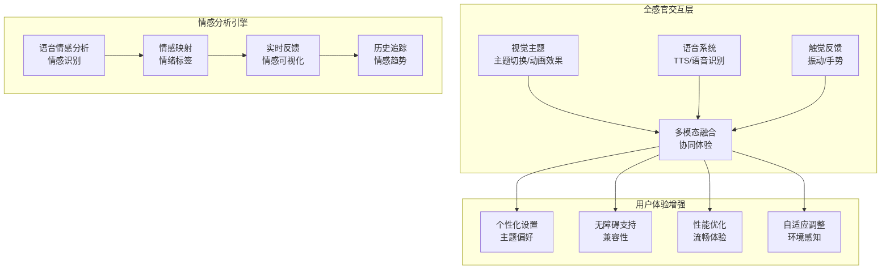

**图表来源**
- [design/16_语音情感分析设计方案.md](file://design/16_语音情感分析设计方案.md)

**章节来源**
- [design/16_语音情感分析设计方案.md](file://design/16_语音情感分析设计方案.md)

## 响应式设计系统

### 双布局系统实现
学生H5应用实现了基于1024px断点的智能双布局系统，能够根据设备屏幕尺寸自动切换布局模式：

- **移动端布局**：针对手机设备的单列垂直布局，最大化利用纵向空间
- **平板横屏布局**：针对平板设备横屏模式的双列横向布局，提供更好的信息展示密度
- **自适应断点**：1024px作为主要断点，确保在不同设备上的最佳显示效果

### 平板横屏模式优化
针对平板设备横屏使用场景进行了专门优化：

- **双列信息展示**：左侧显示聊天区域，右侧显示情感状态和操作面板
- **触控手势支持**：优化的滑动、缩放和多点触控操作
- **空间利用率**：充分利用横屏宽屏优势，提升信息密度和可读性

### EmotionSelect组件重新设计
情感选择组件经过全面重新设计，提供更直观的交互体验：

- **视觉层次优化**：改进的颜色方案和图标设计
- **交互反馈增强**：更明显的选中状态和过渡动画
- **无障碍支持**：键盘导航和屏幕阅读器兼容性

### ChatRoom组件架构改进
聊天室组件进行了架构层面的重构和优化：

- **组件拆分**：将大型组件拆分为更小的可复用子组件
- **状态管理优化**：改进的状态更新机制，减少不必要的重渲染
- **性能提升**：虚拟滚动和懒加载技术应用于长消息列表
- **宠物集成**：完全支持宠物驱动的交互模式

### 触摸交互增强
全面增强了移动设备的触摸交互体验：

- **手势识别**：支持滑动、长按、双击等常用手势
- **触觉反馈**：在关键操作时提供振动反馈
- **流畅动画**：优化的过渡动画和微交互效果

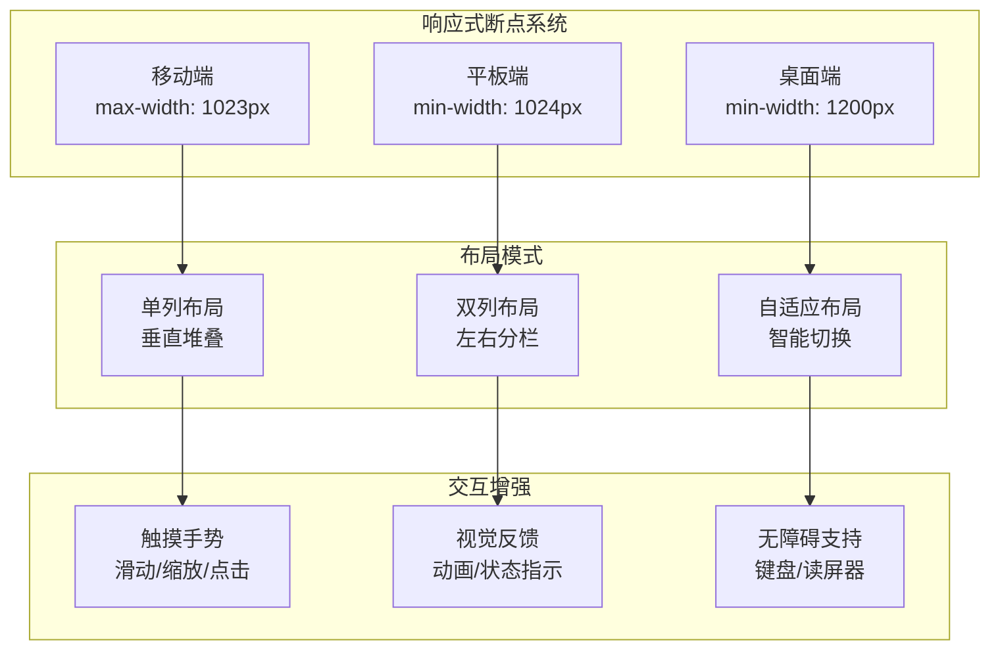

**图表来源**
- [frontend/student-h5/src/index.css](file://frontend/student-h5/src/index.css)
- [frontend/student-h5/src/components/ChatRoom.jsx](file://frontend/student-h5/src/components/ChatRoom.jsx)
- [frontend/student-h5/src/components/EmotionSelect.jsx](file://frontend/student-h5/src/components/EmotionSelect.jsx)

**章节来源**
- [frontend/student-h5/src/index.css](file://frontend/student-h5/src/index.css)
- [frontend/student-h5/src/components/ChatRoom.jsx](file://frontend/student-h5/src/components/ChatRoom.jsx)
- [frontend/student-h5/src/components/EmotionSelect.jsx](file://frontend/student-h5/src/components/EmotionSelect.jsx)

## 依赖分析
前端应用的依赖关系清晰明确，各模块间通过明确的接口进行解耦：

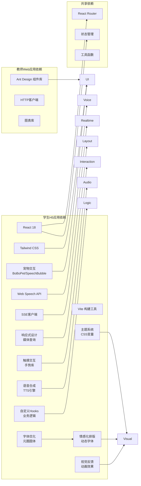

**图表来源**
- [frontend/student-h5/package.json](file://frontend/student-h5/package.json)
- [frontend/teacher-web/package.json](file://frontend/teacher-web/package.json)

**章节来源**
- [frontend/student-h5/package.json](file://frontend/student-h5/package.json)
- [frontend/teacher-web/package.json](file://frontend/teacher-web/package.json)

## 性能考虑
针对移动端和Web应用的性能优化策略：

### 首屏加载优化
- **代码分割**：按路由和功能模块进行懒加载
- **资源压缩**：图片和静态资源的自动压缩和优化
- **缓存策略**：浏览器缓存和服务端缓存协同

### 运行时性能
- **虚拟列表**：长列表数据的虚拟化渲染
- **防抖节流**：高频操作的频率限制
- **内存管理**：及时清理不用的引用和事件监听器
- **响应式优化**：避免不必要的重渲染和布局计算

### 网络优化
- **请求合并**：批量请求和去重机制
- **离线支持**：Service Worker缓存和离线数据同步
- **CDN加速**：静态资源的CDN分发

### 移动端特定优化
- **触摸性能**：优化的触摸事件处理和动画性能
- **电池续航**：减少CPU和GPU密集型操作
- **内存占用**：严格控制移动端内存使用

### 全感官交互性能优化
- **语音处理优化**：异步处理语音识别和合成，避免阻塞主线程
- **主题切换优化**：使用CSS变量实现零开销的主题切换
- **动画性能**：使用GPU加速的CSS动画和transform属性
- **资源预加载**：关键资源的预加载和缓存策略

### Hooks性能优化
- **记忆化优化**：使用useMemo和useCallback避免不必要的计算
- **依赖数组优化**：精确的依赖声明减少重渲染
- **条件渲染**：基于状态的智能组件渲染
- **内存泄漏防护**：正确的清理函数和事件监听器管理

### 情感化排版性能优化
- **字体懒加载**：非关键字体的按需加载和缓存
- **动画优化**：使用CSS transform和opacity实现硬件加速
- **内存管理**：及时清理字体资源和动画对象
- **降级处理**：在不支持高级特性的设备上提供基础功能

### 宠物交互性能优化
- **动画优化**：宠物动画的GPU加速和帧率控制
- **状态管理**：宠物状态的轻量级更新机制
- **资源管理**：宠物资源的懒加载和缓存策略
- **交互响应**：用户操作的即时反馈和无延迟处理

## 故障排查指南

### 常见问题定位
- **语音输入失败**：检查浏览器权限设置和麦克风设备可用性
- **SSE连接断开**：查看网络连接状态和服务器推送服务
- **页面渲染卡顿**：分析组件重渲染频率和大数据量处理
- **样式错乱**：检查Tailwind CSS配置和响应式断点设置
- **触摸交互异常**：验证手势识别和触摸事件处理
- **TTS语音问题**：检查浏览器TTS支持和语音引擎配置
- **主题切换异常**：验证CSS变量定义和主题切换逻辑
- **字体加载失败**：检查字体文件路径和网络请求状态
- **动画性能问题**：分析动画帧率和内存使用情况
- **宠物交互异常**：检查宠物组件状态和动画资源加载

### 诊断工具
- **浏览器开发者工具**：Network面板查看请求详情
- **React DevTools**：组件树分析和性能监控
- **控制台日志**：结构化日志输出和错误追踪
- **移动端调试**：Chrome远程调试和真机测试

### 调试技巧
- **环境变量**：区分开发和生产环境的调试配置
- **Mock数据**：前后端分离开发时的数据模拟
- **单元测试**：核心功能的自动化测试覆盖
- **响应式测试**：多设备尺寸和方向的兼容性测试

### 全感官交互调试
- **语音权限调试**：检查浏览器权限API和麦克风访问
- **TTS调试**：验证语音合成API支持和语音参数配置
- **主题调试**：检查CSS变量定义和主题切换事件
- **性能监控**：监控语音处理和动画性能指标

### Hooks调试技巧
- **Hook执行顺序**：确保Hook调用顺序的一致性
- **依赖数组检查**：验证useEffect依赖数组的完整性
- **状态更新追踪**：使用React DevTools监控状态变化
- **性能分析**：识别Hook中的性能瓶颈

### 情感化排版调试
- **字体加载调试**：检查字体文件加载状态和网络请求
- **动画调试**：验证CSS动画和JavaScript动画的执行
- **性能分析**：监控字体渲染和动画性能指标
- **兼容性测试**：测试不同设备和浏览器的显示效果

### 宠物交互调试
- **宠物状态调试**：检查宠物组件的状态管理和生命周期
- **动画资源调试**：验证宠物动画资源的加载和缓存
- **交互事件调试**：跟踪用户操作和宠物响应的事件流
- **性能监控**：监控宠物动画的帧率和内存使用情况

## 结论
经过最新更新，AI心理咨询系统的前端架构已经实现了完整的双应用部署。学生H5移动端应用提供了友好的移动端咨询体验，集成了语音输入、情感检测等智能功能；教师Web管理仪表板则提供了强大的数据管理和监控能力。两个应用都采用了现代化的React技术栈，具备良好的可维护性和扩展性。

**最新改进**：系统新增了完整的宠物交互系统，包括BoBoPet.jsx和SpeechBubble.jsx组件，以及品牌统一化的'波波小精灵'主题系统。ChatRoom组件进行了重大重构以支持新的宠物驱动交互模式。系统还实现了情感化排版系统，基于用户情绪状态的动态字体样式和视觉反馈机制。聊天界面增强了动态视觉反馈能力，能够根据对话内容和用户情绪状态提供个性化的视觉体验。元圈圆体字体得到了全面优化，提升了中文显示的清晰度和美观度。CSS系统进行了全面的增强，实现了情感响应式的样式切换和动画效果，为用户提供了更加自然和舒适的咨询体验。**架构重大升级**：引入了全新的宠物交互系统、情感化排版系统、动态视觉反馈系统和字体优化系统，构建了更加智能化和个性化的用户体验架构。

通过SSE实现的实时通信机制确保了数据的即时同步，而完善的错误处理和性能优化策略保障了系统的稳定性。新增的宠物交互系统和情感化排版系统为用户提供了更加丰富和自然的咨询体验，包括拟人化的宠物角色、情绪响应的字体样式、动态的视觉动画效果和优化的字体显示质量。未来可以在PWA支持、国际化和本地化等方面继续完善，进一步提升用户体验。

## 附录

### 技术栈概览
- **前端框架**：React 18 + TypeScript
- **构建工具**：Vite
- **样式方案**：Tailwind CSS + Ant Design
- **实时通信**：Server-Sent Events (SSE)
- **语音处理**：Web Speech API
- **状态管理**：React Context + Local Storage
- **响应式设计**：CSS媒体查询 + 自定义断点系统
- **触摸交互**：原生触摸事件 + 手势识别
- **视觉主题**：CSS变量 + 主题切换系统
- **TTS语音**：Web Speech Synthesis API
- **情感分析**：语音情感识别 + 情绪映射
- **Hooks系统**：自定义React Hooks + 业务逻辑封装
- **情感化排版**：动态字体样式 + 情绪响应式排版
- **视觉反馈**：CSS动画 + JavaScript动画 + GPU加速
- **字体优化**：元圈圆体 + WOFF2格式 + CDN缓存
- **宠物交互**：BoBoPet组件 + SpeechBubble组件 + 动画系统

### 开发环境要求
- Node.js 18+ 
- npm 或 yarn包管理器
- 现代浏览器（Chrome 90+, Firefox 88+, Safari 14+）
- 移动设备调试工具（iOS Safari / Android Chrome）
- 麦克风设备（用于语音功能测试）
- 稳定的网络连接（用于字体和资源加载）

### 部署配置
- **静态资源托管**：支持CDN部署
- **环境变量**：支持多环境配置
- **Docker容器化**：提供完整的容器化部署方案
- **响应式优化**：针对不同设备的资源优化策略
- **语音功能配置**：TTS和语音识别的浏览器兼容性配置
- **字体资源优化**：WOFF2格式字体文件的CDN部署
- **缓存策略配置**：浏览器缓存和服务端缓存协同

**章节来源**
- [frontend/student-h5/package.json](file://frontend/student-h5/package.json)
- [frontend/teacher-web/package.json](file://frontend/teacher-web/package.json)
- [design/08_MVP最小可行版本.md](file://design/08_MVP最小可行版本.md)
- [design/16_语音情感分析设计方案.md](file://design/16_语音情感分析设计方案.md)
